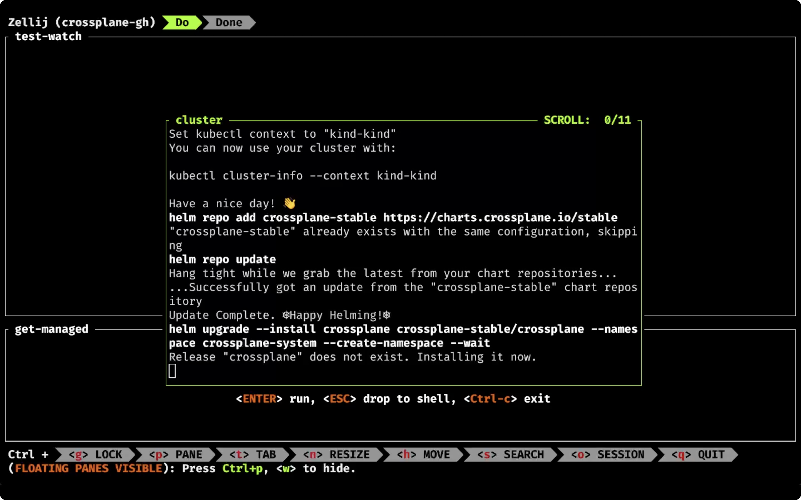

+++
archetype = "home"
title = ""
+++

# Latest Posts


## [Stop Writing Tedious Security Rules! Let Kubescape Do the Work](/security/stop-writing-tedious-security-rules-let-kubescape-do-the-work)

Implementation and maintenance of security is **tedious**, especially when runtime portion of it is concerned. For example, if we'd like to be notified when a potential breach is happening, we'll likely use a tool like [Falco](https://www.google.com/search?q=falco+security&sourceid=chrome&ie=UTF-8). It's a great tool. It's potentially one of the best if not the best tool of it's kind. It allows us to define an infinite number of rules that, when one of them is met, will fire notifications. That's the problem though. We have to define all those rules or, at least, accept a significant number of rules that are available out of the box. Essentially, we need to predict everything that should not be allowed to happen or, if we prefer the other way around, everything that is allowed. That is tedious and you are likely going to end up frustrated at best, in an asylum at worst. After all, **who can predict all the bad things that might happen?** and who is fully aware of all high and low level calls that applications are making? I certainly can't.

**[Full article >>](/security/stop-writing-tedious-security-rules-let-kubescape-do-the-work)**

---


## [Stop Losing Requests! Learn Graceful Shutdown Techniques](/containers/stop-losing-requests-learn-graceful-shutdown-techniques)

Look at this.

I will send a request to the application,...

```sh
curl "http://silly-demo.127.0.0.1.nip.io/fibonacci?number=50"
```

...and simulate failure or upgrade or any similar action by deleting the Pod where the application is running.

```sh
kubectl --namespace a-team delete pod \
    --selector app.kubernetes.io/name=silly-demo
```

The output of the `curl` command is as follows.

```
<html>
<head><title>502 Bad Gateway</title></head>
<body>
<center><h1>502 Bad Gateway</h1></center>
<hr><center>nginx</center>
</body>
</html>
```

Since we initiated the delete process before the server returned a response we got `502 Bad Gateway` message. The application was deleted before it could respond and I, the user of that application, failed to get what I was looking for. That's horrible experience that could have been improved by enabling the application to shut down gracefully.

**[Full article >>](/containers/stop-losing-requests-learn-graceful-shutdown-techniques)**

---


## [Surviving Backstage with Roadie: A Developer's Nightmare or Dream?](/internal-developer-platforms/surviving-backstage-with-roadie-a-developers-nightmare-or-dream)

Today I want to talk about **potentially the most important tool in your toolbox**. I want to talk about a tool that might **enable everyone** in your organization **to be more productive and self-sufficient**. Yet, the tool I want to talk about might win an award for the **least user-friendly**, **hardest to maintain**, and, generally speaking, a tool that might cause you to have **nightmares** and spend a small fortune on a psychologist.

It's a tool that I recognize as being **one of the most impactful tools** which, honestly, I do not like at all, yet most of those who use it swear by it.

Did you guess what that tool is?

**[Full article >>](/internal-developer-platforms/surviving-backstage-with-roadie-a-developers-nightmare-or-dream)**

---


## [Master Terminal Multiplexing with Zellij in Minutes!](/terminal/master-terminal-multiplexing-with-zellij-in-minutes)

Let me show you something exciting, something that makes me much more productive.

I am going to execute command `zellij`, specify a name of the session (`crossplane-kubernetes`), and a layout (`test-layout.kdl`), and...

```sh
zellij --session crossplane-kubernetes --layout test-layout.kdl
```

BOOM!



There's everything I need, nicely split into tabs and panes.

**[Full article >>](/terminal/master-terminal-multiplexing-with-zellij-in-minutes)**

---


## [Automate Everything: How One Manifest Powers Your Entire DevOps Pipeline](/internal-developer-platforms/automate-everything-how-one-manifest-powers-your-entire-devops-pipeline)

Today I want to get back to the first steps when developer platforms are concerned. I want to enable developers to start a new project.

**[Full article >>](/internal-developer-platforms/automate-everything-how-one-manifest-powers-your-entire-devops-pipeline)**

---


## [The Dark Side of Open Source: Are We All Just Selfish?](/misc/the-dark-side-of-open-source-are-we-all-just-selfish)

There's a lot of talk about open source and about some companies, big and small, taking advantage of it, and about some other companies changing licenses of their projects to be less permissive. Those conversations often end up with people yelling at each other. "**Damn MongoDB for changing their license!**" "**AWS is evil for taking advantage of Elastic!**" "**Env0 is taking advantage of HashiCorp!**" "**F\*\*K HashiCorp!**" "**Long live Elastic!**"

**[Full article >>](/misc/the-dark-side-of-open-source-are-we-all-just-selfish)**
