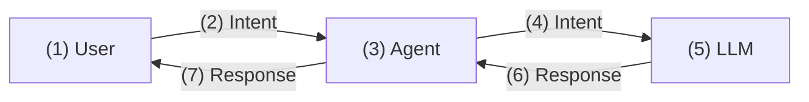
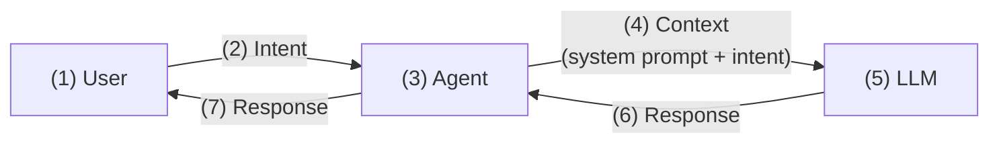
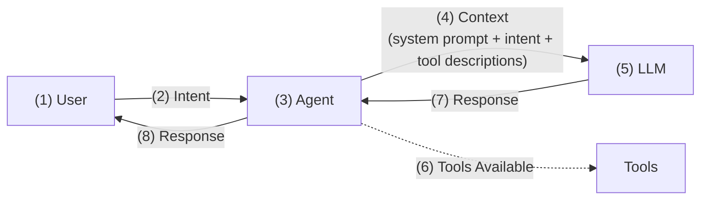
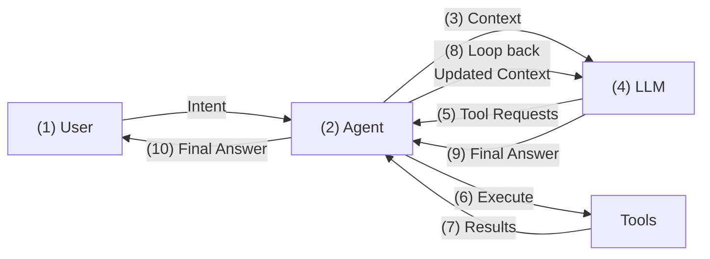

+++
title = 'AI Agent Architecture Explained: LLMs, Context & Tool Execution'
date = 2025-11-10T15:00:00+00:00
draft = false
+++

You type "Create a PostgreSQL database in AWS" into Claude Code or Cursor, hit enter, and boom - it just works. Database created, configured, running. Like magic.

But it's not magic. Behind that simple request is an intricate dance between you, an orchestrator called an agent, and a massive language model. Most people think the AI is doing everything. They're wrong. The AI can't touch your files, can't run commands, can't do anything on its own.

So how the hell does it work? How does your intent turn into actual results? That's what we're going to break down. The real architecture. The three key players. And why understanding this matters if you're using these tools every day.

<!--more-->



## How Do Agents Work?

Let's start with a simple scenario. Imagine you're using Claude Code, Cursor, or any other coding agent, and you type this intent:

[user]
```text
Create a PostgreSQL database in AWS.
```

What happens when you hit enter? You get a PostgreSQL database in AWS. That's the promise, right? But how the hell does that actually work? What's happening behind the scenes to turn that simple request into reality?

Before we dive in, quick terminology note. When people say "AI agent" or just "agent", they usually mean the whole damn thing, the entire system. I'm going to be more precise here. I'll call that complete system an **agentic system**. When I say **agent**, I mean specifically the orchestration layer sitting between you and the LLM. Keep that distinction in mind.

Let's start by defining the key players.

First, the **User**. That's you. You provide intent, whether it's a task, a request, or a question. You get responses back, and you can clarify when needed.

Next, the **Agent**. This sits between you and the LLM, acting as an intermediary.

Finally, the **LLM** - the Large Language Model. This is the "brain" doing the reasoning and decision-making. Think GPT-5, Claude, models like that. It receives context from the agent and generates responses.

These are basic definitions. As we move through increasingly complex architectures, we'll expand on what each of these actors actually does.

The simplest possible architecture would have the User (1) sending intent (2) to an Agent (3), which passes that intent (4) to the LLM (5), which responds back (6) through the same chain (7). If anyone actually built systems that way, it was a long time ago. Way too simplistic. We need more.



So what's missing? Let's talk about system prompts.

A **system prompt** is the foundational instruction that defines how an LLM behaves. It sets the role, the behavior, the capabilities. Agent developers set these prompts - they're completely invisible to you as a user. Here's an example: "Always explain your reasoning step-by-step before providing answers." Short, but it completely changes how the LLM responds.

Now, with system prompts in the mix, we get a more sophisticated setup. You (1) send intent (2) to the agent (3). The agent sends context (4) to the LLM (5) - not just raw intent. That context includes the system prompt plus your intent. The LLM generates a response (6) that goes back to the agent, then to you (7).

This architecture - User to Agent to LLM with context - is essentially what you get with something like ChatGPT. It's mainly for answering questions, having conversations.



So what exactly is context?

**Context** is everything sent to the LLM in a single request. It includes the system prompt, conversation history, your intent, and any other information the LLM needs to generate a response. It's the complete picture the LLM sees.

That covers the basics - the key players and how they communicate. But this architecture still can't do much beyond answering questions. To actually accomplish tasks, we need something more.

## How AI Agent Loops Work?

Even with system prompts and context, agents can't do real work. They need tools.

**Tools** are functions the agent can execute on behalf of the LLM. Things like reading files, executing bash commands, searching the web, editing code. The LLM requests tools, the agent executes them, and results go back into the context.

How does the LLM know which tools to execute?

Tool descriptions are included in the context. The agent sends tool names, parameters, descriptions - everything the LLM needs to know what's available. The LLM analyzes your intent, looks at available tools, then requests specific tools with specific parameters. Agent executes those requests and returns results.

With tools in the picture, the roles expand. The **User** now also reviews and approves actions when needed - important when tools are making actual changes. The **Agent** becomes an intermediary between user, LLM, and tools. It executes tools requested by the LLM. Crucially, it never makes decisions - it only facilitates communication and execution. And the **LLM** now generates responses and requests tool executions. But it never executes tools directly - it only requests them.

Now we have a user (1) sending intent (2) to the agent (3). The agent sends context (4) - which includes system prompt, intent, and tool descriptions - to the LLM (5). The LLM now knows that tools (6) are available. The LLM generates a response (7) back to the agent, then to you (8).



But wait - how can the LLM instruct the agent to execute tools if all it does is generate a response that gets sent back to you? If the LLM just responds once, how does it ever trigger tool execution?

The answer is loops.

An **agent loop** is the cycle where the agent (1) sends context to the LLM, the LLM responds with either tool requests or a final answer (2), the agent executes those tools (3), results get added to the context (4), and the process repeats until the LLM provides the final response (5).

With loops, the agent's role expands again. It still does everything we mentioned, but now it also manages the agentic loop - plan, act, observe, repeat. And it builds and maintains the context that gets sent to the LLM with each iteration.

The LLM's role also gets a crucial clarification: it's **stateless**. It has no memory between API calls. Every time the agent sends context to the LLM, it's a fresh request. The LLM only knows what's in that context - nothing more.

Here's the complete flow. You (1) send intent to the agent (2). The agent sends context (3) to the LLM (4) - that's the system prompt, your intent, and tool descriptions. The LLM can either request tools (5) or provide the final answer. If it requests tools, the agent executes them (6), gets results (7), and loops back (8) - sending updated context to the LLM again. This repeats until the LLM has enough information and sends the final answer (9) back to the agent, which sends it to you (10).



That's the core architecture. Agent manages the loop, LLM provides the reasoning, tools do the work. But there are practical considerations when you scale this up.

## MCP (Model Context Protocol) & Context Limits

Agents don't just have built-in tools. They can also integrate external tools through MCP.

**MCP** - Model Context Protocol - is a standard protocol for connecting external tools to agents in addition to those built-in tools. It allows dynamic tool integration without modifying the agent itself. Think database connectors, API clients, custom business logic. You can plug these in and the LLM gets access to them just like the built-in tools.

The architecture stays the same, but now the agent sends context to the LLM - and that context includes descriptions of both built-in tools and MCP tools. The LLM can request either built-in tools or MCP tools, the agent executes them, gets results, and loops back with updated context.

Now, there's a practical limit to all this. Context size.

**Context size** is the maximum information that can be sent to an LLM in a single request. It's measured in **tokens** - the basic unit of text processing. A token is roughly a word or part of a word. Different models have different context limits, and those limits change over time. When you exceed the limit, the context must be compacted.

**Context compacting** is the process of reducing context size when limits are hit. There are several methods. You can summarize old conversation turns. Remove less relevant tool outputs. Truncate file contents. The key is to keep the system prompt and recent messages intact - those are critical. The trade-off is obvious: reduced context means the LLM has less information to work with. Less information, potentially worse decisions.

## AI Agents Explained: Key Takeaways

So, let's bring this all together. Agents like Claude Code, Cursor, and others are orchestrators. They sit between your intent, the available tools, and the LLM. That's their role - coordination.

You provide the intent. "Create a PostgreSQL database on AWS." That's where it starts.

The LLM provides the reasoning and instructions. It figures out what needs to happen and tells the agent which tools to execute. Read this file. Run that command. Search for this information. The LLM never touches those tools directly - it just requests them.

The agent executes everything. It runs the tools, gathers the results, builds the context, and sends it back to the LLM. It manages the loop until the LLM has everything it needs to fulfill your intent.

Here's the key thing to understand: the agent is the only dumb actor in this system. It doesn't think. It doesn't decide. It only does what it's told - either by you or by the LLM. It's pure execution, no intelligence. The LLM provides the brains, you provide the intent, and the agent makes it happen.

It's a dance between three components - you, the agent, and the LLM - with the agent as the coordinator making it all work. Without the agent, the LLM is just answering questions. With the agent, it can actually do things.

