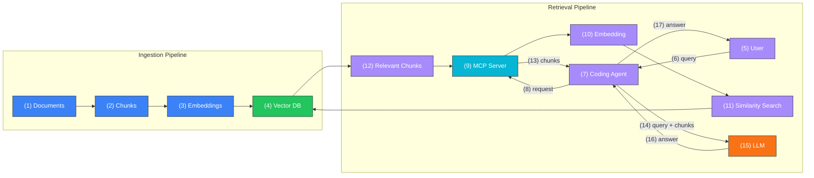

+++
title = "AI Coding Agents Are Blind to Your Company Knowledge (Here's the Fix)"
date = 2025-03-19T14:30:00+00:00
draft = false
+++

AI coding agents are incredibly capable. They can write code, generate configurations, and solve complex problems. But they have a blind spot. They only know what is publicly available. They have no idea how your company actually does things. Your internal standards, your custom abstractions, your architecture decisions, your policies. None of that exists in any AI model's training data.

So what happens? Developers use AI, get perfectly reasonable output, and then spend time fixing it to match how things are actually done in their organization.

Today I am going to show you how to close that gap. We will start with the most common approaches people try, see why they fall short, and then build a proper solution using a RAG pipeline that gives AI access to your entire company knowledge base. The example we will use is Kubernetes deployments, but the concept applies to anything: coding standards, security policies, architecture patterns, onboarding docs, you name it.

<!--more-->



## Setup

> This demo is using Claude Code as the coding agent. With a few modification, it should work with any other coding agents like Cursor, GitHub Copilot, etc. The major change you might need to make is to change `.mcp-kubernetes.json` to whichever format and location for MCP config your agent expects.

> If you don't have Claude Code already, and would like to install it, please follow [Setup Claude Code](https://code.claude.com/docs/en/setup) instructions.

```sh
git clone https://github.com/vfarcic/dot-ai

cd dot-ai

git pull

git fetch

git switch demo/knowledgebase
```

> Make sure that Docker is up-and-running. We'll use it to run create a KinD cluster.

> Watch [Nix for Everyone: Unleash Devbox for Simplified Development](https://youtu.be/WiFLtcBvGMU) if you are not familiar with Devbox. Alternatively, you can skip Devbox and install all the tools listed in `devbox.json` yourself.

```sh
devbox shell

./dot.nu setup \
    --stack-version 0.45.0 \
    --kyverno-enabled false \
    --atlas-enabled false

source .env

claude --strict-mcp-config
```

## AI Without Company Context


Let's start with a simple test. We'll ask an AI coding agent to create Kubernetes manifests for an application. Nothing fancy. Just a straightforward request.

[user]
```text
Create manifests for the Kubernetes app with the image ghcr.io/vfarcic/silly-demo:v1.5.235 in the ./tmp dir. It should be accessible through Ingress host silly-demo.127.0.0.1.nip.io.
```

[agent]
```text
⏺ Write(/Users/viktorfarcic/code/dot-ai/tmp/deployment.yaml)
  ⎿  Wrote 22 lines to /Users/viktorfarcic/code/dot-ai/tmp/deployment.yaml
       1 apiVersion: apps/v1
       2 kind: Deployment
       3 metadata:
       4   name: silly-demo
       5   labels:
       6     app: silly-demo
       7 spec:
       8   replicas: 1
       9   selector:
      10     matchLabels:
      11       app: silly-demo
      12   template:
      13     metadata:
      14       labels:
      15         app: silly-demo
      16     spec:
      17       containers:
      18         - name: silly-demo
      19           image: ghcr.io/vfarcic/silly-demo:v1.5.235
      20           ports:
      21             - containerPort: 8080
  ⎿  Running PostToolUse hooks…

⏺ Write(/Users/viktorfarcic/code/dot-ai/tmp/service.yaml)
  ⎿  Wrote 13 lines to /Users/viktorfarcic/code/dot-ai/tmp/service.yaml
       1 apiVersion: v1
       2 kind: Service
       3 metadata:
       4   name: silly-demo
       5   labels:
       6     app: silly-demo
       7 spec:
       8   selector:
       9     app: silly-demo
      10   ports:
      11     - port: 80
      12       targetPort: 8080
  ⎿  Running PostToolUse hooks…

⏺ Write(/Users/viktorfarcic/code/dot-ai/tmp/ingress.yaml)
  ⎿  Wrote 19 lines to /Users/viktorfarcic/code/dot-ai/tmp/ingress.yaml
       1 apiVersion: networking.k8s.io/v1
       2 kind: Ingress
       3 metadata:
       4   name: silly-demo
       5   labels:
       6     app: silly-demo
       7 spec:
       8   rules:
       9     - host: silly-demo.127.0.0.1.nip.io
      10       http:
      11         paths:
      12           - path: /
      13             pathType: Prefix
      14             backend:
      15               service:
      16                 name: silly-demo
      17                 port:
      18                   number: 80
  ⎿  Running PostToolUse hooks…

⏺ Created three manifests in ./tmp/:                        11:00 AM  claude-opus-4-6

  - deployment.yaml — Deploys
  ghcr.io/vfarcic/silly-demo:v1.5.235 with port 8080
  - service.yaml — ClusterIP service routing port 80 → 8080
  - ingress.yaml — Ingress with host
  silly-demo.127.0.0.1.nip.io routing to the service

  Apply them with:

  kubectl apply -f ./tmp/deployment.yaml -f
  ./tmp/service.yaml -f ./tmp/ingress.yaml
```

AI created a `Deployment`, a `Service`, and an `Ingress`. That's perfectly reasonable work. Any Kubernetes tutorial would teach you exactly this. The problem is, that's not how we deploy apps in this organization. We have internal standards, custom abstractions, and specific ways of doing things that no public AI model could possibly know about.

And that's the core issue. **AI models only know public knowledge.** They have no idea about your company's internal docs, architecture decisions, runbooks, or policies. As far as they're concerned, the standard Kubernetes way is the only way.

Now, there is already a company document that specifies exactly how we should deploy apps. The question is, how do we get that knowledge into AI? Let's try a few approaches, starting with the most common one.


The first approach is what I call tribal knowledge. Someone on the team, who may or may not have actually read the docs, types what they remember. It's the "just tell AI what you know" approach. So let's do exactly that. We'll tell AI that our company uses a custom resource for deployments.

[user]
```text
In our company, we use apps.devopstoolkit.live for deploying apps to Kubernetes. The CRD should be in the cluster we're connected to.
```

[agent]
```text
⏺ Let me look up the CRD to understand the custom resource  11:15 AM  claude-opus-4-6
  schema.

⏺ Bash(kubectl get crd -l "group=apps.devopstoolkit.live" 2>/dev/null || kubectl get crd |
      grep devopstoolkit 2>/dev/null)
  ⎿  (No content)

⏺ Bash(kubectl get crd --no-headers 2>/dev/null | grep -i devops)
  ⎿  apps.devopstoolkit.live
     2026-02-09T15:44:01Z
     ...

⏺ Bash(kubectl get crd apps.devopstoolkit.live -o json | jq
      '.spec.versions[0].schema.openAPIV3Schema')
  ...


⏺ Bash(kubectl get crd apps.devopstoolkit.live -o json | jq '{group: .spec.group, kind:
      .spec.names.kind, plural: .spec.names.plural, version: .spec.versions[0].name}')
  ...

⏺ Now I understand the CRD. Let me replace the three        11:15 AM  claude-opus-4-6
  separate manifests with a single custom resource.

⏺ Write(/Users/viktorfarcic/code/dot-ai/tmp/app.yaml)
  ⎿  Wrote 10 lines to /Users/viktorfarcic/code/dot-ai/tmp/app.yaml
      1 apiVersion: devopstoolkit.live/v1beta1
      2 kind: App
      3 metadata:
      4   name: silly-demo
      5 spec:
      6   image: ghcr.io/vfarcic/silly-demo
      7   tag: v1.5.235
      8   host: silly-demo.127.0.0.1.nip.io
      9   port: 8080
  ⎿  Running PostToolUse hooks…

⏺ Bash(rm /Users/viktorfarcic/code/dot-ai/tmp/deployment.yaml
      /Users/viktorfarcic/code/dot-ai/tmp/service.yaml
      /Users/viktorfarcic/code/dot-ai/tmp/ingress.yaml)
  ⎿  (No content)

⏺ Replaced the three separate manifests with a single       11:16 AM  claude-opus-4-6
  ./tmp/app.yaml using the App CRD from the cluster. It
  sets:

  - image: ghcr.io/vfarcic/silly-demo
  - tag: v1.5.235
  - host: silly-demo.127.0.0.1.nip.io
  - port: 8080

  Apply it with:

  kubectl apply -f ./tmp/app.yaml
```

AI figured it out. It found the CRD in the cluster, inspected the schema, and generated a proper `App` resource instead of raw Deployments and Services. That worked, but only because the person typing happened to remember the right CRD name. What if they got the API group wrong? What if they forgot about optional fields like scaling or database configuration? What if a new team member has never even heard of this CRD? **Tribal knowledge is unreliable, incomplete, and doesn't scale.** You can't expect every developer on the team to memorize every internal standard.


So let's try a second approach. Instead of typing from memory, we show AI the actual documentation. In this case, we have a Markdown file that describes the `App` CRD in detail. Let's take a look at what's in it.

> Do not copy&paste `!` from the instruction that follows. If using Claude Code, `!` must be typed to indicate that it should execute a command.

[user]
```text
!cat examples/knowledgebase/apps-devopstoolkit-live.md
```

[agent]
```text
    All applications deployed to Kubernetes MUST use the `apps.devopstoolkit.live` Custom
    Resource Definition (CRD). Direct usage of Kubernetes Deployments, StatefulSets, or other
     built-in workload resources for application deployments is not permitted.

    ## Required CRD

    - **API Group**: `devopstoolkit.live`
    - **Version**: `v1beta1`
    - **Kind**: `App`

    This is a Crossplane Composite Resource (XR). It abstracts away underlying Kubernetes
    workload resources (Deployments, Services, Ingress, HPA) into a single declarative
    interface.

    ## Spec Fields

    ### Required

    | Field   | Type   | Description                                    |
    |---------|--------|------------------------------------------------|
    | `image` | string | The container image (e.g., `ghcr.io/vfarcic/silly-demo`) |
    | `tag`   | string | The tag of the image (e.g., `1.2.3`)           |

    ### Optional

    | Field              | Type    | Default              | Description
        |
    |--------------------|---------|----------------------|----------------------------------
    ----|
    | `host`             | string  | `devopstoolkit.live` | The host address of the
    application  |
    | `port`             | integer | `80`                 | The application port
        |
    | `ingressClassName` | string  | `contour`            | The Ingress class name
        |
    | `scaling.enabled`  | boolean | `false`              | Whether to enable scaling
        |
    | `scaling.min`      | integer | `1`                  | Minimum number of replicas
        |
    | `scaling.max`      | integer | `10`                 | Maximum number of replicas
        |
    | `db.name`          | string  |                      | The name of the database
        |
    | `db.secret`        | string  |                      | The name of the Secret with DB
    authentication |
    | `db.storeName`     | string  |                      | The name of the secret store to
    use  |
    | `frontend.backendUrl` | string |                   | The URL of the backend service
       |

    ## Example

    ```yaml
    apiVersion: devopstoolkit.live/v1beta1
    kind: App
    metadata:
      name: silly-demo
      namespace: a-team
    spec:
      image: ghcr.io/vfarcic/silly-demo
      tag: "1.4.307"
      port: 8080
      host: silly-demo.devopstoolkit.live
      scaling:
        enabled: true
        min: 2
        max: 5
    ```

    ## Rationale

    The `apps.devopstoolkit.live` CRD provides a standardized abstraction for application
    deployments that:

    - Enforces organizational conventions (naming, labels, annotations) automatically
    - Integrates with Crossplane compositions for multi-cloud portability
    - Simplifies application manifests by hiding infrastructure complexity
    - Ensures consistent networking, scaling, and observability configuration
    - Enables policy enforcement through a single resource type

    ## What NOT to Do

    Do not deploy applications using raw Kubernetes resources such as:

    - `Deployment` (`apps/v1`)
    - `StatefulSet` (`apps/v1`)
    - `ReplicaSet` (`apps/v1`)
    - `Pod` (`v1`)

    These resources should only be created as children of the `App` CRD by the Crossplane
    composition, never directly by users.
```

That is a proper document. It has the API group, the version, required and optional fields, examples, and even a "what not to do" section. Now, we could copy-paste this into every AI conversation, or point the agent to the file location. That is better than tribal knowledge because AI gets the actual spec, not someone's fuzzy memory of it. But it is still manual. You have to know which doc to include, add it to every conversation, and hope it is up to date. And here is the thing. Company knowledge is not just a handful of docs. It is scattered across Git repos, Notion pages, Slack threads, Zoom transcripts, wikis, and who knows where else. There could be **thousands of documents**, often with overlapping or even contradictory information spread across multiple places. Copy-pasting does not scale.

## RAG Pipeline Explained

So we need a third approach, and this is the real solution. Vector databases and embeddings. If those words sound intimidating, do not worry. The concept is simpler than it sounds.

It starts with chunking. You take your documents and break them into smaller pieces. Why? Because a single document might cover ten different topics, and when AI asks a question, you do not want to feed it everything. You want just the relevant parts. Chunks are those relevant parts.

Next, you create embeddings. An embedding is just a way of turning text into a list of numbers that captures its meaning. Think of it as a fingerprint for a piece of text. Two chunks that talk about the same concept will have similar fingerprints, even if they use completely different words.

Those embeddings get stored in a vector database. A vector database is optimized for one thing: finding items that are similar to a given input. You give it a query, and it finds the chunks whose meaning is closest to what you asked.

If you have heard the term **RAG**, or Retrieval-Augmented Generation, this is exactly what it is.

There are two pipelines at play here. The ingestion pipeline takes your (1) documents, breaks them into (2) chunks, creates (3) embeddings, and stores them in the (4) vector database.

The retrieval pipeline starts when a (5) user asks a question. That query (6) goes to a (7) coding agent, which sends a (8) request to an (9) MCP server. The MCP server converts it into an (10) embedding, performs a (11) similarity search against the vector database, and retrieves the (12) relevant chunks. Those chunks (13) flow back to the coding agent, which sends (14) the original query along with the chunks to the (15) LLM. The LLM generates an answer using both its general knowledge and your private context, and sends (16) that answer back to the coding agent, which (17) presents it to the user.

**It is not matching keywords. It is matching meaning.** So even if you ask "how should I deploy my app?" and the document says "all applications must use the App CRD," the system understands those are related.





## Knowledge Ingestion Setup


I added this as a proof of concept to [DevOps AI Toolkit](https://devopstoolkit.ai/). It consists of an MCP server that handles the knowledge management side of things: chunking documents, creating embeddings, storing them, and performing semantic search. There is also a Kubernetes controller that automates document ingestion from Git repos using a custom resource called `GitKnowledgeSource`.


Why Kubernetes? Because this pipeline needs to run continuously, react to changes, and stay in sync with your actual documentation. Kubernetes gives you CRDs for declarative configuration, controllers for event-driven automation, and scheduled reconciliation. And it is already where your workloads live. Knowledge ingestion should be a first-class citizen in your cluster, not a cron job on someone's laptop.


Let me show you how this works in practice. First, we need to ingest some documents. Here is the definition of a `GitKnowledgeSource` custom resource.

> Exit Claude Code by typing `exit` or pressing `ctrl+c` twice.

```sh
cat examples/knowledgebase/git-knowledge-source.yaml
```

```yaml
apiVersion: dot-ai.devopstoolkit.live/v1alpha1
kind: GitKnowledgeSource
metadata:
  name: company-standards
  namespace: dot-ai
spec:
  repository:
    url: https://github.com/vfarcic/dot-ai.git
    branch: main
  paths:
    - "examples/knowledgebase/**/*.md"
  mcpServer:
    url: http://dot-ai.dot-ai.svc:3456
    authSecretRef:
      name: dot-ai-secrets
      key: auth-token
```

It points to a Git `repository`, specifies which file `paths` to ingest using glob patterns, and tells the controller where the `mcpServer` is running. That is all you need. The controller is cloning the repo and sending changed or new documents to the server which, in turn is chunking the documents, creating embeddings, and storing everything in the vector database. Let's apply it.

```sh
kubectl --namespace dot-ai apply --filename examples/knowledgebase/git-knowledge-source.yaml
```

Here is the beautiful part. The `GitKnowledgeSource` runs on a schedule. It detects changes via `git diff` and only re-ingests what actually changed. Your knowledge base stays current without any manual effort. Let's check the status.

```sh
kubectl --namespace dot-ai get gitknowledgesources
```

```text
NAME                PHASE    ACTIVE   DOCUMENTS   LAST SYNC   ERRORS   AGE
company-standards   Synced   true     5           1m47s                2m12s
```

It synced `5` documents and there are no errors. Now, this is a demo, so five documents is all we have. In a real-world scenario, you would be ingesting hundreds or thousands of documents from multiple repositories, Notion exports, or wherever your company keeps its knowledge. The process is the same.

Now let's start Claude Code again, this time with the MCP configuration that connects it to the DevOps AI Toolkit.

```sh
claude --mcp-config .mcp-kubernetes.json
```

Let's first confirm that everything is up and running.

[user]
```text
Show dot-ai status
```

[agent]
```text
⏺ dot-ai - version (MCP)
  ⎿  {
       "status": "success",
       "system": {
     … +105 lines (ctrl+o to expand)
  ⎿ IMPORTANT: After presenting the main response data, also display the visualizationUr
    l field to the user.


⏺ dot-ai System Status: Healthy
  ┌─────────────┬────────────────────────────────────┐
  │  Component  │               Status               │
  ├─────────────┼────────────────────────────────────┤
  │ Version     │ 1.1.0 (Node v22.22.0, linux/arm64) │
  ├─────────────┼────────────────────────────────────┤
  │ Overall     │ healthy                            │
  ├─────────────┼────────────────────────────────────┤
  │ Kubernetes  │ Connected (v1.35.0, in-cluster)    │
  ├─────────────┼────────────────────────────────────┤
  │ AI Provider │ Anthropic (claude-haiku-4-5)       │
  ├─────────────┼────────────────────────────────────┤
  │ Embedding   │ OpenAI text-embedding-3-small      │
  ├─────────────┼────────────────────────────────────┤
  │ Vector DB   │ Connected                          │
  ├─────────────┼────────────────────────────────────┤
  │ Tracing     │ Enabled (OTLP → Jaeger)            │
  ├─────────────┼────────────────────────────────────┤
  │ Kyverno     │ Not installed                      │
  └─────────────┴────────────────────────────────────┘
  Vector DB Collections:
  ┌───────────────┬───────────┐
  │  Collection   │ Documents │
  ├───────────────┼───────────┤
  │ patterns      │ 0         │
  ├───────────────┼───────────┤
  │ policies      │ 0         │
  ├───────────────┼───────────┤
  │ capabilities  │ 347       │
  ├───────────────┼───────────┤
  │ resources     │ 1,332     │
  ├───────────────┼───────────┤
  │ knowledgeBase │ 13        │
  └───────────────┴───────────┘
  Plugins: 1 plugin (agentic-tools v1.0.0) with 32 tools

  Capabilities: pattern-management, policy-intent-management, capability-scanning,
  semantic-search, ai-recommendations, kubernetes-integration

  Visualization: http://dot-ai-ui.127.0.0.1.nip.io/v/ver-1770662892124-075b129c
```

The system is healthy. The vector database is connected and the `knowledgeBase` collection has `13` entries, which are the chunks created from our five documents.


Now let's put it to the test. We will ask AI a question that requires private, company-specific knowledge.

[user]
```
What are best practices for running apps in Kubernetes. Use dot-ai MCP.
```

[agent]
```text
⏺ Based on your organization's knowledge base, here are the best practices for running apps
  in Kubernetes:

  ---
  1. Use the App CRD -- Not Raw Resources

  All applications must be deployed using the App CRD (apps.devopstoolkit.live/v1beta1). Do
  not create raw Deployments, StatefulSets, ReplicaSets, or Pods directly. The CRD is a
  Crossplane Composite Resource that abstracts workloads into a single declarative interface
  and enforces organizational conventions automatically.

  apiVersion: devopstoolkit.live/v1beta1
  kind: App
  metadata:
    name: silly-demo
    namespace: a-team
  spec:
    image: ghcr.io/vfarcic/silly-demo
    tag: "1.4.307"
    port: 8080
    host: silly-demo.devopstoolkit.live
    scaling:
      enabled: true
      min: 2
      max: 5

  2. Container Security

  - Containers must not run as root (runAsNonRoot: true)
  - Drop all Linux capabilities; add back only what's needed
  - Use read-only root filesystem (readOnlyRootFilesystem: true)
  - Disable privilege escalation (allowPrivilegeEscalation: false)

  3. Network Policies

  - Every namespace must have a default-deny ingress NetworkPolicy
  - Explicitly allow only required traffic sources per service
  - Egress to the internet is denied by default (exceptions need platform team approval)

  4. Secrets Management

  - Never store secrets in Git, even encrypted
  - Use External Secrets Operator with Vault for runtime injection
  - Database credentials are managed automatically via the SQL CRD
  - Rotate API keys and tokens at least every 90 days

  5. Image Provenance

  - Only images from approved registries: ghcr.io/vfarcic/, docker.io/library/,
  registry.internal.company.com
  - All images must have valid Cosign signatures
  - Always use explicit version tags (e.g., 1.4.307) -- the latest tag is prohibited

  6. Scaling per Environment
  ┌─────────────┬──────────────┬──────────────┬─────────┐
  │ Environment │ Min Replicas │ Max Replicas │ DB Size │
  ├─────────────┼──────────────┼──────────────┼─────────┤
  │ Dev         │ 1            │ 2            │ small   │
  ├─────────────┼──────────────┼──────────────┼─────────┤
  │ Staging     │ 2            │ 5            │ medium  │
  ├─────────────┼──────────────┼──────────────┼─────────┤
  │ Production  │ 3            │ 10           │ large   │
  └─────────────┴──────────────┴──────────────┴─────────┘
  Use Kustomize overlays (not Helm value overrides) for per-environment configuration.

  7. Naming Conventions

  - Namespaces represent teams (e.g., a-team, b-team)
  - Resource names: lowercase with hyphens, max 63 chars, descriptive (e.g., orders-api)
  - All resources must include app and tier labels

  8. Databases

  Use the SQL CRD (sqls.devopstoolkit.live/v1beta1) -- never provision databases directly via
   cloud consoles, Terraform, or raw operators. Multi-cloud portability is handled by
  switching the compositionRef.

  9. GitOps Promotion

  Promotion flows automatically through Argo CD: main merge -> CI build -> dev (auto) ->
  staging (auto after tests) -> production (manual approval gate).

  ---
  Sources:
  - https://github.com/vfarcic/dot-ai/blob/main/examples/knowledgebase/apps-devopstoolkit-liv
  e.md
  - https://github.com/vfarcic/dot-ai/blob/main/examples/knowledgebase/security-policies.md
  - https://github.com/vfarcic/dot-ai/blob/main/examples/knowledgebase/naming-conventions.md
  - https://github.com/vfarcic/dot-ai/blob/main/examples/knowledgebase/environments.md
  - https://github.com/vfarcic/dot-ai/blob/main/examples/knowledgebase/databases.md
```

Look at that. AI pulled information from multiple internal documents and synthesized a comprehensive answer. It knows about the `App` CRD, the security policies, the naming conventions, the environment-specific scaling rules, and even the GitOps promotion flow. None of this is public knowledge. It all came from the vector database.


Now let's go back to our original request and see what happens this time.

[user]
```text
Create manifests for the Kubernetes app with the image ghcr.io/vfarcic/silly-demo:v1.5.235 in the ./tmp dir. It should be accessible through Ingress host silly-demo.127.0.0.1.nip.io.
```

[agent]
```text
⏺ Read 1 file (ctrl+o to expand)

⏺ Based on the knowledge base best practices, the app should use the App CRD rather than raw
  Kubernetes resources.

⏺ Write(tmp/app.yaml)
  ⎿  Error writing file

⏺ Read 1 file (ctrl+o to expand)

⏺ There's already a file there with similar content. Let me update it with the namespace and
  scaling settings per org standards.

⏺ Write(tmp/app.yaml)
  ⎿  Added 7 lines, removed 2 lines
       2  kind: App
       3  metadata:
       4    name: silly-demo
       5 +  namespace: a-team
       6  spec:
       7    image: ghcr.io/vfarcic/silly-demo
       7 -  tag: v1.5.235
       8 -  host: silly-demo.127.0.0.1.nip.io
       8 +  tag: "v1.5.235"
       9    port: 8080
      10 +  host: silly-demo.127.0.0.1.nip.io
      11 +  scaling:
      12 +    enabled: true
      13 +    min: 2
      14 +    max: 5
  ⎿  Running PostToolUse hooks…

⏺ Written to ./tmp/app.yaml. Following the org's knowledge base standards:

  - Uses the App CRD (apps.devopstoolkit.live/v1beta1) instead of raw
  Deployments/Services/Ingress
  - Placed in the a-team namespace (approved team namespace)
  - Ingress host set to silly-demo.127.0.0.1.nip.io
  - Scaling enabled with staging-level defaults (min: 2, max: 5)
  - Explicit image tag (v1.5.235) -- no latest
```

This time, without anyone telling it anything, AI used the `App` CRD, set the namespace to `a-team`, enabled scaling with the correct staging-level defaults, and used an explicit image tag. It did all of this because it queried the knowledge base, found the relevant chunks, and applied the organization's standards automatically. That is the difference between tribal knowledge and a proper RAG pipeline.

Now, what is next for DevOps AI Toolkit? The goal is to incorporate this knowledge directly into specialized agents for things like remediation, recommendations, and querying. Instead of just answering questions, AI would proactively apply organizational knowledge when performing tasks.

If you want to try this out, check out [DevOps AI Toolkit](https://devopstoolkit.ai/). Star it, fork it, give it a spin.

## RAG for Company Knowledge

Now, this is not without trade-offs. Let's talk about what did not work so well.

RAG adds infrastructure complexity. You need a vector database, an embedding model, an MCP server, and a controller to keep everything in sync. That is a lot of moving parts compared to just copy-pasting a document into a chat window.

Chunk quality matters. If your documents are poorly structured or contradictory, the retrieval results will be unreliable. RAG retrieves what is closest in meaning, but it can still pull irrelevant chunks or miss important context if the knowledge base is incomplete or outdated. Garbage in, garbage out.

Staleness is a real concern. Even with automated ingestion, you need a mechanism to distinguish current documents from outdated ones. If old chunks stay in the vector database after a document is updated, AI might retrieve conflicting information. You need to make sure your pipeline replaces or removes stale entries, not just appends new ones.

Now for what worked well.

AI finally understands your organization as much as anyone can. Instead of producing generic output that violates internal standards, it applies your actual policies, conventions, and architecture decisions automatically. No one has to remember which CRD to use or what the scaling defaults are.

> That being said, if your docs are a mess, knowledge ingested into AI will be a mess as well. Neither you nor AI can understand a mess.

The solution scales. Unlike tribal knowledge or copy-pasting docs, a RAG pipeline works whether you have five documents or five thousand. Add new docs, and they get ingested automatically.

And it works across all types of knowledge. We used Kubernetes deployments as the example, but this applies to coding standards, security policies, onboarding guides, runbooks, anything your organization has written down.

## Destroy

> Exit Claude Code by typing `exit` or pressing `ctrl+c` twice.

```sh
./dot.nu destroy

git switch main

exit
```
