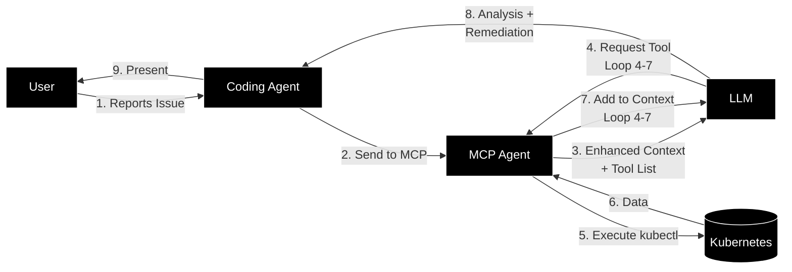
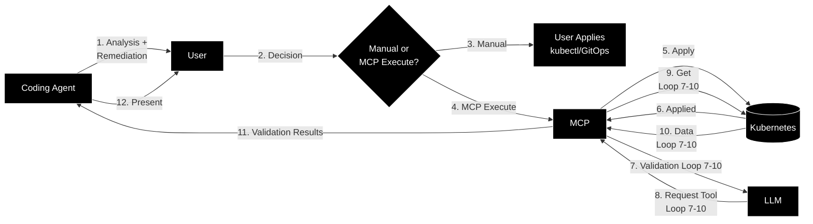
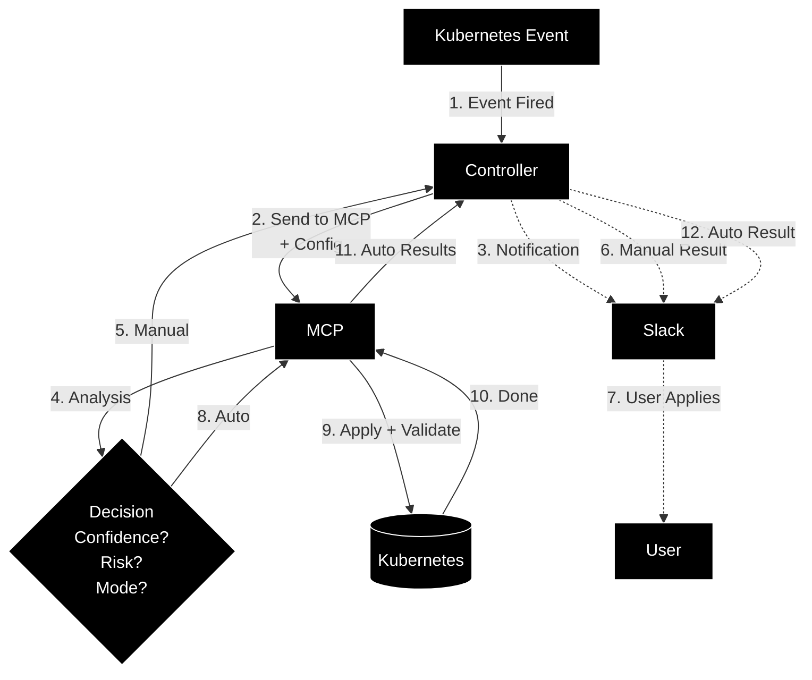

+++
title = 'AI vs Manual: Kubernetes Troubleshooting Showdown 2025'
date = 2025-11-16T16:00:00+00:00
draft = false
+++

It's 3 AM. Your phone buzzes. Production is down. A Pod won't start. You run `kubectl events`, wade through hundreds of normal events to find the one warning that matters, describe the Pod, check the ReplicaSet, trace back to the Deployment, realize a PersistentVolumeClaim is missing, write the YAML, apply it, validate the fix. Thirty minutes later, you're back in bed, wondering if there's a better way.

There is. What if AI could detect the issue, analyze the root cause, suggest a fix, and validate that it worked? What if all four phases happened automatically, or at least with your approval, while you stayed in bed?

I'm going to show you exactly how to do this with Kubernetes. First, we'll walk through the manual troubleshooting process so you understand what we're automating. Then I'll show you an AI-powered solution using Claude Code and the Model Context Protocol that handles detection, analysis, remediation, and validation. Finally, we'll look under the hood at how the system actually works.

<!--more-->



## Setup

> The demo is based on Anthropic Haiku model (the cheaper one). Nevertheless, the project we're using works with all the commonly used models in case you want to explore it deeper. We'll also need OpenAPI key for vector DB embedding. The model we're using is extremely cheap so that will not present almost any cost.

> This demo is using Claude Code as the coding agent. With a few modification, it should work with any other coding agent like Cursor, GitHub Copilot, etc.

> Install [NodeJS](https://nodejs.org/en/download) if you don't have it already.

```sh
npm install -g @anthropic-ai/claude-code

git clone https://github.com/vfarcic/dot-ai-demo

cd dot-ai-demo

git pull

git fetch

git switch remediation
```

> Make sure that Docker is up-and-running. We'll use it to create a KinD cluster.

> Watch [Nix for Everyone: Unleash Devbox for Simplified Development](https://youtu.be/WiFLtcBvGMU) if you are not familiar with Devbox. Alternatively, you can skip Devbox and install all the tools listed in `devbox.json` yourself.

```sh
devbox shell

./dot.nu setup --dot-ai-tag 0.116.0 --qdrant-run false \
    --dot-ai-kubernetes-enabled true \
    --kyverno-enabled false --atlas-enabled false \
    --toolhive-enabled false --crossplane-enabled false

source .env

kubectl --namespace a-team apply \
    --filename examples/deployment-no-pvc.yaml
```

## Kubernetes Troubleshooting Manual Process

Before we dive into the solution, let's talk about the problem. How the hell do we even know when something's broken in our Kubernetes clusters? And more importantly, once we know there's an issue, what do we actually do about it?

Now, I'm not talking about Grafana, Prometheus, DataDog, or whatever fancy observability stack you're using for metrics, traces, and logs. We're going straight to the source. We're going to the first place you should look at, long before you even open your observability tools.

When dealing with issues in Kubernetes, there are **four phases**: detect, analyze, remediate, and validate. Let's walk through each one.

First, how do we detect issues?

What I'm about to show you is a simple example. You'll need to use your imagination, or better yet, your experience, to extrapolate how much more complex this gets in a production cluster with hundreds of resources and far more complicated scenarios.

The simplest way to detect issues is to check Kubernetes events across all namespaces.

```sh
kubectl events --all-namespaces
```

```text
NAMESPACE     LAST SEEN TYPE    REASON            OBJECT                             MESSAGE
...
ingress-nginx 4m19s     Normal  CREATE            ConfigMap/ingress-nginx-controller ConfigMap ingress-nginx/ingress-nginx-controller
ingress-nginx 4m18s     Normal  RELOAD            Pod/ingress-nginx-controller-...   NGINX reload triggered due to a change in configuration
a-team        13s       Warning FailedScheduling  Pod/postgres-db-864458474c-l9rgk   0/1 nodes are available: persistentvolumeclaim "postgres-pvc" not found. preemption: 0/1 nodes are available: 1 Preemption is not helpful for scheduling.
a-team        13s       Normal  ScalingReplicaSet Deployment/postgres-db             Scaled up replica set postgres-db-864458474c from 0 to 1
a-team        13s       Normal  SuccessfulCreate  ReplicaSet/postgres-db-864458474c  Created pod: postgres-db-864458474c-l9rgk
```

You'll see a bunch of events here, both `Normal` and `Warning` types. The normal events show routine operations like creating config maps and scaling replica sets. But look at that `Warning` event in the `a-team` namespace. That's what we care about. It says `FailedScheduling` for a Pod because a `PersistentVolumeClaim` called `postgres-pvc` wasn't found.

Most of the time, you don't want to wade through all the noise of normal events. You want to filter for warnings.

```sh
kubectl events --all-namespaces --types Warning
```

```text
NAMESPACE          LAST SEEN TYPE    REASON           OBJECT                           MESSAGE
local-path-storage 6m26s     Warning FailedScheduling Pod/local-path-provisioner-...   0/1 nodes are available: 1 node(s) had untolerated taint {node.kubernetes.io/not-ready: }. preemption: 0/1 nodes are available: 1 Preemption is not helpful for scheduling.
ingress-nginx      6m13s (x3 Warning FailedMount      Pod/ingress-nginx-controller-... MountVolume.SetUp failed for volume "webhook-cert" : secret "ingress-nginx-admission" not found
a-team             119s      Warning FailedScheduling Pod/postgres-db-864458474c-l9rgk 0/1 nodes are available: persistentvolumeclaim "postgres-pvc" not found. preemption: 0/1 nodes are available: 1 Preemption is not helpful for scheduling.
```

Now, let's be honest here. This approach is stupid. It assumes you either already know there's an issue by being clairvoyant, or that you have nothing better to do than sit in front of your terminal watching events all day. If it's the former, congratulations on your superpowers. If it's the latter, I strongly suggest watching YouTube or Netflix instead. They're much more entertaining.

We'll see a better way to detect issues later. For now, let's pretend we somehow knew there was a problem and move on to the analysis phase.

How do we analyze issues?

We know from the event that it's a Pod issue in the `a-team` namespace, so let's check it out.

```sh
kubectl --namespace a-team get pods
```

```text
NAME                           READY   STATUS    RESTARTS   AGE
postgres-db-864458474c-l9rgk   0/1     Pending   0          3m24s
```

There it is. The Pod is stuck in `Pending` status. It's not running, and it hasn't restarted because it never even started. We need more details.

```sh
kubectl --namespace a-team describe pods
```

```text
Name:             postgres-db-864458474c-l9rgk
Namespace:        a-team
...
Controlled By:    ReplicaSet/postgres-db-864458474c
...
Events:
  Type     Reason            Age    From               Message
  ----     ------            ----   ----               -------
  Warning  FailedScheduling  3m44s  default-scheduler  0/1 nodes are available: persistentvolumeclaim "postgres-pvc" not found. preemption: 0/1 nodes are available: 1 Preemption is not helpful for scheduling.
```

Here's the thing though. This might not be something we can fix in the Pod itself, for two reasons. First, that Pod might not have been created directly. Some other resource might be controlling it. If we change the Pod, that controller will just undo our changes. Look at the `Controlled By` field. It shows this Pod is controlled by a ReplicaSet, but it could have been controlled by a Deployment, StatefulSet, or any number of other resource types. Second, we need to figure out why that PersistentVolumeClaim wasn't found. That's not a Pod configuration issue.

Let's follow the breadcrumbs and check the ReplicaSet.

```sh
kubectl --namespace a-team describe replicasets
```

```text
Name:           postgres-db-864458474c
Namespace:      a-team
...
Controlled By:  Deployment/postgres-db
...
Events:
  Type    Reason            Age    From                   Message
  ----    ------            ----   ----                   -------
  Normal  SuccessfulCreate  4m38s  replicaset-controller  Created pod: postgres-db-864458474c-l9rgk
```

According to the events, this ReplicaSet is perfectly fine. It did its job. It created the Pod. What happens to that Pod after creation? That's someone else's problem as far as the ReplicaSet is concerned. But notice the ReplicaSet is also controlled by another resource, a Deployment called `postgres-db`. We need to keep following the chain.

```sh
kubectl --namespace a-team describe deployments
```

```text
Name:                   postgres-db
Namespace:              a-team
...
Events:
  Type    Reason             Age   From                   Message
  ----    ------             ----  ----                   -------
  Normal  ScalingReplicaSet  5m4s  deployment-controller  Scaled up replica set postgres-db-864458474c from 0 to 1
```

The Deployment also looks fine. It scaled up the ReplicaSet, which is exactly what it should do. If the problem were in the Deployment configuration itself, this is what we'd need to update. But it's not. At least now we understand the ownership chain: Deployment controls ReplicaSet, ReplicaSet controls Pod. That's important to know when we eventually need to make changes.

The real question is: why isn't the PersistentVolumeClaim there?

```sh
kubectl --namespace a-team get persistentvolumeclaims
```

```text
No resources found in a-team namespace.
```

Bingo. There's no PersistentVolumeClaim in the namespace. That's our root cause. The Pod is trying to mount a PVC that doesn't exist. Before we remediate though, let's make sure the cluster has a StorageClass available so we can actually create a PVC.

```sh
kubectl get storageclasses
```

```text
NAME               PROVISIONER           RECLAIMPOLICY VOLUMEBINDINGMODE    ALLOWVOLUMEEXPANSION AGE
standard (default) rancher.io/local-path Delete        WaitForFirstConsumer false                11m
```

Perfect. We have a `standard` StorageClass available and it's even set as the default. We can create a PVC that will use this StorageClass to provision storage.

So how do we remediate this issue?

Well, we need to create that missing PersistentVolumeClaim. Here's what that would look like:

```sh
echo '
apiVersion: v1
kind: PersistentVolumeClaim
metadata:
  name: postgres-pvc
spec:
  accessModes:
    - ReadWriteOnce
  resources:
    requests:
      storage: 10Gi
  storageClassName: standard
'
```

But I'm not going to execute that. We'll see why in a moment.

Before we move on, let me quickly touch on validation. That's the fourth phase. After you apply a remediation, you validate that it actually worked. Validation is essentially the same process as analysis, except now you're not trying to find the root cause. You're confirming the issue was resolved. You'd check the Pod status, look at events, follow the breadcrumbs if needed, and make sure everything is healthy.

Now, here's the thing. We're not going to execute that remediation manually because there's a better way. Let me show you why this entire process is ripe for automation.

Think about each of those four phases we just walked through. Nearly all of that can be automated.

For detection, what we need is a Kubernetes controller that monitors events and triggers notifications based on specific criteria. For example, warnings that happen in specific namespaces and are repeated more than three times. Let the controller do the watching.

Now let's talk about analysis. Automated analysis is already happening in Kubernetes, but only for known issues. Kubernetes handles situations that are defined in advance. For example, if a Pod fails, a ReplicaSet creates a new one. Controllers manage resources based on predictable patterns. But when there's a persistent issue like the one we just saw, it's caused by unknowns. It's something we didn't predict would happen. That's traditionally why we need people to investigate and figure out the root cause.

But do we really need people? How about we change the word "people" to "intelligence"? What we actually need is someone or something capable of following the breadcrumbs, analyzing data, comparing it with a knowledge base, and doing whatever else needs to be done to figure it out. That intelligence could be you, or it could be AI.

Remediation is the next phase. Once we find the root cause, we need to create a solution by creating, updating, or sometimes deleting resources. AI can do this as well. It's actually decently good at it. Not as good as analyzing data, but good nevertheless. The key question is: do we remediate issues directly, or do we require someone to review and approve the remediation first? We can apply that same choice to AI. We can let it fix issues automatically, or we can insist on it showing us the proposed remediation and waiting for our approval.

Once remediation is approved and applied, it follows whatever standard process you're using to manage resources. That could be `kubectl`, Helm, GitOps, workflows, or anything else.

Validation is pretty much the same as analysis, except this time we're not looking for the cause of the issue. We're confirming that the remediation actually worked.

Now, I've been saying that when issues are based on unknowns, we need to involve humans. And sure, we should strive toward never having unknowns, but that's often not possible. Shit happens, and that's not up for debate. It just happens. But here's a better way to think about it: we need "intelligence" to analyze, remediate, and validate issues. Today, that intelligence can be you, or AI, or more likely, both working together.

When I say AI, I really mean **agentic AI**. If there's something Large Language Models are exceptionally good at, it's crunching and analyzing data. When you connect them with agents, they can request execution of tools that provide them with data, or even remediate issues if we choose to let them.

So let's stop talking theory and see this in action.

## AI-Powered Kubernetes Remediation

Let me show you an example. We're going to ask an AI agent to troubleshoot the same issue we just walked through manually.

I'm going to start Claude Code with an MCP configuration. This MCP has a tool that handles the entire process of analyzing, remediating, and validating issues. Inside that MCP, there's an agent working with an LLM to do the analysis and figure out what's wrong. All we need to do is state the problem and, later, confirm whether the suggested remediation looks correct. Or, as we'll see in a moment, we can connect it to a controller so even detection can be automated.

```sh
claude --mcp-config .mcp-kubernetes.json
```

We're skipping detection for now because we already know there's an issue. Let's just tell the agent what's wrong.

[user]
```text
Something is wrong with my database in the a-team namespace.
```

> If you see that your agent did not use the MCP, add `use MCP` to the intent.

[agent]
```text
⏺ I've analyzed your database issue in the a-team namespace. Here's what I found:

Root Cause (99% confidence)

PostgreSQL database pod cannot start because the required PersistentVolumeClaim 'postgres-pvc' does not exist.

Key Findings

- Pod postgres-db-864458474c-9z2cn is stuck in Pending status
- Scheduler error: persistentvolumeclaim 'postgres-pvc' not found
- The deployment references a volume with ClaimName postgres-pvc, but no PVC exists
- StorageClass 'standard' is available for provisioning

Recommended Fix

Create the missing PersistentVolumeClaim with the following command:

kubectl apply -f - <<EOF
apiVersion: v1
kind: PersistentVolumeClaim
metadata:
  name: postgres-pvc
  namespace: a-team
spec:
  accessModes:
    - ReadWriteOnce
  resources:
    requests:
      storage: 10Gi
  storageClassName: standard
EOF

Risk Level: Low

Execution Options

How would you like to proceed?

Option 1: Execute automatically via MCP - I'll run the kubectl command automatically

Option 2: Execute via agent - I'll use the Bash tool to run the command and validate the results

Which option would you prefer?
```

Look at that. The agent analyzed the issue, followed the same breadcrumbs we did manually, identified the `root cause` with `99% confidence`, and provided a `remediation` proposal. We can execute it `automatically` through the MCP, or we can do it ourselves via the `agent` we're in or any other way. If we let the MCP handle it, it will also validate that the fix worked.

But I'm going to skip the remediation for now because we're missing the first step: detection. Let me show you how we can automate that as well with a Kubernetes controller.

> Exit Claude Code by pressing `ctrl+c` twice, or, in case you're using a different agent, through whichever method it we can exit or close it.

```sh
cat examples/remediation-policy.yaml
```

```yaml
apiVersion: dot-ai.devopstoolkit.live/v1alpha1
kind: RemediationPolicy
metadata:
  name: sample-policy
  namespace: dot-ai
spec:
  eventSelectors:
    - type: Warning
      reason: FailedScheduling
      involvedObjectKind: Pod
      mode: automatic
      confidenceThreshold: 0.85
      maxRiskLevel: medium
    - type: Warning
      reason: ""
      involvedObjectKind: ""

  mcpEndpoint: http://dot-ai-mcp.dot-ai.svc.cluster.local:3456/api/v1/tools/remediate
  mcpTool: remediate
  mode: manual
  maxRiskLevel: low
  rateLimiting:
    eventsPerMinute: 5
    cooldownMinutes: 15
  # notifications:
  #   slack:
  #     enabled: false
  #     webhookUrl: "$SLACK_WEBHOOK_URL"
  #     channel: "#tests"
  #     notifyOnStart: true
  #     notifyOnComplete: true
```

This is a `RemediationPolicy` custom resource. It tells a Kubernetes controller what events to watch for. In this case, we're watching for `Warning` events with a `FailedScheduling` reason on Pods. When the controller detects a matching event, it sends a request to the `mcpEndpoint` specified here. The MCP does the analysis, remediation, and validation. You can configure things like confidence thresholds, maximum risk levels, rate limiting, and even `slack` `notifications`. Let's apply it.

```sh
kubectl --namespace dot-ai apply \
    --filename examples/remediation-policy.yaml
```

Now let's wait a few moments for the controller to detect the event, fire a request to the MCP, and let it handle everything. If this worked, we should see the Pod running and the PVC created.

```sh
kubectl --namespace a-team get pods,persistentvolumeclaims
```

```text
NAME                READY STATUS  RESTARTS AGE
pod/postgres-db-... 1/1   Running 0        35s

NAME                               STATUS VOLUME           CAPACITY ACCESS MODES STORAGECLASS VOLUMEATTRIBUTESCLASS AGE
persistentvolumeclaim/postgres-pvc Bound  pvc-2447136d-... 10Gi     RWO          standard     <unset>               19s
```

Perfect. The Pod is running, and the PersistentVolumeClaim has been created and bound. The controller detected the issue, the MCP analyzed it, remediated it, and validated that the fix worked. All four phases, **completely automated.** If we had Slack integration enabled, we'd see notifications with the analysis and suggested remediation for manual mode, or the analysis, remediation commands, and validation results for automatic mode.

That's pretty damn impressive when you think about it. But you're probably wondering how all of this actually works behind the scenes.

## MCP Architecture and Controller Design

We just saw it in action, but how does this actually work under the hood? Let's break down both the MCP and the controller.

**How does the MCP work?**

Let's start with detection. (1) A user figures out, through whatever means, that something's wrong and provides information about the problem to their coding agent, like Claude Code, Cursor, or whatever they're using. (2) The coding agent then sends that to the MCP. This is manual detection where the user initiates the process. The alternative, as we just saw, is automated detection through the controller, which we'll get to in a moment.

Next is analysis. The MCP has its own internal agent that works with an LLM to gather information and analyze issues. (3) The MCP agent takes the user's intent and enhances it with additional context. This includes a list of tools the LLM can use to gather more information, and instructions for the LLM to perform a loop until it analyzes the issue and figures out the root cause and recommended remediation. Once that's done, it also performs a dry run to validate the solution.

The gathering of data and the dry run happen through a loop. (4) The LLM requests tool execution, (5) the MCP agent executes those tools like `kubectl get`, `kubectl describe`, `kubectl events` against (6) Kubernetes, which returns data. (7) The agent adds the outputs to the context and sends it back to the LLM. This continues looping between steps 4 and 7 until the LLM responds with "I'm done." Importantly, those tools are all read-only. The LLM never requests changes to the Kubernetes cluster. That's a critical security constraint.

(8) Once the LLM finishes the loop, it responds back to the MCP agent with the analysis and suggested remediation. The MCP agent then sends this back to the coding agent, which (9) presents it to the user.



Now for remediation. (1) The coding agent presents the analysis and suggested remediation to the user. (2) The user has choices. (3) They can apply the remediation manually by executing `kubectl apply`, making changes to files in Git and letting GitOps sync them, or using whatever other process they prefer. (4) Alternatively, the user can tell the coding agent that the remediation should be done by the MCP.

When the MCP handles remediation, (5) the MCP applies the suggested commands directly to (6) Kubernetes. This is an important security model. The user reviews the suggested remediation first, then the MCP's code executes it. The LLM and MCP agent never execute remediation themselves. Remember, they only have access to read-only tools. Write operations are always done by the MCP's code, and only after user approval.

Finally, validation. (7-10) If the user delegated remediation to the MCP, once it's done, the MCP performs validation to confirm the remediation worked. This uses essentially the same analysis process we discussed earlier, with the MCP and LLM looping to get data from Kubernetes, except this time the goal isn't to find the root cause. It's to confirm the issue was resolved. (11) Once validation is complete, the MCP sends the validation results back to the coding agent, which (12) presents them to the user.



**How does the controller work?**

The controller monitors specific events defined in the RemediationPolicy resource, like the one we saw earlier. (1) When an event matching the filters is fired, (2) the controller sends a request to the MCP server with information about the potential issue, along with the remediation mode, confidence threshold, maximum risk level, and other configuration.

(3) At the same time, if Slack notifications are enabled, a notification is sent indicating that a potential issue was discovered and that analysis is in progress.

(4) The MCP performs analysis. Now, there are two paths depending on the configuration and the MCP's assessment. (5) The **manual remediation path** kicks in when the MCP decides NOT to auto-remediate. This happens for three reasons: one, the confidence is below the threshold; two, the risk is above the threshold; or three, that event type is configured for manual mode. When manual remediation is required, the MCP responds back to the controller with just the analysis and suggested remediation. (6) The controller sends this to Slack, and now (7) it's up to the user to apply the remediation.

(8) The **automatic remediation path** happens when the confidence is high enough, the risk is acceptable, and the event type allows automatic mode. In this case, (9) the MCP applies the remediation and validates it against (10) Kubernetes. (11) When that's done, the MCP responds back to the controller with not just the analysis, but also which remediation commands were executed and the validation results. (12) The controller sends all of this to Slack.

In both cases, you get full visibility through Slack about what was discovered and what actions were taken or recommended.



If you want to try this out yourself, check out https://github.com/vfarcic/dot-ai. That's the MCP that handles analysis, remediation, and validation. There's also https://github.com/vfarcic/dot-ai-controller, which does the detection and triggers the whole process. Both are open source. Use them, fork them, create issues, or do whatever else you want with them. They're yours to experiment with.

## Key Takeaways and Next Steps

Remember that 3 AM phone call from the beginning? That doesn't have to be your reality anymore. We've moved from manual troubleshooting that takes thirty minutes of following breadcrumbs through kubectl commands, to AI-powered remediation that handles all four phases: detection through a Kubernetes controller, analysis through an LLM agent loop, remediation with your approval or fully automated, and validation to confirm the fix worked.

The key insight here is that we don't need to predict every possible failure scenario. We need intelligence that can investigate unknowns, and that intelligence can be AI. The security model is solid because the LLM only has read-only access. Write operations require either your explicit approval or confidence and risk thresholds you define. You decide whether you want manual approval for every fix, or automatic remediation for low-risk issues with high confidence.

You can use the DevOps AI Toolkit as-is if it fits your needs. Deploy the MCP, set up the controller, configure your RemediationPolicy, and you're done. Or use it as a blueprint. Study how the MCP agent loops with the LLM, how the controller watches events, how the security model keeps write operations isolated from AI decision-making. Take those patterns and build your own solution that fits your infrastructure, your tools, your risk tolerance. The code is out there. The architecture diagrams are in this video. The point is, you have options beyond debugging Kubernetes at 3 AM.

## Destroy

```sh
./dot.nu destroy --qdrant-run false

exit
```

