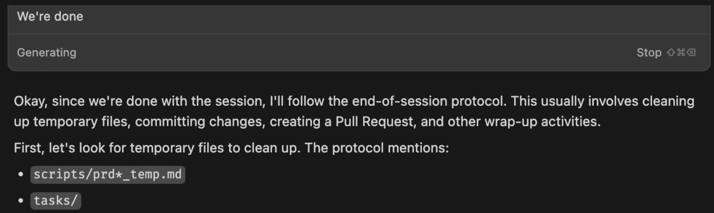
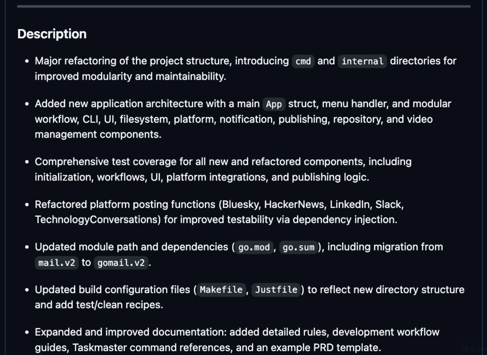
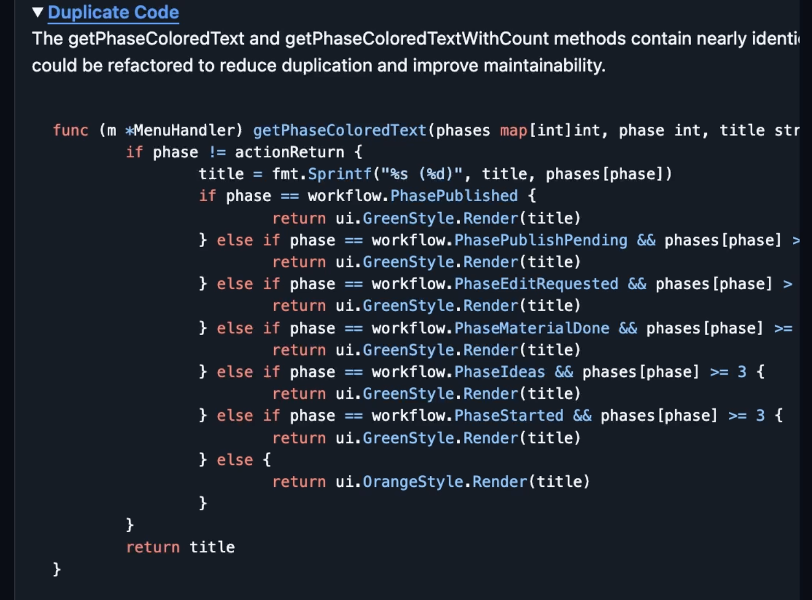
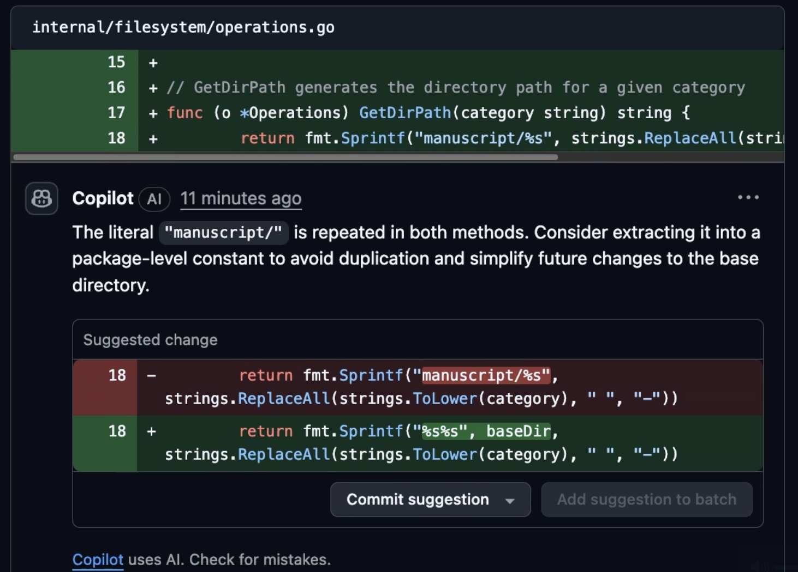
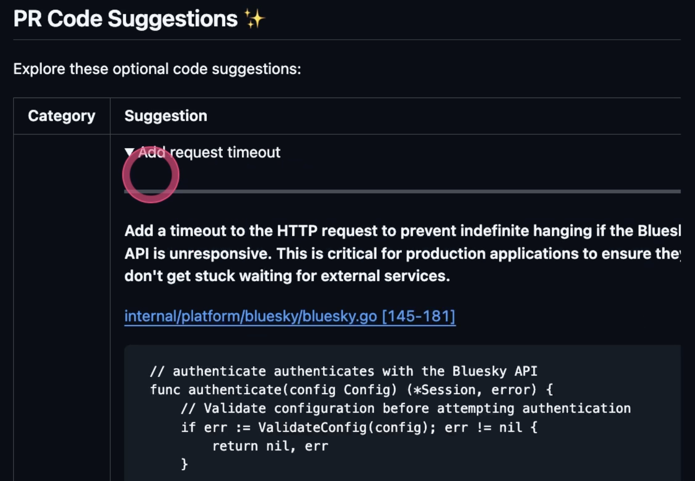
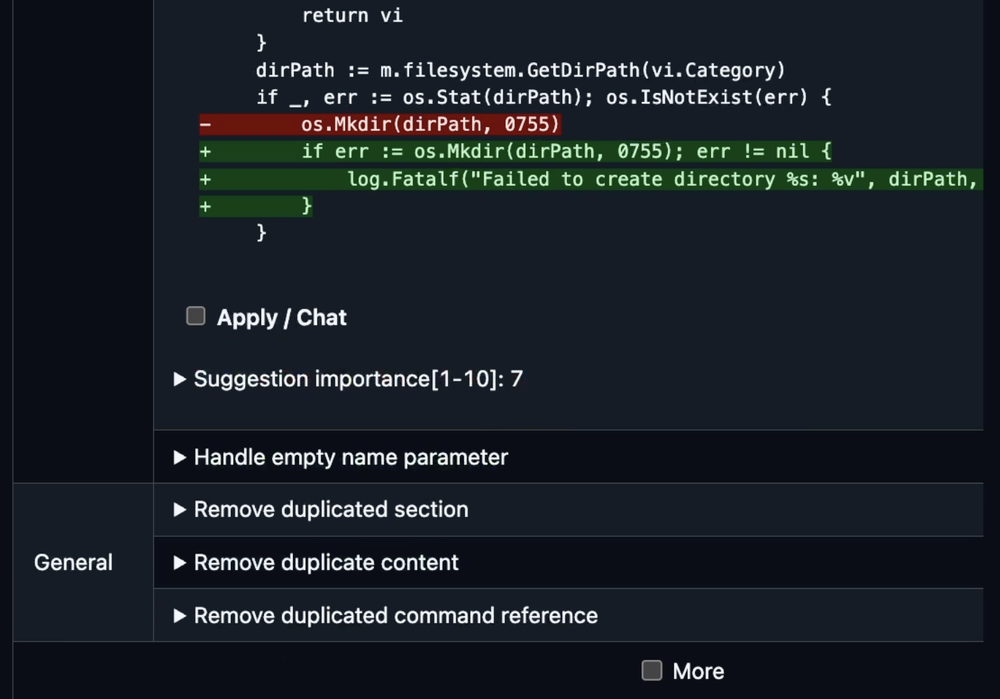
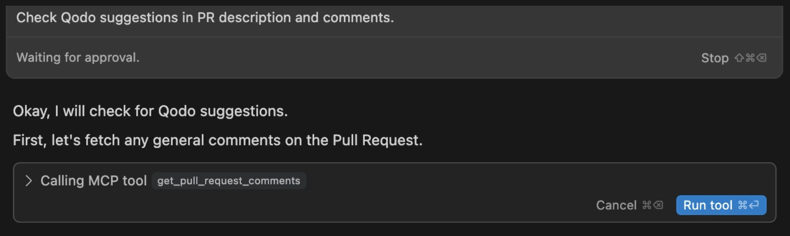

+++
title = 'Better Code Reviews with AI? GitHub Copilot and Qodo Merge Tested'
date = 2025-06-30T15:00:00+00:00
draft = false
+++

Second opinions are important. We get them them from doctors, as well as from software engineers. We want "stuff" to be reviewed and we want feedback. Today, however, we will not talk about second opinions and suggestions from doctors and software engineers. We'll talk about **one AI reviewing work of another AI**, with us being managers of both.

Today we'll explore the possibilities of using a few AI agents to do code review. We'll see how they integrate into **pull requests in GitHub**, whether they can find issues in code written by a different AI in an IDE, and how we can incorporate those reviews into our development workflow.

<!--more-->



If you're not already using AI for code reviews, I'm sure you will by the end of this post. On the other hand, if you are already using something, you might benefits from a comparison since we will not use one AI agent for reviews, but two. The only thing better than a second opinion is a third opinion. Right?

## AI Code Reviews

I'll fast forward to the end of development of a new feature.

Once I'm done with code, I tell the AI agent that `we're done`.

> Execute the prompt that follows in Cursor agent chat.

```
We're done.
```



That, in turn, triggers a set of actions which I will not explore today mainly because I did all that in the [My Workflow With AI: How I Code, Test, and Deploy Faster Than Ever](https://youtu.be/2E610yzqQwg) video. Instead, I want to focus on a few steps in the middle.

Once the pull request is created, we can see that the AI requested a code review from Copilot. That's equivalent of asking for a second opinion after receiving a diagnosis from a doctor. That second opinion is, in software industry, known as a code review. The major difference is that, this time, it will not be done by humans, but by an AI agent. Actually, that's not correct. Code review will be done by **two AI agents**. "Why?", you may ask.

There can be two answers to that question. One can be "why not?" It might be okay to spend a few extra cents to get multiple opinions related to the work we did.

The second, and a much better answer is that I want to compare the results of two agents; one being GitHub Copilot Code Review and the other being Qodo Merge. Copilot is the solution I've been using since it was released sometime in April or May 2025 and I heard good things about Qodo so wanted to check it out.

Both are already configured and should have already finished reviewing the changes proposed in that PR, so let's take a look at them directly in GitHub first.

Qodo modified the description of the PR itself, and that feels great, as long as your descriptions are not very detailed, as is the case with the PR we're looking at right now.



We can see that it added `PR Type`, detailed `Description` of what was done, `Changes walkthrough` that splits files into different groups, and, finally, the note that we can execute `/help` with a question if we would like to interact with Qodo directly from that PR. That's a great start, or noise, depending on how you do what you do. So far, I think that Qodo is doing great and a bit dissapointed that Copilot did not summarize the PR as well. Maybe it did in the comments. We'll see.



Further on, Qodo created a `PR Reviewer Guide` comment with a few key observations. For example, one of them shows that there is some `Duplicate Code`. That sounds like something we should correct before merging that PR.

The next in line is a comment made by GitHub Copilot.

Just as Qodo, it also provided a short description of the PR itself. It is less detailed than what Qodo gave us, so that's a negative point. On the other hand, I'm not sure I like Qodo's approach of modifying the PR itself. If I made a more detailed text of the PR, it would be a mess. I think I prefer keeping everything review agents do as comments.



Further on, just as Qodo, Copilot provided a few suggestions. This is also good new bad news type of a situation for Copilot. The suggestions provided by Qodo are slightly better but I like the format how Copilot organizes more. It organized them in the same way as a person would do it by going to the code itself, highlighting relevant parts, and adding comments.



There's one more comment, this time from Qodo. It created `PR Code Suggestions` with even more suggestions. That follows the same good news bad news pattern. On one hand, Qodo does provide more suggestions and often finds, sometimes important, things we should improve that Copilot misses. That was good news for Qodo. The bad news is that it's a mess. It updated PR description and it created two comments, and all those are organized in a way that it's hard to figure out what is what and what to focus on.



There's even `More` checkbox which I don't fully understand. If we click it, we get additional suggestions from Qodo. Why? What is the purpose for asking more? Are there suggestions that are important that Qodo decided not to include from the get-go or are there irrelevant suggestions that we shouldn't see unless we are very eager to waste our time?

So far, Qodo is better at detecting issues while Copilot organizes them in a better way. Copilot is providing suggestions in the same way as human reviewers would. That, however, might not matter. It might not matter how those agents organize information, since we might not be looking at them from a browser, at least not today.

Apart from what we talked about, it might be important to note that both solutions can apply suggested fixes and that we can initiate a chat with them directly from a browser. Those features might matter to some, but I find them irrelevant in this context. I don't fix issues, no matter who reported them, from a browser. I prefer switching to an IDE to continue working on that PR or any other PR.

So, let's do just that.

## Fixing Issues Detected in Code Reviews

We're back in Cursor and we're in the middle of the process I set up. The agent is waiting for a confirmation to retrieve PR reviews made by Copilot, so let's allow it to do just that.


As a result, the agent retrieved the data, evaludated it, and even concluded that `these seem like reasonable suggestions`. Imagine that. One AI agrees that the other AI did a good job!

In this case, those do look like reasonable suggestions, so the natural response is to `apply them`.



Unlike Copilot reviews which I already instructed the agent to include in it process, Qodo is not a part of my workflow just yet, so I'll instruct the AI to `also include Qodo comments in the review`.

The rest is, more or less, the same process. The agent fetched the suggestions made by Qodo, it listed them, and asked me to choose which one, if any, I'd like to implement. From there on, it's all about choosing which ones I'm interested in, letting the AI do the actual work while I'm monitoring the progress and correcting it when it does something it shouldn't.

Once all the suggestions I believe are worth applying are there, the rest follows the predefined process of merging the PR and doing whatever else is left to do. I'll skip that part, since its outside the scope of this post, and move towards pros and cons of using AI for code reviews and a short comparision of Copilot and Qodo.

## AI Code Reviews Pros and Cons

If we ignore the cost of using AI to do code reviews, I see no reason not to do it. In the worst case scenario, the suggestions are pointless and we ignore them. In the best case scenario, AI will detect issues we might want to fix.

The way I see it, using AI to do code reviews is a **no-brainer**. I cannot imagine a reason not to use it (apart from the price). It's a clear win.

However, I am also dissapointed. I would expect those solutions to do more. Instead of doing analysis of the changes to the code alone, I think it would be truly beneficial if they could fetch the issue related to a PR and try to figure out whether the PR makes sense.

One thing is to find potential issues in code snippets and completely other to analyse whether a PR is actually providing a **valid implementation of a PRD** it implements.

If I would make an analogy with doctors, and asking a second opinion, what AIs are doing right now is similar to a second doctor checking whether the steps of a surgery we were suggested to do are the correct rather than checking whether the surgery itself will fix whatever it is supposed to fix.

Nevertheless, that's the state of AIs used for code reviews. They are not everything I expect them to be, but they are still very useful.

When it comes to the differences between Qodo Merge and Copilot Code Review... Both are very similar. There are no huge differences.

Major differentiating factors are that **Qodo is a bit better** at finding actual issues and proposing solutions while the way Copilot organizes the information is better and easier to digest.

If I would have to choose only one of those two, Qodo is, overal, a better choice. It's more important what it finds than how it presents it. So, based on that information alone, I could say "**pick Qodo**".

On the other hand, **Copilot is everywhere**. The chances are that you are using it as an agent in VS Code, or that you are letting it resolve issues directly in GitHub, or that you are using it in some other form. It might already be part of your GitHub subscription. As such, it is probably already there and you are likely already using it in some form or another, so it makes sense to use it for code reviews as well.

That leaves Qodo as a great choice for two groups of people. Those who are not using Copilot. Those who prefer other agents in their IDEs, and terminals, and wherever else, would find Qodo being a better choice, because it is better, just not better enough for someone who is using Copilot to switch.

The second group of people who would benefit greatly from Qodo are those who are not using GitHub. If you are a GitLab user, Qodo is a great choice.

Still, I must say that I am dissapointed with the general state of Code Review agents. They are doing the same job that agents we might be using while coding are doing. We could easily add a prompt at the end of our coding session that says "evaludate all changes I made and tell me whether there is something I should improve."

So, I expected more, I got less, but that less is still valuable. If you are doubting between the two, Qodo is better, but not significantly better for someone to switch from Copilot (and pay extra for that privilege).

