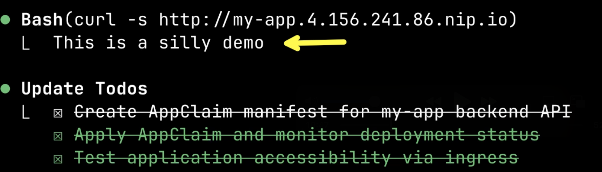

+++
title = "Can AI Replace Your Terraform Modules? Infrastructure's New Future"
date = 2025-07-28T14:00:00+00:00
draft = false
+++

My AI agent just **failed** to create a database. It forgot the resource group, messed up the credentials, and made three attempts before getting it right.

But here's the plot twist: That's the **best** thing that could have happened.

Today, I'm going to show you why AI agents might make your carefully crafted golden paths **obsolete**. Why those Terraform modules or similar abstractions you spent months building might be holding AI back, and why letting AI fail and learn might be the future of infrastructure management.

<!--more-->



You're about to see two experiments. First, I'll show AI using a pre-built **golden path** to deploy an app. It'll work perfectly. Then, I'll throw it into the deep end with **zero abstractions**, asking it to build a complete database setup from scratch. That's where things get interesting.

Along the way, we'll answer questions that keep platform engineers up at night. How do we stop AI from going **rogue** and spinning up resources in the wrong cloud? Why is **Kubernetes** the perfect control plane for AI? Can AI teach itself infrastructure through **API discovery** alone? And the big one: Do we even need golden paths anymore, or can AI build better abstractions **on the fly**?

You'll watch AI fail, learn, and evolve. You'll see it go from **zero knowledge** to building complex infrastructure. Most importantly, you'll understand why the future of platform engineering might look nothing like today.

## Setup

> Install [NodeJS](https://nodejs.org/en/download) if you don't have it already.

```sh
npm install -g @anthropic-ai/claude-code

git clone https://github.com/vfarcic/idp-ai-demo

cd idp-ai-demo

git switch infra
```

> Make sure that Docker is up-and-running. We'll use it to create a KinD cluster.

> Watch [Nix for Everyone: Unleash Devbox for Simplified Development](https://youtu.be/WiFLtcBvGMU) if you are not familiar with Devbox. Alternatively, you can skip Devbox and install all the tools listed in `devbox.json` yourself.

```sh
devbox shell

./dot.nu setup

source .env

claude
```

> If this is the first time you're running Claude Code in this repo, you will be asked to select MCP servers. Select both.

> While I'm using Claude Code, everything you're about to see works with VS Code, Cursor, or any AI agent that supports MCPs. The magic is in the setup, not the tool.

## The Testing Ground

Let me show you the battlefield for today's experiment.

The setup I prepared is deceptively simple. One Kubernetes cluster acting as a **control plane**. That's it. But what's inside is where things get interesting.

I've installed two completely different approaches to infrastructure management, and we're about to see which one AI actually prefers.

First, there's a Crossplane Configuration with Composite Definitions for managing apps. This is your traditional **golden path**: someone spent weeks creating a perfect Application-as-a-Service abstraction. Any human or AI can use it to deploy apps without thinking about the details.

But here's where it gets wild.

I also installed Crossplane providers for AWS, Google Cloud, and Azure. But with **no high-level abstractions**. No Composite Resource Definitions. No golden paths. No Database-as-a-Service. Just raw, low-level resources. Anyone trying to create a database would need to assemble dozens of resources manually. It's like giving someone a box of LEGO pieces with no instructions.

There are other tools lurking in that cluster, but I'll reveal those when the time comes.

This setup lets us test a crucial question: Can AI work with **raw infrastructure APIs**? Can it build its own golden paths on the fly? Does it even need the abstractions we've spent years perfecting?

I have a growing suspicion that we're looking at AI from the **wrong angle**. We keep trying to force it into boxes designed for human limitations. But what if those boxes are holding it back? What if AI needs something fundamentally different?

We'll test this with two scenarios.

First, we'll see how AI handles our carefully crafted Application abstraction. This should be easy mode.

Then we'll throw it into the deep end: creating a database with zero abstractions, just raw cloud resources. This is where we'll see what AI is really capable of.

Here's the crucial part: nothing is hard-coded. The AI will **discover** what's possible in the cluster and adapt. You could connect this to any Kubernetes cluster with any set of capabilities, and it would figure out what to do. No predefined paths. Just discovery and adaptation.

Let's see if I'm right.

## AI Deploys Apps


This setup works with AWS, Azure, and Google Cloud. But to keep things unbiased, I let Claude Code pick. It chose **Azure**.

What you're about to see works, with a few minor change, with Claude Code, Cursor, GitHub Copilot, or any AI agent that supports MCPs. The magic isn't in the tool. It's in the **prompts**, the **memory**, and the **control plane**.

Now watch this.


I've created custom slash commands. Think of them as **context injections** for the agent. Type `/` and you're giving the AI specific knowledge about how to approach infrastructure tasks. Today, we'll use `/manage-app` to provide the context it needs to handle our golden path.

> AI is non-deterministic. Your experience will differ and you might need to adapt examples to what you see on the screen.

> Execute the prompt that follows.

```
/manage-app
```

*If this feels familiar from my [Forget CLIs and GUIs: AI is the New Interface for Developer Platforms](https://youtu.be/ApjnCa-a2xI) video, stay tuned. That was about **predefined paths**. This is about AI discovering everything from scratch.*


Here's where things get interesting. The AI's first move? Check its **memory**.

This is the secret weapon. The AI records every lesson learned, every mistake made, every preference discovered. Right now, the memory is **empty**. You're seeing it at its worst. Every interaction makes it smarter.

Next comes the discovery phase. The AI has **no idea** what this control plane can do. Watch as it explores...

Now it switches gears. Instead of assuming what we need, it starts asking smart questions. No clairvoyance required. Just good old-fashioned discovery.


First question: which Namespace? The AI found what's available and filtered to what makes sense. I'll go with `a-team`. Sounds like my kind of squad.


Then it asks about the app type. But here's where it gets beautiful. I don't like any of the options. So I just tell it: `it's a backend application that should expose API to processes outside the cluster.`

This is **huge**. No dropdown menus. No rigid forms. Just explain what you need in plain English. The golden path becomes flexible.

Watch what happens when I don't know something.

When asked for the container image, I'm clueless. So I tell it: `I have an image stored in ghcr.io in the vfarcic/silly-demo repo. Find the latest version.` And it **actually does**. It searches, finds the options, and asks for confirmation.

Same thing with the port. Don't know? No problem. `Find it out from Dockerfile in that repo`. The AI becomes a detective, gathering clues from wherever it can find them.

It continues with smart questions about scaling and networking. When it needs the host IP, I let it figure that out too. It's becoming clear: this AI doesn't just follow instructions. It **solves problems**.


Finally, it suggests some extra features. I decline. We've got more interesting experiments ahead.

Now for the moment of truth. The AI takes everything it learned and starts building...

It found a Crossplane Composite Resource Definition that matches our needs and chose it. But if that didn't exist? It would've gone with raw Kubernetes resources: Deployments, Services, Ingresses. The point is: it **adapts** to what's available.



Watch the full workflow: creates the claim, saves manifests locally, applies them, monitors status, creates a tracking ConfigMap, and finally, the proof: sends a **curl** request to verify the app is alive.

The finale? It saves everything it learned to memory. Next time will be even better.


Perfect execution. Application deployed. Resources created. Status confirmed. But I made this too easy. There was a golden path waiting.

Time to remove the safety net. Let's see what happens when there's no golden path at all.

## Database Without Safety Nets

Time to see what AI is really made of.

For this challenge, I've been deliberately cruel. No Crossplane Compositions for databases. No pre-built Database-as-a-Service. Just **raw cloud APIs**.

Why? Because I need to know: Do we really need months of platform engineering to create abstractions? Or can AI figure it out **on its own**?

Think about what I'm asking here. A human developer would need deep knowledge of Azure networking, security groups, database configurations, credential management, schema tools. They'd spend hours reading docs and still probably mess it up.

Can AI do better? There's only one way to find out.


Let's unleash the chaos.

> Execute the prompt that follows.

```
/manage-db
```

Just like before, it checks its memory. Still empty. The AI is flying blind since this is the first iteration. It does not yet have any lessons-learned stored in memory.

Now it starts discovering what tools it has for database creation. Remember, it has no idea what's in this cluster. Let's see what it finds...

The usual questions begin: namespace, database name. But watch what happens next...


This is where it gets smart. The AI discovered Azure CRDs and Atlas for schema management. Without any guidance, it figured out these could work together. It's already **connecting dots** I didn't explicitly draw.

I choose PostgreSQL with Atlas schema management. Because what good is a database without schemas? The AI gets it.

More questions follow: instance size, database names, schema requirements, networking rules. Each answer adds complexity to what the AI must assemble. No templates. No shortcuts. Just **pure synthesis**.

Here comes the moment of truth. Can it actually build all this from scratch?


Look at what it assembled: Azure `FlexibleServer` for the database engine. `FlexibleServerFirewallRule` for network access. Two `FlexibleServerDatabase` resources because I wanted two databases. Two `AtlasSchema` resources for managing schemas in each.

But wait. I can already spot a problem. Where's the **Resource Group**? Azure needs one, and the AI forgot it. This could be catastrophic.

Will it figure this out? Or are we about to watch a spectacular failure? Remember, this is its first attempt. No lessons learned. No safety net.

This is where it gets wild. Watch the AI's journey through chaos:

First attempt: **Failed**. Missing resource group detected.
Second attempt: **Failed**. Credential management issues with Atlas.
Third attempt: **Failed**. Configuration mismatch.

But here's the beautiful part. Each failure teaches it something new. It's not just retrying blindly. It's **learning**, **adapting**, **evolving**.

While Azure spins up resources, the AI follows my slash command instructions to create a ConfigMap. This tracking mechanism lets it know which resources belong together for future operations: monitoring, updates, deletion.

After three attempts and multiple corrections... **Success**. Every resource provisioned. Every connection verified. Every schema deployed.


The final report tells the story. The AI announces: `database deployment complete with schema management!` It shows the `final status`, lists `connection details`, documents all `created resources`, and confirms that `schema management` was `verified`. All from raw APIs, no golden paths, no safety nets.

But here's the kicker. Everything it learned from those failures is now stored in memory. Next time, it won't make those mistakes. We just watched AI **teach itself** infrastructure management.

So what does this mean? If AI can build complex infrastructure without our carefully crafted abstractions, what happens to platform engineering as we know it?

Before we tackle that question, let me show you the magic behind the curtain.

## The AI Prompts

The secret isn't some complex AI model or fancy infrastructure. It's simpler than you think.

Let's peek behind the curtain at the slash command that orchestrated everything.

```sh
cat .claude/commands/manage-app.md
```

The output is as follows (truncated for brevity).

```md
# Application Management Agent

You're an agent specialized in creating and managing applications through Kubernetes resources. You operate exclusively within a Kubernetes cluster with infrastructure management capabilities.

## Core Workflow

### 🧠 STEP 0: Query Memory (Required)
...
### STEP 1: Discover Capabilities
...
### STEP 2: Configure Application
...
### STEP 3: Generate & Apply Resources
...
### STEP 4: Handle Issues (As They Occur)
...
### STEP 5: Document Issues Only
...
## Essential Guidelines
...
## Resource Patterns
...
## Troubleshooting Quick Reference
...
## Platform-Specific Notes
...
## Validation Checklist
...
```

That command might seem daunting at 200 lines, but it's actually **beautifully simple**.

Here's the genius: Six steps that turn any AI into an infrastructure expert.

**Step 0**: Check memory. Learn from past victories and failures.
**Step 1**: Discover capabilities. Figure out what's possible.
**Step 2**: Ask smart questions. Understand what humans actually need.
**Step 3**: Generate and apply. Turn knowledge into action.
**Step 4**: Handle failures. Because things will go wrong.
**Step 5**: Document lessons. Get smarter for next time.

The rest? Guidelines, patterns, troubleshooting tips. But here's the key: **no hardcoded paths**. The prompt teaches the AI how to discover and adapt, not what to do.

This is just the first draft. As we use it more, as it learns more, these prompts will evolve. The AI will get smarter. The results will get better.

But prompts are just the beginning. The real questions are bigger than code.

## Platform Engineering's Future

Some questions have clear answers. Others might change everything we know about platform engineering.

Let's start with the easy ones.

First up: How do we stop AI from going **rogue**? From spinning up resources in the wrong cloud? From costing us a fortune?

The answer is **Kubernetes**. By limiting AI to the Kube API, we create a natural boundary. It can only do what the cluster allows. RBAC becomes our safety net. Policies become our guardrails.

*Side note: AI might change how we think about RBAC and policies. Do you want me to explore that? Let me know in the comments.*

Next question: How do we enable AI to manage resources beyond Kubernetes?

Again, **Kubernetes** saves the day. CRDs and controllers become bridges to anywhere. Crossplane providers, in my case, opened doors to Azure, AWS, Google Cloud. In your case, it could be anything.

But here's a paradox: How do we teach AI about APIs it's never seen before?

This is where Kubernetes shines. Every API is **discoverable**. Every schema is available. One `kubectl explain` command and AI knows everything. No documentation needed. No training required.

But now we enter uncharted territory. The questions without easy answers.

How do we guide AI behavior? Sure, local prompts like mine work for demos, but what about real organizations? How do we distribute best practices? Monitor performance? Keep prompts updated?

The answer might be **custom agents**: centralized intelligence that everyone can access. Imagine Claude Code with perfect prompts, running in your cluster, available to every developer. Agent-to-agent communication could change everything.

*Do you want to see me build custom agents? The comments section is waiting.*

Then there's memory. Here's the thing: if AI doesn't learn, it's just a fancy script. The memory MCP I used works for demos, but what about scale? What about team learning? What about knowledge sharing?

This question remains open. Better solutions exist, but we're still exploring.

And what about the interface? Is typing in a terminal really enough? Some love it. Others need visuals. Would a Web UI help? Dependency graphs? Visual resource designers?

But here's the question that keeps me up at night.

Do golden paths even have a future?

We saw both approaches today. The app deployment used a golden path: **instant success**, zero errors. The database creation went raw: **multiple failures**, but ultimate flexibility.

Golden paths are reliable but inflexible. Need PostgreSQL but the service only supports MySQL? **Wait for an update**. Need schema management but it's not included? **You're on your own**. Need a slight variation? **Too bad**.

Creating these abstractions takes months. Maintaining them takes forever. And for what? To make things easier for humans who might not need them if AI can help?

AI doesn't need Terraform modules or Crossplane Compositions the way humans do. It can assemble complex infrastructure from primitives. Yes, it might fail at first, but it **learns**. Each failure makes it smarter.

Maybe the answer is both. Keep golden paths for common scenarios. Let AI handle the edge cases. Or better yet: let AI modify golden paths at runtime, adapting them to specific needs.

But if we go this route, governance becomes critical. We'll need better policies. Smarter guardrails. More sophisticated ways to guide AI without constraining it.

We're at a crossroads. The tools exist. The capabilities are here. But the patterns? The best practices? The philosophical approach? That's still being written.

One thing is certain: AI agents will become more autonomous. Today's supervised assistance is tomorrow's independent operation. The question isn't if, but when. And more importantly: **are we ready?**

This is just the beginning. And that's what makes it exciting.

## Destroy

> Execute the prompt that follows.

```
delete resources
```

> Press `ctrl+c` twice to exit Claude Code.

```sh
rm manifests/*.yaml

./dot.nu destroy $PROVIDER
```

