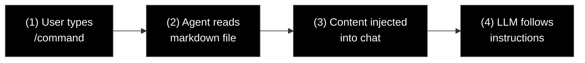
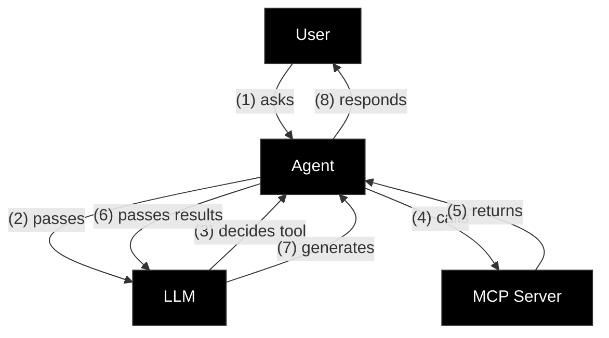
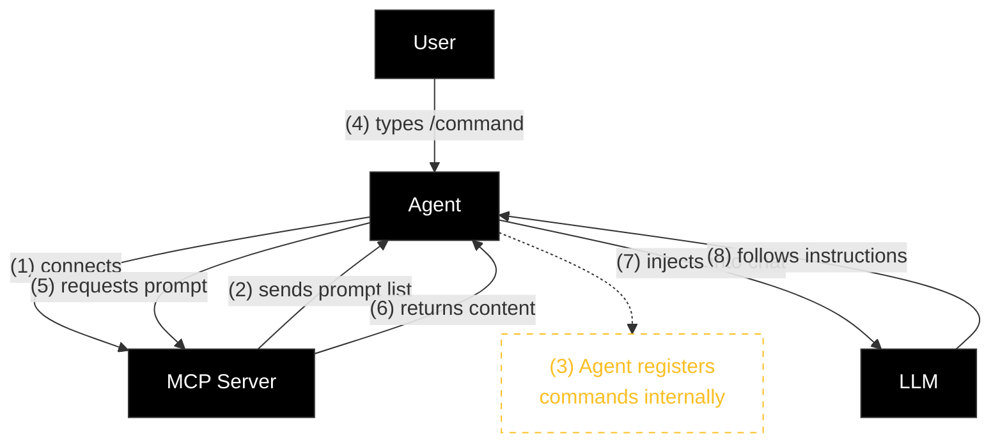
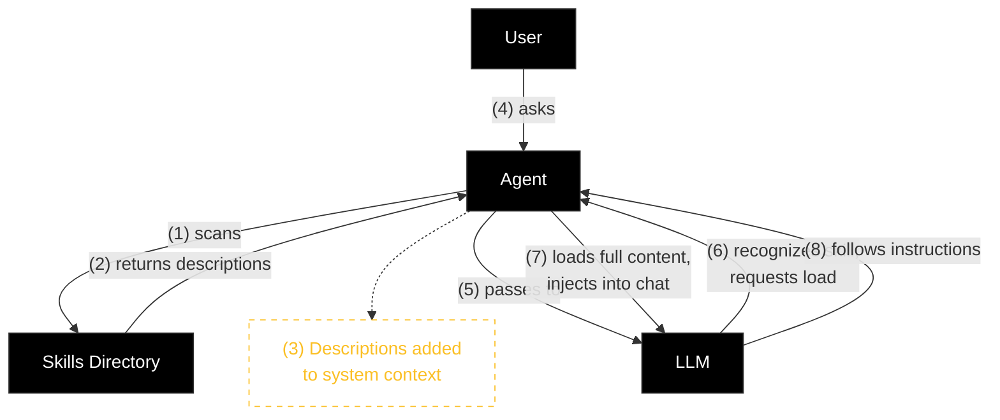

+++
title = 'Commands vs MCP vs Skills (What I Use)'
date = 2026-02-25T07:00:00+00:00
draft = false
+++

When working with coding agents, we can extend them with Commands, MCP tools, MCP prompts, Skills, subagents, rules, hooks, plugins, memories... It's madness. We seem to be getting something new every week. And every agent does things slightly differently.

So let's cut through the noise. I'll show you what each of these actually does, how they work under the hood, and most importantly, which ones you should actually use and when.

<!--more-->



## Setup

> This demo is using Claude Code as the coding agent. With a few modification, it should work with any other coding agents like Cursor, GitHub Copilot, etc. The major change you might need to make is to change `.mcp-kubernetes.json` to whichever format and location for MCP config your agent expects.

> If you don't have Claude Code already, and would like to install it, please follow [Setup Claude Code](https://code.claude.com/docs/en/setup) instructions.

```sh
git clone https://github.com/vfarcic/dot-ai

cd dot-ai

git pull

git fetch

git switch demo/commands-mcp-skills
```

> Make sure that Docker is up-and-running. We'll use it to run create a KinD cluster.

> Watch [Nix for Everyone: Unleash Devbox for Simplified Development](https://youtu.be/WiFLtcBvGMU) if you are not familiar with Devbox. Alternatively, you can skip Devbox and install all the tools listed in `devbox.json` yourself.

```sh
devbox shell

./dot.nu setup \
    --stack-version 0.22.0 \
    --kyverno-enabled false \
    --atlas-enabled false \
    --crossplane-enabled false

source .env

claude --mcp-config .mcp-kubernetes.json --strict-mcp-config
```

## Slash Commands

Let's start with **Commands**, sometimes called **Prompts**. These were among the first ways to extend what coding agents could do beyond their built-in capabilities. Before MCP came along in late 2024, if you wanted your agent to follow a specific workflow, you'd write a Command.

Commands are pre-defined prompt templates triggered by shortcuts like `/commit` or `/review`. They're stored as markdown files that expand into full instructions when invoked. Essentially, it's the same as if you saved a set of instructions somewhere and copy-pasted them into the chat whenever you needed them. Commands just automate that process.

Let me show you how this works. I have a command called `create-cicd` that helps set up CI/CD workflows.

[user]
```text
/create-cicd
```

[agent]
```text
⏺ I'll help you set up CI/CD workflows for your project. Let me start with the first
  question.

  Which CI/CD platform do you use?

  1. GitHub Actions
  2. Other
```

The agent immediately started following the workflow defined in that command. It's asking me questions, ready to generate CI/CD pipelines based on my answers. But I'm not here to actually create a pipeline. I want to show you what's happening behind the scenes.

> Cancel the execution. The point is not to create a CI/CD pipeline but to see how Commands work.

> Do not copy&paste instructions that start with `!`. For Claude Code to execute a command, `!` must be typed.

Let me show you the actual command file.

[user]
```text
!cat .claude/commands/create-cicd.md
```

[agent]
```md
---
name: generate-cicd
description: Generate intelligent CI/CD workflows through interactive conversation
by analyzing repository structure and user preferences
category: development
---

# Generate CI/CD Workflows

Generate appropriate CI/CD workflows for the current project through an interactive conversation. This prompt analyzes your entire repository, presents findings, asks about workflow preferences, and generates workflows based on your confirmed choices.

## Instructions

You are helping a developer set up CI/CD workflows for their project. Unlike template-based generators, you will:

1. **Analyze** the entire repository - source code, automation, configs, docs, existing CI
2. **Present findings** and workflow options to the user for decision-making
3. **Generate** workflows based on confirmed user choices

This interactive model is essential because CI/CD workflows involve **policy decisions** (PR vs direct push, release triggers, deployment strategy) that cannot be deduced from code alone—they reflect team preferences and organizational policies.
...
```

That's it. It's just a markdown file with some metadata at the top and instructions below. When I typed `/create-cicd`, the agent found this file in whatever directory it expects commands to be stored, read its contents, and injected the entire thing into the conversation as if I had typed it myself. The LLM then followed those instructions, which is why it started asking me about CI/CD platforms. By the way, the fact that each agent expects commands in a different location is one of the problems we'll get to shortly.

The process is straightforward. (1) You type a shortcut. (2) The agent reads the corresponding markdown file. (3) The content gets injected into the chat. (4) The LLM follows the instructions. No magic, no special runtime. Just text injection.



**Pros:** consistency, maintenance

Now, Commands have some clear advantages. **Consistency** is the big one. The same workflow gets executed the same way every time. The inputs and outputs might differ, but the process stays identical. And **maintenance** is dead simple. You modify a markdown file, push it to Git, and you're done. No deployments, no server restarts. Just text.

**Cons:** distribution, no standard location, discoverability

But there are downsides. **Distribution** is a pain. If you want to use the same command in multiple projects, you have to copy the file to each one. And then what happens when you update the original? Now you've got drift. It's the same problem we have with libraries. When we need functionality in multiple places, we don't copy and paste code. We create a library, or we spin up a service. Commands don't have that option.

There's also **no standard location**. How commands work is standardized, but where they live is not. Claude Code expects them in `.claude/commands/`. Cursor uses `.cursor/rules/`. GitHub Copilot looks for `.github/copilot-instructions.md`. Windsurf wants `.windsurf/rules/` or `.windsurfrules`. Every agent has its own convention. If you switch agents or use multiple ones, you're maintaining duplicate files in different locations or you're creating soft links while wondering about the meaning of life and whether it's worth living.

And finally, **discoverability**. The LLM doesn't know your commands exist unless you explicitly invoke them. It can't look at your context and decide "oh, this would be a good time to run the `/create-cicd` command." You have to remember to use it yourself.

## MCP Tools

Now let's talk about **MCP Tools**. MCP stands for Model Context Protocol, and it's a completely different approach. Instead of injecting text into a conversation, MCP exposes external capabilities to AI agents through a standardized protocol. These are server-based tools that agents can invoke during conversations.

Let me show you what this looks like in practice. I'm going to ask the agent to query Kubernetes resources.

[user]
```text
Query all resources related to dot-ai and show relations between them.
```

[agent]
```text
⏺ dot-ai - query (MCP)(intent: "Show all resources related to dot-ai and their
                      relationships")
  ⎿ {
      "success": true,
      "summary": "## Dot-AI Resources and Relationships\n\n### **Overview**\nDot-A
    … +122 lines (ctrl+o to expand)


⏺ Dot-AI Resources and Relationships

  Architecture Components

  Core Services (Deployments):
  Component: dot-ai
  Image Version: ghcr.io/vfarcic/dot-ai:0.193.0
  Port: 3456/TCP
  Purpose: MCP server for AI-powered K8s operations
  ────────────────────────────────────────
  Component: dot-ai-ui
  Image Version: ghcr.io/vfarcic/dot-ai-ui:0.10.0
  Port: 3000/TCP
  Purpose: Web interface
  ────────────────────────────────────────
  Component: dot-ai-controller-manager
  Image Version: v0.43.0
  Port: -
  Purpose: Manages CRDs (Solutions, CapabilityScanConfigs, ResourceSyncConfigs)
  Data Storage:
  - dot-ai-stack-qdrant (StatefulSet) - Qdrant vector database v1.15.5 with 10Gi
  storage

  Networking

  Services:
  - dot-ai (ClusterIP: 10.96.82.161:3456)
  - dot-ai-ui (ClusterIP: 10.96.214.200:3000)
  - dot-ai-stack-qdrant (ClusterIP: 10.96.178.163:6333-6335)

  Ingresses:
  - http://dot-ai.127.0.0.1.nip.io → dot-ai:3456
  - http://dot-ai-ui.127.0.0.1.nip.io → dot-ai-ui:3000

  Resource Flow

  External Users
      ↓
  [Ingress Controller]
      ↓
  ┌───────────────────────────────────────────┐
  │            dot-ai Namespace               │
  │                                           │
  │  [dot-ai-ui] ──→ [dot-ai Service]         │
  │                        ↓                  │
  │                 [dot-ai Pod]              │
  │                        ↓                  │
  │              [qdrant StatefulSet]         │
  │                        ↓                  │
  │                [10Gi PVC Storage]         │
  │                                           │
  │  [Controller Manager] ──watches──→ CRDs   │
  │       ↓                                   │
  │  CapabilityScanConfig  ResourceSyncConfig │
  │  (69 capabilities)     (364 resources)    │
  └───────────────────────────────────────────┘

  Custom Resource Definitions

  - solutions.dot-ai.devopstoolkit.live
  - capabilityscanconfigs.dot-ai.devopstoolkit.live
  - resourcesyncconfigs.dot-ai.devopstoolkit.live
  - remediationpolicies.dot-ai.devopstoolkit.live

  Status Summary

  - Total Resources: 17 (all Ready)
  - Pods: 4 Running
  - Resource Types Watched: 68
  - Resources Synced: 364

  Interactive visualization:
  http://dot-ai-ui.127.0.0.1.nip.io/v/qry-1768785009028-b6f10a4b
```

Notice what happened here. I didn't invoke a command. I just asked a question in plain English. The LLM looked at my request, decided it needed to query Kubernetes, and called an MCP tool to do it. The tool talked to the Kubernetes API, gathered all the information about dot-ai resources, and returned structured data that the LLM then formatted for me.

How did the LLM know to call that MCP tool? It works the same way as built-in tools like file reading or bash commands. When an MCP server connects, it registers its tools with descriptions explaining what each one does. The LLM sees these descriptions and decides, based on your request, which tool would help. I didn't have to tell it to use MCP. It figured that out from context, just like it would decide to read a file or run a command.

There are two big distinctions compared to Commands. First, Commands require explicit invocation. You have to type `/something` to trigger them. MCP tools are called by the LLM based on context. The LLM decides when to use them, just like it decides when to use built-in tools. Second, Commands are instructions in markdown format. An MCP server can be anything. It can return static instructions like Commands do, or it can talk to an API, query a database, call another agent, or do anything else you can code. It's a server, not a file.

The flow is different from Commands. (1) The user asks a question. (2) The agent passes it to the LLM. (3) The LLM decides which tool to call and tells the agent. (4) The agent calls the MCP server. (5) The server returns results. (6) The agent passes results to the LLM. (7) The LLM generates a response. (8) The agent responds to the user.



**Pros:** extended capabilities, standardized interface, reusability, automatic execution, distribution

MCP tools have significant advantages over Commands. **Extended capabilities** is the big one. A server can do anything you design it to do. Commands serve static markdown. MCP servers can talk to APIs, query databases, run computations, whatever you need. They effectively extend an agent's capabilities beyond what's baked in.

There's also a **standardized interface**. MCP is a standard communication protocol between an agent and a server. Unlike Commands, where every agent has its own directory convention, MCP works the same way everywhere.

**Reusability** is another win. Commands live in a project. If you want to use them elsewhere, you copy files. With MCP, any agent in any project can gain all the capabilities of a server just by connecting to it. One server, unlimited clients.

**Automatic execution** is huge. Just like built-in tools, the LLM decides when to call MCP tools based on context. You don't have to remember to invoke them. The agent figures it out. And **distribution** becomes trivial. Agents connect to a centrally managed server instead of maintaining files across multiple repos.

**Cons:** latency, system context, third-party quality, investment

But MCP has downsides too. **Latency** is real. Network calls add response time. Every tool invocation is a round trip.

MCP tools also **use system context**. Tool descriptions and schemas get loaded into the system prompt, reducing the available context for your actual conversation. Connect too many MCP servers and you're burning tokens before you even start.

**Third-party quality** is a problem. The MCP ecosystem exploded, and a lot of those servers are poorly written. You need to vet what you're connecting to. And unless it's open source, you have no idea what's actually in there. Even open source servers can have vulnerabilities. Tool poisoning attacks hide malicious instructions in tool metadata. Prompt injection can sneak commands into data the server returns. Security researchers have demonstrated real exploits, including one that exfiltrated an entire WhatsApp history through a compromised MCP server. Be careful what you connect to.

And finally, **investment**. Writing a Command is easy. It's just a markdown file. Writing an MCP server requires actual code, deployment, maintenance. The payoff is worth it for capabilities you'll use repeatedly, but it's a higher barrier to entry.

## MCP Prompts

Sometimes you want the simplicity of Commands. Just instructions for the LLM to follow. But you don't want to deal with syncing files across repos or worrying about which folder each agent expects them in. That's where MCP prompts come in. You get the simplicity of Commands with the distribution benefits of MCP.

MCP servers can serve prompts, not just tools. These are essentially Commands delivered dynamically through the MCP protocol. Let me show you what this looks like.

[user]
```text
/generate-dockerfile
```

[agent]
```text
❯ /dot-ai:generate-dockerfile (MCP)
...
───────────────────────────────────────────────────────────────────────────────────────
 Edit file Dockerfile
╌╌╌╌╌╌╌╌╌╌╌╌╌╌╌╌╌╌╌╌╌╌╌╌╌╌╌╌╌╌╌╌╌╌╌╌╌╌╌╌╌╌╌╌╌╌╌╌╌╌╌╌╌╌╌╌╌╌╌╌╌╌╌╌╌╌╌╌╌╌╌╌╌╌╌╌╌╌╌╌╌╌╌╌╌╌╌
 19  # - ca-certificates: TLS verification (required for helm repo operations)
 20  # - git: Required for user-prompts feature (git clone from user repositories)
 21  RUN apt-get update && \
 22 -    apt-get install -y ca-certificates git && \
 22 +    apt-get install -y --no-install-recommends ca-certificates git && \
 23      apt-get clean && \
 24      rm -rf /var/lib/apt/lists/*
 25
...
 36  # Set working directory
 37  WORKDIR /app
 38
 39 -# Create required directories
 40 -RUN mkdir -p /app/sessions /app/tmp
 39 +# Create non-root user for security (UID 10001 for unprivileged range)
 40 +RUN groupadd --gid 10001 dotai && \
 41 +    useradd --uid 10001 --gid dotai --shell /bin/false --create-home dotai
 42
 43 +# Create required directories with correct ownership
 44 +RUN mkdir -p /app/sessions /app/tmp && \
 45 +    chown -R dotai:dotai /app
 46 +
 47  # Set default environment variables
 48  ENV DOT_AI_SESSION_DIR=/app/sessions
 49  ENV NODE_ENV=production
...
 48  ENV PORT=3456
 49  ENV HOST=0.0.0.0
 50
 51 +# Switch to non-root user
 52 +USER dotai
 53 +
 54  # Expose port for HTTP transport (used when TRANSPORT_TYPE=http)
 55  EXPOSE 3456
 56
╌╌╌╌╌╌╌╌╌╌╌╌╌╌╌╌╌╌╌╌╌╌╌╌╌╌╌╌╌╌╌╌╌╌╌╌╌╌╌╌╌╌╌╌╌╌╌╌╌╌╌╌╌╌╌╌╌╌╌╌╌╌╌╌╌╌╌╌╌╌╌╌╌╌╌╌╌╌╌╌╌╌╌╌╌╌╌
 Do you want to make this edit to Dockerfile?
 ❯ 1. Yes
   2. Yes, allow all edits during this session (shift+tab)
   3. No
```

> Cancel the execution. The point is not to create a Dockerfile but to see how Commands work.

Notice the `/dot-ai` prefix. That tells you this prompt came from the MCP server, not a local file. The agent fetched the prompt instructions over the network, and the LLM is now following them just like it would follow a local Command. Same simplicity, different delivery mechanism.

The process has two phases. When the agent starts: (1) the agent connects to the MCP server, (2) the server sends a list of available prompts with names and descriptions, and (3) the agent registers them as available commands. Later, when the user invokes a prompt: (4) the user types the command, (5) the agent requests the full prompt from the server, (6) the server returns the prompt content, (7) the agent injects it into the chat, and (8) the LLM follows the instructions.



**Pros:** centralized management, dynamic content, security, distribution

The advantages over local Commands are clear. **Centralized management** means prompts are maintained in one place. Update the server, and every connected agent gets the new version. **Dynamic content** is possible since the server constructs the prompts. They can embed data from a database, customize based on context, whatever you need. **Security** can be built in. Which prompts are available and what they contain can be based on RBAC permissions. And **distribution** is automatic. Every project connected to the server gets the prompts without copying files.

**Cons:** latency, transparency, customization, initial cost

But there are trade-offs. **Latency** exists because the agent fetches the prompt over the network. **Transparency** suffers because users can't just open a markdown file in their repo to see or modify the prompt. **Customization** becomes complex if you need per-project overrides. And there's the **initial cost**. Starting with a local Command is easier than setting up a server. Though if you're using the same prompts across many projects, the server approach often costs less in the long run.

## Agent Skills

So we've got Commands that are simple but require explicit invocation, and MCP tools that the LLM can call automatically but require more infrastructure. What if you want both? What if you want the simplicity of a markdown file but also want the LLM to use it when appropriate?

That's exactly what **Skills** provide. They're essentially Commands that the LLM can discover and invoke on its own. Same markdown format, same ease of maintenance, but with automatic invocation like MCP tools.

Let me show you what this looks like.

[user]
```text
/changelog-fragment
```

[agent]
```text

⏺ I'll help you create a changelog fragment. Let me first identify the PRD from the
  current context.

  Looking at the recent commits and branch name demo/commands-mcp-skills, this appears
  to be related to a demo or documentation about commands vs MCP vs skills. Let me
  check for any PRD files or recent work.

⏺ Search(pattern: "prd/**/*.md")
  ⎿  Found 0 files

⏺ Read(pyproject.toml)
  ⎿  Read 36 lines

⏺ I found the fragment types. There are no PRD files in the prd/ directory. Let me
  check the changelog.d directory to see existing fragments and look for any PRDs
  elsewhere.

⏺ Search(pattern: "**/*prd*.md")
  ⎿  Found 13 files (ctrl+o to expand)

⏺ Search(pattern: "changelog.d/**/*.md")
  ⎿  Found 0 files

⏺ I found PRDs in prds/done/. The changelog.d directory is empty or doesn't exist yet.


───────────────────────────────────────────────────────────────────────────────────────
 ☐ PRD

Which PRD should I create release notes for?

❯ 1. #182 - PR Template Integration
     prd-done-pr-template-integration
  2. #18 - PRD Creation Workflow
     prd-creation-workflow
  3. #17 - PRD Completion Workflow
     prd-completion-workflow
  4. #15 - PRD Start Design Workflow
     prd-start-design-workflow
  5. Type something.

───────────────────────────────────────────────────────────────────────────────────────
  Chat about this
```

> Cancel the execution. The point is not to create a changelog fragment but to see how Skills work.

That looks exactly like a Command, right? I typed `/changelog-fragment`, and the agent started following the workflow defined in that skill. Nothing surprising there.

But here's where it gets interesting. Watch what happens when I don't use the slash command.

[user]
```text
Create changelog fragment for release notes
```

[agent]
```text
⏺ Skill(changelog-fragment)
  ⎿  Successfully loaded skill

⏺ I'll help you create a changelog fragment. First, I need to identify the PRD.

  Which PRD should I create release notes for? You can provide:
  - A PRD number (e.g., 320)
  - A PRD file path (e.g., prd/prd-320-feature-name.md)
  - Or describe the feature if you'd like me to search for it
```

> Cancel the execution. The point is not to create a changelog fragment but to see how Skills work.

Notice what happened. I just asked in plain English to "create a changelog fragment." I didn't invoke any command. The LLM looked at my request, recognized that a skill existed for this exact purpose, and invoked it automatically. See that `Skill(changelog-fragment)` line? The agent decided on its own to load that skill based on context.

This is the key difference from Commands. With a Command, you have to remember to type `/something`. With a Skill, the LLM can recognize when a skill would be helpful and invoke it for you. It's like having MCP's automatic invocation but with the simplicity of a markdown file.

Let me show you what the skill file looks like.

[user]
```text
!cat .claude/skills/changelog-fragment/SKILL.md
```

[agent]
```md
---
name: changelog-fragment
description: Create changelog fragment for release notes. Invoke during /prd-done
workflow during the first push to the PR.
---

# Create Changelog Fragment

Create a towncrier changelog fragment for release notes when completing PRD work. This should be included in the PR so the fragment is reviewed along with the code changes.

## Workflow

### Step 1: Identify the PRD

If not already known from context, ask: "Which PRD should I create release notes for?"

Look for:
- PRD mentioned in recent conversation
- PRD referenced in current branch name (e.g., `feature/prd-320-*`)
- PRD file path provided by user
...
```

Look familiar? It's just a markdown file with metadata at the top and instructions below, exactly like a Command. The only real difference is where it lives. Skills are stored in agent-specific directories. Claude Code expects them in `.claude/skills/`. GitHub Copilot uses `.github/skills/`. Cursor puts them in `.cursor/skills/`. Windsurf wants `.windsurf/skills/`. Each skill gets its own folder containing a `SKILL.md` file. Same problem as Commands when it comes to location, no universal standard.

So how does the LLM know this skill exists? When the agent starts, it scans the skills directory and reads the `description` field from each skill's metadata. Just the description, not the full content. These descriptions get added to the system context, so the LLM knows what skills are available and what they do. When you make a request that matches a skill's description, the LLM can decide to invoke it. Only then does the full skill content get loaded.

This is important. Unlike MCP tools that load their entire schemas into the system context upfront, Skills only load their descriptions initially. The full instructions stay on disk until needed. Less context consumed means more room for your actual conversation.

The flow combines elements from both Commands and MCP. At startup: (1) the agent scans the skills directory, (2) reads skill descriptions from metadata, and (3) adds descriptions to the system context. Later, when you make a request: (4) the user asks something, (5) the LLM recognizes a skill matches, (6) the agent loads the full skill content, (7) injects it into the chat, and (8) the LLM follows the instructions.



**Pros:** dual invocation, minimal context, separate execution

Skills give you the best of both worlds. **Dual invocation** means you can trigger them explicitly with `/skill-name` when you know exactly what you want, or just describe your intent and let the LLM invoke them automatically. You're not locked into one approach.

**Minimal context** usage is a significant advantage. Only the skill descriptions get loaded into the system context initially, not the full instructions. Compare that to MCP tools where the entire schema sits in the system prompt from the start. Skills are more efficient with your context window.

Some agents also support **separate execution** contexts for skills. The skill can run in its own context, do its work, and return only the relevant results to your main conversation. This keeps your primary context clean and focused.

**Cons:** distribution, no standard location

But Skills inherit some problems from Commands. **Distribution** is still a pain. If you want the same skill in multiple projects, you're copying files. And when you update the original? Now you've got drift across repos. It's the same library problem we've always had. When you need functionality in multiple places, you don't copy code, you create a library or a service. Skills don't have a built-in solution for this yet.

And there's still **no standard location**. The skill format itself is standardized, which is great. But where they live? Every agent picks its own directory. You're back to maintaining duplicate files or creating symlinks if you use multiple agents.

## Agent-Specific Extensions

There are other ways to extend coding agents beyond Commands, MCP, and Skills. The problem is they're all agent-specific.

Claude Code has **Subagents**, specialized autonomous agents you can spawn for specific tasks. They run in isolated contexts with their own tool permissions. There are also **Hooks** that intercept tool execution, letting you validate or block operations before they happen. And **Plugins** bundle multiple skills, commands, subagents, and hooks into distributable packages.

Cursor has **Hooks** in beta for runtime control points during the agent loop.

Windsurf has **Memories**, auto-generated context that persists across conversations based on your interactions.

See the pattern? Your subagents won't work in Cursor. Your hooks might work differently or not at all across agents. Your Windsurf memories are useless everywhere else.

My recommendation? Don't use any of these unless you really, really need to. Stick with **Commands**, **MCP**, and **Skills**. They're the closest thing we have to standards, and they give you portability. The agent-specific stuff locks you in.

## Slash Commands vs MCP vs Skills

Here's the thing that took me a while to understand: Skills and MCP aren't competing. They're complementary layers.

Think of it like GitHub Actions. A workflow YAML file describes what should happen: run tests, build the image, deploy to staging. But the YAML doesn't actually execute anything. The runner does. Without a runner, the workflow is just a plan.

Skills are the workflow. MCP is the runner.

**MCP gives agents abilities.** It connects them to APIs, databases, external systems. It lets them do things they couldn't do before.

**Skills teach agents how to use those abilities well.** They encode your team's conventions, best practices, and domain knowledge. A skill can tell the agent "when deploying, always run these checks first" or "when creating a PR, follow this template."

A Skill can call MCP tools. It can instruct the agent to use specific MCP capabilities as part of its workflow. They work together.

So when do you use what?

**Commands are for explicit-only invocation.** You never want the LLM deciding on its own to run this workflow. You'll always type `/something` to trigger it. In that case, Skills would just waste context by loading descriptions the LLM will never act on.

**Skills are for auto-invoked workflows.** They're just as easy to write as Commands, same markdown format, same maintenance effort. But Skills let the LLM recognize when the context matches and invoke them automatically. The agentskills.io specification means your SKILL.md files work across Claude Code, Cursor, GitHub Copilot, and others.

**MCP is for capabilities and centralized distribution.** Need to query Kubernetes, talk to internal APIs, access databases, or communicate with other agents? If the agent needs to *do* something, not just follow instructions, you need MCP. Yes, there's A2A protocol designed specifically for agent-to-agent communication, but MCP is already adopted by every agent worth using. Why wait for another standard when MCP already works?

Here's the catch though. Commands and Skills work great if you're a single person on a single project, or if your entire team uses the same agent. But what happens when you have multiple projects, multiple teams, or people using different agents? Now you're copying files everywhere and dealing with drift. MCP solves this. Run your servers remotely, have a dedicated team handle the lifecycle, updates, and security. Developers just connect and use. Update the server once, and every developer on every project with every agent gets the new version. No copying files. No drift. No wondering if someone's running an outdated command.

**MCP Prompts are for centralized instruction distribution.** Same ease of writing as a local Command, just markdown with instructions. But managed and distributed through the server, not copied across repos.

And if you're building something sophisticated? Use them together. MCP provides the capabilities and centralized distribution. Skills encode team conventions for those who want local customization. Commands give explicit shortcuts when automatic invocation would be unwanted.

The landscape of agent extensions might look like madness. But now you know what actually matters.

## Destroy

```sh
exit

./dot.nu destroy

git switch main

exit
```

