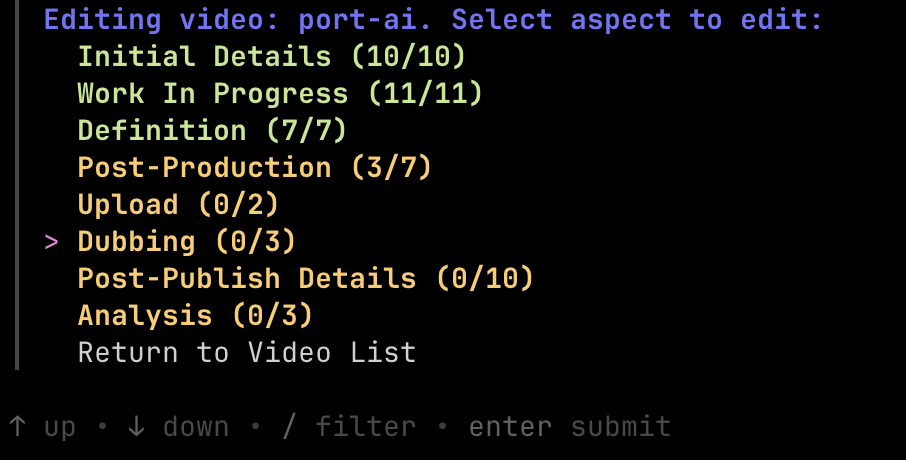
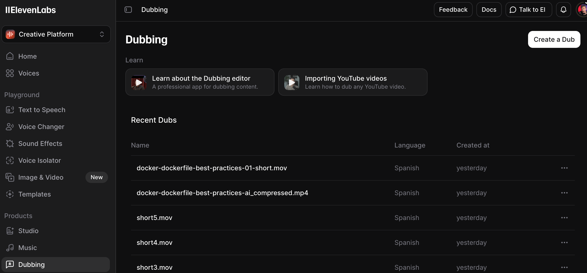
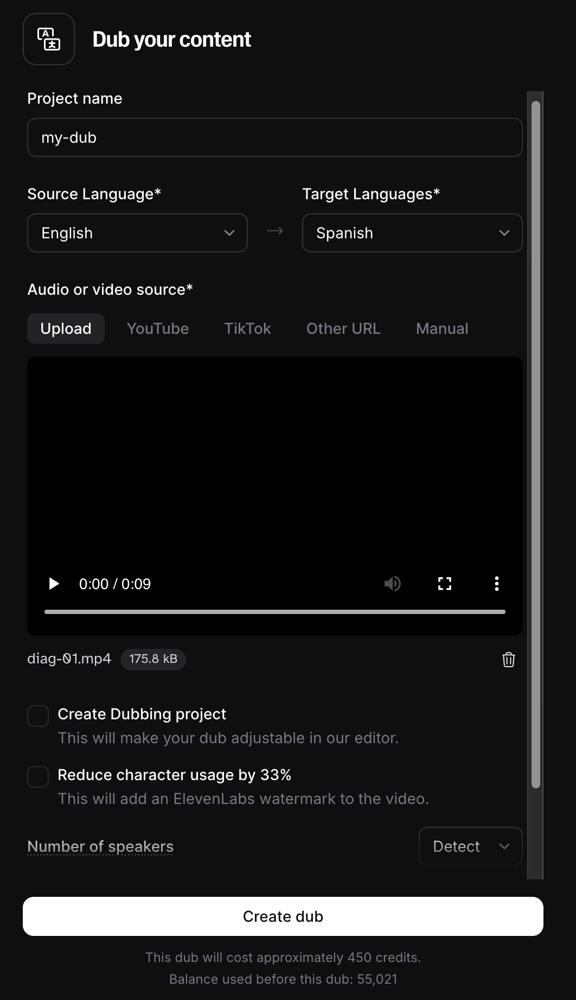
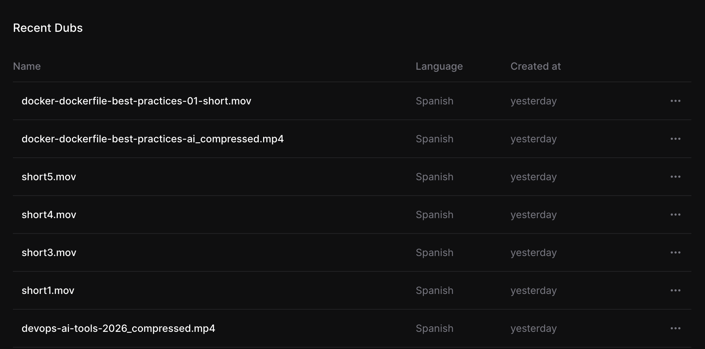
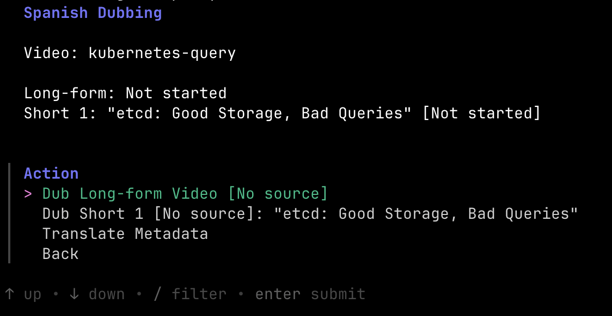

+++
title = "ElevenLabs API Review: A Developer's Brutally Honest Take"
date = 2025-02-09T16:00:00+00:00
draft = false
+++

I'm a software engineer and I got addicted to AI.

I use it to write code, to operate clusters, to analyze test failures, to pick which pull request I should work on. But here's the thing. I noticed there's so much more we can do with AI. We can use it for almost anything.

Today I want to explore multimedia from a software engineering perspective. Not how to click buttons in some fancy UI. I want to show you how to integrate audio and video APIs into your workflows and applications. And I'll use my own YouTube automation as the example.

That sounds just about right for this channel. I guess I deal with too many languages and sometimes get confused. Speaking of which, that transition you just heard? That wasn't me speaking Spanish or French. That was AI. And by the end of this video, you'll know exactly how to build that yourself.

<!--more-->



## ElevenLabs API for Developers

UI is for "normies". Software engineers don't click buttons. We write code that uses APIs to accomplish things.

We might want to convert text to speech, generate images and videos, dub content into other languages, or something similar. That might be a feature of an application we're building, or it might be a task we do periodically. Either way, we want to make it part of a process. We want it to be automated and repeatable.

Here's an example. I'm a software engineer who, in his spare time, publishes videos on YouTube, like the one you're watching right now. That's a process with many steps. I need to record ideas, figure out which idea to pursue, transform the experience into a manuscript, record video and audio, write notes that help the editing process, edit the actual video, schedule it on YouTube, post to social media, create shorts, and so on.

Since I'm a software engineer, I don't do any of that using the tools a normal person would use. I don't write my notes in a Word document. I don't publish to BlueSky through a browser. I don't brainstorm with AI through the ChatGPT UI. Instead, I built a CLI that handles almost everything related to my videos.

This is what my CLI looks like. The main menu gives me options to create a new video, list existing ones, analyze performance, or have a conversation with AI about my content.

When I select a video, I get a submenu with all the different aspects I can work on. Initial details, work in progress notes, definition, post-production, upload, dubbing, and more. Each one tracks progress and handles the tasks specific to that phase.

Much of what this CLI does is communicate with third-party APIs. Need to brainstorm with AI? Gather the context and call its API? Publish to BlueSky? Call the APIs. You get the point. There's no need for me to explain what software engineers do.

The last addition to my process was dubbing videos to other languages. There are plenty of options out there, and a "normie" would evaluate them primarily based on what they do and how nice the UI is. Not me. Not you. Not us software engineers.

Let me show you what dubbing looks like without automation. That's how my mom would do it.

First, I open ElevenLabs and navigate to the Dubbing section. On the left sidebar you can see all the features they offer. Text to Speech, Voice Changer, Sound Effects, Voice Isolator, and more. I select Dubbing and see my recent dubs.

Now I need to create a new dub. I click the button, give it a name, select the source language, pick the target language, and upload my video file. Then I configure the number of speakers or let it auto-detect. Finally, I click Create dub and wait. And wait. Depending on the video length, this can take a while.

Eventually it finishes and I can download the dubbed video.

But I'm not done. Now I need to open YouTube Studio, upload the dubbed video, wait for that to process, manually translate the title, description, and tags, set the thumbnail, configure scheduling, and so on. And those are just a fraction of the tasks I need to perform.

And that's just one video in one language. Imagine doing this for every video, in multiple languages. This is why automation matters.

APIs matter. If the API of a solution we want to integrate with sucks, nothing else matters. It doesn't matter how well something works if it can't be used by our apps, or if we'll spend too much time on workarounds.

So I explored different options with API being an important criteria. You know what came up on top? ElevenLabs. Everything except beta features is accessible through their API.

It's well documented. It's easy to understand, and even easier to implement. It became my choice for certain operations. In some cases I'm converting text to speech, in others I'm searching for sound effects, and so on. If it's related to audio or video, they have it. The one that matters the most, for me, is dubbing.

So instead of all those manual steps, I just run a single command. It uploads the video, waits for the dubbing to finish, downloads the result, translates the metadata, and uploads everything to YouTube. Done.

Building that integration took only a few hours. There are two reasons why I could do it that fast. First, Claude Code and Opus are amazing. Second, and more important for this story, is the ElevenLabs API. It's easy to work with, it's complete, and it's well documented. It was easy for me to figure it out, and even easier for Claude.

If you want to see the full result, check out my Spanish channel. The link is in the description. It's the same content, same voice, just... not me speaking Spanish. By the way, I do speak Spanish, but going through the whole recording, editing, and production process again would take too much of my time. Dubbing takes close to zero effort from my side.

But this isn't just about my YouTube workflow. Where else might you, as a DevOps or SRE engineer, encounter audio and video APIs?

Think about documentation and training videos. You could localize onboarding content for global teams automatically. Or incident communication. Imagine text-to-speech for alerts, or voice summaries for on-call engineers. You could auto-narrate product demos from scripts. Add audio descriptions to internal tooling screencasts for accessibility. Or dub your KubeCon presentation for international audiences.

The point is, multimedia APIs aren't just for content creators. They're tools that can solve real problems in engineering workflows.

Now, ElevenLabs isn't perfect. No tool is. So let's talk about what works well and what doesn't.

## Is ElevenLabs Worth It?

Let me break down what works, what doesn't, and whether the trade-offs are worth it.

**Cons:**
- Slow support
- YouTube dubbing broken
- 1GB limit
- ToS concerns

**Support** is slow. It takes days to get a response, and when they do reply, it's usually a follow-up question that takes another few days to answer. A single support interaction can drag on for weeks.

**Dubbing from YouTube URLs doesn't work.** I spent time building code to call their API with YouTube links, and it never worked. Not once. Support admitted it "sometimes doesn't work," but in my experience, it never does. They should just remove that option from the API. On top of that, **uploading local files is limited to 1GB.** My videos are way bigger than that, so I had to build additional logic to compress them before uploading. The API itself is great, but some of ElevenLabs' underlying features have serious limitations.

**The Terms of Service are concerning.** In February 2025, ElevenLabs updated their ToS to claim a "perpetual, irrevocable, royalty-free, worldwide license" to use your voice data. They say they won't commercialize your voice standalone without permission, but they retain rights to any models or derivatives created from your recordings, even after you delete your account. This caused enough backlash that some companies publicly ended their partnerships with ElevenLabs over it. So if your voice is sexy enough, you might appear in the next commercial, or it might turn out you're the next porn star. Who knows.

**Pros:**
- API quality
- Voice quality
- Pacing
- Intuitive UI
- Refunds

The **API is excellent.** I already said this, but it's worth repeating. Well documented, complete, easy to implement. That's rare.

The **voice quality is impressive.** The dubbed audio isn't indistinguishable from my real voice, but it's close. Close enough that viewers won't be distracted by it too much.

The **pacing matches the original.** Words and sentences have different lengths in different languages, but ElevenLabs adjusts the speech speed so the dubbed audio fits the same timing as the original. That's a nice touch.

The **UI is intuitive.** I only used it for the first 30 minutes to understand what ElevenLabs does before switching to the API, but I had no trouble figuring out how everything works.

When things don't work, **they refund credits.** The YouTube dubbing failures I mentioned? They refunded all of that. That's refreshing. Many services would just say "too bad" and move on.

So, are there concerns? Definitely. Are they specific to ElevenLabs? Most of them are common across the industry. That's just the world we live in, unfortunately.

Is the dubbing perfect? Can you tell it's not actually me talking? Yes, you can. But is it worse than when professional actors dub videos? No. I live in Spain where most people watch movies dubbed by local voice actors, and honestly, that's not any better. If anything, AI dubbing might be an improvement, it's cheaper and faster, and it's only going to improve with time.

The one thing I can't brush off is the support. It's not a cheap service, and I expect support to be on par with the price. It isn't.

But the API? Amazing. If you want to incorporate audio or video capabilities into your applications, ElevenLabs is a solid choice. And if you want proof, check out my Spanish channel. Link's in the description.

