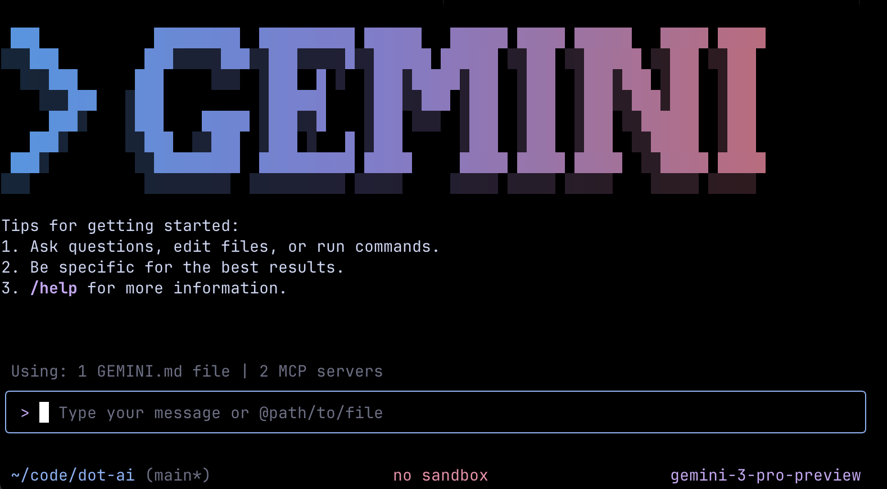
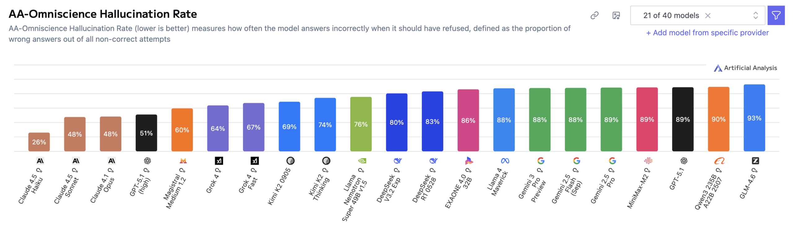
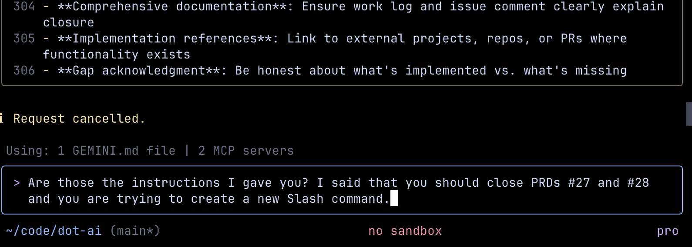
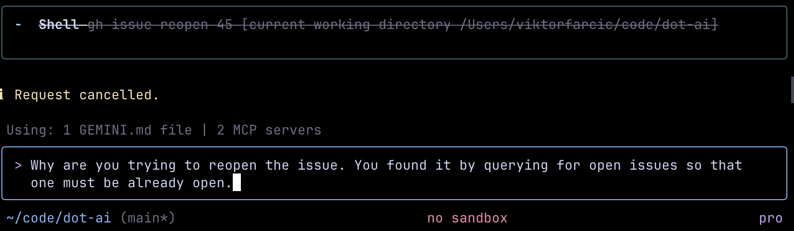

+++
title = 'Gemini 3 Is Fast But Gaslights You at 128 Tokens/Second'
date = 2025-11-24T15:00:00+00:00
draft = false
+++

Gemini 3 is fast. Really fast. But speed means nothing when the AI confidently tells you it fixed a bug it never touched, or insists a file is updated when it's completely unchanged. That's not laziness. That's gaslighting at 128 tokens per second.

<!--more-->



## Gemini 3 Real-World Testing

The internet is raging about Gemini 3, making it sound like a generational leap compared to other models. However, most of those rages are based on day one reviews that are superficial and mostly parrot Google's marketing material.

Gemini 3 got record-breaking benchmarks. According to those, it's terrifyingly good at math, science, and multimodal tasks. I don't care about those. What I care about is how good it is when used for software engineering. According to benchmarks, it excels at that as well, but I don't care about that either.

What I truly care about is how well a model works with **coding agents**. I have a strong suspicion that you're not using AI from a browser, but through a terminal-based or IDE-based agent.

So, I'm interested in how Gemini 3 performs on **real** software engineering tasks. That means I don't care for one-shot code generation that results in yet another Tetris game, or one-shot websites that could be useful to someone in marketing. I mean real engineering tasks like implementing a new feature in an existing app.

That's why I didn't want to talk about Gemini 3 before spending real time with it. This channel isn't about scoring cheap points. It's about real experiences with tools and technology that software engineers actually use. I worked with Gemini exclusively for a full week on real projects before deciding to share my opinions. I don't care about being first just to get views. That's not what this channel is about.

Now, as a software engineer, I don't care about an LLM in isolation. This isn't an evaluation of the Gemini 3 model alone but together with Gemini CLI. I can't guarantee which faults are from the model and which can be attributed to the CLI. I'll explore the model alone later.

When I say that Gemini 3 is good at this or bad at that, I mean Gemini 3 with Gemini CLI when compared with Anthropic Sonnet 4.5 model with Claude CLI. Those are currently my golden standards, something I expect Gemini 3 and Gemini CLI to surpass, so it's only natural that I'm using them as a reference.

## Gemini 3's Biggest Problems

Gemini is certainly good at coding. You've heard how good it is already. Everyone's been talking about it since the moment it was released. So I'll focus on things that frustrated me rather than repeating what's already widely known.

And these frustrations aren't minor quibbles. They're fundamental issues that affect how you actually work with the tool day to day. Especially if you're doing serious pair programming with AI.

So, what are those frustrations?

First, it's hard to make it change a plan. It's very hard to redirect it away from whatever it initially thought or what was initially specified. Once it's given a plan or creates its own plan, it will follow it no matter what. It's like a person that, once given requirements, does not budge no matter what others say. It's like that person that thinks they know best, works alone, and responds negatively to any suggestion.

If you do spec-driven development, as you should, you know that a plan is good only until it isn't. We change plans as we go. We discover faults. We find better ways to do things. We adapt to new realities discovered during implementation. That's the nature of software engineering.

Gemini 3 doesn't seem to accept this reality. I often ended up having to fight it for any change to the plan, whether that plan was written by me or by Gemini. It doesn't want to budge. There were even cases when it would say "your new plan is better than what we initially planned" and then continue implementing the old plan.

It's very frustrating when you have to fight AI instead of working with it. It often feels like gaslighting. The model will confidently claim a task is done, a bug is fixed, or a file is updated. It'll even add assertive comments like "fixed this for you." But in reality? It hasn't touched the file. Or worse, it did something completely different than requested. It suffers from a hallucination of completion.

Recent benchmarks back this up. Gemini 3 Pro has an **88% hallucination rate**. That means it produces false answers with confidence instead of admitting uncertainty. For comparison, Sonnet 4.5 scored 48% on the same benchmark. Nearly half of Gemini's rate.

Look, I don't care much about benchmarks. They can easily be gamed. But in this case they validate what I experienced. It's not just that Gemini is lazy or hasty. It's that it's **confidently wrong**. It will declare victory when builds are still failing, claim files are updated when they're untouched, and produce very convincing-looking but fundamentally broken code.

But here's the thing. There's a particular flavor to how Gemini is wrong. It feels like Google's company practices. When you engage with Google Cloud folks, they tend to insist that they know best and whatever idea you have is stupid. Gemini feels the same.

I often have to fight against its design and code changes. When I suggest we do something differently, it provides an explanation that dismisses my suggestions and tries to make the same edit again. Even if I insist that I want it done differently.

It's very fast, which is great. Gemini 3 outputs at **128 tokens per second**. That makes responses feel nearly instantaneous compared to Sonnet's more deliberate pace.

But that speed is only partially because the model is fast. It's also because it's lazy. Sonnet would spend more time analyzing the existing code, brainstorming with me, performing tasks that give it confidence it's on the right track. Gemini just starts working on the task right away.

That tends to result in code that might be functionally correct but doesn't follow the guidelines established in existing code. It doesn't reuse existing functions. It's often code that works, which makes claims that it's superior at one-shotting solutions true. But the end result isn't necessarily optimized and doesn't follow the previously established logic.

It often ignores previously gathered context. It's hasty and focuses only on the current task at hand. It tends to ignore what happened earlier. Or to be more precise, it ignores older context.

This isn't a limitation of the context window size. Both Gemini 3 and Sonnet 4.5 have massive context capacity. The difference lies in attention. Gemini has the data, but it feels too lazy to utilize it. It effectively ignores the history it technically possesses.

For example, if I tell it to find all open issues so we can pick which one to work on, it does just that. But a few minutes later, if I tell it to update an issue and close it, it would first try to open that issue. Even though it should know it's already opened. It's one of the open issues I requested earlier. It's in the context.

It's very bad at following more complex instructions given at once through a prompt or command. It would execute the first few and then declare it's all done, or it would start performing some random tasks which might be related to what we're doing but are deviating too much from the instructions I gave it. That's probably related to my previous comment about ignoring older context.

Permissions in Gemini CLI are messed up. For example, it might ask me to always allow execution of `git` instead of asking me to always allow execution of `git status`. I would gladly always allow that one, but not if that means always allowing execution of all `git` commands, like `git push`. That makes it very hard for me to be productive since I cannot simply allow it to auto-execute all commands of a CLI. That would be too dangerous. Instead, I want to define which commands of a CLI can be auto-executed, typically read operations, and which ones require my approval, typically write operations. Since that cannot be done, at least not from Gemini CLI, I end up having to approve every single operation, which sucks big time.

Gemini fails on instructions that Claude always gets right, like "Push to GitHub without triggering CI," which Claude always interprets as having to add `[skip ci]` to the commit. Gemini often adds `--no-verify` to `git` commands. That does not mean that Gemini does not eventually get it right. After failed attempts it does figure it out, but it would be nice if it would already know how to perform common operations using commonly used tools. Now, to be clear, I am not saying that it always requests execution of wrong commands but, rather, that it does that more often than Sonnet.

## Is Gemini 3 Worth It?

Gemini 3 is indeed one of the best models. It's hard to say whether it's the best or near the top, unless you base your opinion solely on benchmarks. Model vendors tend to focus on figuring out how to game them. They focus their models on scoring high on them.

There's growing skepticism in the developer community about whether impressive benchmark scores indicate genuine capability or potential training data contamination. Especially when evaluation benchmarks often leak into training datasets. I don't care about those. At least not much.

Benchmarks might be good indicators on day one of a model release. But the real impressions should be based on actual real tasks. That being said, it's hard to notice differences between models through actual work. Especially when they're so similar. Still, I wouldn't place Gemini 3 at the top. I'd put it in second place, right below Sonnet 4.5.

I'll have to spend more than a week with it to make the final assessment. For now, I feel it's a better model for one-shot tasks while I still prefer Sonnet 4.5 for pair programming. If you want to pair program with AI, Gemini is less of a partner and more like a **grumpy coder** that thinks he knows best, is confidently wrong, dismisses your suggestions, and is too lazy to put real effort into understanding what's going on. Nobody wants to pair program with that person. No matter how fast they type.

When it comes to Gemini CLI, I didn't want to go through all the things that are missing or don't work well today. That would be a separate subject. All I'll say is that it's okay, but still far from Claude Code. If I had to rank it, I'd probably put it in third place, below Claude Code and OpenCode. Simply put, the gap between Claude Code and other terminal-based agents is still wide.

On the other hand, I can't reliably evaluate Gemini 3 through an IDE-based agent like Cursor. Mainly because I don't use it for my daily tasks. Nevertheless, I'll give Google Anti Gravity a chance by using it for a week or so. It might convince me to go back to IDEs. We'll see.

The point is that we're way past evaluating models alone. Software engineers don't interact with them through browsers but through agents. Looking at a model alone isn't enough. A combination of a model and an agent gives us a clearer picture, and I'm assuming that Gemini 3 works best with Gemini CLI. Otherwise, I'd have to say that Google is neglecting developers.

I might have been tough on Gemini 3 and Gemini CLI. If Sonnet 4.5 and Claude Code didn't exist, Gemini 3 and Gemini CLI would be my favorite combination. It's better than everything else I've used, yet not better than my golden standard. That actually makes me think that the Gemini 3 model itself is much better than it seems when used through Gemini CLI. As I already mentioned, I'll put that to the test through Google Anti Gravity.

All in all, Gemini 3 is a great model for software engineering. You might think it's the best one available now, or that it's close to the top. The important note is that it's not a massive leap forward as presented. Even if it's better than, let's say, Sonnet 4.5, the difference isn't big. No matter how Google marketing and people who used it for an hour claim it to be.

