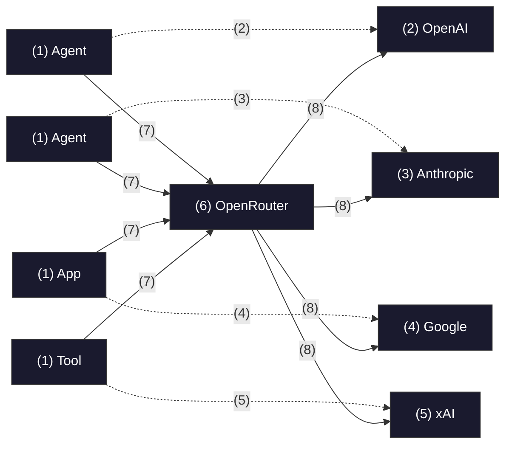
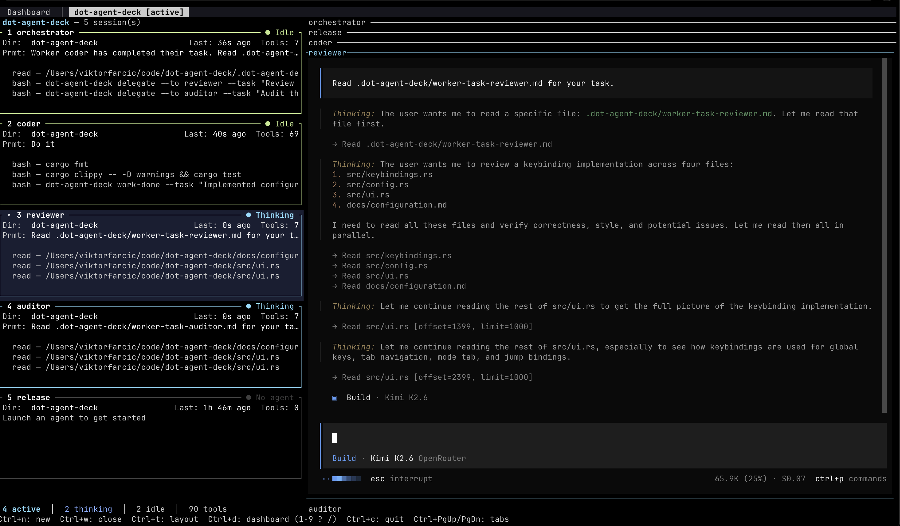
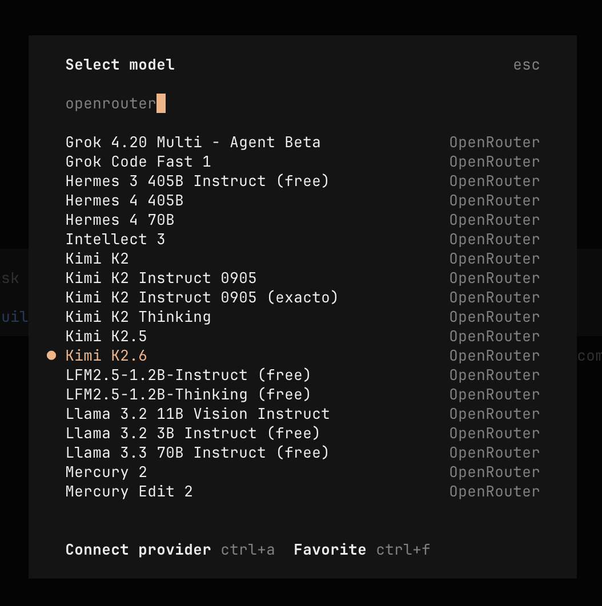

+++
title = "How I Access Every AI Model Without the Lock-In"
date = 2026-06-01T16:00:00+00:00
draft = false
+++

<!--more-->



New models keep dropping all the time, and I want to try them all. I want to see which one is better for which tasks, which one is cheaper, which one is faster. There's [OpenAI](https://openai.com), [Anthropic](https://anthropic.com), [Google Gemini](https://gemini.google.com), [Moonshot AI](https://moonshot.ai), [xAI](https://x.ai), and the list just keeps growing. I do not want to be locked into one model or one family of models forever. So I got subscriptions to some, I'm paying for API access to others, and then there are models that I would typically have to host myself. I don't want to do that. Even if I did, I neither have the hardware nor the patience for it.

Now, I could get a subscription to [Cursor](https://cursor.com) or [Copilot](https://github.com/features/copilot) or something similar. Unlike a direct subscription to, say, Anthropic or OpenAI, those tools do let me use models from different providers. But the selection is still limited, and the models they offer are mostly focused on coding. Sometimes I need to generate an image, or a video, or something else entirely. On top of that, going with one of those tools would mean I'm no longer locked into a single model, but instead I'm locked into a single IDE or a single TUI agent. That's not really solving the problem. That's just **trading one kind of lock-in for another**.

And it's not only about using LLMs through client tools like those. I also build my own agents, and those agents need connections to LLMs too. 

Even if I decide to go with a single model or a single family of models for a given agent, I still need to test it against different options to see which one gives me the best results, which one is cheaper, which one is faster. And the model I pick today might not be the one I use tomorrow. New models keep showing up, prices change, capabilities shift.

 So the problem isn't just "which model do I use in my editor." It's bigger than that. How do I give everything I build and everything I use access to whatever model makes sense, without juggling a **dozen different APIs and credentials**?

Now, to be clear, I'm not saying you have to pick one thing and go all in. I, for example, have an [Anthropic](https://anthropic.com) subscription, so I use that directly when working with their models. But for everything else...

That's where one of my favorite services comes in: OpenRouter.

It allows me to combine subscriptions with a unified gateway. Keep what works, and use something else to fill the gaps.

(1) Think about what it looks like without a gateway. (2) One agent talks to OpenAI, (3) another to Anthropic, (4) your app uses Google, (5) and your tool is wired to xAI. Each one has its own API, its own credentials, its own SDK. It works, but you're locked in everywhere, and switching anything means rewriting code. (6) OpenRouter sits in the middle as a single gateway. If you've worked with API gateways in your company, it's the same idea, but focused on LLMs. (7) Everything you build or use talks to OpenRouter's API, (8) and OpenRouter handles the routing to whichever provider you need. That API is OpenAI-compatible, which means if your tool already works with OpenAI, switching to OpenRouter is just a URL and credential change.

On top of that, 

OpenRouter gives you routing modifiers you can append to any model name. Add `:nitro` and it prioritizes the fastest provider. Add `:floor` and it picks the cheapest one. And then there's `:exacto`, which is interesting. 

The same model can be served by multiple providers, and those providers don't all perform equally, especially when it comes to tool calling. `:exacto` routes your request to whichever provider has the best track record for tool-calling reliability with that model.

 For agentic workflows where a missed tool call can derail the whole chain, that matters a lot.

There's also the resilience angle. If a provider goes down, OpenRouter can automatically fall back to another one serving the same model. You don't have to build that retry logic yourself. Your request just gets rerouted.

Now, to be fair, this isn't free. OpenRouter charges a **5.5% platform fee**, so you do end up paying a bit more than you would going to each provider directly. That's the trade-off. You're paying for the convenience of unified routing, fallbacks, and everything else I just mentioned.

That said, the observability you get in return is nice. One dashboard, per-model cost breakdowns, usage tracking. When you're juggling five or ten different models across multiple providers, having all of that in one place makes it much easier to see what you're actually spending.

Privacy is another one. OpenRouter supports **zero data retention**, or ZDR. When you enable it, your requests only get routed to providers that don't store your prompts or responses. You can set it per request or as an account-wide default. If you're dealing with sensitive data or working in an environment with compliance requirements, that's a big deal.

So that's what OpenRouter offers. Let me show you how I actually use it.

One of the things I do is run multiple agents with different roles, each using a different model. For example, I might have `Opus` as the orchestrator, without OpenRouter since Anthopic API cost is much higher then with a subscription, `GPT` as the coder, `Kimi` as both the reviewer and the auditor, and `GPT Mini` as the releaser. That lets me use cheaper models for simpler tasks like releasing, while using more capable models for coding and reviews. And because the reviewer and the coder are different models, I get genuinely independent second opinions.

The tool I use for this orchestration is [Agent Deck](https://agent-deck.devopstoolkit.ai). It's a personal project. Check it out.

Let me execute `/prd-next` and let it work on one of the features in the background while we move on...

If we list all OpenRoute models in OpenCode, we can see a massive list of the supported models. Essentially, any model worth considering is there and the major trouble will be to figure out which one to use under which circumstances rather then how to gain access to any of those models.

My own custom agents benefit from this too. Take [DevOps AI Toolkit](https://devopstoolkit.ai), for example. It already uses the OpenAI API format, so pointing it at OpenRouter was just a matter of changing the URL and credentials. Now, if I want to switch which model it uses, I change one value. That's it. No code changes, no SDK swaps, no provider-specific API quirks to deal with.

So yeah, if you're using multiple models, as you should, if you want reliability without building your own fallback logic, and if you want to actually see and control your costs across providers, OpenRouter is a damn good choice. It's one of those services that, once you start using it, you wonder why you weren't using it from the start.

