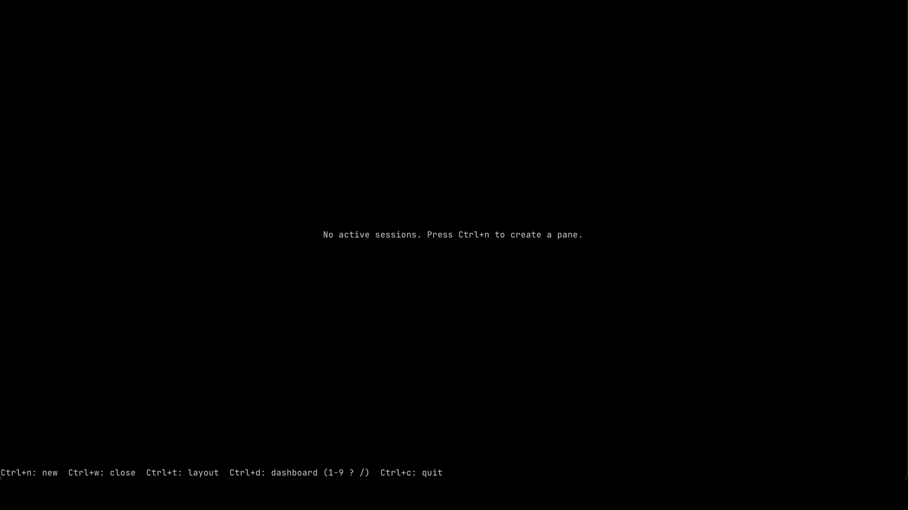
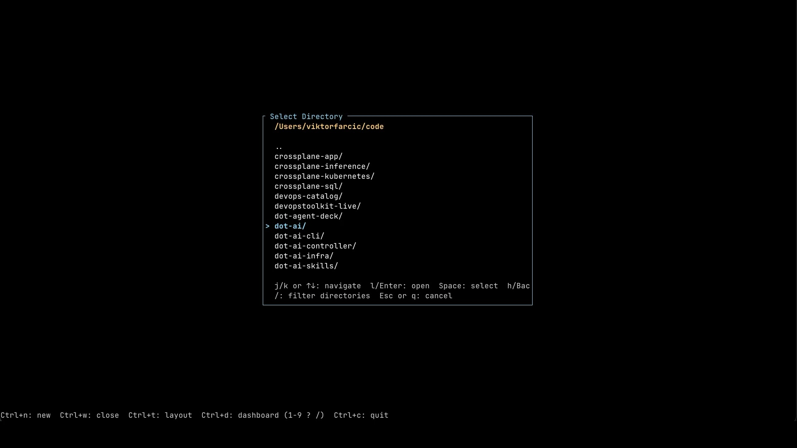
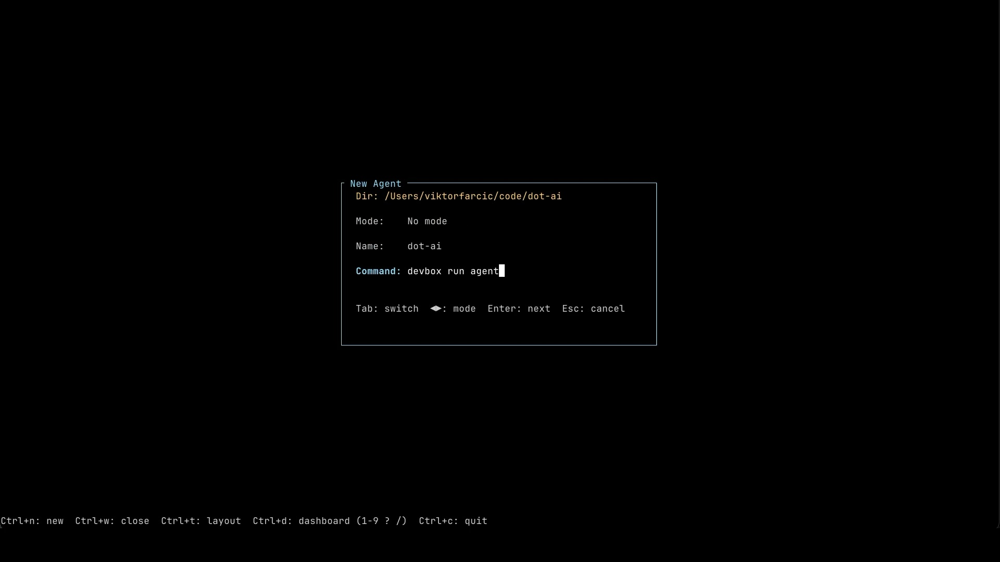
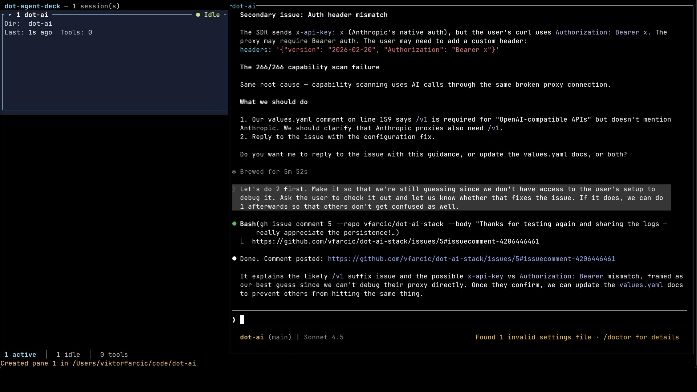
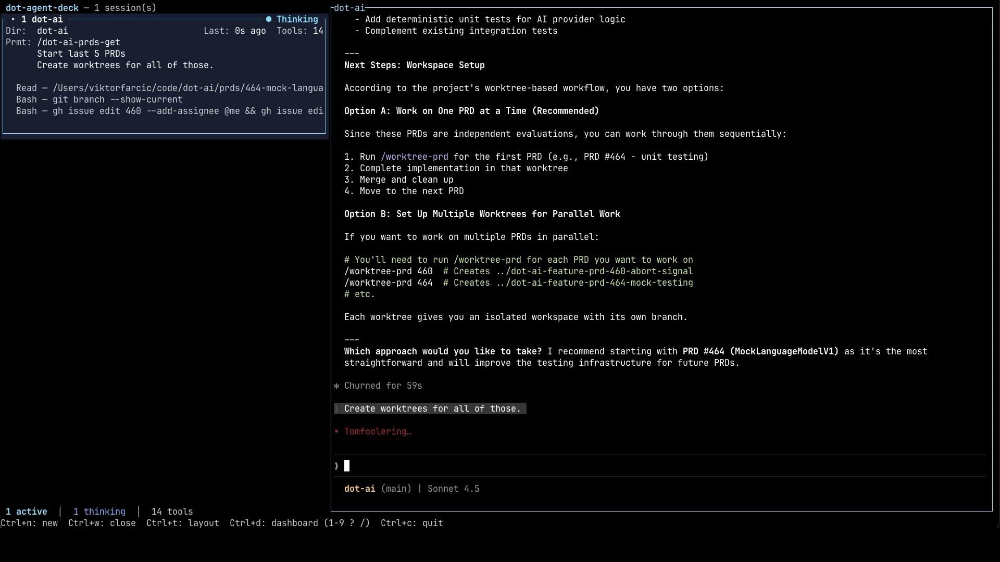
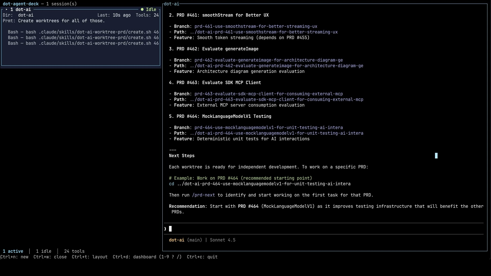
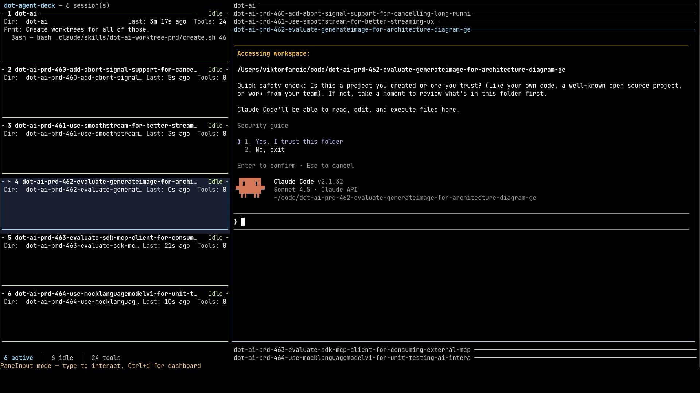
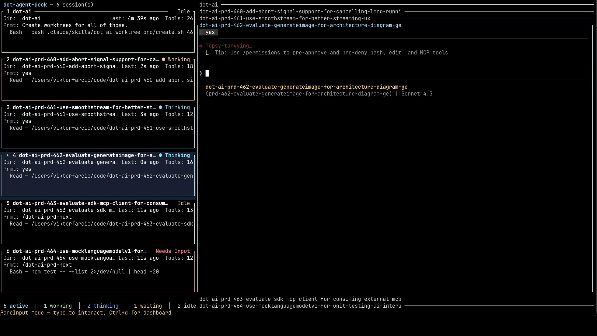
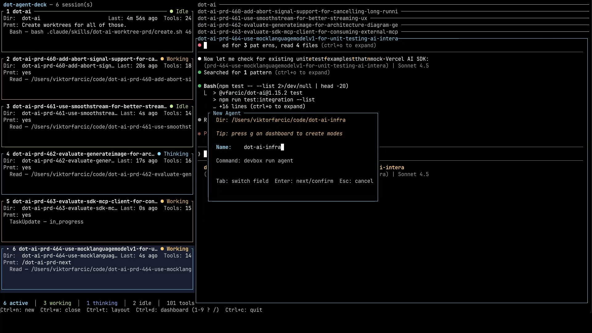

+++
title = "I Built a Tool to Manage Multiple AI Agents at Once"
date = 2026-05-04T16:00:00+00:00
draft = false
+++

Running multiple AI agents in parallel sounds like the ultimate productivity hack. Two agents, five, a dozen, all grinding away on different features at the same time. But making that actually work changes more than you'd expect. Not just the tooling. The way we work changes too.

In this video, I'll walk through what that shift looks like, lay out the requirements for the kind of tool that can actually support it, and then give you a hands-on tour of the one I built after nothing else got it right.

<!--more-->



## Setup

> You won't be able to reproduce the setup I'm showcasing since it largely depends on the repos and featuers I was working at a time. Nevertheless, you can follow along and adapt it to your own scenarios.

> [Install Agent Deck](https://agent-deck.devopstoolkit.ai/docs/installation)

```sh
dot-agent-deck
```

## Managing AI Agents in Parallel

Before we get into the tools, there's something we need to talk about. The role we play changes completely. When we work with one agent at a time, we're still mostly software engineers who happen to use AI as a fancy autocomplete or a pair programmer. But the moment we spin up several agents working on different things in parallel, we stop being software engineers. We become everything else.

We're project managers supervising a team, except that team happens to be made of agents. We're tech leads guiding them toward the right solution. We're architects designing the approach before any actual work begins. We're product managers figuring out what users actually need. And so on, and so forth. The code itself is being written by the agents. Our job is everything around it.

All those roles share something in common. They supervise and help a team arrive at the right solution. None of this is new, by the way. These are the same activities people have been doing for a very long time. The only difference now is that we're doing them with agents instead of humans. And when we break that work down, there are really three main types of activities involved.

The first happens up front, before any real work starts. We're figuring out the *what*, the *how*, the *when*. To do that well, we need to talk to our team of "experts" and get their input.

The second is supervision while the work is in flight. Sometimes that supervision happens at the team level, where we want the high-level picture of everything in motion. Other times it happens at the individual level, where we zoom in on what one specific agent is doing right now. The goal is to resolve doubts, unblock issues, redirect when something's heading the wrong way, and generally do whatever people in those roles have always done.

The third activity is validation. Did we actually build the right thing? Because shipping fast doesn't matter much if we shipped the wrong thing.

If we step back for a second, what we're really describing is management. It's essentially the same craft that project managers, tech leads, architects, and product managers have been practicing for decades. The skills don't change. The team just looks different. So in a way, software engineers are quietly migrating into management work, whether we realize it or not. We're becoming the managers of our agents.

Which raises an uncomfortable question. If engineers are stepping into management work, what happens to the managers who are already there? Do they manage the engineers who manage the agents? Do they become managers of agents themselves? Or does the whole shape of the team change in a way that makes some of those roles disappear? I don't have a clean answer for that one. But it's worth sitting with, because the org chart we're used to probably won't survive this transition intact.


And the analogy keeps holding. Just as not every person on a team needs the same amount of attention from a manager (a good one, not a shitty one who micromanages everyone equally), the same is true for agents. Some need a lot of hand-holding, some need very little, and some can just be pointed at a problem and left alone.

What that depends on is, again, the same as with people. How well did we define what we need in the first place? How much do we trust the individual agent doing the work? And how critical is the thing we're building? The agents we trust more get more autonomy. The ones we trust less get a closer eye, or maybe even get micromanaged. Exactly how a decent manager would handle a team of humans.


Which brings us to the real question. How do we actually do this? How do we manage a bunch of agents working in parallel without losing our minds in the process? To answer that, we first need to be clear about what kind of tool would even make this possible. What would such a tool need to look like? What requirements would it have to meet?

## Multi-Agent Tool Requirements


Let's start with what's needed at the workspace level, before we even get to the tool itself.

If all our agents are going to work on the same project, then **git worktrees** are non-negotiable. E

ach agent gets its own branch in its own separate worktree. That way they don't trip over each other's changes, overwrite each other's files, or fight over the same branch.

The reason we need this in the first place is that we're running those agents on the same filesystem, on our local machine. If they were all running remotely, somewhere far away, worktrees wouldn't matter at all. We'd still need separate branches per agent, but the worktree thing is purely about keeping the local filesystem sane when multiple agents are touching the same repo at once.

And if we're running agents on completely separate projects in parallel, none of this matters from the agent's perspective. It might still matter for the broader software delivery story, but that's a different conversation for a different video.

Next on the list. The tool itself needs to be **terminal-based**. A TUI. And let me be clear before anyone gets defensive about their favorite IDE. This is not a religious debate about whether terminals beat IDEs or GUIs in general. They don't. They all have their place depending on what we're trying to do.

If we're writing code interactively alongside a single agent, an IDE-based experience can be fantastic. But the moment we shift into running multiple agents in parallel, with high (or even complete) autonomy, terminal apps win. They start fast, they don't waste screen space on chrome we don't need, they're easy to script, and they fit naturally into the keyboard-driven workflow that managing a team of agents demands.

Now, here's a related but distinct point. Even though the tool needs to be terminal-based, it **cannot replace my terminal** of choice.

I picked the terminal I use deliberately. I tried a bunch of them over the years, settled on the one I like, configured it the way I want, set up the keybindings I'm used to, picked the colors and fonts I find easiest to live with for hours every day. That choice matters to me. It's not something I want to throw away just because some new tool decided it knows better than I do what my terminal should look like.


I happen to use [Ghostty](https://ghostty.org). You might use [iTerm2](https://iterm2.com), [Alacritty](https://alacritty.org), [Kitty](https://sw.kovidgoyal.net/kitty/), [WezTerm](https://wezterm.org), or whatever else makes you happy. What I do not want is some tool that says "install me as your new terminal." I want it to run on top of whatever terminal I already picked. Because most of the time I'm doing a mix of things in that terminal: working with agents, running unrelated commands, debugging, ssh-ing into something, poking at logs. The tool that orchestrates my agents needs to be a guest in my terminal, not a replacement for it.

And the exact same logic applies one level deeper. **No new agent client.** The tool I'm looking for shouldn't try to replace the agents I already use either.


I don't want to throw away [Claude Code](https://claude.com/claude-code), or [OpenCode](https://opencode.ai), or whatever agent I've spent months getting comfortable with. Those tools already work for me at the single-agent level. I know their quirks, I know their shortcuts, I have my custom commands, skills, and configurations dialed in exactly the way I like them. The last thing I need is yet another agent client that does roughly the same thing, only differently, and forces me to relearn everything from scratch.

What I actually need is something that runs the agents I already use, helps me observe them, and lets me operate many of them in parallel. The orchestration is the missing piece. The agents themselves are already solved.

Then comes the visibility piece. The tool needs to show me everything that matters about all the agents in one place. What is each one currently doing? Has any of them stalled and needs my input? Has one finished its work and is now waiting for review?

Without that kind of overview, running multiple agents in parallel turns into chaos. I'd be context-switching every few seconds, jumping from one pane to another, trying to remember which agent was working on what. So at its core, the tool has to be a **dashboard**. One screen that tells me what's happening across the whole team at a glance.

Next, the tool has to be driven by **keybindings**. No mouse clicking, no buttons to chase around the screen, no menus to dig through. Keyboard shortcuts are simply the fastest, most efficient way to operate any tool we use a lot. And if we're managing a team of agents, we're going to be operating this tool constantly. Every action (switching between agents, sending input, swapping panes, opening configs) needs to be one or two keystrokes away. Anything slower breaks the flow and turns multi-agent work into a clicking simulator.

And finally, a bonus point. This one is not a hard requirement, more of a nice-to-have. When I want to zoom in on one specific agent and watch it work for a while, because it's doing something tricky or because I want to validate a particular task closely, it would be great if the tool could automatically surface the kind of additional information I would normally pull up myself.

Things like log tails, test runs, watching a file change in real time, or whatever else helps me understand what's happening at a deeper level. The kind of stuff I'd typically open manually in a separate pane or tab, but having the tool set that up for me automatically the moment I switch into focus mode on that agent.

Now, here's the thing. None of the solutions I looked at really match all these needs.


Take [Cursor 3](https://cursor.com), for instance. It's a complete redesign of the product, shifting from being primarily an IDE to being a multi-agent orchestrator. The intent is great, the execution is impressive. But it's not a terminal app, which immediately puts it in a different category from what I want.

Then there's [cmux](https://cmux.com). And cmux is genuinely awesome. But it tries to replace my terminal, which I just established as a non-starter for me.

There are quite a few other tools playing in this space as well. Some come closer to what I want, some are further away. But the same pattern keeps repeating. Each one breaks at least one of the requirements I just walked through. Some are GUIs. Some replace the terminal. Some replace the agent. None of them check every box.

So I ended up scratching that itch myself. I built a tool that does check every one of those boxes.


It's called **Agent Deck**, and the rest of this video is a hands-on tour of what it actually does. Let's dive in.

## Agent Deck Hands-On Demo


What we're looking at right now is the very first thing Agent Deck shows when we launch it. Mostly black. A single line in the middle saying there are no active sessions and that `Ctrl+n` will create a pane. At the bottom, a thin strip of shortcuts. And that's it. No toolbar, no sidebar, no welcome wizard, no buttons to click. If you like keyboard-driven tools, you'll feel right at home here. And if you've ever used Vim for any meaningful amount of time, you'll feel like you've reached the promised land. Everything in Agent Deck is a shortcut. There is no mouse involved at any point. There are no buttons. Buttons are evil.




So let's actually create our first pane. The shortcut for that is `Ctrl+n`.


That brings up a directory picker. We use the `Up` and `Down` arrow keys to highlight a directory, `Enter` to dive into it, and `Space` to select it as the working directory for our new pane.




Once we've picked the directory, the next dialog asks us to configure the pane itself. There are three things to set. **Mode** is something I'll let you explore on your own later. For now, just leave it as the default. **Name** is exactly what it sounds like, a label so we can recognize this pane in the dashboard. And **Command** is what gets executed inside the pane when it spins up. In this case, `devbox run agent` is a small wrapper I have set up that starts Claude Code in the right environment for this project.




And there it is. Claude Code is now running inside the pane, picking up exactly where I left off in my previous session. It could just as easily have been OpenCode. Agent Deck supports both natively. I haven't tested OpenCode quite as thoroughly because I personally use Claude Code more, but the support is there. If you want me to add another agent client, open an issue on the repo and I'll look into it.




Now let's actually put this thing to work. I have a custom skill that fetches PRDs and creates a git worktree for each one. I'm going to instruct the agent to use that skill and spin up worktrees for the five most recent PRDs. So in a moment, we'll have five isolated workspaces, each on its own branch, each ready for an agent to take over.


While the agent is busy creating those worktrees, let me walk you through the dashboard. The left-hand side is where Agent Deck's value really lives. Each card represents one agent, and it packs in everything we need to know at a glance. There's the name we gave it (`dot-ai`). The current status, in this case `Thinking`, meaning the agent is processing. The directory it's working in. How long ago the last activity happened. How many tool calls it has made so far. The last three prompts we sent it. And the last three tool executions it ran. With only one agent on screen this might not look like much. But wait until we have several of these going at once.




And just like that, the agent is done. Five worktrees, one per feature, each on its own branch, each ready for someone to take over. Now the real party can begin.




I'm going to open a new pane for each of those worktrees. `Ctrl+n`, pick the first worktree directory, configure the pane, done. Then `Ctrl+n` again for the second. Then the third. Fourth. Fifth. Five new agents, each pointed at one of the worktrees we just created.


And here is where one of the small but really important design decisions becomes obvious. Notice how the size of each card on the left automatically adjusts to fit as many agents on the screen as possible. The more agents we add, the more compact each card becomes. We lose some of the per-agent detail, but we gain the ability to see the entire team at a glance without scrolling. That trade-off is deliberate. The whole reason we're here is to see what every agent is doing. Scrolling kills that the moment it kicks in.




And now we get to the single most important shortcut in the whole tool. `Ctrl+d`. That puts us into **command mode**, which is where the real orchestration happens. From command mode, we can do a bunch of things, but the simplest is switching to a specific agent by typing its number. So I press `Ctrl+d`, then `2` to jump to agent number two. Once I'm there, I instruct it to start working on its feature by sending `/dot-ai-prd-next`. Then `Ctrl+d`, `3`, same command. Then `4`. Then `5`. Then `6`. Six agents, all running in parallel, each working on its own feature, each on its own branch.

Now look at the status indicator on each card. It cycles between a few states. `Thinking` and `Working` both mean the AI is actively doing something, either reasoning or executing tools. Those are the states where we can leave the agent alone and let it do its thing.

The two we're constantly scanning for are `Idle` and `Needs Input`. `Idle` means the agent has finished its task and is sitting there waiting for the next instruction from us. `Needs Input` means the agent has hit a point where it needs our permission to execute a tool. Both of those are signals that tell us which agent needs our attention right now. Combined with the other info on the card (the latest prompt, the latest tool execution), we can immediately tell not just which agent needs us, but what it's waiting for.



Now let's say I want to add another agent to the mix. Not another PRD this time, but something different. I want to point an agent at a Kubernetes cluster, and for that kind of work I'd really like a more detailed view of what the agent is doing than just the compact card.


Same drill. `Ctrl+n`, pick the `dot-ai-infra` directory, configure the pane, just as we did before. But this time, notice the small tip near the top of the dialog: `press g on the dashboard to create modes`. If we press `g`, it sends instructions to the agent to generate a project-specific configuration that unlocks a separate tab for this particular agent. That tab comes with additional panes that continuously run commands we care about. Things like a tail of test runs, the state of Kubernetes resources, the output of whatever helps us understand what's actually happening at a deeper level than the card alone can show.

I'm going to leave the deeper dive into modes for you to discover on your own. There are a few other features in there too, and I genuinely don't want to spoil all the fun of exploring a project yourself. Plus, the more you poke at it, the more likely you are to find the rough edges and let me know what's missing or broken.



And whenever you're stuck or forget a shortcut, just hit `Ctrl+d` followed by `?` and Agent Deck will show you every keybinding it knows about. Or head over to the [Agent Deck docs](https://agent-deck.devopstoolkit.ai) for the long version. Give it a spin. Let me know what you think. Open issues, file feature requests, star it if it helps you, fork it if you want to take it somewhere different, or do whatever else you do with projects that catch your eye.

## AI Agents: What Comes Next

So here's where we are. Running multiple AI agents in parallel is not just a productivity trick. It's a fundamentally different way of working. We go from writing code to managing a team. The skills we need shift from engineering to orchestration: defining the work, supervising progress, and validating results.

For me, the tooling has to match that shift. It needs to live in the terminal, respect the tools I already use, give me a dashboard to see everything at a glance, and stay out of the way when I don't need it. That's what Agent Deck is built to do for me. If you think it might be helpful for you too, head over to the [Agent Deck docs](https://agent-deck.devopstoolkit.ai), give it a spin, and let me know what breaks, what's missing, or what you'd do differently.

## Destroy

> Press `Ctrl+d` to enter the command mode, `Ctrl+c` to open the Quit dialog, and the `Enter` key to exit.
