+++
title = "I Built Custom AI Agents for My Team (Here's the Complete Blueprint)"
date = 2026-04-06T15:00:00+00:00
draft = false
+++

I've spent the last few months building custom AI agents for internal teams, and I can tell you: the gap between using a general-purpose coding assistant and having an agent that truly understands your company is enormous. We're talking about the difference between an intern who's brilliant but knows nothing about your business, and a senior engineer who's been with you for years.

In this video, I'll walk you through the complete architecture for building your own AI agent. Every component: system context, tools, knowledge retrieval, multi-agent orchestration, security, observability, and cost optimization. By the end, you'll have a blueprint you can actually follow. Not just theory, but the real decisions you'll face and how to make them.

<!--more-->



## Why Build Your Own Agent?

Let's say you're working in a company with a bunch of software engineers, and everyone wants to use AI to help with coding, operations, debugging, you name it. The obvious move is to just hand everyone Claude Code, Cursor, or Windsurf and call it a day. And honestly, those tools are fantastic. They'll get you pretty far.

But here's the thing.

Those tools only know what's publicly available. They don't know your internal systems. They don't know your company's runbooks, your deployment patterns, your specific infrastructure quirks. Every engineer ends up figuring things out on their own, reinventing the wheel over and over again. One person discovers the right way to deploy to your staging cluster, and that knowledge stays trapped in their head or buried in some Slack thread nobody will ever find.

What you actually want is an AI agent that understands your company. One that can access the tools you've defined, knows your system architecture, is aware of your internal policies and best practices. You want everyone to benefit from collective knowledge instead of each person starting from scratch.

That's why you build your own agent.

So what does an agentic AI system actually look like? At its core, you have an (1) agent. That agent receives (2) user input and combines it with (3) system context that tells the LLM who it is and what it knows. It sends all of that to an (4) LLM, which processes the request and decides what to do. Now here's what makes it agentic. The LLM doesn't just produce a response and call it a day. It can decide it needs a tool executed, so it sends a (5) tool request back to the agent. The agent then (6) executes that tool, something like querying a database, running a command, or calling an API. The agent takes the result and feeds it back to the LLM through the (7) agentic loop. The LLM looks at the result, decides if it needs another tool or if it has enough information, and this back-and-forth keeps going until the LLM is satisfied. The agent orchestrates the execution, the LLM drives the decisions. Once the loop is done, the LLM produces the (8) response, and the agent delivers it (9) back to the user.

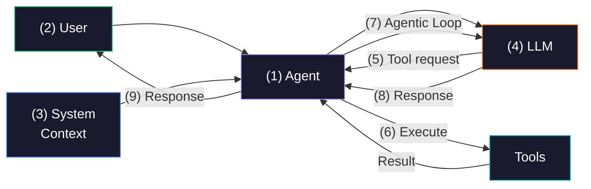

Now let's dig into each of those components, because knowing you need an agent is the easy part. Building one that actually works? That's where it gets interesting.

## AI Agent Architecture

Before we dive in, a quick word about what you'd actually build this with. You don't have to start from scratch. There are agent frameworks and SDKs that handle the plumbing: the agentic loop, tool execution, memory management, all of it. The [Vercel AI SDK](https://ai-sdk.dev) is a strong choice if you want model flexibility. It's provider-agnostic, so you can swap between Anthropic, OpenAI, Google, and others without changing your agent code. [LangGraph](https://langchain-ai.github.io/langgraph/) gives you fine-grained control with graph-based workflows. [CrewAI](https://www.crewai.com) lets you spin up role-based agent teams fast. If you're committed to a single model provider, the [Claude Agent SDK](https://docs.anthropic.com/en/docs/agents-and-tools/agent-sdk) and [OpenAI Agents SDK](https://openai.github.io/openai-agents-python/) are purpose-built for their respective ecosystems. Or you can go lower-level and build directly against the model APIs if you want full control. The architecture we're about to walk through applies regardless of which framework you pick.

**System context** is how you tell the LLM things it can't possibly know from its training data. The model already knows Kubernetes, Python, AWS, and all the public knowledge in the world. What it doesn't know is how your company operates. System context provides that baseline. The standing orders that shape how your agent behaves across every interaction.

Things like (1) company-wide policies: "we never push directly to the main branch," "all services must expose health endpoints." (2) Team-level conventions: "this team owns the payments service and uses Go." Even (3) per-user preferences: "this engineer prefers Helm over Kustomize." All of those compose the (4) system context that gets sent to the (5) LLM alongside the user's request.

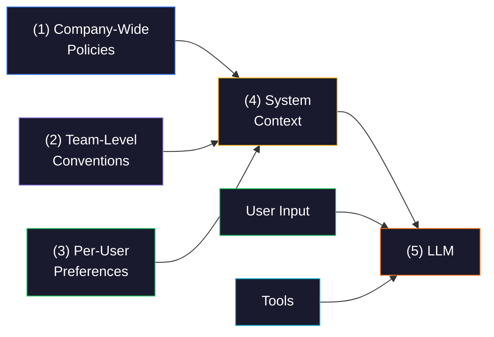

The scope of your agent determines how deep the context goes. A broad agent that handles everything needs context that covers many domains at a shallow level, your company-wide rules and general conventions. A narrow agent dedicated to, say, Kubernetes remediation can go much deeper. You can pack in specific cluster configurations, common failure modes, remediation playbooks. The narrower the scope, the more relevant depth you can fit without blowing up the token count. We'll talk about multiple specialized agents later, but keep this trade-off in mind: breadth versus depth of context.

Now, you might be thinking, what about task-specific information? Like pulling the current state of a cluster when someone asks about a failing deployment. That's not system context. That's a different mechanism entirely, and we'll get to it when we talk about knowledge and tools.

**Tools** are how your agent takes action in the real world. From the LLM's perspective, a tool is simple: it has a name, a description, and parameters. The LLM reads the description, decides whether the tool is relevant to the current task, and if so, requests the agent to execute it. What's actually behind that tool? The LLM doesn't care. It could be a custom function you wrote, an MCP server, a CLI wrapper, an API call, whatever. The implementation is irrelevant to the model. All that matters is the description is clear enough for the LLM to understand when and how to use it.

Now, here's something important. Not everything should be a tool that the LLM invokes. The (1) LLM decides which tools to call, and the (2) agent executes them. But some operations are better handled (3) directly by the agent's code, without the LLM being involved in the decision at all. For example, retrieving data needed to build the system context. You don't want the LLM to decide whether to fetch that, you just do it every time as part of the agent's setup. Or validation. When the LLM suggests a command to execute, you probably want your agent code to (4) validate it against a set of rules before actually running it. Same with sanitizing inputs, enforcing rate limits, or logging every interaction. These are things the agent does deterministically, not things you leave up to a probabilistic model to maybe remember to do.

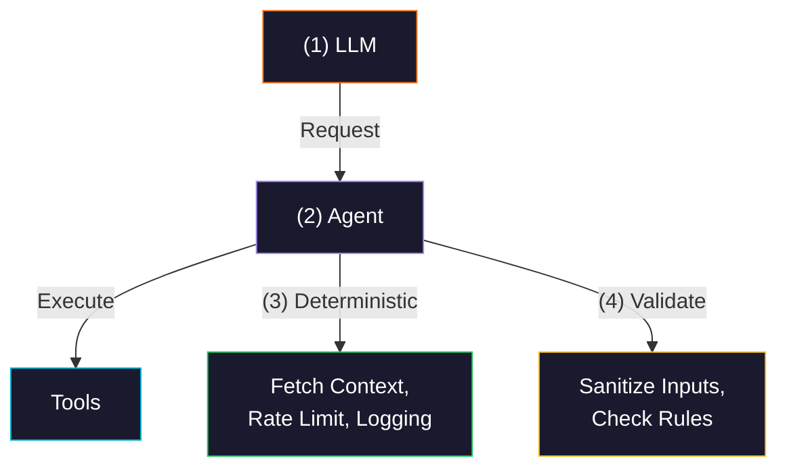

The next critical piece is **internal knowledge**. This is what separates your custom agent from a generic one. There are two flavors here. First, there's runtime information about the systems you're actually running: your code repositories, your Kubernetes clusters, your services, their current state, recent deployments, active incidents. Second, there's the company knowledgebase: runbooks, architecture decision records, deployment patterns, policies, post-mortems.

How does this knowledge reach the LLM? Two ways. Some of it can be pulled in advance and embedded into the context before the LLM even sees the user's request. The agent code does this deterministically, exactly like we just talked about. Other times, the LLM itself realizes mid-task that it needs more information and requests it through a tool. Both approaches have their place. Pre-fetching is great for information you know will be relevant. Tool-based retrieval is better when relevance depends on what the user is asking.

But here's the problem. You can't just dump all your company's knowledge into the context every time. Context windows are limited, and even if they weren't, drowning the LLM in irrelevant information makes it perform worse, not better. You need a way to find only the relevant pieces. That's where **semantic search** comes in.

The typical approach is to sync your knowledge into a **vector database** like [Qdrant](https://qdrant.tech), [Pinecone](https://www.pinecone.io), [pgvector](https://github.com/pgvector/pgvector), or [Weaviate](https://weaviate.io). But first you need to get the data in.

Your knowledge lives in (1) many places: markdown files in Git repos, pages in Notion or Confluence, Slack messages, Jira tickets, post-mortem documents, architecture decision records. You need an (2) ingestion pipeline that continuously scans those sources, (3) runs the content through an embedding model, something like OpenAI's `text-embedding-3-large` or open-source alternatives like `BGE-M3`, to convert text into numerical vectors, and (4) stores those vectors in the database.

This isn't a one-time job. Those sources change constantly, so the pipeline needs to keep running, picking up new and updated content.

When the agent needs relevant knowledge, whether on its own or because the LLM requested it, it (5) sends a query that gets embedded the same way and (6) matched against the vectors in the database. The result is that you pull in only the information that's semantically relevant to what the user is asking about, not everything you have.

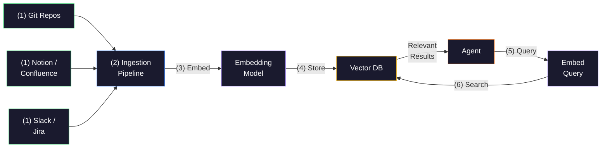

You can also build **knowledge graphs** as a complement to vector search, using something like [Neo4j](https://neo4j.com). Graphs are great for capturing relationships between entities, things like "this service depends on that database" or "this runbook applies to this cluster." Vector search finds content that's similar. Graphs find content that's connected. In practice, combining both gives you the best results.

There's one more piece related to knowledge: **memory**. Specifically, short-term memory. During a task execution, the agent needs to (1) track where it is: which steps it has completed, what tools it called, what intermediate results it got. Without this, a multi-step workflow falls apart. The agent loses track, repeats itself, or goes in circles. That's all (2) session-level state, and it disappears when the task is done.

But not everything should disappear.

When the agent makes important decisions or discovers something valuable during a task, that information should be (3) fed back into the knowledgebase. Maybe the agent figured out that a particular service needs a specific environment variable to deploy correctly, or that a certain remediation step works for a recurring issue. Feed that back, and every (4) future interaction benefits from it. The knowledgebase isn't a static thing you load once. It's a **living system that grows** from the agent's own experience.

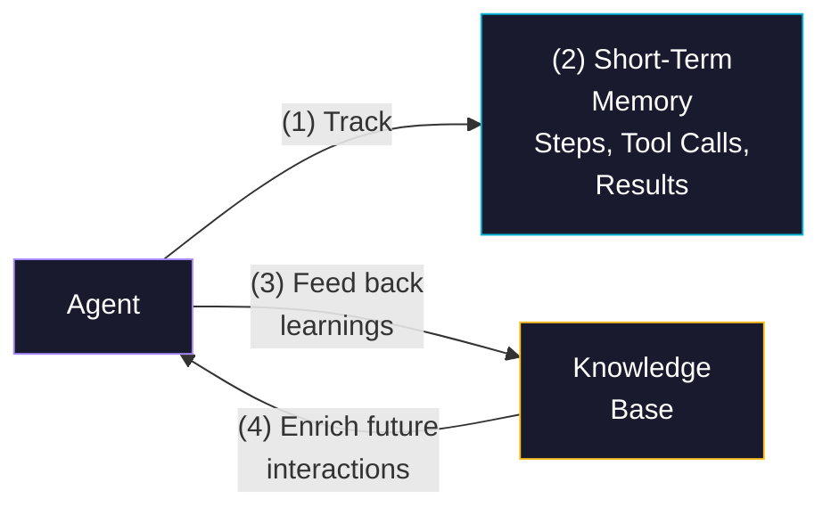

## Multi-Agent Orchestration

Now let's talk about how users actually interact with your agent. Here's a tempting trap: building your own chat interface. Don't. Your engineers are already comfortable in (1) Claude Code, Cursor, Windsurf, or whatever coding agent they prefer. Building yet another UI is a waste of time and nobody will want to switch to it.

Instead, make your agent accessible through the tools people already use. The best way to do that right now is the **[Model Context Protocol](https://modelcontextprotocol.io)**, MCP. You expose your agent through (2) MCP, and any MCP-compatible client can talk to it immediately. Claude Code, Cursor, Windsurf, they all support MCP already.

You might have heard of Google's **[Agent-to-Agent protocol](https://google.github.io/A2A/)**, A2A, which is designed for agents to communicate with each other. But here's the practical reality: existing coding agents already speak MCP natively. To use A2A, they'd need an MCP adapter to bridge the gap, which kind of defeats the purpose. If you need MCP to get to A2A, why not just expose your agent through MCP directly?

But coding agents aren't the only consumers. You might have (3) custom applications, internal dashboards, support tools, or even CI/CD pipelines that need to talk to your agent. For those, expose it through (4) REST HTTP as well. And if your agent produces rich visualizations or interactive outputs that a terminal can't handle, a (5) Web UI makes sense too. Same agent, same logic, multiple communication protocols. The agent doesn't care who's calling it or how.

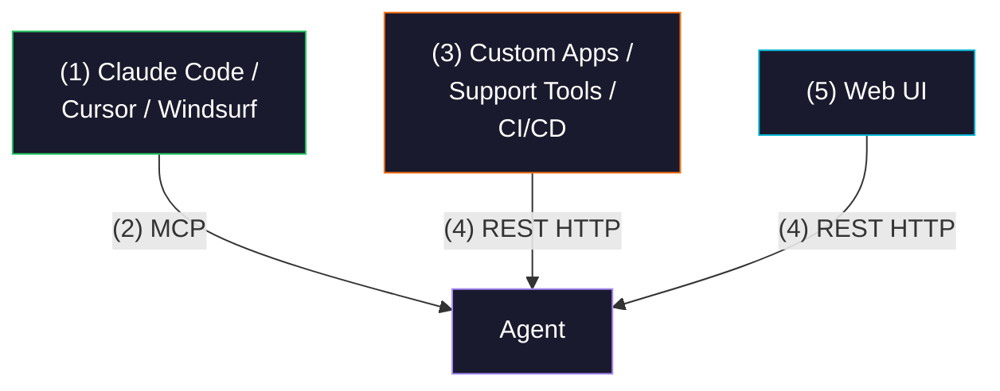

Now that we've covered all the building blocks, let's talk about composing them. In practice, you won't build one monolithic agent that does everything. You'll build (1) multiple agents, each specialized in a different domain. A coding agent with deep knowledge of your codebase and CI/CD pipeline. A Kubernetes agent that knows your cluster configurations and remediation playbooks. An incident response agent wired into your monitoring and alerting tools. Each one gets its own system context, its own tools, and its own knowledge, tailored to its specific domain. Remember the breadth versus depth trade-off? This is how you solve it. **Narrow agents that go deep.**

Now, how do these agents get orchestrated? Here's the thing, you might not need a dedicated orchestrator at all. If you expose each specialized agent as an MCP server, then (2) Claude Code or Cursor is already your orchestrator. The LLM in those tools decides which agent to call based on the user's request. You didn't build anything extra. It just works. A (3) Web UI with buttons like "Remediate" or "Query Cluster" is orchestration too, just user-driven rather than AI-driven. A (4) CI/CD pipeline that calls your coding agent's HTTP endpoint to review a pull request, then hits the Kubernetes agent to validate deployment manifests? Also orchestration. Remember, these are your custom agents running as remote services. The CI/CD pipeline talks to them the same way it would talk to any other API.

The point is, orchestration happens at many levels. Sometimes it's the client agent. Sometimes it's the UI. Sometimes it's a pipeline. And sometimes, when you need complex multi-step workflows where agents hand off work to each other mid-task, you do build a (5) dedicated orchestrator. There's also the (6) mesh pattern, where one agent mid-task realizes it needs another agent and calls it directly. The Kubernetes agent is remediating an issue and realizes it needs the coding agent to roll back a deployment. It calls it without going through anyone.

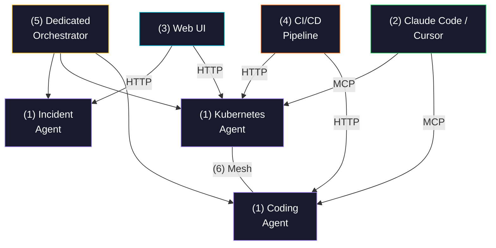

Since we're talking about agents used by many people across the company, they should run remotely. You don't want every engineer setting up agents locally, managing dependencies, dealing with version mismatches. Run them on a (1) server, or better yet, in Kubernetes. There's (2) one place to update when you improve an agent. There's (3) one place to scale when demand grows. There's (4) one place to monitor. Users just connect to the remote agents through MCP, REST HTTP, or whichever protocol you chose. They don't need to know or care about what's running behind the scenes.

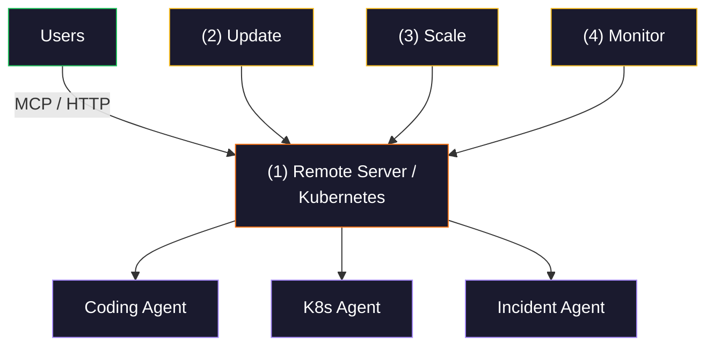

## Agent Security and Observability

Now let's talk about something most teams underestimate until it bites them: security.

Your agents aren't just passive tools. They execute commands, modify infrastructure, access sensitive data. You need to treat them as (1) first-class identities, the same way you treat human users. That means (2) permissions and access control. The Kubernetes agent can modify clusters but can't access the billing system. The coding agent can open pull requests but can't merge to main without approval.

Beyond permissions, you need (3) guardrails. Hard limits on what an agent can and cannot do, regardless of what the LLM decides. Think of it as a safety net. The LLM might hallucinate a destructive command. Your guardrails catch it before it executes.

And for critical operations, you need (4) human-in-the-loop. When confidence drops, when the agent encounters something it hasn't seen before, or when a policy conflict arises, the system pauses and routes to a human with full context. The human reviews, approves or rejects, and the agent continues. This isn't about slowing things down. It's about making sure nobody gets **paged at 3 AM** because an agent decided to scale your production database to zero.

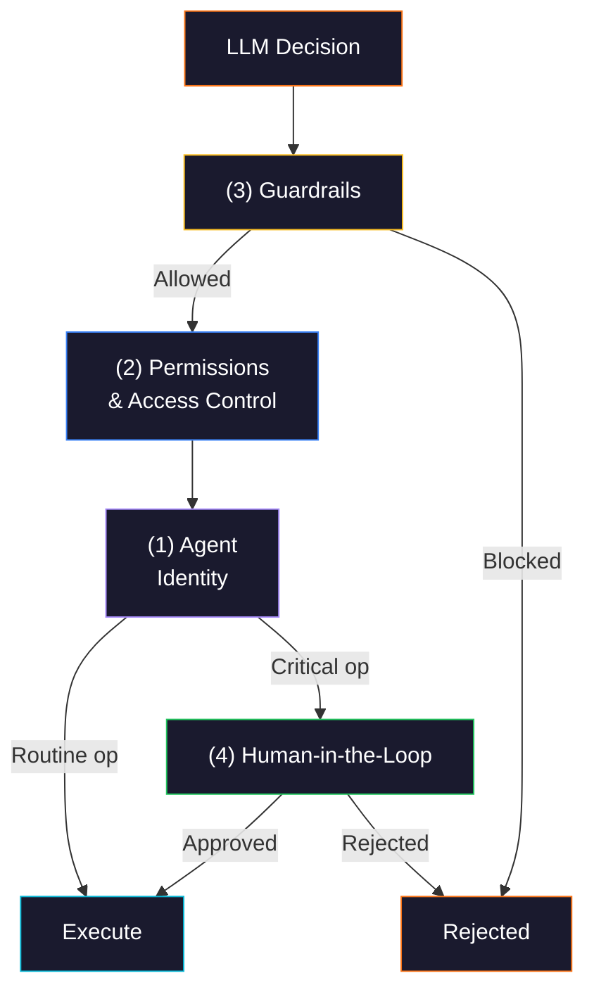

**Observability** might be the most important operational concern of all. Think about it.

(1) User inputs are unpredictable, you have no idea what people will ask. (2) The LLM's reasoning is unpredictable, it might call tools you didn't expect in an order you didn't anticipate. And (3) the outputs are unpredictable, the same question can produce different answers. So inputs, processing, and outputs are all non-deterministic. That's a nightmare for traditional monitoring.

You need observability tailored for AI. If you already have [OpenTelemetry](https://opentelemetry.io) infrastructure in place, and honestly most companies do at this point, you can extend it to cover your agents. There are GenAI semantic conventions for OTel, and libraries like [OpenLLMetry](https://github.com/traceloop/openllmetry) add LLM-specific instrumentation on top of standard OTel. That gives you a unified view: your agent's HTTP calls, database queries, LLM calls, and tool executions all in one trace, alongside your existing services.

If you want AI-specific features on top of that, like prompt versioning, evaluation playgrounds, or model comparison dashboards, tools like [Langfuse](https://langfuse.com), [Arize Phoenix](https://phoenix.arize.com), or [LangSmith](https://www.langchain.com/langsmith) add that layer. Arize Phoenix is actually OTel-native under the hood, so it plugs right into your existing setup.

Either way, these tools let you (4) trace every step of the agentic loop: what the user asked, what the LLM decided, which tools it called, what results came back, and what the final response was. You also need to track (5) performance metrics. How often does the agent actually solve the user's problem? How many tool calls does it take? How long does a typical interaction last? Without this, you're flying blind. You won't know if your agent is actually helping people or just **confidently producing garbage**.

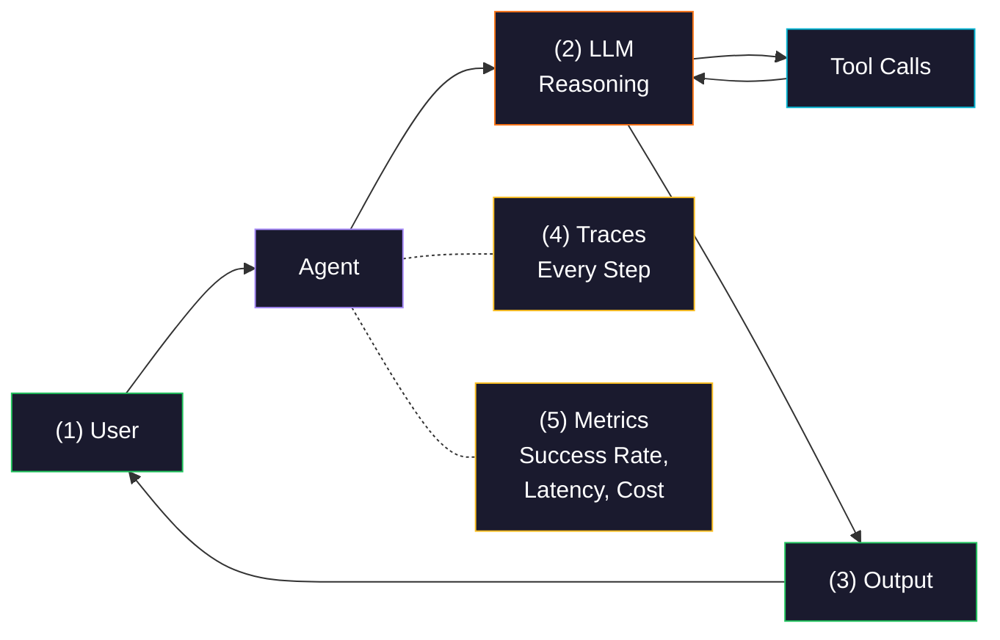

Then there's **cost**.

Every LLM interaction costs tokens, and in an agentic system, costs multiply fast. A single user request might trigger a multi-step reasoning chain with multiple tool calls, each feeding results back for more processing. Add memory, context retrieval, and the agentic loop, and a single interaction can burn through a lot of tokens.

The smart move is **model routing**, and it can happen at two levels. At the request level, you can route different types of requests to different agents that use different models. But the more powerful approach is routing inside the (1) agent itself.

A single user request might involve multiple LLM calls, and your agent code can decide which model to use for each step. (2) Classify the request? Use a cheap, fast model. (3) Reason through a complex remediation plan? Use the powerful one. (4) Summarize the results? Back to the cheap model.

This per-step routing is more granular and can cut costs dramatically without meaningfully hurting quality.

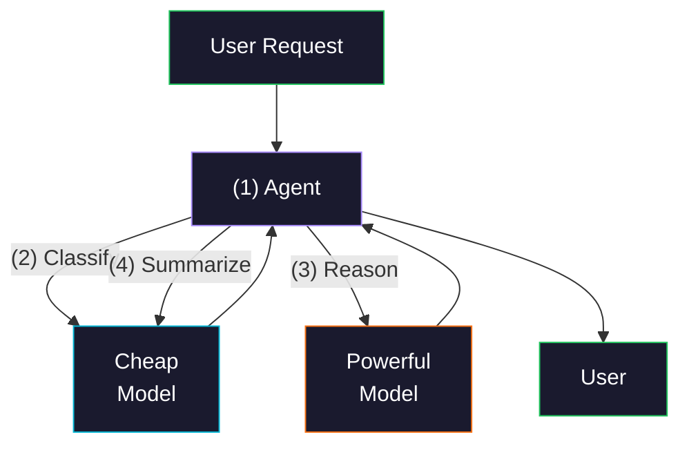

Finally, **testing and evaluation**.

How do you know your agents actually work? You can't rely on traditional test suites here. The output is different every time, and you can't anticipate every way users will interact with your agents. The real evaluation happens in production, from actual usage.

Remember the observability data we just talked about? That's your evaluation data. You (1) collect traces from real interactions: what users asked, what tools the agent called, what responses it gave, whether users had to retry or gave up.

Then you (2) analyze that data periodically to spot patterns. Where is the agent failing? Which (3) tool calls are malformed or invalid? Where does it (4) hallucinate or produce wrong answers? What types of requests does it handle well versus poorly? That analysis feeds directly into (5) improvements: better system context, better tool descriptions, different models, updated knowledge.

There's still a place for basic smoke tests in CI/CD to make sure a change didn't completely break an agent. But the real evaluation loop is production data driving continuous improvement.

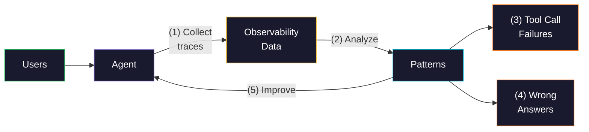

## Your Agent Blueprint

So that's the full picture. System context to give the LLM your company's knowledge. Tools for taking action. A vector database and knowledge graphs for finding the right information at the right time. Memory so the agent can learn from its own experience. Multiple specialized agents instead of one monolithic one. MCP to plug into the tools your engineers already use. Security, guardrails, and human-in-the-loop for the stuff that matters. Observability so you're not flying blind. And model routing to keep costs under control.

You don't have to build all of this on day one. Start with one agent, one domain, a handful of tools. Get it in front of real users and let the observability data tell you what to improve next. The architecture scales, but the value starts with that first agent that knows something a generic tool never will: **how your company actually works**.
