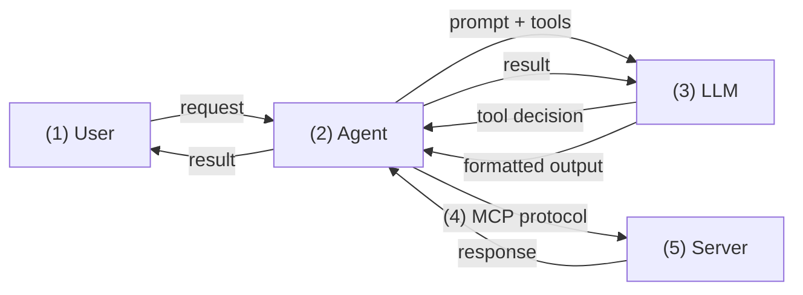

+++
title = "MCP Is Burning Your Tokens Before You Ask a Single Question"
date = 2026-04-27T16:00:00+00:00
draft = false
+++

Every MCP tool you connect burns tokens before you even ask a question. Tool names, descriptions, parameter schemas, all of it gets stuffed into your context window on every single turn. Connect a few servers and you've lost thousands of tokens to tools you might never call. That's the reality of the MCP protocol. It's a tax on your agent's intelligence.

Now, don't get me wrong. MCP solves a real problem. It gives us standardized discovery and zero client installation. But there's an alternative that uses a fraction of the context, costs nothing extra to set up, and your agent might already know how to use. It's not perfect either, but I think it's the better choice for most real-world scenarios.

In this video, we're going to put MCP to the test, run some real operations through it, and then explore that alternative side by side. We'll look at where each one wins, where each one falls short, and by the end, you'll have a clear picture of which approach fits your situation.

<!--more-->



## Setup

> This demo is using Claude Code as the coding agent. With a few modification, it should work with any other coding agents like Cursor, GitHub Copilot, etc. The major change you might need to make is to change `.mcp-kubernetes.json` to whichever format and location for MCP config your agent expects.

> If you don't have Claude Code already, and would like to install it, please follow [Setup Claude Code](https://code.claude.com/docs/en/setup) instructions.

```sh
git clone https://github.com/vfarcic/dot-ai

cd dot-ai

git pull

git fetch

git switch demo/mcp-vs-cli
```

> Make sure that Docker is up-and-running. We'll use it to run create a KinD cluster.

> Watch [Nix for Everyone: Unleash Devbox for Simplified Development](https://youtu.be/WiFLtcBvGMU) if you are not familiar with Devbox. Alternatively, you can skip Devbox and install all the tools listed in `devbox.json` yourself.

```sh
devbox shell

./dot.nu setup \
    --stack-version 0.72.0 \
    --kyverno-enabled false \
    --atlas-enabled false \
    --crossplane-enabled false

source .env
```

> Install [DevOps AI Toolkit CLI](https://devopstoolkit.ai/docs/cli/setup/installation)

## MCP Protocol in Action


Let's start by connecting our agent to a remote server through the MCP protocol. We'll launch Claude Code with a dedicated MCP configuration that points to a [DevOps AI Toolkit](https://devopstoolkit.ai) server running in our Kubernetes cluster.

```sh
claude --mcp-config .mcp-kubernetes.json --strict-mcp-config
```

Once inside Claude Code, we can check what MCP servers are connected and what tools they expose.

[user]
```text
/mcp
```

> Select `dot-ai` > `View tools`

[agent]
```
  Tools for dot-ai
  8 tools

  ❯ 1. recommend
    2. version
    3. manageOrgData
    4. remediate
    5. operate
    6. projectSetup
    7. query
  ❯ 8. manageKnowledge
```

> Press `esc` three times to exit MCP view.

The output shows eight high-level tools. There's `recommend` for getting AI-powered deployment recommendations, `query` for asking natural language questions about your cluster, `remediate` for fixing issues, `operate` for day-two operations, and so on. There are only eight tools, and that's important. Remember that number. We'll get to why it matters later when we talk about some of the downsides of the MCP protocol.

Now, before we go further, let's frame what we're actually exploring here. Agents do two types of work. There are local operations: reading source code, editing files, running tests. The agent handles those with built-in capabilities or tools already on your machine. Then there are remote operations: querying cluster state, managing infrastructure, accessing organizational knowledge bases. For those, the agent needs to talk to a server.

We're not debating whether remote servers with agentic capabilities are useful. We're debating **how agents should connect to them**. The MCP protocol is one option. There are others. And to be clear, we're talking about MCP connecting to remote servers over HTTP, not the local stdio transport where an MCP server runs as a process on your machine. That's a different scenario with different tradeoffs.

Let's see what this looks like in practice. We'll ask the agent to show us the components running in the cluster, their relationships, and their health status, all through the MCP.

[user]
```text
Show dot-ai components and their relations and access their health. Use the MCP.
```

[agent]
```text
⏺ dot-ai Cluster Components (v1.9.1) — All Healthy

  Components & Health

  ┌──────────────────────┬─────────────────┬────────────────────────────┬─────────┐
  │      Component       │      Type       │       Image Version        │ Status  │
  ├──────────────────────┼─────────────────┼────────────────────────────┼─────────┤
  │ MCP Server (dot-ai)  │ Deployment 1/1  │ dot-ai:1.9.1               │ Running │
  ├──────────────────────┼─────────────────┼────────────────────────────┼─────────┤
  │ Controller Manager   │ Deployment 1/1  │ dot-ai-controller:v0.48.0  │ Running │
  ├──────────────────────┼─────────────────┼────────────────────────────┼─────────┤
  │ Agentic Tools Plugin │ Deployment 1/1  │ dot-ai-agentic-tools:1.9.1 │ Running │
  ├──────────────────────┼─────────────────┼────────────────────────────┼─────────┤
  │ Web UI               │ Deployment 1/1  │ dot-ai-ui:0.15.0           │ Running │
  ├──────────────────────┼─────────────────┼────────────────────────────┼─────────┤
  │ Qdrant Vector DB     │ StatefulSet 1/1 │ qdrant:v1.15.5             │ Running │
  └──────────────────────┴─────────────────┴────────────────────────────┴─────────┘

  All 5 pods running, 0 restarts. Solution resource tracks 17/17 resources ready.

  Component Relationships

  External Access (Ingress - nginx)
  ├── dot-ai-ui.127.0.0.1.nip.io → Web UI (:3000)
  └── dot-ai.127.0.0.1.nip.io    → MCP Server (:3456)

  Web UI (:3000)
    └──→ MCP Server (:3456)
            ├──→ Agentic Tools Plugin (:8080)
            │       └──→ Qdrant Vector DB (:6333)
            │               └──→ PVC (10Gi)
            ├──→ Anthropic AI (Claude Haiku 4.5)
            ├──→ OpenAI Embeddings (text-embedding-3-small)
            └──→ Jaeger Tracing (observability namespace)

  Controller Manager (:8081)
    └──→ Kubernetes API (manages CRDs & Solution resources)

  Supporting Resources

  - Secrets: dot-ai-secrets (API keys), dot-ai-ui-ui-auth
  - ConfigMaps: dot-ai-plugins, dot-ai-stack-qdrant
  - RBAC: 2 ClusterRoles, 2 ClusterRoleBindings, 3 ServiceAccounts
  - Storage: 10Gi PVC for Qdrant (standard/local-path)

  Visualization: http://dot-ai-ui.127.0.0.1.nip.io/v/qry-1773311402121-2fdc5d46
```


What happened here is straightforward. We typed a request into our agent. The agent sent it to the LLM. The LLM decided that the `query` tool should be called and told the agent to do it. The agent executed the call to the remote server through the MCP protocol. The server processed the request and returned structured data back through the agent to the LLM, which formatted it into what we see on the screen.

It worked. The agent talked to a remote server and got useful information back. How that server assembled the information is not important in this context. It could have been coming from a database, from a Kubernetes cluster, it could have invoked a remote agent, or anything else. What matters is **the communication channel** between our agent and that server.




And that channel, the MCP protocol, gives us something genuinely valuable. It's a standardized way to connect. Implement the protocol once and your server works across [Claude Code](https://claude.ai), [Cursor](https://cursor.com), [Copilot](https://github.com/features/copilot), [Gemini](https://gemini.google.com), and any other MCP-compatible agent. The agent connects, discovers what tools are available, gets typed schemas, and calls them. There's no CLI to install on anyone's machine, no binary to distribute and keep updated. That's real value, especially if you're building a server that needs to work across many different agent platforms.

But there's a cost. Every MCP tool definition, its name, description, and parameter schema, gets injected into the LLM's context window on every conversation turn. Remember those eight tools we saw earlier? That's a well-designed server with a small number of high-level capabilities. Now imagine connecting to a server that exposes 40 or 50 tools because someone did a one-to-one mapping of their API endpoints. That's **tens of thousands of tokens burned** before you even ask a question, leaving less room for the actual context of your project.

There are mitigations emerging like lazy loading, tool search, and dynamic toolsets. But they're extra machinery bolted on to address a limitation of the protocol itself.

So MCP gives us standardized discovery and zero client installation, but it comes with a context tax. What if there's a simpler way? What if the agent could just use a CLI instead?

## CLI Alternative to MCP

We established that agents need a way to talk to remote servers, and MCP is one option. But there's another channel that's been sitting right in front of us this whole time: CLIs.


Think about what a CLI like `kubectl`, `gh`, or `aws` actually is. It's a binary on your machine that sends requests to a remote server and returns text output. `kubectl get pods` talks to the [Kubernetes](https://kubernetes.io) API. `gh issue list` talks to [GitHub's](https://github.com) API. `aws s3 ls` talks to [AWS](https://aws.amazon.com). They're all doing the same thing the MCP protocol does, just through a different mechanism. We're not talking about CLIs that do purely local work like `jq` or `sed`. We're talking about CLIs as a communication channel between your agent and a remote server.

Now here's the thing. LLMs are trained on enormous amounts of terminal interactions. They've seen `gh`, `kubectl`, `aws`, `docker`, and hundreds of other CLIs in action across millions of documents. They don't need a protocol to tell them these tools exist or how to use them. **They already know.** The knowledge is baked into the model. The LLM doesn't discover the tool at runtime. It already knows it.

Let's see what that looks like. We'll ask the agent to show us open issues in a GitHub repository. No MCP server, no tool definitions, no configuration. Just a plain request.


[user]
```text
Show all open issues in the project.
```

[agent]
```text
⏺ Bash(gh issue list --state open --limit 50)
  ⎿  401        OPEN    Kubernetes User Impersonation for Namespace-Level RBAC Enforcement
     6-03-11T08:51:09Z
     395        OPEN    PRD: Git Push Recommend Integration     PRD     2026-03-05T10:05:29Z
     … +13 lines (ctrl+o to expand)

⏺ Here are all 11 open issues:

  ┌─────┬───────────────────────────────────────────────────────────┬────────┬────────────┐
  │  #  │                           Title                           │ Labels │    Date    │
  ├─────┼───────────────────────────────────────────────────────────┼────────┼────────────┤
  │ 401 │ Kubernetes User Impersonation for Namespace-Level RBAC    │ PRD    │ 2026-03-11 │
  │     │ Enforcement                                               │        │            │
  ├─────┼───────────────────────────────────────────────────────────┼────────┼────────────┤
  │ 395 │ Git Push Recommend Integration                            │ PRD    │ 2026-03-05 │
  ├─────┼───────────────────────────────────────────────────────────┼────────┼────────────┤
  │ 389 │ GitOps-friendly usage: recommended approach when cluster  │ —      │ 2026-02-27 │
  │     │ modifications should only happen via Git PRs?             │        │            │
  ├─────┼───────────────────────────────────────────────────────────┼────────┼────────────┤
  │ 382 │ Add Alibaba Qwen 3.5 Plus AI Provider                     │ PRD    │ 2026-02-19 │
  ├─────┼───────────────────────────────────────────────────────────┼────────┼────────────┤
  │ 377 │ Deployment Documentation Generation for Knowledge Base    │ PRD    │ 2026-02-17 │
  ├─────┼───────────────────────────────────────────────────────────┼────────┼────────────┤
  │ 376 │ Retire Legacy Collection Migration from Unified Knowledge │ PRD    │ 2026-02-16 │
  │     │  Base                                                     │        │            │
  ├─────┼───────────────────────────────────────────────────────────┼────────┼────────────┤
  │ 375 │ Unified Knowledge Base - Consolidate Policies, Patterns,  │ PRD    │ 2026-02-16 │
  │     │ and Knowledge                                             │        │            │
  ├─────┼───────────────────────────────────────────────────────────┼────────┼────────────┤
  │ 363 │ Argo CD Support for Operate Tool                          │ PRD    │ 2026-01-30 │
  ├─────┼───────────────────────────────────────────────────────────┼────────┼────────────┤
  │ 362 │ Git Operations for Recommend Tool                         │ PRD    │ 2026-01-30 │
  ├─────┼───────────────────────────────────────────────────────────┼────────┼────────────┤
  │ 358 │ MCP Server Integration for Extended Tool Capabilities     │ PRD    │ 2026-01-30 │
  ├─────┼───────────────────────────────────────────────────────────┼────────┼────────────┤
  │ 227 │ Integrate Patterns & Policies into Remediation Tool       │ PRD    │ 2025-11-19 │
  └─────┴───────────────────────────────────────────────────────────┴────────┴────────────┘

  10 of the 11 issues are labeled as PRDs. Issue #389 is a community question about
  GitOps-friendly usage.
```


That's the same pattern we saw with MCP. We typed a request, the agent sent it to the LLM, the LLM decided what to do, and the agent executed it. The difference is that the LLM didn't call an MCP tool. It ran `gh issue list`. The agent talked to [GitHub's](https://github.com) remote API, just through a CLI instead of through the MCP protocol. The end result is identical. The difference is how it got there.

The reason this works so smoothly is that LLMs are trained on massive amounts of GitHub-related content. They know GitHub's APIs, they know the `gh` CLI is the standard way to interact with it from the terminal, and they know how to construct the right commands. The agent assumed I have `gh` installed on my machine, and it was right. If it turned out I didn't, it would have tried an alternative, maybe a direct API call with `curl`.

For a service as well-known as GitHub, it would be pointless to connect through MCP. The CLI is all the agent needs, and it already knows how to use it. To justify MCP or any other additional layer, you'd need to offer capabilities that the CLI doesn't already provide.

But here's where it gets interesting. LLMs know the GitHub CLI because GitHub is everywhere in their training data. The same goes for `kubectl`, `aws`, `terraform`, and other widely-used tools.

But what about your company's internal platform CLI? Or a smaller open-source project that hasn't made it into the training data yet? Or a custom API your team built last quarter? The LLM has no idea those exist, let alone how to use them.

So how do we bridge that gap? We teach it. We give the agent just enough context to know that a CLI exists and what it does, and it figures out the rest on its own. We'll see how that teaching works in a moment. First, let's see the result. We'll ask the same question we asked through MCP earlier, but this time tell the agent to use the `dot-ai` CLI. That CLI is completely unknown to LLMs, at least at the time of this recording. It's not in any training data. The only reason we're being explicit about saying "use the CLI" here, just like we said "use the MCP" earlier, is because this demo has both configured side by side. In a real scenario you'd have one or the other, and the LLM would figure out what to use from context. We'll explore how that works shortly.


[user]
```text
Query dot-ai components and their relations and access their health. Use the dot-ai CLI (NOT node or npx). 
```

The output is as follows.

[agent]
```text
⏺ Skill(dot-ai)
  ⎿  Successfully loaded skill

⏺ Bash(dot-ai version)
  ⎿  data:
         executionTime: 1161
         result:
     … +38 lines (ctrl+o to expand)

⏺ Now let me query for the components and their relationships.

⏺ Bash(dot-ai query "Show all dot-ai components in the cluster, their relationships, and
      health status. Include deployments, services, statefulsets, and any other reso…)
  ⎿  data:
         executionTime: 53340
         result:
     … +169 lines (ctrl+o to expand)
  ⎿  (timeout 2m)

⏺ dot-ai Stack (v1.9.1) — All Healthy

  Components & Health

  ┌──────────────────────┬─────────────────┬─────────┬──────┬─────────┐
  │      Component       │      Type       │ Version │ Port │ Status  │
  ├──────────────────────┼─────────────────┼─────────┼──────┼─────────┤
  │ MCP Server (dot-ai)  │ Deployment 1/1  │ 1.9.1   │ 3456 │ Running │
  ├──────────────────────┼─────────────────┼─────────┼──────┼─────────┤
  │ Controller Manager   │ Deployment 1/1  │ v0.48.0 │ 8081 │ Running │
  ├──────────────────────┼─────────────────┼─────────┼──────┼─────────┤
  │ Agentic Tools Plugin │ Deployment 1/1  │ 1.9.1   │ 8080 │ Running │
  ├──────────────────────┼─────────────────┼─────────┼──────┼─────────┤
  │ Web UI               │ Deployment 1/1  │ 0.15.0  │ 3000 │ Running │
  ├──────────────────────┼─────────────────┼─────────┼──────┼─────────┤
  │ Qdrant Vector DB     │ StatefulSet 1/1 │ v1.15.5 │ 6333 │ Running │
  └──────────────────────┴─────────────────┴─────────┴──────┴─────────┘

  All 5 pods running, 0 restarts. Solution tracks 17/17 resources ready.

  Component Relationships

  External Access (Ingress - nginx)
  ├── dot-ai-ui.127.0.0.1.nip.io → Web UI (:3000)
  └── dot-ai.127.0.0.1.nip.io    → MCP Server (:3456)

  Web UI (:3000)
    └──→ MCP Server (:3456)
            ├──→ Agentic Tools Plugin (:8080)
            │       └──→ Qdrant Vector DB (:6333, 10Gi PVC)
            ├──→ Anthropic AI (Claude Haiku 4.5)
            ├──→ OpenAI Embeddings (text-embedding-3-small)
            └──→ Jaeger Tracing (observability namespace)

  Controller Manager (:8081)
    ├──→ Kubernetes API (watches 59 resource types, syncs 372 resources)
    ├──→ CapabilityScanConfig → scans CRDs → pushes to MCP Server
    └──→ ResourceSyncConfig → syncs resources → pushes to MCP Server

  Custom Resources

  ┌───────────────────────────────────┬──────────┬───────────────────────────────────────┐
  │                CR                 │  Status  │                Details                │
  ├───────────────────────────────────┼──────────┼───────────────────────────────────────┤
  │ Solution: dot-ai                  │ Deployed │ 17/17 resources ready                 │
  ├───────────────────────────────────┼──────────┼───────────────────────────────────────┤
  │ CapabilityScanConfig:             │ Ready    │ 70 capabilities scanned               │
  │ default-scan                      │          │                                       │
  ├───────────────────────────────────┼──────────┼───────────────────────────────────────┤
  │ ResourceSyncConfig: default-sync  │ Active   │ 59 resource types, 372 resources      │
  │                                   │          │ synced                                │
  └───────────────────────────────────┴──────────┴───────────────────────────────────────┘

  Resources

  - Total CPU: 2.7 cores limits / 360m requests
  - Total Memory: 3.5Gi limits / 900Mi requests
  - Storage: 10Gi PVC (Qdrant)
  - Secrets: dot-ai-secrets (API keys), dot-ai-ui-ui-auth
  - RBAC: 2 ClusterRoles, 2 ClusterRoleBindings, 3 ServiceAccounts

  Visualization: http://dot-ai-ui.127.0.0.1.nip.io/v/qry-1773312670150-30c1cb47
```

The agent used the `dot-ai` CLI to query the cluster and got data back. The presentation might differ from what we saw through MCP, but that's irrelevant. In both cases, the agent talked to a remote server, received data, and the LLM formatted it for us. The communication channel was different. The outcome was the same.

Now, the agent didn't magically know about the `dot-ai` CLI. We had to teach it. Most coding agents support some form of custom instructions, whether they're called skills, rules, or something else. Unlike MCP, where a tool comes with a full description and a complete parameter schema, a CLI-based instruction just needs to tell the LLM that the tool exists and what it's for. The LLM discovers the specifics, like available commands and arguments, on its own by telling the agent to run things like `--help` when it needs them. Let's look at what that looks like in practice.

> Do NOT copy and paste the instruction that follows. `!` must be typed for Claude Code to consider it a command that should be executed directly.

[user]
```text
!ls .claude/skills
```

[agent]
```text
  ⎿  -- dot-ai
     -- dot-ai-changelog-fragment
     -- dot-ai-generate-cicd
     -- dot-ai-generate-dockerfile
     -- dot-ai-manageKnowledge
     -- dot-ai-manageOrgData
     -- dot-ai-operate
     -- dot-ai-port-destroy
     -- dot-ai-port-setup
     -- dot-ai-prd-close
     -- dot-ai-prd-create
     -- dot-ai-prd-done
     -- dot-ai-prd-next
     -- dot-ai-prd-start
     -- dot-ai-prd-update-decisions
     -- dot-ai-prd-update-progress
     -- dot-ai-prds-get
     -- dot-ai-process-feature-request
     -- dot-ai-projectSetup
     -- dot-ai-query
     -- dot-ai-query-dot-ai
     -- dot-ai-recommend
     -- dot-ai-remediate
     -- dot-ai-request-dot-ai-feature
     -- dot-ai-tag-release
     -- dot-ai-version
     -- dot-ai-worktree-prd
     -- infographic-generator
     -- publish-mock-server
     -- write-docs
```

That's the price to be paid for using CLIs that LLMs are not already trained on. Each of those skill files is a small set of instructions that tells the LLM a tool exists and when to use it. The LLM can figure out the rest. Let's look at what's actually inside one of these.

[user]
```text
!cat .claude/skills/dot-ai/SKILL.md
```

[agent]
```text
  ⎿  ---
     name: dot-ai
     description: "Kubernetes cluster operations via dot-ai CLI - natural language cluster
     queries, AI-powered deployment recommendations, issue troubleshooting and remediation,
     Day 2 operations (scale, update, rollback, delete), resources, namespaces, events, logs,
      organizational knowledge base (ingest, search, query), organizational
     patterns/policies/capabilities management, project scaffolding and repo audit, and
     session history and visualization. Run `dot-ai --help` for commands."
     ---

     This project uses the dot-ai CLI for Kubernetes and DevOps operations.
     Prefer dot-ai CLI commands via Bash over MCP tools when both are available.

     Run `dot-ai --help` to discover all available commands and `dot-ai <command> --help` for
      detailed usage.
```

That's it. A name, a description, and a hint to run `--help` for discovery. That's all the LLM needs to start using the CLI. Notice it even says "prefer dot-ai CLI commands via Bash over MCP tools when both are available." That's how you'd tell the LLM to favor the CLI over MCP in a real setup where you don't want both. That's a generic skill that covers the entire `dot-ai` CLI. But you can also create more specific ones that tell the LLM exactly when to reach for a particular command.

[user]
```text
!cat .claude/skills/dot-ai-query/SKILL.md
```

[agent]
```text
  ⎿  ---
     name: dot-ai-query
     description: "Natural language query interface for Kubernetes cluster intelligence. Ask
     any questions about your cluster resources, capabilities, and status in plain English.
     Examples: \"What databases are running?\", \"Describe the nginx deployment\", \"Show me
     pods in the kube-system namespace\", \"What operators are installed?\", \"Is my-postgres
      healthy?\""
     user-invocable: true
     ---

     # dot-ai query

     Natural language query interface for Kubernetes cluster intelligence. Ask any questions
     about your cluster resources, capabilities, and status in plain English. Examples: "What
      databases are running?", "Describe the nginx deployment", "Show me pods in the
     kube-system namespace", "What operators are installed?", "Is my-postgres healthy?"

     ## Usage

     ```bash
     dot-ai query
     ```
```

This one is narrower. It tells the LLM that when someone asks about cluster resources, health, or status, this is the command to use. The generic skill says "this CLI exists." The specific skill says "use this particular command for this particular job." Together they give the LLM enough context to make good decisions about when and how to use the tool.

Now compare what's in these skill files to what MCP loads into context. Both MCP tool definitions and skill descriptions end up in the LLM's context window. Both include a name and a description of what the tool does. But MCP also includes full parameter schemas for every tool. Every argument, its type, whether it's required, allowed values, nested structures. For a complex tool, that's easily **hundreds or thousands of tokens**. A skill file like the ones we just saw? A few lines of text. The context footprint is dramatically smaller.

That's a real tradeoff, though. With MCP, the LLM has all the parameter details upfront and can construct the right call immediately. With a CLI, the LLM might need to run `dot-ai --help`, then `dot-ai query --help`, to discover available commands and their arguments before making the actual call. Fewer tokens in context, but potentially more round-trips at execution time.

**MCP pays the cost once upfront. CLIs pay it on demand.**

There's another cost to consider. Someone has to create and maintain these skill files. Someone has to install the CLI on every developer's machine and keep it updated. With MCP, the server handles everything centrally. You connect, you get the tools. With CLIs, you're distributing both the binary and the instructions. That's a higher maintenance burden, especially across large teams. But it doesn't have to be manual.

[user]
```text
!dot-ai skills generate --help
```

[agent]
```text
  ⎿  Fetches prompts and tools from the dot-ai server and generates SKILL.md
     files for the target agent. Each tool becomes a skill wrapping its CLI command.
     Each prompt becomes a skill containing the prompt instructions.

     Generated skills use a dot-ai- name prefix (e.g., dot-ai-query) and are placed
     in the agent's skills directory. Re-running deletes existing dot-ai-* skills
     and regenerates them.

     Usage:
       dot-ai skills generate [flags]

     Flags:
           --agent string   Target agent: claude-code, cursor, windsurf
       -h, --help           help for generate
           --install-hook   Install a Claude Code SessionStart hook to regenerate skills on startup (requires --agent claude-code)
           --path string    Override output directory (for unsupported agents)
           --pull-latest    Force the server to pull the latest skills from the git repository before generating

     Global Flags:
           --output string       Output format: json, yaml (default: yaml) (env: DOT_AI_OUTPUT_FORMAT)
           --server-url string   Server URL (env: DOT_AI_URL)
           --token string        Authentication token (env: DOT_AI_AUTH_TOKEN)
```


The `dot-ai skills generate` command fetches tool definitions from the server and auto-generates skill files for whichever agent you're using, whether that's [Claude Code](https://claude.ai), [Cursor](https://cursor.com), or [Windsurf](https://windsurf.com). Re-running it regenerates everything, so when the server adds new capabilities, one command updates all the skills. You can even install a hook that regenerates them automatically on session startup. On top of that, you can [add custom skills into a Git repo](https://devopstoolkit.ai/docs/cli/guides/skills-generation#adding-custom-skills) and manage them across repos, teams, and laptops from a single place.

That takes care of the maintenance problem. The skill files aren't something you write once and babysit forever. They can be generated, version-controlled, and distributed alongside the CLI itself.

And here's a point that often gets lost in the MCP-versus-CLI debate. These are not fundamentally different things. They're different interfaces to the same server. DevOps AI Toolkit, for example, maintains a single API in its codebase. The MCP protocol support, the HTTP endpoints, and the CLI commands are all generated from that one API as part of the release process. When a new tool is added to the server, a corresponding HTTP endpoint appears, a new CLI command appears, and the MCP tool definition appears. They're all derived from the same source. The real work is building the server and its capabilities. The transport layer, whether it's MCP, HTTP, or a CLI, is plumbing, and for the most part it can be generated.

So where does all of this leave us? Let's step back and look at the full picture.

## MCP vs CLI: Which One Wins?

Before we get to the verdict, let's remember what we're actually comparing. This whole discussion is about how agents talk to remote servers. Querying cluster state, managing infrastructure, accessing knowledge bases. For local operations like reading code, editing files, or running tests, agents already have built-in capabilities and skills. No MCP needed, no CLI needed. The question is only about the remote communication channel.

And it's not even a two-way race. There's a third option we haven't talked about: a Web UI that talks to the same server through a plain HTTP REST API. That's how humans interact with these services directly, no agent involved. So we really have three interfaces to the same backend: MCP for agent-to-server communication with standardized discovery, CLIs for agent-to-server communication through the terminal, and HTTP for web UIs and direct API access. All three are just plumbing.

With that in mind, let's lay it out.

MCP gives you **standardized discovery across agents**. Build one server and it works with Claude Code, Cursor, Copilot, Gemini, and anything else that speaks the protocol. There's no CLI to install, no binary to distribute, no version to keep in sync across machines. And when the MCP server runs remotely and serves many people in an organization, maintenance is centralized. Update the server once and everyone gets the change. That's a real operational advantage, especially for large teams.

If the MCP server is well-designed, with a small number of high-level tools and light schemas, the context cost is minimal. Remember those eight tools we saw earlier? That barely dents your context window. In that scenario, MCP is arguably the better choice. Centralized maintenance, no skill files to manage, no client-side upgrades. It just works.

The problem is when MCP servers aren't well-designed. When someone maps every API endpoint to its own tool and ships a server with 40, 50, or 90 tools, each with full parameter schemas. That's where MCP breaks down. Tens of thousands of tokens burned before you ask a single question. Yes, there are mitigations like lazy loading and tool search, but those are workarounds bolted on to compensate for poor server design.

CLIs flip that equation. For well-known tools like `kubectl`, `gh`, or `aws`, the LLM already knows how to use them. **Zero context cost, zero configuration.** The knowledge is in the training data. For lesser-known or custom CLIs, you need skill files to teach the LLM they exist, but those files are tiny compared to MCP tool definitions. The context footprint is a fraction of what even a well-designed MCP server costs.

The downside? CLIs require installation on every machine. Someone has to distribute the binary and keep it updated. For tools the LLM hasn't seen before, you need skill files, which is an extra maintenance step. That maintenance is distributed rather than centralized, even if it can be automated with commands like `dot-ai skills generate`.

Here's how I think about it. If the LLM already knows the tool, use the CLI. There's nothing to debate. If the tool is custom or internal and the MCP interface is lean, with a handful of well-designed tools, MCP is a solid choice. You get standardized discovery, centralized maintenance, and the context cost stays manageable. But if you're dealing with bloated MCP servers, or you want the absolute smallest context footprint, CLIs with skill files are the way to go.

These aren't competing religions. They're different transports to the same server. As we saw, the same API can expose MCP, HTTP, and CLI interfaces simultaneously. Pick the one that fits your constraints.


If you want to see this in action, check out [DevOps AI Toolkit](https://devopstoolkit.ai). Use it, fork it, star it, send feedback, create issues and feature requests. It supports MCP, CLI, and a Web UI, so you can try all three approaches yourself and see which one works best for your setup.

## Destroy

> Type `exit` to quit Claude Code.

```sh
./dot.nu destroy

exit
```
