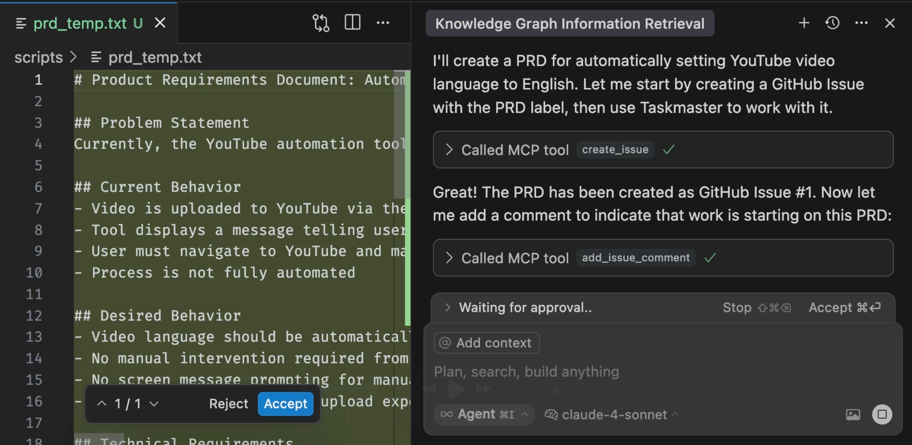
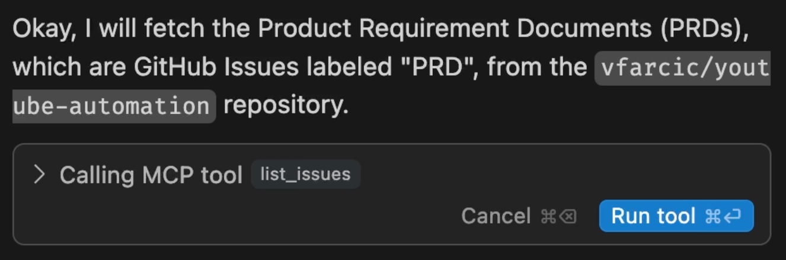
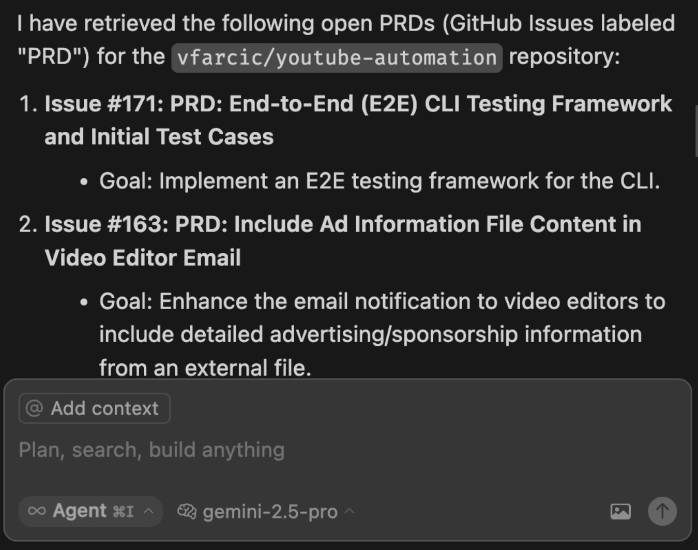
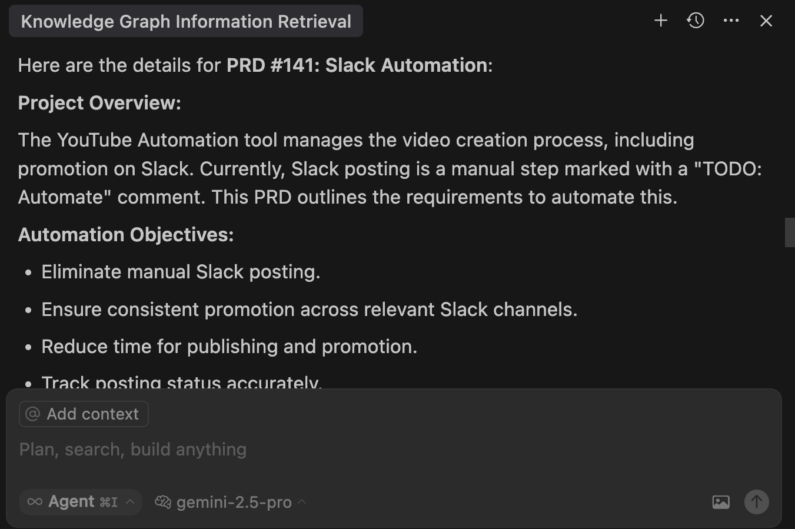
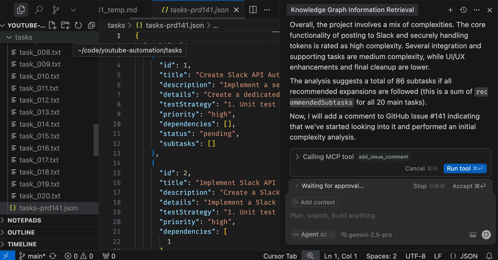

+++
title = 'My Workflow With AI: How I Code, Test, and Deploy Faster Than Ever'
date = 2025-06-23T15:00:00+00:00
draft = false
+++

Today I want you share my **development workflow with AI**. I want to share how I start working on a new feature, how I manage product requirement documents, or PRDs, how I write code and test it, and how I move through the development lifecycle. The way I approach all that today is very different from the way I did all that in the past. There is a whole team working on each feature, with me being **the only human** involved.

<!--more-->



You will see a very effective, yet very simple approach to development with AI. You will see a model, a few agents, one IDE, several MCPs, and a lot of memorized instructions all combined into an **effective workflow**. You'll see how I orchestrate all those with a relatively small number of instructions that expand into quite a few tasks executed autonomously.

My motivation is partly selfish. I want to share with you how I do what I do in hopes that you will share with me your approach. I want us to learn from each other.

All in all, I will share my AI-based workflow and I encourage you to share yours so that we can learn from each other. How does that sound?

## Setup

> The post is based on Cursor. You should be able to accomplish similar results with other AI agents but, in that case, you might need to modify the instructions.

> Please watch the [GitHub CLI (gh) - How to manage repositories more efficiently](https://youtu.be/BII6ZY2Rnlc) video if you are not familiar with GitHub CLI.

```sh
gh repo fork vfarcic/youtube-automation --clone --remote

cd youtube-automation

gh repo set-default
```

> Select the fork as the default repository

> Watch [Nix for Everyone: Unleash Devbox for Simplified Development](https://youtu.be/WiFLtcBvGMU) if you are not familiar with Devbox. Alternatively, you can skip Devbox and install all the tools listed in `devbox.json` yourself.

```sh
devbox shell
```

> Watch [The Future of Shells with Nushell! Shell + Data + Programming Language](https://youtu.be/zoX_S6d-XU4) if you are not familiar with Nushell. Alternatively, you can inspect the `dot.nu` script and transform the instructions in it to Bash or ZShell if you prefer not to use that Nushell script.

```sh
chmod +x dot.nu

./dot.nu setup
```

> Follow the on-screen instructions from the output at the end of the script execution.

```sh
code .
```

> Open `Settings` in Cursor, select `MCP`, and enable all servers.

> AIs are non-determinstic; even if we execute the same prompt twice, the results are likely to differ. As such, if you follow along, you are likely to experience different results and might need to adapt instead of following my instructions blindly.

## Before We Start

Before we see it all in action, there are a few additional steps we need to perform in Cursor.

By default, Cursor is set to use the `Auto` mode. Don't do it. Don't fall for it. It's garbage meant to save you and them money by making you hate AI by using garbage models. Just say no and choose one of the thinking models. You might burn through the fast requests quickly, but even slow requests to thinking models are better than the `Auto` garbage. I'll use `gemini-2.5-pro` which is, more or less, just as good as Sonnet, but at a lower price.

*Quick note here... I wrote this post before Sonnet 4 was released, which is better than Gemini 2.5 Pro and a better choice.*

Next, I'll remind Cursor to get all the instructions I accumulated over time from the memory MCP.

> Execute the prompt that follows in Cursor agent chat.

```
Retrieve and process all information from the `memory` MCP knowledge graph to guide our session.
```

*If you're not familiar with the Memory MCP, you should watch [The Missing Link: How MCP Servers Supercharge Your AI Coding Assistant](https://youtu.be/n0dCFY6wMeI) video.*

Next, we'll change the memory to use the user where you forked the repo.

> Execute the prompt that follows in Cursor agent chat.

```
Check the user of the forked repo and update `memory` MCP to use that user instead of `vfarcic`. Ensure that you are always working on this forked repo instead of upstream.
```

Finally, since forked repos do not have issues enabled by default, we need to enable them. We can do that with the agent as well.

> Execute the prompt that follows in Cursor agent chat.

```
Enable issues in the repo.
```

## Create PRDs Using AI

Let's say that we would like to work on this project which happens to be a CLI written in Go that I use to manage videos in my YouTube channel.

If we would travel back in time, adding a new feature to the project would typically start by someone deciding what the feature is and then writing a detailed Product Requirements Document that contains all the information one might need to understand what it's all about, which technical decisions should be made, the architecture, all the tasks that might need to be done, and whatever else we might need. We could spend anything from minutes to days on the PRD alone, before a single line of code is written. Once we're done, we would probably store that PRD in whichever issue management tool we might be using. That could be JIRA, in which case I would have to quit my job and move somewhere else. Since my relationship with JIRA is the same as my relationship with the guy that bullied me in school, we'll use GitHub Issues instead.

So, let's do just that. Let's create a PRD and store it as a GitHub issue but, this time, with the Cursor agent.

We'll start by instructing it `create a PRD`. `Currently, the project outputs on the screen information that a user should set language of a video uploaded to YouTube manually` and `I want language selection to be always set to English and set automatically when a video is uploaded.` Just in case that memory is not working, we'll instruct the agent to `Use Taskmaster to create that PRD`.

> Execute the prompt that follows in Cursor agent chat.

```
Create a PRD. Currently, the project outputs on the screen information that a user should set language of a video uploaded to YouTube manually. I want language selection to be always set to English and set automatically when a video is uploaded. Use Taskmaster to create that PRD (just in case memory is failing you).
```

*There's much more involved than that prompt. We'll see later how I instructed the AI to do everything it is and will be doing. For now, the detailed PRD is stored as a GitHub issue and anyone can work on it.*

Quite a few actions were performed as a result of that prompt.

Among other actions, the agent used Taskmaster to create the PRD. I won't go into details of how Taskmaster works here since I already did that in the [From Shame to Fame: How I Fixed My Lazy Vibe Coding Habits with Taskmaster](https://youtu.be/0WtCBbIHoKE). The gist is that Taskmaster is one of my favorite MCP servers that handles tasks related to PRDs. It creates them, it breaks them into tasks, and it orchestrates the work of coding agents so that all the tasks are eventually done. It's awesome.



After the PRD was created, the agent called GitHub MCP to create an issue based on that PRD. That alone is a huge improvement. Gone are the days when we would spend more time wondering what a request to develop a feature or a bug fix is all about. The PRD created by Taskmaster was converted into a GitHub issue and a comment was added indicating that we started working on it. As a result, that and all other issues in that repo now contain all the information one might need. Having detailed information in issues was always important, but now that we are using AI, it is essential. We'll see later why.

Normally, at this point, I would review that PRD, and, if needed, provide additional instructions to fine tune outcomes. No AI is perfect and trusting them blindly is not a good idea (just yet). However, for the purpose of brevity, I'll skip that rule today and you should not take that as encouragement to do the same.

Most of my time, however, is not spent on creating PRD, but on implementing new features or fuxing bugs, so let's switch to the next phase and see how I decide what to work on.

> If the agent suggests to parse the PRD, stop it. We'll get to that later.

## Get PRDs with AI

When I start a new session, the first thing I do is discover what the pending PRDs (or bugs) are and decide which one to work on.

That's easy. All I have to do is ask the AI to `get PRDs`.

> Execute the prompt that follows in Cursor agent chat.

```
Get PRDs.
```



Thanks to the memory graph we'll explore later, the agent understood that means that it should retrieve all the issues from GitHub and filter them based on the `prd` label.



The final result is the list of all the PRDs we might work on. Those were all created by Taskmaster but, this time, they are coming from GitHub issues.

> I switched to the upstream repo instead of the fork we used before. You should stay at the fork while knowing that you have only one issue, the one we just created, while I will have all the issues currently available in upstream. So, the outputs seen here will differ from those you'll see if you're following along.

Most of the time, I do not know the details of a PRD. Even if I wrote it, I'm too old to remember it, so my next step is usually to ask the AI to `show the details of` whichever PRD I might be interested to work on.

> Execute the prompt that follows in Cursor agent chat.

```
Show the details of 1.
```

That results in yet another trip to GitHub to retrieve all the details from the issue I referenced and output all the details.



> Execute the prompt that follows in Cursor agent chat.

Finally, after digesting the PRD, I prefer checking `how hard will it be to implement it`.

```
How hard will it be to implement it?
```

Quite a few things need to happen for it to analyze the complexity. Among other steps, the AI has to figure out all the tasks required to complete the PRD and use that information to calculate how complex it might be do implement it.



In this specific case, there are `20` tasks in total, many of them split into subtasks. There's `88` of those. With the system I'm currently using, that would probably be a couple of days of work, maybe a week. Not today though. Today I expect it to take a few hours in total. It could probably be done in half an hour, but I prefer taking it easy and reviewing each step of the process that is about to start. Still, moving from a week of work to a few hours is quite an accomplishment.

From here on, I could repeat the process and explore other PRDs, or work on that one. The one we just explored seem fun to work on, so now I'm ready to do some real work.

## Implement PRD Code and Tests

> Execute the prompt that follows in Cursor agent chat.

```
Start working on the PRD.
```

It took the AI a few moments to organize everything. It gathered all the info it needs and generated whichever resources it needed to be generated.

Once it finished the preparation, it suggested that I should work on the first task, recommended that there should be `5` subtasks and asked me whether I want to `expand` those `subtasks`.

Most of the time, my answer is `do it` which results in creation of those recommended tasks, through Taskmaster connected to Anthropic Sonnet model.

This is when it truly starts. The agent sets the first task to `in-progress`, then the first subtask also to the `in-progress` status, and starts writing code and tests.

Next few hours is spent on AI working on each of those 88 tasks and me correcting it and providing more information. Think of me in that process as a code reviewer and AI agent with everything else I set up as a developer. It is effectively doing the same job I was doing before, and probably disliking me just as much as I disliked people who were reviewing my code in the past.

I won't bore you going through those few hours of work, so let's jump to the end of the process.

## Execute Final PRD Tasks and Workflows

One might think that after we're done with coding, we're done working. I'm sure you're not one of those. There are quite a few other tasks we might need to perform once the code is done or, to be more precise, when we think it might be done.

We should create a branch, if we haven't created it already, push changes to it, create a pull request, ask someone to review those changes, implement suggested changes, approve the PR and merge it to the main branch, delete both local and remote branches, execute CI/CD workflows that will do what workflows do, and, potentially, quite a few other tasks. In the past, all that could be time demanding and, maybe, even considered chore.

Not today. Today all I have to do is tell the AI that we are done.

> Execute the prompt that follows in Cursor agent chat.

```
We're done.
```

As a result of that single sentence, the AI agent, the model, a few MCPs and, most importantly, instructions I stored in agent's memory kick in and start the final process.

During that process, the current status is checked, modified and new files are staged, new branch is created, staged commit is pushed to it, a PR with all the details is created, code reviews done by multiple other agents are performed, and I am presented with findings. From there on, I can choose to implement suggested improvements and fix issues that were detected. Once I'm done with that, the process continues. The PR is merged, the branches are deleted, temporary files are removed and... I'm done, unless the workflows that are triggered notify me of any other issue. By done, I mean that it is built and tested, the release and the tag was created, the application is deployed, and whatever else my workflows might do.

I probably missed to mention all the tasks that were performed. That does not matter. What matters is that all that is done exactly the way I want it to be done and all I had to do is tell the AI that I am done. AI did not do what it thinks it should do but executed the tasks that exactly reflect my process and way of working.

It's awesome. I'm done done. That PRD is fully finished, and the only question left unanswered is "how did all that happen?"

## How Does It All Work?

Everything I did today might sound complicated to setup. Everything we saw did not happen by using Cursor or any other AI agent out of the box. This is a custom solution. Yet, it is a solution that is very easy to setup. It's a recipe with the following ingredients.

We need an LLM model, an IDE, an agent, a few MCP servers, and quite a few memorized instructions and processes.

You are already probably using LLMs and IDEs so I won't go deeper into those, except to say that, right now, I prefer using either Google Gemini or Anthropic Claude Sonnet models and that my favorite IDE is Cursor that already comes with an agent. You might have made different choices, and that's fine, since the rest of the setup works in, more or less, any combination.

Next there are MCP Servers, so let's take a look at them.

> Execute the prompt that follows in Cursor agent chat.

```
Show MCP servers specified in `.cursor/mcp.json`. Show both the info and the raw format.
```

Unlike some other projects I'm working on, this one uses only four MCP servers which, in my opinion, are essential.

The most important one is `memory` which contains all the instructions agent needs to understand my way of working. That's how, for example, it knews that it should execute a bunch of tasks when I said that we are done.

Now, to be clear, you do not necessarily need that MCP since most agents are capable of managing their memory. I prefer that MCP since agents are changing very fast and I often switch from one to another and, while doing that, it is important for me to keep the same memorized instructions. If we opt for built-in memory, that might require conversion from one format to another.

Then comes `context7` which provides up-to-date documentation from thousands of projects.

Further on, there is `taskmaster-ai` which manages PRDs and orchestrates the agent to work on tasks that constitute a PRD. I extended Taskmaster's capabilities though additional instructions stored in memory, mainly focused on using GitHub issues instead of local files.

Finally, the last MCP is `github` which enables interaction with, as you can guess, GitHub. That one might not be necessary since agents are perfectly capable of using GitHub CLI. Nevertheless, MCP tends to work better, so there it is.

I won't go into more details about those MCPs, since I already explored those in [Outdated AI Responses? Context7 Solves LLMs' Biggest Flaw](https://youtu.be/DeZ-gw_aop0) and [The Missing Link: How MCP Servers Supercharge Your AI Coding Assistant](https://youtu.be/n0dCFY6wMeI) videos.

If you feel like using the same MCPs, you can just copy and paste the `json` from the output.

The main and, probably the most important part of my setup are entries inside the memory MCP. Let's take a quick look at those related to PRDs.

> Execute the prompt that follows in Cursor agent chat.

```
Get all the memory entries directly or indirectly related to PRDs. Get them from the `memory` MCP. Display them in a user-friendly format and output them as a separate Json file in exactly the same format as the original `memory.json`.
```

There are currently seventeen memory entities related to PRDs. There are instructions what to do with pull requests, code coverage, test-driven development, PRD handling, and so on and so forth. It would take too much time to go through all of those. AI should have created a separate Json with those so you can explore them on your own.

You are free to use them, but I advice against it. Use them as inspiration, but create your own that match the way you work. If you do that, do not overthink it. Do not try to capture everything at once. Instead, I suggest to keep updating it while you're working. That's, at least, what I do. The moment I notice that the agent is doing something I don't want it to do or doing it in a different way than how I like to work, I write a prompt that says "update your memory with this and that." Similarly, if you know that there are processes you execute often, instruct it to memorize them and associate them to a sentence like "memorize that when I say that we are done, you should do this and that".

The last component is the least interesting since everyone is almost certainly using it. There are workflows that are executed as a result of creating a pull request or merging it to the main branch. In my case, those workflows are defined as GitHub Actions.

> Execute the prompt that follows in Cursor agent chat.

```
Show the GitHub Actions workflow release.
```

I won't go into that workflow, mostly because it's boring.

> Execute the prompt that follows in Cursor agent chat.

The last part I should mention is the very beginning of each of the sessions I start. The first thing I execute is always the same. It's retrieval of the entries from the memory graph.

I do that by executing custom Cursor rule.

```
@fetch_mcp_memory_instructions.mdc
```

That way, every time I start working I know that the agent gets all the instructions I assembled and stored in the memory MCP and follows them depending on what I instruct it to do.

If you want to take a look at that rule, here's how it looks like.

> Execute the prompt that follows in Cursor agent chat.

```
Show fetch_mcp_memory_instructions.mdc in its raw format.
```

It is a simple one that instructs the agent to `retrieve and process all information from the memory MCP knowledge graph to guide our session.` If you are not using Cursor, other agents tend to have something similar. For example, Claude Code has Custom commands so you should be able to do something similar no matter which agent you're using.

That's it from me. I shared one of my workflows. Today that was development of an application, but there are others. I have similar, yet somehow different workflow for managing infrastrcuture, another one for operations, and a few others.

Now its your turn. How do you do whatever you're doing. Please share in the comments of the video (embeeded at the top of this post).

## Destroy

> Close Cursor

```
exit
```

