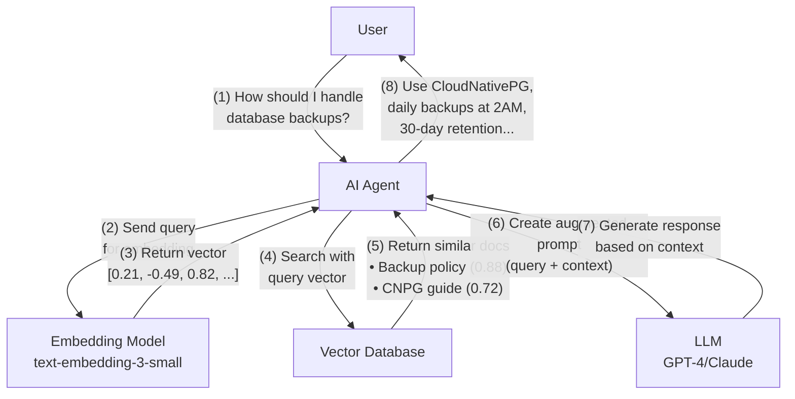

+++
title = 'Stop Blaming AI: Vector DBs + RAG = Game Changer'
date = 2025-09-01T16:00:00+00:00
draft = false
+++

Let me guess. You tried AI, it hallucinated something completely wrong, and now you're back to doing everything manually while complaining that "AI doesn't work."

Maybe you're a developer who asked it about your codebase, and it confidently explained functions that don't exist. Or suggested using deprecated APIs your team abandoned two years ago. Perhaps it recommended architectural patterns that directly contradict your team's decisions.

Or you're in ops, and it gets even worse. You asked about your backup policies, and it invented procedures you've never implemented. You requested help with a Kubernetes deployment, and it suggested configurations that violate every security standard you have. You wanted it to troubleshoot a production issue, and it gave you generic advice that would take down your entire cluster.

<!--more-->



"AI hallucinates!" "AI doesn't understand our codebase!" "AI doesn't know our infrastructure!"

So now you're one of those people. You've probably written a snarky post about it. Maybe even a blog titled "Why AI Isn't Ready for Real Engineering Work."

Here's the uncomfortable truth: **You're doing it wrong.**

You're asking AI about your team's coding standards without giving it access to those standards. You're expecting it to know why you chose PostgreSQL over MongoDB without feeding it your architectural decisions. You're demanding it follow your deployment procedures while keeping those procedures locked away in various tools and documents.

What did you expect? Mind reading?

But sure, keep blaming the technology. Keep writing boilerplate code manually. Keep copy-pasting from runbooks. Keep believing that AI is the problem. Or... maybe stick around and learn why your AI experiments failed and, more importantly, how to fix them.

## Setup

> Make sure that Docker is up-and-running.

> Watch [Nix for Everyone: Unleash Devbox for Simplified Development](https://youtu.be/WiFLtcBvGMU) if you are not familiar with Devbox. Alternatively, you can skip Devbox and install all the tools listed in `devbox.json` yourself.

```bash
git clone https://github.com/vfarcic/vector-db-demo

cd vector-db-demo

devbox shell

docker container run --detach --name qdrant --publish 6333:6333 \
    qdrant/qdrant

npm install

curl -X PUT http://localhost:6333/collections/demo \
    -H 'Content-Type: application/json' \
    -d '{ "vectors": { "size": 1536, "distance": "Cosine" } }'

# Replace `[...]` with your OpenAI API Key
export OPENAI_API_KEY=[...]

node load_sample_data.js
```
 
## Why AI Hallucinates About Your Code

Large language models possess vast knowledge from their training on internet data, but **they know nothing about your organization.** They understand PostgreSQL syntax but not that your company mandates using CloudNativePG for all database deployments. They can write perfect Kubernetes manifests but don't know your team requires specific labels, annotations, and resource limits. They grasp software engineering principles but are unaware of your architectural decisions, security policies, or operational runbooks.

This knowledge gap becomes critical when deploying AI agents in production. Consider a developer asking an AI agent to "deploy a new database for the user service." The model can generate a generic PostgreSQL deployment, but without your organization's context, it won't know to use CloudNativePG, won't apply your required security policies, won't follow your naming conventions, and won't configure the backups according to your disaster recovery standards.

The challenge intensifies when we examine how AI agents interact with existing systems. Take Kubernetes APIs. While excellent for operations, they weren't designed for the exploratory, semantic queries that AI agents need. When a developer asks "show me all our databases," the AI agent faces an immediate problem. The developer might say "databases," another might ask for "DBs," a third could request "PostgreSQL instances," and someone else might query "data stores." To Kubernetes, these are completely different things. It only understands exact resource types: `deployments`, `statefulsets`, `postgresqls.postgresql.cnpg.io`, or `rdsinstances.rds.aws.crossplane.io`. 

"But wait," you might ask, "can't the AI just query all possible database-related resource types?" That's exactly what it must do. The agent has to know every possible resource type that could be a database: StatefulSets running PostgreSQL, CloudNativePG clusters, Crossplane RDS instances, Helm-deployed MongoDB, and more. Each requires separate API calls, returns different schemas, and uses different terminology. There's no unified way to ask "show me all database-related resources" because Kubernetes doesn't understand that these are all conceptually "databases." It sees them as completely unrelated resource types.

The root of this problem is that **APIs are not designed for humans.** They're designed for machines. That's why we need tools like Terraform to translate between human intent and API operations. APIs excel at precise, unambiguous operations: create this exact resource, delete that specific pod, update these particular fields. But we interact with AI using natural language, the same way we interact with other humans. When someone asks "show me our databases," they're expressing human intent, not an API call. While AI agents can use machine-oriented APIs for operations, they struggle with discovery because APIs aren't designed to understand that "database", "DB", "PostgreSQL", and "data store" might all refer to the same concept.

Security and governance policies present an even greater challenge. Your Kyverno policies prevent misconfigurations effectively, but they're write-only from an AI's perspective. When asked "can I expose this database to the internet?", the agent must retrieve every policy file, parse all rules, understand their conditions, and determine which apply. 

"But isn't this the same question we answered five minutes ago?" you might wonder when another developer asks "is public access allowed for PostgreSQL?" Then a third asks "can we add an internet-facing endpoint to our database?" And a fourth simply types "external DB access?" These are all the same question expressed differently, but without semantic understanding, the AI treats each as a brand new query. It must scan all policies again because it can't recognize that "expose to internet," "public access," and "external endpoint" all mean the same thing. This expensive discovery process repeats endlessly because there's no efficient way to index and retrieve policy knowledge based on meaning rather than exact text matches.

Beyond infrastructure, consider the wealth of **knowledge trapped** in your organization's documents, issue trackers, runbooks, and wikis. "How do I fix slow database queries in production?" an engineer asks. The answer exists in your organization, but where? The root cause analysis might be in ticket JIRA-1234 titled "Investigation of CPU spikes." The solution could be documented in a runbook called "PostgreSQL Tuning Guide." Additional context might live in a Slack thread about "connection pooling issues" and a wiki page on "Database Best Practices." 

But here's the challenge: none of these documents mention "slow queries" explicitly. They talk about "performance degradation," "high latency," "connection timeouts," or "resource optimization." An AI agent trying to help can't efficiently find all relevant information because these systems organize information by location (which folder, which channel, which project) rather than by meaning. It doesn't understand that "slow queries," "performance issues," and "high latency" are all related to the same problem domain.

One might think the solution is to train custom models on your organization's data. However, this approach quickly proves impractical. Your documentation changes daily, new policies are added weekly, and systems evolve constantly. Training custom models is expensive, time-consuming, and by the time a model is trained, its knowledge is already outdated. You'd need a continuous model training pipeline, transforming AI assistance from a productivity tool into a complex MLOps challenge.

Coding AI agents like Claude Code and Cursor can technically access all these systems through their tools. They can query Kubernetes APIs, read documentation, search through tickets, and parse policies. Once they understand what needs to be done, they excel at executing operations through these same APIs. But the discovery process remains painfully inefficient. Finding the right information based on semantic meaning rather than exact matches is where they struggle.

What we need instead is a way to dynamically provide AI with the right organizational knowledge at the right time, based on the context of each request. But how can we efficiently store, index, and retrieve this diverse knowledge in a way that AI can understand semantically rather than just matching keywords? How can we ensure that when an agent needs to know about database deployment policies, it can quickly find all relevant information regardless of where it's stored or how it's phrased? This is the challenge modern AI agents face, and solving it requires rethinking how we store and retrieve organizational knowledge.

## Vector Databases for AI Context

Vector databases are specialized storage systems designed to handle semantic relationships rather than exact matches. Unlike traditional databases that store data in rows and columns or documents, vector databases store information as mathematical representations called embeddings. Think of it this way: in a traditional database, "database," "DB," and "data store" are three completely different strings. In a vector database, they're stored as points in space that are close together because they share similar meaning. When you search for "PostgreSQL performance," it can find documents about "database optimization" and "query latency" because it understands these concepts are related, even though they don't share the exact same words.

This **semantic understanding** makes vector databases superior to traditional databases for AI applications. Traditional databases excel at precise queries: find all records where status equals "active" or where timestamp is after yesterday. But AI agents deal with human language and concepts. When someone asks about "database exposure policies," a traditional database would need the exact phrase. A vector database understands that documents about "public endpoints," "internet-facing services," and "external access controls" are all relevant to that query. It's the difference between searching for exact keywords and searching for meaning.

Vector databases achieve this semantic understanding through embeddings. An embedding is a numerical representation of meaning: text gets converted into a list of numbers that captures its semantic essence. When you store a document in a vector database, it first passes through an embedding model like OpenAI's `text-embedding-3-small` or open-source alternatives like `sentence-transformers`. This model transforms your text into a vector, typically with hundreds or thousands of dimensions. For example, "PostgreSQL databases must not be exposed to the internet" becomes a vector like `[0.023, -0.451, 0.123, 0.892, -0.234, ...]` with 1,536 dimensions.

The magic is that similar concepts get similar vectors. Let me demonstrate this. I'll take one sentence about database security and compare it against five other sentences to see how similar their vectors are.

```bash
node create_embeddings.js \
    "PostgreSQL databases must not be exposed to the internet" \
    "Keep MySQL instances private" \
    "Don't allow public access to databases" \
    "Databases should remain internal only" \
    "How to optimize database performance" \
    "Recipe for chocolate cake"
```

The output is as follows.

```json
Creating embeddings...
{
  "similarities": [
    {
      "text": "Keep MySQL instances private",
      "score": 0.471
    },
    {
      "text": "Don't allow public access to databases",
      "score": 0.653
    },
    {
      "text": "Databases should remain internal only",
      "score": 0.57
    },
    {
      "text": "How to optimize database performance",
      "score": 0.276
    },
    {
      "text": "Recipe for chocolate cake",
      "score": 0.01
    }
  ]
}
```

Look at these scores! The script converted all six sentences into 1,536-dimensional vectors, then calculated how similar each comparison text is to our base text `PostgreSQL databases must not be exposed to the internet`. 

`Don't allow public access to databases` gets `0.653`, the highest similarity. Even though it uses completely different words, its vector is very close to our base vector in 1536-dimensional space. It's expressing the exact same security concept.

`Keep MySQL instances private` scores `0.471`. Its vector is moderately similar, even though it mentions MySQL instead of PostgreSQL. The embedding model understands they're both about keeping databases private.

But here's where it gets interesting. `How to optimize database performance` only scores `0.276`. Yes, it's about databases, but its vector points in a different direction because it's about performance, not security. The embedding model understands this distinction.

And `Recipe for chocolate cake`? `0.01`. Its vector is almost perpendicular to our database security vector. The model knows this has nothing to do with database security. That's the magic of embeddings: they **capture meaning** in mathematical space, not just keywords.

Once text is converted to embeddings, vector databases store these high-dimensional arrays in specialized data structures optimized for similarity search. Instead of traditional indexes designed for exact matches, they use structures like HNSW (Hierarchical Navigable Small World) graphs or IVF (Inverted File) indexes. These allow the database to quickly find vectors that are "close" to your query vector in multi-dimensional space. It's like organizing points in space so you can efficiently find all the neighbors of any given point, even when that space has 1,536 dimensions.

When you search a vector database, your query also gets converted to an embedding using the same model. The database then finds the stored vectors most similar to your query vector using distance metrics like cosine similarity or Euclidean distance. Cosine similarity measures the angle between two vectors: identical concepts have a similarity of 1.0, completely unrelated concepts approach 0, and opposite concepts approach -1.0. This is why "database exposure policies" can find documents about "public endpoints" with a similarity of 0.85, while "recipe for chocolate cake" would score near 0. The database returns results ranked by similarity, giving you the most semantically relevant documents first.

Let me show you exactly how this works. I'll search our vector database for an answer to a critical security question:

```sh
QUERY="can I expose my database to the internet?"
```

First, I need to convert this question into an embedding, the same 1,536-dimensional vector format we used when storing our documents:

```sh
node -e "
const OpenAI = require('openai');
const openai = new OpenAI({ apiKey: process.env.OPENAI_API_KEY });
openai.embeddings.create({
  model: 'text-embedding-3-small',
  input: '$QUERY'
}).then(r => console.log(JSON.stringify(r.data[0].embedding)));
" > query_embedding.json
```

Let's see what our question looks like as a vector:

```sh
cat query_embedding.json
```

The output is as follows (truncated for brevity).

```json
[-0.0041614738292992115,-0.016695920377969742,0.06423239409923553,0.030290275812149048,0.004311549477279186,-0.04667353630065918,-0.039144739508628845,0.031040653586387634,-0.03099062852561474,-0.020485330373048782,0.021798493340611458,-0.02252385951578617,0.054227348417043686,-0.03299163654446602,-0.0314408540725708,-0.024499855935573578,0.0018024714663624763,0.037318818271160126,-0.02996511198580265,0.03989511728286743,0.0331917367875576,0.03769400715827942,0.0078602135181427,-0.01764639839529991,0.021698443219065666,0.010186387225985527,-0.0030405959114432335,-0.007041050586849451,0.033041663467884064,-0.033391840755939484,0.002452799351885915,-0.022048618644475937,-0.023386793211102486,0.038544438779354095,-0.007947757840156555,-0.010655373334884644,0.03336682543158531,...]
```

That's our question as numbers! Now I'll search Qdrant for the vectors most similar to this one:

```sh
curl -X POST http://localhost:6333/collections/demo/points/search \
    -H 'Content-Type: application/json' \
    -d "{
      \"vector\": $(cat query_embedding.json),
      \"limit\": 3,
      \"with_payload\": true
    }" | jq '.result[] | {
      source: .payload.source,
      similarity: .score,
      text: .payload.text
    }'
```

The output is as follows.

```json
{
  "source": "adr-042-database-isolation.md",
  "similarity": 0.59465814,
  "text": "Decision: No database should be directly accessible from internet. All database access must go through application layer with proper authentication."
}
{
  "source": "security-policy.yaml",
  "similarity": 0.43317494,
  "text": "Database endpoints must use ClusterIP only, never LoadBalancer. All database services should be internal-only to prevent external access."
}
{
  "source": "incident-2023-11-breach.md",
  "similarity": 0.36066696,
  "text": "Root cause: PostgreSQL instance exposed via LoadBalancer service type. Impact: Potential data breach. Resolution: Changed to ClusterIP."
}
```

Perfect! Look what just happened. I asked `can I expose my database to the internet?` and the vector database found:

1. **An architecture decision record** explicitly stating `No database should be directly accessible from internet` with 59% similarity.
2. **A security policy** requiring `ClusterIP only, never LoadBalancer` with 43% similarity.
3. **An actual incident report** about a database breach caused by exactly what I was asking about, with 36% similarity.

Notice that none of these documents contain the exact phrase "expose database to internet". The ADR talks about "directly accessible", the policy mentions "LoadBalancer", and the incident describes a "breach". But the vector database understood the semantic meaning of my question and found the relevant policies, decisions, and even historical incidents.

If I had used traditional keyword search for "expose database internet", I would have found nothing. Zero results. But with vector search, I got exactly the information I needed to prevent a security incident.

The key benefits of vector databases for AI applications are transformative. Semantic search means your AI agents can find relevant information regardless of exact wording. Instead of maintaining complex keyword mappings or synonyms, the system naturally understands that "shut down the database" and "terminate PostgreSQL instance" mean the same thing. Scalability comes from specialized indexing algorithms that can handle millions or billions of vectors while maintaining sub-second query times. And performance isn't just about speed: it's about finding the right information on the first try, eliminating the repeated scans and failed searches that plague keyword-based systems. This combination finally gives AI agents the ability to efficiently access organizational knowledge the same way humans do: by understanding meaning, not memorizing exact phrases.

The real power comes from what organizations actually store in vector databases. Everything becomes semantically searchable: Kubernetes manifests, Terraform configurations, security policies, runbooks, architecture decisions, incident reports, API documentation, even Slack conversations about outages. 

But here's the thing: you don't just dump entire documents into a vector database. Remember, each piece of text needs to become a meaningful embedding. A 50-page runbook as a single vector would be useless. Instead, you need intelligent chunking, breaking documents into semantic sections that maintain context while being specific enough to be useful.

This chunking process is where things get interesting... and complicated. How do you chunk a YAML file? Where do you split a troubleshooting guide? How do you maintain context across chunks? What metadata should you preserve? These aren't trivial questions, and bad chunking can make your vector database nearly useless.

But don't worry about losing access to complete documents. Vector databases store chunks with metadata that includes source references. When semantic search finds a relevant chunk, you can always retrieve the full document it came from. Think of it like a smart index: the vector DB helps you find the relevant paragraph, but you still have access to the entire document when you need broader context. This is exactly how RAG systems work in practice, they search semantically at the chunk level but can expand to full documents when generating responses.

If you're interested in diving deep into document chunking strategies, embedding optimization, and building production-ready vector databases, let me know in the comments. It's a fascinating topic that deserves its own dedicated exploration.

For now, what matters is understanding the transformation: your organization's knowledge, previously trapped in various formats and systems, becomes a unified, semantically searchable knowledge base. A vague question like "database keeps disconnecting" can instantly surface relevant information from runbooks, past incidents, Slack threads, and documentation, even when they use completely different terminology.

## RAG: How AI Gets Your Context

RAG, or Retrieval-Augmented Generation, is the bridge between your vector database and AI's responses. Instead of relying solely on what the model learned during training, RAG dynamically pulls relevant information from your vector database and includes it in the AI's context before generating a response. It's like giving the AI a reference library card: before answering any question, it first looks up the most relevant documents, policies, and examples from your organization's knowledge base. This transforms a generic AI model into one that speaks with your organization's voice and knowledge.

You're already experiencing a form of RAG when you use coding agents like Claude Code or Cursor. When you ask about your codebase, they retrieve and read your files before responding. But current agents use brute-force retrieval: scanning directories, reading entire files, searching for keywords. They might read 50 files to find one relevant function, or scan every policy file to understand a single rule. With vector databases powering RAG, the same query triggers semantic retrieval. Instead of scanning everything, the system finds exactly what's relevant based on meaning, not just text matches. Your question about "database configuration" instantly retrieves the relevant policy sections, the related ADR explaining the decision, and similar resolved issues, all ranked by semantic relevance.

"Wait, if brute-force search is so inefficient, why don't we just put all our source code in a vector database?" Good question. You could, but code is different from documentation. Code changes with every commit, requiring constant re-indexing. Code needs its full context: imports, class definitions, surrounding functions. Vector databases chunk content into pieces, which can break these relationships. When debugging, you often need exact matches for function names or specific syntax patterns, not semantic similarity. That's why coding agents still use traditional code analysis for active development. But code comments, docstrings, example snippets in documentation, and historical implementations? Those are perfect for vector databases. They change less frequently and benefit from semantic search.

So we need both: traditional file access for active code development and vector databases for organizational knowledge. But let's focus on how RAG works with vector databases, since that's what transforms AI from a generic assistant into one that knows your organization.



Let's walk through what happens when someone asks "How should I handle database backups?" (1). They don't need to know where the answer lives or what keywords to use. They just ask.

The AI agent receives this question and immediately sends it for embedding (2). This could be Claude Code, Cursor, or any custom application, but they all follow the same pattern. The query goes to the same embedding model that indexed your documents - this is crucial. You must use the same model for both indexing and queries, otherwise the vectors won't align.

The embedding model works its magic, converting the question into a 1,536-dimensional vector (3). This vector represents the semantic meaning of "How should I handle database backups?" as a point in high-dimensional space.

Now the agent takes this vector and searches your knowledge base (4). It's looking for document vectors that are close to your query vector in that multi-dimensional space. The vector database calculates cosine similarity between your query and every stored chunk.

Within milliseconds, similar documents come flooding back (5). Your backup policy scores 0.88 similarity - very relevant. The CloudNativePG guide scores 0.72 - also useful. Even though your question never mentioned "CloudNativePG" or "30-day retention," the semantic search found these because they're conceptually related to database backups.

Here's where the magic of RAG happens. The agent doesn't just pass your question to the LLM. Instead, it creates an augmented prompt (6) that combines your original question with the retrieved documents. It's essentially saying to the LLM: "Based on these specific documents from our organization, answer this question about database backups."

The LLM processes this augmented prompt and generates a response (7). But unlike a generic LLM response about database best practices, this answer is grounded in your organization's actual policies. It knows to use CloudNativePG because that's what your documents say. It specifies 2 AM UTC and 30-day retention because those are your real requirements.

Finally, you receive an answer that's specific to your organization (8). "Use CloudNativePG with daily backups at 2 AM UTC, 30-day retention in S3..." The complex orchestration remains invisible. You asked a simple question and got a precise, contextual answer.

The entire process takes seconds, but the impact is profound. The AI no longer hallucinates generic answers - it responds with your organization's specific knowledge.

One of RAG's most powerful benefits is reducing hallucinations. When an AI model doesn't have specific information, it tends to make plausible-sounding guesses. Ask a generic model about your CloudNativePG backup policies, and it might confidently describe best practices that have nothing to do with your actual setup. With RAG, the model's response is grounded in retrieved documents. When asked about backup policies, it retrieves your actual runbook, your team's decisions, and your implemented configurations. The AI can still use its reasoning abilities to synthesize and explain, but it's working from your facts, not fiction. This grounding in real documents dramatically reduces those confident but wrong answers that make pure LLMs risky for production use.

"AI doesn't work! It's hallucinating!"

So if you're one of those people, now you know what to do. You're probably asking AI about information it never had access to. Of course it's making stuff up! Feed it your actual documentation, policies, and decisions through RAG, and watch those hallucinations disappear. The problem isn't AI. **The problem is you.**

Another game-changing benefit: dynamic knowledge updates without retraining. Remember that impractical "train a custom model" approach? With RAG, you skip all that. Updated your backup policy? Just re-index that document. New architectural decision? Add it to the vector database. Resolved a critical production issue? Index the post-mortem. Your AI's knowledge updates immediately. No model retraining, no waiting for the next release, no MLOps pipeline. This is how you keep AI current with your ever-changing infrastructure and policies. The model stays the same, but its accessible knowledge grows and updates continuously.

Let's see this in action with something more dramatic. A developer tells your AI agent...

"Deploy a PostgreSQL database for our payment service in production." 

Without RAG and vector databases, the agent might create a basic StatefulSet with a generic PostgreSQL image, expose it with a LoadBalancer service because that seems reasonable, and use local storage because that's what the tutorials show. Congratulations, you just violated three company policies and created a security nightmare.

With RAG powering the same request, here's what happens: The agent's query becomes an embedding that searches your vector database. It retrieves your database deployment standards (0.94 similarity), the ADR mandating CloudNativePG for all production databases (0.91 similarity), your security policy prohibiting public database endpoints (0.89 similarity), the network policy templates for database access (0.86 similarity), and a post-mortem from when someone accidentally exposed a database (0.82 similarity). 

Now the agent knows exactly what to do. It creates a CloudNativePG cluster with your standard configuration, applies the required network policies, sets up encryption with your KMS keys, configures backups to your S3 bucket with 30-day retention, adds the mandatory security labels, and even includes monitoring annotations for Prometheus. Every single detail follows your standards. The difference isn't just correctness; it's the difference between a security incident and a compliant deployment.

## Fix Your AI Implementation Now

Remember that rant at the beginning? About how AI doesn't work, hallucinates, doesn't understand your code or infrastructure? Now you know the truth. The problem was never AI. The problem was you.

You were asking questions about information the AI never had. You were expecting magic instead of implementing solutions. You were treating AI like it should somehow know your organizational knowledge through osmosis.

The solution exists. Vector databases for semantic search. Embeddings to understand meaning. RAG to ground responses in your actual documentation. Not someday. Not in the future. Right now.

Every day you don't implement this is another day of:
- Your developers getting **generic coding advice** instead of team-specific guidance
- Your ops team receiving **hallucinated procedures** instead of actual runbooks  
- Your AI agents **scanning through files inefficiently** instead of finding exactly what they need
- Your engineers dismissing **AI** as "**not ready**" when it's actually your implementation that's not ready

The tools are there. Pinecone, Weaviate, Qdrant for vector storage. OpenAI or open-source models for embeddings. Well-documented RAG patterns. Hell, you could have a **proof of concept running by tomorrow.**

So what's your excuse now? Too complex? I just explained it in one video. Too expensive? The cost of continued manual work is higher. Too much effort? Less effort than you're currently wasting on tasks AI could handle.

Stop complaining. Stop making excuses. Stop pretending AI is the problem when you're the one refusing to implement the solution. Because the only thing standing between you and AI that actually understands your organization... is you.

## Destroy

```sh
docker container rm qdrant --force

exit
```

