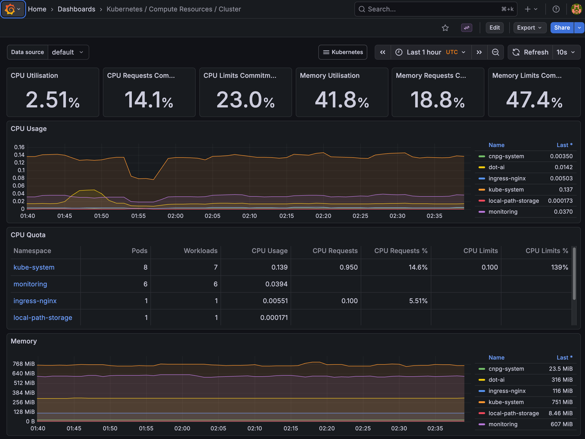
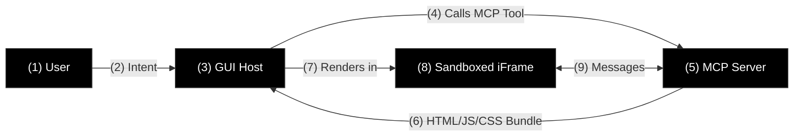
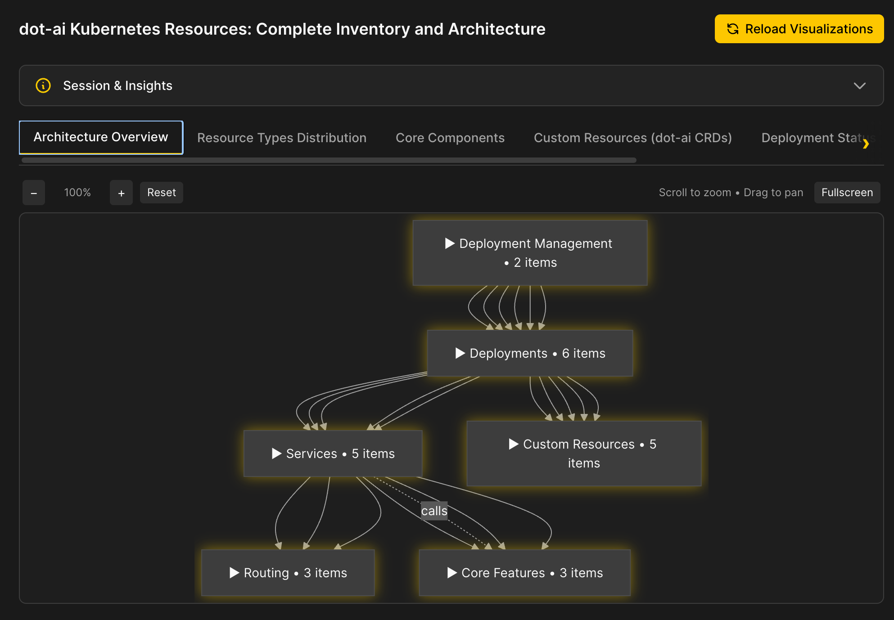
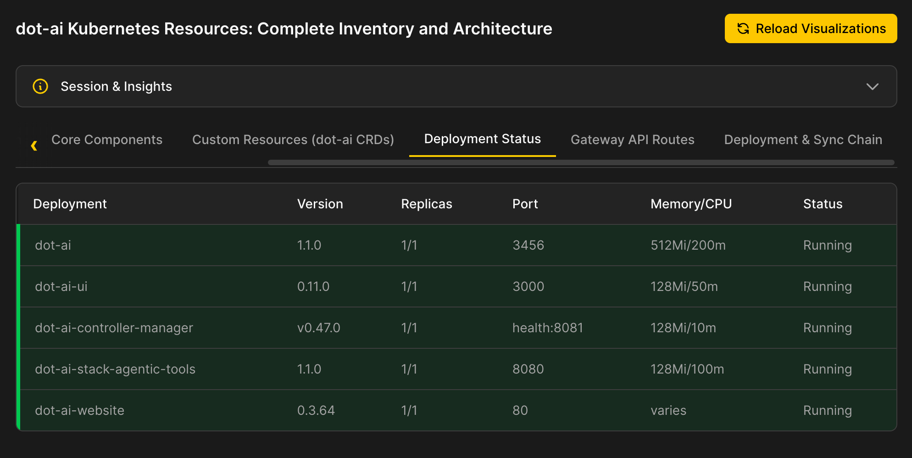
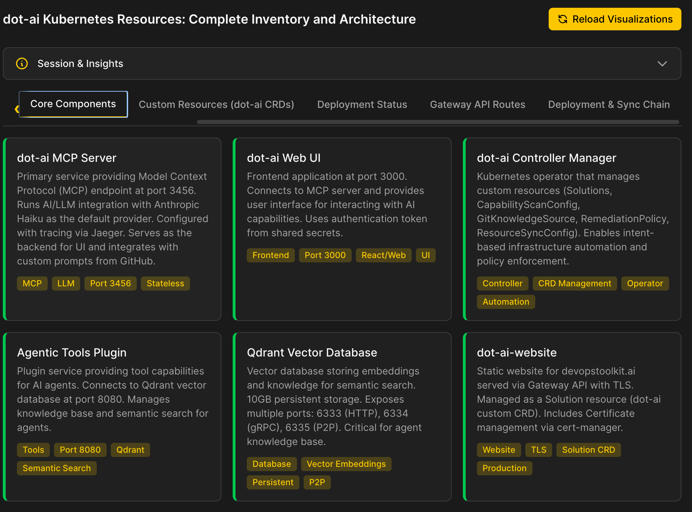
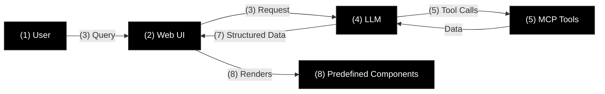

+++
title = 'Stop Designing UIs for AI - Let the LLM Decide What You See'
date = 2026-03-09T16:00:00+00:00
draft = false
+++

FIXME:

<!--more-->



## Intro

Have you ever asked an AI agent a complex question and gotten back a wall of ASCII tables, Markdown headers, and bullet points crammed into a terminal? You squint at it, scroll up and down, and think "there has to be a better way to see this." There is. But it requires rethinking how we build UIs entirely.

Traditional interfaces are designed by humans for predictable data. AI outputs are neither predictable nor structured the same way twice. So how do we visualize something when we don't know what it is until the moment it appears?

Today I'll show you two approaches to solving this: one that ships rendering code from the server, and one that lets AI decide how data should be displayed. By the end, you'll understand why the future of UIs might not be designed by us at all.

## Setup

> This demo is using Claude Code as the coding agent. With a few modification, it should work with any other coding agents like Cursor, GitHub Copilot, etc. The major change you might need to make is to change `.mcp-kubernetes.json` to whichever format and location for MCP config your agent expects.

> If you don't have Claude Code already, and would like to install it, please follow [Setup Claude Code](https://code.claude.com/docs/en/setup) instructions.

```sh
git clone https://github.com/vfarcic/dot-ai

cd dot-ai

git pull

git fetch

git switch demo/web-ui-for-ai
```

> Make sure that Docker is up-and-running. We'll use it to run create a KinD cluster.

> Watch [Nix for Everyone: Unleash Devbox for Simplified Development](https://youtu.be/WiFLtcBvGMU) if you are not familiar with Devbox. Alternatively, you can skip Devbox and install all the tools listed in `devbox.json` yourself.

```sh
devbox shell

./dot.nu setup \
    --stack-version 0.45.0 \
    --kyverno-enabled false \
    --atlas-enabled false \
    --crossplane-enabled false \
    --grafana-enabled true

source .env

export GRAFANA_PASSWORD=$(
    kubectl --namespace monitoring get secret \
    --selector app.kubernetes.io/component=admin-secret \
    --output jsonpath="{.items[0].data.admin-password}" \
    | base64 --decode ; echo
)

echo $GRAFANA_PASSWORD

claude --mcp-config .mcp-kubernetes.json
```

## Why Traditional UIs Fail AI

TODO: Logo: https://grafana.com

Traditionally, we design user interfaces to be **static visualizations** with **dynamic data**. Think about **Grafana**. The dashboards themselves are predefined. Someone decided what charts to show, where to place them, and how they connect to data sources. The data flowing through those dashboards changes constantly, but the structure never does.

> Open http://grafana.127.0.0.1.nip.io in a browser. Use `admin` as the username and the value of the `GRAFANA_PASSWORD` environment variable as password.

TODO: Screen: screen-01

We can see a Grafana dashboard showing Kubernetes cluster metrics. CPU utilization, memory usage, quotas per namespace, all laid out in panels that someone configured ahead of time.



And that works. Current UIs are great for watching and exploring, but only through predefined paths. Someone decided what users can see, how they will see it, and what actions are available. UI designers operate with a clear assumption: we know what we're looking for and we know the data structure. We build static visualization structures for predefined data structures.

But what happens when we don't know what the data structure is? What happens when we don't know what we'll get?

Enter AI.

This time, we talk to it and it responds in a way that we can digest that response. That's fundamentally different from everything we've been doing with UIs so far. A user clicks a button and we know what will happen. A user fills in a form and we know what will happen. A user clicks a link and we know where it leads. With AI, none of that applies.

Markdown got us to a point. It's better than plain text since LLMs can organize and format data with headers, tables, and lists. Yet, it is arguably the simplest and most limiting format except for pure text.

TODO: Logo: https://cursor.com
TODO: Logo: https://code.visualstudio.com

Now, not all agents are terminals. Some, like **Cursor** and **VS Code** with Copilot, are full GUI applications. They could, in theory, render much richer visualizations than Markdown. But the question remains: who decides what to render and how?

So how do we visualize outputs from AI? We don't know what the user's intent is. We might have specialized agents for querying a cluster, for remediation, for creation of solutions. Yet, we don't know what the user will type, what the intent is, and we don't know what the LLM will respond.

Let me show you what I mean. I'm going to ask a coding agent a fairly complex question about all the resources running in a Kubernetes cluster, their purpose, and how they relate to each other.

TODO: Screen: screen-02 - Show the initial intent (the text below), fast forward through AI thinking about it, and show the final output.

[user]
```text
What are all dot-ai and related resources, what is their purpose, and what are relations between them. Use dot-ai MCP. Do it as a single call to MCP.
```

[agent]
```text
⏺ Here's a comprehensive overview of all dot-ai resources in the cluster, their purposes, and relationships:

  Architecture Overview

  Everything runs in the dot-ai namespace, deployed via the dot-ai-stack Helm chart (v1.1.0).

  ---
  Core Components (Deployments)
  ┌────────────────────────────┬──────────────────────────────────────────────────────────────────────────────────────────────────────────────────────┐
  │          Resource          │                                                       Purpose                                                        │
  ├────────────────────────────┼──────────────────────────────────────────────────────────────────────────────────────────────────────────────────────┤
  │ dot-ai                     │ Main API/MCP server — orchestrates AI reasoning, routes tool calls to plugins, manages sessions                      │
  ├────────────────────────────┼──────────────────────────────────────────────────────────────────────────────────────────────────────────────────────┤
  │ dot-ai-ui                  │ Web UI — provides a browser-based interface for interacting with dot-ai                                              │
  ├────────────────────────────┼──────────────────────────────────────────────────────────────────────────────────────────────────────────────────────┤
  │ dot-ai-controller-manager  │ Kubernetes controller — watches and reconciles custom resources (Solution, CapabilityScanConfig, ResourceSyncConfig) │
  ├────────────────────────────┼──────────────────────────────────────────────────────────────────────────────────────────────────────────────────────┤
  │ dot-ai-stack-agentic-tools │ Plugin service — contains the actual tool implementations (kubectl, vector search, etc.) that the MCP server calls   │
  └────────────────────────────┴──────────────────────────────────────────────────────────────────────────────────────────────────────────────────────┘
  Data Layer (StatefulSet)
  ┌──────────────────────────────────────┬──────────────────────────────────────────────────────────────────────────────────────────────────────────────────────────────────┐
  │               Resource               │                                                             Purpose                                                              │
  ├──────────────────────────────────────┼──────────────────────────────────────────────────────────────────────────────────────────────────────────────────────────────────┤
  │ dot-ai-stack-qdrant (Qdrant v1.15.5) │ Vector database — stores embeddings for knowledge base, capability scans, and semantic search. Has persistent storage via a PVC. │
  └──────────────────────────────────────┴──────────────────────────────────────────────────────────────────────────────────────────────────────────────────────────────────┘
  ---
  Relationships / Data Flow

  User (Claude Code / Cursor / Browser)
          │
          ▼
     ┌─────────┐     ┌────────────┐
     │  dot-ai  │◄───►│  dot-ai-ui │
     │ (MCP API)│     │  (Web UI)  │
     └────┬─────┘     └────────────┘
          │
          ▼
  ┌───────────────────────────┐
  │ dot-ai-stack-agentic-tools│
  │  (plugin: kubectl, vector,│
  │   remediate, operate, etc)│
  └─────┬──────────┬──────────┘
        │          │
        ▼          ▼
    K8s API    ┌────────┐
    Server     │ Qdrant │
               │ (vector│
               │   DB)  │
               └────────┘
          │
          ▼
  ┌───────────────────────────┐
  │ dot-ai-controller-manager │
  │  (reconciles CRDs)        │
  └───────────────────────────┘

  1. dot-ai (API) receives requests and uses AI models to reason, then delegates tool execution to agentic-tools
  2. agentic-tools executes against the Kubernetes API (kubectl operations) and Qdrant (knowledge/capability storage)
  3. controller-manager watches custom resources and runs background reconciliation loops (e.g., periodic capability scans, resource syncing)
  4. dot-ai-ui talks to the dot-ai API to provide a web interface

  ---
  Networking
  ┌──────────────────────────────┬───────────┬──────┬──────────────────────────┐
  │           Service            │   Type    │ Port │         Purpose          │
  ├──────────────────────────────┼───────────┼──────┼──────────────────────────┤
  │ dot-ai                       │ ClusterIP │ 3456 │ API access               │
  ├──────────────────────────────┼───────────┼──────┼──────────────────────────┤
  │ dot-ai-ui                    │ ClusterIP │ —    │ UI access                │
  ├──────────────────────────────┼───────────┼──────┼──────────────────────────┤
  │ dot-ai-stack-agentic-tools   │ ClusterIP │ 8080 │ Plugin RPC               │
  ├──────────────────────────────┼───────────┼──────┼──────────────────────────┤
  │ dot-ai-stack-qdrant          │ ClusterIP │ —    │ Vector DB client         │
  ├──────────────────────────────┼───────────┼──────┼──────────────────────────┤
  │ dot-ai-stack-qdrant-headless │ Headless  │ —    │ Qdrant cluster discovery │
  └──────────────────────────────┴───────────┴──────┴──────────────────────────┘
  Two Ingresses expose the API (dot-ai) and UI (dot-ai-ui) externally.

  ---
  Custom Resources (CRDs)
  ┌──────────────────────┬───────────────────────────────────────────────────────────────────┐
  │         CRD          │                              Purpose                              │
  ├──────────────────────┼───────────────────────────────────────────────────────────────────┤
  │ Solution             │ Defines a deployment solution generated by the recommend workflow │
  ├──────────────────────┼───────────────────────────────────────────────────────────────────┤
  │ CapabilityScanConfig │ Configures automatic cluster capability discovery scans           │
  ├──────────────────────┼───────────────────────────────────────────────────────────────────┤
  │ ResourceSyncConfig   │ Configures periodic syncing/reconciliation of cluster resources   │
  └──────────────────────┴───────────────────────────────────────────────────────────────────┘
  These are managed by the controller-manager.

  ---
  Configuration & Secrets

  - dot-ai-plugins (ConfigMap) — plugin configuration for the MCP server
  - dot-ai-stack-qdrant (ConfigMap) — Qdrant database configuration
  - dot-ai-secrets — API keys and credentials for the main service
  - dot-ai-ui-ui-auth — authentication secrets for the UI
  - qdrant-storage PVC — persistent storage for the vector database

  http://dot-ai-ui.127.0.0.1.nip.io/v/qry-1770545312582-2172828d
```

There's quite a lot of data there. We can see that AI did its best to represent it somehow through tables, text, bullets, and even ASCII diagrams. It's as if it's trying to tell us "give me a more visual environment than a terminal and I'll give you better results."

Some of that data would be much better represented in a GUI than as a big Markdown blob assembled by an LLM connected to a client agent.

And here's the other thing. The next interaction, even with the same agent specialized in querying a cluster, will return potentially very different data represented in a potentially very different format, all within the limitations of Markdown. If we bring in other specialized agents for remediations, recommendations, and so on, the data and the format will differ even more.

User inputs are unpredictable, and so are LLM outputs.

The only way to visualize outputs from AI is to let AI visualize those outputs, or at least to be involved in the visualization. AI acts as a sort of an architect. It decides what the appropriate output is, not us. We can nudge it in certain directions, we can constrain it to some degree. There are many things we can do to come up with semi-predictable outcomes, but semi-predictable is still not predictable.

In traditional apps, most frontends have hardcoded layouts. Developers know what each page shows. A "users" page always renders a table. A "dashboard" always renders charts. The backend provides data, the frontend knows exactly what to do with it. But when you can't predict the layout in advance, there are really only two options: either the backend ships rendering code and the frontend just displays it, or the backend ships structured data with type hints and the frontend picks from its own component library to render it.

With AI, we're always in that "can't predict" situation. Every response is potentially different. So those are our two options. And that's exactly what the next two approaches represent.

## MCP Apps: Server-Side Rendering

TODO: Logo: https://modelcontextprotocol.io

Since some level of uniformity, especially when it comes to design, is required, LLMs are not free to literally decide what a browser should render. That's what **[MCP Apps](https://modelcontextprotocol.io/docs/extensions/apps)** try to accomplish.

Here's how MCP Apps work. A (1) user types a request into a (3) GUI host, whether that's a browser, Cursor, VS Code, or any other application that supports iFrames. That (2) intent reaches the AI, which decides to (4) call an MCP tool registered by an (5) MCP server. The server has a UI resource associated with that tool: a full HTML page with JavaScript and CSS bundled into it. So it ships that (6) HTML/JS/CSS bundle back to the GUI host, which (7) renders it inside a (8) sandboxed iFrame. From there, the iFrame and the server (9) communicate back and forth through messages. The app can call server tools, push data back to the AI, and even inject messages into the chat. It's designed to work with any agent and be rendered on any UI.

Here's the thing though. In MCP Apps, the AI doesn't actually generate the visualization. A server developer builds the full web app at development time. The AI merely decides when to show it and passes some arguments. The visualization code lives on the server side and gets shipped to the client as an HTML bundle.

TODO: Logo: https://cursor.com
TODO: Logo: https://code.visualstudio.com
TODO: Logo: https://claude.ai

That gives you unlimited rendering flexibility. Any web technology works. GUI-based agents like **Cursor** and **VS Code** can render these since they support iFrames. But the result is still a collection of independent mini web apps, each with its own look and feel, crammed into a chat panel. Every server author is building a separate mini web app, each looking and behaving differently. There's no guaranteed consistency across different tools. CLI agents like **Claude Code** can't render them at all. And running third-party HTML and JavaScript inside your application, even sandboxed, is a fundamentally different security proposition than just parsing data.

MCP Apps optimize for universality. Any agent, any UI. That might be the best we can get given those constraints. But I don't think the concept works well when we have specialized agents and want them to provide visualizations in a specific UI.

TODO: Diagram: diag-01.mp4



## AI-Driven Data Rendering

I feel that we need a different approach. What if, instead of shipping visualization code from the server, we keep the visualization code on the client side and let AI return only data?

TODO: Screen: screen-03 - Show the query text, fast-forward through thinking, and show the tabs in the output as in the narration below.

Let me show you what that looks like. I'm going to ask the exact same question, but this time through a Web UI connected to the same agent.

> Open http://dot-ai-ui.127.0.0.1.nip.io. Use `my-secret-token` as the auth token.

> Type `What are all dot-ai and related resources, what is their purpose, and what are the relations between them?` in the query field at the bottom and click the `->` button.

We can see an architecture overview rendered as an interactive diagram with collapsible sections.



There are tables with data that is well represented in that format.



Then there are cards with info about important resources, and so on and so forth.



Now, I must apologize. My design skills are almost non-existent. I could not make it look good even if my life depended on it, so I'm sorry for the aesthetic torture you're being subjected to. Still, it should be enough to demonstrate the point.

So how does it work?

The UI has a number of predefined visualization patterns: diagrams, tables, cards, code blocks, charts, and so on. It expects agents to pick any combination of those and provide only the data. That list of patterns can be extended to as many as we need. The point is that the visualization code lives in the UI, not in the agent.

Now, AI could return visualization code. It could return JavaScript that collapses and expands diagram components, or CSS that styles tables, or HTML that lays out cards. But that's a design decision we explicitly avoided. That's what MCP Apps does. Instead, the agent was given instructions about what visualization patterns exist and the freedom to pick any combination of those depending on the data it gathered. It outputs data. Not text. Not Markdown. Not code. Data.

Here is the flow. A (1) user types a query into the (2) Web UI. The UI sends that (3) request to the (4) LLM. The LLM reasons about what it needs and (5) calls MCP tools like kubectl, vector search, and others to gather data. Once it has everything, the (6) LLM decides which visualization patterns fit the data and returns (7) structured data with type hints back to the Web UI. The UI takes that data and (8) renders it using its own predefined components: diagrams, tables, cards, whatever matches.

The LLM decides what to show and how to show it while the UI acts dumb and just displays what it was told to display. There is no logic in the UI. There is no intelligence. There are no predefined paths. There is only data rendering.

TODO: Diagram: diag-02.mp4



## Future of AI User Interfaces

So here's where we are. Traditional UIs break the moment AI enters the picture because they assume predictable data structures. MCP Apps solve that by shipping rendering code from the server, but you end up with a patchwork of inconsistent mini apps. Letting AI return structured data to a predefined component library keeps the UI consistent while giving the LLM full control over what gets displayed.

This is coming. I'm sure of that. Apps will become more dynamic and partly, if not fully, controlled by LLMs and agents. LLMs will be, fully or partially, deciding what to show to us and how we'll interact with it.

Today, agents already return structured data instead of text. Tomorrow, that data won't just carry information. It will carry the intent of how it should be visualized, how users should interact with it, and what the next step should be. We're moving from "here's your answer" to "here's your answer, here's how you should see it, and here's what you should do next."

We will not keep making all the UI decisions in advance. Instead, LLMs will assemble how something should look like. They'll decide which components to use, how to lay them out, what interactions users should be able to make, and what the next logical step is. A query about cluster health might come back as a diagram with expandable nodes. A query about cost might come back as a chart with filters. The same agent, the same UI, but a completely different experience each time because the data demanded it. That's not a limitation. That's the whole point.

TODO: Logo: https://a2ui.org
TODO: Logo: https://github.com/openai
TODO: Logo: https://vercel.com

And the industry is already moving in this direction. Google's **A2UI**, OpenAI's **Open-JSON-UI**, and Vercel's **json-render** are all converging on the same principle: agents output declarative JSON describing what to display, and clients render it using their own component libraries. None of them are production-ready yet for specialized use cases, and the space is heavily fragmented. But the pattern they all agree on, data-only output with type discrimination, validates that this is where we're headed.

Here's the thing though. With AI coding agents, building a custom solution like what I showed you today takes hours, not weeks. The cost of rolling your own component library is so low now that adopting an immature third-party spec, with all its limitations and vendor risk, is hard to justify. At least until a real standard emerges.

TODO: Logo: https://devopstoolkit.ai

What we saw today was [DevOps AI Toolkit](https://devopstoolkit.ai/). I tried to implement the principles we discussed to demonstrate what we can, or should, do. Fork it. Star it. Try it out. Or just use it as a reference for building your own. If you do, it would mean a lot. Every star and fork helps the project grow and keeps me motivated to keep pushing it forward.

## Destroy

> Exit Claude Code by typing `exit` or pressing `ctrl+c` twice.

```sh
./dot.nu destroy

git switch main

exit
```

