+++
title = 'Stop Sitting on the Bench! Why AI Resisters Are Getting Kicked Out'
date = 2025-12-22T15:00:00+00:00
draft = false
+++

Today we're going to talk about something completely different. It's about betting, not software engineering. Or is it? I guess we'll find out.

<!--more-->



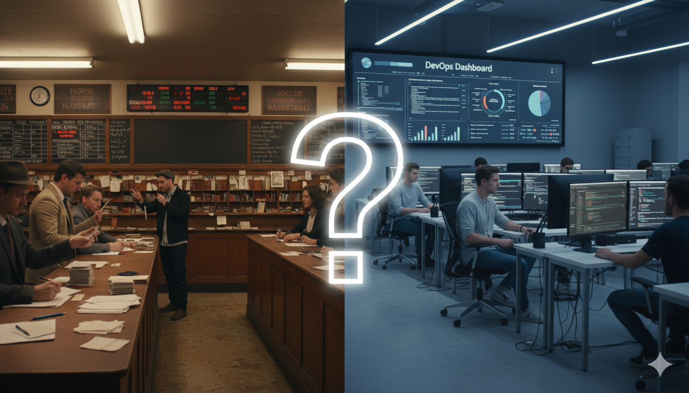

You might not know this about me, but I like to place a bet every now and then. I'm not into casinos or anything like that, but sports betting? That's my thing. I have this ritual where I place at least one bet at the beginning of each year. If I win, I collect the money at the end of the year and use some of it to place next year's bet. Everyone has a vice, right? This is mine.

This year's bet was pretty straightforward. Will my soccer team stay in the first league? I didn't bet on them winning the championship or anything ambitious like that. Just that they wouldn't suck enough to get kicked out of the top league.

The league has several teams competing. There's The Foundation, The Makers, The Paranoids, The Culture Club... or do we call them "The People" now? Then there's The Spinners, The Hustlers, and a few others. The Foundation is my team. That's the one I'm betting on.

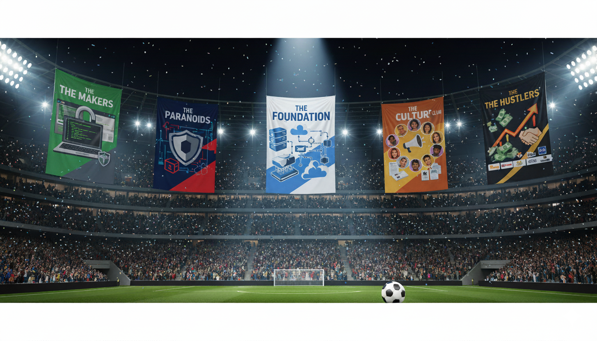

My team has a lot going for it. It's a relatively small team. For every person on The Foundation, there are anywhere between 5 and 30 players on The Makers roster. We don't go for quantity. We focus on getting the most skilled players.

Money? We've got plenty of it. Other teams need to beg for scraps. They can't expense anything. The Foundation? We have enormous budgets. Want world-class training facilities? Done. Need aerodynamic sneakers? No problem. Subscription to massage services? Absolutely. Anything goes.

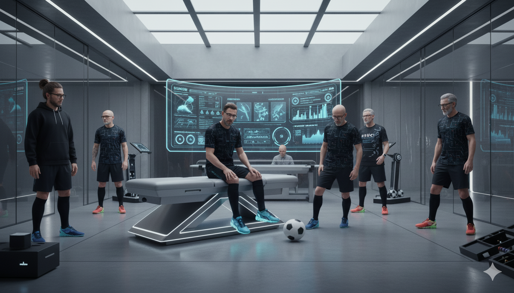

Sure, The Foundation players tend to be older than other teams, but that's a good thing. You don't want kids playing in your team. You want experienced players who've been around the block.

And here's the kicker. The Foundation knows the rules of the game inside and out. Hell, we come up with new rules all the time. We're the ones who decided that all other teams need our approval before using certain training equipment. They can't just go out and buy it. They need our blessing to even use it.

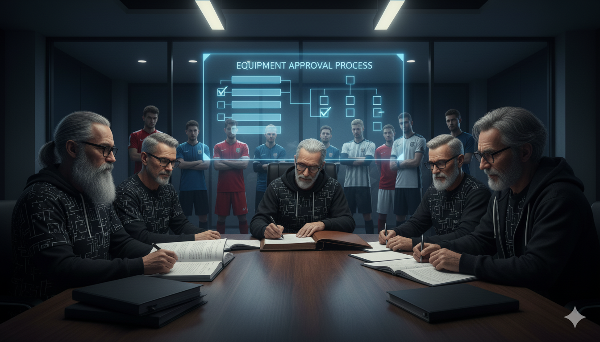

All in all, The Foundation was at the top. Or, to be more precise, it was at the top until this year. We're the team that wins most championships. The only exception? The Hustlers. They get even more funding than we do. They control the cash flow, but they blow most of it on lavish parties and gambling.

So this year, I made what I thought was a safe bet. The Foundation will stay in the top league. Not win it, just not get kicked out. But I was wrong. Terribly wrong.

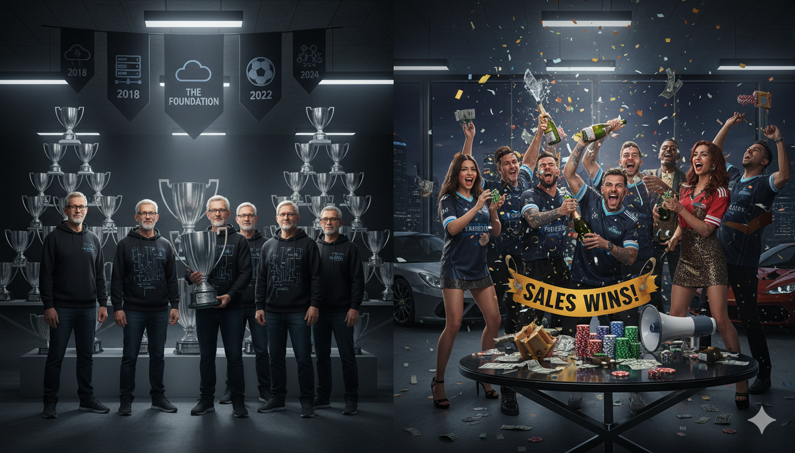

The rules changed, like they do every year. But this time, it wasn't The Foundation that changed them. The new rules came out of nowhere. From now on, robots can play soccer too.

All the teams jumped on it. Everyone had to play this year's league with the new rules.

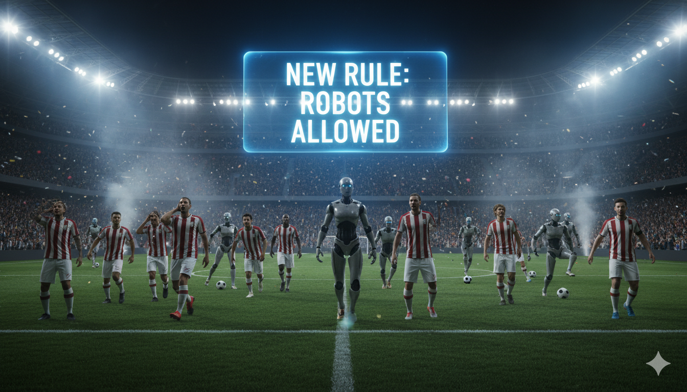

So what happened? Did I win the bet? Nope. We dropped out of the league. Got kicked out completely. We're not in the premier league anymore. The question is... why?

I had full confidence this was a safe bet. When the rules change, teams that adapt fastest tend to win. I still believe that logic is sound. But I was wrong about one thing. I assumed the teams that adapted fastest in the past would be the teams that adapt fastest in the future.

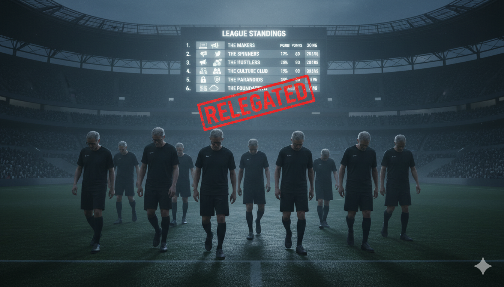

Most players on The Makers now have robots they control on the field. These robots move faster, score more goals, can jump way higher. They're rarely autonomous, but with the right control, they play incredibly well.

Other teams followed suit. The Spinners brought in robots that could cover the entire field at once, amplifying every play they made. The Hustlers deployed robots that never missed an opportunity to close, always in position to score when it mattered. The Culture Club used robots to coordinate movements across the entire team, connecting every player seamlessly. Even The Paranoids got on board, using robots to lock down the defense tighter than ever before.

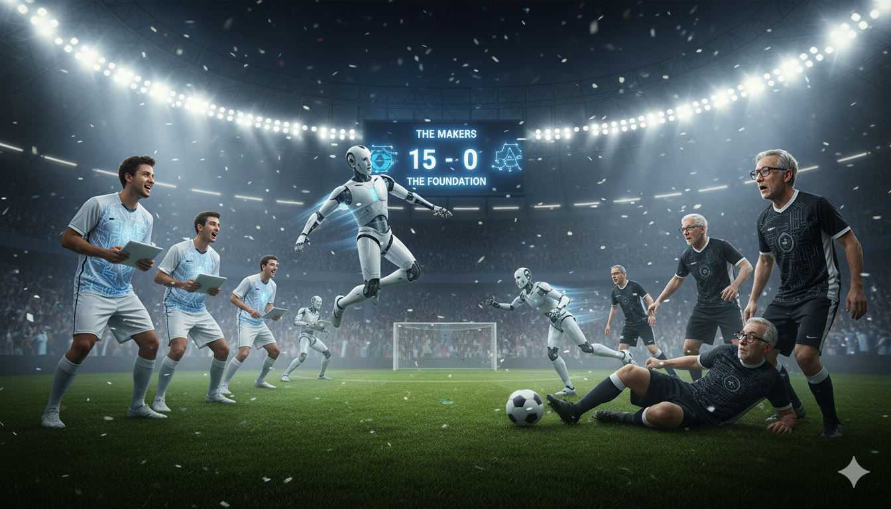

Us? We had a few setbacks. To begin with, most of the players on The Foundation chose not to play the game at all. "Robots are not good enough," they said. "Robots are just hype that will pass away, and everything will go back to the old rules soon." "Robots are not reliable." "Robots don't follow the game plan."

Other teams came to matches with full rosters. The Foundation? We'd have one or two players show up, if any. To make it worse, everyone else from our team was sitting on the benches yelling at those few who did choose to play. "We don't believe in soccer with those new rules!" "You're a traitor for even playing!" Not only was our team incomplete, but the few who did play were severely demoralized by their own teammates.

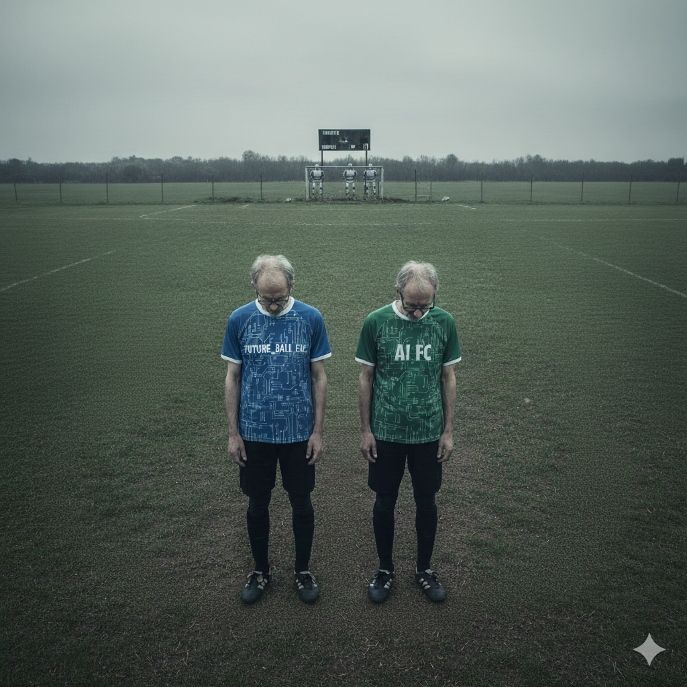

The Foundation had always played the game deterministically. We had a game plan, and everyone was supposed to stick to it. Pass the ball to player 7 who will be exactly 3 meters southeast from you. Player 7 dribbles for exactly 6 seconds, then kicks the ball at a specific speed in a specific direction. Player 4 catches it on their chest. And so on and so forth. Robots don't fit into that deterministic plan. Or, to be more precise, everyone else started playing with different dynamics, and our rigid plans fell apart.

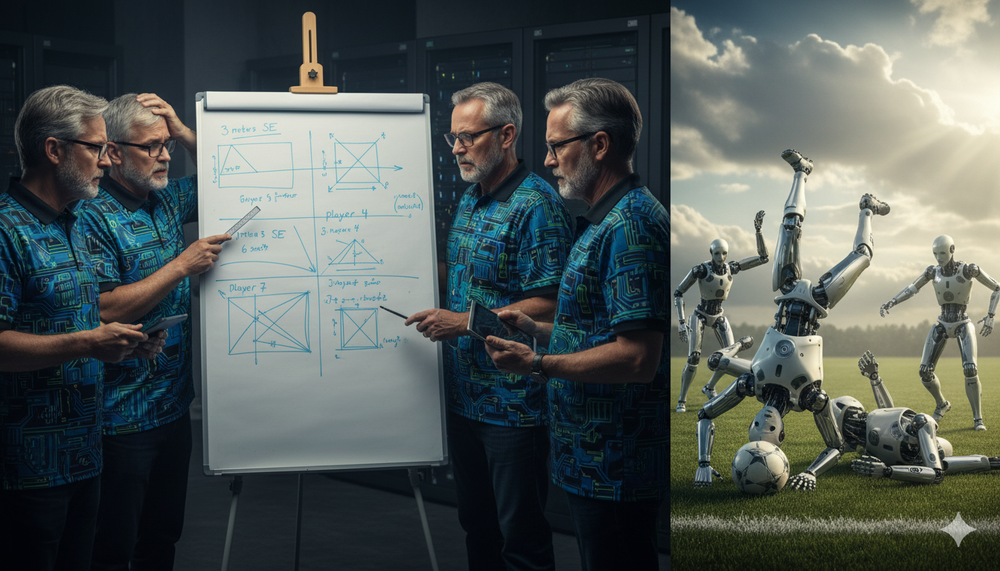

Here's the disappointing part, besides getting kicked out of the league. The Foundation was known for adapting to new rules faster than any other team. When the rules changed requiring everyone to wear speedos for better aerodynamics, we were the first ones on the field wearing them. When they mandated cowboy boots for better grip on the grass, we went all in. We even added cowboy hats to show how committed we were. When the soccer field was converted into a maze that almost no one could navigate, we were the first to enter. It was risky. Hell, there are still a few players stuck in there. But most of us learned how to navigate it. Sure, some of us were always against those new rules, but the majority of us accepted and embraced them.

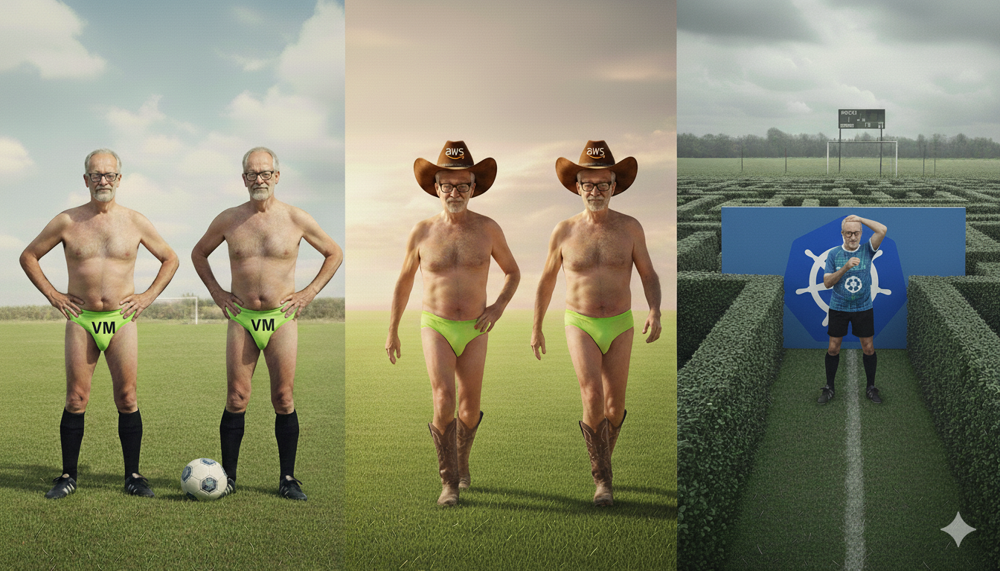

This time? Others embraced and learned the new rules. And here we are, still stuck with our old equipment, trying to play against robots.

I can't win every bet. I've won some years and lost others. This year is a loss. Now I need to decide. Do I place the same bet next year? Do I change the bet? Or do I change the team I cheer for?

This was truish story, except that the actual names of those involved were changed to protect their privacy, speedos were not accepted as official soccer uniform, robots were not (yet) invited to play, and a few other details. More importantly, I made changes so that when you get offended because you identified yourself, I can say: "What do you mean? You don't play imaginary soccer in the imaginary team, with robots that do not exist."

So what's the lesson here? Being the first to adopt VMs, hyperscalers, containers, Kubernetes, and other tech doesn't guarantee you'll be the first with AI. **Being adaptable in the past doesn't mean you'll adapt in the future.** The teams that historically resisted change are now running full speed with AI, while the teams that always led the charge are sitting on the sidelines calling it hype.

The irony is brutal. The Foundation had every advantage. More money, more experience, more influence over the rules. But when robots entered the game, **most of the team refused to play.** They sat on the bench yelling at the few who tried. Meanwhile, every other team showed up with full rosters and embraced the change.

And here's the thing. AI isn't perfect. It's not where it needs to be. We're very early in this journey. It is sometimes clumsy. It makes mistakes. It doesn't always follow the plan. But that's exactly why now is the time to jump on this train. On the other hand, you likely don't know how to use it. You might not have spent months figuring it out like you did with other tools.

The good news is that it's still at the station. You can still learn, experiment, and figure it out while everyone else is doing the same. Wait until AI is polished and mature, and you'll be trying to catch a train that's already miles down the track.

History doesn't repeat itself, but it sure as hell rhymes. The question isn't whether AI is going to change how we work. That ship has sailed. The question is whether you're going to be **on the field playing, or on the bench yelling** at those who are.

Now, here's a question for you. Can you guess what each of these teams represents? We had The Foundation, The Makers, The Paranoids, The Culture Club, The Spinners, and The Hustlers. I'm sure you're familiar with all those. They all represent teams in your company. Drop your guesses in the comments. Let's see if you can figure out the allegory.

