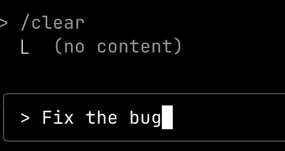
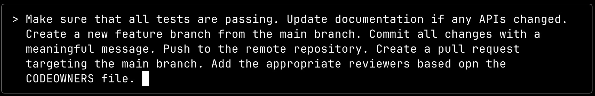

+++
title = 'Stop Wasting Time: Turn AI Prompts Into Production Code'
date = 2025-08-25T16:00:00+00:00
draft = false
+++

I spent three hours writing the perfect prompt. Three. Damn. Hours. And you know what? The AI still screwed it up. Not because the AI was bad, but because I was doing it completely wrong. I was treating prompts like throwaway commands when I should have been treating them like **production code**.

Here's what nobody tells you about AI prompts: they're not just instructions. They're **your team's collective knowledge**, encoded in a way that AI can execute. And if you're not treating them as first-class citizens in your codebase, you're wasting everyone's time. Today, I'm going to show you how to turn your prompts into a shared asset that evolves with your team, deploys like any other code, and actually makes AI useful instead of frustrating.

We'll start by understanding why context is everything in AI, then I'll show you the evolution of a real prompt from 5 words to 500, and finally reveal how MCP changes the entire game for prompt distribution. Let's dive in.

<!--more-->



## AI Context Management Explained

Here's something that should be obvious by now: AI is pretty damn useless without proper context. I asked AI to `fix the bug` once. Just those three words. And when it failed miserably, by not knowing what to do, I actually caught myself thinking...

"Bad AI! It should be clairvoyant!"

Like it could read my mind and know which bug, in which file, affecting which feature. You can have the most advanced model in the world, but if you don't feed it the right information, it's about as helpful as a chocolate teapot. The magic happens when you provide AI with the context it needs to understand what the hell you're trying to accomplish.

So what exactly is context? It's basically everything the AI knows about your situation. There's the system prompt that's baked into the agent, telling it how to behave. There's what you type, giving it specific instructions. There's what agents collect from your codebase, your documentation, your environment. It's all of these pieces combined that create the full picture the model needs to either provide the information you're looking for or figure out what additional information it needs to gather from you or its tools.

But here's the kicker: what we type is potentially the most important part of all that context. That's where we tell agents what we actually want them to do. And if we're not precise and detailed with our instructions, the results are suboptimal at best.

"You might as well be sailing without a compass and hoping you find treasure."

Let me give you a bad example: `Push code changes`. That's it. That's the entire instruction. With that information alone, even a human developer wouldn't know what the hell to do. Do we push directly to the main branch? Do we create a pull request? Does anyone need to review it? Are there automated tests we should wait for? Which branch are we even pushing from? The AI will probably do something in this situation, sure. It'll make its best guess based on common practices. But there's a damn good chance that what it does won't be what your organization actually needs. It'll push code somewhere, somehow, but it won't necessarily be the right way for your specific workflow.

Now here's what a good example looks like: dozens, hundreds, sometimes even thousands of words with detailed instructions. Things like `make sure that all tests are passing`, `update documentation if any APIs changed`, `create a new feature branch from the main branch`, `commit all changes with a meaningful message`, `push to the remote repository`, `create a pull request targeting the main branch`, `add the appropriate reviewers based on the CODEOWNERS file`, and so much more. Every single step that matters needs to be spelled out.

Think of it this way: you need to dump everything that's in your head plus all the company documentation and procedures related to that specific task into your instructions. It's the combination of your expertise, your organization's practices, and the specific requirements of what you're trying to accomplish. All of it needs to be there.

And here's where it gets really challenging. We perform dozens, hundreds, maybe even thousands of different tasks in our daily work, often without even realizing we're doing them. Many of these have become muscle memory. We do them automatically, without conscious thought. But how the hell do we teach coding agents to do all these tasks? How do we ensure they're done correctly, at the right time, following the right procedures?

The answer is prompts. Yeah, I know, duh! Everyone knows that by now. Right?

But here's the thing: knowing that prompts are the answer is just the beginning. The real challenge is understanding what makes a good prompt and how to develop them systematically. Just like we don't write perfect code on the first try, we shouldn't expect to write perfect prompts without iteration and refinement.

## Prompt Engineering Best Practices

You know how some people say "Developing a microservice is easy. It does only one thing. How hard can it be?"

Yeah, that's bullshit and we all know it. Even when a microservice has a small scope, we still spend a ton of time getting it right. We optimize the hell out of it, make sure every edge case is covered, verify it's performant, and obsess over every little detail. And just when you think you're done, new requirements come in, the needs change, you discover edge cases you never thought of. The work never really ends.

The same principle applies to prompts. They're essentially a way to program AI models, and we need to approach writing them with the same rigor we apply to writing code. You start small with the simplest possible instruction, test it, see what breaks, and then iterate. Add more detail, handle edge cases, refine the language, test again. And just like with microservices, the work is never truly done. New use cases emerge, models behave differently, your team's needs evolve. You'll be refining these prompts forever.

Let me explain what I mean.

Imagine you're creating a prompt for completing a feature implementation. Version one might be: `Create a pull request and merge it.` Simple, right? But the AI might just create a PR with whatever's currently staged and merge it immediately. No tests, no reviews, nothing.

Version two gets more specific: `Run tests, create a pull request, get it reviewed, then merge.` Better, but still full of holes. What if tests fail? What about documentation? What about the issue tracking?

After ten iterations, you might have: `Verify all requirements are implemented. Run all tests and ensure they pass. Update documentation. Create a feature branch, commit changes, push to remote. Create a pull request with a description, link to the issue, request reviews, wait for approval, then merge.`

But even that's not enough. By version twenty or thirty, you've discovered dozens of edge cases. What about checking for ongoing reviews before merging? What about deployment verification? What about notifying stakeholders? What about cleaning up branches afterward?

Eventually, you end up with a comprehensive workflow that covers pre-completion validation with checkboxes for every requirement, specific git commands for branch management, detailed PR creation steps using `gh pr create`, a review process that explicitly checks PR status before merging, deployment verification, issue closure procedures, and post-merge cleanup. Each section has multiple checkpoints, specific commands, and explicit warnings about what NOT to do. It's evolved from five words to a complete software delivery methodology.

The point is, it takes time and many iterations to get a prompt that does exactly what you want, no more, no less. You can't just bang out a perfect prompt on your first try any more than you can **write bug-free code without testing**.

Now here's the kicker: after spending all that time crafting the perfect prompt, do you really want to type it out again tomorrow? Or next week? Or explain it to your teammate so they can recreate it? Hell no. Nobody wants to spend their time writing the same prompts over and over again.

So what's the answer? Saved prompts. Yeah, I know, duh! Everyone knows that's the solution. Right?

Well, not so fast. Like everything in tech, saved prompts come with their own set of challenges. Let's dig into why even this "obvious" solution isn't as straightforward as it seems.

## Sharing AI Prompts Across Teams

Remember that comprehensive prompt we just talked about? The one that evolved from five words to a complete process? Well, here's the problem: nobody wants to type out that entire essay every single time they need to complete a feature. If it takes longer to write the prompt than to just do the work yourself, then AI isn't really helping, is it?

You might think, "Hey, I'll just create an initial context file that explains everything to the coding agent when the session starts." Something like `CLAUDE.md` that gets loaded automatically. Sounds clever, right? Wrong. It's mostly useless, and here's why.

It's been proven that models pay more attention to newer additions in their context window. As your conversation grows, that initial context becomes less and less relevant. The model starts ignoring it, focusing instead on the recent exchanges. Even worse, when you hit context limits, agents start compacting the conversation, and guess what disappears first? Your carefully crafted initial instructions.

So yeah, that initial context might be helpful for the first few minutes of your session. But as you keep working and the context grows, it becomes about as useful as a lighted candle. Eventually, it just vanishes entirely. Not exactly a reliable solution.

Enter saved prompts. These are the real game-changer. In fact, I'd argue that **saved prompts are the most important feature** of any coding agent. Without it, you're stuck either typing novels every time you need something done or watching your instructions get ignored as the context grows.

You probably already know how they work, but let me explain just in case. You write detailed descriptions of how something should be done and save them as markdown files. It's basically like writing shell scripts, except now the language is English instead of bash. When you need to execute a task, you just type `/` or whatever the trigger is for your coding agent, select from your list of prompts, and boom. Your carefully crafted, battle-tested instructions get injected right into the current context where they'll actually be noticed and followed.

Sounds perfect, right? Well, hold on. We're not done yet.

Now we hit the distribution problem. How do we share these prompts across different projects? The obvious answer might be to copy them from one project to another and keep them in each project's Git repo. But that's a maintenance nightmare waiting to happen.

Remember how we said prompts evolve over time? They do. Constantly. You discover edge cases, improve the language, add new steps. Now imagine having to update the same prompt in twenty different repositories every time you make an improvement. That's not just silly, it's a complete waste of time.

So maybe we put them in some shared directory on your laptop where any project can access them? That would simplify maintenance, sure. But it only works for you. What about your colleagues? Are they supposed to maintain their own set of prompts? That defeats the whole purpose.

These prompts embody your team's collective knowledge and best practices. They should be shareable across the entire organization. Everyone should benefit from improvements anyone makes. But how the hell do we make that happen?

Well, it turns out there's a way to solve all these problems at once. And it involves thinking about prompts in a completely different way.

## MCP for Prompt Distribution

Here's where things get interesting. We can wrap our prompts into an MCP, the Model Context Protocol. And before you think this is some hack or workaround, let me stop you right there. Serving prompts is actually part of the official MCP specification. It's a first-class feature, not an afterthought.

And the best part? It's ridiculously easy to implement. You can write an MCP that serves prompts from a specific directory in, what, a hundred lines of code? Maybe less. Hell, you don't even have to write it yourself. **You can build it with AI in one hour**. It's so trivial that searching for a ready-made solution would probably take longer than just building it. By the time you've scrolled through GitHub looking for the perfect prompt server, you could have already asked AI to help you generate one and had it running.

Once you've got your MCP prompt server, distribution becomes a solved problem. It works just like any other MCP. Package it up, publish it to npm or wherever, and anyone in your organization can install it. No more copying files between projects, no more maintaining separate prompt collections. Everyone gets the same prompts, automatically.

But here's the crucial part: you need to treat this MCP as a real project, not some throwaway script. It deserves its own repository, proper documentation, versioning, the whole nine yards. Why? Because these prompts represent your team's collective knowledge. They need to evolve based on feedback from everyone using them. When someone discovers a better way to handle deployments, they should be able to submit a pull request. When a prompt doesn't work quite right, people need a place to report issues.

Speaking of which, I'm working on exactly this kind of project. It's called `dot-ai`, and you can find it at https://github.com/vfarcic/dot-ai. It's a DevOps AI toolkit that does a bunch of things like Kubernetes deployment intelligence and documentation testing, but one of its key features is serving shared prompts through MCP. If you look in the `shared-prompts` directory, you'll find the prompts we've been collecting. There's not much there yet, we're just getting started. But that's where you come in. Got a killer prompt that's saved your bacon? Create a pull request. Found a way to improve an existing prompt? PR that too. This is how we build something useful for everyone.

## Prompt Management Key Takeaways

Let me bring this full circle. Remember when I said I spent three hours writing a prompt and the AI still screwed it up? That's because I was thinking about prompts all wrong. They're not one-off instructions. They're not something you type and forget. They're living documentation of how your team works.

Here's what you need to remember: First, **AI without context is useless**, and your prompts ARE that context. Second, **prompts evolve just like code**, so treat them with the same respect. Third, **sharing prompts through copy-paste is a maintenance nightmare** that MCP completely solves. Fourth, you can **build an MCP prompt server in under an hour** with AI's help. And finally, your **team's collective knowledge belongs in version control**, not scattered across individual machines.

The future of AI development isn't about smarter models. It's about smarter prompt management. And now you know exactly how to build that future for your team.

