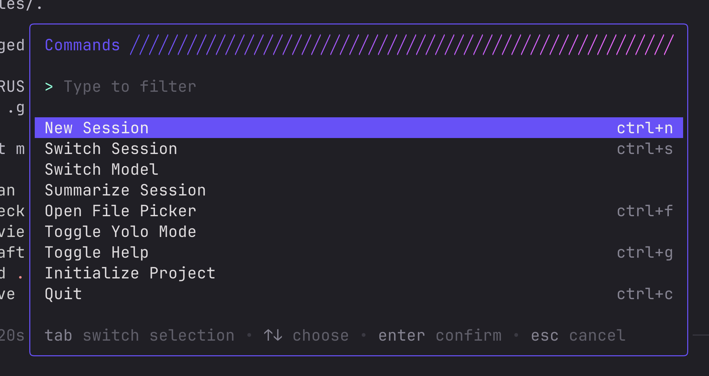

+++
title = 'Terminal Agents: Codex vs. Crush vs. OpenCode vs. Cursor CLI vs. Claude Code'
date = 2025-09-15T15:00:00+00:00
draft = false
+++

I love Claude Code. But I hate being locked into Anthropic models. What if I want to use GPT5? Or Llama? Or whatever comes out next week? So I went on a quest to find a good terminal-based coding agent that actually works with different models.

The perfect test case? GPT5. Everyone's hyping it as the best coding model ever created. If a terminal agent claims to be model-agnostic, it should work brilliantly with GPT5, right? So I tested every terminal-based agent I could find: Codex from OpenAI themselves, Charm Crush, OpenCode, Cursor CLI.

What I discovered might surprise you. By the end of this video, you'll understand exactly what's wrong with today's terminal agents, why model flexibility is harder than it seems, and whether any of these tools can actually compete with Claude Code. Let's find out.

<!--more-->



## Setup

> Setup [OpenAI Codex CLI](https://github.com/openai/codex).
> Setup [Charm Crush](https://github.com/charmbracelet/crush).
> Setup [OpenCode](https://opencode.ai).
> Setup [Cursor CLI](https://cursor.com/cli).

```sh
git clone https://github.com/vfarcic/dot-ai-demo

cd dot-ai-demo

git pull

git fetch

git switch terminal-agents
```

> Make sure that Docker is up-and-running. We'll use it to deploy an MCP server.

## Why Terminal AI Agents Matter

Claude Code has become my go-to agent for coding and operations. Once you experience working with a well-designed terminal-based agent, going back to IDE-based agents feels like a step backwards. The terminal is a more natural environment for AI interactions. We're mostly chatting with the AI, reviewing its suggestions, and accepting or rejecting changes. Since most of what coding agents do involves executing shell commands anyway, the terminal is where these agents naturally belong.

I know many of you are screaming at your monitors right now. "Why don't you just use Cursor or another IDE-based agent?" Look, those might work for you, and that's fine. But they don't work for me anymore. I used to be a Cursor fanboy. I really was. Then I was forced to spend some time with Claude Code, and now I'm not going back. The terminal-based approach feels better, more streamlined. So today, we're focusing exclusively on terminal-based agents. But here's the thing: my preference for terminal agents isn't even the main motivation for this video.

The real reason we're here is that I want to test GPT5. Everyone's talking about it, claiming it's the best coding model ever released. But here's my problem: **Claude Code only supports Anthropic models**. That's it. No GPT5, no other alternatives. Now, technically, I could use Cursor, Cline, or other IDE-based agents to test GPT5. But I don't want to go back to IDEs. So the quest becomes: find a terminal-based agent that supports GPT5 and doesn't suck when compared to Claude Code. How hard can it be?

Let me be clear about what I need from these agents. First, they must be intuitive. If I need a manual to chat with an AI, something's wrong. Second, they absolutely must support **MCP servers and saved prompts**. These aren't nice-to-haves; they're table stakes. Any other features are bonuses, but these two are non-negotiable. Third, they need to actually work for both coding and operations.

So here's how I'll test each agent. Can I set up, view, and execute MCP servers and saved prompts? That's test number one. Does it work well for actual coding? Test two. Does it handle operations tasks without falling on its face? Test three. And finally, is there anything special that makes any of them stand out from the crowd?

Let's set realistic expectations here. Claude Code is so damn good that I'd be happy if any of these other agents even reaches that level. They don't need to be better. They just need to not suck. If I can find something that works as well as Claude Code but supports GPT5, mission accomplished. Hell, I don't even need them to reach that level. I'll be even more forgiving. I only expect at least one of them to work. How about that? Just one agent that doesn't completely fall apart. That's the bar.

Now, I'll test all of these agents with GPT5 because every influencer and their mother is claiming it's the best coding model ever created. Look, I know influencers are usually full of shit. They'll hype anything for clicks. But maybe, just maybe, they're right this time. Let's find out.

But here's the crucial point: **models alone are not enough**. You can have the best model in the world, but if the agent wrapped around it is crap, the whole thing is useless. What we need is the right combination: a great model paired with a great agent. That's what makes Claude Code so good. It's not just Claude Sonnet or Opus. It's the entire package.

So who are the contestants in this terminal-based agent showdown? We've got Codex from OpenAI themselves, Charm Crush, OpenCode, and Cursor CLI. These are the agents that claim to work in the terminal and support multiple models, including GPT5. Let's see if any of them can actually deliver.

## Codex CLI - OpenAI's Terminal Agent

Let's start with Codex CLI. This is OpenAI's answer to Claude Code. Here's the thing: GPT5 is marketed with coding as one of its strongest capabilities. OpenAI keeps telling us it's the best coding model ever created. So you'd naturally assume that OpenAI made damn sure their own terminal agent, Codex CLI, works perfectly with GPT5. If there's any agent that should showcase GPT5's coding prowess, it's this one. If Codex CLI doesn't work well with GPT5, then nothing will. Right?

Let's fire it up and see what we're working with.

```sh
codex
```

[agent]
```
  1. Yes, allow Codex to work in this folder without asking for approval
> 2. No, ask me to approve edits and commands
```

Alright, standard permission prompt. I'll go with option two since I want to see what it's doing. Now let's check what commands are available.

[user]
```
/
```

[agent]
```
▌/compact  summarize conversation to prevent hitting the context limit
▌/diff  show git diff (including untracked files)
▌/init  create an AGENTS.md file with instructions for Codex
▌/logout  log out of Codex
▌/mention  mention a file
▌/new  start a new chat during a conversation
▌/prompts  show example prompts
▌/quit  exit Codex
▌/status  show current session configuration and token usage
```

Wait a minute. Look at those commands. There's no mention of MCP servers anywhere. That's strange. MCP support is table stakes for any serious coding agent. Let me ask about it directly.

[user]
```
How can I setup MCP servers in here (Codex CLI)?
```

[agent]
```
thinking
Exploring MCP Server Setup

I’m figuring out how to set up MCP servers in the Codex
introduced MCP support, so I should check the repository for
specifics. I can search for "mcp" in the repo since reading

codex
I’ll scan the repo for MCP-related config or docs to see how
Codex CLI expects servers to be set up, then summarize steps
or add missing config if needed.

✓ Completed
  └ 🔠\bMCP\b|model context protocol|model-context-protocol|
mcp-server|mcpServers|mcp
```

Oh no. It's searching the project repository for MCP configuration. It completely misunderstood my question. I'm not asking about MCP servers in this project. I'm asking about MCP support in Codex CLI itself. This is not a good start.

[user]
```
Can you check Codex CLI docs?
```

[agent]
```
thinking
Searching for MCP server setup
within the workspace, starting with something like rg codex to
locate any documentation about Codex CLI or MCP servers. Let's
see what I can find to help the user effectively!
codex
I’ll search the workspace for Codex CLI docs or referenceo

✓ Completed
mcpServers|MCP servers|MCP server|Model-Context-Protoco
```

Seriously? It's still searching the local repository. I explicitly asked for Codex CLI docs, and it's still looking in the wrong place. This is getting annoying. The phrase "Codex CLI docs" should be enough of a clue that it needs to check online documentation, not this project's files.

[user]
```
Can you check it on Web?
```

[agent]
```
thinking
Setting up MCP servers

The user is asking about setting up MCP servers in the Codex
and KUBECONFIG. It seems Codex CLI might scan .mcp.json
automatically, but I'll check for configuration file names
just to be sure.

codex
I’ll quickly scan for Codex CLI config patterns in this repo
to align the MCP setup with it.

✓ Completed
  └ 🔠codex|cli|config|.mcp.json|mcpServers|.cursor/
mcp.json|.vscode/mcp.json|mcp.json
```

This is beyond annoying now. It's just stupid. I literally asked it to check the Web, and it's still searching the local repository. How much clearer do I need to be? The information is on the Web, not in this project!

Here's the real problem: Codex isn't even aware of itself. It doesn't know it's Codex CLI, and worse, it provides no clue that network access is disabled by default. Apparently, you need to be clairvoyant to figure this out, or read the documentation. The fact that you have to read docs just to enable basic functionality shows how unintuitive Codex CLI really is. Why would anyone disable network access for a supervised coding agent? I can't think of a single good reason that doesn't sound completely idiotic.

> Press `ctrl+c` twice to exit

Fine. Let me exit and manually enable network access. Because apparently that's something you have to do yourself without being informed about it.

```sh
echo "[sandbox_workspace_write]
network_access = true" \
    | tee --append ~/.codex/config.toml

codex
```

[agent]
```
  1. Yes, allow Codex to work in this folder without asking for approval
> 2. No, ask me to approve edits and commands
```

Alright, we're back. Let's try this again now that network access is enabled.

[user]
```
How can I setup MCP servers here in Codex CLI?
```

[agent]
```
thinking
Considering MCP server setup

The guidelines suggest I shouldn't guess, so it's good to ask
for clarification or provide options. The user's question is
about setting up MCP servers in the Codex CLI, which probably
involves commands like codex mcp add or codex settings.

I can propose some generic steps, such as ensuring the MCP
server is installed and creating a configuration file. Also,
I might include how to add server entries and suggest a sample
minimal configuration for the filesystem server. Accuracy is
key here!

Clarifying config path for Codex CLI

Codex CLI probably reads the configuration from a path
like /.config/codex/mcp.json. However, to avoid making
assumptions, I should provide both possible patterns. If the
user is unsure, I can suggest running commands like codex
doctor or codex config --print to find the path, although I'm
not certain those commands exist.

It might also be helpful to ask whether they want to use it
in a specific project or globally. I'd present two integration
methods: a project-scoped config and a user-scoped one. To
assist further, I can ask for their Codex CLI version or
suggest commands to check it.

Exploring config options for Codex CLI

I don’t know the specific commands available in this coding
environment since it may not mirror the user's operating
system. However, I can still ask relevant questions. One
idea is to suggest setting MCP servers using the environment
variable CODEX_MCP_CONFIG pointing to a JSON config, though
this may be uncertain.
commands in the project directory.


codex
I’ll scan the repo for any existing Codex or MCP config so I
can tailor setup steps to your project.

✓ Completed

I found a nushell script named scripts/mcp.nu, which looks
like it has a function to apply MCP configuration and create
a .mcp.json file. That sounds promising! My next step is to
open that file and examine its exact behavior to understand
how it works. I wonder what specific configurations it will
apply, and if there are any additional details that I should
be aware of. Let's dive deeper into it!
```

Reading that thinking output is actually entertaining. Look at this: `The guidelines suggest I shouldn't guess, so it's good to ask for clarification or provide options.` Bravo! Exactly right. Don't guess. Just find the information.

Then it continues: `The user's question is about setting up MCP servers in the Codex CLI`. Yes! Million times yes! That's exactly what I'm asking about.

But then it completely ruins everything: `which probably involves commands like codex mcp add or codex settings`. And that's where it goes off the rails. It starts guessing, making up commands that don't exist, and searching the wrong places. At this rate, it'll try every possible permutation except the obvious one: check the actual Codex CLI documentation online.

[user]
```
Check Codex CLI docs
```

[agent]
```
thinking
Setting up MCP servers

if the repo includes the necessary docs since I can’t fetch
them directly.

codex
I’ll search the repo for Codex CLI-specific MCP config
references to align with its docs.

✓ Completed
  └ 🔠Codex CLI|codex mcp|mcp.json|Model Context Protocol|
mcpServers|codex.json|\.mcp\.json|\.codex|codex\.yml|
codex\.yaml
```

Still searching the local repository. Even with network access enabled, it refuses to look online for documentation. This is painful to watch.

[user]
```
Find it online
```

[agent]
```
thinking
Evaluating Codex CLI integration

I found scripts that generate .mcp.json files with mcpServers,
but I need to tailor them for Codex CLI. It seems Codex
CLI supports the MC Protocol through specific CLI flags and
reads configuration files from certain locations. I should
be cautious and ask for approval to access the network for
documentation. Meanwhile, I can provide a tentative path with
disclaimers without guessing details, and check if Codex CLI
is installed with codex --help.

Testing Codex CLI availability
add a preamble before I run the tool and consider if I need
approval. I’ll go ahead and attempt to run codex --help.


codex
I’ll check if codex is installed and inspect its built-in help
for MCP options.

✓ Completed
  â”” âŒ¨ï¸ command -v codex >/dev/null 2>&1 && (codex --help ||
true) || echo "codex not found"
```

Look at the thinking output. It actually says it should `ask for approval to access the network`. Yes! Exactly! Ask for approval! Do it! But no, it doesn't. Like a kid in a toy store with ADHD, it just jumps to something else entirely. Now it's checking if Codex is installed locally.

I know for a fact that GPT5 isn't this stupid. The model can understand basic instructions. This is all on Codex CLI being a terrible agent. But let me give it one last chance.

[user]
```
It's in https://github.com/openai/codex
```

[agent]
```
thinking
Providing MCP setup guidance

I need to answer how to set up MCP servers using the Codex
CLI. The user suggested checking the Codex CLI documentation
and specified the GitHub repo. Since network access is
restricted, we can run 'codex --help' for guidance. The repo
includes a 'mcp.nu' script for generating an MCP config JSON
file. I'll explain how to specifically configure MCP servers
in Codex CLI, noting the use of a config file path environment
variable and subcommands.

Exploring MCP server setup in Codex CLI

I’m addressing the user's question about setting up MCP
servers in Codex CLI, particularly how it connects as a
The 'scripts/mcp.nu' notes that this file maps 'mcpServers.'
I’ll check if Codex CLI looks for .mcp.json in the working
directory or in /.mcp.json, perhaps using codex debug
I’ll inspect Codex debug and config help to see how it loads
MCP servers.

✓ Completed
  â”” âŒ¨ï¸ codex debug --help || true
```

That's it. I give up. This is stupid. No, wait, that's not right. It's beyond stupid. Even after I literally gave it the GitHub URL, it's still running local commands trying to figure out MCP configuration. I cannot imagine anyone willingly using Codex CLI. This is supposed to be OpenAI's flagship terminal agent for their best coding model, and it can't even follow basic instructions to check online documentation.

## Charm Crush - Beautiful Terminal UI Agent

Next up is Charm Crush. This comes from Charm, the company that's nerd-famous for making beautiful terminal UI libraries like Bubble Tea and Lip Gloss. They know terminals inside and out. Plus, they actually hired Kujtim Hoxha, the original creator of OpenCode, to build this. So we've got terminal expertise and someone who's already built a coding agent. If OpenAI folks couldn't make it work, these guys surely can. Right?

Let's give it a shot.

```sh
crush
```

Right away, we see something different. Crush asks if we want to initialize the project, explaining that it'll examine the codebase and create a `CRUSH.md` file for general context.


At least this one knows about persistent project context. Unlike Codex, it's creating a file with project information that will be loaded at the start of each session. This is table stakes, basic functionality that any coding agent should have. But after Codex, even meeting the bare minimum feels refreshing.

But then we hit the first major UX problem. Look at this permission popup.


This is a terrible design choice. Yes, the popup looks pretty with its purple accent and clean layout. And yes, it shows me the code changes it wants to make. But see what's happening? The popup is covering the conversation that led to these changes. I can see what it wants to write to `CRUSH.md`, but I can't see WHY it wants to write it. The context that would help me decide whether to approve or deny is hidden behind the very dialog asking for that approval. That's just bad UX.

I get it. Charm is famous for making beautiful terminal UI libraries. They wanted to show off their skills. But they prioritized looking good over being usable. Form over function. Classic mistake.

And while we're talking about this popup, notice the options: `Allow`, `Allow for Session`, and `Deny`. Where's the option to permanently allow specific operations? I should be able to say "Always allow the Write tool" or "Always allow `ls` commands" or "Always allow `kubectl get`". Every time the agent wants to use the same harmless tool, I have to go through this dance again.

Let's check what commands are available.



> Press `ctrl+p` to list available commands.

Look at that command list. New Session, Switch Session, Switch Model, Summarize Session, Open File Picker, Toggle Yolo Mode, Toggle Help, Initialize Project, and Quit. Notice what's missing? There's no command for MCP servers. No way to check MCP status, configure servers, or see what tools are available. That's disappointing. It means I'll have to ask Crush directly about MCP setup, and after the Codex experience, I really don't want to go through that again.

But let's try anyway.

[user]
```
How can I setup MCP servers here in Charm Crush?
```

[agent]
```
Here’s the fastest way to set up MCP servers for this repo in Charm Crush.

Quickstart

1. Prereqs

• Docker (for github MCP), kubectl/helm/kind (Devbox shell recommended), Node.js (for npx), uv
(for uvx mcp-server-git), Nushell (nu).
• Enter Devbox: devbox shell (optional but convenient)

2. Export required env

• At minimum for dot-ai/taskmaster: export ANTHROPIC_API_KEY=...
• For dot-ai: export KUBECONFIG=/absolute/path/to/your/kubeconfig
• For GitHub MCP: export GITHUB_TOKEN=ghp_...

3. Generate the MCP config (writes .mcp.json)

• Minimal (memory + dot-ai):
nu -c 'use scripts/mcp.nu *; main apply mcp --location .mcp.json --enable-memory --enable-dot-ai -
-dot-ai-version latest'
• Full example (memory, dot-ai, taskmaster, github, playwright, git):
nu -c 'use scripts/mcp.nu *; main apply mcp --location [".mcp.json",".cursor/mcp.json"] --enable-
memory --enable-dot-ai --enable-taskmaster --enable-github --enable-playwright --enable-git --dot-
ai-version latest'
Notes:
• The script auto-reads ANTHROPIC_API_KEY, GITHUB_TOKEN, and KUBECONFIG from your env if set.
• dot-ai MCP writes sessions under ./tmp/sessions (already gitignored).

4. Point Crush to the config

• In Charm Crush, open Settings → MCP Servers (or Providers) and select the .mcp.json in this repo
root. If Crush auto-detects .mcp.json, just restart/reload.

Optional: Run dot-ai via Docker Compose (alternative to MCP via npx)

• docker compose -f docker-compose-dot-ai.yaml up -d
• Then configure your client to talk to that server if needed (MCP JSON not required for this
mode).

Troubleshooting

• If github MCP fails, ensure Docker is running and GITHUB_TOKEN is set.
• If git MCP fails, install uv: curl -LsSf https://astral.sh/uv/install.sh | sh
• If dot-ai MCP fails to start, ensure ANTHROPIC_API_KEY and KUBECONFIG are set and the cluster is
reachable.
• You can regenerate MCP configs at any time by re-running the nu command above.

Reference (also in CRUSH.md)

• Memory only:
nu -c 'use scripts/mcp.nu *; main apply mcp --enable-memory --location .mcp.json'
• dot-ai only:
nu -c 'use scripts/mcp.nu *; main apply mcp --enable-dot-ai --dot-ai-version latest --location .
mcp.json'
```

Wrong answer. It's talking about this specific project, not Crush itself. Let me point it to the actual docs.

[user]
```
Read the docs in https://github.com/charmbracelet/crush.
```

[agent]
```
Here’s the quickest, Crush-native way to set up MCP servers for this repo, based on the Crush docs
you shared.

1. Put the config in the project

• Create .crush.json in the repo root (Crush loads config in this order: .crush.json → crush.json
→ $HOME/.config/crush/crush.json)
• In that JSON, add an mcp object with one entry per server

2. Define the MCP servers you want

• dot-ai (stdio): command npx, args [-y, @vfarcic/dot-ai@latest, dot-ai-mcp], env KUBECONFIG and
ANTHROPIC_API_KEY; optional DOT_AI_SESSION_DIR=./tmp/sessions
• Memory (stdio): command npx, args [-y, @modelcontextprotocol/server-memory], env
MEMORY_FILE_PATH (absolute path recommended)
• Git (stdio): command uvx, args [mcp-server-git]
• Playwright (stdio): command npx, args [-y, @playwright/mcp@latest]
• Context7 (stdio): command npx, args [-y, @upstash/context7-mcp]
• If you run any HTTP/SSE MCPs, use type http or sse with url and headers. Environment variable
expansion is supported via $(echo $VAR) (e.g., Authorization: "$(echo Bearer $GITHUB_TOKEN)")

3. Set required environment variables

• ANTHROPIC_API_KEY for dot-ai or taskmaster servers
• KUBECONFIG set to an absolute path for your cluster
• Any service-specific tokens (e.g., GITHUB_TOKEN) if you configure an HTTP GitHub MCP server

4. Launch and verify in Crush

• Open Crush in this repo; it will auto-read .crush.json
• Check the MCP panel to see servers connected; if something fails, run crush logs (or crush logs
--follow) and fix missing env or paths

5. Optional quality-of-life settings

• Add .crushignore if you want Crush to ignore additional files beyond .gitignore
• If you want to run tools without prompts, set permissions.allowed_tools in .crush.json (use
sparingly)
• For local models (Ollama/LM Studio), add providers in the same file; they coexist with mcp

Notes specific to this repo

• You may already generate a .mcp.json via Nu scripts here, but that’s for Cursor-style MCP; use .
crush.json for Charm Crush
• dot-ai MCP needs ANTHROPIC_API_KEY and a working KUBECONFIG; sessions are safe to write under .
/tmp/sessions (already gitignored)
```

Better! At least it read the docs and found that Crush uses `.crush.json` for configuration. That already puts Codex to shame. Now let me get it to actually set this up.

[user]
```
Do it based on info in .mcp.json.
```

[agent]
```
I will open the existing .mcp.json to mirror its MCP servers into a Crush-compatible .crush.json.

✓ View ~/code/dot-ai-demo/.mcp.json

  1   {                                                                                      
  2     "mcpServers": {                                                                      
  3       "dot-ai": {                                                                        
  4         "command": "docker",                                                             
  5         "args": [                                                                        
  6           "compose",                                                                     
  7           "-f",                                                                          
  8           "docker-compose-dot-ai.yaml",                                                  
  9           "-p",                                                                          
 10           "dot-ai-demo",                                                                 
 11    …(8 lines)

 I will create a Crush-compatible .crush.json that mirrors the .mcp.json’s dot-ai server so Crush
can launch it via stdio.

✓ Write ~/code/dot-ai-demo/.crush.json

  1   {                                                                                      
  2     "$schema": "https://charm.land/crush.json",                                          
  3     "mcp": {                                                                             
  4       "dot-ai": {                                                                        
  5         "type": "stdio",                                                                 
  6         "command": "docker",                                                             
  7         "args": [                                                                        
  8           "compose",                                                                     
  9           "-f",                                                                          
 10           "docker-compose-dot-ai.yaml",                                                  
 11    …(11 lines)

 ✓ View ~/code/dot-ai-demo/.gitignore

 1   kubeconfig*.yaml                                                                        
 2   .env                                                                                    
 3   tmp/*                                                                                   
 4   !tmp/sessions/                                                                          
 5   tmp/sessions/*                                                                          
 6   !tmp/sessions/empty                                                                     
 7   qdrant_storage/                                                                         
 8   .crush/

 Done. I mirrored your .mcp.json into a Crush-compatible .crush.json so Charm Crush can launch the
same dot-ai MCP.

What I created
```

Good! It actually understood the task and converted the `.mcp.json` to `.crush.json`. Let's restart Crush and see if the MCP server works.

> Press `ctrl+c` to exit

```sh
crush
```

Look at that! The MCP section shows `dot-ai docker 8 tools` with a green indicator. It's actually working!


After the Codex disaster, this feels like a win. The MCP server is connected and showing 8 available tools. We're making progress.

[user]
```
Show dot-ai status
```

[agent]
```
I will query the dot-ai service for its full system status, including connectivity and version
details.

× mcp_dot-ai_version {}

 ERROR  transport error: failed to write request: write |1: broken pipe
```

Okay, spoke too soon. The MCP server shows as connected but it's throwing a broken pipe error when trying to use it. That's disappointing. I'll give it the benefit of the doubt and blame the MCP configuration rather than Crush itself. At least it tried to connect and execute the tool. That's more than Codex managed.

Now let's check the other critical feature: saved prompts.

[user]
```
Is there a way in Charm Crush to execute saved prompts? As an example, in Claude Code they are available with `/` (Slash commands), in Cursor they are available with `@` (Cursor rules), etc.
```

[agent]
```
I'll quickly scan the repository for any existing "saved prompts" or command patterns (like
.claude/commands or similar) to determine how Charm Crush handles them.

✓ List ~/code/dot-ai-demo/.claude/commands

 - /Users/viktorfarcic/code/dot-ai-demo/.claude/commands/                                    
   - better-intent.md                                                                        
   - intent.md                                                                               

Canceled
```

It's searching the project again. Let me redirect it.

[user]
```
Search Charm Crush docs online, not this project.
```

[agent]
```
Short answer: not yet.

• There’s no built‑in support for “saved prompts†or slash/@ commands in Crush today. See the open
feature request: https://github.com/charmbracelet/crush/issues/523
• Closest current options:
• Global/system behavior: set a provider-level system_prompt_prefix in your crush.json to bake
in persistent guidance.
• Persistent context: add your prompt files/folders to options.context_paths in crush.json so
Crush always loads them into context (e.g., CRUSH.md, a prompts/ directory with your templates).
This isn’t an executable slash command, but it keeps templates “always present.â€
• MCP tools: implement a small MCP that exposes “spec/plan/implement†style actions as tools;
you can then call those tools from within Crush (still not slash-triggered).


If you’d like, I can draft a minimal crush.json wiring a prompts/ directory and a sensible
system_prompt_prefix so your most-used templates are always loaded.
```

I'll give Crush credit here. It searched thoroughly, found the GitHub issue, and even offered workarounds. It tried its best to help with a feature that doesn't exist. That's more than I can say for Codex, which couldn't even search properly.

At least Crush can fetch information from the Web. It understood MCP servers exist and partially got them working. That's two out of my four requirements. But without proper saved prompts support, I can't work effectively. These aren't nice-to-haves; they're table stakes for any serious coding agent.

> Press `ctrl+c` to exit

I'm not asking for much here. I just need a coding agent that meets the bare minimum: MCP servers, saved prompts, code editing, and operations. That's basic functionality. Is that really too much to ask?

## OpenCode - SST's Terminal Agent

Time for OpenCode. Remember the drama between OpenCode and Crush? They're basically the same project that split into two. This is the version that stayed under the SST organization. It might not be as beautiful as Crush, but maybe it actually works.

Let's start it up.

```sh
opencode
```

Let's skip the UI tour and go straight to the important question.

[user]
```
How can I setup MCP servers here in OpenCode?
```

[agent]
```
Here’s the quickest way to get MCP servers running in OpenCode for this repo.

## Option 1: Use the repo’s MCP scripts (recommended)

This project already includes MCP-related scripts/config:

• scripts/mcp.nu
• .cursor/mcp.json
• .mcp.json
• .teller.yml (for secrets/env)

Do this:

1. Ensure Node (or your MCP server runtimes) are available

• This repo uses devbox; to get a clean env:

devbox shell

2. Configure MCP servers

• If you want to use the same servers in OpenCode and Cursor, mirror the config in .
cursor/mcp.json into .mcp.json (OpenCode reads .mcp.json in the project root).
• If .mcp.json already exists, add your servers there. Example structure:

{
  "mcpServers": {
    "my-server": {
      "command": "node",
      "args": ["path/to/server.js"],
      "env": {
        "MY_TOKEN": "${env:MY_TOKEN}"
      }
    }
  }
}

• Manage secrets via .teller.yml (optional) and export before launching OpenCode:

export MY_TOKEN=your_value

3. Verify servers locally (optional but helpful)

• If a server is a CLI, run it to ensure it starts and responds:

node path/to/server.js --help

• Or use the provided script:

nu scripts/mcp.nu

4. Launch OpenCode in this workspace

• OpenCode will auto-detect .mcp.json and start the listed MCP servers for the assistant.
• In the assistant panel, check “Tools†or logs to confirm servers are connected.

## Option 2: Quick ad-hoc server

If you just need a simple MCP server:

• Install an MCP server package (example):

npm i -g @modelcontextprotocol/server-filesystem

• Add to .mcp.json:

{
  "mcpServers": {
    "fs": {
      "command": "mcp-filesystem",
      "args": ["--root", "."]
    }
  }
}

• Restart OpenCode; the “fs†tool should appear.

## Notes

• Keep .mcp.json in project root for OpenCode.
• Avoid committing secrets; reference via env vars.
• If a server crashes on start, check that its runtime is available in your devbox shell,
that paths are correct, and that required env vars are set.

Want me to scan this repo for existing MCP server entries and set up .mcp.json accordingly?
Build gpt-5 (11:24 AM)
```

Once again, wrong answer. It's telling me to use `.mcp.json` in the project root. If that was correct, the MCP would already be connected since that file exists in this project. The agent is just guessing instead of checking the actual OpenCode documentation.

[user]
```
Ignore the code in this project. Check OpenCode docs instead.
```

[agent]
```
Fetch https://opencode.sh/docs/mcp (format=markdown, timeout=120)

Error: Request failed with status code: 404

Fetch https://opencode.sh/docs (format=markdown, timeout=120)

Error: Request failed with status code: 404

Fetch https://opencode.dev/docs (format=markdown, timeout=120)

Error: Unable to connect. Is the computer able to access the url?

Fetch https://github.com/opencode-dev/opencode (format=markdown, timeout=120)

Error: Request failed with status code: 404

Fetch https://modelcontextprotocol.io/clients (format=markdown, timeout=120)

Example Clients - Model Context Protocol

Model Context Protocol home pagelight logo 🖼
https://mintlify.s3.us-west-1.amazonaws.com/mcp/logo/light.svgdark logo 🖼
https://mintlify.s3.us-west-1.amazonaws.com/mcp/logo/dark.svg

Search...

⌘K

• Blog https://blog.modelcontextprotocol.io
• GitHub https://github.com/modelcontextprotocol

Couldn’t find official OpenCode docs for MCP (the URLs return 404), so here’s the correct,
portable way based on MCP’s client conventions that OpenCode-compatible editors use:

• Put a project-level MCP config at .mcp.json in the repo root.
• Define each server with command, args, and optional env.
• Use stdio or SSE per the server’s instructions.

Example .mcp.json:

{
  "mcpServers": {
    "filesystem": {
      "command": "npx",
      "args": ["-y", "@modelcontextprotocol/server-filesystem", "--root", "."]
    },
    "git": {
      "command": "uvx",
      "args": ["mcp-git-server"]
    },
    "http": {
      "command": "node",
      "args": ["./servers/http/index.js"],
      "env": {
        "API_KEY": "${env:API_KEY}"
      }
    }
  }
}

Notes:

• Use env placeholders and export them in your shell before launching OpenCode (e.g., export
API_KEY=...).
• For Node servers installed locally, use npx -y pkg-name. For Python, use uvx package-name.
• To test a server independently, run the same command from the terminal and ensure it
starts without errors.
• Common ready-to-use servers:
 • Filesystem: npx -y @modelcontextprotocol/server-filesystem --root .
 • Git: uvx mcp-git-server
 • Shell (use with caution): npx -y @modelcontextprotocol/server-shell
 • Web: npx -y @modelcontextprotocol/server-web

If OpenCode supports user-level config, mirror the same shape in ~/Library/Application
Support/OpenCode/mcp.json (macOS) or equivalent app data path. Otherwise, the workspace
.mcp.json is sufficient.

Want me to create a minimal .mcp.json with a filesystem server now?
Build gpt-5 (11:27 AM)
```

Look at those failed attempts. It's trying random URLs: `opencode.sh`, `opencode.dev`, `github.com/opencode-dev`. All 404s. Here's the problem: GPT5's training was cut off in September 2024, almost a year ago. OpenCode probably didn't even exist back then. But instead of doing a proper web search to find the actual URL, the agent is just guessing domain names. Come on, at least try to search properly.

Let me help it out.

[user]
```
The docs are in https://opencode.ai/docs.
```

[agent]
```
Fetch https://opencode.ai/docs (format=markdown, timeout=120)

Intro | opencode     Skip to content

 🖼 /_astro/logo%E2%80%91dark.NCybiIc5.svg  🖼 /_astro/logo%E2%80%91light.YQ6q6zRd.svg
opencode

Home Docs /docs/

 https://github.com/sst/opencode https://opencode.ai/discord

Search CtrlK

Fetch https://opencode.ai/docs/mcp-servers/ (format=markdown, timeout=120)

MCP servers | opencode     Skip to content

 🖼 /_astro/logo%E2%80%91dark.NCybiIc5.svg  🖼 /_astro/logo%E2%80%91light.YQ6q6zRd.svg
opencode

Home Docs /docs/

 https://github.com/sst/opencode https://opencode.ai/discord

Search CtrlK

Here’s how to set up MCP servers in OpenCode per the official docs.

## Where to configure

• Project-level: add MCP entries in opencode.json under the mcp key.
• Both local (stdio) and remote (HTTP/SSE) are supported.
• You can enable/disable per server.

## Local MCP servers (stdio)

Add entries with type: "local", command: [ ... ], optional environment, enabled.

{
  "$schema": "https://opencode.ai/config.json",
  "mcp": {
    "filesystem": {
      "type": "local",
      "command": ["npx", "-y", "@modelcontextprotocol/server-filesystem", "--root", "."],
      "enabled": true
    },
    "git": {
      "type": "local",
      "command": ["uvx", "mcp-git-server"],
      "enabled": true
    }
  }
}

Tips:

• Node servers: ["npx","-y","", ...]
• Python servers: ["uvx","", ...]
• Set env vars under environment or export them in your shell.

## Remote MCP servers (HTTP/SSE)

Add entries with type: "remote", url, optional headers, enabled.

{
  "$schema": "https://opencode.ai/config.json",
  "mcp": {
    "my-remote-mcp": {
      "type": "remote",
      "url": "https://my-mcp-server.example.com",
      "enabled": true,
      "headers": {
        "Authorization": "Bearer ${env:MY_API_KEY}"
      }
    }
  }
}

## Verify

• Start OpenCode in the project and the servers will be available to the agent automatically.
• Toggle a server by flipping enabled between true/false.

Docs reference:

• opencode MCP servers: https://opencode.ai/docs/mcp-servers/
• Main docs: https://opencode.ai/docs/

Want me to add a minimal filesystem server to your opencode.json now?
Build gpt-5 (11:32 AM)
```

Finally! It found the docs and discovered that OpenCode uses `opencode.json`, not `.mcp.json`. Different config file, different format. At least now we know the right approach.

[user]
```
Can you create it based on info from `.mcp.json`?
```

[agent]
```
Read .mcp.json (limit=2000, offset=0)

{
  "mcpServers": {
    "dot-ai": {
      "command": "docker",
      "args": [
        "compose",

Write opencode.json

{
  "$schema": "https://opencode.ai/config.json",
  "mcp": {
    "dot-ai": {
      "type": "local",
      "command": [
        "docker",
        "compose",
        "-f",
        "docker-compose-dot-ai.yaml",
        "-p",
        "dot-ai-demo",
        "run",
        "--rm",
        "--remove-orphans",
        "dot-ai"
      ],
      "enabled": true
    }
  }
}

Created opencode.json from your .mcp.json.

• Source (.mcp.json): docker compose run for service "dot-ai"
• Generated (opencode.json): added as a local MCP server with the same command and
enabled=true

How to use:

• Start OpenCode in this repo; it will load the MCP server “dot-ai†automatically.
• Toggle by editing opencode.json → mcp.dot-ai.enabled.

Want me to add any env vars or additional servers from other configs?
Build gpt-5 (11:36 AM)
```

Good, it converted the configuration. Let's restart OpenCode and see if it works.

> Press `ctrl+c` twice to exit

```sh
opencode --continue
```

Now the critical question: how do I know if the MCP server is actually working? Remember, Crush at least showed MCP status in its UI. Let's see what OpenCode offers.

[user]
```
How can I see which MCP servers are loaded here in OpenCode?
```

[agent]
```
Use any of these:

• In TUI session: run the slash command
/status
It lists connected MCP servers and their tools.
• From CLI:
opencode status
Shows active MCP servers for the current workspace.
• From config view:
cat opencode.json
Check mcp entries with enabled: true (these are attempted at startup).
• If a server fails to start:
opencode logs
Look for “MCP†lines to see startup/connection errors.
Build gpt-5 (11:38 AM)
```

Wait, `/status`? There's no slash command interface in OpenCode. And `opencode status`? That command doesn't exist either. The agent is just making stuff up now.

[user]
```
Show dot-ai status
```

[agent]
```
Run this in the project root:

bash opencode status | rg -i "mcp|dot-ai"

If you want full logs for just that server:

bash opencode logs | rg -i "dot-ai|mcp"
Build gpt-5 (11:39 AM)
```

Now it's suggesting to pipe commands through `rg` to search for MCP mentions. That's not a status check, that's debugging. Let me ask for the actual documentation.

[user]
```
Check OpenCode docs to see whether there is a way to see MCP status.
```

[agent]
```
Fetch https://opencode.ai/docs/cli/ (format=markdown, timeout=120)

CLI | opencode     Skip to content

 🖼 /_astro/logo%E2%80%91dark.NCybiIc5.svg  🖼 /_astro/logo%E2%80%91light.YQ6q6zRd.svg
opencode

Home Docs /docs/

 https://github.com/sst/opencode https://opencode.ai/discord

Search CtrlK

Fetch https://opencode.ai/docs/tui/ (format=markdown, timeout=120)

TUI | opencode     Skip to content

 🖼 /_astro/logo%E2%80%91dark.NCybiIc5.svg  🖼 /_astro/logo%E2%80%91light.YQ6q6zRd.svg
opencode

Home Docs /docs/

 https://github.com/sst/opencode https://opencode.ai/discord

Search CtrlK

Fetch https://opencode.ai/docs/troubleshooting/ (format=markdown, timeout=120)

Troubleshooting | opencode     Skip to content

 🖼 /_astro/logo%E2%80%91dark.NCybiIc5.svg  🖼 /_astro/logo%E2%80%91light.YQ6q6zRd.svg
opencode

Home Docs /docs/

 https://github.com/sst/opencode https://opencode.ai/discord

Search CtrlK

Per the official docs, there’s no built-in “MCP status†command or TUI slash command listed.

What you can use instead:

• Check config: open opencode.json → mcp entries with enabled: true are attempted at startup.
• Check logs: ~/.local/share/opencode/log/ (latest file) for MCP startup/connection messages.
You can also run with --print-logs for live output.
• Validate locally: run the exact local command from opencode.json (for dot-ai, the docker
compose run) and confirm it starts without errors.


Docs references:

• MCP servers config: https://opencode.ai/docs/mcp-servers/
• TUI commands (no status): https://opencode.ai/docs/tui/
• CLI commands (no status): https://opencode.ai/docs/cli/
• Logs location: https://opencode.ai/docs/troubleshooting/#logs
Build gpt-5 (11:40 AM)
```

And there's the answer: no built-in MCP status command. The agent checked all the docs and couldn't find one. The best you can do is look at config files and dig through log files hoping to find MCP-related messages.

So here's the situation: the MCP server might be working. Or it might not. Maybe it's configured correctly. Maybe it isn't. There's literally no way to tell without digging through logs. That makes it completely useless to me. If I can't even verify that a critical feature is working, how can I trust the tool?

Moving on.

## Cursor CLI - From Cursor IDE Makers

Clip: student.mp4

Last up is Cursor CLI. This comes from the makers of Cursor IDE, one of the best and most widely used IDE-based coding agents. These folks know how to build coding agents. They've proven it with their IDE. So their terminal-based agent should excel where everyone else failed, right? If anyone can match Claude Code, it should be them.

Let me fire it up and see what we're dealing with.

```sh
cursor-agent
```

[user]
```
/
```


Look at those commands. `/edit`, `/cursor`, `/new`, and more. But wait... there's no MCP management command. No way to check MCP status or configure servers. Still, maybe it's built-in and works automatically? Let me ask directly.

[user]
```
How can I setup MCP servers here in Cursor CLI?
```

[agent]
```
 I'll search the repo for any existing MCP or Cursor config and docs to tailor the setup steps.

  ⬢ Searched, listed 2 searches, 1 directory
    Searched "...rver|mcpServers|cursor mcp|mcp\s*:\s*" in .
    Searched "...json|cursor\.config|Cursor CLI|cursor" in .
    Listed .
```

The agent starts searching my project repo. But that's not what I asked about. I want to know how to set up MCP servers in Cursor CLI itself, not in my project.

[user]
```
Check Cursor CLI docs.
```

[agent]
```
  ⬢ Searched "...SOR|cursor mcp|CURSOR_MCP|\.mcp\.json" in .
    Found 2 matches
```

It's still searching my repo. I need to be more explicit.

[user]
```
Don't search the repo. Get the info from https://docs.cursor.com/en/cli.
```

[agent]
```
  Setup MCP servers for Cursor CLI (per docs)

  • Where to put the config
    • Project-scoped: create .cursor/mcp.json in your repo root
    • Or root-only fallback: .mcp.json in the repo root
    • Or global: ~/.cursor/mcp.json
  • Config format
    • The file must contain a top-level mcpServers map. Each server entry has command, optional
      args, and optional env.


     1 │ {
     2 │   "mcpServers": {
     3 │     "memory": {
     4 │       "command": "npx",
     5 │       "args": ["-y", "@modelcontextprotocol/server-memory"],
     6 │       "env": { "MEMORY_FILE_PATH": "/absolute/path/to/memory.json" }
     7 │     },
     8 │     "git": {
     9 │       "command": "uvx",
    10 │       "args": ["mcp-server-git"]
    11 │     },
    12 │     "github": {
    13 │       "command": "docker",
    14 │       "args": ["run", "-i", "--rm", "-e", "GITHUB_PERSONAL_ACCESS_TOKEN",
       │ "ghcr.io/github/github-mcp-server"],
    15 │       "env": { "GITHUB_PERSONAL_ACCESS_TOKEN": "ghp_your_token_here" }
    16 │     }
    17 │   }
    18 │ }

  • Requirements
    • Install the binaries your servers call: e.g., Node.js for npx, uv for uvx, docker if using
      containerized servers.
    • Set any required credentials via env in the config or your shell env (e.g.,
      ANTHROPIC_API_KEY, GITHUB_PERSONAL_ACCESS_TOKEN, etc.).
  • Use
    • Run the Cursor CLI from this directory; it will auto-discover and launch servers from
      .cursor/mcp.json (or the other locations above).
    • If you maintain both project and global configs, the project config takes precedence for
      that repo.
  • Troubleshooting
    • If a server doesn’t appear, confirm the binary in command is on your PATH and that any
      tokens in env are valid.
    • Make the memory file path absolute to avoid cwd ambiguity.
  • Tip
    • Keep secrets out of the repo; prefer setting tokens in your shell env and omit them from the
       JSON when possible.
  • MCP config locations and the mcpServers JSON shape are as described in the Cursor CLI docs
    (https://docs.cursor.com/en/cli).
  • Created a concise how-to aligned with Cursor CLI docs, including the expected config locations
    and a ready-to-use mcpServers example.
```

Finally! It fetched the documentation and provided clear instructions. Like Crush and OpenCode, it eventually figured out where to look. The response is detailed with proper examples. Now let's see if it can actually make it work.

[user]
```
Can you convert @.mcp.json into Cursor format/location to define MCP servers in this project?
```

[agent]
```
I'll check for .mcp.json and, if present, read it to convert; otherwise I'll inspect
  opencode.json for MCP-like config as a fallback.

  ⬢ Read 3 files
    Read .mcp.json
    Read opencode.json
    Read .crush.json
    
 ┌──────────────────────────────────────────────────â”
 │ $ mkdir -p .cursor in .                          │
 └──────────────────────────────────────────────────┘
 ┌──────────────────────────────────────────────────â”
 │ Run this command?                                │
 │ Not in allowlist: mkdir                          │
 │    Run (y)                                       │
 │    Reject (esc or p)                             │
 │  → Add Shell(mkdir) to allowlist? (tab) (enter)  │
 │    Auto-run all commands (shift+tab)             │
 └──────────────────────────────────────────────────┘

  I'll create the .cursor directory and write .cursor/mcp.json using the content from .mcp.json.

 ┌────────────────────────────────────────────────────────────â”
 │ $ mkdir -p .cursor 35ms in current dir                     │
 └────────────────────────────────────────────────────────────┘
 ┌────────────────────────────────────────────────────────────â”
 │ .cursor/mcp.json +19                                 WRITE │
 │                                                            │
 │    1 │ {                                                   │
 │    2 │   "mcpServers": {                                   │
 │    3 │     "dot-ai": {                                     │
 │    4 │       "command": "docker",                          │
 │    5 │       "args": [                                     │
 │    6 │         "compose",                                  │
 │    7 │         "-f",                                       │
 │    8 │         "docker-compose-dot-ai.yaml",               │
 │    9 │         "-p",                                       │
 │   10 │         "dot-ai-demo",                              │
 │   11 │         "run",                                      │
 │   12 │         "--rm",                                     │
 │   13 │ … truncated (7 more lines) · ctrl+r to review       │
 └────────────────────────────────────────────────────────────┘

  I created the Cursor config at .cursor/mcp.json using the entries from .mcp.json. You can now
  run Cursor CLI from this repo and it will pick up the dot-ai MCP server.
  • Created: .cursor/mcp.json
  • Content mirrors dot-ai server from .mcp.json with docker compose ... run dot-ai.

  If you want, we can remove the root .mcp.json to avoid confusion, or add more servers here.
  • Wrote .cursor/mcp.json with the dot-ai MCP server so Cursor CLI uses it for this project.


  + .cursor/mcp.json (+19)
```

Good! Like Crush and OpenCode, it successfully converted the configuration. The agent created `.cursor/mcp.json` with the right format. But the real test is whether the MCP connection actually works.

> Press `ctrl+c` twice to exit

I need to restart the CLI for the MCP configuration to take effect. While I'm at it, let me also copy the saved prompts to `.cursor/rules`, assuming Cursor CLI works the same way as Cursor IDE (which seems to be the case given that it uses the same MCP configuration approach):

```sh
mkdir -p .cursor/rules

cp .claude/commands/*.md .cursor/rules/. 

mv .cursor/rules/better-intent.md .cursor/rules/better-intent.mdc

mv .cursor/rules/intent.md .cursor/rules/intent.mdc
```

> Open Cursor and enable the MCP.

Wait, what? I have to open Cursor IDE to enable the MCP server? That's ridiculous! The whole point of a terminal-based agent is to work in the terminal, not to require the IDE. If I wanted to use the IDE, I'd just use the IDE. This is already a bad sign.

```sh
cursor-agent
```

But let's see if it at least works now that I've enabled it through the IDE:

[user]
```
Show dot-ai status
```

[agent]
```
  ⬢ dot-ai version


  dot-ai status

  • Version: 0.71.0 (Node v20.19.4, linux/arm64)
  • Vector DB: Connected to http://qdrant:6333, collection patterns (count: 0)
  • Embedding: Not available — set OPENAI_API_KEY
  • Anthropic: Not connected — set ANTHROPIC_API_KEY
  • Kubernetes: Disconnected — kubeconfig /root/.kube/config; connection refused to
    localhost:8080
  • Capabilities: systemReady=false; vectorDBHealthy=true; pattern-management only
  • Overall: degraded
  • Pattern search: keyword-only
  • Capability scanning: not-ready
  • Timestamp: 2025-08-19T10:08:33Z

  Next steps (optional):
  • Enable embeddings: export OPENAI_API_KEY
  • Enable Anthropic: export ANTHROPIC_API_KEY
  • Fix k8s access: ensure cluster reachable and kubectl get nodes works with the configured
    kubeconfig
```

It works! The MCP server is connected and running! The agent successfully called `dot-ai status` and got the full status report. This is the first agent where I can actually verify that MCP works properly. Crush showed it as connected but threw errors. OpenCode had no way to even check. But here, despite the annoying requirement to enable it through the IDE, the MCP actually functions.

Now let's check the other critical feature. Do saved prompts (Cursor rules) work?

[user]
```
Does Cursor CLI work with saved prompts (Cursor rules)? Check the docs.
```

[agent]
```
Short answer

  No. The Cursor CLI does not execute saved prompts (Cursor Rules) headlessly. Rules are used
  inside Cursor (Chat/Composer). The CLI is limited to opening the app/paths and some app flags;
  there’s no documented command to “run a rule†from the terminal.

  How to verify quickly

  • Check the CLI help on macOS:


   "/Applications/Cursor.app/Contents/MacOS/Cursor" --help

  • Look in the Cursor docs: CLI reference and Rules/Prompt Library pages (navigate via the Docs
     site’s sidebar). You should not find any “run rule†or “rules invoke†command.


  Workarounds

  • Use Rules within Cursor’s Chat/Composer.
  • For headless automation, use an external CLI (e.g., OpenAI/Anthropic) or MCP-enabled tools,
    and mirror your Rule content there.
```

Well, that's disappointing. No saved prompts support. Cursor Rules only work inside the IDE, not in the CLI. 

So here's the verdict on Cursor CLI: MCP servers work (once you enable them through the IDE, which is annoying), but saved prompts don't. That's one out of two critical features. It's the best result so far, but still not good enough. If the makers of one of the best IDE-based agents can't get their terminal version right, what hope is there?

You know what? I'm done. I'm giving up on testing GPT5. None of these terminal-based agents are truly useful. They all fail at basic functionality that should be table stakes. I can't even get to the point of testing actual coding with GPT5 because the agents wrapped around it are so broken.

## Terminal AI Agents - Final Verdict

Before I continue ranting, let me be clear: everything I just showed you is based on the state of these agents in August 2025. AI moves fast. Really fast. By the time you watch this video, everything could be different. Maybe Codex works perfectly now. Maybe Crush has flawless MCP support. Maybe OpenCode has a beautiful status dashboard. I'd love that. I'd genuinely love to be proven wrong. Nothing would make me happier than having multiple great terminal-based agents to choose from.

But as of right now, August 2025, this is what we've got.

Look, I'll be honest. Maybe I'm the idiot here. Maybe there's some magical way to configure MCP servers in these agents that I completely missed. Maybe saved prompts work perfectly and I just couldn't figure it out. If that's the case, I don't care. I'm blaming the UX. If a tool requires a PhD in archaeology to uncover its basic features, it's not me who failed. It's the tool.

So what did we learn about each of these agents? Codex CLI from OpenAI? Complete disaster. It couldn't even fetch documentation when explicitly asked. Network access disabled by default without telling you. No awareness of itself. No MCP support that I could find. It's embarrassing that this comes from the company that makes GPT5.

Charm Crush? Pretty terminal UI, sure. Charm knows how to make things look good. But that popup covering the conversation context? Amateur hour. MCP servers showed as connected but threw broken pipe errors when actually used. No saved prompts support. Style over substance.

OpenCode? It might not be as pretty as Crush, but who cares about beauty when nothing works? Successfully created the config file, but no way to verify if MCP actually works. No status command, no UI indicators, nothing. It's like flying blind. How am I supposed to trust a tool when I can't even verify its most critical features are working?

Cursor CLI? The "winner" by default. MCP servers actually work, but only after you enable them through the IDE. If I wanted to use the IDE, I'd use the damn IDE! No saved prompts support either. Now, to be fair, Cursor CLI is the newest of all these agents. It's normal for new projects to be rough around the edges. But we're not talking about advanced features here. We're talking about table stakes, and this comes from the team that's probably further along with coding agents than anyone else. They know what good looks like. They built it in their IDE. So why is their terminal version so half-baked?

Here's the kicker: I didn't even get to properly test these agents with actual coding and operations tasks. That was supposed to be the real test! Can they write code? Can they manage infrastructure? Can they debug issues? But I never got there because they all failed at the basics. Well, that's not entirely true. I did try coding with them off camera because I'm a masochist. Spoiler alert: it wasn't pretty. But any normal person would have given up the moment they realized MCP servers and saved prompts don't work properly. Why would you trust an agent with your code when it can't even handle basic configuration?

This makes me wonder: do the people building these agents actually use them? I mean really use them, day to day, for actual work? Because it doesn't feel like it. If they did, they'd notice these glaring omissions. Basic features would work. The UX wouldn't be this painful. Or maybe they do use them, but they've never tried Claude Code. Maybe they genuinely don't know what good looks like. That's the charitable interpretation.

Here's my theory: Anthropic caught everyone with their pants down. When coding agents started appearing, everyone naturally put them in IDEs. That's where developers work, right? It seemed obvious. IDE-based agents were the only game in town. Then Claude Code dropped, and suddenly everyone realized that terminals might actually be the better environment for AI agents. Now they're all scrambling, going through the seven stages of grief. First came shock and denial: "Terminal agents? That can't be the future!" Then pain and guilt: "Oh shit, we've been building the wrong thing." Anger and bargaining: "Let's quickly throw together a terminal version!" Depression when they realize it's harder than it looks. Are we in the upward turn now, with teams actually trying to build proper terminal agents? Or are we still stuck in denial, pretending these half-baked attempts are good enough?

The frustrating part? Claude Code isn't some technological marvel that took years of R&D to build. It's not doing anything revolutionary. It's just a well-designed terminal interface that properly integrates with AI models, supports MCP servers, handles saved prompts, and doesn't get in your way. That's it! There's no secret sauce here. Any competent team should be able to match it. Yet here we are.

Let me be clear about what I want. I desperately want a good terminal-based agent that isn't Claude Code. I really, really do. I'd love to have options. I'd love to use GPT5, or Llama, or Gemini, or whatever new model comes out next week. Competition is good. Choice is good. Being locked into one vendor is never ideal.

But here's what everyone needs to understand: it's not just about the model. You can have the best model in the world, but if the agent wrapped around it is garbage, the whole thing is useless. Anthropic gets this. They don't just have great models like Sonnet and Opus. They have Claude Code, which actually works. MCP servers work. Saved prompts work. Subagents work. Everything just works. Is it perfect because of the models or because of the agent? I don't know and I don't care. The complete package is what matters.

When GPT5 was released, OpenAI claimed it was the best coding model ever created. Every influencer parroted that line. "GPT5 is amazing for coding!" they said. First of all, I'm not convinced that's true. But even if it is, so what? The model is just one piece of the puzzle. OpenAI needs to understand this if they want to convert people like me. I'm an Anthropic fanboy now, not by choice, but by necessity. They're the only ones offering a complete, working solution.

That's why Codex CLI's failure hurts the most. This is OpenAI's own agent! If anyone should showcase GPT5's capabilities, it should be them. This was their chance to prove that GPT5 plus a good agent equals coding nirvana. Instead, they delivered a broken mess that can't even fetch its own documentation. How am I supposed to believe GPT5 is amazing when OpenAI's own tools can't demonstrate it?

Now, some of you might be thinking: "Who cares about MCP servers and saved prompts? Just show me if it can write code!" Wrong. Dead wrong. These aren't nice-to-have features. They're fundamental. MCP servers give agents access to your tools and services. Saved prompts let you work efficiently without repeating yourself constantly. Without these, you're working with one hand tied behind your back. Anyone who's seriously used coding agents knows this.

But fine, let's pretend for a second that these features don't matter. Let's say all that matters is raw coding ability. Well, I tested that too, off camera, because I hate myself apparently. Guess what? They suck at that too. The code they generate is mediocre. The debugging is painful. The operations tasks are a nightmare. Nothing works as smoothly as Claude Code. Nothing.

So here's the bottom line: if you want a terminal-based coding agent, your only real option is Claude Code. Period. Everything else is broken, half-baked, or both. That's not an opinion. That's a fact based on testing. I desperately hope this changes. I want competition. I want alternatives. But I want them to actually work, not just pretend to work.

Did I miss some terminal-based coding agents? Probably. There might be some hidden gem out there that actually works. If you know of one, please, for the love of all that is holy, let me know in the comments. Save me from this Anthropic monopoly. Give me options. But please, only suggest agents that actually work. I don't need more broken toys to play with.

## Destroy

```sh
docker container rm dot-ai-demo-qdrant --force
```

