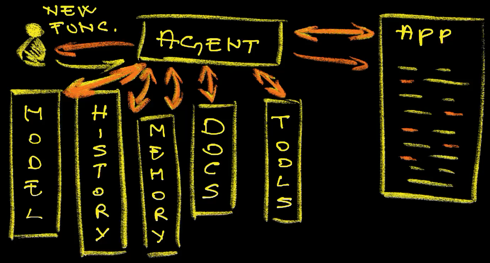
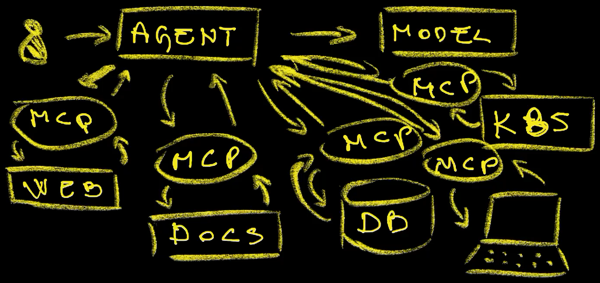

+++
title = 'The Missing Link: How MCP Servers Supercharge Your AI Coding Assistant'
date = 2025-05-26T15:00:00+00:00
draft = false
+++

We got Large Language Models (LLMs), but they were **not enough**. Then we got AI agents, but they were not enough either. Now we got Model Context Protocol (MCP).

Is that it? Is that what was needed to **make AI for software engineers truly useful?**

Let's see.

<!--more-->



Today we'll explore Model Context Protocol (MCP) and see two out of many MCP servers that I believe are a must for any software engineer.

By the end of this video I'm sure I will convince you to add MCP servers to whichever AI agent you might be using today.

## What is Model Context Protocol (MCP)?


To understand Model Context Protocol or MCP, we need to understand **how LLMs and AI agents work**.

If we focus on LLM prompts, whatever we type is a context (1). When that context is sent to a model (2), it responds to the best of its abilities (3). The more we describe what we want, the better the model will respond to our requests.

That's the same as with humans. If I ask you whether we should use Kubernetes, you might give me a simple answer like "yes" or "no" or, more likely, "it depends". However, if I describe what we do in my company, tell you all about the projects I'm working on, describe the technology I'm currently using, tell you about the languages my applications are coded in, tell you about the challenges I am facing, and so on and so forth, you might give me a much more extensive answer. You might tell me which challenges I might be facing, which controllers to use, whether to use Kubernetes-as-a-Service or self-manage, whether to apply a service mesh, and so on and so forth.

I learned that lesson when I worked as a consultant. With the first couple of customers I tried to give an answer or a suggestion right away. Over time, I learned that I should spend most of my time gathering context and give a suggestion how to solve a problem only after I truly understood their landscape, their challenges, their tech, and whatever else might be useful. I gave my advice only after racieving enough context.

Today, the context is often gathered by an AI agent (4). We tell it what we want (5), the agent gathers all the necessary context (6), sends it to LLM (7), gets a response (8), and it does something (9) or propagates that info back to us (10).



If, for example, we instruct an agent (1) to write a new function (2) in an application and tell it what that function should do, the agent does not go directly to the model. That would not work since the outcome would be a function that does not meet our coding guidelines, does not take into the account the existing codebase, does not consider up-to-date documentation for specific libraries, and does not contain previous instructions. The end result would be the same as if we typed the request directly into ChatGPT in a browser.

Instead, the agent takes our request, and does some work to generate the final context. It might take a look at the history of previous requests (3). It might go through the existing code (4). It might consult its internal memory for what we did in the past (5). It might find up-to-date documentation (6) or execute some tools (7). It might make many rounds until it feels it is ready to talk to the model (8) by sending it everything it gathered so far. It might not stop there. It might take the output of the model (9), do more digging (10), expand the context even more, and talk a few more times to the model (11) until it comes up with the final answer (12) or performs some actions like updating existing code (13).

That's all great, but there is a problem. How does an agent know how to consult past context? How does it know how to find the latest documentation? How does it know how to talk to a database? How does it interact with different tools? How does it know how to get all the information it needs to generate the context.

The challenge AI agents are facing is similar to the challenges we have when we talk to each other. I talk with people in my city in Spanish and I speak with the rest of the world in English. I can do that because most of us agreed that English is the common language we should all use to talk to each other. You might be Polish, or Chinese, or Japanese, or Portugeese. If you would know only the language of the country you're born in, we would not be able to talk to each other. We needed a common language. We tried with Esperanto, but that failed and we ended up with English. It is, in a way, the standard.



Now, let's say that I'm using an AI agent (1) that should access a model (2). That part is easy since that is the first thing any agent is thought how to do. But models are not enough, I'd like it to be able to search the Web (3), find up-to-date documentation about a project (4), put some information into a database so that it can use it later (5), interact with my Kubernetes clusters (6), use the tools on my laptop (7), and so on and so forth. All those are using different APIs and communication methods, just as us, humans, are using different languages. How can we solve that?

One option could be for providers to teach their agents to how to interact with anything we might ever need. That's a silly one since it means that everyone would be reinventing the same wheel. Another option is for the industry to develop a standard protocol that all agents can use just as most of us decided that a "standard" language is English.

One such attempt of defining a standard protocol for AI is Model Context Protocol or MCP. AI does not have to know specifics of how to search the Web, how to access documentation of a specific project, how to store and retrieve its memory from a database, or how to interact with Kubernetes clusters. All we need is to put MCP servers in front of those (8) and tell agents where to find them. From there on, those agents can use the MCP protocol to talk to those servers which (9), in turn, will respond with what they know (10).

All that might sound sonfusing, so let's take a look at two MCP servers I believe are the most important for software engineers.

## Setup

This walkthrough, if you're following along, assumes that you are using [Cursor](https://cursor.com) to write code, perform operations, or do whatever else you might be doing. Please install it if you don't have it already. Alternatively, you might prefer a different AI agent and, if that's the case, you might need to modify some of the instructions you'll see here.

> Open Cursor, press `cmd+shift+p` and select `Shell Command: Install 'code' command`.

> Close Cursor

```sh
git clone https://github.com/vfarcic/crossplane-sql

cd crossplane-sql

git pull

git fetch

git switch mcp
```

> Watch [Nix for Everyone: Unleash Devbox for Simplified Development](https://youtu.be/WiFLtcBvGMU) if you are not familiar with Devbox. Alternatively, you can skip Devbox and install all the tools listed in `devbox.json` yourself.

```sh
devbox shell

yq --inplace --input-format json --output-format json \
    ".mcpServers.memory.env.MEMORY_FILE_PATH = \"$PWD/memory.json\"" \
    .cursor/mcp.json

code .
```

> Press `cmd+l` to open chat panel.

> Click the `Settings` icon in the top-right corner, select `MCP` from the left-hand menu, and enable both MCP servers.

> Optinally, for better results, click `Auto` in the chat panel, disable `Auto` and enable `Thinking`.

## Memory and Context7 MCP Servers

I'll use Cursor today, but that does not matter. Almost all agents are already capable of using MCP so you should experience a similar outcome with almost any other. I'm intentionally saying that the experience will be similar, not the same. Different agents have different capabilities just as different people have different levels of English. Not everyone is able to speak it fluently and not everyone has the sufficient knowledge to engage in a specific conversation. Still, what matters, for now, is that you can use MCP with almost any agent. You do not need Cursor to do what I'm about to show.

> Depending on the date when you're trying to reproduce my steps and the agent you're using, your results might differ.

The first MCP I want to show is called "Memory". It allows agents to store information into a file in a specific format so that, later on, they can search for that information when generating context for whatever we're asking them to do.

<a href="https://github.com/StacklokLabs/toolhive"></a> *Today we'll see, among other things, how to run MCP servers locally. That, however, might not be the best scenario. More often than not, instead of each of us running them locally, we might want to run them on servers so that they are accessible to everyone within a team or even the whole organization. That probably means running them as Docker containers or, even better, inside a Kubernetes cluster in a way that they are accessible, that data is shared, and all the other good things we normally do.*

*That's where ToolHive comes in. It is an open source project created and maintained by Stacklok. Their CEO Craig McLuckie is one of the co-creators of Kubernetes, and his team released it recently.*

*With ToolHive, we can instantly deploy MCP servers in Kubernetes, and manage all secrets and configurations. It is a project that is just getting started and the team is very eager to collaborate.*

*If are using MCPs, which I am sure you will after this video, you should visit the [project repo](https://github.com/StacklokLabs/toolhive), check it out, try it out, and, please please please, give it a star. Do it now!*

*Let's get back to the local MCP (for now).*

Having a memory or an initial context is important since that allows us to teach agents everything they need to know about a project. Instad of repeating the same instructions every time we start a new session with an agent, we can tell it to memorize them.

For example, we can tell it to `memorize` `to always use context7 MCP server to find latest information from docs.`

> Type the text that follow in the Cursor chat prompt.

```
Memorize through MCP server `memory` to always use context7 MCP server to find latest information from docs.
```

We'll see Context7 in action in a moment. For now, what matters is that the agent, after asking us for a few confirmations, should now know to use Context7.

Next, let's instruct it to `find` `the information about this project and memorize it.`

> Type the text that follow in the Cursor chat prompt.

```
Find out the information about this project and memorize it.
```

From now on, the agent should be spending less time trying to figure out what the project is all about every time we instruct it to do something in it since it just wrote everything it discovered into the memory server.

*To be clear, most agents have their internal ways to memorize "stuff". Nevertheless, using an MCP server is still very beneficial since that allows us to switch them without having to recreate "memory" into whichever internal format they expect.

Let's see how that "memory" looks like by opening `memory.json`.

> Press `ctrl+p` and type `memory.json` to open it in Cursor.

We can see `entity` and `relation` entries. The former contains actual data while the later entries are, as the name suggests, relations between entities.

If we would like to take a closer look at the content of that file, we can instruct the agent to `format` it so that its `easier to read.`

> Type the text that follow in the Cursor chat prompt.

```
Format `memory.json` so that it's easier to read.
```

The key is in the `observation` field that tells the agent what it's all about and what to do with it.

I'll reject those changes since that file is not meant to be read by humans so the original format should do just fine.

Next, we'll start a new session that makes the agent forget everything we did so far and see whether memory and Context7 MCPs are really working.

> Press the `+` button in the Context AI chat.

Next, let's check whether the Context7 MCP works. We won't go into details about Context7 since I already covered it in the [Outdated AI Responses? Context7 Solves LLMs' Biggest Flaw](https://youtu.be/F0MLnVgk4as) video. If you haven't seen it, the gist is that it provides up-to-date documentation covering thousands of projects.

Let's ask it `what` `the most important new features in Crossplane v2` are. Most of the time, there is no need to tell it to use Context7. Still, agents are not perfect and they might "forget" to use Context7 so we'll tell it to use it explicitly.

> Type the text that follow in the Cursor chat prompt.

```
What are the most important new features in Crossplane v2? Use Context7.
```

Without Context7, agent would not get the information from the LLM its using since, at the time of this writing, LLM was cut before Crossplane v2 was released. So, the agent would either get wrong information, or it would have to scrape the Web, or do something else that would likely result in wrong output. Nevertheless, it got it right since we told it to use Context7 MCP which contains the latest version of Crossplane docs.

We did not use the Memory MCP in the previous query since we told it explicitly to use Context7. Let's check whether memory indeed works by giving it the instruction to `Memorize that source .env should be executed always together with whichever other command you are executing and that all commands should run through devbox run.`

> Type the text that follow in the Cursor chat prompt.

```
Memorize that `source .env` should be executed always together with whichever other command you are executing and that all commands should run through `devbox run`.
```

This time, the agent got confused and tried to memorize it internally within that session. That's not what we might want since that memory would dissapear the moment we start a new session.

*It's a bit dissapointing that MCPs are not always used when the context requires them. We'll probably get there eventually.*

Let's make it permanent by telling it to memorize that by `using MCP memory` and to `always consult it before performing any action.`

> Type the text that follow in the Cursor chat prompt.

```
Memorize it using MCP `memory` and always consult it before performing any action.
```

Now we're talking. Now it saved the instruction permanently, and we can put it to the test by asking it to `set up a local cluster to work on this project.`

> Type the text that follow in the Cursor chat prompt.

```
Set up a local cluster to work on this project.
```

Look at that!

First it called the MCP server to retrieve what it needs to know from the memory, then it evaluated the project, and it generated the command that it should run. 

There's good and bad news there.

The good news is that it correctly understood that it should `source` environment variables before executing anything. That's the instruction it received from its memory through the MCP server. The bad news is that it thinks that it should create a cluster by executing the `kind create cluster` which might sound correct but it's not. There is already in that project a script that does that together with everything else we might need to work. It should have figured it out and, if I used Claude Code it probably would since, in my opinion, it works better than Cursor. Or, maybe, I have changed the model from *Auto* to *Thinking* which forces the agent to think more before deciding what to do. Still, that's a good example or how useful memory MCP is. We could instruct it to always check the scripts in the repo and use them when possible.

> `Stop` the execution of the agent.

All that was made possible by adding those two MCP servers to `.cursor/mcp.json`. Most of the time, all we have to do is copy and paste JSON snippet into a file and we can find that snippet in the documentation of the MCP server we want to add. Many of them are listed in the `servers` repository in the `modelcontextprotocol` GitHub org. We can even ask the AI to `show` us `the list of MCP servers available` there.

> Type the text that follow in the Cursor chat prompt.

```
Show the list of MCP servers available at https://github.com/modelcontextprotocol/servers 
```

There we go. We got the list of `Reference Servers`, `Official Integrations` that were verified by the MCP team, and `Community Servers`. That's not the full list. AI agents are still not that good and, for reasons I cannot explain, it spit out on a fraction of currently available servers in the repo, not to mention that there are many others not listed there; Context7 being one of them.

We can see servers we are currently using if we go to Cursor Settings and, since we are done for today, we can turn them off.

All in all, MCP servers, even though they are in very early stages, are likely to be critical for productive usage of AI. They are the missing piece that provides context AI agents might need to perform their job succesfully.

## Destroy

> Close Cursor

```sh
exit
```

