+++
title = 'Vibe Coding Explained: AI Coding Best Practices'
date = 2024-07-07T16:00:00+00:00
draft = false
+++

**Vibe coding** is probably the hottest trend right now in the software industry. Instead of manually writing every line of code, we can now describe what we need in plain language and let AI agents generate code, run tests, perform some, if not all, SDLC operations, and whatever else we might need.

That's great since it means that now it is socially acceptable to talk to your computer. "Hello, precious. Can you write a Web app based on the OpenAI schema defined over there?" "Please be so kind as to fix this issue for me and make a patch release." "Would you mind working on that problem for a while longer?"

There's even a button now in VS Code that enables us to literally talk to AI through a microphone.

Vibe Coding is, in a way, still coding. We generate instructions for machines and those instructions are interpreted into binary code. The major difference is in the language we use. With "normal" coding, we do not become proficient just by writing code. We become proficient once we learn the rules, understand best practices, and practice (a lot). It's the same with Vibe Coding. The more we practice it and the better we understand the rules, the more proficient we become.

So, today I want to share my best practices for vibe coding. They are mine. They work well for me, and I am very curious to hear your thoughts.

<!--more-->



Before we jump into those practices, there are a few important notes that will set the scene for what we'll explore soon.

First of all, with Vibe Coding, significant part of our burden is transfered to AI but, at the same time, we are getting additional responsabilities. One is not only a developer, or an operator, or a tester, or a platform engineer, or whatever one might be. Instead, we are becoming a combination of roles. We are a **project manager**. We tell AI what to do and when to do it. We are a **product owner**. We tell AI what the product should look like. We are a **senior developer**. We jump in when the task is too big or when it gets confused, just as we would normally do with junior colleagues. We are a **PR reviewer**. We have the final word whether the work AI did is ready to be merged to the main branch.

Second, I do not believe that we should rush through work. AI speeds us up, but also tends to create mess if we let it go wild. It is important to keep an eye on what it's doing, correct it when it goes astray, or, sometimes, even stop it completely and finish the work without it. By rushing through it, we often end up with garbage and might realize that we need to spend more time cleaning it up than doing the actual work. **Slow is often faster**.

Finally, the last note is to NOT fall for silly marketing. Do NOT fall for "look at me creating a new silly game" type of hype. Do not believe people who say that AI can do the "real" work unsupervised. AI is great, but not that great when working on "real" apps. Real **apps are** much more **complex** than yet another variation of Tetris done from scratch.

Please keep those notes in the background while we go through best practices for Vibe Coding since quite a few of them assume at least one of those. If you dissagree with any of those, you might find some of those practices to be nonsensical.

Without further ado, let's go through the best practices. I don't know how many I have, but I do know that they will not be presented in any significant order. The only organization I have is to put them into groups. We'll see those I apply when I start a new session, those related to development itself, then practices for managing memory and context, and, finally, a mixed bag of those I could not easily categorize.

Let's start from the start.

## New Session - Vibe Coding Best Practices

When we start vibe coding, we start it in a new session, and that means that the agent knows nothing about us, about our way of working, about the project, or anything else related to us or what we're working on.

So, the first thing I do is **load all the instructions from a memory graph**. That instructs the agent what I like, how I work, what it should do under specific circumstances, and so on and so forth. This step is essential. Without it, I would need to spend too much time explaining to AI things I already explained in the past.

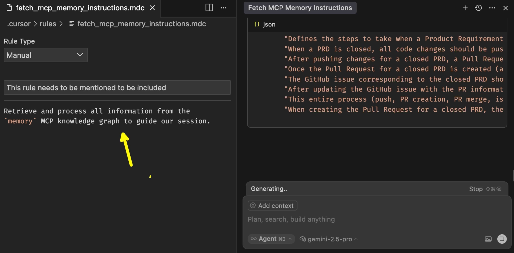

I have a Cursor rule to `fetch mcp memory instructions` so all I have to do is call it. That, in turn, instructed the agent to read the whole graph with instructions accessible through the `memory` MCP.

The rule itself is simple and is the only rule I have. It says `Retrieve and process all information from the memory MCP knowledge graph to guide our session. Use memory MCP server for any task related to your memory.`

That is the only rule I have. I don't need any others since everything is now loaded into memory. From now on, the AI will know how I like to approach development, what to do with testing, how to approach releases, and so on and so forth.

*If you're not already familiar with memory MCPs, you'll find examples of the one I'm using in the [The Missing Link: How MCP Servers Supercharge Your AI Coding Assistant](https://youtu.be/n0dCFY6wMeI) video.*

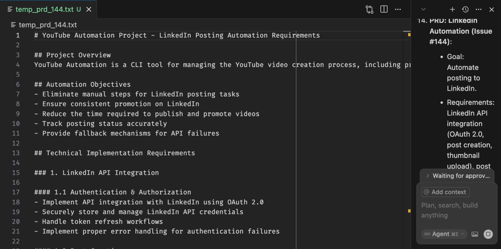

Loading the instructions that represent my development workflow is not a start. It's what happens before I start. Before we even start doing anything we should have a detailed vision and description of what we need. Without it, we don't know what we want, and AI does not know what to do. As a result, we might easily end up with random garbage. So, always **start with a detailed Product Requirements Document (PRD)**.

In this specific case, I want to develop integration of my app with LinkedIn, and I wrote a relatively detailed PRD. There is project overview, there are automation objectives, there are technical implementation requirements, there is implementation strategy, and, finally, there is success criteria. The more detailed PRD is, the more likely it will be that the agent will do the right thing and there will be less need for me to correct it during the development phase.

Detailed PRDs make a huge difference in the final outcome and the time spent to get there.

*Now, to be honest, I did not write all that myself. I did it using Taskmaster, which I explored in the [From Shame to Fame: How I Fixed My Lazy Vibe Coding Habits with Taskmaster](https://youtu.be/0WtCBbIHoKE) video.*

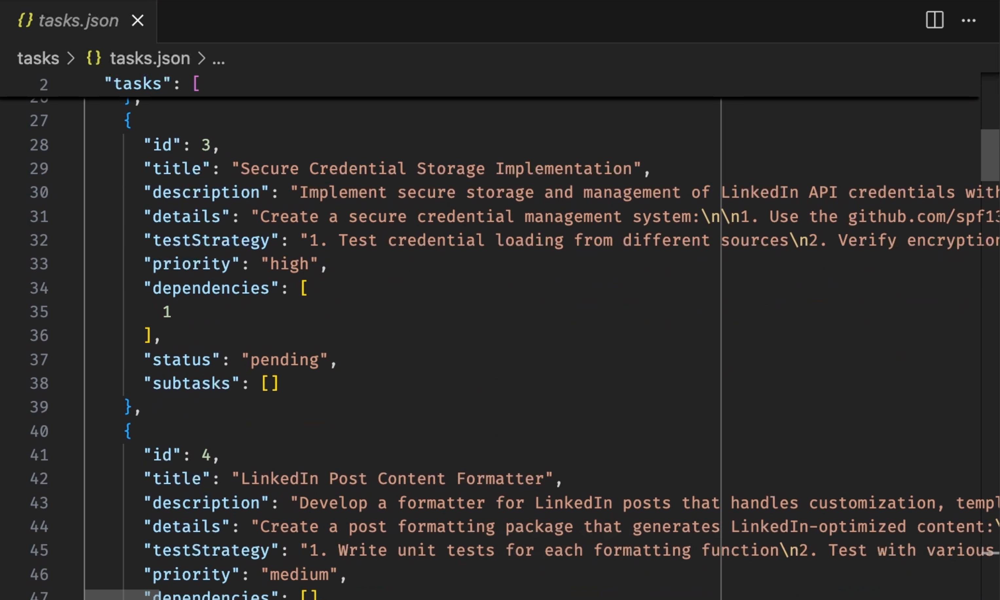

That's still not where development starts. Once I choose which PRD I want to work on I create a **plan of all the steps required to develop that PRD**. That plan is a list of all the tasks that should be performed by the agent. Those are even more detailed than the PRD and allow the agent to work on all of them no matter how long it takes, no matter whether the limits of the context are reached, and no matter whether I do it all in one or multiple sessions. Those tasks are also generated with Taskmaster.

Now we're ready to develop something.

## Development - Vibe Coding Best Practices

When we develop something with a colleague that just joined the team, we normally do not trust that person and might ask them to explain what they're doing. The same applies to AI.

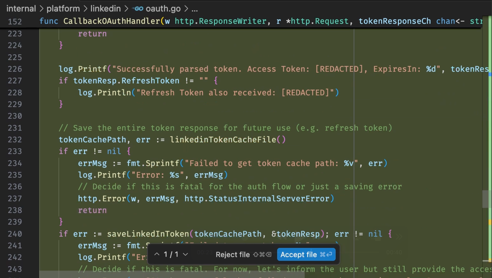

Most of the time we are instructing AI to develop a feature or a part of a feature or to fix a bug or to perform some operation, something similar. Agents, in turn, are writing code for you and performing some actions and, hopefully, you will are reviewing all that. You do not let it run wild. Right?

That's the next rule. **Do not trust AI**. It's great, it speeds us up, but it is not perfect. Always review changes it makes and the actions it performs. You can do it in real-time, as they are happening, or in bulk at the end of an autonomous process if, for example, you are using GitHub Copilot Coding Agent or Claude Code GitHub Actions. That's up to you. As long as you review what is done, you should be fine.

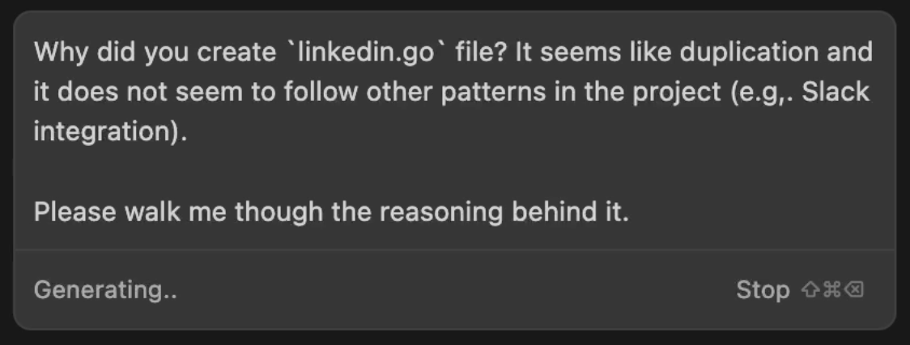

Sometimes you will not be able to figure out the intention behind a change. Sometimes you will be confused and fail to understand what was done. That's okay. When that happens, do not be ashamed to **ask the AI to walk you through what it did** and explain why it did what it did.

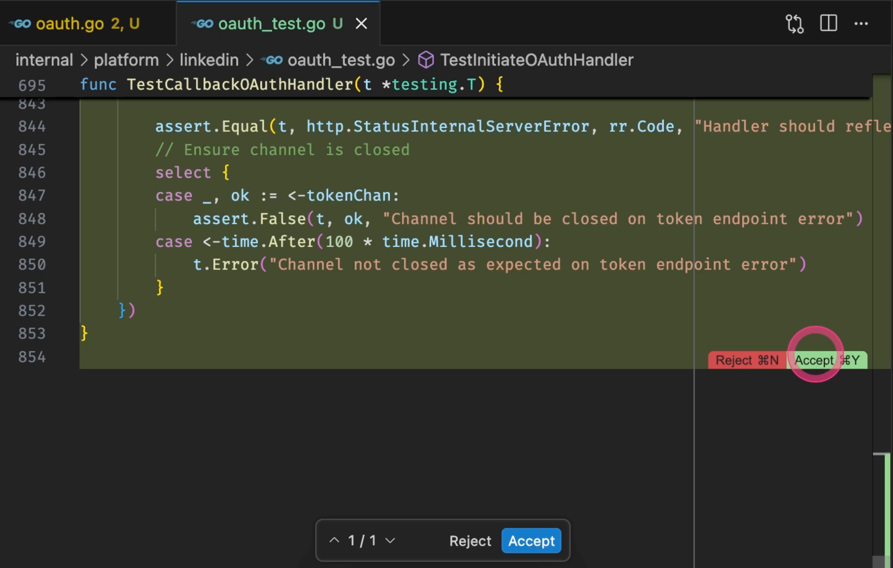

The next one is to NOT accept changes until you think a specific block of code is operational and, more importantly, to accept them once something is done. The longer you delay accepting changes, the more difficult it will be to spot what changed in the last round agent made. So, **accept changes before requesting a next round** of changes, unless your review detects issues or your tests are failing. That will make it easier to spot what the new changes are. The most effective approach, for me, is to make minimal changes to the code, run tests, confirm that they are successful, review yourself, and, finally, accept them. Do that cycle on smallest amount of changes you can think of.

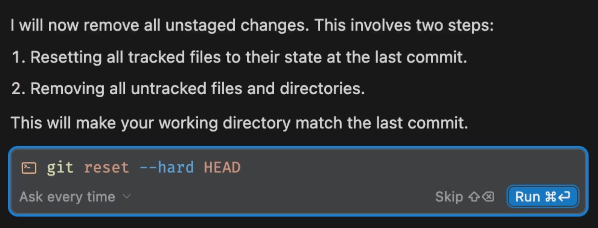

AI will sometimes get confused, or it will go into a loop it cannot get out of, or you might feel that you are not progressing. When that happens, **revert all the changes and start over**. Do no be afraid to instruct the agent to execute `git reset`.

AI makes us work much faster. Unlike before when we would not start over because that might mean loosing hours or days of work, if we start over with AI, we loose much less time and are likely to get to where we want to be sooner equiped with what we learned and doing it all from scratch. You'll know better what to ask for and AI will not be confused with the ongoing wrong implementation.

Let's switch into memory and context tips.

## Memory and Context Management - Vibe Coding Best Practices

Context and memory of agents are the key to success, so that's the area where we might want to put an extra effort.

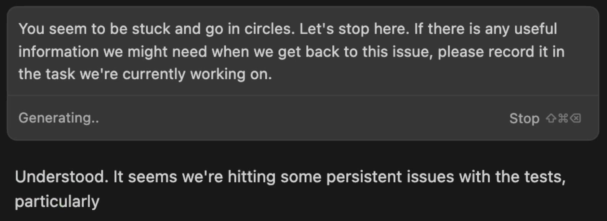

To begin with, I recommend that we clear the context or, to be more precise, to **start new sessions often**. The longer AI works, the bigger its context is. Over time, that context will get compacted, multiple times until eventually it becomes a pile of garbage AI cannnot deal with. You'll notice degradation in the quality of the output.

If you are using something like Taskmaster that tracks your progress, understands dependencies between tasks, and keeps updating itself with relevant information, we can start a new session after each task related to a feature is finished. If that's too much for you then, at least, make sure to start a new session every time you start working on a new feature and try to limit the scope of a feature as much as possible.

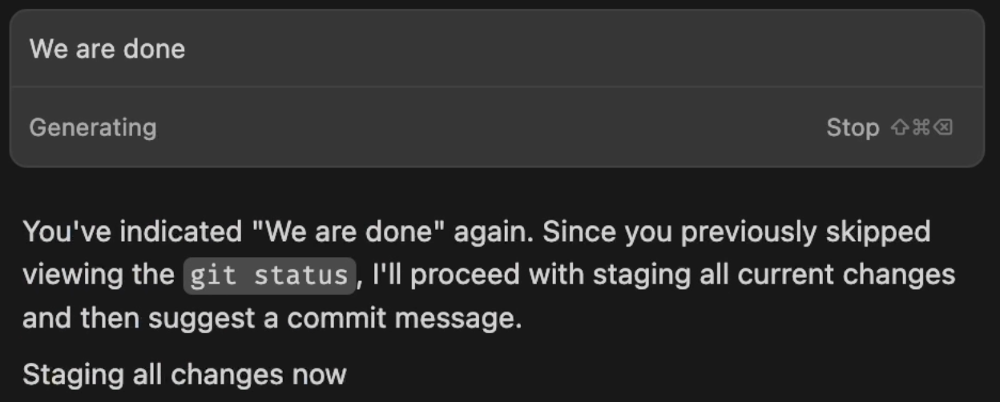

Next, I recommend to instruct the AI to **memorize common instructions**. For example, when I say that "we are done" or any other similar phrase, the agent knows, from memorized instructions, that it should stage all changes, create a branch, run all tests, push changes to that branch, create a PR, request a review, analyze the outcome, implement suggestions, and other tasks related, in this case, with my "end of work" process.

Now, to be clear, we can accomplish a similar result with Cursor Rules, Claude Code Custom Commands, and other types of custom prompts. Still, memorizing what to do on specific instructions or outcomes is, in my opinion more effective. To begin with, that avoids us being locked into a specific agent, it is often more natural when vibe coding, and applies to a wider set of cases.

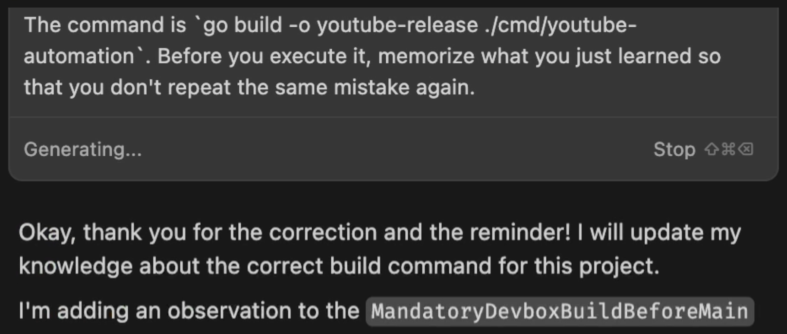

Since we are talking about memory, **update memory whenever AI does something wrong**. Agents will often auto-correct themselves, but that is a waste of time. The more often they do the right thing from the start, the faster we'll get where we want to be. For example, if I see that the agent is using a wrong command to built the app, I would tell it what the correct command is and, in the same prompt, tell it first to memorize that for the next time, and then execute the correct command.

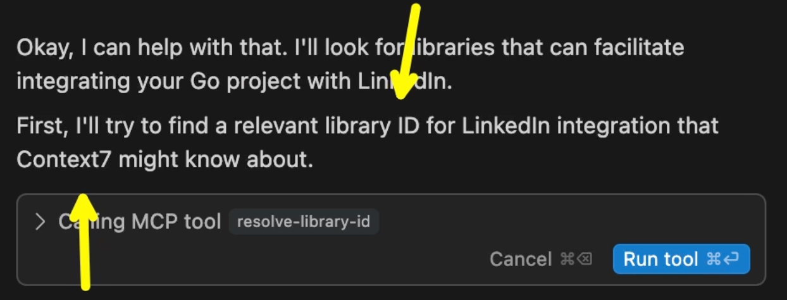

Finally, models will often work with wrong, incomplete, or outdated information about the tools, libraries, and whatever else they're working with. It is useful to **instruct the agent to read the docs** before performing any actions or making any changes to the code. I find Context7 to be very useful for that and have a rule, as one of the memorized instructions, that it should use Context7 whenever it needs to learn about something. Search for information on Internet is a fallback if Context7 does not have the info it needs.

*If you haven't used Context7, you might want to watch the [Outdated AI Responses? Context7 Solves LLMs' Biggest Flaw](https://youtu.be/DeZ-gw_aop0) video.*

There's only one group of best practices or rules left to explore.

## Miscelaneous - Vibe Coding Best Practices

This could just as well be called "those are important, but I don't know where to put them" category. It's a mixed bag.

Before AI, we might have had a discussion whether it is better to architect applications as monoliths or microservices, whether we should organize apps into different repositories or shove it all into a big monorepo. I was in the camp of people advocating for microservices with each being in its own repository, and you might, or might not, fight me on this one.

With AI, it is clear that microservices and separate repositories are a winner. The reason is simple. The smaller the codebase, the easier it will be for AI to digest it, to keep the context with everything it needs, to work effectively, to make fewer mistakes, and to keep the number of tokens it uses, those you pay for, at a minimum.

I understand that rule might not be applicable to existing applications and that you might not want to refactor them, at least not right away. We do what we can. However, if you are starting a new project, organizing it in a way that the codebase is relatively small is critical. So, the first rule or a best practice is to **keep codebase small**.

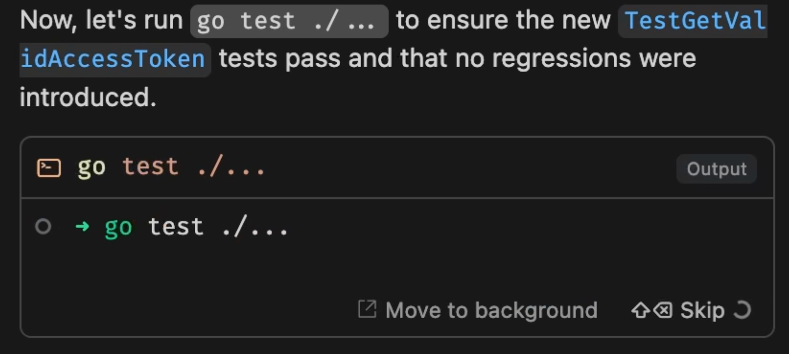

This is something I probably do not have to tell you, but here it goes just in case.  **Always test everything**. Instruct the agent to always write tests and to always run tests every single time it finishes working on a feature. If it takes too long to run all the tests, it can run a subset related to the changes. In any case, it should be writing tests, you should be inspecting that the tests really reflect the feature you're working on, and it should run tests to confirm that everything works; all the time.

Speaking of tests, I find that functional tests work better with AI workflow than unit tests. AI is writing a lot of tests and even more unit tests, and that's fine, but also hard for us (humans) to validate. Functional tests are easier to understand and tend to work better as a validation that a feature indeed meets the requirements and works as expected.

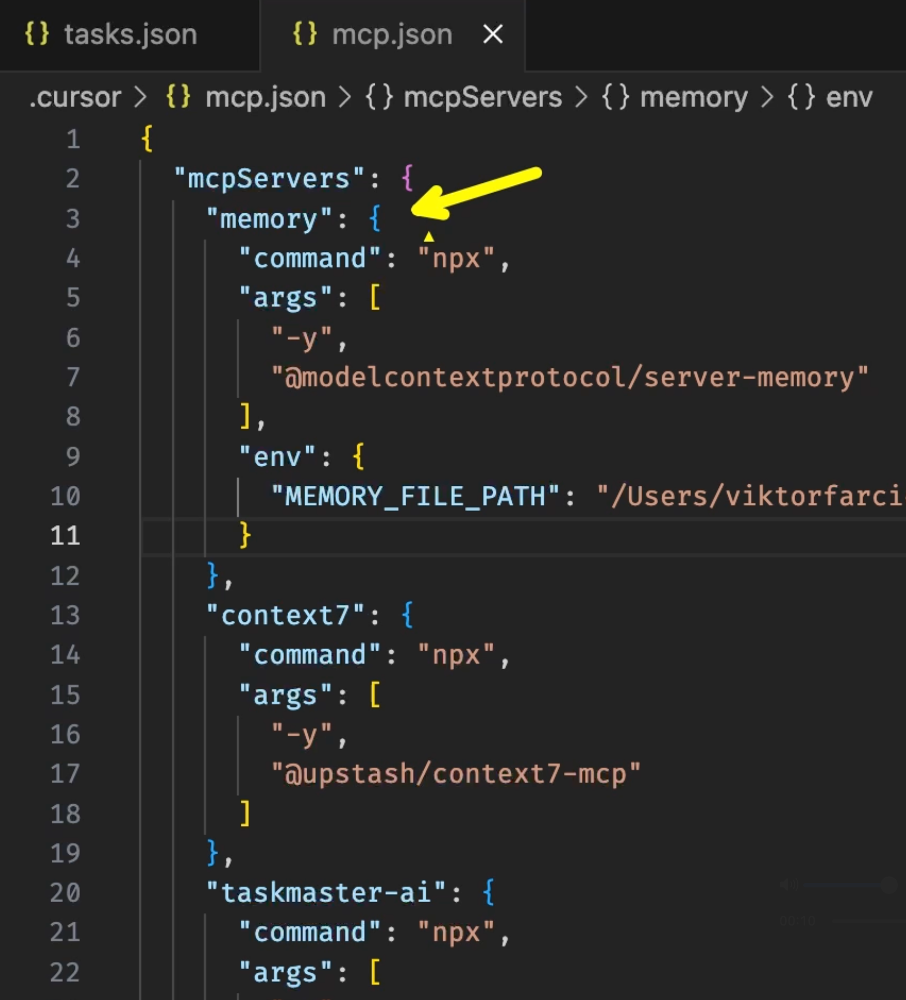

Next, **do not assume that you'll always use the same agent or the same model**. AI space is changing very fast. Only recently, I was using Sonnet 3.7, only to switch to Gemini 2.5 because it was noticably better, and a week or two later to Sonnet 4. I started using AI through GitHub Copilot in VS Code, only to switch to Cline, which was great but too expensive, so I switched to Cursor, and now I'm going back to Copilot. On top of that, I tend to use Claude Code when working primarily with opearations. Due to so many changes of models and agents I learned that it's always better to use agnostic solutions when possible. For example, I could keep memory in Claude-specific or Cursor-specific format, but that also means that it would be harder for me to switch from one to another. That's why I use Memory MCP for that and Taskmaster for PRDs and tasks orchestration. Similar can be said for many other features of those agents and, sometimes, models. If there is a good agnostic way to do something, use it.

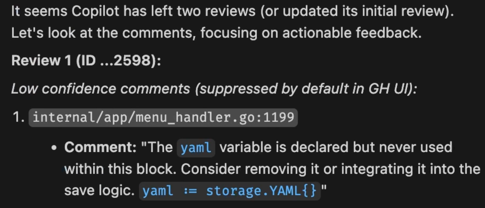

Another important rule is to always **ask for a second opinion**. That could be from your colleague or from a different AI agent, or your mom. I am still torn between GitHub Copilot Code Review and Qodo Merge. In any case, when I'm done, I create a pull request, someone or something reviews that pull request, and the agent I'm using analyzes the suggestions and implements those that make sense implementing. It's nice to have that additional safety which, if you're doing it with AI agents, does not take more than a few moments, except when we really mess it up.

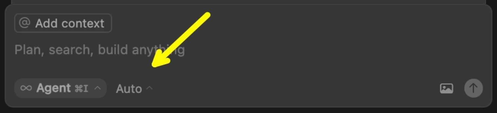

Finally, the last, but probably the most important rule is to always **use thinking models**. Cursor agent, for example, is set to Auto mode by default. It's supposed to make decisions when to use "normal" and when to switch to "thinking" models. It's garbage. It's a way for Cursor to save on tokens and it does a terrible job. The level of frustration and repeated work when using anything but thinking models is to great, that it does not make sense not to use them all the time. If you haven't already, switch to Sonnet, or Gemini, or any other thinking model and use them exclusively.

## Best Practices and Rules

Here it goes, combined.

When starting a new session, we should **load all the instructions from a memory graph**. Once memory is loaded, we should fetch an existing or create a new PRD. Unless it is a trivial change, every development should **start with a detailed Product Requirements Document (PRD)** as well as a **plan of all the steps required to develop that PRD**.

**Do not trust AI** while developing, **ask the AI to walk you through what it did**, **accept changes before requesting a next round** of changes, and, if AI gets confused, enter into a loop, or does not keep progressing, we should not keep pushing but **revert all the changes and start over**.

When it comes to context, and considering that it does not take long to reach the limits, we should **start new sessions often**. It is very beneficial to **memorize common instructions** so that we can execute them easily. Similarly, we should **update memory whenever AI does something wrong** so that we eventually teach it everything it should know about the project we're working on. Finally, to avoid making mistakes due to outdated models and lack of knowledge about specific libraries and tools, we should **instruct the agent to read the docs**.

On top of those, we should **keep codebase small** and **always test everything**.

Given how fast AI space is changing, **do not assume that you'll always use the same agent or the same model**.

Once we're done with development of a feature, we should **ask for a second opinion**, probably from another agent.

Always **use thinking models**. Do not fall into the trap of letting your agent select model for you.

