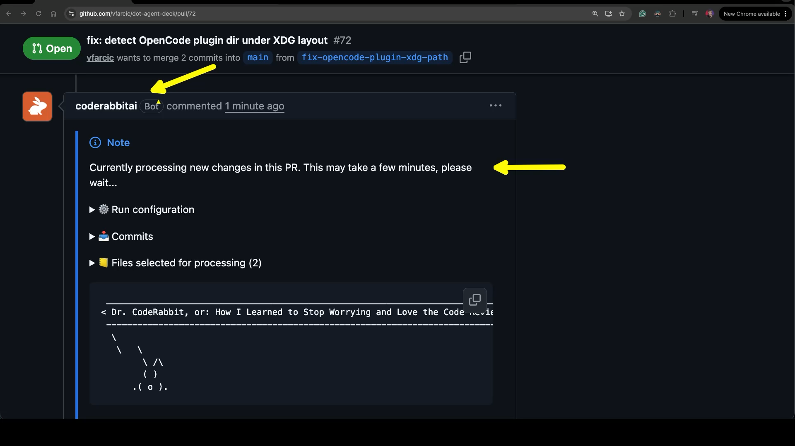
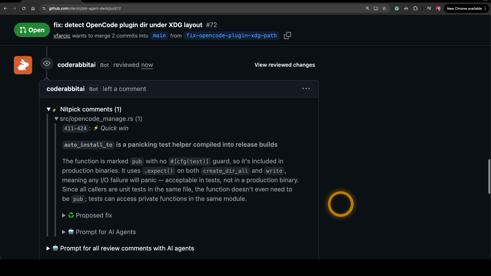
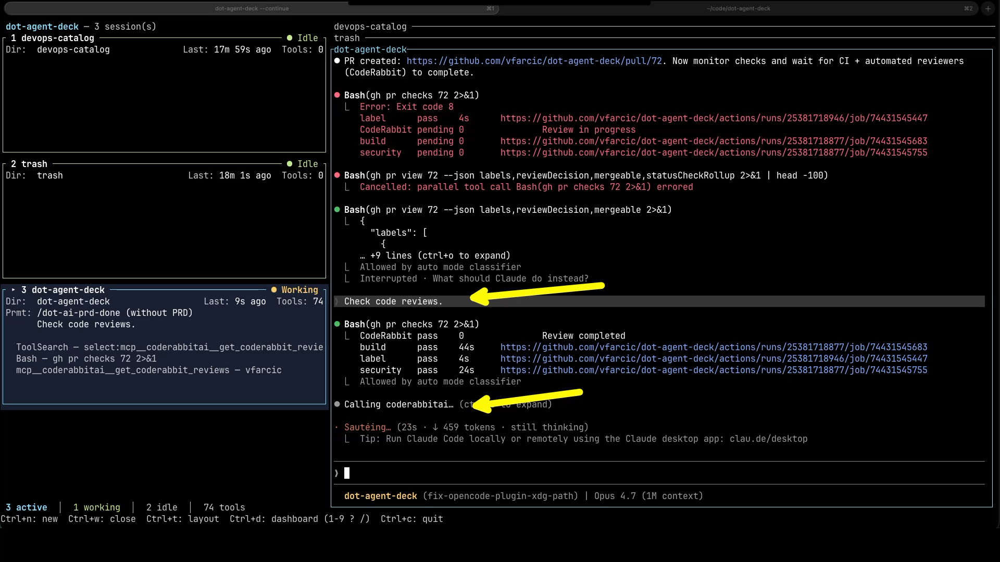
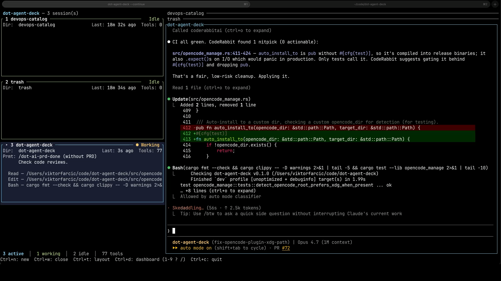
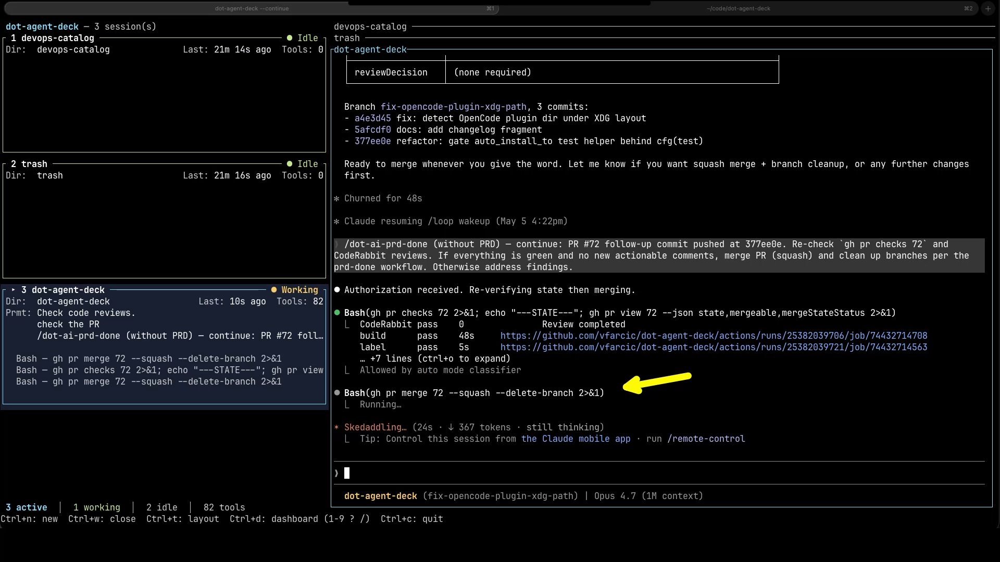

+++
title = "Why AI Code Review Goes First (And Humans Go Second) (feat: CodeRabbit)"
date = 2026-06-08T16:00:00+00:00
draft = false
+++

Code review was the safety net. The last check before something shipped. The place where bad ideas got caught, sloppy work got pushed back, and someone with fresh eyes made sure the change actually made sense.

On most teams, that net is breaking. Not because reviewers got worse. Not because standards dropped. Something fundamental about how code gets written changed, and the review process never caught up.

You can feel it if you've been paying attention. Pull requests sitting open for days. Approvals coming back so fast nobody could have read the diff. Small mistakes slipping through that would've been caught two years ago. The cracks are showing.

In this video, I'll show you what's actually breaking and why, the workflow that closes the gap, and the specific tool I use on every pull request to make it real.

<!--more-->



## Setup

> Unlike most posts, this one is not reproducible. The demo that follows is recorded on one of my real projects rather than a clean walkthrough you can replicate.

## Why AI Broke Code Review

Let me start with something uncomfortable. I can't fully review my own AI-generated code. Not in detail. Not line by line.

And the reason is simple. When I used to type every character myself, I built a mental model of the code as I wrote it. Every variable, every branch, every edge case passed through my head before it hit the file. By the time the code existed, I already understood it. Review was confirmation.

That's gone. When AI writes the code, I didn't construct the mental model. I'm reviewing as an outsider on code that has my name on it. And the volume makes it worse. AI doesn't write ten lines while I think through them. It writes two hundred lines while I read the first ten.

So if that's true for me, on code I supposedly wrote, what chance do I have reviewing yours? What chance do you have reviewing mine?

Now do the math at the team level. AI multiplied the speed at which we generate pull requests. Reviewing them didn't speed up at all, because the way we review hasn't changed. We still open the diff, read it line by line, think about it, leave comments. That process was already the slowest part of the pipeline before AI. Now we're aiming the same human-paced process at many times the volume, whether that's five times more, ten times more, or whatever multiplier your team is hitting. It cannot match. The math doesn't allow it.

The bottleneck just moved from typing to reading.

Faros AI looked at 22,000 developers and over 4,000 teams. PR review time up 441%. PRs merging with no review at all up 31.3%. Either reviewers are drowning, or they've given up.

And honestly, this isn't only about code review. Anywhere a human was the constraint in the SDLC before AI, they're a bigger constraint now. AI accelerated the production steps. The judgment steps are still human-paced.

Now, when teams hit this wall, you'll hear a lot of people say "AI code is hard to review." That framing is wrong. The problem isn't the *quality* of AI code. The problem is two completely different things that have nothing to do with whether AI writes good code or bad code.

The first one is volume. More code per pull request, more pull requests per day. That part is undeniable and we just covered it.

The second one is that we don't fully understand the code that has our name on it. And that's not a new problem. You've always struggled to defend code you didn't write yourself. Anyone who's ever reviewed a colleague's pull request knows what I'm talking about. You can read it, you can spot the obvious issues, but you don't have the mental model the author had when they wrote it. That problem has existed forever.

What changed is the shift in *who is in that position*. 

Before AI, you wrote your own code, so you only hit this problem when reviewing someone else's. Now AI writes the first draft, you read it, you tweak it, you put your name on the pull request. You're effectively reviewing code you didn't write, on every single change you ship. We've all become managers, architects, product owners, more than we are coders. The review problem just followed us into that role.

The Sonar State of Code Developer Survey for 2026 puts a number on it. **59% of developers admit shipping AI code they don't fully understand.** Not occasionally. Not in edge cases. As a regular practice.

That changes what review has to do. The honest version of code review was always two questions. "Is this right?" And "did anyone actually think about this?" The second question is the one that asks whether the change makes sense, whether the approach is the right one, whether someone weighed the trade-offs before writing the code. We've always known both questions matter. But in practice, correctness ate most of the budget, and the second question rarely got serious attention.

AI didn't invent that second question. AI made it more important and less answerable at the same time. More important because more of the code is now written by something that doesn't think about trade-offs the way a human does. Less answerable because we're now even more overwhelmed than before. Unless we change how we review, "did anyone actually think about this" stays unanswered, and a lot of badly-thought-through code ships with our names on it.

And one more thing about quality, because this part gets confused a lot. 

AI is mostly an amplifier of skill, not a quality regressor. Bad developers produce more bad code with AI. Good developers produce more good code with AI. When you see aggregate quality numbers going down across the industry, that's not AI making code worse. That's a broader population, including a lot of less experienced people, shipping a lot more code than they used to. The averages move because the inputs to the average changed.

So the bottleneck isn't worse code. It's more code, written by authors who can't fully defend what they shipped.

 Two completely different problems. Treating it as a "quality of AI" problem points the conversation in the wrong direction.

Now, not every team is drowning. Some are coping fine. Maybe yours is one of them. But the aggregate data is clear enough that this is structural, not personal. Enough teams are stuck that the rest of us should pay attention before we end up in the same place.

And it doesn't matter where on the spectrum you sit. Solo open source maintainer working on weekends. Corporate platform team of fifty engineers. Same math, different scale.

Look at curl. In January 2026, Daniel Stenberg ended the project's bug bounty program. And I want to be clear about what actually happened, because it's easy to misread. More bug reports is a good thing. More reports means more potential issues caught, more eyes on the project, more signal. The bug bounty program existed precisely to encourage that. The problem wasn't that AI was generating bad reports. The problem was that *triage* is human-paced. Sorting real bugs from noise, valid reports from confused ones, all of that takes a person reading carefully and thinking about it. When the volume of incoming reports outruns the team's ability to triage them, it doesn't matter whether they're good reports or bad ones. The system collapses either way. Daniel called the flood "tantamount to a DDoS," and that framing is exactly right. It wasn't a content problem. It was a throughput problem.

And that's not an isolated story. [Jazzband](https://jazzband.co), a Python collective that ran for ten years and hosted eighty-four projects, sunset in March 2026. The reason they gave was the flood of AI-generated pull requests. Same pattern. Submitting a pull request takes seconds with AI. Reviewing one still takes a human reading it carefully. Their open-membership model couldn't survive that gap. A whole community structure that worked for a decade became untenable in months.

Different projects, different sizes, same underlying failure. The judgment layer collapsed under volume that humans cannot keep up with. And whether the new volume is "good" or "bad" almost doesn't matter, because humans can't process either kind fast enough.

So if humans can't keep up, the obvious next question is: what should AI take, and what should stay with humans? 

People want a tidy answer here. They want a rule that says "AI handles the technical review, humans handle the business review." Clean split, easy to explain, easy to put in a slide.

That rule doesn't survive contact with reality. Reviews are messy and contextual. Some technical issues only make sense once you understand the business constraints AI doesn't have access to. Some product or architectural issues are buried inside code patterns that AI is actually pretty good at spotting. The line keeps moving depending on what's in the diff. So stop trying to draw it. The clean split everyone wants doesn't exist, and chasing it wastes time you don't have.

Here's the argument I actually want to make, and it's a much smaller one than you might expect. 

AI doesn't have to do reviews perfectly. It doesn't have to handle every case. It doesn't have to replace the human reviewer. It just has to take enough off the human pile that humans stop drowning.

Partial help is sufficient. If AI catches half of what would otherwise land on a human reviewer's desk, that's already enough to change whether the team is keeping up or falling behind. That's a much smaller, much more defensible claim than "AI replaces reviewers." And it's the only claim you actually need.

So here's the workflow that actually works. The pull request author runs AI review *before* asking any human to look at it. They fix what makes sense to fix. They push back on what doesn't, with a written reason. By the time a human reviewer opens the pull request, it's already in much better shape. The trivial stuff is gone. The obvious bugs are gone. The style and consistency comments are gone. What's left for the human is what AI couldn't catch: the contextual stuff, the product-level concerns, the "should we even be shipping this" question.

And this is the part I want you to take away from all of this.

**AI and humans don't split work by category. They split it by sequence.**

Read that again, because it changes how you think about the whole problem. We've been trying to draw a line through the *types* of review work, AI on this side, humans on that side. That's the wrong cut. The right cut is in *time*. AI goes first, takes a pass, removes everything it can handle. Then a human picks up whatever survives. Same review, different stages.

So that's the workflow. AI first, humans second, partial help that's enough to keep teams from drowning. The next question is the practical one: what tool do you actually use to make this real on your own pull requests? There are a few options, and the rest of this video is about the one I keep coming back to.

It's called [CodeRabbit](https://www.coderabbit.ai). Let me show you what it does, what it gets right, and where it still has rough edges.

## CodeRabbit AI Code Review Demo

Here's a pull request I pushed earlier. It's a small fix, nothing complicated. The kind of change I'd normally expect to sail through review without anyone catching anything. But let's see what CodeRabbit makes of it.

CodeRabbit kicks in the moment a pull request goes up. By default it reviews every single PR. You can scope that down to specific branches or file paths in config if you want, but out of the box, every PR gets a review. Within seconds, the bot leaves its first comment letting you know it's processing the change. It lists the run configuration, the commits it's about to look at, and the files selected for analysis.

From there, we wait. A typical review takes a couple of minutes, depending on the size of the diff. When it's done, CodeRabbit posts a full review on the PR. That includes a plain-English walkthrough of what changed across the diff, and inline comments on the lines that matter. The walkthrough is useful for getting oriented, but the part I actually act on is the inline feedback.

Here's what one of those inline comments looks like.

CodeRabbit flagged a function I'd left marked as `pub` without a `#[cfg(test)]` guard. A test helper compiled straight into release builds. It also uses `.expect()` on file operations, which means any IO failure would panic in production. Fine in a test, not fine in code that ships. CodeRabbit explains the issue, proposes a fix, and even hands me a prompt block I could paste into an AI agent to apply that fix directly.

Bear in mind, this is one nitpick on a small fix. On a more substantial PR, it's not uncommon to see dozens of comments. And not just nitpicks. Real bugs, security issues, performance problems, architectural concerns, alongside the style and consistency nudges. That volume is the whole reason this workflow matters.

Now, we *can* sit here in the [GitHub](https://github.com) UI and read these comments. That's where pull request reviews have always lived. But the moment I do that, I'm pulled out of the place where I wrote the code in the first place, which for me is [Claude Code](https://claude.com/claude-code). Switch tabs, scan comments, switch back, apply fixes, switch again. Multiplied across every PR, that's a lot of context switching for very little reason. So the question becomes: can I keep the comments where I'm already working?

That's exactly what the CodeRabbit MCP server gives me. From inside Claude Code, my agent talks to CodeRabbit directly. It pulls the review, parses the comments, and surfaces them in the same conversation where I've been writing code all along. No browser tab. No copy-paste. Just one tool call away.

In this case, I've got Claude running a workflow that wraps up the PR. It checks the build, the tests, the linters, and then calls out to CodeRabbit to pull whatever review feedback exists.

Once the agent has the review back, it doesn't just dump comments at me. It reads them, decides which ones make sense, applies the fix, and then runs the formatter, the linter, and the tests to make sure that fix didn't break anything else.

The rule I follow is simple. Every single review comment either results in a fix, or gets closed with a written reason for why it doesn't apply. There's no third option. No "I'll think about that later." No silent ignoring. Either it gets addressed, or I explain why I'm choosing not to address it.

That used to be impractical. Pre-agents, I'd triage. Fix the critical stuff, the security flags, the obvious bugs. Skim the nitpicks. Maybe address one or two. Move on. The cost of fixing a nitpick by hand was higher than the value of fixing it, so most of them died on the vine.

Agents flipped that math. Fixing a nitpick now costs almost nothing. The agent reads the comment, applies the change, runs the tests. So I no longer have to decide what's worth fixing. Everything that should be fixed, gets fixed. The bar dropped to the floor.

And once those fixes are pushed, the loop continues. CodeRabbit reviews the new commits. If there are more comments, the agent works through them. Push again. Review again. Repeat until the review comes back clean.

And here's where the punchline from the first part of this video lands. If there are other human reviewers on this PR — teammates, leads, whoever — there's no point pulling them in until CodeRabbit's pass is done. Otherwise I'm asking humans to do work a machine could've done. By the time they open the PR, the trivial issues are gone, the style nudges are gone, the obvious bugs are gone. What's left is what humans actually need to weigh in on. The architectural call. The product trade-off. The "should we even ship this" question. The stuff a diff-only AI reviewer can't see, but a teammate who knows the system and the business can.

Those human reviewers can do their review wherever they prefer. GitHub UI still works. Their own agent works too. Claude Code, [OpenCode](https://opencode.ai), [Cursor](https://cursor.com), whatever they happen to live in. The point is *when*, not *where*. They review after CodeRabbit, on a polished PR. Then comes merge.

In this particular case, the change was small enough that I skipped human review and went straight to merge myself. The agent re-verifies the checks one more time, confirms the merge state, squashes, merges, deletes the branch.

That's the workflow end-to-end. Now let me step back and call out where this approach actually delivers, and where the rough edges are, so you can decide whether it fits how your team operates.

## CodeRabbit Pros and Cons

One quick note before I dive in. Most of these pros and cons apply to AI code review as a whole, not just CodeRabbit. CodeRabbit is the tool I picked because it does these things well. Where it specifically delivers something other AI reviewers don't, I'll call it out as I go.

Let's start with the cons. The biggest one is **diff-only context**. AI reviewers see the changed lines and that's it. They don't see the rest of the system. They can't tell if your microservice change breaks something downstream. They can't reason across repos. That's structural to every diff-based AI reviewer. It's also why humans still matter. We hold the system context AI doesn't have.

The other one is **synchronous reviews**. I have to wait for the full review to finish before I can touch any of it. I'd rather see comments stream in as they're generated, so I could start fixing the first one while the reviewer is still chewing through the rest. As far as I know, no AI reviewer does this yet. So it's a wish-list item for the whole category, not a CodeRabbit problem.

Now the pros. The first one, and this is CodeRabbit-specific for now, is the **MCP integration**. I can stay inside my agent. Claude Code, OpenCode, whatever I happen to be using. CodeRabbit lets me pull review feedback through MCP without ever switching to the GitHub UI. Most other AI reviewers still expect me to leave my agent and read comments in a browser. That's a context switch I refuse to make.

Next is the **GitHub-native PR flow**. Comments land inside the PR, where reviews already happen. No separate dashboard. No parallel system to maintain. Whatever review process your team had before still works.

Then there's **independent perspective**. 

Even when I review my own AI-generated code, I miss things. The value here is independence, not whether the reviewer is AI or human. An external reviewer brings a different perspective and doesn't share my blind spots. Asking the same agent that wrote the code to review it just produces the same blind spots that wrote the bugs in the first place.

Another CodeRabbit-specific one is that it **learns from feedback**. Push back on a class of nitpick once or twice, and CodeRabbit picks up the pattern. Over time, the noise drops and the signal rises. Most AI reviewers don't do this. They give you the same comment categories on PR one and PR fifty. CodeRabbit's review quality compounds. Your team gets a more useful reviewer the longer you use it.

Another one specific to CodeRabbit is **AI + static analysis**. Under the hood, CodeRabbit runs over forty linters and SAST tools alongside the LLM. The LLM doesn't have to guess at security issues, style violations, or common bug patterns. Those come from grounded tools. The LLM's job is to reason about what those findings mean for *your* code, in context. That layering is why the comments feel more like a senior reviewer's notes and less like a chatbot's hot takes.

Then there's **conversational replies**. If a comment is unclear or I disagree with it, I can reply right there on the thread and the reviewer responds. Same way I'd push back on a human reviewer. That turns the review from a one-way feed of issues into an actual back-and-forth. I can clarify, push back, or ask for context. Not unique to CodeRabbit anymore, but table stakes for any AI reviewer worth using.

Next is the **fix-everything workflow**. Before agents, I'd triage. Fix the criticals, ignore the nitpicks. Now agents address everything cheaply. I no longer have to decide what's worth fixing. Nitpicks become free.

Then there's **speed**. Minutes, not hours or days. Doesn't block me the way human reviewers do. Doesn't pile up in a queue while everyone waits.

And finally, **cost**. A few dollars per developer per month for a tool that handles the most common review concerns. The humans who would have caught the same issues cost orders of magnitude more. And their time is better spent on what AI can't do anyway.

So back to where we started. The safety net broke. Not because AI writes bad code, but because AI writes more code than humans can read. The fix isn't hiring more reviewers. It's flipping the order. AI first, then humans. By the time a person opens the pull request, the noise is gone and only the judgment calls are left.

CodeRabbit is the tool I use to make that real. It's not perfect. The diff-only context limit is real, and it's why humans still need to be in the loop. But what AI catches before they get there is enough to keep my team from drowning. That's the bar. Not perfection. Just enough.

If your team is hitting the same wall, try this workflow on your next change. Run AI review first. Fix what makes sense. Push back on what doesn't. Then ask a human. But put humans on a shorter clock too. If you spent hours building something with AI, waiting days for a teammate to review it eats every bit of speed you just gained. The whole pipeline has to compress, not just the parts AI touches.
