+++
title = 'AI Meets Kubernetes: Simplifying Developer and Ops Collaboration'
date = 2025-08-11T16:00:00+00:00
draft = false
+++

Platform engineers face a tough challenge: **developers know what they need**, but they don't understand complex infrastructure. Platform engineers understand infrastructure, but they struggle to anticipate every developer requirement. The result? **Internal Developer Platforms** that miss the mark and platforms that require endless iterations to make them useful.

But what if there was a **third collaborator** that could bridge this gap? AI has vast technical knowledge but doesn't know your company's specific rules and constraints. However, when you combine developer intent, platform engineering expertise, and AI's technical knowledge, something powerful emerges.

I'm about to show you a working system that demonstrates this three-way collaboration. We'll watch developers express their needs in natural language, see AI translate those into deployments using platform engineering building blocks, and then I'll reveal the architecture that makes this possible.

<!--more-->



## Setup

> This demo is using Claude Code as the coding agent. Please open an [issue in the dot-ai-demo](https://github.com/vfarcic/dot-ai-demo/issues) repo if you'd like me to extend it to other agents (e.g., Cursor, VS Copilot, etc.).

> The project we'll explore currently supports only Anthropic Sonnet models. Please open an [issue in the dot-ai](https://github.com/vfarcic/dot-ai/issues) repo if you'd like the support for other models or if you have any other feature request or a bug to report.

> Install [NodeJS](https://nodejs.org/en/download) if you don't have it already.

```sh
npm install -g @anthropic-ai/claude-code

git clone https://github.com/vfarcic/dot-ai-demo

cd dot-ai-demo

switch app-deployment
```

> Make sure that Docker is up-and-running. We'll use it to create a KinD cluster.

> Watch [Nix for Everyone: Unleash Devbox for Simplified Development](https://youtu.be/WiFLtcBvGMU) if you are not familiar with Devbox. Alternatively, you can skip Devbox and install all the tools listed in `devbox.json` yourself.

```sh
devbox shell

./dot.nu setup

source .env

claude
```

> Execute the following prompt to confirm that the `dot-ai` MCP is working.

```
/mcp
```

> Press the `esc` key to return back to the prompt.

## The Platform Engineering Problem

Almost everyone is using AI in some capacity or another these days. **Models are incredibly capable** at understanding context, generating code, and solving complex problems. But what makes them truly powerful is when they're enhanced with **agents** that can gather information and use tools to take action in the real world. **MCPs extend agents** with specialized tools that go far beyond what's available through traditional command-line interfaces. But here's where this AI capability intersects with a fundamental problem in platform engineering.

**Internal Developer Platforms** are typically built by platform engineers who make assumptions about what developers actually need. Even in the best case scenario, these platform engineers end up spending tremendous amounts of time treating developers as customers, approaching their platform like a startup that's still trying to figure out what the market needs. They go through the classic startup cycle: trying to understand what developers want, building something, failing to deliver what developers really need, trying again, iterating endlessly until they eventually stumble onto something truly useful. It's the exact same process startups go through when **searching for market fit**.

But here's the harsh reality: most platform engineers simply do not know what developers need, and they're unlikely to ever figure it out. This isn't a criticism of their technical skills or dedication. It's just the nature of the problem. 

The gap between what platform engineers think developers need and what developers actually need is often enormous and difficult to bridge. And even if platform engineers somehow figure out what developers need today, those **needs are constantly changing**. What was essential yesterday might be irrelevant tomorrow as new technologies emerge and development practices evolve.

So who actually knows what developers need? Developers themselves! They understand their workflows, their pain points, and exactly what would make their lives easier. But here's the catch: developers typically don't have deep experience with databases, clusters, cloud providers, networking, and all the infrastructure complexity that their applications depend on. 

They might not have the time to learn all these infrastructure details, and even if they do, it's often too much for any one person to master. The infrastructure landscape is vast and constantly evolving.

Now, you as a platform engineer, database administrator, Kubernetes expert, or any other infrastructure specialist do know these details. But who else has this knowledge? AI! Large Language Models have been trained on vast amounts of technical documentation, real-world examples, production experiences, and countless discussions about what works and what doesn't across different environments.

So why not leverage that extensive knowledge? The challenge isn't that AI lacks technical or production knowledge.

The challenge is that AI does not know the **specific practices in your company**. It might not know that you always use a specific region in Google Cloud, which VPC must be used in AWS, which database service can be used in Azure, which Ingress class and service mesh should be used in Kubernetes, and countless other company-specific decisions.

These organizational constraints, preferences, and standards are unique to your environment and aren't part of any training data.

This is where the solution becomes clear. Instead of platform engineers trying to guess what developers need, AI can work directly with developers to understand their requirements. AI has the general technical knowledge, and you know what the company rules and best practices are. **Three-way collaboration**. 

Let AI do what it knows how to do, and you as a platform engineer focus on creating guidance, restrictions, governance, and all the guardrails that define how things should work in your organization. If those constraints are provided to the AI, it can provide services that developers actually need while ensuring those services meet your company's rules and standards.

Now here's the thing: the implementation is straightforward. You as a platform engineer should provide the **building blocks**: Kubernetes CRDs and controllers, policies, governance rules, system prompts, and all the foundational components that define your platform's capabilities and constraints.

Once those building blocks are in place, AI agents can do the rest. They can take a developer's intention, understand what needs to be built, and assemble the right combination of your building blocks to create exactly what the developer needs.

This approach sounds great in theory, but does it actually work in practice? Let me show you a project I've been working on in action first. We'll see it solve real deployment problems, and then I'll explain how it actually implements these concepts. 

## AI Deployment Magic

Let's see this concept in action. I want to walk you through creating and deploying applications using the **DevOps AI Toolkit** (or dot-ai) MCP to demonstrate how AI can work directly with developers while still respecting all those platform engineering constraints we discussed. 

This isn't just theory anymore. We're going to see deployment problems get solved through a conversational interface that understands both what developers need and what your infrastructure allows.

Let me start by creating a new app. I'll use the dot-ai MCP through Claude Code to see how this conversational deployment process actually works in practice.

I'll type my first command to create an app using the dot-ai MCP.

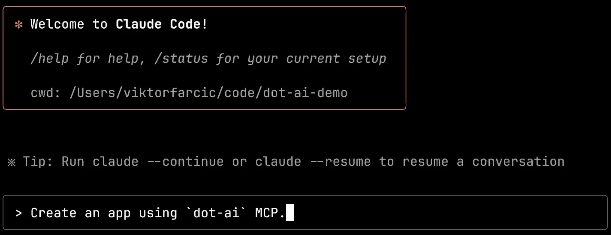

```
Create an app using `dot-ai` MCP.
```

> AI is non-deterministic. There is no guarantee that you'll experience the same outcomes as I. As such, you might need to adapt the instructions.

The dot-ai MCP immediately recognizes that my initial intent was too vague. Instead of making assumptions, it asks for more specific details, providing helpful examples of different application types: web applications, databases, microservices, and frontend applications.

That response shows how the system guides developers through the decision-making process rather than forcing them to know all the deployment options upfront. It realized my request was too short to deduce what I actually wanted, so it's asking for a more detailed intent.

I'll respond with a clearer request for a stateless Golang application.

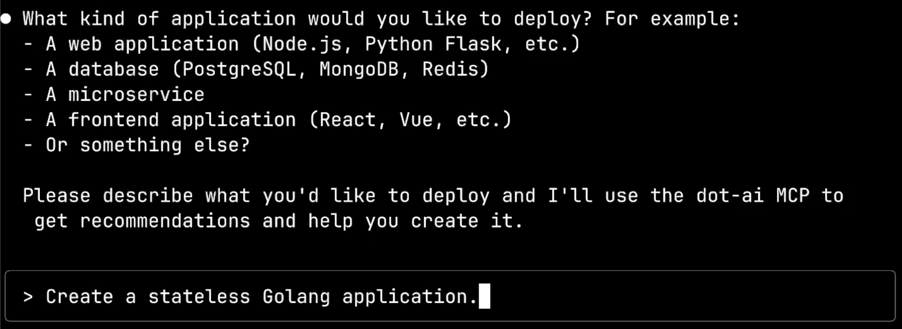

```
Create a stateless Golang application.
```

With this slightly more specific request, the system continues to guide me through the process. This iterative refinement is exactly how real conversations work between developers and platform engineers, but now it's happening automatically with AI that understands both the developer's intent and the infrastructure constraints.

> Follow the on-screen instructions.

Now we can see the dot-ai MCP in action. It's calling the `dot-ai:recommend` tool with my intent to "deploy a stateless Golang application." The system is about to use AI-powered recommendations to help me deploy, create, run, or setup applications on Kubernetes.

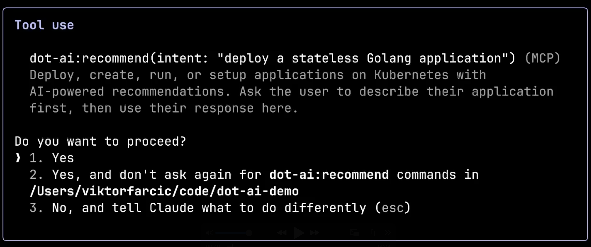

Here's where the magic happens. The system has analyzed my cluster and is presenting me with three solutions, each with a confidence score. Notice how it's not just offering generic solutions, but options specifically tailored to my infrastructure:

Option 1 is a Custom App CRD with a 95% confidence score, designed for application deployments with automatic handling of deployment, service, and ingress. Option 2 is a Standard Kubernetes Deployment with an 85% score, offering the core functionality for stateless applications. Option 3 is a Full Production Deployment with 80% confidence, providing complete autoscaling and fine-grained control.

This is the three-way collaboration in action. Platform engineers built these capabilities: they kept low-level Kubernetes resources like Deployment and Service available, but also created higher-level abstractions like the `App` CRD using Crossplane. I expressed my intent as a developer wanting to deploy a stateless Golang application. Now the AI inside the MCP is evaluating my intent against what platform engineers made available in the cluster, proposing the solutions that best match my needs.

The AI isn't just discovering what's in the cluster, it's intelligently matching developer intent with platform engineering capabilities. This is exactly the solution we discussed: platform engineers provide the building blocks, developers express their needs, and AI bridges the gap.

I'll choose Option 1 for its simplicity and high confidence score.

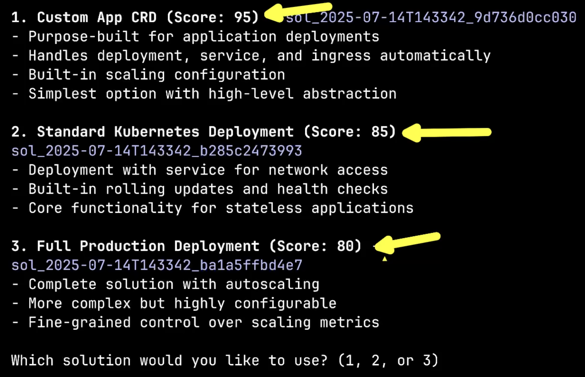

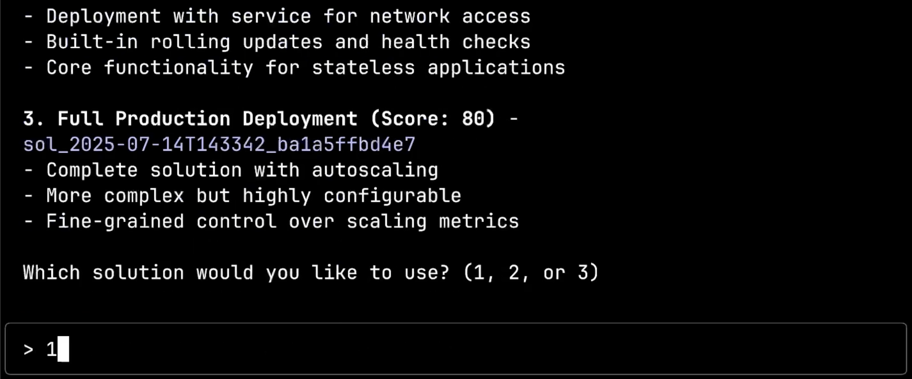

Now the system is calling `dot-ai:chooseSolution` with the specific solution ID I selected. It's about to retrieve the configuration questions needed for this particular deployment option. This step demonstrates how the system tailors the configuration process to the chosen solution rather than asking generic questions.

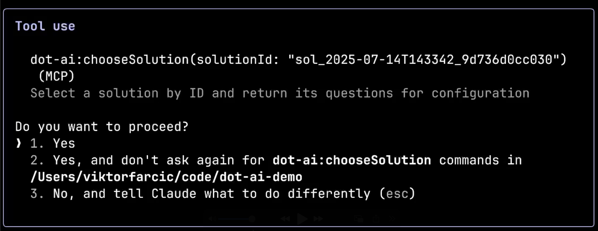

Now the AI is asking for the required configuration settings for my Golang application. Notice how these aren't generic Kubernetes questions, but specific, practical details that any developer would understand: application name, namespace, container image, and image tag.

This is intelligent questioning. The system knows what deployment option I chose and is asking only for the essential information needed to configure that specific solution. I'll provide the required details: app name `silly-demo`, namespace `a-team`, and the container image details.

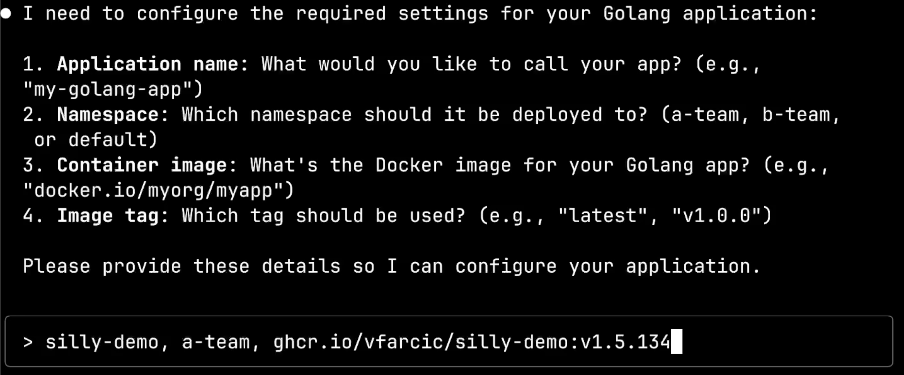

The system is now calling `dot-ai:answerQuestion` with my responses. Notice how the client agent intelligently parsed my input `ghcr.io/vfarcic/silly-demo:v1.5.134` and automatically split it into separate `image` and `tag` fields.

This shows the system's intelligence: I didn't need to specify which part was the name, namespace, or image components. The client agent figured out what I meant from the context and structured the data appropriately.

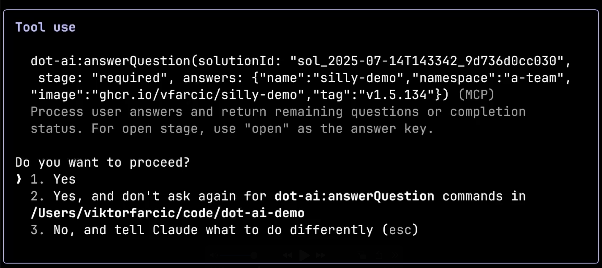

Now we move to the basic configuration questions: port, hostname, and ingress class. These are still developer-friendly questions, not requiring deep Kubernetes knowledge. The system even shows me what's available in my cluster, like noting that `nginx` is available as an ingress class.

I have the flexibility to provide these details or simply say `skip` to proceed to advanced configuration. I'll provide the basic networking details: port `8080`, hostname `silly-demo.127.0.0.1.nip.io`, and ingress class `nginx`.

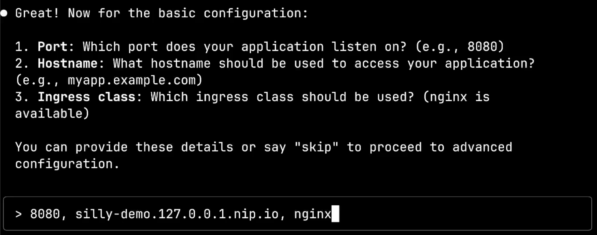

Again, the system processes my answers in the "basic" stage, structuring them properly: `port: 8080`, `host: "silly-demo.127.0.0.1.nip.io"`, and `ingressClassName: "nginx"`. The workflow continues seamlessly to the next configuration phase.

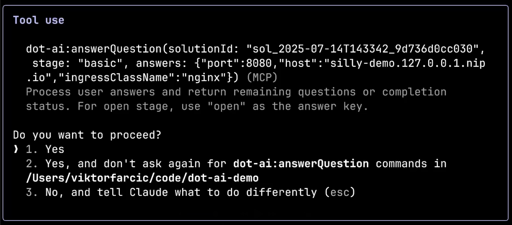

Now we reach the advanced configuration stage, with questions about automatic scaling, replica counts, and repository settings. These are more complex Kubernetes concepts, but still presented in an accessible way.

For this demo, I'll simply type `skip` to proceed to the open configuration stage, showing how the system accommodates different levels of complexity based on developer needs.

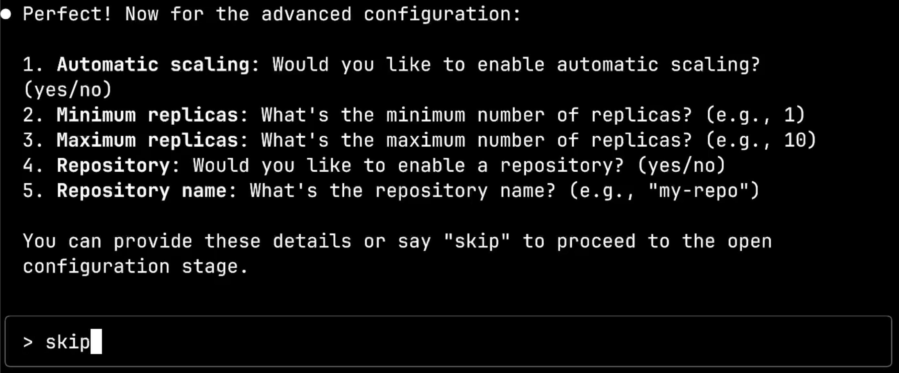

Finally, we reach the open configuration stage, where I can specify any additional requirements in natural language. The system provides helpful examples: security requirements, performance needs, infrastructure constraints, resource limits, and health check requirements.

This is where the AI's natural language understanding really shines. Instead of needing to know specific Kubernetes configuration syntax, I can simply describe what I need: `Make it scalable between 2 and 5 replicas`.

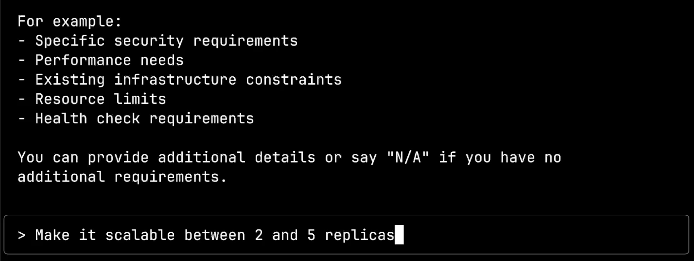

Now comes the crucial step: generating the final Kubernetes manifests. The system is calling `dot-ai:generateManifests` with the fully configured solution ID. Notice the important requirement: it can only generate manifests after completing ALL configuration stages: required, basic, advanced, and open.

This ensures that the AI has gathered all necessary information before creating the deployment resources, preventing incomplete or misconfigured deployments.

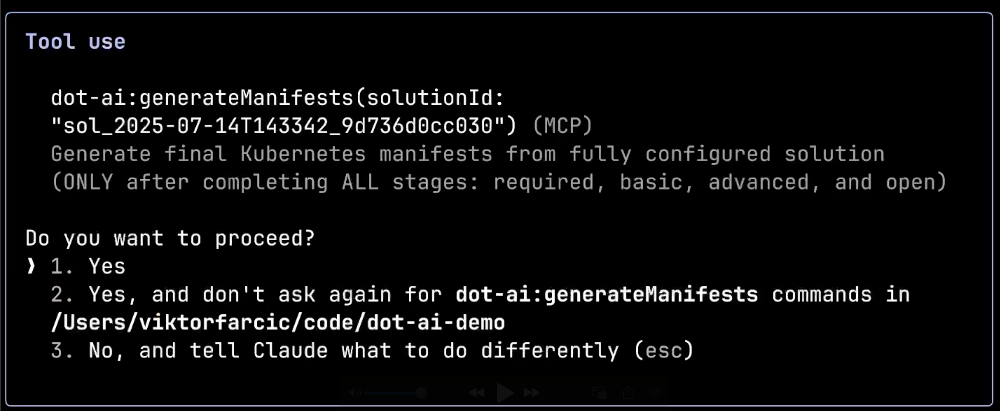

Perfect! Here's the generated manifest showing how the AI translated my conversational inputs into proper Kubernetes configuration. Notice how it's using the `App` CRD because that's the solution I selected earlier from the three options.

All my inputs are correctly reflected: `kind: App`, `name: silly-demo`, `namespace: a-team`, the container image and tag, networking configuration, and most importantly, the scaling configuration with `min: 2` and `max: 5` based on my natural language request.

The manifest is saved to a temporary file, and the system is asking if I want to deploy this application to my Kubernetes cluster.

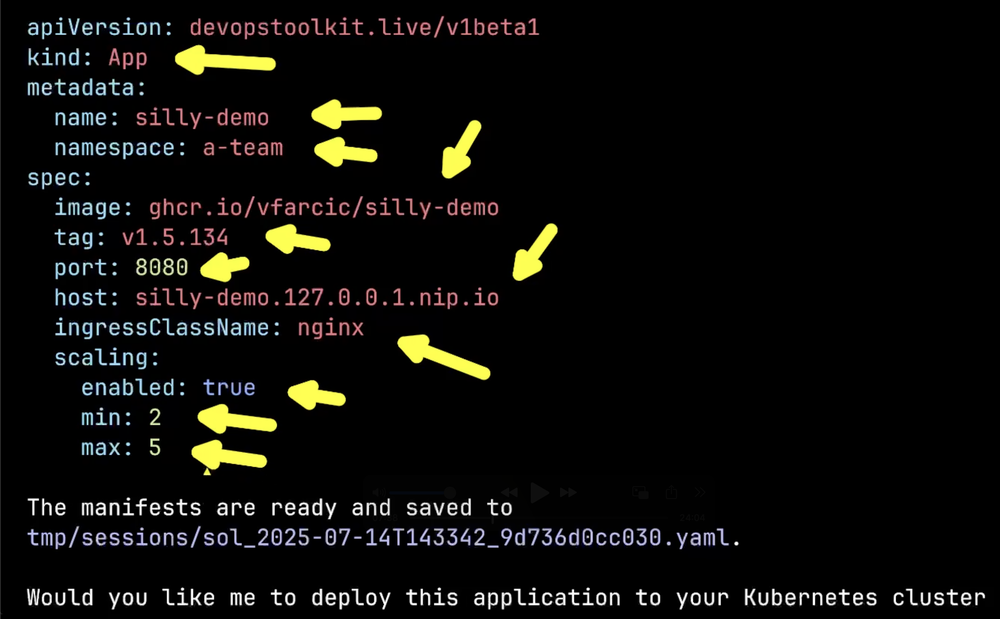

I'll confirm deployment by typing `Yes`. This triggers the actual deployment process to my Kubernetes cluster.

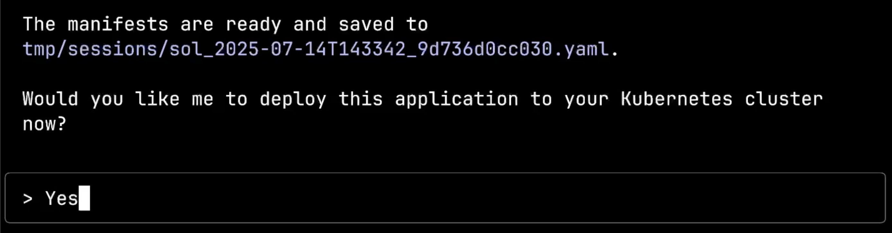

The system is now calling `dot-ai:deployManifests` to deploy the Kubernetes manifests from the generated solution.

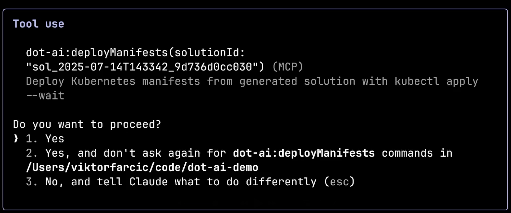

Excellent! The deployment completed successfully. The system provides a comprehensive summary showing that my stateless Golang application `silly-demo` is now running in the `a-team` namespace with auto-scaling enabled between 2-5 replicas, accessible at the hostname I specified.

Most importantly, notice how the `App` CRD automatically created all the underlying Kubernetes resources: Deployment, Service, and Ingress. This is the platform engineering abstraction working exactly as intended, hiding the complexity from developers while still providing the full functionality.

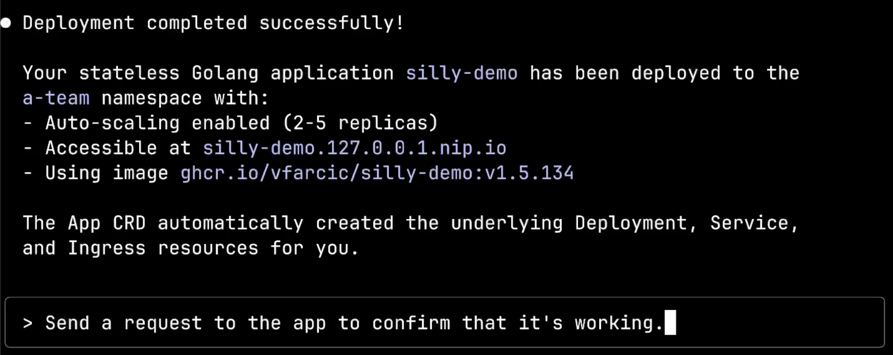

```
Send a request to the app to confirm that it's working.
```

Let me test the deployed application by sending a request to confirm it's working properly.

The curl command successfully reaches the application at the hostname I specified, and it returns the expected response: "This is a silly demo". This confirms that the entire deployment pipeline worked correctly: from my conversational intent to a fully functioning application accessible through the configured ingress.

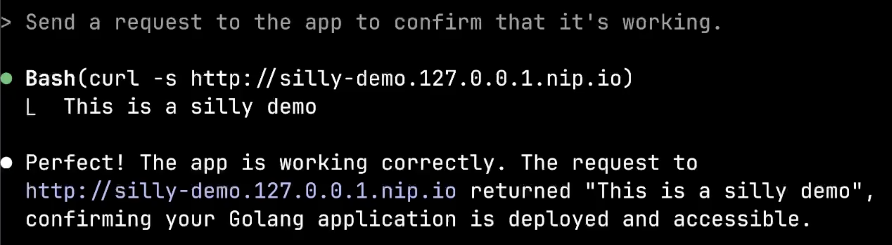

This demonstration shows the happy path: when your requirements align with the available platform capabilities, the system works smoothly. But what happens when you need something that the selected solution can't provide? Let's explore how the system handles requirements that push beyond the boundaries of what's available.

## When AI Hits Limits

Now let's test the system's boundaries. I'll create another stateless application, but this time I'll explicitly mention Ingress in my intent to see how that affects the available solutions.


```
Create a stateless Golang application accessible through Ingress.
```

> Follow the on-screen instructions.

Notice the difference this time. Because I explicitly mentioned Ingress in my intent, the system now includes Ingress configuration in the low-level Kubernetes Deployment solution. This demonstrates how the AI adapts available solutions based on your specific requirements.

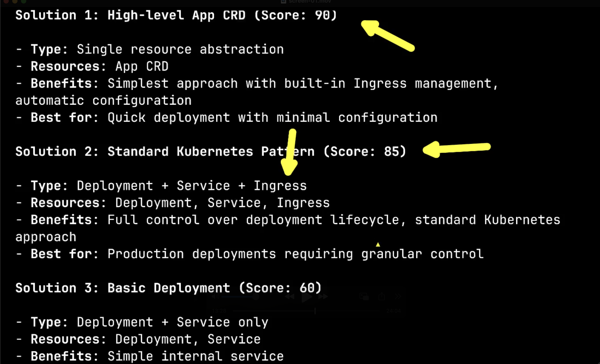

I'll choose the `App` solution again to test what happens when I request something it cannot provide.

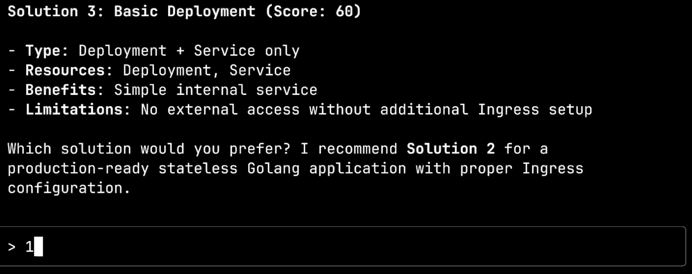

Let me go through the configuration stages quickly, providing similar settings as before.

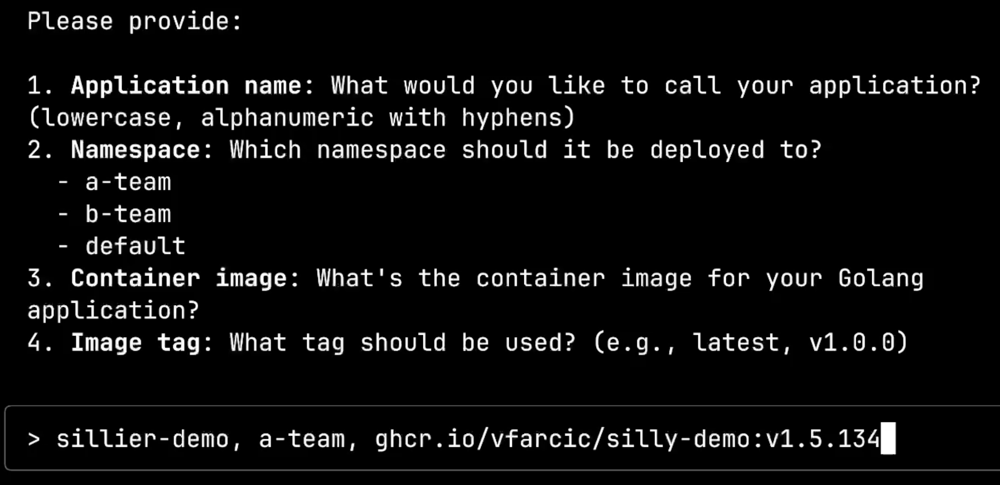

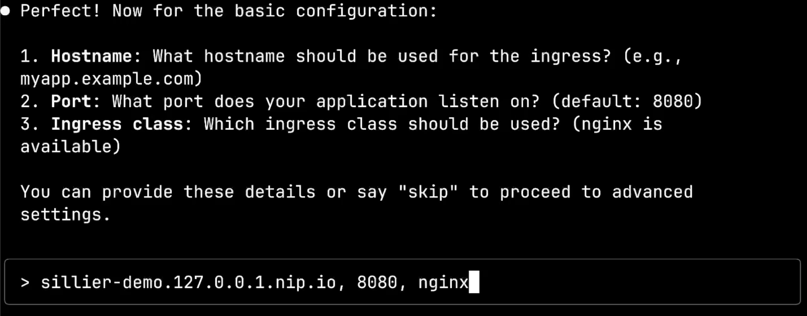

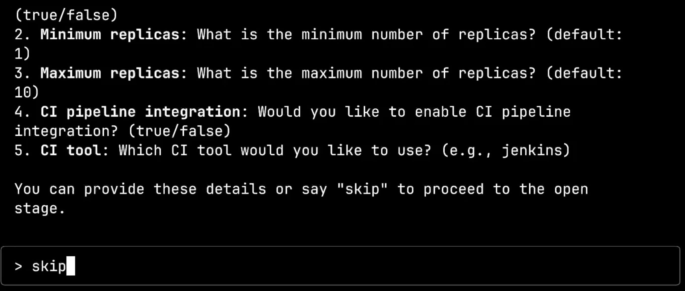

Now comes the crucial test. In the open configuration stage, I'll request persistent storage, knowing that the `App` CRD doesn't support storage attachments.

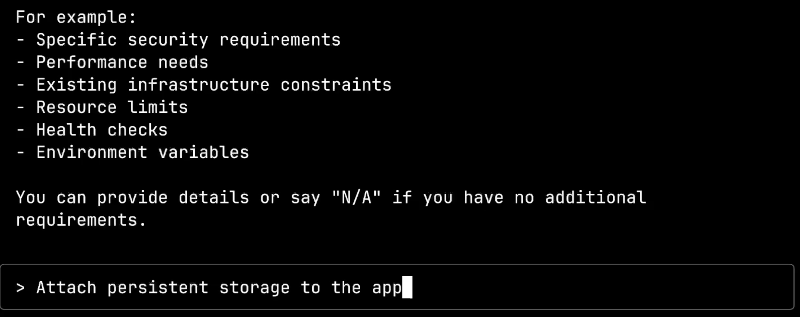

Here's the key behavior: instead of hallucinating or generating invalid manifests, the system properly recognizes that the selected `App` solution cannot fulfill my storage requirements. It aborts the process and asks me to start over, suggesting I choose a different solution that can handle persistent storage.

This is exactly the right behavior. The system maintains integrity by refusing to generate configurations that won't work, rather than creating broken deployments.

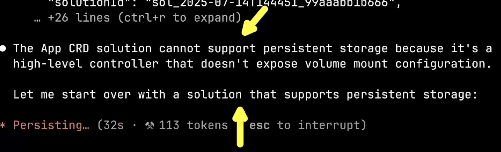

We've seen what happens when we ask a solution to do something it can't. But what if our intent itself doesn't fit the higher-level abstractions?

## Beyond Simple Abstractions

Now let's test what happens when we need something more complex than what the higher-level abstractions can provide. This time I'll request a stateful application with persistent storage.

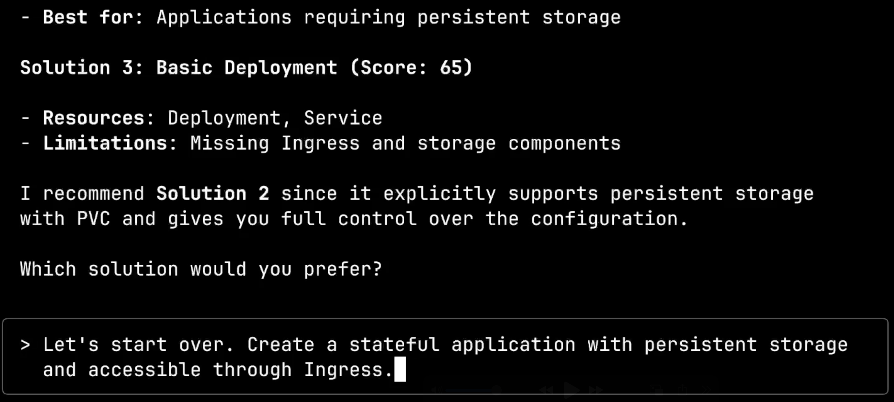

```
Create a stateful application with persistent storage and accessible through Ingress.
```

> Follow the on-screen instructions.

Notice something important here: when I specify persistent storage in my intent, the system's recommendations change dramatically. The **App** solution that was previously ranked at 95% confidence has now dropped significantly because it doesn't support persistent storage.

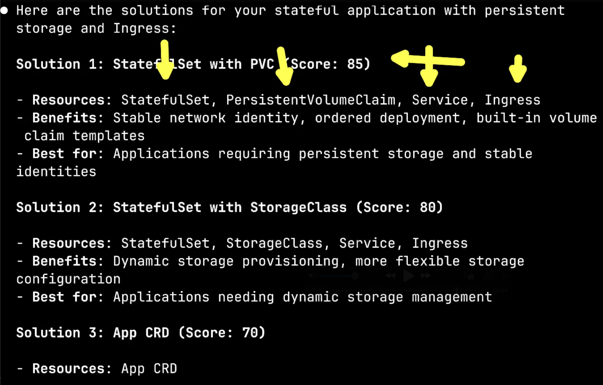

This demonstrates the first key insight: **app ranking adapts based on intent**. The system intelligently evaluates which solutions can actually fulfill your requirements. In cases where a solution fundamentally cannot meet your needs, it might not even appear in the recommendations.

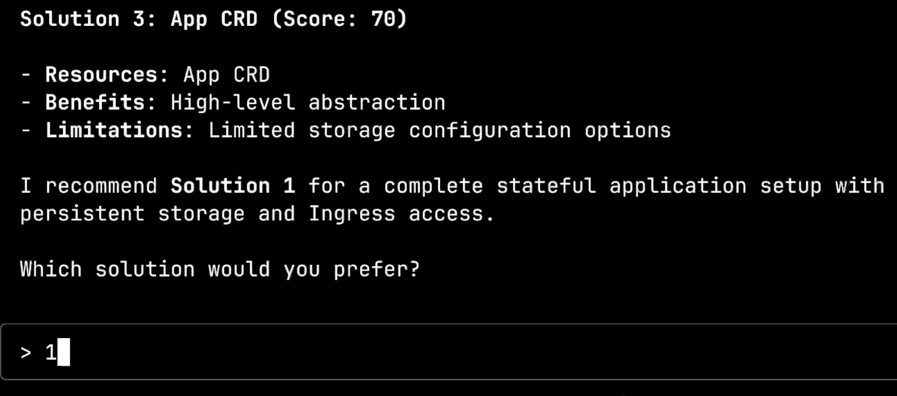

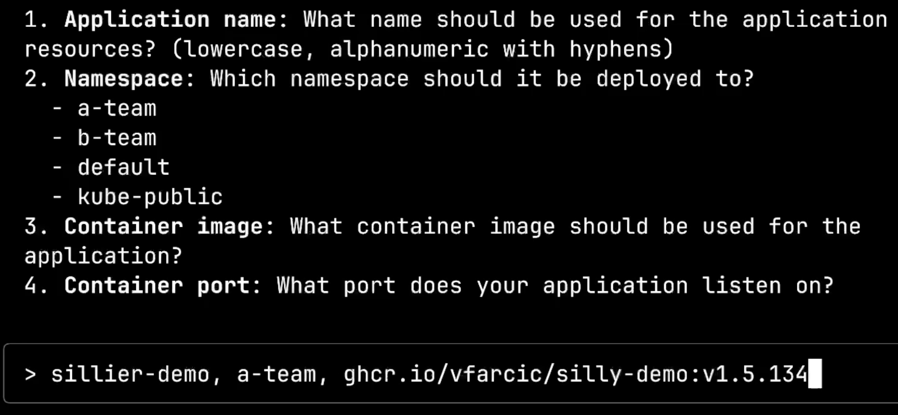

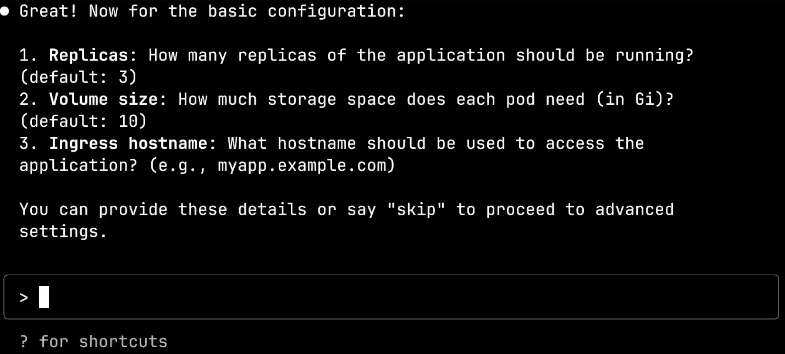

Here's the second key insight: **questions are dynamically generated**. The MCP doesn't ask generic questions. Instead, it generates questions specific to both the solution you chose and the intent you expressed. This ensures you're only asked for information that's relevant to your specific deployment scenario.

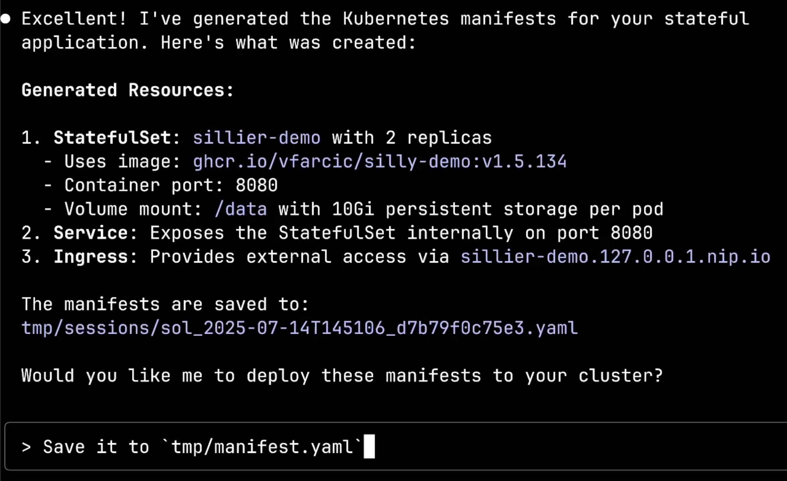

Now comes the third important insight about system flexibility. Instead of continuing with the standard MCP deployment process, you can circumvent it entirely. For example, by asking the client agent to save the manifest to a file instead of deploying it.

```
Can you save those manifests to `tmp/manifests.yaml`?
```

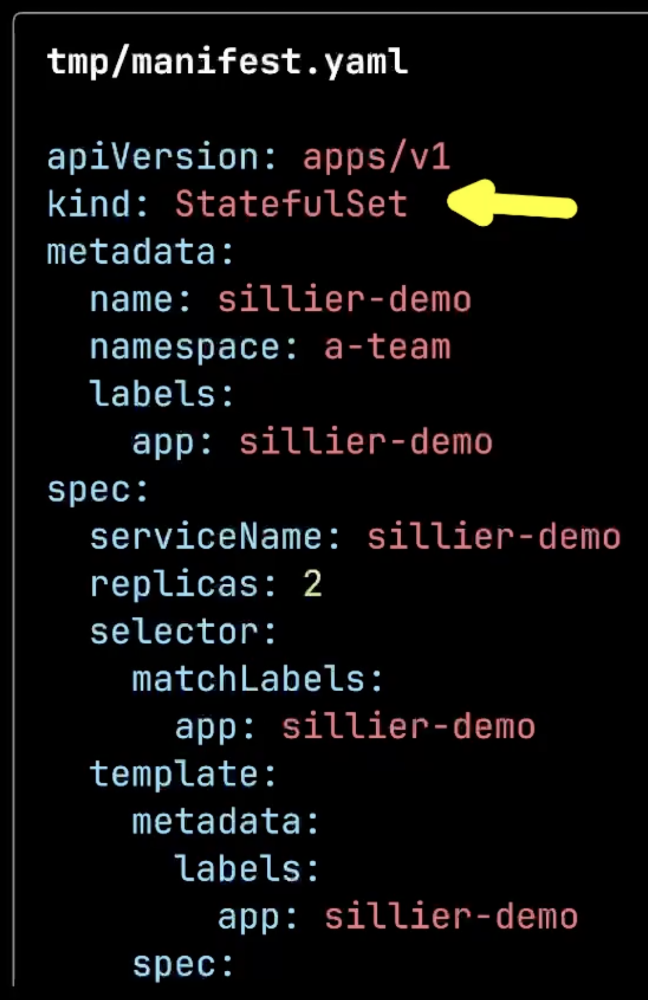

The system successfully generated a complete StatefulSet configuration with persistent storage through VolumeClaimTemplates, along with a Service and Ingress. This demonstrates how the AI can work with lower-level Kubernetes resources when higher-level abstractions aren't sufficient for complex stateful applications.

Now that we've seen dot-ai in action, let's explore the underlying design philosophy and discuss what improvements would be needed to make this a production-ready platform engineering solution.

## DevOps AI Toolkit Explained

The **DevOps AI Toolkit** (`dot-ai`) is a direct implementation of the concepts we discussed at the beginning. It combines AI knowledge with platform engineering constraints to help developers deploy applications to Kubernetes without needing deep infrastructure expertise. This isn't just theoretical anymore; it's a working system that demonstrates how AI can bridge the gap between what developers need and what platform engineers can provide.

The architecture is simple: the client agent remains a "generic" agent that can handle anything, while the `dot-ai` MCP focuses specifically on converting user intents into reality by combining available resources in a Kubernetes cluster. While the MCP can effectively act as a standalone agent, it works better when connected to a more generic agent. The MCP protocol proves superior to Agent2Agent and other protocols for this type of specialized integration.

Instead of platform engineers building rigid Internal Developer Platforms that assume what developers need, `dot-ai` lets developers express their intent and uses AI to figure out the optimal deployment strategy based on what's actually available in their cluster. This fundamentally changes the relationship between developers and infrastructure from a rigid, predefined interface to a flexible, conversational one.

The tool works by first discovering what's available in your Kubernetes cluster: which operators are installed, what CRDs are available, what storage classes exist, what ingress controllers are running, and much more. This discovery process captures the capabilities that platform engineers have set up, which AI doesn't inherently know about. It's this discovery phase that makes the system intelligent about your specific environment rather than just providing generic Kubernetes advice.

Once it understands your cluster's capabilities, `dot-ai` uses AI to recommend the optimal deployment strategy for your specific application and environment. The AI has the general Kubernetes knowledge, but now it also knows your specific cluster configuration. This combination of universal knowledge and local context is what makes the recommendations both technically sound and practically applicable.

The implementation provides two interfaces: a CLI and an MCP (which we explored in this post). Both are functionally the same and both combine code for predictable operations with an AI agent for parts of the flow that are unpredictable. This optimization avoids involving AI for repeatable operations, which would only slow things down and increase costs.

Currently, `dot-ai` is a proof of concept that demonstrates the core idea works, but it's missing several production-ready features. There's no observability for monitoring deployment processes and success rates. It lacks policies and governance for enforcing security requirements and compliance. Lifecycle management and operations like updates, rollbacks, and scaling aren't handled. The system doesn't learn from successful deployments to improve future recommendations. There's no caching of previous recommendations or cluster discovery results. And it only supports basic applications, not databases, clusters, networking, storage, and other resource types that production environments require.

Does this approach show promise for solving the platform engineering challenge we've been discussing? What do you think about the direction? Does it make sense investing more into this project? Would you like to help develop it further?

At the very least, giving it a star on https://github.com/vfarcic/dot-ai takes just a moment. Do it!

## Destroy

```sh
./dot.nu destroy
```

