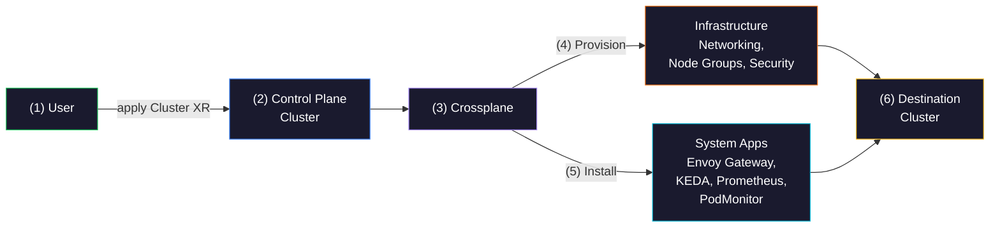
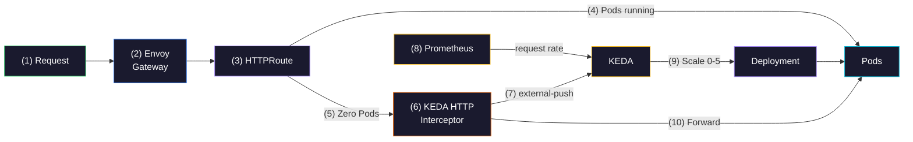

+++
title = "Kubernetes Serverless Without the Vendor Lock-In (Here's How)"
date = 2026-04-03T08:15:00+00:00
draft = false
+++

Traffic is never constant. Maybe your app gets hammered during business hours and barely touched at night. Maybe it's steady all day but spikes unpredictably. Maybe there are 15 minutes a day when nobody's using it at all. The point is, **a fixed number of replicas is always wrong**. You're either wasting resources or under-provisioned.


What you actually want is an app that scales with demand. More replicas when traffic goes up. Fewer when it drops. And in the extreme case, zero replicas when there's no traffic at all. Now, scaling to zero is easy. Just set the replica count to zero and you're done. The hard part is coming back up without losing any requests. If someone sends a request and nothing is running, that request needs to be held, not dropped.


That's what we're building today. Not with [Knative](https://knative.dev). Not with [AWS Lambda](https://aws.amazon.com/lambda). Just standard Kubernetes with a few smart components wired together. We'll start with a single static replica, add Prometheus-based autoscaling, and then push it all the way to true scale-to-zero with **zero lost requests**.

<!--more-->



## Setup

```sh
git clone https://github.com/vfarcic/crossplane-app

cd crossplane-app

git pull

git fetch

git switch demo/serverless
```

> Make sure that Docker is up-and-running. We'll use it to run create a KinD cluster.

> Watch [Nix for Everyone: Unleash Devbox for Simplified Development](https://youtu.be/WiFLtcBvGMU) if you are not familiar with Devbox. Alternatively, you can skip Devbox and install all the tools listed in `devbox.json` yourself.

```sh
devbox shell

./dot.nu setup-demo

source .env
```

## Kubernetes Scale-to-Zero Ready Cluster

Before we can run any apps, we need a cluster. But not just a bare cluster. We need one that comes with everything required to run applications that scale, including scaling all the way down to zero replicas.

The idea is simple. We define what we want, and the platform takes care of the rest. Think of it as Kubernetes-as-a-Service. A developer or a team says "give me a cluster with these capabilities," and the platform provisions the infrastructure, installs the right components, and wires everything together.

> The examples in this video are running in AWS. All the commands should stay the same for Azure and Google Cloud, but outputs might differ.

Here's what that looks like.

```sh
cat examples/$PROVIDER-k8s.yaml
```

This is what we get.

```yaml
apiVersion: devopstoolkit.ai/v2
kind: Cluster
metadata:
  name: a-team
spec:
  crossplane:
    compositionSelector:
      matchLabels:
        provider: aws
        cluster: eks
  parameters:
    nodeSize: medium
    minNodeCount: 2
    apps:
      envoyGateway:
        enabled: true
      keda:
        enabled: true
      prometheus:
        enabled: true
    namespaces:
      - dev
      - production
```

That's it. That's all a team needs to provide. A name, the cloud provider, node size, and which apps to enable.

Now, look at the `apps` section. There are four key components hiding behind those simple `enabled: true` flags.


`envoyGateway` gives us a [Gateway API](https://gateway-api.sigs.k8s.io) implementation. Think of it as the front door for all traffic coming into the cluster. Apps attach to it using *HTTPRoute* resources. And no, not Ingress. Gateway API is its successor, and we'll need its more advanced routing capabilities later.


`keda` is the scaling engine. It watches for signals like request rates or queue depth and adjusts replica counts accordingly. It also comes with an *HTTP Add-on* that we'll put to use shortly. And unlike [Knative](https://knative.dev), it doesn't replace your entire deployment model. You keep standard Deployments, Services, and HTTPRoutes.


`prometheus` collects metrics from the gateway and from apps, and feeds those signals to KEDA. That's what enables scaling based on actual request rates, latency percentiles, and error rates.

And finally, there's a **PodMonitor** that bridges Envoy Gateway and Prometheus by scraping proxy metrics so KEDA can scale based on actual traffic flowing through the gateway.


Here's what that looks like architecturally. A (1) user applies a Cluster resource to the (2) control plane cluster. (3) Crossplane picks it up and provisions all the (4) infrastructure in the destination: networking, node groups, security, all the plumbing. But it doesn't stop there. As part of the same Composition, it also (5) installs the system apps we asked for, Envoy Gateway, KEDA, Prometheus, and the PodMonitor, directly into the (6) destination cluster. One small YAML in, a fully operational cluster out.



Let's apply this and see what happens.

```sh
kubectl --namespace a-team apply --filename examples/$PROVIDER-k8s.yaml

viddy crossplane beta trace --namespace a-team clusters.devopstoolkit.ai a-team
```

> Wait until all resources are available. Press `ctrl+c` to exit `viddy`.

Here's what we got.


```text
NAME                                                           SYNCED   READY   STATUS
Cluster/a-team (a-team)                                        True     True    Available
├─ InternetGateway/a-team (a-team)                             True     True    Available
├─ MainRouteTableAssociation/a-team (a-team)                   True     True    Available
├─ RouteTableAssociation/a-team-1a (a-team)                    True     True    Available
├─ RouteTableAssociation/a-team-1b (a-team)                    True     True    Available
├─ RouteTableAssociation/a-team-1c (a-team)                    True     True    Available
├─ RouteTable/a-team (a-team)                                  True     True    Available
├─ Route/a-team (a-team)                                       True     True    Available
├─ SecurityGroupRule/a-team (a-team)                           True     True    Available
├─ SecurityGroup/a-team (a-team)                               True     True    Available
├─ Subnet/a-team-1a (a-team)                                   True     True    Available
├─ Subnet/a-team-1b (a-team)                                   True     True    Available
├─ Subnet/a-team-1c (a-team)                                   True     True    Available
├─ VPC/a-team (a-team)                                         True     True    Available
├─ Addon/a-team-ebs (a-team)                                   True     True    Available
├─ ClusterAuth/a-team (a-team)                                 True     True    Available
├─ Cluster/a-team (a-team)                                     True     True    Available
├─ NodeGroup/a-team (a-team)                                   True     True    Available
├─ ProviderConfig/a-team (a-team)                              -        -
├─ ProviderConfig/a-team-local (a-team)                        -        -
├─ Release/a-team-app-gateway-helm (a-team)                    True     True    Available
├─ Release/a-team-app-keda (a-team)                            True     True    Available
├─ Release/a-team-app-keda-add-ons-http (a-team)               True     True    Available
├─ Release/a-team-app-kube-prometheus-stack (a-team)           True     True    Available
├─ RolePolicyAttachment/a-team-cni (a-team)                    True     True    Available
├─ RolePolicyAttachment/a-team-controlplane (a-team)           True     True    Available
├─ RolePolicyAttachment/a-team-registry (a-team)               True     True    Available
├─ RolePolicyAttachment/a-team-service (a-team)                True     True    Available
├─ RolePolicyAttachment/a-team-worker (a-team)                 True     True    Available
├─ Role/a-team-controlplane (a-team)                           True     True    Available
├─ Role/a-team-nodegroup (a-team)                              True     True    Available
├─ Object/a-team-app-envoy-gateway (a-team)                    True     True    Available
├─ Object/a-team-app-envoy-gateway-class (a-team)              True     True    Available
├─ Object/a-team-app-envoy-gateway-pod-monitor (a-team)        True     True    Available
├─ Object/a-team-ns-dev (a-team)                               True     True    Available
├─ Object/a-team-ns-production (a-team)                        True     True    Available
├─ ProviderConfig/a-team (a-team)                              -        -
├─ Usage/a-team-app-envoy-gateway-class-usage (a-team)         -        True    Available
├─ Usage/a-team-app-envoy-gateway-pod-monitor-usage (a-team)   -        True    Available
├─ Usage/a-team-app-envoy-gateway-usage (a-team)               -        True    Available
├─ Usage/a-team-app-gateway-helm-usage (a-team)                -        True    Available
├─ Usage/a-team-app-keda-add-ons-http-usage (a-team)           -        True    Available
├─ Usage/a-team-app-keda-usage (a-team)                        -        True    Available
└─ Usage/a-team-app-kube-prometheus-stack-usage (a-team)       -        True    Available
```

That's a lot of resources from a pretty small YAML definition. The Composition took our simple spec and orchestrated the full setup behind the scenes. VPCs, subnets, security groups, roles, node groups... all the cloud plumbing you'd rather not deal with.

But for the purpose of this video, the interesting bits are the `Release` and `Object` resources. Those are the Helm charts and Kubernetes objects that installed `envoy-gateway`, `keda`, `prometheus`, and the `pod-monitor` into the remote cluster. That's what makes this cluster ready to run apps that scale.


Now, everything we've done so far was in the control plane cluster. We applied the resource there, and [Crossplane](https://www.crossplane.io) took care of creating everything in the remote destination cluster.


First, we need to grab the kubeconfig for the remote cluster so we can talk to it directly.

> If you are using Google Cloud, add `--project-id $PROJECT_ID` to the command that follows.

```sh
./dot.nu get kubeconfig $PROVIDER --name a-team --destination kubeconfig-remote.yaml \
    --resource_group a-team
```

> Whenever we use `kubeconfig-remote.yaml` we are talking directly to the destination cluster. We're doing that mainly to demonstrate how something works and what happened. In reality, users should be able to control everything through the control plane cluster (the one we're using without `--kubeconfig`).

Let's switch over to that destination cluster and confirm that everything actually landed.

```sh
kubectl --kubeconfig kubeconfig-remote.yaml get crds
```

The output is as follows.

```sh
NAME                                                  CREATED AT
alertmanagerconfigs.monitoring.coreos.com             2026-02-26T12:43:13Z
alertmanagers.monitoring.coreos.com                   2026-02-26T12:43:14Z
applicationnetworkpolicies.networking.k8s.aws         2026-02-26T12:37:37Z
backends.gateway.envoyproxy.io                        2026-02-26T12:43:19Z
backendtlspolicies.gateway.networking.k8s.io          2026-02-26T12:43:16Z
backendtrafficpolicies.gateway.envoyproxy.io          2026-02-26T12:43:19Z
clienttrafficpolicies.gateway.envoyproxy.io           2026-02-26T12:43:20Z
cloudeventsources.eventing.keda.sh                    2026-02-26T12:43:31Z
clustercloudeventsources.eventing.keda.sh             2026-02-26T12:43:31Z
clusternetworkpolicies.networking.k8s.aws             2026-02-26T12:37:37Z
clusterpolicyendpoints.networking.k8s.aws             2026-02-26T12:37:37Z
clustertriggerauthentications.keda.sh                 2026-02-26T12:43:31Z
cninodes.vpcresources.k8s.aws                         2026-02-26T12:37:37Z
eniconfigs.crd.k8s.amazonaws.com                      2026-02-26T12:39:11Z
envoyextensionpolicies.gateway.envoyproxy.io          2026-02-26T12:43:21Z
envoypatchpolicies.gateway.envoyproxy.io              2026-02-26T12:43:22Z
envoyproxies.gateway.envoyproxy.io                    2026-02-26T12:43:24Z
gatewayclasses.gateway.networking.k8s.io              2026-02-26T12:43:16Z
gateways.gateway.networking.k8s.io                    2026-02-26T12:43:16Z
grpcroutes.gateway.networking.k8s.io                  2026-02-26T12:43:16Z
httproutefilters.gateway.envoyproxy.io                2026-02-26T12:43:26Z
httproutes.gateway.networking.k8s.io                  2026-02-26T12:43:17Z
httpscaledobjects.http.keda.sh                        2026-02-26T12:43:36Z
podmonitors.monitoring.coreos.com                     2026-02-26T12:43:14Z
policyendpoints.networking.k8s.aws                    2026-02-26T12:37:37Z
probes.monitoring.coreos.com                          2026-02-26T12:43:15Z
prometheusagents.monitoring.coreos.com                2026-02-26T12:43:16Z
prometheuses.monitoring.coreos.com                    2026-02-26T12:43:17Z
prometheusrules.monitoring.coreos.com                 2026-02-26T12:43:18Z
referencegrants.gateway.networking.k8s.io             2026-02-26T12:43:16Z
scaledjobs.keda.sh                                    2026-02-26T12:43:31Z
scaledobjects.keda.sh                                 2026-02-26T12:43:31Z
scrapeconfigs.monitoring.coreos.com                   2026-02-26T12:43:19Z
securitygrouppolicies.vpcresources.k8s.aws            2026-02-26T12:37:37Z
securitypolicies.gateway.envoyproxy.io                2026-02-26T12:43:27Z
servicemonitors.monitoring.coreos.com                 2026-02-26T12:43:21Z
tcproutes.gateway.networking.k8s.io                   2026-02-26T12:43:16Z
thanosrulers.monitoring.coreos.com                    2026-02-26T12:43:22Z
tlsroutes.gateway.networking.k8s.io                   2026-02-26T12:43:16Z
triggerauthentications.keda.sh                        2026-02-26T12:43:31Z
udproutes.gateway.networking.k8s.io                   2026-02-26T12:43:16Z
xbackendtrafficpolicies.gateway.networking.x-k8s.io   2026-02-26T12:43:16Z
xlistenersets.gateway.networking.x-k8s.io             2026-02-26T12:43:16Z
xmeshes.gateway.networking.x-k8s.io                   2026-02-26T12:43:16Z
```

There it is. The destination cluster has everything we need. We can see the Gateway API CRDs like `gateways.gateway.networking.k8s.io` and `httproutes.gateway.networking.k8s.io` from Envoy Gateway. There's `scaledobjects.keda.sh` and `httpscaledobjects.http.keda.sh` from KEDA and its HTTP Add-on. And the Prometheus stack brought in `podmonitors.monitoring.coreos.com` and `servicemonitors.monitoring.coreos.com`. All the pieces are in place.

The cluster is ready. Now let's deploy an app and see how all of this comes together.

## From Static Replicas to Scale-to-Zero

Now comes the fun part. We have a cluster with all the right components installed. Let's deploy an app and progressively add scaling to it. We'll start with a single static replica, then add autoscaling based on traffic, and finally push it all the way to scale-to-zero.


We need to grab the external IP of the Gateway and set the hostname for our app manifests.

```sh
# Execute the command that follows only if you are using AWS
export APP_HOSTNAME=$(kubectl --kubeconfig kubeconfig-remote.yaml \
    --namespace envoy-gateway-system get gateway eg --output json \
    | jq ".status.addresses[0].value" --raw-output)

# Execute the command that follows only if you are using AWS
export APP_HOST=silly-demo.$(dig +short $APP_HOSTNAME).nip.io

# Execute the command that follows only if you are NOT using AWS
export APP_HOST=silly-demo.$(kubectl --kubeconfig kubeconfig-remote.yaml \
    --namespace envoy-gateway-system get gateway eg --output json \
    | jq ".status.addresses[0].value" --raw-output).nip.io

yq --inplace ".spec.host = \"$APP_HOST\"" examples/backend-single-replica.yaml

yq --inplace ".spec.host = \"$APP_HOST\"" examples/backend-scaling.yaml

yq --inplace ".spec.host = \"$APP_HOST\"" examples/backend.yaml
```

Let's start with the simplest possible setup. A single replica, no scaling, no magic.

```sh
cat examples/backend-single-replica.yaml
```

Here's what we get.

```yaml
apiVersion: devopstoolkit.live/v1beta1
kind: App
metadata:
  name: silly-demo
spec:
  crossplane:
    compositionSelector:
      matchLabels:
        type: backend
  image: ghcr.io/vfarcic/silly-demo
  tag: v1.5.235
  port: 8080
  host: silly-demo.34.231.32.236.nip.io
  routing: gateway-api
  providerConfigName: a-team
  targetNamespace: dev
```

Nothing fancy. An `image`, a `port`, a `hostname`, and `routing` set to `gateway-api` so it creates an *HTTPRoute* instead of an *Ingress*. No replica count, no scaling. Just deploy the thing and run it.

Let's apply it and see what Crossplane creates.

```sh
kubectl --namespace a-team apply --filename examples/backend-single-replica.yaml

crossplane beta trace --namespace a-team apps.devopstoolkit.live silly-demo
```

The output is as follows.

```text
NAME                                       SYNCED   READY   STATUS
App/silly-demo (a-team)                    True     True    Available
├─ Object/silly-demo-deployment (a-team)   True     True    Available
├─ Object/silly-demo-httproute (a-team)    True     True    Available
└─ Object/silly-demo-service (a-team)      True     True    Available
```

Three resources. A `Deployment`, an `HTTPRoute`, and a `Service`. That's the bare minimum to get an app running and accessible through the gateway.

Let's peek at the destination cluster to see what actually got created there.

```sh
kubectl --kubeconfig kubeconfig-remote.yaml --namespace dev get all,httproutes
```

Here's what that gives us.

```text
NAME                             READY   STATUS    RESTARTS   AGE
pod/silly-demo-95fb47455-t4vsc   1/1     Running   0          42s

NAME                 TYPE        CLUSTER-IP      EXTERNAL-IP   PORT(S)    AGE
service/silly-demo   ClusterIP   172.20.10.218   <none>        8080/TCP   42s

NAME                         READY   UP-TO-DATE   AVAILABLE   AGE
deployment.apps/silly-demo   1/1     1            1           42s

NAME                                   DESIRED   CURRENT   READY   AGE
replicaset.apps/silly-demo-95fb47455   1         1         1       42s

NAME                                             HOSTNAMES                            AGE
httproute.gateway.networking.k8s.io/silly-demo   ["silly-demo.35.196.58.57.nip.io"]   43s
```

One `Pod`, one `Service`, one `HTTPRoute`. Everything's running. Let's confirm it actually responds.

```sh
curl $APP_HOST
```

This is what we got.

```text
This is a silly demo
```

Now let's throw some traffic at it. A hundred thousand requests at 200 per second.

```sh
hey -n 100000 -q 200 http://$APP_HOST
```


Here's what we got.

```text
Summary:
  Total:        228.9677 secs
  Slowest:      0.5365 secs
  Fastest:      0.1079 secs
  Average:      0.1142 secs
  Requests/sec: 436.7428

  Total data:   2100000 bytes
  Size/request: 21 bytes

Response time histogram:
  0.108 [1]     |
  0.151 [99135] |■■■■■■■■■■■■■■■■■■■■■■■■■■■■■■■■■■■■■■■■
  0.194 [473]   |
  0.236 [113]   |
  0.279 [107]   |
  0.322 [73]    |
  0.365 [46]    |
  0.408 [28]    |
  0.451 [11]    |
  0.494 [9]     |
  0.536 [4]     |


Latency distribution:
  10% in 0.1109 secs
  25% in 0.1116 secs
  50% in 0.1128 secs
  75% in 0.1141 secs
  90% in 0.1155 secs
  95% in 0.1172 secs
  99% in 0.1464 secs

Details (average, fastest, slowest):
  DNS+dialup:   0.0001 secs, 0.1079 secs, 0.5365 secs
  DNS-lookup:   0.0000 secs, 0.0000 secs, 0.0068 secs
  req write:    0.0000 secs, 0.0000 secs, 0.0030 secs
  resp wait:    0.1140 secs, 0.1079 secs, 0.5364 secs
  resp read:    0.0000 secs, 0.0000 secs, 0.0030 secs

Status code distribution:
  [200] 100000 responses
```

All `100000` requests came back with `200`. Let's check how many `Pods` were handling that.

```sh
kubectl --kubeconfig kubeconfig-remote.yaml --namespace dev get pods
```

The output is as follows.

```text
NAME                         READY   STATUS    RESTARTS   AGE
silly-demo-95fb47455-l5s9m   1/1     Running   0          10m
```

Still just one `Pod`. This is a small and relatively performant app, so a single replica handled it fine. But if we had a more demanding application or more concurrent requests, we'd start seeing failures or slower response times. A single replica can't handle infinite load.

So let's fix that. Let's add autoscaling.

```sh
cat examples/backend-scaling.yaml
```

Here's what we get.

```yaml
apiVersion: devopstoolkit.live/v1beta1
kind: App
metadata:
  name: silly-demo
spec:
  crossplane:
    compositionSelector:
      matchLabels:
        type: backend
  image: ghcr.io/vfarcic/silly-demo
  tag: v1.5.235
  port: 8080
  host: silly-demo.34.231.32.236.nip.io
  routing: gateway-api
  providerConfigName: a-team
  targetNamespace: dev
  minReplicas: 1
  maxReplicas: 5
  scaling:
    enabled: true
    prometheusAddress: http://kube-prometheus-stack-prometheus.prometheus-system:9090
```

It's the same app, but now we've added `minReplicas`, `maxReplicas`, and `scaling` with a Prometheus address. Let's apply it and see what changes.

```sh
kubectl --namespace a-team apply --filename examples/backend-scaling.yaml

crossplane beta trace --namespace a-team apps.devopstoolkit.live silly-demo
```

The output is as follows.

```text
NAME                                          SYNCED   READY   STATUS
App/silly-demo (a-team)                       True     True    Available
├─ Object/silly-demo-deployment (a-team)      True     True    Available
├─ Object/silly-demo-httproute (a-team)       True     True    Available
├─ Object/silly-demo-scaled-object (a-team)   True     True    Available
└─ Object/silly-demo-service (a-team)         True     True    Available
```

There's a new resource in the mix. The Composition created a KEDA `ScaledObject` that watches the request rate coming through the gateway and adjusts replicas between 1 and 5.

Let's look at the destination cluster to see what's there now.

```sh
kubectl --kubeconfig kubeconfig-remote.yaml --namespace dev get all,httproutes,scaledobjects
```

Here's what that gives us.

```
NAME                             READY   STATUS    RESTARTS   AGE
pod/silly-demo-95fb47455-t4vsc   1/1     Running   0          12m

NAME                 TYPE        CLUSTER-IP      EXTERNAL-IP   PORT(S)    AGE
service/silly-demo   ClusterIP   172.20.10.218   <none>        8080/TCP   12m

NAME                         READY   UP-TO-DATE   AVAILABLE   AGE
deployment.apps/silly-demo   1/1     1            1           12m

NAME                                   DESIRED   CURRENT   READY   AGE
replicaset.apps/silly-demo-95fb47455   1         1         1       12m

NAME                                                      REFERENCE               TARGETS         MINPODS   MAXPODS   REPLICAS   AGE
horizontalpodautoscaler.autoscaling/keda-hpa-silly-demo   Deployment/silly-demo   19m/100 (avg)   1         5         1          27s

NAME                                             HOSTNAMES                             AGE
httproute.gateway.networking.k8s.io/silly-demo   ["silly-demo.34.231.32.236.nip.io"]   12m

NAME                              SCALETARGETKIND      SCALETARGETNAME   MIN   MAX   READY   ACTIVE   FALLBACK   PAUSED   TRIGGERS     AUTHENTICATIONS   AGE
scaledobject.keda.sh/silly-demo   apps/v1.Deployment   silly-demo        1     5     True    True     False      False    prometheus                     27s
```

We can see the `ScaledObject` with a `prometheus` trigger, and KEDA created an `HorizontalPodAutoscaler` with a threshold of `100`. That means KEDA will add a replica for every 100 requests per second measured over a 2-minute window.

Let's throw the same load at it and see what happens.

```sh
hey -n 100000 -q 200 http://$APP_HOST
```


Here's what we got.

```text
Summary:
  Total:        226.9694 secs
  Slowest:      0.3962 secs
  Fastest:      0.1075 secs
  Average:      0.1132 secs
  Requests/sec: 440.5880

  Total data:   2100000 bytes
  Size/request: 21 bytes

Response time histogram:
  0.108 [1]     |
  0.136 [99497] |■■■■■■■■■■■■■■■■■■■■■■■■■■■■■■■■■■■■■■■■
  0.165 [237]   |
  0.194 [64]    |
  0.223 [52]    |
  0.252 [36]    |
  0.281 [37]    |
  0.310 [20]    |
  0.338 [15]    |
  0.367 [0]     |
  0.396 [41]    |


Latency distribution:
  10% in 0.1106 secs
  25% in 0.1114 secs
  50% in 0.1125 secs
  75% in 0.1137 secs
  90% in 0.1148 secs
  95% in 0.1158 secs
  99% in 0.1239 secs

Details (average, fastest, slowest):
  DNS+dialup:   0.0001 secs, 0.1075 secs, 0.3962 secs
  DNS-lookup:   0.0000 secs, 0.0000 secs, 0.0661 secs
  req write:    0.0000 secs, 0.0000 secs, 0.0018 secs
  resp wait:    0.1130 secs, 0.1074 secs, 0.3313 secs
  resp read:    0.0000 secs, 0.0000 secs, 0.0039 secs

Status code distribution:
  [200] 100000 responses
```

Again, all `200` responses. Now let's check the Pods.

```sh
kubectl --kubeconfig kubeconfig-remote.yaml --namespace dev get pods
```

The output is as follows.

```
NAME                         READY   STATUS    RESTARTS   AGE
silly-demo-95fb47455-5df2p   1/1     Running   0          5m29s
silly-demo-95fb47455-ht44g   1/1     Running   0          3m44s
silly-demo-95fb47455-k52g6   1/1     Running   0          4m14s
silly-demo-95fb47455-l5s9m   1/1     Running   0          16m
silly-demo-95fb47455-s5l2v   1/1     Running   0          5m29s
```

There are multiple replicas now. KEDA scaled the app. With 200 requests per second and a threshold of 100 requests per replica, KEDA calculated that it needed at least 2 replicas. But because the load was sustained, it kept scaling up. It won't go beyond 5 though, since that's the `maxReplicas` we set.

Now, what happens when the traffic stops? Let's wait a bit...

```sh
kubectl --kubeconfig kubeconfig-remote.yaml --namespace dev get pods
```

This is what we got.

```
NAME                         READY   STATUS    RESTARTS   AGE
silly-demo-95fb47455-l5s9m   1/1     Running   0          20m
silly-demo-95fb47455-s5l2v   1/1     Running   0          9m35s
silly-demo-95fb47455-ht44g   1/1     Running   0          8m32s
```

Down to three. KEDA is scaling down gradually as the request rate drops. Let's wait a bit longer...

```sh
kubectl --kubeconfig kubeconfig-remote.yaml --namespace dev get pods
```

Here's what we get.

```
NAME                         READY   STATUS    RESTARTS   AGE
silly-demo-95fb47455-l5s9m   1/1     Running   0          21m
```

Back to one. That's our *minReplicas*. KEDA won't go below that.

But what if we don't want even one replica running when there's no traffic? What if we want to go all the way to zero?

```sh
cat examples/backend.yaml
```

Here's what we get.

```yaml
apiVersion: devopstoolkit.live/v1beta1
kind: App
metadata:
  name: silly-demo
spec:
  crossplane:
    compositionSelector:
      matchLabels:
        type: backend
  image: ghcr.io/vfarcic/silly-demo
  tag: v1.5.235
  port: 8080
  host: silly-demo.34.231.32.236.nip.io
  routing: gateway-api
  providerConfigName: a-team
  targetNamespace: dev
  minReplicas: 0
  maxReplicas: 5
  scaling:
    enabled: true
    prometheusAddress: http://kube-prometheus-stack-prometheus.prometheus-system:9090
```

The only change is `minReplicas` set to `0`. Now, you might think that simply setting the minimum to zero would cause problems. If there are no Pods, requests would get *503* responses. Even if KEDA scaled the app back up, those initial requests would be lost. Scaling to zero is easy. Not losing requests when there's nothing to respond is the hard part.

But let's apply it and see what actually happens.

```sh
kubectl --namespace a-team apply --filename examples/backend.yaml

crossplane beta trace --namespace a-team apps.devopstoolkit.live silly-demo
```

The output is as follows.

```text
NAME                                               SYNCED   READY   STATUS
App/silly-demo (a-team)                            True     True    Available
├─ Object/silly-demo-deployment (a-team)           True     True    Available
├─ Object/silly-demo-http-scaled-object (a-team)   True     True    Available
├─ Object/silly-demo-httproute (a-team)            True     True    Available
├─ Object/silly-demo-reference-grant (a-team)      True     True    Available
├─ Object/silly-demo-scaled-object (a-team)        True     True    Available
└─ Object/silly-demo-service (a-team)              True     True    Available
```

Now we have six resources instead of four. The Composition detected that *minReplicas* is *0* and automatically added an `HTTPScaledObject` and a `ReferenceGrant`. The *HTTPScaledObject* registers the app with KEDA's HTTP Add-on interceptor, so incoming requests get held while Pods spin up. The *ReferenceGrant* allows the *HTTPRoute* in the *dev* namespace to point traffic to the interceptor in the *keda* namespace, since Gateway API requires explicit cross-namespace permission.

Let's look at the destination cluster.

```sh
kubectl --kubeconfig kubeconfig-remote.yaml --namespace dev get all,httproutes,scaledobjects
```

Here's what that gives us.

```text
NAME                 TYPE        CLUSTER-IP      EXTERNAL-IP   PORT(S)    AGE
service/silly-demo   ClusterIP   172.20.10.218   <none>        8080/TCP   38m

NAME                         READY   UP-TO-DATE   AVAILABLE   AGE
deployment.apps/silly-demo   0/0     0            0           38m

NAME                                   DESIRED   CURRENT   READY   AGE
replicaset.apps/silly-demo-95fb47455   0         0         0       38m

NAME                                                      REFERENCE               TARGETS                                    MINPODS   MAXPODS   REPLICAS   AGE
horizontalpodautoscaler.autoscaling/keda-hpa-silly-demo   Deployment/silly-demo   <unknown>/100 (avg), <unknown>/100 (avg)   1         5         0          12m

NAME                                             HOSTNAMES                             AGE
httproute.gateway.networking.k8s.io/silly-demo   ["silly-demo.34.231.32.236.nip.io"]   38m

NAME                              SCALETARGETKIND      SCALETARGETNAME   MIN   MAX   READY   ACTIVE   FALLBACK   PAUSED   TRIGGERS                   AUTHENTICATIONS   AGE
scaledobject.keda.sh/silly-demo   apps/v1.Deployment   silly-demo        0     5     True    False    False      False    prometheus,external-push                     12m
```

No *Pods*. Zero replicas. The `Deployment` is at `0/0`. And notice the `ScaledObject` now has two triggers: `prometheus` for steady-state scaling and `external-push` for cold starts. The Prometheus trigger alone can't handle scale-from-zero because with no *Pods*, there's no traffic hitting the gateway, so the metric stays at zero and KEDA would never scale up. The *external-push* trigger connects to the HTTP Add-on's interceptor, which detects pending requests and pushes a signal to KEDA.

We can also see the `ReferenceGrant` in the `keda` namespace.

```sh
kubectl --kubeconfig kubeconfig-remote.yaml --namespace keda get referencegrants
```

The output is as follows.

```text
NAME                   AGE
silly-demo-httproute   62s
```

Now for the moment of truth. There are zero Pods running. Let's send a request.

```sh
curl $APP_HOST
```

```
This is a silly demo
```

It worked. We got a response despite having zero Pods running. It took a few seconds though. That's the cold-start penalty. The interceptor held the request, KEDA scaled the Deployment from 0 to 1, and once the Pod was ready, the request was forwarded.

Let's confirm there's a Pod now.

```sh
kubectl --kubeconfig kubeconfig-remote.yaml --namespace dev get pods
```

The output is as follows.

```text
NAME                         READY   STATUS    RESTARTS   AGE
silly-demo-95fb47455-5mj6t   1/1     Running   0          29s
```

There it is. Now let's send another request.

```sh
curl $APP_HOST
```

This is what we got.

```text
This is a silly demo
```

This time the response was almost instant. The Pod was already running, so there was no cold-start delay.

Now let's throw load at it again to confirm it still scales up under pressure.

```sh
hey -n 100000 -q 200 http://$APP_HOST
```


Let's check the `Pods`.

```sh
kubectl --kubeconfig kubeconfig-remote.yaml --namespace dev get pods
```

Here's what we got.

```text
NAME                         READY   STATUS    RESTARTS   AGE
silly-demo-95fb47455-5mj6t   1/1     Running   0          8m
silly-demo-95fb47455-r7k2p   1/1     Running   0          3m
silly-demo-95fb47455-w4n8x   1/1     Running   0          3m
silly-demo-95fb47455-j9d3f   1/1     Running   0          4m
silly-demo-95fb47455-q2v6b   1/1     Running   0          3m
```

Five replicas, just like before. The scale-up behavior is the same whether *minReplicas* is 0 or 1. Now let's wait for the traffic to stop and see what happens.

```sh
kubectl --kubeconfig kubeconfig-remote.yaml --namespace dev get pods
```

Here's what we get.

```text
No resources found in dev namespace.
```

It scaled all the way back down to zero. No Pods, no resources consumed. Let's send a request again to confirm it still comes back to life.

```sh
curl $APP_HOST
```

This is what we got.

```text
This is a silly demo
```

And one more check.

```sh
kubectl --kubeconfig kubeconfig-remote.yaml --namespace dev get pods
```

The output is as follows.

```text
NAME                         READY   STATUS    RESTARTS   AGE
silly-demo-95fb47455-m8t4a   1/1     Running   0          12s
```

Back from the dead. The full cycle works. Scale up under load, scale down to zero when idle, and come back to life on the next request without losing a single one.


Let's zoom out and look at how all of this fits together. A (1) request hits the (2) Envoy Gateway, which routes it through an (3) HTTPRoute. Now here's where it gets interesting. If the app has (4) running Pods, the request goes straight to them. Done. But if there are (5) zero Pods, the HTTPRoute points to the (6) KEDA HTTP Add-on interceptor instead. The interceptor holds the request and sends an (7) external-push signal to KEDA. KEDA also watches (8) Prometheus for request-rate metrics during steady state. Based on those signals, KEDA (9) scales the Deployment, anywhere from zero to five replicas. Once the Pod is ready, the interceptor (10) forwards the held request. No requests lost. And when traffic stops, the whole thing scales back down to zero. That's the full cycle.



## Kubernetes Serverless Pros and Cons

So, should you do this? Let's be honest about the trade-offs.

On the downside, there's **cold-start latency**. When your app is at zero replicas, the first request has to wait for a Pod to spin up. But think about it. If the app scaled to zero, it means nobody was using it for a while. The first person coming back after a period of inactivity probably won't mind a couple of extra seconds. And if traffic is constant, the app never reaches zero replicas anyway, so cold-start never triggers. It's real, but in practice it's rarely a problem.

Then there's the **interceptor**. It holds requests in memory while Pods start. If there's a sudden burst of thousands of requests hitting a cold app, the interceptor has to buffer all of them. That has limits.

And yes, there's some **extra complexity**, but honestly, not much. You need a gateway for incoming traffic, and you should be using Gateway API over Ingress anyway. Some form of autoscaling is inevitable, and KEDA is arguably the best choice for that. Prometheus, or a Prometheus-compatible solution, is the golden standard for metrics, and even if you choose something else, KEDA works with almost anything. So unless you've decided not to collect metrics, which would be silly, a metrics solution is already there. The only component you might not normally have is the **KEDA HTTP Add-on**. That's the one truly extra piece. The beauty of this approach is that it leverages components that should already be in your cluster, with or without scale-to-zero.

Now, the upside. You get **real resource efficiency**. Apps that sit idle aren't consuming CPU and memory. In a cluster with dozens of services, and most of them idle most of the time, the savings add up fast.

You keep **standard Kubernetes primitives**. Deployments, Services, HTTPRoutes. No custom serving layer. No vendor lock-in. Your app doesn't need to know it's being scaled to zero.

And the scaling is **metrics-driven**. KEDA watches actual request rates from Prometheus, not just CPU or memory. That means scaling decisions are based on real traffic patterns, which is far more responsive than generic HPA thresholds.

Here's the bottom line. If you have apps with variable traffic, especially ones that go idle for stretches of time, this setup gives you **serverless behavior without leaving Kubernetes**. And given that the components involved are ones you should already have, there's very little reason not to.

## Destroy

```sh
./dot.nu destroy-demo
```
