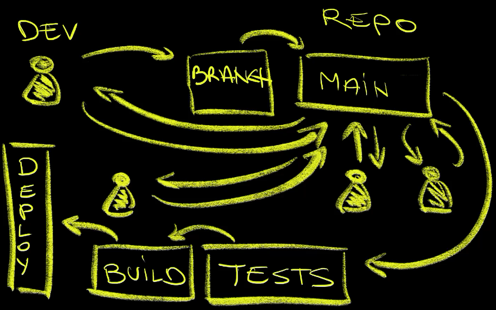
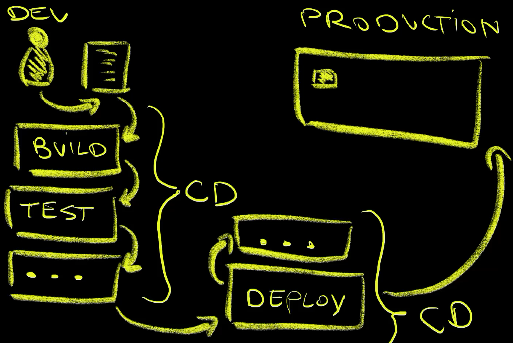
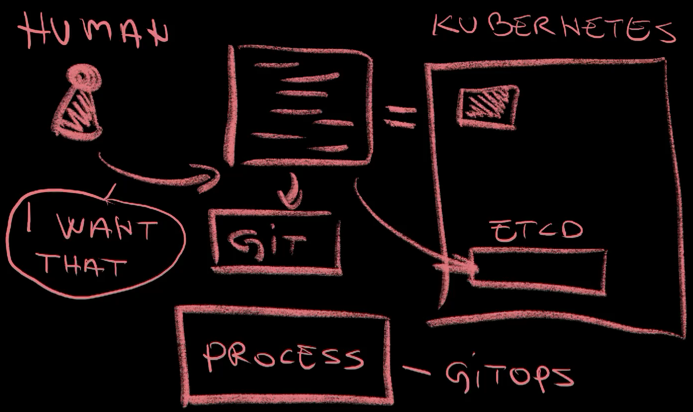
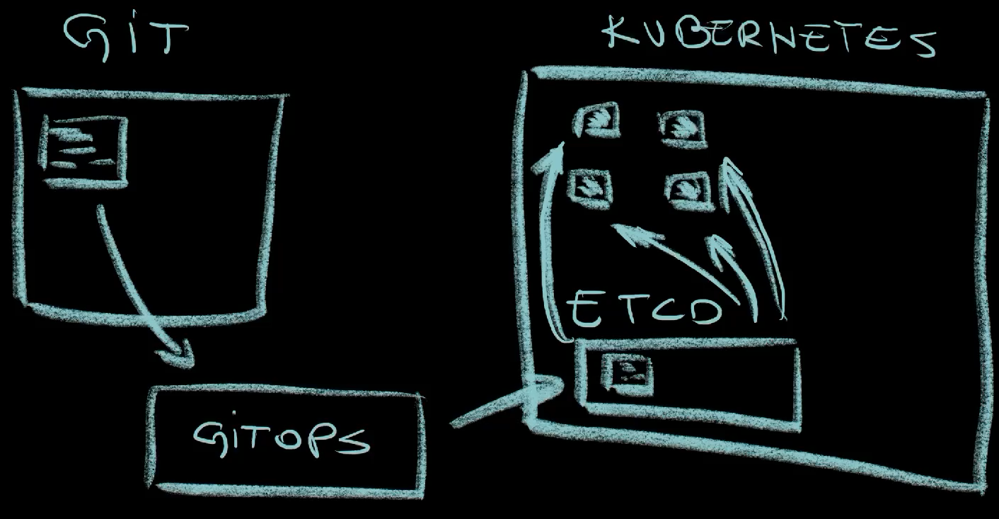
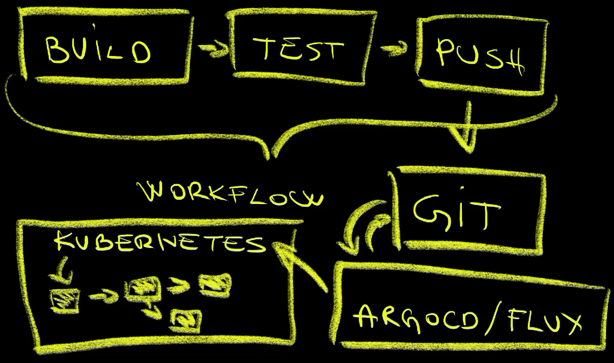

+++
title = 'CI vs. CD vs. GitOps vs. State Management: What is the Real Difference?'
date = 2024-10-28T00:00:00+00:00
draft = false
+++

Today I want to answer a set of questions I get fairly often. People ask me to compare GitOps with CI/CD or to explain the difference between CI and CD. At other times, I hear people talk about those terms with confidence, yet often with missunderstanding of what those are. To make things more complicated, tools tend to have missguided names that often make the situation even more complicated. So, today's session will explain the differences between Continuous Integration or CI, Continuous Delivery or CD, and GitOps. We'll add state management to the mix and we'll go not only through processes and activities related to those terms, but also try to demistify the tools in those areas. As a bonus, we'll add visualization challenges. Who knows? We might come to the conclusion that we are doing it all wrong or that our expectations are unrealistic.

<!--more-->



To begin with, let me start by saying that the question about the differences between **CI**, **CD**, **GitOps**, and **state management** is completely **wrong** since it tries to compare processes to specific activities. We cannot compare those since that would be comparison between apples and tomatoes. Both are fruit, even though many think that one of those is a vegetable. More imporantly, they taste differently and are used for very different purposes. The same goes for processes and specific activities, so we need to demistify those first.

Let's start with processes.

CI and CD are processes.

Continuous Integration or CI is a process or a practice where developers **regularly merge their code into main branches of repositories**. They could be creating short-lived branches and merging them into the mainline, or pushing there directly. That part is not important. What matters is that code changes arrive to the mainline regularly. The idea is to have continuous validation that the code changes we're making are correct. That way, we are constantly combining the code of everyone working on a project with the code running in production. In other words, everyone is pushing to the mainline regularly and everyone is getting code of everyone else. The alternative is to delay merging of everyone's work which often results in accumilated dept. Now, regular merging into the mainline would not make sense without, at least, automated tests. Hence, CI is, most of the time, accompanied by automated workflows triggered every time we merge to the mainline or through pull requests before merging to the mainline. The primary task of those workflows is to run tests of different kinds, be it unit tests, functional test, integration tests, or whatever else we think is relevant to confirm that the changes to the code are working correctly. Such workflows often contain other tasks that are necessary for those tests to run. We might, for example, be building binaries and container images which are needed to deploy our applications to ephemeral environments, but not production. Continuous Integration is not about making continuous releases to production but, rather, about continuous validation of the changes made by everyone working on a project. If we do want to deploy to production regularly, we should adopt Continuous Delivery or CD.

CD is all about **regularly delivering code changes to production**. Now, that might lead some to think that it is all about deployments to production. Some even call it Continuous Deployment. That would not make any sense. It's easy to continuously deploy something to production. All it takes would be to execute `kubectl apply`, `helm upgrade`, or whatever your deployment mechanism is. That would be silly since it's not about regular deployment to production but, rather, about regular deployment to production of code that most likely works. Hence, all the steps we would normally execute to validate code changes must be part of Continuous Delivery, and than some. That means that we do have to practice Continuous Integration if we want to do Continuous Delivery. We could only be doing CI but we **cannot do CD without CI**. Hence, CI is a subset of CD. Continuous Delivery should contain everything Continuous Integration contains, and then some. That "some", might be only deployments, but might also be additional testing, observability, and quite a few other activities or tasks.

If you want a simpler explanation, we could define Continuous Integration as all the activities required to validate a change of the code and Continuous Delivery as all that plus deployment to production and other activities that follow it.

Now, to practice CI or CD processes, we need to perform some activities like testing, building, deploying, and so on and so forth. We can split those activities into two major groups.

There is execution of one-shot actions and there is maintenance of a state.

One shot-actions are those that are **executed once**, and only once. Pushing code changes to Git is a one-shot action. Running tests that validate those changes to the source code is one-shot action. Building and pushing images based on those changes are one-shot actions. Those are all activities that happen once and only once for a given change to the source code. We could add deployments to that group as well. As a matter of fact, most of us do not only build, push, and test code changes, but also deploy them to different environments, including production. We'll get back to that one, to deployments, in a moment since they might be one-shot actions but, maybe, should not be. Maybe we learned our lesson.

The best way to automate one-shot actions is through **workflows or pipelines** like Jenkins, GitHub Actions, Argo Workflows, and so on and so forth.

*Do not mistake Argo Workflows with Argo CD which is commonly called just Argo. Those are very different tools from the same group of projects.*

Workflows managed by those tools are, typically, triggered by an event like a push to a code repository or a successfull rollout of a new release.

Now, to be clear, none of those tools should be called CI and especially not CD. They are all executors of workflows which happen to be commonly used to automate CI or CD processes. Nevertheless, they can be used for many other processes. Similarly, using any of those tools does not automatically mean that we are practicing CI or CD. Adopting Jenkins, or any other similar tool, does not automagically make you a CI or CD practitioner. If you regularly validate or validate and deploy code to production you are practicing CI or CD. If you are, you might be doing it using workflow or pipeline tools, or you might be using something else.

Besides one-shot actions, we also have maintenance of a state.

If we want to have a new release running in production, we want that to be the new state permanently or, at least, until we change our mind by, lets say, creating a new release. We do not want that release to be running only at the moment we deployed it. We want our users to use it no matter what and we want it to meet certain conditions like response time. That release should be running in production no matter what. Whatever happens to it should be undone. It should always be in a specific state.

In those cases when we want to ensure that a release meets user's expecations no matter what, executing one-shot actions that would deploy a new release is not enough. We don't want to have that release running right now and pray to our deity of choice that it continues running. Instead, we might want to ensure that release is running permanently or, at least, until we say otherwise. We might need a mechanism that will not only deploy that new release but ensure that it is up and running indefinitely.

To accomplish that we do not need one-shot actions but a process that will **constantly compare the actual to the desired state**, **detect drifts**, and **reconcile** them. How do we do that?

We, humans, define the desired state. That's what we want to have. That would be the full definition of what an application is, what a database is, what a cluster is, and so on and so forth. It's what we want. Then there is the actual state. That's what something is. There can be a drift between the two. We might want to have release 3 in production but, in reality, release 2 is what might be running. We might want to have the application having between 3 and 5 replicas (depending on the traffic), but, in reality, none of those might be running because it all crashed down. Those are drifts and we need a process that constantly looks for those.

Finally, we need a process that will reconcile those drifts and do what needs to be done to make the actual state of something exactly the same as the desired state. Today, the widely accepted mechanism to accomplish all that is called **GitOps** and is implemented through tools like Argo CD and Flux, but also quite a few others. Kubernetes itself does continuous drift detection and reconciliation and the major difference is that the desired state in Kubernetes is stored in etcd, its internal database. On the other hand, GitOps tools tend to use Git as the storage for the desired state. In either case, those tools monitor the database, which, in this context, is Git, that contain the desired state as well as servers or clusters that contain the actual state. When a drift is detected, they will reconcile it by changing the actual state to be the same as the desired state.

So, state management can be done through many different tools. Some of those are in the GitOps category like Argo CD and Flux. Those store the desired state in Git. Others do not use Git to store the desired state and the best example would be Kubernetes itself. What they all have in common is that they look for the differences between the desired and the actual state and reconcile them. There are obvious advantages to storing the desired state in Git like revisions, reviews and approvals through pull requests, and many others. Still, Git is, conceptually the same as etcd in Kubernetes in this context since both serve as storage for the desired state. So, we can call all those state management tools with those under the GitOps umbrella being a specific group within the wider category.

The important thing to note is that we do not have to choose only one of those. More often than not, we might combine them. For example, we can use GitOps tools to manage the state between Git and Kubernetes with Git holding the desired and Kubernetes, from the GitOps perspective, the actual state. However, what GitOps tools call the actual state is not really the actual state but, rather, yet the same desired state but stored in Kubernetes. The actual state is not, for example, a Kubernetes Deployment but containers running in it. The actual state is the final destination or the final resource.

Let's get back to the begining.

We perform some activities with workflows or pipelines like Jenkins, GitHub Actions, Argo Workflows, and other similar tools. They are all designed to execute specific actions in specific order and as a reaction to specific events. Most of the time, we use them to execute one-shot actions.

Then we have maintenance of a state that tends to rely on continous drift-detection and reconciliation. That can be accomplished through GitOps tools but also through Kubernetes, or Chef or Puppet, God rest their souls, or one of the many other tools. The major difference is the source that contains the desired state and the destination that represents the actual resources. **GitOps** alone **does not manage the actual state** but acts as a bridge between the desired state stored in Git and that same desired state stored in Kubernetes. Even Kubernetes might not contain the actual state since we might, for example, use it to manage resources in hyperscalers like AWS, Azure, or Google Cloud with, let's say Crossplane.

**CI** is **continuous validation of the changes to our source code**. **CD** is a **superset of CI that adds deployment to production** and whichever other one-shot activities we might need to perform. We can do deployments with one-shot actions or we might employ **continuous state management**. The important note is that neither one-shot actions not state management are inherently CI nor CD. They are processes that require specific activities to be performed, either once or continuously. Those activities can be building images with Docker, testing with your favorite testing framework, deploying with Helm, or synchronizing state with GitOps tools like Argo CD or Flux. All those are activities that might or might not be performed by workflow tools like Jenkins or GitHub Actions and that could be parts of the CI or CD process.

*Before we continue, I must express my dissatisfaction with Argo CD name (not the project itself). It is very missleading. It is not an application that enables us to do continuous delivery but only the synchronization part of the process. As we discussed, CD is much much more than being able to run something somewhere. Similarly, even though Flux does not have CD in it's name, the URL of the project is fluxcd.io which is missleading as well.*

With all that in mind, we might want to discuss visualization. How do we see the whole CD process if some activities are performed with workflow tools while others might be done as state management tools and considering that neither of those might be are aware of the other?

If you're doing the whole CI and/or CD through one of the workflow tools like GitHub Actions or Jenkins and the whole process is defined as a single workflow run, visualization is easy. We just need to go to the tool we're using and open that specific run. Some tools like, for example, Jenkins, provide nice visualization with squares and arrows and other pretty and colorful representations, while others, like GitHub Actions show only the logs.

On the other hand, if we combine workflow with GitOps tools or, to be more precise, tools for executing one-shot actions with the tools that do state management like, for example, Argo CD or Flux, visualization is a challenge, at least if the expectation is to have everything in one place. The problem is that **activities that form a single process are split between different tools**.

We could, for example, be building binaries and container images and running tests in, let's say, GitHub Actions. We might end up with a push to a Git repository. That's where a workflow run would end, unless we make it to wait for what is, essentially, an asynchronous process. That would be silly since we'd make asynchronous processes be synchronous in which case we might just as well avoid using asynchronous state management. So, a worflow run is finished and some other tool like Argo CD or Flux will, eventually, pick up the changes to the repo and, also eventually, synchronize them into a Kubernetes cluster which will, also eventually, expand synced resources, like Deployments, into some other resources, like ReplicaSets and Pods. We cannot know in advance when will that synchronization finish and even if we would somehow wait for it, there is no guarantee that something will not change later on resulting in changes to the actual state which would result in state management tools kicking in by detecting drifts and performing another round of reconciliation.

We are facing at least two problems here.

To begin with, we are trying to visualize one-shot actions combined with state maintenance. One-shot actions start and end and happen only once for a given commit. State management is a continuous process. As such, it would be hard to visualize those two conceptually very different types of activities. While workflow tools are good not only at executing one-shot actions but also visualizing them, state management does not fit into those. Visualization of such activities is closer to what we do with observability which is also continuous with results that are changing all the time. As a matter of fact, observability tools are all about observing the actual state and the only thing missing is to add the desired state to the mix. Hence, if we would like to see the current or the past state of our resources, we are better of looking at observability tools than workflows. That is especially true not only because we are talking about state management, but because rollouts of our applications or even infrastructure are not instant. We might be using rolling updates or blue-green deployments (if we live in the previous century) or canaries. They are all processes that gradually change the state of actual resources which fit better under observability umbrella than workflows.

The second problem is that those using GitOps tend to use two very different types of tools not only to perform some operations but also to visualize them. One might be using GitHub actions for some activities of a Continuous Delivery process then delegate some other activities (mostly state management) to Argo CD only to trigger yet another workflow run to, let's say, run another round of testing after a new release is operational in production.

We are, in a way, **moving from the monolithic approach** where everything is handled by a single tool to a more **microservice-like** situation where different tools are performing different activities without even being aware what others are doing. If we apply lessons learned from microservice architectures, we will quickly come to the conclusion that we need something similar to tracing applied to Continuous Delivery process. If different tools perform different tasks without even being aware of each others, we might need to develop a way to pass some unique identifiers so that we could join all those disparate activities into a single visual representation. That's what we're doing with, let's say, Jaeger when networking is concerned. Requests are being passed from one micro service to another without keeping track of each other. The only thing that binds them are unique IDs that are used in Jaeger or a similar tool to "paint" the flow of requests. We would need something similar for Continuous Delivery activities but, as a far as I know, we do not have it just yet.

All in all, as it stands today, we have two options. We should either ignore continuous and asynchronous state management and keep doing what we were doing before. We can just keep SSHing into machines to deploy something from inside workflow runs. In those cases, visualization is easy since everything is based on the same principle of one-shot actions and is orchestrated by a single tool. The problem is that we are moving away from that. We are going towards a separation between one-shot actions and continuous drift-detection and reconciliation. As a result, our CD processes are becoming more similar to the microservice approach where different activities are performed independently of others and with different tools. As such, until we evolve a bit more, our best bet is to split it all into two groups; into **one-shot actions** and **continous and asynchronous state management**. If we do that, visualization will be split as well and we should continue observing outcomes of one-shot actions in workflow tools and the states in observability tools, at least for now.
