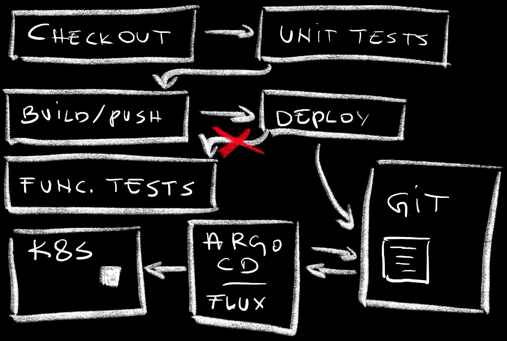
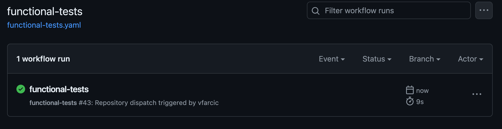
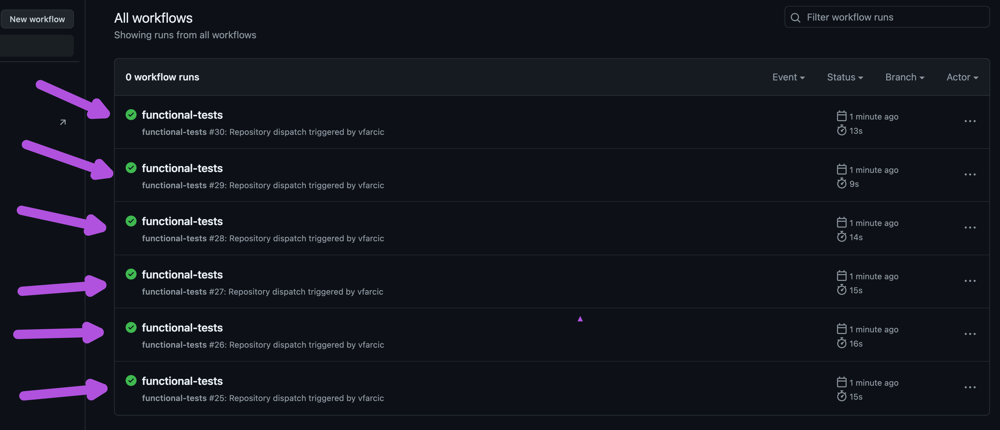
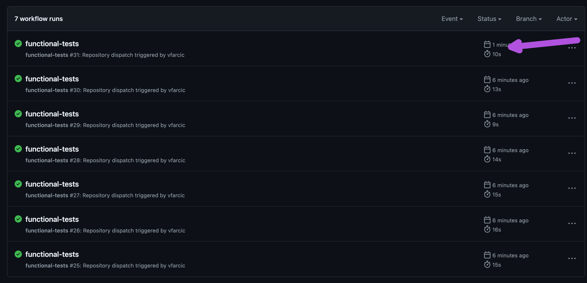
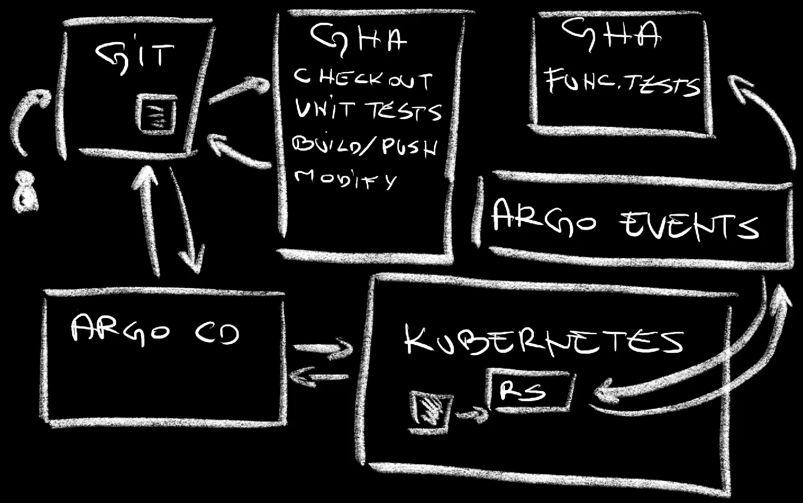

+++
title = 'GitOps Broke CI/CD! Here is How to Fix It With Argo Events'
date = 2024-07-15T15:00:00+00:00
draft = false
+++

**GitOps is amazing**, especially for those using Kubernetes. Yet, GitOps poses significant problems when it comes to execution of tasks that should be performed after deployments. For example, we cannot run functional tests through workflows or pipelines like GitHub Actions or Jenkins. **GitOps broke CI/CD processes**, and we need to fix that.

Let me explain.

<!--more-->





Imagine the following workflow steps.

1. Checkout code
2. Run unit tests
3. Build and push a new container image
4. Deploy the new release
5. Run functional tests

The whole process is often much more complicated than that. Still, those few steps should be enough for me to make the point I'm about to make.

Now, if we are practicing GitOps, the step that deploys the code is actually not deploying anything but, instead, it is making changes to manifests and pushing them to a repo. From there on, Argo CD or Flux would realize that there is a **change in the desired state** and make changes to the cluster so that the actual state is the same.

**GitOps requires rethinking CI/CD to accommodate decoupled deployment processes.**

The problem is in whichever steps we might have in our workflows after the deployment. How do we, for example, run functional tests or do whatever else needs to be done once a new release is running?

We cannot let the workflow run continue its course after changes are pushed to Git since there is a decoupled process that does the deployment or, to be more precise, reconciliation between the desired state (what is in Git) and the actual state (what is in a cluster). We cannot know for sure when will that process start nor when it will end. So, we have to remove those steps from that specific workflow run and, probably, execute it separately. Hence, we have two, if not more workflows with decoupled and asynchronous processes in between. We need **a way to trigger that second workflow** run and the only way we can do that is by monitoring the state of resources and executing some kind of a trigger when those we're interested in are created or updated.

Here's an example.

> Do not run the commands just yet. This is only a preview. We'll go through all the commands starting with the **setup** later.

I'll change the source code of the app and push changes to the Git repo,

```sh
git add .

git commit -m "Silly demo"

git push
```

If we open GitHub Actions...

```sh
gh repo view --web
```

...we can see that the `ci` workflow run was executed.


That workflow ended up pushing changes to a manifest and stopped. There was nothing else for it to do since that's where Argo CD kicks in. It detected changes to the repo and synchronized them into the cluster.

However, a few moments later, a new workflow run was executed even though we did not push anything to any Git repo.



How did that happen? What executed that workflow run? How did it know that a new release of the application was deployed to the cluster?

The answer to those and a few other questions is in event based workflows and Argo Events.

## What Is Argo Events?

A simple way to describe Argo Events would be to say that it **orchestrates workflow or pipeline runs**. It does that orchestration by monitoring specific events and triggering processes.

Almost all of us are already using such architecture. When we push a change to a Git repo, that change is an event that triggers workflow runs. That's how most of CI or CD processes are executed. That's what we've been doing for decades, except that it was SVN or CVS back in the days when I was young.

However, **changes to Git repositories are only a fraction of events our systems are generating**. There are events generated in queues and pub/subs like AWS SQS, Azure Service Bus, NATS, Kafka, Redis and others. Then there are Kubernetes events, file events, and many others. Our **systems are generating events all the time**. We can monitor those and use them to trigger some processes.

Now, I won't go deeper into Argo Events. Actually, I won't explain Argo Events at all. I already did that in the [Argo Events - Event-Based Dependency Manager for Kubernetes](https://youtu.be/sUPkGChvD54) video and I don't like repeating myself.

Today I want to focus on solving the **GitOps problem** and figure out how to connect broken workflow runs. More specifically, we'll explore how to execute whatever needs to be executed after GitOps tools create or update something in our clusters.

## Setup

> Please watch the [GitHub CLI (gh) - How to manage repositories more efficiently](https://youtu.be/BII6ZY2Rnlc) video if you are not familiar with GitHub CLI.

```sh
gh repo fork vfarcic/argo-events-gh-demo --clone --remote

cd argo-events-gh-demo

gh repo set-default
```

> Select the fork as the default repository

> Make sure that Docker is up-and-running. We'll use it to create a KinD cluster.

> Watch [Nix for Everyone: Unleash Devbox for Simplified Development](https://youtu.be/WiFLtcBvGMU) if you are not familiar with Devbox. Alternatively, you can skip Devbox and install all the tools listed in `devbox.json` yourself.

```sh
devbox shell

kind create cluster

kubectl create namespace a-team

helm upgrade --install argocd argo-cd \
    --repo https://argoproj.github.io/argo-helm \
    --namespace argocd --create-namespace \
    --values values-argocd.yaml --wait

REPO_URL=$(git config --get remote.origin.url)

yq --inplace ".spec.source.repoURL = \"$REPO_URL\"" \
    apps-argocd.yaml

yq --inplace ".spec.source.repoURL = \"$REPO_URL\"" \
    apps/silly-demo.yaml

git add .

git commit -m "Make it my own"

git push

kubectl apply --filename apps-argocd.yaml

helm upgrade --install argo-events argo-events \
    --repo https://argoproj.github.io/argo-helm \
    --namespace argo-events --create-namespace \
    --set webhook.enabled=true --wait

kubectl --namespace argo-events apply \
    --filename https://raw.githubusercontent.com/argoproj/argo-events/stable/examples/eventbus/native.yaml
```

> Replace `[...]` with the GitHub token in the command that follows.

```sh
export GITHUB_TOKEN=[...]

kubectl --namespace argo-events \
    create secret generic github \
    --from-literal token="token $GITHUB_TOKEN"
```

> Replace `[...]` with the GitHub user

```sh
export GITHUB_USER=[...]

yq --inplace \
    ".spec.triggers[0].template.http.url = \"https://api.github.com/repos/$GITHUB_USER/argo-events-gh-demo/dispatches\"" \
    sensor-deployment.yaml

gh repo view --web
```

> Click the `Actions` button from the top menu and click the `I understand my workflows, go ahead and enable them` button.

> Click the `Settings` button, choose `Actions` followed by `General` in the left-hand menu, select the `Read and write permissions` checkbox in the `Workflow permissions` section, and click the `Save` button.

## Argo Events Setup

Once we have Argo Events installed we still need to set up a few things specific to the events we will be watching and triggering.

To begin with, we need to create a service account, a role, and a role binding so that we have the permissions to observe or operate resources we're interested in.

Here's an example.

```sh
cat sa.yaml
```

The output is as follows.

```yaml
apiVersion: v1
kind: ServiceAccount
metadata:
  name: argo-events
  namespace: argo-events
---
apiVersion: rbac.authorization.k8s.io/v1
kind: ClusterRole
metadata:
  name: argo-events
rules:
  - apiGroups:
      - "apps"
    verbs:
      - "*"
    resources:
      - deployments
      - replicasets
---
apiVersion: rbac.authorization.k8s.io/v1
kind: ClusterRoleBinding
metadata:
  name: argo-events
roleRef:
  apiGroup: rbac.authorization.k8s.io
  kind: ClusterRole
  name: argo-events
subjects:
  - kind: ServiceAccount
    name: argo-events
    namespace: argo-events
```

If you are familiar with Kubernetes, there should be no need for an explanation. We are creating a service account `argo-events` that will have permissions to do anything with `deployments` and `replicasets`. Now, if that is confusing and you need more detailed explanation, all I will say is that you won't find it here. I'm assuming that you are not new to Kubernetes. Otherwise, go away.

Typically, we should push those manifests to Git and let Argo CD take care of the rest, but we won't. In the interest of getting to the important part as fast as possible, I'll perform a cardinal sin of applying them directly with kubectl.

```sh
kubectl apply --filename sa.yaml
```

Next, we need an Event Source.

```sh
cat event-source-deployment.yaml
```

The output is as follows.

```yaml
apiVersion: argoproj.io/v1alpha1
kind: EventSource
metadata:
  name: app
spec:
  template:
    serviceAccountName: argo-events
  resource:
    app:
      namespace: a-team
      group: apps
      version: v1
      resource: deployments
      eventTypes:
        - ADD
        - UPDATE
      filter:
        afterStart: true
```

`EventSouce` resources are essentially configurations that define how to consume events, transform them into [cloudevents](https://cloudevents.io/), and send them to the Argo Events Event Bus.

In this specific case, we are using the `argo-events` Service Account we created earlier so that the EventSource can observe resources we're interested in.

Event sources can be many. We could consume events from a bunch of sources. Here comes the list: **AMQP, AWS SNS, AWS SQS, Azure Service Bus, Azure Queue Storage, Calendar, Emitter, File, GCP Pub/Sub, GitHub, GitLab, Bitbucket (Cloud), Bitbucket Server, Kafka, Minio, MQTT, NATS, NSQ, Redis, Redis Streams, Resource, Webhook, Pulsar**.

I got tired just by reading those and I'm certainly not going to go through all of them in more detail, mostly because only one of those matters for today's story.

We want to observe specific Kubernetes resources, so that manifest defines `resource` named `app`. That's an arbitrary name that does not matter much. What does matter is that it will watch `deployments`. Specifically, it will generate a cloud event every time a deployment is created (`ADD`) or updated (`UPDATE`) inside the `a-team` Namespace.

In other words, we're **generating cloud events whenever specific resources in Kubernetes are created or updated**. We are not specifying what to do with those events just yet. We'll do that soon. For now, let's apply that manifest.

```sh
kubectl --namespace argo-events apply \
    --filename event-source-deployment.yaml
```

Next there are sensors, like this one.

```sh
cat sensor-deployment.yaml
```

The output is as follows.

```yaml
apiVersion: argoproj.io/v1alpha1
kind: Sensor
metadata:
  name: app
spec:
  template:
    serviceAccountName: argo-events
  dependencies:
    - name: app
      eventSourceName: app
      eventName: app
  triggers:
    - template:
        name: github-actions
        http:
          url: https://api.github.com/repos/vfarcic/argo-events-gh-demo/dispatches
          method: POST
          payload:
            - src:
                dependencyName: app
                dataKey: body.metadata.labels.actions\.github\.com\/name
              dest: event_type
            - src:
                dependencyName: app
                dataKey: body
              dest: client_payload.resource
          headers:
            Accept: "application/vnd.github.everest-preview+json"
          secureHeaders:
            - name: Authorization
              valueFrom:
                secretKeyRef:
                  name: github
                  key: token
      retryStrategy:
        steps: 3
      policy:
        status:
          allow:
            - 200
            - 201
            - 204
```

Sensors are essentially **triggers** we can use to specify what to do when an event is detected. They contain two major sections.

First, there are `dependencies`. That's where we're saying that it depends on the `app` EventSource we applied earlier.

Most of the action is in `triggers`. We could have specified that we'd like to start an **Argo Workflow** run, or to instantiate an **AWS Lambda**, or to send a message to **NATS** or **Kafka**, or to create a **Kubernetes resource**, or to send it to **logs**, or to create a function in **OpenWhisk**, or to send a message on **Slack**, or an **Azure event**, or to create a **Pulsar topic**. We could also build our own **http trigger**. 

We won't use any of those since all we need is to send an HTTP request to GitHub Actions so we're using the `http` trigger.

The `url` and `method` fields should be self explanatory.

The `payload` section is an array of instructions that, essentially, say "get data from there and add it as payload". Since triggering GitHub Actions workflows requires an `event_type` and given that I like providing flexibility, instead of hard-coding it we're getting it from one of the `labels` of the Deployment.

Also, given that it might be useful to have the whole definition of the resource that triggered actions, we're passing it (`body`) as the `client_payload.resource` field. We'll see how to use that one soon.

Further on, we're adding the `Accept` and `Authorization` headers, with the latter one retrieved from the `github` secret for obvious reasons.

Finally, the trigger should be considered successful if the destination returns `200`, `201`, or `204` response.

It's all pretty straight forwards, yet, as you will see soon, it does not work. It fails misserably. Nevertheless, I was not supposed to reveal the "disaster" so please ignore what I said, and let's just apply that manifest.

```sh
kubectl --namespace argo-events apply \
    --filename sensor-deployment.yaml
```

That's it. We're ready to see it in action and experience the disaster it will create.

## Combining Workflow Runs and GitOps

> Modify `main.go` or any other file as so that there is a change that can be pushed to Git.

I'll simulate development by changing something in the source code. It's a silly demo so there's not much to it, yet enogh to demonstrate the "glue" required to run workflows or pipelines.

Once the code changed, all we have to do is push it to Git.

```sh
git add .

git commit -m "Silly demo"

git push
```

That's it. That's where humans stop and machines take over. The action starts with the GitHub Actions, even though we'd get the same result with Jenkins, Argo Workflows, Tekton, or any other similar solution.

```sh
gh repo view --web
```

> Open the `Actions` tab and observe that the `ci` workflow is running.

We can see that the `ci` workflow was executed.


While it's running, let's take a quick look at it's definition.

```sh
cat .github/workflows/ci.yaml
```

The output is as follows.

```yaml
name: ci
run-name: ci
on:
  push:
    branches:
      - main
jobs:
  build-container-image:
    runs-on: ubuntu-latest
    env:
      IMAGE: ttl.sh/silly-demo-${{github.triggering_actor}}:${{github.run_number}}
      FORCE_COLOR: 1
    steps:
      - uses: earthly/actions-setup@v1
        with:
          version: v0.8.0
      - name: Checkout
        uses: actions/checkout@v4
      - name: Set up QEMU
        uses: docker/setup-qemu-action@v3
      - name: Set up Docker Buildx
        uses: docker/setup-buildx-action@v3
      - name: Run unit tests
        run: |
          echo "Running unit tests..."
      - name: Build and push
        uses: docker/build-push-action@v5
        with:
          push: true
          tags: ${{ env.IMAGE }}
          platforms: linux/amd64,linux/arm64
      - name: Modify image
        run: |
          yq --inplace \
              ".spec.template.spec.containers[0].image = \"${{ env.IMAGE }}\"" \
              silly-demo/deployment.yaml
      - name: Commit changes
        run: |
          git config --local user.email "41898282+github-actions[bot]@users.noreply.github.com"
          git config --local user.name "github-actions[bot]"
          git add .
          git commit -m "Release ${{ env.IMAGE }} [skip ci]"
      - name: Push changes
        uses: ad-m/github-push-action@master
        with:
          github_token: ${{ secrets.GITHUB_TOKEN }}
          branch: ${{ github.ref }}
```

It checks out the code (`Checkout`), prepares Docker to build images (`Set up QEMU`, `Set up Docker Buildx`), runs "fake" unit tests (`Run unit tests`), and builds and pushed a new container image (`Build and push`).

What comes now is the important part that differs from what were typically doing in the past. Instead of deploying the new container image to the cluster, we are modifying the Deployment manifest by changing the image to the one we just built (`Modify image`) and, after that, committing (`Commit changes`) and pushing (`Push changes`) changes back to the repo.

In other words, that workflow is not deploying anything but updating manifests in the Git repo. After that, it cannot do anything else simply because that workflow has no idea who or what will apply those changes nor when will those changes be applied. That workflow is completely decoupled from deployment processes which, in our case, will be done by Argo CD.

We can confirm that's what really happened by pulling the latest changes from Git.

```sh
git pull
```

We should see from the output that `silly-demo/deployment.yaml` was modified, thus confirming that the first workflow run was successful.

From now on, Argo CD should detect the change and we should see new Pods deployed to the cluster.

```sh
kubectl --namespace a-team get pods
```

The output is as follows.

```
NAME                          READY   STATUS    RESTARTS   AGE
silly-demo-5c444b879b-48pq2   1/1     Running   0          3s
silly-demo-5c444b879b-jhrpq   1/1     Running   0          7s
```

Judging by the `AGE`, those are indeed new Pods created by Argo CD as a result of changing the image in the Deployment manifest. The second process worked as expected.

Chances are that, so far, you haven't seen anything new. You probably already know how to trigger workflow or pipeline runs through commits to Git, and you are likely already using Argo CD or Flux to sync the desired state stored in Git and the actual state in your Kubernetes clusters.

What comes next is new, and we can see it by going back to the GitHub repo...

```sh
gh repo view --web
```

...and opening the `Actions` tab.

We can see that a new workflow functional-tests was executed. That's the workflow triggered by Argo Events once it detected that a Deployment was created or updated. That is also the disaster I mentioned earlier.

Instead of triggering one workflow run that executes functional tests, we got plenty. What we did is pointless. There is no good reason why we would run functional tests many times for a single change, yet, Argo Events did not do anything wrong. As a matter of fact, Argo Events triggered all those workflows correctly.



We said that we'd like to trigger a workflow every time a Deployment is created (added) or updated, so that's what Argo Events did, even though it might look like it went beserk.

You see, it's not only us who are modifying Kubernetes resources. Kubernetes itself is modifying them as well. It adds anotations, statuses, and quite a few other things to resources. Otherwise, without statuses, we would not know what's going on.

We can blame Deployment itself for not having a clear indication when its children resources are operational. On the other hand, filters offered by Argo Events are terrible so that complicates the situation as well.

Nevertheless, I do have a solution that prevents multiple events firing due to Kubernetes updating resources. We'll get to it soon. For now, let's take a quick look at the workflow definition that was executed.

```sh
cat .github/workflows/functional-tests.yaml
```

The output is as follows.

```yaml
name: functional-tests
run-name: functional-tests
on:
  repository_dispatch:
    types:
      - functional-tests
jobs:
  run-functional-tests:
    runs-on: ubuntu-latest
    steps:
      - name: Functional tests
        run: |
          echo "The following resource was created or updated:"
          echo 
          echo '${{ github.event.client_payload.resource }}' | jq .
          echo "Running functional tests..."
```

There's not much going on there. We're outputting `client_payload.resource`. We're not doing anything with it, but we could. If that run would need some additional information it could extract it from the resource passed to it. I just wanted to ensure that Argo Events could pass any information to a workflow run, including the resource that initiated it.

Below it we can see the `Running functional tests...` message. I was too lazy to add real tests. I'm sure that you do know how to test your releases. Also, please note that it does not have to run only tests. That workflow should execute whichever tasks you need to run after each new deployment.

Let's get back to solving the problem with too many events being triggered.

As you hopefully know, Kubernetes Deployments create ReplicaSets which manage Pods. Every time we make a change to a Deployment, a new ReplicaSet is created. That means that we can be watching for events that create ReplicaSets without the need to watch for updates. As a result, if everything turns up as expected, Argo Events should trigger a GitHub Actions workflow run every time we create or update a Deployment. It's an indirect route towards solving the issue we're having.

Here's the diff between the current and the new version of the EventSource.

```sh
diff event-source-deployment.yaml event-source-replicaset.yaml
```

The output is as follows.

```
<       resource: deployments
---
>       resource: replicasets
16d15
<         - UPDATE
```

As we can see, the only change is that we are now watching for `replicasets` instead of `deployments` and that updates (`UPDATE`) should not trigger events.

Let's apply the new version of the EventSource.

```sh
kubectl --namespace argo-events apply \
    --filename event-source-replicaset.yaml
```

Next, we'll modify the source code.

> Modify `main.go` or any other file as so that there is a change that can be pushed to Git.

Finally, we'll push the changes to the repo.

```sh
git add .

git commit -m "Silly demo"

git push
```

Now we need to wait until the *ci* workflow run is executed and Argo CD detects and synchronizes changes to the cluster. Once that happens, we should have a new *functional-tests* workflow run executed.

Few minutes later...

```sh
gh repo view --web
```

If we take a look at the `functional-tests` workflow runs, we can see that only one was executed.

Mission accomplished. To quote Borat, one of the biggest phylosophers or our time: "**Great success!**"



Here's what happened.

## What Happened?



One of GitHub Actions Workflows is configured to run on every commit to the mainline so a run was executed. It checked out the code, it run unit tests, it built an image and pushed it to a registry, it modified the image in the Deployment manifest, and it pushed the changes back to the repo. That's the end of the Workflow run. It did not deploy anything nor it executed any task we might want to run after deployments.

Argo CD is unaware of what we do in workflows. It does not care about any of them. It's decoupled from other processes. All it cares is the drift between the desired and the actual state. So, once changes to the manifests were pushed to the repo, it detected drift between the desired state, the manifests, and the actual state, the Kubernetes resources. It did whatever it needs to do to remove the drift by making changes to the actual resources. That's GitOps equivalent of a "traditional" deployment. Just as Argo CD was unaware of the workflow run that made changes to the manifests stored in Git, it is also unaware of what needs to be done afterwards. It does not care. It has a single job and it does not care about jobs done by anyone else.

EventSource, an Argo Events component, also unaware of GitHub Actions and Argo CD, detected a new ReplicaSet that was created by the Deployment and triggered an HTTP request to GitHub Actions workflow *functional-test*. That resulted in a run of that workflow that executed functional tests.

That's a simple version of the process and I'll leave it to you to expand it to your own needs.

Here's the key takeaway for today: **Argo Events effectively solves GitOps' post-deployment challenges by intelligently triggering workflows.**

## Destroy

```sh
kind delete cluster

yq --inplace \
    ".spec.template.spec.containers[0].image = \"ghcr.io/vfarcic/silly-demo:1.4.171\"" \
    silly-demo/deployment.yaml

git add .

git commit -m "Revert [skip ci]"

git push
```

