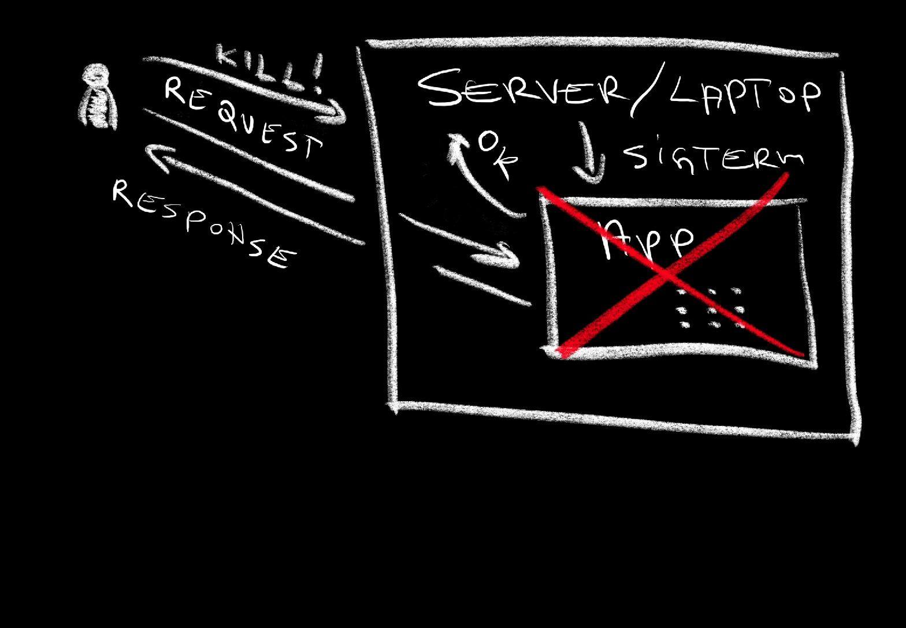
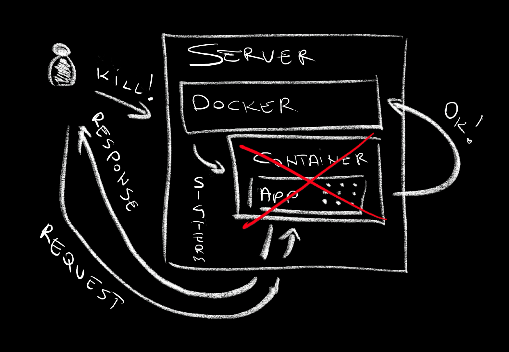

+++
title = 'Stop Losing Requests! Learn Graceful Shutdown Techniques'
date = 2024-09-15T16:00:00+00:00
draft = false
+++

Look at this.

I will send a request to the application,...

```sh
curl "http://silly-demo.127.0.0.1.nip.io/fibonacci?number=50"
```

...and simulate failure or upgrade or any similar action by deleting the Pod where the application is running.

```sh
kubectl --namespace a-team delete pod \
    --selector app.kubernetes.io/name=silly-demo
```

The output of the `curl` command is as follows.

```
<html>
<head><title>502 Bad Gateway</title></head>
<body>
<center><h1>502 Bad Gateway</h1></center>
<hr><center>nginx</center>
</body>
</html>
```

Since we initiated the delete process before the server returned a response we got `502 Bad Gateway` message. The application was deleted before it could respond and I, the user of that application, failed to get what I was looking for. That's horrible experience that could have been improved by enabling the application to shut down gracefully.

<!--more-->



Here's the question. How do we kill something gracefully? How do we make sure that when your application is destroyed, the users of that application do not experience **any downtime** and **not a single request is lost**?

Now, you might be thinking that's easy. Just do not delete the application.

That's close to impossible though since there are myriad of reasons why an application or, to be more precise, a replica of an application would be annihilated. When we upgrade applications we tend to **create new replicas based on a new release and destroy the old ones**. When we scale the cluster some replicas of the application might be destroyed and created elsewhere. A node where the application is running might need to be upgraded resulting in replicas running in it being **moved somewhere else** since node upgrades often mean "destroy the old one and create a new one". There are many reasons why a replica of an application might be deleted. It's a matter of when rather than if.

Today we are going to discuss how we can make our applications fail gracefully; how to ensure that when a replica is deleted our users are not affected in any form or way.

To make the discussion more interesting, I'll propose a solution that works anywhere. I'll show a way how to shut down gracefully no matter whether the application is running directly in a server, or is managed by Docker, or is running in Kubernetes, or almost any other permutation we might imagine.

The solution to the problem we're trying to solve today is called... **signals**. Most of the systems, especially those based on Linux, which is the vast majority, are all assuming that applications are **capable of receiving different signals** and act accordingly. The only problem is that many of us are not aware of them. That's going to change today.

## Setup

```sh
git clone https://github.com/vfarcic/silly-demo

cd silly-demo

git checkout sigterm
```

> Make sure that Docker is up-and-running. We'll use it directly as well as to create a KinD cluster.

> Watch https://youtu.be/WiFLtcBvGMU if you are not familiar with Devbox. Alternatively, you can skip Devbox and install all the tools listed in `devbox.json` yourself.

```sh
devbox shell
```

> Watch [Master Terminal Multiplexing with Zellij in Minutes!](https://youtu.be/ZndhImXIGlg) if you are not familiar with Zellij.

```sh
zellij --session dot --layout zellij.kdl

kind create cluster --config kind.yaml

kubectl apply \
    --filename https://raw.githubusercontent.com/kubernetes/ingress-nginx/main/deploy/static/provider/kind/deploy.yaml

kubectl create namespace a-team

yq --inplace ".values.ingress.className = \"nginx\"" timoni/values.yaml

yq --inplace ".values.ingress.host = \"silly-demo.127.0.0.1.nip.io\"" \
    timoni/values.yaml
```

## Graceful Shut Down of Applications Running Locally

Let me run a silly application locally first. It already knows how to handle signals we'll be discussiong but, first, I want to show how it would work if it would be a "normal" application oblivious that there is such a thing as signals. I'll do that by setting `NO_SIGNALS` environment variable since the code skips implementing signals if that var is set. From there on, I'll just execute `go run`.

```sh
NO_SIGNALS=true go run .
```

The output is as follows.

```
2024/07/24 02:33:22 Starting server...
[GIN-debug] [WARNING] Running in "debug" mode. Switch to "release" mode in production.
 - using env:   export GIN_MODE=release
 - using code:  gin.SetMode(gin.ReleaseMode)

[GIN-debug] GET    /fibonacci                --> main.fibonacciHandler (1 handlers)
[GIN-debug] POST   /video                    --> main.videoPostHandler (1 handlers)
[GIN-debug] GET    /videos                   --> main.videosGetHandler (1 handlers)
[GIN-debug] GET    /ping                     --> main.pingHandler (1 handlers)
[GIN-debug] GET    /memory-leak              --> main.memoryLeakHandler (1 handlers)
[GIN-debug] GET    /                         --> main.rootHandler (1 handlers)
```

Now, before we proceed, I have to mention two things.

First, my application is written in Go, but that should be irrelevant since the same logic can be added to any language.

Second, I'm using Zellij as terminal multi-plexer with two panes. If you are not familiar with Zellij, you might want to check [Master Terminal Multiplexing with Zellij in Minutes!](https://youtu.be/ZndhImXIGlg).

> Press `Ctrl + p` followed with `↓` and the enter key to move to the second pane.

Let's get back to the subject at hand.

I'll send a request to calculate Fibonacci number. That will take a bit of time which is great since it'll give us the opportunity to see easier what's happening.

```sh
curl "http://localhost:8080/fibonacci?number=50"
```

> Press `Ctrl + p` followed with `↑` and the enter key to move to the first pane.

Next, I will simulate application removal by pressing `Ctrl + c` to stop the server and...

> Press `Ctrl + c` to shut down the server.

The output is as follows.

```
curl: (52) Empty reply from server
```

...the `curl` failed to get the response.

When I stopped the server, that action was performed almost instantly so the process that was calculating Fibonacci number did not have the time to finish and to return the response.

> You might want to increase the `number` value if your computer is too fast processing the request so you don't have enough time to shut down the server.

Now, let's take a look at how the application should behave in those circumstances by executing `go run` again but, this time, without the environment variable that tells it to ignore signals coming from the operating system.

```sh
go run .
```

> Press `Ctrl + p` followed with `↓` and the enter key to move to the second pane.

Let's send the same request again and,...

```sh
curl "http://localhost:8080/fibonacci?number=50"
```

> Press `Ctrl + p` followed with `↑` and the enter key to move to the first pane.

...shut down the server.

> Press `Ctrl + c` to shut down the server.

The output is as follows.

```
12586269025
```

Here's the difference. This time, the application did not shut down right away. Instead, it waited until all ongoing requests are served and only then it shut itself down. That's why we got back the response with the calculated Fibonacci number before the application was annihilated.

> Press `Ctrl + p` followed with `f` to enter full screen of the current pane.

How did that happen? What's the code that enabled the application to shut itself down gracefully?

Here it goes.

```sh
cat main.go
```

The output is as follows (truncated for brevity).

```go
...
func main() {
	...
	if len(os.Getenv("NO_SIGNALS")) > 0 {
		if err := server.ListenAndServe(); !errors.Is(err, http.ErrServerClosed) {
			log.Fatalf("HTTP server error: %v", err)
		}
	} else {
		go func() {
			if err := server.ListenAndServe(); !errors.Is(err, http.ErrServerClosed) {
				log.Fatalf("HTTP server error: %v", err)
			}
			log.Println("Stopped serving new connections.")
		}()
		sigChan := make(chan os.Signal, 1)
		signal.Notify(sigChan, syscall.SIGINT, syscall.SIGTERM)
		<-sigChan
		shutdownCtx, shutdownRelease := context.WithTimeout(context.Background(), 60*time.Second)
		defer shutdownRelease()
		if err := server.Shutdown(shutdownCtx); err != nil {
			log.Fatalf("HTTP shutdown error: %v", err)
		}
		log.Println("Graceful shutdown complete.")
	}
}
...
```

As I mentioned earlier, the code is written in Go, but that should not scare you if you're not proficient with it since this is more about the principles you can implement in any language than actual showcase of how to do it in Go.

If environment variable `NO_SIGNALS` is set, the application starts a "normal" web server that listens and serves (`ListenAndServe`) requests.

The second case, the one inside the `else` statement is how we should interpret signals.

The server is started just as before but, this time, in a separate thread. It will work indefinitely or until we shut down the application.

When we do try to shut down the app, like I did earlier by pressing *Ctrl + c*, or by executing *kill* command or in almost any other way, the system does not just kill that application. Instead, it sends interrupt (`SIGINT`) or terminate (`SIGTERM`) signals. That is happening independently of how we write our code.

Now comes the important part. After sending one of those signals, the **system waits for a response that it is safe to destroy it**. If nothing catches those signals, shutdown is immediate. But, that's not the case here. Over there, we are capturing those signals (`signal.Notify`) and telling the server to shut itself down gracefully (`fserver.Shutdown`) which can be interpreted as "stop processing upcoming requests, finish those that are ongoing, and then...die!"

> Press `Ctrl + p` followed with `f` to exit full screen.

Here's what happened so far.



At the beginning there was a laptop. And the developer said "Let there be an app," and there was the app. And the developer said "let there be a request," and there was the request. However, soon afterwards, the developer, in its ultimate wisdom, said "kill the app", and the server sent an interrupt signal to the app. That signal can be interpreted as "I am about to kill you, how do you feel about that?" The app said nothing. It stopped receiving new requests and continued processing existing requests. Once finished, it responded to the developer. Once all the requests were processed, it chose to break the silence. It stopped ignoring the server and said "It's okay. I'm ready to comply with your request and die with honor." That's what the server needed. It got app's consent to annihilate it. The app is no more. It died gracefully on it's own terms. The app could not avoid death, but it could postpone it until it felt the time was right to perish.

All that is nice and good, but you might be thinking that it is useless. While many of us might run applications like that locally, they are often packaged into images and running in containers in production. Hence, the question is "how do we do the same in containers?" Can we implement something similar with, let's say, Docker?

## Graceful Shut Down of Docker Containers

I already have a container image with the binary based on the code we run earlier. Let's run it and see what we'll get.

```sh
docker container run --interactive --tty --rm --publish 8080:8080 \
    --name silly-demo --env NO_SIGNALS=true ghcr.io/vfarcic/silly-demo:1.4.178
```

> Press `Ctrl + p` followed with `↓` and the enter key to move to the second pane.

Just as before, we'll send a request to the app, this time running as a Docker container, expecting to get a Fibonacci number.

```sh
curl "http://localhost:8080/fibonacci?number=50"
```

> Press `Ctrl + p` followed with `↑` and the enter key to move to the first pane.

Next, we'll shut down the Docker container and,...

> Press `Ctrl + c` to shut down the server.

```
curl: (52) Empty reply from server
```

Nope! It's the same problem. The container was shutdown before the application running in it managed to respond.

Let's run the container again but, this time, without the `NO_SIGNALS` variable so that the code can work with signals in the same way as we experienced before.

Before we continue, there is an important note. There is nothing in the image that specifies how should containers handle SIGTERM and other signals. It's just a "normal" Dockerfile that contains the binary based on the code we saw earlier. In other words, there is nothing special about it.

Here it goes. We'll run the Docker container,...

```sh
docker container run --interactive --tty --rm --publish 8080:8080 \
    --name silly-demo ghcr.io/vfarcic/silly-demo:1.4.178
```

> Press `Ctrl + p` followed with `↓` and the enter key to move to the second pane.

...send a request to it,...

```sh
curl "http://localhost:8080/fibonacci?number=45"
```

> Press `Ctrl + p` followed with `↑` and the enter key to move to the first pane.

...and stop the container before the request was processed.

> Press `Ctrl + c` to shut down the server.

We can observe that the container is not getting shut down right away. Instead, it is waiting for something. It sent a SIGTERM signal to the main process inside the container and now it is waiting for it to respond.

A few moments later, we can see that the HTTP response arrived first and that the container was deleted afterwards.

Here's what happened.



We have a server with Docker. Actually, it's a laptop with Docker, but the story is still the same.

We send a request to Docker telling it to run a container and then we sent a request to the application inside that container to calculate a Fibonacci number.

The app started working. It started calculating the number. However, in the middle of that process we sent another request to Docker. We told it to kill the container. Docker, however, is not an asshole. He's a nice guy who does not just kill. Instead, it talked to the container and said "Look, I was told to kill you. I don't like it any more than you do. Is that okay? Do you have any last minute things you'd like to do before I chop you to pieces?"

That wasn't the real conversation but my interpretation of it. In reality, Docker is not that talkative. Instead, it follows the rules of any Nix system so it sent a single word to the container. It said "SIGTERM".

Actually, even that is not correct. Docker did not send anything to the container but to the main process inside the container which, in this case, is the application we explored earlier.

That application did not respond right away but stopped receiving requests, continued working on all its pending tasks, responded to the request and only then went back to Docker saying "Okay. I'm ready to die now. Kill me."

As you can see, the world out there is violent, but it follows the same rules, at least so far. It does not matter whether we're running the code directly or we're running it inside containers. Whenever we choose to kill something, SIGTERM or SIGINT signals are sent to it. It does not matter why something should be killed. It could be because we don't want it any more, or because we want to replace old releases with the new ones, or because we're moving processes from one server to another, or for any other reason. Killing is inevitable and we just need to choose whether it should be **instant or graceful**.

How about Kubernetes? How can we accomplish the same in our clusters?

## Graceful Shut Down of Kubernetes Pods

Let's run the application based on the same code and the same container image but, this time, inside a Kubernetes cluster.

We'll do that with Timoni, mostly because the manifests in the current repo are being defined as CUE. Don't worry if you're not familiar with Timoni. It just generates YAML files and the result would be the same with Helm, Kustomize, KCL, or anything else.

*If you're curious about Timoni, you might want to watch [Is Timoni With CUE a Helm Replacement?](https://youtu.be/bbE1BFCs548). Just don't do it now. It's not necessary for this subject.*

```sh
timoni build silly-demo timoni --values timoni/values.yaml --namespace a-team \
    | kubectl apply --filename -
```

> Press `Ctrl + p` followed with `↓` and the enter key to move to the second pane.

Next, we'll send a similar request to calculate a Fibonacci number,...

```sh
curl "http://silly-demo.127.0.0.1.nip.io/fibonacci?number=45"
```

> Press `Ctrl + p` followed with `↑` and the enter key to move to the first pane.

...delete the Pods,...

```sh
kubectl --namespace a-team delete pod \
    --selector app.kubernetes.io/name=silly-demo
```

...and observe that nothing happened right away.

The Pod was not deleted right away. Instead, Kubernetes followed the same rules and sent a SIGTERM signal to the main process inside the container which is inside the Pods. Right before it did that, it stopped sending new requests to that specific Pod.

The application, in turn, finished processing all ongoing requests, responded back with the number, and only then went back to Kubernetes saying "I'm ready to die. Goodbye."

The output is as follows.

```
1134903170
```

Now, to be clear, such a situation rarely happens in Kubernetes. Typically we would have multiple replicas of the application so killing one Pod would mean that Kubernetes stops sending requests to it while it keeps going with the others. There should be no interruption to the service since other Pods keep serving new requests, while the one that is being killed is given time to respond to ongoing requests before it gets killed.

Similarly, if we would upgrade an application in Kubernetes, new Pods would be created first, and start handling new requests while the old Pods are finishing whatever they need to do before they're killed.

What matters, is that SIGTERM works everywhere and that there is nothing we should do to make it work but a few lines of code inside the application. There are no changes to Dockerfile, no changes to Kubernetes manifests, or anywhere else. All the tools should be **aware how Nix works** and comply with it. Today, that compliance means that SIGTERM signals are always sent to the main process before it gets deleted. It's up to us to ensure reception and handling of those signals.

## Destroy

```sh
kind delete cluster
```

> Press `Ctrl + q` to exit Zellij.

```sh
zellij delete-session dot

exit

git stash

git checkout master
```

