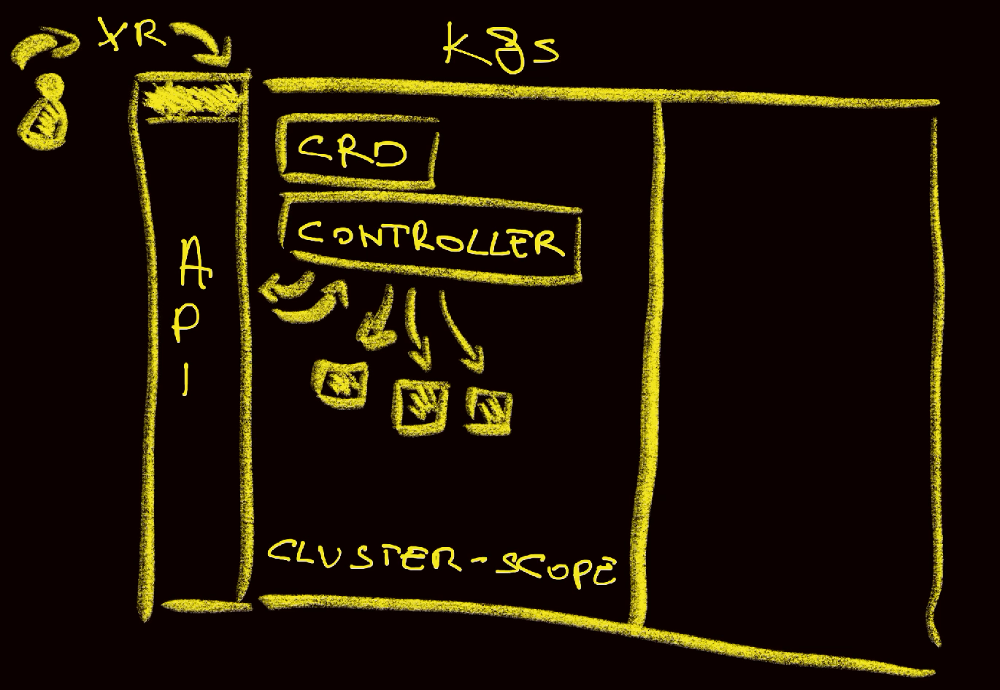
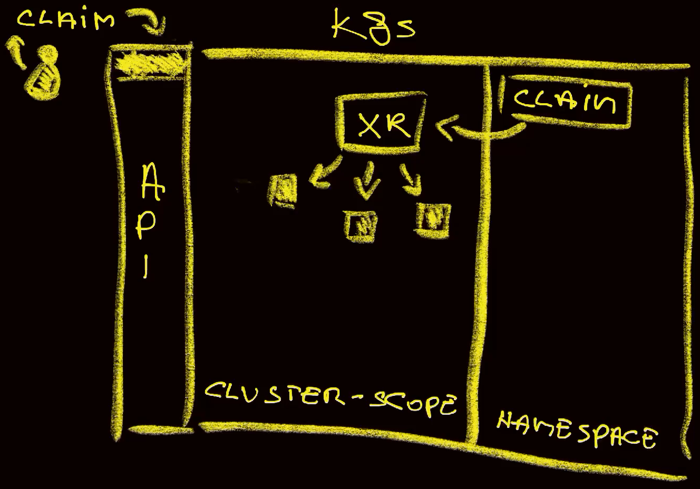

+++
title = 'Crossplane v2: Simplified Compositions, Namespace-Scoped Resources, and More!'
date = 2025-04-03T16:00:00+00:00
draft = false
+++

**Crossplane v2** is here with some very cool features that I want to go through.

We'll see the **changes to Crossplane Composition schemas**, a shift to **Namespace-scoped resources**, **direct composition of any resources** without the need to rely only on Crossplane Managed resources, **new API versions**, **removal of deprecated features**, and more.

<!--more-->



I'm sure that, by the end of this walkthrough you'll see that two most requested features are here and that authoring Compositions is now easier.

I'm so excited that I will skip the typical pep-talk and jump right into it.

## Setup

```sh
git clone https://github.com/vfarcic/crossplane-app

cd crossplane-sql

git pull

git fetch

git switch v2
```

> Make sure that Docker is up-and-running. We'll use it to create a KinD cluster.

> Watch [Nix for Everyone: Unleash Devbox for Simplified Development](https://youtu.be/WiFLtcBvGMU) if you are not familiar with Devbox. Alternatively, you can skip Devbox and install all the tools listed in `devbox.json` yourself.

```sh
devbox shell
```

> Watch [The Future of Shells with Nushell! Shell + Data + Programming Language](https://youtu.be/zoX_S6d-XU4) if you are not familiar with Nushell. Alternatively, you can inspect the `dot.nu` script and transform the instructions in it to Bash or ZShell if you prefer not to use that Nushell script.

```sh
chmod +x dot.nu
```

> At the time of this writing, Crossplane v2 is in preview mode and not yet GA. The setup script will install the preview version. If you're running the commands at some later time when v2 is GA, change the `--preview` argument to `false` or remove it altogether since `false` is the default value.

```sh
./dot.nu setup --preview true

source .env
```

## Crossplane "Stuff" Goes to spec.crossplane

Let's warm up with, probably, the least exciting change in Crossplane v2 before we move into those that are truly exciting, by taking a quick look at an old version of a Claim.

```sh
cat examples/aws-v1.yaml
```

The output is as follows (truncated for brevity).

```yaml
---
apiVersion: devopstoolkit.live/v1alpha1
kind: SQLClaim
metadata:
  name: my-db
spec:
  id: my-db
  parameters:
    version: "16.3"
    size: medium
    region: us-east-1
    ...
  compositionSelector:
    matchLabels:
      provider: aws
      db: postgresql
```

I really dislike `spec.parameters` part of that Claim, even though it's me who put it there.

In the past, I prefered to separate parameters that are specific to my Composition from those that are always available like the ability to select a specific composition (`compositionSelector`) through matching labels (`matchLabels`).

There's no need for that any more since Crossplane-specific parameters moved to *spec.crossplane*.

Here's an example

```sh
cat examples/aws-eso.yaml
```

The output is as follows (truncated for brevity).

```yaml
---
apiVersion: devopstoolkit.live/v1beta1
kind: SQL
metadata:
  name: my-db
spec:
  version: "16.3"
  size: medium
  region: us-east-1
  ...
  crossplane:
    compositionSelector:
      matchLabels:
        provider: aws
        db: postgresql
```

We can see that Crossplane-specific parameters are now moved to `spec.crossplane`. It's a small but, in my opinion, an important change that makes it clear which parameters are common to all Composite Resources and which ones were added by whomever designed that Composite Definition.

With that change in mind, I felt that there is no need to put all the custom parameters like `version`, `size`, and `region` into *spec.parameters* section but inside `spec` itself.

That's not all though. There are other changes in that manifest.

## Everything is Now (Optionally) Namespace-Scoped

Before I dive into the explanation of the new feature that allows us to manage **Namespaced resources**, I have to explain how Crossplane Compositions worked in v1.

*You might be familiar with what follows. Still, don't rush through it since it is important for the understanding of the new feature I will explain later.*



A Composition is a CRD which creates a new endpoint in Kubernetes API, and a controller which performs certain operations when Composite Resources are applied. Those operations are, primarily, in charge of composing resources.

So, when we apply a Composite Resource (XR), which, essentially, is a Kubernetes Custom Resource, Composition controller, which is subscribed to Kubernetes events, composes resources based on the input we provide. Those Managed Resources can be anything, be it components of an application, infrastructure, or anything else. What those Managed Resources can do depends on the providers we installed. That can be AWS provider, or Azure provider, or GitHub provider, or Grafana provider, or anything else.

If you're using Crossplane, you probably already know all that.

The important part of this story is that both Composite Resources and Managed Resources those compose are cluster-scoped.

Now, that was not sufficient. Many asked for Namespace-scoped resources. "Why?", you might ask. It is easier to deal with security and access when resources are Namespaced. We can give access to different Namepsaces to different people, each with its own RBAC and policies. We can better separate resources inside Namespaces. We can avoid potential conflicts when resources are not shared across the whole cluster. And so on and so forth. I will not bore you with details since you probably already know why using Namespaces is a good thing. It's not perfect, far from it, but it is certainly better than managing resources on the cluster-level.

A while ago, a workaround was made in the form of Claims.

Claims are Namespace-scoped and their primary purpose is to claim Composite Resources.



So, when we create a Claim inside a Namespace, that claim will create and manage cluster-scoped Composite Resource (XR) which, in turn, composes cluster-scoped Managed Resources.

That's was not ideal since that solved only part of the problem. People want everything to be Namespace-scoped, not only claims with everything else being still cluster-scoped. People asked, over and over again, for the option to have everything Namespace-scoped, and now they got it with the release of Crossplane v2.

Let's take another look at the Composite Resource we saw earlier.

```sh
cat examples/aws-eso.yaml
```

The output is as follows (truncated for brevity).

```yaml
---
apiVersion: devopstoolkit.live/v1beta1
kind: SQL
metadata:
  name: my-db
spec:
  version: "16.3"
  size: medium
  region: us-east-1
  ...
```

The important change is that `SQL` is not a Claim any more. It is a Composite Resource (XR) which most of us stopped using directly because it was cluster scoped.

Let's apply it,...

```sh
kubectl --namespace a-team apply --filename examples/aws-eso.yaml
```

...and take a look at all the instances of that XR.

```sh
kubectl get sqls
```

The output is as follows.

```
No resources found in default namespace.
```

In the past, we would see instances of SQL since they were cluster scoped. Now we don't because we did not specify the Namespace which defaults to `default`.

Let's change that by retrieving all `sqls` from the `a-team` Namespace.

```sh
kubectl --namespace a-team get sqls
```

The output is as follows.

```
NAME    SYNCED   READY   COMPOSITION      AGE
my-db   True     False   aws-postgresql   25s
```

So, Composite Resources are now Namespace-scoped, but that is only a part of the story. Since Composite Resources are now running inside Namespaces, we do not need Namespace-scoped claims.

That alone would not be of much help since Managed Resources composed through XRs were always cluster scoped. Not any more.

Take a look at this.

```sh
kubectl tree --namespace a-team sqls my-db
```

The output is as follows.

```
NAMESPACE  NAME                              READY REASON            AGE
a-team     SQL/my-db                         False Creating          42s
a-team     ├─AtlasSchema/my-db-main          False ReadSchema        36s
a-team     ├─ExternalSecret/my-db-password   False SecretSyncedError 36s
a-team     ├─Instance/my-db                  -                       36s
a-team     ├─InternetGateway/my-db           -                       36s
a-team     ├─MainRouteTableAssociation/my-db -                       36s
a-team     ├─PushSecret/my-db                False Errored           36s
a-team     ├─Route/my-db                     -                       36s
a-team     ├─RouteTable/my-db                -                       36s
a-team     ├─RouteTableAssociation/my-db-1a  -                       36s
a-team     ├─RouteTableAssociation/my-db-1b  -                       36s
a-team     ├─RouteTableAssociation/my-db-1c  -                       36s
a-team     ├─Secret/fa429694-240f-4893-...   -                       36s
a-team     ├─SecurityGroup/my-db             -                       36s
a-team     ├─SecurityGroupRule/my-db         -                       36s
a-team     ├─Subnet/my-db-a                  -                       36s
a-team     ├─Subnet/my-db-b                  -                       36s
a-team     ├─Subnet/my-db-c                  -                       36s
a-team     ├─SubnetGroup/my-db               -                       36s
a-team     └─VPC/my-db                       -                       36s
```

Kubernetes cannot associate cluster-scoped resources spun up from Namespace-scoped resources. The fact that we see them all tells us not only that `SQL` is in that Namespace, but that all or, at least, most of the resources it composed are inside that same Namespace.

Everything is now Namespace-scoped if we choose that option.

Actually, that is not true, at least not yet. At the time of this writing, some Crossplane providers transitioned to the be both cluster and namespace scoped, while others are in the process of transitioning.

*There is another feature you might be able to spot in that output. If you can't, I'll keep you in suspense for a while longer.*

I am intentionally using AWS provider today since that one was the first the community "transitioned". Others will get there soon, but not today. We can see that by outputting all Crossplane `managed` resources.

```sh
kubectl get managed
```

The output is as follows.

```
NAME                                         KIND   PROVIDERCONFIG SYNCED READY AGE
object.kubernetes.crossplane.io/my-db-secret Secret my-db-sql      False        116s

NAME                                             READY SYNCED AGE
database.postgresql.sql.crossplane.io/my-db-main       False  116s
```

Those are resources from providers that did not yet "transition". They are still managed on the cluster-level.

Let's go back to the claims, by outputting the Composite Definition I'm using today.

```sh
cat package/definition.yaml
```

The output is as follows (truncated for brevity).

```yaml
apiVersion: apiextensions.crossplane.io/v2alpha1
kind: CompositeResourceDefinition
metadata:
  name: sqls.devopstoolkit.live
spec:
  defaultCompositionRef:
    name: google-postgres
  group: devopstoolkit.live
  names:
    kind: SQL
    plural: sqls
  # claimNames:
  #   kind: SQLClaim
  #   plural: sqlclaims
  ...
```

As you can see, I commented the part that defines `claimNames`. They're gone. We don't need them any more as the workaround.

Let's move to the next big thing and speak about removal of the need to use Kubernetes *Object* and Helm *Release* Managed Resources.

## No Object and Release (Unless Working In a Different Cluster)

In Crossplane we can compose only Crossplane Managed Resources coming from Crossplane Providers. As a result, if, for example, we wanted to compose some other Kubernetes Resources like, for example, Deployments, External Secrets, Atlas Schemas, or anything else, we had to wrap it into `Object`.

Here's an example from an older version of one of my Compositions.

```sh
cat examples/object.k
```

The output is as follows (truncated for brevity).

```kcl
...
        apiVersion = "kubernetes.crossplane.io/v1alpha2"
        kind = "Object"
        metadata = {
            name = oxr.spec.id + "-secret-pull"
            annotations = {
                "krm.kcl.dev/composition-resource-name" = oxr.spec.id + "-secret-pull"
            }
        }
        spec = {
            providerConfigRef.name = oxr.spec.id + "-sql"
            forProvider.manifest = {
                apiVersion = "external-secrets.io/v1beta1"
                kind = "ExternalSecret"
                ...
            }
        }
...
```

First of all, don't freak out if you're not familiar with KCL. You can author Compositions in any language and KCL just happens to be my choice. You don't need to know it to understand what I'm trying to illustrate.

Over there, I am trying to compose an `ExternalSecret` but, since Crossplane does not allow composition of anything but Managed Resources from Crossplane providers, I had to wrap it into a `kubernetes` `Object`. There are also a *PushSecret* and *AtlasSchema* resources that underwent the same treatment.

There are reasons why using *Object* or *Release* are a good idea but, in this case, it is only "noise" that adds unnecessary complexity.

Now, let's take another look at some of the resources created through the Composite Resource we applied.

```sh
kubectl --namespace a-team \
    get externalsecrets,pushsecrets,atlasschemas,objects
```

The output is as follows.

```
NAME                                                STORETYPE            STORE   REFRESH INTERVAL   STATUS              READY
externalsecret.external-secrets.io/my-db-password   ClusterSecretStore   aws     1h                 SecretSyncedError   False

NAME                                   AGE     STATUS
pushsecret.external-secrets.io/my-db   8m20s   Errored

NAME                                   READY   REASON
atlasschema.db.atlasgo.io/my-db-main   False   ReadSchema

NAME                                           KIND     PROVIDERCONFIG   SYNCED   READY   AGE
object.kubernetes.crossplane.io/my-db-secret   Secret   my-db-sql        False            8m20s
```

There is indeed an `object` over there but it is unrelated to the `externalsecret`, `pushsecret`, and `atlasschema`. We'll get back to that *object* later. Right now, the question is... If wrapping Kubernetes resources into *Object* is mandatory, how did those get created? There should be an Object for each of those.

The short answer is that with Crossplane v2 we can compose any resource directly, no matter whether those resources come from Crossplane providers or anywhere else.

Take a look at the current version of that same Composition.

```sh
cat kcl/common.k
```

The output is as follows (truncated for brevity).

```kcl
...
        apiVersion = "external-secrets.io/v1beta1"
        kind = "ExternalSecret"
        metadata = {
            name = _name + "-password"
            annotations = {
                "krm.kcl.dev/ready" = "True"
                "krm.kcl.dev/composition-resource-name" = _name + "-secret-pull"
            }
        }
        ...
```

That one is functionally the same except that the `ExternalSecret` is not wrapped into *Object* any more.

From now on, we can compose any resource directly and that removes a lot of boiler-plate code.

However, there are still reasons to use *Object*. For example, if we'd like to apply a resource in a cluster other than the one where Crossplane is running we can use *Object* since we can point it to a configuration with the credentials for that cluster. Similarly, we can use *references* to combine data from other resources into the resource we're combining. There are other "goodies" of the *Object* resource so it's not going away but, if you don't need those and just want to compose Kubernetes resources directly, now you can do it without wrapping them up.

That's why there was a single *object* in one of the previous outputs.

There's one more thing you should know about composing resources directly. We need to set permissions so that Crossplane can work with those.

We can do that by creating a *ClusterRole*.

```sh
cat providers/cluster-role.yaml
```

The output is as follows.

```yaml
apiVersion: rbac.authorization.k8s.io/v1
kind: ClusterRole
metadata:
  name: crossplane-all
  labels:
    rbac.crossplane.io/aggregate-to-crossplane: "true"
rules:
- apiGroups: ["*"]
  resources: ["*"]
  verbs: ["*"]
```

The important part is the `aggregate-to-crossplane` entry of the `ClusterRole`. It tells Crossplane which `rules` to add on top of those it already has. In this case I was lazy and defined that it can manage any API group (`apiGroups: ["*"]`), and any resource (`resources: ["*"]`), and any operation (`verbs: ["*"]`). You should not be that lazy and be more specific.

Next, let's take a look at the v2 installation, changes you might need to make to your Compositions, and removal of some of the features that were deprecated.

## Installation, XRD Version, and Removal of Deprecated Features

Right now, Crossplane v2 is in the preview phase so we need to install it from a separate Charts repo. That might not be the case by the time you're reading this, so please check the documentation first.

Stable releases of Crossplane Helm charts are in the *https://charts.crossplane.io/stable*  repo, while preview versions are in *https://charts.crossplane.io/preview*. So, if it's still in preview, you can install it by adding that repo to your *helm* client and installing it as you would normally do, but with the *--devel* argument, like in the example that follows.

> **Do NOT run the commands** that follow. They are only for illustration purposes. We already installed and set up Crossplane in the "Setup" section.

```sh
helm repo add crossplane-preview https://charts.crossplane.io/preview

helm upgrade --install crossplane crossplane-preview/crossplane \
    --namespace crossplane-system --create-namespace \
    --wait --devel
```

Next... The community took the opportunity to remove some of the deprecated features and resources, one of them being *ControllerConfig*.

Here's an example.

```sh
cat providers/provider-kubernetes-incluster.yaml
```

The output is as follows (truncated for brevity).

```yaml
...
# ---
# apiVersion: pkg.crossplane.io/v1alpha1
# kind: ControllerConfig
# metadata:
#   name: crossplane-provider-kubernetes
# spec:
#   serviceAccountName: crossplane-provider-kubernetes
---
apiVersion: pkg.crossplane.io/v1beta1
kind: DeploymentRuntimeConfig
metadata:
  name: crossplane-provider-kubernetes
spec:
  deploymentTemplate:
    spec:
      selector: {}
      template:
        spec:
          containers:
            - name: package-runtime
          serviceAccountName: crossplane-provider-kubernetes
---
apiVersion: pkg.crossplane.io/v1
kind: Provider
metadata:
  name: crossplane-provider-kubernetes
spec:
  package: xpkg.upbound.io/crossplane-contrib/provider-kubernetes:v0.17.1
  runtimeConfigRef:
    name: crossplane-provider-kubernetes
```

As you can see from the commented part, `ControllerConfig` is no more. If you're using it, Kubernetes will reject it.

Instead, we should be using `DeploymentRuntimeConfig` which serves the same purpose but is much more flexible. We can see that I'm using it to configure `provider-kubernetes` by specifying the `runtimeConfigReference`.

Here's something very important.

```sh
cat package/definition.yaml
```

The output is as follows.

```yaml
apiVersion: apiextensions.crossplane.io/v2alpha1
kind: CompositeResourceDefinition
metadata:
  name: sqls.devopstoolkit.live
spec:
  ...
```

That is a `CompositeResourceDefinition` with the `apiVersion` set to `v2alpha1`. That one tells Crossplane that Composite Resources and all the resources it manages should be Namespace-scoped. If, for whatever reason, you prefer it to be cluster-scoped as it was before, keep version as *v1*.

In other words, if we keep the version as it was, Compositions will behave as they behaved before, but, if we change it to *v2* they will become Namespace-scoped. That way, you can keep everything running as it was running until now and choose which ones to transition to be Namespace-scoped.

As for Managed Resources Compositions compose, we need to make a change to their APIs as well.

Here's an example.

```sh
cat kcl/aws.k
```

The output is as follows (truncated for brevity).

```kcl
...
    {
        apiVersion = "ec2.m.aws.upbound.io/v1beta1"
        kind = "InternetGateway"
        metadata = _metadata("gateway")
        spec.forProvider = {
            region = _region
            vpcIdSelector.matchControllerRef = True
        }
    },
...
```

In the past, the `apiVersion` was *ec2.aws.upbound.io/v1beta1*. If I kept it like that, `InternetGateway` would continue being cluster-scoped as it was until now. However, I changed it to `ec2.m.aws.upbound.io/v1beta1`. It might be hard to spot that the difference is in the addition of `.m`.

If we kept the same API but only changed the version, all resources of that kind would automatically change to it potentially making a mess. Kubernetes cannot have two versions of the same API active at the same time. So, the community made the decision to create new APIs.

All in all, those without *.m* continue being cluster-scoped, as they always were, while those with *.m* are now Namespace-scoped. That means that your managed resources will continue working as they always did and you can choose which ones to transition gradually, or all at once, after you tried them out.

The important note is that not all Crossplane providers switched to this new schema. At the time of this writing, only AWS did it. Others will follow shortly and you should check the documentation first.

## That's All Folks (For Now)

There are other features and deprecations that I did not mention. Please check the release notes if you want to be know-it-all type of person. I did my best to cover those I believe are most important.

Now, before you leave, I must stress out that, at the time of this writing, Crossplane v2 is in the **preview mode**. Do not install it in production without trying it out. Try it out, get comfortable with it, and, more importantly, let us, the community, know what you think. Tell us what is missing, what is wrong, and what could be better. Your feedback is very valuable at this stage.

That being said, the preview is shaping out to be very stable with no major issues detected just yet so I expect it to go GA relatively soon. It all depends on the feedback.

## Destroy

```sh
./dot.nu destroy

exit
```

