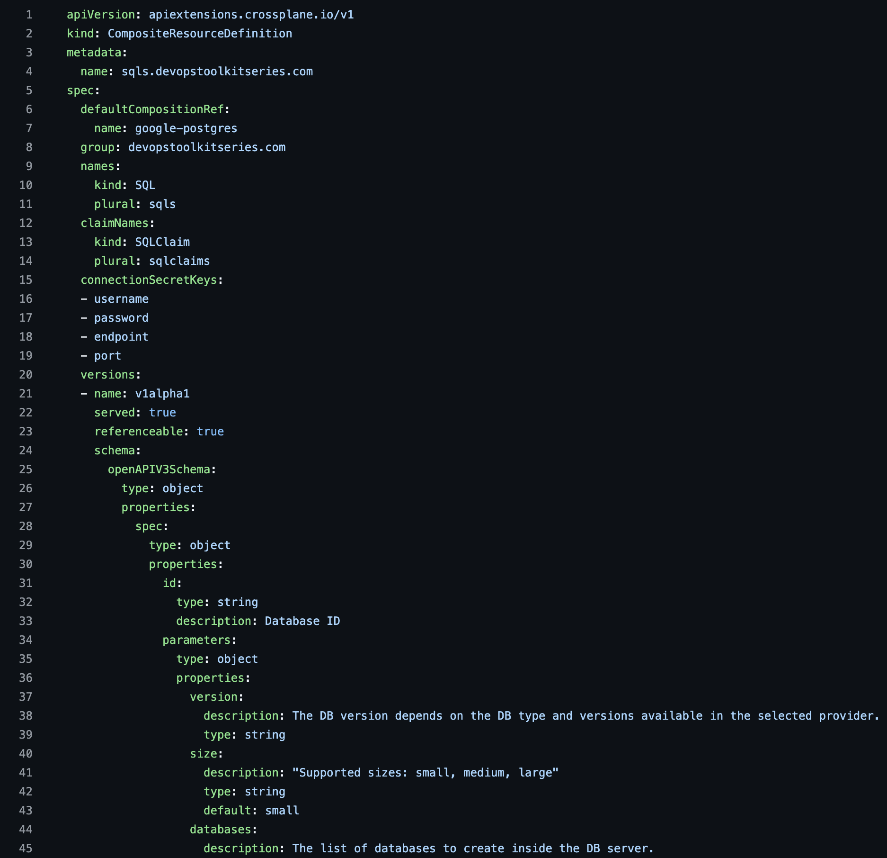

+++
title = 'Save Hours with DevEx for Crossplane'
date = 2024-11-18T01:00:00+00:00
draft = false
+++

Take a look at this.

I'll just say "let there be an XRD" and...

<!--more-->



## Intro

> Do not try to run the commands in this section. They are only a preview of what we'll explore in this post. Full instructions are available starting from the Setup section.

```sh
up xrd generate examples/sql/my-db.yaml

code apis/xsqls/definition.yaml
```

The output is as follows.

```yaml
apiVersion: apiextensions.crossplane.io/v1
kind: CompositeResourceDefinition
metadata:
  name: xsqls.devopstoolkit.live
spec:
  claimNames:
    kind: SQL
    plural: sqls
  group: devopstoolkit.live
  names:
    categories:
      - crossplane
    kind: XSQL
    plural: xsqls
  versions:
    - name: v1alpha1
      referenceable: true
      schema:
        openAPIV3Schema:
          description: SQL is the Schema for the SQL API.
          properties:
            spec:
              description: SQLSpec defines the desired state of SQL.
              properties:
                id:
                  type: string
                parameters:
                  properties:
                    databases:
                      items:
                        type: string
                      type: array
                    region:
                      type: string
                    size:
                      type: string
                    version:
                      type: string
                  type: object
              type: object
            status:
              description: SQLStatus defines the observed state of SQL.
              type: object
          required:
            - spec
          type: object
      served: true
```

Boom! Done!

I just saved you half an hour of work.

Is that not enough?

How about saving you much more time by enabling you to define Compositions as code with **IntellIsense** support in **VSCode**?

Think about those hundreds or even thousands of lines of YAML you wrote before when you were writing Compositions. Try to imagine how much time would be saved if you wrote code instead of YAML, if you had intellisense support in VSCode which allowed you to use auto-complete based on schemas from dependencies you chose? Think about the possibility to develop Crossplane resources in a **language of choice**, with full support from your favorite **IDE**, with commands to **build, push, test, deploy** the results of your work, with **CI/CD pipelines**, and all the other goodies we normally associate with development lifecycle.

Would that be something interesting?

If you answered "no" to that last question, I can only assume that you are not familiar with Crossplane, since I cannot imagine why would someone who is using it reject such an offer. If that's you, if you are new to Crossplane, stop watching this video and go through the [Crossplane Tutorial](https://youtube.com/playlist?list=PLyicRj904Z99i8U5JaNW5X3AyBvfQz-16) instead. You'll thank me later.

On the other hand, if you did say "yes", keep watching. I'll show you the beginning of something very exciting.

That something is... DevEx or developer experience for Crossplane users, or a way how to implement developer lifecycle for Crossplane, or a way develop Crossplane Compositions instead of doing whatever we were doing before or...

You'll see. It's exciting, and I want to jump straight into it.

> Before we continue, there is something very important you should be aware of. What I'm about to show you is in very early stage. As a matter of fact, I'm writing this post while what I'm showing is not even public. It's alpha, or pre-alpha, or pre-pre-alpha. By the time you read this, it probably changed a lot. Commands might have changed. New features have almost certainly been added. It might have been turned upside down. Keep that in mind while reading. I'm showing you very early version of an idea, or a proof of concept. This is **the worst version** of it you'll ever see. Your experience should be very different and much better. Heck, if you try to follow my instructions they are likely not going to even work because the solution likely changed drastically in the meantime, hopefully for better. I'm probably making a mistake by sharing this with you, but I was too excited to wait any longer.

Here we go!

## Setup

```sh
git clone https://github.com/vfarcic/upbound-devex-demo

cd upbound-devex-demo
```

> Watch [Nix for Everyone: Unleash Devbox for Simplified Development](https://youtu.be/WiFLtcBvGMU) if you are not familiar with Devbox. Alternatively, you can skip Devbox and install all the tools listed in `devbox.json` yourself.

```sh
devbox shell
```

> Install `up` CLI by following [the instructions](https://docs.upbound.io/reference/cli/#install-the-up-command-line).

> Replace `[...]` in the command that follows with your name (e.g., Viktor Farcic)

```sh
export NAME="[...]"
```

> Replace `[...]` in the command that follows with your email

```sh
export EMAIL="[...]"

export GIT_URL=$(git config --get remote.origin.url)
```

> Register at [Upbound Console](https://console.upbound.io/) if you haven't already.

> Replace `[...]` with your Upbound account.

```sh
export UP_ACCOUNT=[...]
```

> Install [KCL Language Server](https://www.kcl-lang.io/docs/user_docs/getting-started/install#install-language-server).

> Install [Visual Studio Code](https://code.visualstudio.com/download) (VSCode) and make sure that `code` command is working.

> Install VSCode plugins *KCL* and *Upbound*.

## Crossplane (Upbound) Project

This will be a story that starts slow. It's one of those that the more we progress the more interesting it gets.

It all starts with a project.

If we would like to develop Crossplane Configurations with Composite Definitions, Compositions, and everything else, the first step is to initiate a new project,...

```sh
up project init silly-demo
```

...and enter into it.

```sh
cd silly-demo/
```

Let's see what we got.

```sh
ls
```

The output is as follows.

```
-I apis
-I examples
-I functions
-I LICENSE
-I upbound.yaml
```

We got the `apis` directory where CompositeDefinitions and Compositions will reside. Then there is `functions` where the actual code of Compositions will be. Finally, there is `upbound.yaml` which is similar to *Configuration* we were defining in *crossplane.yaml*, but, this time, it is a different kind of resource which we'll explore soon.

The first major benefit is that now we have a standard. Instead of each of us trying to figure out how to organize Crossplane projects, we have a "standard" way to do so. Standards are good since they help us navigate other people's work more easily.


Another big improvement is that now everything is integrated with [VSCode](https://code.visualstudio.com). For example, we'll get IntelliSense with code completion which helps tremendously, especially when working with potentially big Compositions.

We'll see that in action soon. For now, let's just open VSCode.

```sh
code .
```

Let's take a look at `upbound.yaml` that was auto-generated for us when we initialized the project.

```sh
code upbound.yaml
```

The output is as follows.

```yaml
apiVersion: meta.dev.upbound.io/v1alpha1
kind: Project
metadata:
  creationTimestamp: null
  name: silly-demo
spec:
  description: This is where you can describe your project.
  license: Apache-2.0
  maintainer: Upbound User <user@example.com>
  readme: |
    This is where you can add a readme for your project.
  repository: xpkg.upbound.io/<YOUR ORGANIZATION>/silly-demo
  source: github.com/upbound/project-template
```

That file, for now, contains mostly the information that will help us later. That will change, very soon. For now, feel free to update it to match your data like the `maintainer`, the `repository` which should point to your Upbound organization, and the `source` which should point to the Git repository where you might want to keep the project we created.

> Open a terminal session in VSCode to execute the commands that follow as well as any other command throughout the rest of this post. Alternatively, when commands are modifying the files (like those that follow), you can make the changes directly in the VSCode editor.

```sh
yq --inplace ".spec.maintainer = \"$NAME <$EMAIL>\"" upbound.yaml

yq --inplace \
    ".spec.repository = \"xpkg.upbound.io/$UP_ACCOUNT/silly-demo\"" \
    upbound.yaml

yq --inplace ".spec.source = \"$GIT_URL\"" upbound.yaml
```

Next, we should probably start thinking about dependencies that are, most of the time, providers and functions that we'll use in our Compositions. Today, we'll be building a Composition that should manage PostgreSQL servers in AWS, Azure, and Google Cloud. To do that, we'll need `ec2`,...

```sh
up dependency add \
    "xpkg.upbound.io/upboundcare/provider-aws-ec2@>=v1.16.0"
```

... and `rds` providers for AWS.

```sh
up dependency add \
    "xpkg.upbound.io/upboundcare/provider-aws-rds@>=v1.16.0"
```

Then there is `dbforpostgresql` for Azure.

```sh
up dependency add \
    "xpkg.upbound.io/upbound/provider-azure-dbforpostgresql@>=v1.7.0"
```

Finally, there is also `sql` provider for Google Cloud.

```sh
up dependency add \
    "xpkg.upbound.io/upbound/provider-gcp-sql@>=v0.33.0"
```

We'll also add the generic `sql` provider that we can use for generic resources that are the same in all three hyperscalers.

```sh
up dependency add \
    "xpkg.upbound.io/crossplane-contrib/provider-sql@>=v0.9.0"
```

We should probably add the `kubernetes` provider if we would like to have custom-made Kubernetes secrets.

```sh
up dependency add \
    "xpkg.upbound.io/crossplane-contrib/provider-kubernetes@>=v0.15.0"
```

Finally, we'll add the `status-transformer` function that might help us to [propagate relevant statuses](https://youtu.be/KLHNrLWmBfw) to claims.

```sh
up dependency add \
    "xpkg.upbound.io/crossplane-contrib/function-status-transformer@v0.4.0"
```

Those commands should have simplified management of dependencies and we can see the outcome by taking another look at `upbound.yaml`.

```sh
code upbound.yaml
```

The output is as follows.

```yaml
apiVersion: meta.dev.upbound.io/v1alpha1
kind: Project
metadata:
  name: silly-demo
spec:
  dependsOn:
  - provider: xpkg.upbound.io/upboundcare/provider-aws-ec2
    version: '>=v1.16.0'
  - provider: xpkg.upbound.io/upboundcare/provider-aws-rds
    version: '>=v1.16.0'
  - provider: xpkg.upbound.io/upbound/provider-azure-dbforpostgresql
    version: '>=v1.7.0'
  - provider: xpkg.upbound.io/upbound/provider-gcp-sql
    version: '>=v0.33.0'
  - provider: xpkg.upbound.io/crossplane-contrib/provider-sql
    version: '>=v0.9.0'
  - provider: xpkg.upbound.io/crossplane-contrib/provider-kubernetes
    version: '>=v0.15.0'
  - function: xpkg.upbound.io/crossplane-contrib/function-status-transformer
    version: '>=v0.4.0'
  description: This is where you can describe your project.
  license: Apache-2.0
  maintainer: Viktor Farcic <viktor@farcic.com>
  readme: |
    This is where you can add a readme for your project.
  repository: xpkg.upbound.io/devops-toolkit/silly-demo
  source: https://github.com/vfarcic/upbound-devex-demo
```

We can see that all the dependencies have been added as `dependsOn` entries. Some of them are providers (`provider`) while others are functions (`function`).

The next chapter in this story will spice it up. As I already mentioned, it gets better with time.

## Crossplane Composite Resource Definitions (XRDs)

There are two main types of resources we need to define when trying to build services with Crossplane. There are Composite Resource Definitions and Compositions themselves. Right now we are going to focus on the former.

Typically, we would start the work by writing the *CompositeResourceDefinition* or XRD. That's what ultimately becomes Kubernetes Custom Resource Definition. That's what creates new interfaces the consumers of your service will interact with. That's what allows people to define claims.

Now, to be honest, writing XRDs is tedious.

Here's an example.

> Please watch https://youtu.be/BII6ZY2Rnlc if you are not familiar with GitHub CLI.

```sh
gh browse --repo vfarcic/crossplane-sql package/definition.yaml
```



Now, I won't go into details of that XRD. As I already mentioned, today I'm assuming that you are familiar with Crossplane and, more importantly, that you experienced the pain of writing XRDs.

Today, we'll take a very different approach. Instead of writing XRDs directly, we'll approach the problem from a different angle. We'll define examples of what we feel our users should be defining as claims. In other words, we'll define the end-user experience first, and let the CLI do the heavy lifting of defining the XRD based on those.

We can define baseline claims or composite resources by executing `up example generate`.

```sh
up example generate
```

The output is as follows.

```
What do you want to create? [type to search]: 
> Composite Resource Claim (XRC)
  Composite Resource (XR)
```

That command walks us through a series of questions and will use the answers to generate the initial claim or a composite resource.

While that is great, I'm personally not very fond of wizards so, instead, we'll execute that same command with the information provided as arguments.

> Press `ctrl+c` to cancel the "wizard".

```sh
up example generate --name my-db \
    --namespace default --type xrc --kind SQL \
    --api-group devopstoolkit.live \
    --api-version v1alpha1
```

The output is as follows.

```
Successfully created resource and saved to examples/sql/my-db.yaml
```

We can see, from the output, that it generated `my-db.yaml` file, so let's take a look at what we got.

```sh
code examples/sql/my-db.yaml
```

The output is as follows.

```yaml
apiVersion: devopstoolkit.live/v1alpha1
kind: SQL
metadata:
  name: my-db
  namespace: default
spec: {}
```

That's the base definition of a claim that we expect our users to define.

> Replace `spec: {}` with the YAML that follows in `examples/sql/my-db.yaml`.

```yaml
spec:
  id: my-db
  compositionSelector:
    matchLabels:
      provider: aws
      db: postgresql
  parameters:
    version: "16.2"
    size: medium
    region: us-east-1
```

Let's spice it up a bit by saying that they should be able to set the `id`. Since that database server should work in AWS, Azure, and Google Cloud, the user might want to specify which one should be used through `matchLabels` and, in this case, we'll say that the `provider` should be `aws` and that the `db` should be `postgresql` since, at least in theory, there might be an option to use MySQL or some other database server as well.

You'll notice that, as we type, IntelliSense is showing us what's wrong by giving us warnings, errors, and suggestions. Nevertheless, that's only the tip of the iceberg. You'll see IntelliSense in its true glory later.

We'll also define a few `parameters` like the `version`, set the `size` to `medium`, and the `region` to `us-east-1`.

What we did is fictitious. There is no `kind` `SQL` in our clusters. No one created that CRD. All we did was to define what the users might expect to have as the interface when creating databases.

Think of the phase we just went through as design. Now that we're done, we should convert all those examples into the actual XRD that will, eventually, become a Kubernetes CRD.

So, we'll execute `up xrd generate` with the path to our example, and press the enter key.

```sh
up xrd generate examples/sql/my-db.yaml
```

The output is as follows.

```
Successfully created CompositeResourceDefinition and saved to apis/xsqls/definition.yaml
```

Let's take a look at what we got.

```sh
code apis/xsqls/definition.yaml
```

The output is as follows.

```yaml
apiVersion: apiextensions.crossplane.io/v1
kind: CompositeResourceDefinition
metadata:
  name: xsqls.devopstoolkit.live
spec:
  claimNames:
    kind: SQL
    plural: sqls
  group: devopstoolkit.live
  names:
    categories:
    - crossplane
    kind: XSQL
    plural: xsqls
  versions:
  - name: v1alpha1
    referenceable: true
    schema:
      openAPIV3Schema:
        description: SQL is the Schema for the SQL API.
        properties:
          spec:
            description: SQLSpec defines the desired state of SQL.
            properties:
              id:
                type: string
              parameters:
                properties:
                  region:
                    type: string
                  size:
                    type: string
                  version:
                    type: string
                type: object
            type: object
          status:
            description: SQLStatus defines the observed state of SQL.
            type: object
        required:
        - spec
        type: object
    served: true
```

That is a full `CompositeResourceDefinition` that we would normally define ourselves. That's the tedious part we just avoided by creating it based on the example we expect users to write when defining the claim. We inverted the order in which we do things. The goal was to focus on the end-user experience and let the CLI generate the XRD that should support it.

From now on, we could fine tune it if there are special cases that were not covered. That won't be necessary for today's demo, so let's move on and see how we can write Compositions in a better way. If what we did so far generated even a mild excitement, what's coming next will be huge.

## Crossplane Compositions

There are two important parts to be aware of when defining Compositions. There is the Composition itself or, to be more precise, the boiler-plate code that is necessary for any Composition. Then there is code that defines which managed resources will be handled by a Composition. Let's see how we can do both, starting with the boiler-plate code by executing `up composition generate`, pass the path to the XRD we created earlier, and finishing with the `--path` where the Composition should be created.

```sh
up composition generate apis/xsqls/definition.yaml \
    --path apis/xsqls/aws.yaml
```

The output is as follows.

```
successfully created Composition and saved to apis/xsqls/google.yaml
```

Let's see what we got.

```sh
code apis/xsqls/aws.yaml
```

The output is as follows.

```yaml
apiVersion: apiextensions.crossplane.io/v1
kind: Composition
metadata:
  name: xsqls.devopstoolkit.live
spec:
  compositeTypeRef:
    apiVersion: devopstoolkit.live/v1alpha1
    kind: XSQL
  mode: Pipeline
  pipeline:
  - functionRef:
      name: crossplane-contrib-function-status-transformer
    input:
      apiVersion: function-status-transformer.fn.crossplane.io/v1beta1
      kind: StatusTransformation
      metadata: {}
    step: crossplane-contrib-function-status-transformer
  - functionRef:
      name: crossplane-contrib-function-auto-ready
    step: crossplane-contrib-function-auto-ready
```

That was the boring part that has to be done, yet we did not have to spend any time getting it.

The interesting part is that the Composition we created contains not only the standard parts we always need to have, but it also figured out that, in this case, we want to use the `status-transformer` and `auto-ready` functions, so it added those as well.

That was the boring part. The truly interesting stuff comes up next.

We are about to start working on the function that will assemble all managed resources we might want to include into the Composition. We could do that by writing a ton of YAML, but we won't. That would be silly since using functions is much more efficient and more flexible way to define what we need.

Right now, by the time I'm writing this post, we could use KCL or Python. By the time you're reading this, additional languages might be supported and, eventually, a ton of them should be available.

Since I prefer KCL and you don't have a say in it, that's what we'll use today, and you should know that's not the only option if KCL is not your thing.

Here it goes.

We want a `function` to be generated with the name `aws` and for the Composition `aws.yaml`.

```sh
up function generate aws apis/xsqls/aws.yaml
```

The output is as follows.

```
  ✓   Checking dependencies                                     
  ✓   Generating Function Folder                                
  ✓   Adding Pipeline Step in Composition                       
successfully created Function and saved to /Users/viktorfarcic/code/upbound-devex-demo/silly-demo/functions/aws
```

That command did quite a few things.

It inspected the dependencies in the project and, based on what we have there, downloaded schemas that will provide us with IntelliSense in VSCode. Through them, we'll get auto-complete and other nice things we're used to have when developing something.

On top of that, it skaffolded the files we might need to develop the function that will define all the managed resources we want that Composition to manage.

Let's see what we got.

```sh
ls functions/aws
```

The output is as follows.

```
-I kcl.mod
-I kcl.mod.lock
-I main.k
-I model -> ../../../../.up/kcl/models
```

Since, in this case, I chose to use KCL, it created, among other things, the `main.k` file which we should modify to suit our needs. Let's take a look at it.

```sh
code functions/aws/main.k
```

The output is as follows.

```kcl
import models.v1beta1 as v1beta1
import models.v1beta2 as v1beta2
import models.v1beta3 as v1beta3
import models.k8s.apimachinery.pkg.apis.meta.v1 as metav1

oxr = option("params").oxr # observed composite resource
_ocds = option("params").ocds # observed composed resources
_dxr = option("params").dxr # desired composite resource
dcds = option("params").dcds # desired composed resources

_metadata = lambda name: str -> any {
    { annotations = { "krm.kcl.dev/composition-resource-name" = name }}
}

_items = [

]
items = _items
```

We can see that it imported (`import`) the schemas for all the resources available in the dependencies we added earlier.

Further on, it defined variables like `oxr` that contains the observed composite resource, `_ocds` with observed composed resources, as well as `_dxr` and `dcds` with desired composite and composed resources. Those might look confusing if you're not used to working with the KCL function. We'll see them in action very soon.

The important part is the `_items` array. That's where we should add managed resources that should be managed by that Composition. We'll see how to do that in a moment. For now, let's see how we can use one of the predefined variables.

Let's say that we would like to extract the region we said we'll allow users to specify when creating Claims.

We can do that by defining the variable `_region` and, for now, setting it to `us-east-1`.

Next, we'll create a conditional (`if`) that checks whether `spec`, and, inside it, `parameters`, and, inside it, `region` is set. Those and all other params are available in `oxr` as the observed composite resource.

If the *region* is indeed set, we're putting it as the value of the `_region` variable.

> The final version should look like the snippet that follows.

```kcl
...
}

_region = "us-east-1"
if oxr.spec?.parameters?.region:
    _region = oxr.spec.parameters.region

_items = [
...
```

All that was pretty boring. What comes next is what makes a true difference and we can see it if we add the first resource to the `_items` array.

Let's say that we would like to add AWS Internet Gateway. In the past, we would need to find out the spec and start typing or copying and pasting parameters. That's not the case any more. Now we have IntelliSense and, given that it is version `v1beta1`, we can type just that followed with dot (`.`) and... Lo and behold. We got the list of all the resources that belong to *v1beta1* and we can just start typing `Inter`, select `InternetGateway`, and press the enter key.

Next, we should add *metadata* following the same process. Type `meta`, select `metadata`, press the enter key.

We'll assign it the value of the `_metadata` lambda.

Let's do a few more inside the *spec*.

Type `sp`, select `spec`, type `.` followed with `for`, select `forProvider` and assign it to... It autocompleted it for us.

Inside the `provider`, we should add the `region` with whatever the value of the `_region` variable we defined earlier is.

Let's also set the `vpcIdSelector.matchControlelrRef` to `True`.

> The final version should look like the snippet that follows.

If you tried to define a managed resource in the past, you must admit that IntelliSense alone is a massive help.

Let's do an experiment.

I'll write the code for all the resources and time it. Let's see how long that will take.

This is how the final version looks like.

```kcl
code ../aws.k
```

The output is as follows.

```kcl
import models.v1beta1 as v1beta1
import models.v1beta2 as v1beta2
import models.v1beta3 as v1beta3
import models.k8s.apimachinery.pkg.apis.meta.v1 as metav1

oxr = option("params").oxr # observed composite resource
_ocds = option("params").ocds # observed composed resources
_dxr = option("params").dxr # desired composite resource
dcds = option("params").dcds # desired composed resources

_metadata = lambda name: str -> any {
    {
        name = oxr.spec.id
        annotations = { "krm.kcl.dev/composition-resource-name" = name }
    }
}

_region = "us-east-1"
if oxr.spec?.parameters?.region:
    _region = oxr.spec.parameters.region

_items = [
    v1beta1.InternetGateway {
        metadata = _metadata("gateway")
        spec.forProvider = v1beta1.Ec2AwsUpboundIoV1beta1InternetGatewaySpecForProvider{
            region = _region
            vpcIdSelector.matchControllerRef = True
        }
    },
    v1beta1.MainRouteTableAssociation {
        metadata = _metadata("mainRouteTableAssociation")
        spec.forProvider = v1beta1.Ec2AwsUpboundIoV1beta1MainRouteTableAssociationSpecForProvider{
            region = _region
            routeTableIdSelector.matchControllerRef = True
            vpcIdSelector.matchControllerRef = True
        }
    },
    v1beta1.RouteTable {
        metadata = _metadata("routeTable")
        spec.forProvider = v1beta1.Ec2AwsUpboundIoV1beta1RouteTableSpecForProvider{
            region = _region
            vpcIdSelector.matchControllerRef = True
        }
    },
    v1beta1.Route {
        metadata = _metadata("route")
        spec.forProvider = v1beta1.Ec2AwsUpboundIoV1beta1RouteSpecForProvider{
            region = _region
            routeTableIdSelector.matchControllerRef = True
            destinationCidrBlock = "0.0.0.0/0"
            gatewayIdSelector.matchControllerRef = True
        }
    },
    v1beta1.SecurityGroupRule {
        metadata = _metadata("securityGroupRule")
        spec.forProvider = v1beta1.Ec2AwsUpboundIoV1beta1SecurityGroupRuleSpecForProvider{
            region = _region
            description = "I am too lazy to write descriptions"
            type = "ingress"
            fromPort = 5432
            toPort = 5432
            protocol = "tcp"
            cidrBlocks = ["0.0.0.0/0"]
            securityGroupIdSelector.matchControllerRef = True
        }
    },
    v1beta1.SecurityGroup {
        metadata = _metadata("securityGroup")
        spec.forProvider = v1beta1.Ec2AwsUpboundIoV1beta1SecurityGroupSpecForProvider{
            region = _region
            description = "I am too lazy to write descriptions"
            vpcIdSelector.matchControllerRef = True
        }
    },
    v1beta1.VPC {
        metadata = _metadata("vpc")
        spec.forProvider = v1beta1.Ec2AwsUpboundIoV1beta1VPCSpecForProvider{
            region = _region
            cidrBlock = "11.0.0.0/16"
            enableDnsSupport = True
            enableDnsHostnames = True
        }
    },
    v1beta1.SubnetGroup {
        metadata = _metadata("subnetgroup")
        spec.forProvider = v1beta1.RdsAwsUpboundIoV1beta1SubnetGroupSpecForProvider{
            region = _region
            description = "I'm too lazy to write a good description"
            subnetIdSelector.matchControllerRef = True
        }
    },
    v1beta2.Instance {
        metadata = _metadata("rdsinstance")
        spec.forProvider = v1beta2.RdsAwsUpboundIoV1beta2InstanceSpecForProvider{
            region = _region
            dbSubnetGroupNameSelector.matchControllerRef = True
            vpcSecurityGroupIdSelector.matchControllerRef = True
            username = "masteruser"
            engine = "postgres"
            skipFinalSnapshot = True
            publiclyAccessible = True
            allocatedStorage = 200
            passwordSecretRef = v1beta2.RdsAwsUpboundIoV1beta2InstanceSpecForProviderPasswordSecretRef {
                name = oxr.spec.id + "-password"
                namespace = oxr.spec.claimRef.namespace
                key = "password"
            }
            identifier = oxr.spec.id
            if oxr.spec.parameters.size == "small":
                instanceClass = "db.m5.large"
            elif oxr.spec.parameters.size == "medium":
                instanceClass = "db.m5.2xlarge"
            else:
                instanceClass = "db.m5.8xlarge"
            engineVersion = oxr.spec.parameters.version
        }
    },
    {
        **oxr
        if "rdsinstance" in _ocds:
            status.address = _ocds["rdsinstance"].Resource.status.atProvider.address
    }
]

_zoneList = [
    { zone = "a", cidrBlock = "11.0.0.0/24" },
    { zone = "b", cidrBlock = "11.0.1.0/24"  },
    { zone = "c", cidrBlock = "11.0.2.0/24"  }
]

_routeTableAssociations = [
    v1beta1.RouteTableAssociation {
        metadata = {
            name = oxr.spec.id + "-1" + _data.zone
            annotations = {
                "krm.kcl.dev/composition-resource-name" = "routeTableAssociation1" + _data.zone
            }
        }
        spec.forProvider = v1beta1.Ec2AwsUpboundIoV1beta1RouteTableAssociationSpecForProvider{
            region = _region
            routeTableIdSelector.matchControllerRef = True
            subnetIdSelector = v1beta1.Ec2AwsUpboundIoV1beta1RouteTableAssociationSpecForProviderSubnetIDSelector{
                matchControllerRef = True
                matchLabels = { zone = _region + _data.zone }
            }
        }
    } for _data in _zoneList
]

_subnets = [
    v1beta1.Subnet {
        metadata = {
            name = oxr.spec.id + "-" + _data.zone
            annotations = {
                "krm.kcl.dev/composition-resource-name" = "subnet-" + _data.zone
            }
            labels = { zone = _region + _data.zone }
        }
        spec.forProvider = v1beta1.Ec2AwsUpboundIoV1beta1SubnetSpecForProvider{
            region = _region
            availabilityZone = _region + _data.zone
            cidrBlock = _data.cidrBlock
            vpcIdSelector.matchControllerRef = True
        }
    } for _data in _zoneList
]

_objects = [{
    apiVersion = "kubernetes.crossplane.io/v1alpha2"
    kind = "Object"
    metadata = {
        name = oxr.spec.id + "-secret"
        annotations = {
            "krm.kcl.dev/ready": "True"
            "krm.kcl.dev/composition-resource-name" = "sql-secret"
        }
    }
    spec = {
        references = [{
            patchesFrom = {
                apiVersion = "rds.aws.upbound.io/v1beta1"
                kind = "Instance"
                name = oxr.spec.id
                namespace = "crossplane-system"
                fieldPath = "spec.forProvider.username"
            }
            toFieldPath = "stringData.username"
        }, {
            patchesFrom = {
                apiVersion = "v1"
                kind = "Secret"
                name = oxr.spec.id + "-password"
                namespace = oxr.spec.claimRef.namespace
                fieldPath = "data.password"
            }
            toFieldPath = "data.password"
        }, {
            patchesFrom = {
                apiVersion = "rds.aws.upbound.io/v1beta1"
                kind = "Instance"
                name = oxr.spec.id
                namespace = "crossplane-system"
                fieldPath = "status.atProvider.address"
            }
            toFieldPath = "stringData.endpoint"
        }]
        forProvider.manifest = {
            apiVersion = "v1"
            kind = "Secret"
            metadata = {
                name = oxr.spec.id
                namespace = oxr.spec.claimRef.namespace
            }
            data.port = "NTQzMg=="
        }
        providerConfigRef.name = oxr.spec.id + "-sql"
    }
}]

items = _items + _routeTableAssociations + _subnets + _objects
```

I wrote all that in more or less, 15 minutes. In the past I would probably spend a few hours to accomplish the same result. Isn't that awesome?

Now, let's say that we're finished developing the Composition. The next thing we should do is build and publish the whole project.

## Build and Push Projects

All that's left is to `build`,...

```sh
up project build
```

...and `push` it to the registry as version `v0.0.1`.

```sh
up project push --tag v0.0.1
```

That's it. The whole project is now published as an OCI image that contains everything we might need to run it in a control plane, and this was the shortest section I ever put into a video.

## This Is NOT The End

There are many other goodies coming or, by the time you read this, already available. We should be able to create ephemeral control planes where we could test our Compositions before publishing them. We could have created a permanent production-ready control plane where we would run the Composition we built and allow our users to create claims. We should be able to see the analysis of the changes before applying them. We could have automated the whole process with Workflows like, for example, GitHub Actions or Argo Workflows or Jenkins or whatever we might be using. There are many other things we could have done, and even more that's coming soon under the umbrella of developer experience.

However, we're done for today. I'll explore more in upcoming posts. In the meantime, visit [Upbound](https://upbound.io) and check out the new features yourself.

## Destroy

```sh
up repository delete silly-demo --force

up repository delete silly-demo_aws --force

exit
```

