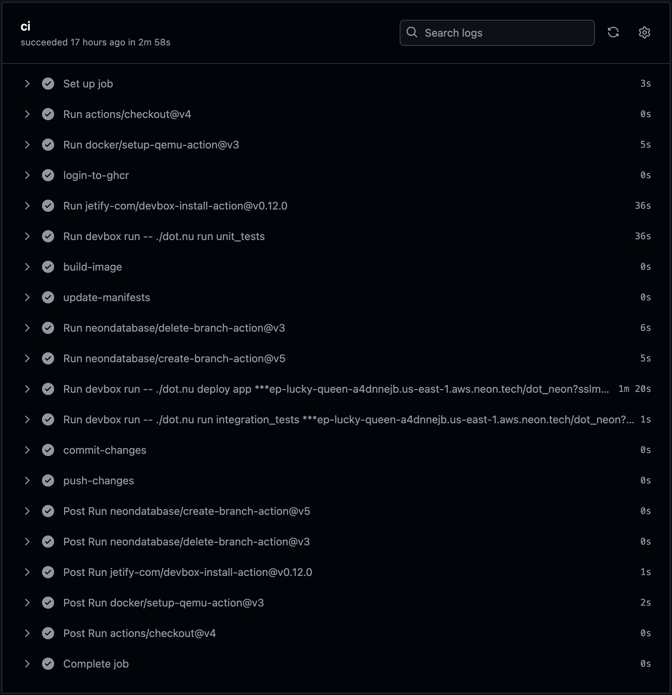

+++
title = 'Neon - Never Share Databases Again!'
date = 2025-03-03T15:00:00+00:00
draft = false
+++

Take a look at this.



That is GitHub actions run that executed hopefully typical tasks anyone is executing every time a pull request is opened. It run unit tests, it build a container image and pushed it to a registry, it update manifests so that, later on Argo CD or Flux can deploy the new release to production when that PR is merged to mainline. But, before that happens, it created an ephemeral Kubernetes cluster and run integration tests to confirm that everything works as expected.

I hope that's what everyone is doing and, if that's not the case, please let me know in the comments and I'll do my best to make a video about the whole process.

There is one "special" part of that workflow run that I did not yet mention. There is something that hadly anyone does, yet something very important.

<!--more-->



That workflow run created a **new database instance** that should be used only and exclusively with that PR. To make it more interesting, that new database instance contains all the data we have in production or, when that is not a good option for security reasons, most of the data we have in production. As a result, those integration, or any other type of tests, including manual ones, can be performed with full confidence that **what we're testing is mostly the same as what is in production**, at least when data is concerned.

Now, that by itself is relatively easy to do, as long as making bad decisions does not bother you.

We could have connected that ephemeral environment to the production database, and risk messing up the data by changing schema or modifying "real" data. I doubth that anyone would do that. It would be silly to mess up production data for the sake of checking whether your commits are working as expected before they are even deployed to production.

An alternative could be to have a separate production-like database with production-like data. Everyone can connect to that database. Right?

That's almost just as silly as the previous option since that results in constant clashes or constant delays. One developer would modify schema in a way that affects, negatively, the work of other developers. Some tests would introduce data that should not be there. Someone would delete data that is needed by other people working on the same project.

**Shared databases are a horrible idea** and the only solution is to give every developer and every ephemeral environment its own database.

With that in mind, we could make a completely new database instance every time for every development environment and every ephemeral environment. In each of those we could restore a backup of production data and, if needed, obfuscate confidential information. That would give us the safety of knowing that whatever we mess up is affecting only that new database instance, but not production and not other people working with us.

That, however, comes with its own set of problems. First of all, creating a new database instance can take a few minutes. Now, you might think that a few minutes lost on each pull request is not a big deal, and, if that's what you're thinking, I would agree. However, we should add to that time the time needed to restore a production backup and, potentially, obfuscate confidential information. That could be, somehow, streamlined as well, so now, if we did everything right, we lost around ten minutes. That's not a big deal. Right?

That's not where it ends though. Having a separate database instance that uses, potentially significant amount of **memory and CPU costs money** by itself. Add to that the cost of storage where data is stored, and that's even more money. Now, multiply all that with the number of open pull request and the cost keeps piling up. Once you're done calculating that, multiply it with the number of development environments since, apart from open pull requests, everyone should have their own database to work with, and the costs keep piling up. Soon you'll go bankrupt, or revert back to the pain caused by everyone using the same database both for development and the release process.

All in all, running a separate database instance with separate data would be a way to go if it wouldn't be too slow and it would not cost too much.

Ideally, all those databases would be **ephemeral** as well. They would exist only as long as they are needed to exist. They would also be serveless so that they waste CPU and memory only when used and shut down when not. Running serverless workloads is not anything new, even when that applies to stateful applications like databases. We could do something like that. Right?

Data in the storage attached to those databases should be shared, but any change to that data should not be applied to the main production or production-like database but in a separate branch. We are already doing something like that with Git. There is mainline, typically production, and there are branches. Those branches are not copies but references to the mainline branch that contain only the differences. That's how Git keeps being performant. However, we cannot use Git as database storage. It's not designed to do that. What we need though is to apply the same principles to database storage. Right?

Finally, all that needs to be fast. I expect creation of a new serverless database instance and a branch of production-like data to take seconds, and not minutes or hours. Otherwise, execution of workflow runs triggered by pull requests would take too long. Similarly, people would get very annoyed if it would take an hour to spin up a development environment every time we start working. For all I know, you might have choosen to watch this video mainly because you were bored while waiting for such an environment to spin up.


Now, if we go back to the GitHub Actions workflow run we saw earlier, we can see that all those ideas are already implemented there. It took **five seconds** (`5s`) to create a new database instance that contains whole production or production-like data. It's a branch so, until I start changing that data, no extra storage is used. The database itself is **serverless** meaning that it will run only when used and it will scale down to zero replicas when not. As a result, memory and CPU are spent only when the database is used.

All in all, it is fast, it uses memory and CPU only while being in use, and it uses storage only for the differences made on top of the existing data. It's the **fastest and cheapest** possible solution that allows everyone and everything to have a separate database instance be it while developing or for ephemeral environments, or anything else but production itself.

Let me show you how I did all that. It's easy, as long as you know which tool or service to use.

## Setup

> Replace `[...]` with your GitHub organization or username

```sh
export GITHUB_ORG=[...]
```

> Watch the [GitHub CLI (gh) - How to manage repositories more efficiently](https://youtu.be/BII6ZY2Rnlc) video if you are not familiar with GitHub CLI.

```sh
gh repo fork vfarcic/neon-demo --clone --remote \
    --org $GITHUB_ORG

cd neon-demo

gh repo set-default
```

> Select the fork as the default repository.

> Watch [Nix for Everyone: Unleash Devbox for Simplified Development](https://youtu.be/WiFLtcBvGMU) if you are not familiar with Devbox. Alternatively, you can skip Devbox and install all the tools listed in `devbox.json` yourself.

```sh
devbox shell
```

> Install [neonctl](https://neon.tech/docs/reference/neon-cli).

> Watch [The Future of Shells with Nushell! Shell + Data + Programming Language](https://youtu.be/zoX_S6d-XU4) if you are not familiar with Nushell. Alternatively, you can inspect the `dot.nu` script and transform the instructions in it to Bash or ZShell if you prefer not to use that Nushell script.

```sh
chmod +x dot.nu

./dot.nu setup

source .env
```

## Database Branches for Local Development with Neon

Here's what I did.

I have a production database running somewhere. It could be AWS RDS, Azure Database for PostgreSQL, Google Cloud SQL, self-managed Cloud-Native PostgreSQL, or anything else. It does not matter where my production database is. What matters is that I created a backup of it and restored it in [Neon](https://neon.tech).

Neon makes makes everything I'll show you today possible. It is a serverless platform that separates compute and storage, and branches data in a similar way we branch Git repositories. I rarely say that something is awesome, especially early on in a video, but I'll say it now. It's awesome.

Let's take a look at the replica of production I made in Neon.

First, I'll use its CLI to get the connection string.

```sh
export NEON_CONN=$(neonctl connection-string main)
```

Next, I'll connect to it using `psql` and list all the tables (`\dt`) I have over there.

```sh
psql $NEON_CONN --command "\dt"
```

The output is as follows.

```
                 List of relations
 Schema |         Name         | Type  |   Owner
--------+----------------------+-------+-----------
 public | lego_colors          | table | dot_owner
 public | lego_inventories     | table | dot_owner
 public | lego_inventory_parts | table | dot_owner
 public | lego_inventory_sets  | table | dot_owner
 public | lego_part_categories | table | dot_owner
 public | lego_parts           | table | dot_owner
 public | lego_sets            | table | dot_owner
 public | lego_themes          | table | dot_owner
(8 rows)
```

That is the database that contains the complete lego inventory.

*I hope you understand that I cannot show you my production data and allow you to copy it. That would get me fired, and I need my steady income so that I can keep making videos like this one for free. Lego database is decently big to be considered production-size. It's not necessarily the biggest one out there, but it is big enough to show you how it all works and, more importantly, allow you to try it all out without using your production data.*

We can, for example, count the number of records in the `lego_inventory_parts` table.

```sh
psql $NEON_CONN --command \
    "SELECT COUNT(*) FROM lego_inventory_parts;"
```

The output is as follows.

```
 count
--------
 580251
(1 row)
```

There's over half a million records there. That's already a decent size database that goes way beyond a silly demo I normally use. It can be considered a small production.

Here comes the interesting part.

Just as with Git, we can list all the branches by executing `neonctl branches list`.

```sh
neonctl branches list
```

The output is as follows.

```
┌───────────────────────────┬──────┬─────────┬───────────────┬──────────────────────┐
│ Id                        │ Name │ Default │ Current State │ Created At           │
├───────────────────────────┼──────┼─────────┼───────────────┼──────────────────────┤
│ br-withered-pond-a44nofnh │ main │ true    │ ready         │ 2025-01-21T12:40:43Z │
└───────────────────────────┴──────┴─────────┴───────────────┴──────────────────────┘
```

We can see that, just as with Git, there is initially only the `main` branch which happens to be the `default`.

*Here's my first complaint to Neon folks. Please make a consistent experience. Earlier outputs were giving me, by default, tables formatted as Markdown while this one is giving me a "proper" table. That's inconsistent and, as such, confusing.*

Now, let's say that John would like to start working on a project locally. Among other things, John needs a database for his application and, to make his life easier, he needs it to have production-like data.

John can simply create a new branch of the database just as he would create a new branch of the Git repo with the source code of the application he wants to work on.

He could do that by executing `neonctl branches create` and give it a unique name, just as one would give a branch a unique name.

```sh
neonctl branches create --name dev/john-doe
```

The output is as follows (truncated for brevity).

```
branch
┌─────────────────────────┬──────────────┬─────────┬───────────────┬──────────────────────┐
│ Id                      │ Name         │ Default │ Current State │ Created At           │
├─────────────────────────┼──────────────┼─────────┼───────────────┼──────────────────────┤
│ br-sparkling-thunder... │ dev/john-doe │ false   │ init          │ 2025-01-29T18:03:16Z │
└─────────────────────────┴──────────────┴─────────┴───────────────┴──────────────────────┘
endpoints
┌────────────────────────┬──────────────────────┐
│ Id                     │ Created At           │
├────────────────────────┼──────────────────────┤
│ ep-bold-block-a4zcnnv5 │ 2025-01-29T18:03:16Z │
└────────────────────────┴──────────────────────┘
connection_uris
┌──────────────────────────────────────────────────────────────────┐
│ Connection Uri                                                   │
├──────────────────────────────────────────────────────────────────┤
│ postgresql://dot_owner:...aws.neon.tech/dot_neon?sslmode=require │
└──────────────────────────────────────────────────────────────────┘
```

Boom! It took no time to create it.

Right now he has, effectively, a new database with all the data he needs while, at the same time, he did not have to create a new storage and duplicate all the data. Right now, his database is using memory and CPU, but the data is still the same.

Let's confirm that the branch was indeed created correctly by listing all the branches.

```sh
neonctl branches list
```

The output is as follows (truncated for brevity).

```
┌─────────────────────────┬──────────────┬─────────┬───────────────┬──────────────────────┐
│ Id                      │ Name         │ Default │ Current State │ Created At           │
├─────────────────────────┼──────────────┼─────────┼───────────────┼──────────────────────┤
│ br-sparkling-thunder... │ dev/john-doe │ false   │ ready         │ 2025-01-29T18:03:16Z │
├─────────────────────────┼──────────────┼─────────┼───────────────┼──────────────────────┤
│ br-withered-pond...     │ main         │ true    │ ready         │ 2025-01-21T12:40:43Z │
└─────────────────────────┴──────────────┴─────────┴───────────────┴──────────────────────┘
```

We can see that his branch (`dev/john-doe`) is there and that it is `ready` to be used.

Let's see whether it is indeed working. First, we'll retrieve the `connection-string` pointing to the `john-doe` branch.

```sh
export NEON_CONN_DEV=$(neonctl connection-string dev/john-doe)
```

*Please note that we stored the connection to the branch as `NEON_CONN_DEV` variable. From here on, whenever we use that variable we'll be operating the database with the data from that branch, while *NEON_CONN* variable will continue being used to connect to the *main* branch. That way you'll always know which one we're using at any given moment.*

Now we can retrieve all the tables from that new database branch.

```sh
psql $NEON_CONN_DEV --command "\dt"
```

The output is as follows.

```
                 List of relations
 Schema |         Name         | Type  |   Owner
--------+----------------------+-------+-----------
 public | lego_colors          | table | dot_owner
 public | lego_inventories     | table | dot_owner
 public | lego_inventory_parts | table | dot_owner
 public | lego_inventory_sets  | table | dot_owner
 public | lego_part_categories | table | dot_owner
 public | lego_parts           | table | dot_owner
 public | lego_sets            | table | dot_owner
 public | lego_themes          | table | dot_owner
(8 rows)
```

There we go. We can see that database has all the same tables as the original one, just as a Git branch would have all the same files as the one it was taken from.

We can confirm that further by retriving the count of all the records in the `lego_themes` table.

```sh
psql $NEON_CONN_DEV --command "SELECT COUNT(*) FROM lego_themes;"
```

The output is as follows.

```
 count
-------
   614
(1 row)
```

Here comes the truly interesting part.

Since that is a branch of data, we can do anything we want without risking pollution of the original data.

For example, we can add a new record to the `lego_themes` table.

```sh
psql $NEON_CONN_DEV --command \
    "INSERT INTO lego_themes (id, name, parent_id)
    VALUES (999, 'DevOps Toolkit', 1);"
```

Let's retrieve the records count one more time.

```sh
psql $NEON_CONN_DEV --command "SELECT COUNT(*) FROM lego_themes;"
```

The output is as follows.

```
 count
-------
   615
(1 row)
```

Now we have `615` records.

Okay. Let's do something more destructive like `drop` of that table,...

```sh
psql $NEON_CONN_DEV --command "DROP table lego_parts;"
```

...and take another look at all the tables in that database branch.

```sh
psql $NEON_CONN_DEV --command "\dt"
```

The output is as follows.

```
                 List of relations
 Schema |         Name         | Type  |   Owner
--------+----------------------+-------+-----------
 public | lego_colors          | table | dot_owner
 public | lego_inventories     | table | dot_owner
 public | lego_inventory_parts | table | dot_owner
 public | lego_inventory_sets  | table | dot_owner
 public | lego_part_categories | table | dot_owner
 public | lego_sets            | table | dot_owner
 public | lego_themes          | table | dot_owner
(7 rows)
```

It should not come as a surprise that the *lego_parts* table is not there any more. We just removed it.

So far, everything John did was inside his own branch which should not affect the main one.

Let's confirm that's indeed true, by connecting to the main branch and listing all the tables.

```sh
psql $NEON_CONN --command "\dt"
```

The output is as follows.

```
                 List of relations
 Schema |         Name         | Type  |   Owner
--------+----------------------+-------+-----------
 public | lego_colors          | table | dot_owner
 public | lego_inventories     | table | dot_owner
 public | lego_inventory_parts | table | dot_owner
 public | lego_inventory_sets  | table | dot_owner
 public | lego_part_categories | table | dot_owner
 public | lego_parts           | table | dot_owner
 public | lego_sets            | table | dot_owner
 public | lego_themes          | table | dot_owner
(8 rows)
```

We can see that `lego_parts` is still there even though John dropped it from his own branch.

The important note here is that those two branches still share most of the same data so disk usage is still mostly the same. John's branch references the main one and only contains the differences.

Now, let's say that John realized that he made a mistake and would like to revert his changes.

That's easy as well. All he needs to do is instuct Neon to `reset` his branch, just as he would reset a branch in a Git repo.

```sh
neonctl branches reset dev/john-doe --parent
```

To confirm that the reset indeed works, we'll list all the tables from John's branch.

```sh
psql $NEON_CONN_DEV --command "\dt"
```

The output is as follows.

```
                 List of relations
 Schema |         Name         | Type  |   Owner
--------+----------------------+-------+-----------
 public | lego_colors          | table | dot_owner
 public | lego_inventories     | table | dot_owner
 public | lego_inventory_parts | table | dot_owner
 public | lego_inventory_sets  | table | dot_owner
 public | lego_part_categories | table | dot_owner
 public | lego_parts           | table | dot_owner
 public | lego_sets            | table | dot_owner
 public | lego_themes          | table | dot_owner
(8 rows)
```

We can see that the `lego_parts` table auto-magically reappeared, and John can continue working even though he is obviously too hasty, which might not be a bad thing. Unlike when using a shared database, he can easily experiment and move fast without wasting his time trying to figure out how his actions might affect others which, again, is the same logic as using branches in Git.

Finally, let's imagine that John is finished working. In that case, he would have two options on his disposal.

One would be to do nothing. In that case, his database instance would become idle after a while and stop using CPU and memory. His data, on the other hand, would continue existing but, since Neon stores only diffs, that would be a relatively small amount thus making it very inexpensive.

The alternative would be to remove his branch, which is the option I like more since I would assume that his experiments are stored as SQL code in whichever tool he uses to manage database schema and transformations. In my case that would be Atlas, which we'll see soon, but it could be anything else.

In such a case, John can simply `delete` his branch.

```sh
neonctl branches delete dev/john-doe
```

Let's confirm that's what really happened.

```sh
neonctl branches list
```

The output is as follows.

```
┌───────────────────────────┬──────┬─────────┬───────────────┬──────────────────────┐
│ Id                        │ Name │ Default │ Current State │ Created At           │
├───────────────────────────┼──────┼─────────┼───────────────┼──────────────────────┤
│ br-withered-pond-a44nofnh │ main │ true    │ ready         │ 2025-01-21T12:40:43Z │
└───────────────────────────┴──────┴─────────┴───────────────┴──────────────────────┘
```

We can see that his branch is gone leaving us with only the `main` one.

Next, let's see how would we incorporate database branches with application deployments to Kubernetes.

## Database Branches for Kubernetes with Neon

Let's take a look at a relatively simple set of Kubernetes resources that we'll use to deploy an application to Kubernetes.

```sh
cat app.yaml
```

The output is as follows (truncated for brevity).

```yaml
apiVersion: apps/v1
kind: Deployment
metadata:
  ...
  name: silly-demo
spec:
  ...
  template:
    ...
    spec:
      containers:
      - env:
        - name: DB_URI
          valueFrom:
            secretKeyRef:
              key: uri
              name: silly-demo
        image: ghcr.io/vfarcic/silly-demo:1.4.366
        ...
---
apiVersion: v1
kind: Service
metadata:
  ...
  name: silly-demo
...
---
apiVersion: networking.k8s.io/v1
kind: Ingress
metadata:
  ...
  name: silly-demo
...
---
apiVersion: db.atlasgo.io/v1alpha1
kind: AtlasSchema
metadata:
  ...
  name: silly-demo
spec:
  urlFrom:
    secretKeyRef:
      name: silly-demo
      key: uri
  schema:
    sql: |
      create table videos (
          id varchar(50) not null,
          title text,
          primary key (id)
      );
      create table comments (
          id serial,
          video_id varchar(50) not null,
          description text not null,
          primary key (id),
          CONSTRAINT fk_videos FOREIGN KEY(video_id) REFERENCES videos(id)
      );
  exclude:
  - public.lego_colors
  - public.lego_inventories
  - public.lego_inventory_parts
  - public.lego_inventory_sets
  - public.lego_part_categories
  - public.lego_parts
  - public.lego_sets
  - public.lego_themes
```

First, we have a `Deployment`, like any other. The only thing that makes it "special" is the environment variable `DB_URI` that assumes that the connection string to the database is stored in the secret `silly-demo`. We'll get to that one later.

Then we have a `Service` and an `Ingress` which probably do not need any explanation to those having at least rudimentary understanding of Kubernetes.

Finally, we have `AtlasSchema`. It is a Kubernetes operator that manages database schemas, which happens to be the one I tend to use the most.

It also uses the `silly-demo` Secret we commented on earlier to know how to connect to the database. More importantly, we have the `schema` `sql` which will ensure that tables `videos` and `comments` are in the database. If they're already there, it will make sure that they are identical or it will create them if they aren't already there.

Finally, since I was too lazy to create the schemas for the Lego tables we used earlier, I listed them all as a way to `exclude` them from the tables managed by Atlas.

*As a side note, if you are not familiar with the Atlas operator, I strongly suggest watching the [Kubernetes? Database Schema? Schema Management with Atlas Operator](https://youtu.be/1iZoEFzlvhM) video. Just don't do it right away. Finish this one first.*

Now, let's say that Jane, John's coworker, would like to deploy her application with a database and double check whether the new additions to the schema are working correctly without disrupting anyone else.

She already saw John working with branches, so she'll do the same by creating her own branch.

```sh
neonctl branches create --name dev/jane-doe
```

The output is as follows.

```
branch
┌────────────────────┬──────────────┬─────────┬───────────────┬──────────────────────┐
│ Id                 │ Name         │ Default │ Current State │ Created At           │
├────────────────────┼──────────────┼─────────┼───────────────┼──────────────────────┤
│ br-spring-paper... │ dev/jane-doe │ false   │ init          │ 2025-02-01T17:07:43Z │
└────────────────────┴──────────────┴─────────┴───────────────┴──────────────────────┘
endpoints
┌─────────────────────────┬──────────────────────┐
│ Id                      │ Created At           │
├─────────────────────────┼──────────────────────┤
│ ep-rapid-bonus-a4kulf4x │ 2025-02-01T17:07:43Z │
└─────────────────────────┴──────────────────────┘
connection_uris
┌──────────────────────────────────────────────────────────────────┐
│ Connection Uri                                                   │
├──────────────────────────────────────────────────────────────────┤
│ postgresql://dot_owner:...aws.neon.tech/dot_neon?sslmode=require │
└──────────────────────────────────────────────────────────────────┘
```

*This is my second complaint to Neon folks. Why didn't you create a Kubernetes operator. It would be so much better if Neon would be yet another resource deployed to Kubernetes instead of dealing with imperative CLI commands. With something like that it could, for example, work with Argo CD or Flux. I know that I could wrap it all up into a Kubernetes job, but that's only a last resort. Please create a Kubernetes CRD and a controller.*

Next, she would get the connection string of her own database branch,...

```sh
export NEON_CONN_DEV=$(neonctl connection-string dev/jane-doe)
```

...and create a secret we mentioned earlier.

```sh
kubectl --namespace a-team create secret generic silly-demo \
    --from-literal uri=$NEON_CONN_DEV
```

Now she can deploy her application that will be connected to her database branch.

```sh
kubectl --namespace a-team apply --filename app.yaml
```

That's it. He application should soon be fully operational and connected to the database with schema-changes she's working on applied with Atlas.

We can confirm that by listing `all` resources, including `ingresses`, `secrets`, and `atlasschemas`.

```sh
kubectl --namespace a-team get all,ingresses,secrets,atlasschemas
```

The output is as follows (truncated for brevity).

```
NAME                                           READY   STATUS    RESTARTS   AGE
pod/silly-demo-58747b7885-62hsr                1/1     Running   0          3s
pod/silly-demo-58747b7885-rc8kh                1/1     Running   0          3s
pod/silly-demo-atlas-dev-db-7fb49b8697-x28xn   0/1     Running   0          3s

NAME                 TYPE        CLUSTER-IP     EXTERNAL-IP   PORT(S)    AGE
service/silly-demo   ClusterIP   10.96.198.38   <none>        8080/TCP   3s

NAME                                      READY   UP-TO-DATE   AVAILABLE   AGE
deployment.apps/silly-demo                2/2     2            2           3s
deployment.apps/silly-demo-atlas-dev-db   0/1     1            0           3s

NAME                                                 DESIRED   CURRENT   READY   AGE
replicaset.apps/silly-demo-58747b7885                2         2         2       3s
replicaset.apps/silly-demo-atlas-dev-db-7fb49b8697   1         1         0       3s

NAME                                 CLASS HOSTS                       ADDRESS PORTS AGE
ingress.networking.k8s.io/silly-demo nginx silly-demo.127.0.0.1.nip.io         80    3s

NAME                TYPE     DATA   AGE
secret/silly-demo   Opaque   1      6s

NAME                                   READY   REASON
atlasschema.db.atlasgo.io/silly-demo   False   GettingDevDB
```

It might take a while until Atlas creates its own emphemeral databases, figures out schema differences and, finally, applies them to the branch we created with Neon.

Let's wait until that happens.

```sh
kubectl --namespace a-team wait atlasschema silly-demo \
    --for=condition=ready --timeout=300s
```

Now we can confirm that the application is indeed connected to the Neon database branch we created earlier.

We'll do that by sending two `POST` requests that will instruct the app to insert data into the database,...

```sh
curl -X POST "http://silly-demo.127.0.0.1.nip.io/video?id=1&title=something"

curl -X POST "http://silly-demo.127.0.0.1.nip.io/video?id=2&title=else"
```

...and a `GET` request that will retrive that data.

```sh
curl "http://silly-demo.127.0.0.1.nip.io/videos" | jq .
```

The output is as follows.

```json
[
  {
    "id": "1",
    "title": "something"
  },
  {
    "id": "2",
    "title": "else"
  }
]
```

It worked!

To be on the safe side, let's list the tables in the DB branch.

```sh
psql $NEON_CONN_DEV --command "\dt"
```

The output is as follows.

```
                 List of relations
 Schema |         Name         | Type  |   Owner
--------+----------------------+-------+-----------
 public | comments             | table | dot_owner
 public | lego_colors          | table | dot_owner
 public | lego_inventories     | table | dot_owner
 public | lego_inventory_parts | table | dot_owner
 public | lego_inventory_sets  | table | dot_owner
 public | lego_part_categories | table | dot_owner
 public | lego_parts           | table | dot_owner
 public | lego_sets            | table | dot_owner
 public | lego_themes          | table | dot_owner
 public | videos               | table | dot_owner
(10 rows)
```

We can see that all the tables from the main branch are there, but also that we got two new tables created by the Atlas operator (`comments` and `videos`).

Now, let's say that Jane is finished working. In that case, she would delete the whole Namespace where the application is.

```sh
kubectl delete namespace a-team
```

This is the moment where it would be useful if Neon branch would have been created as a Kubernetes resource as well since that would mean that there would be nothing left for Jane to do. That's, however, not the case so she would have to remove the branch through the CLI.

```sh
neonctl branches delete dev/jane-doe
```

Now, to be clear, it would not be a big deal if she did not delete the branch since the database would become idle after a while thus not wasting any compute and most of the data would not occupy any space on disk since it is a pointer to the main branch. I think that she could have even configured automatic deletion. Still, I believe that it is a good practice to clean up everything that is not in use right away.

Now that Jane is finished developing and she tested the changes though the application running in a local Kubernetes cluster and connected to her database branch, she can move forward and create a PR so that her changes to the code are merged to the mainline.

## Database Branches for CI with Neon

Next, let's see how we can integrate database branching into Continuous Integration. We'll use GitHub Actions for that but the same principle would apply to any other workflows tool we might be using.

Jane should have switched to a new Git branch right away. But she didn't. She forgot. Still, there's no harm done. She can do it now.

```sh
git switch --create neon-demo
```

Next, we'll simulate some code changes by creating an empty file, mostly so that there is something we can push to the newly created branch.

So, let's create a dummy file,...

```sh
touch empty
```

...add,...

```sh
git add .
```

...commit,...

```sh
git commit -m "Not yet fancy"
```

...and push changes

```sh
git push --set-upstream origin neon-demo
```

Now we can create a pull request with the proposed changes to the code.

```sh
gh pr create --title "Fancy feature" --body "...or a silly feature?"
```

This is where magic happens. That pull request, as any should do, triggered a GitHub Actions workflow run.

Let's take a look at it.

```sh
gh run watch
```

> Select `ci, ci (neon-demo)`.

After a while, once all the tasks are finished executing, the output should be as follows.

TODO: Speed up through the output with some elevator music.

```
Triggered via pull_request about 3 minutes ago

JOBS
✓ ci in 2m58s (ID 36527023127)
  ✓ Set up job
  ✓ Run actions/checkout@v4
  ✓ Run docker/setup-qemu-action@v3
  ✓ login-to-ghcr
  ✓ Run jetify-com/devbox-install-action@v0.12.0
  ✓ Run devbox run -- ./dot.nu run unit_tests
  ✓ build-image
  ✓ update-manifests
  ✓ Run neondatabase/delete-branch-action@v3
  ✓ Run neondatabase/create-branch-action@v5
  ✓ Run devbox run -- ./dot.nu deploy app ***ep-lucky-queen-a4dnnejb.us-east-1.aws.neon.tech/dot_neon?sslmode=require
  ✓ Run devbox run -- ./dot.nu run integration_tests ***ep-lucky-queen-a4dnnejb.us-east-1.aws.neon.tech/dot_neon?sslmode=require
  ✓ commit-changes
  ✓ push-changes
  ✓ Post Run neondatabase/create-branch-action@v5
  ✓ Post Run neondatabase/delete-branch-action@v3
  ✓ Post Run jetify-com/devbox-install-action@v0.12.0
  ✓ Post Run docker/setup-qemu-action@v3
  ✓ Post Run actions/checkout@v4
  ✓ Complete job

ANNOTATIONS
X Process completed with exit code 1.
ci: .github#64


✓ Run ci (13090714917) completed with 'success'
```

That workflow run logged into a container image registry (`login-to-ghcr`), run unit tests (`Run devbox run -- ./dot.nu run unit_tests`), build a container image as the new release (`build-image`), and updated Kubernetes manifests so that it can be deployed (`update-manifests`). That's pretty standard process so far. The new additions are the steps that follow.

We deleted the existing branch (`Run neondatabase/delete-branch-action@v3`) just in case there was an update to the PR, in which case we might want to start over with a fresh database branch.

Next, we created a new DB branch (`Run neondatabase/create-branch-action@v5`) using Neon.

From this moment onward, that branch contains all the data from the last production backup. Alternatively, we could have obfuscated confidential information or, maybe, had a subset of data if not everything is needed.

It does not matter how we got what we have in the main database branch. What matters is that we created a new one so that the PR does not affect the main branch, and it took only a couple of seconds to do it.

From there on, we executed the `deploy app` command which created a new local KinD cluster, applied Ingress, created a Namespace, created a secret with the URL through which we can connecto the database branch, and applied Atlas. That was the setup phase. Further on, that same command deployed the application which, among other things, contains AtlasSchema with the changes to the database Jane proposed.

Then we executed the `integration_tests` command which, as the name suggests, run integration tests which, among other things, verified that the changes to the database are working as expected.

Once we got the confirmation, through unit and integration tests, that everything works as it should, we committed and pushed changes to the Kubernetes manifests back to the Git repo. Once that PR is merged to the mainline, those changes to the manifests will trigger synchronization by Argo CD or Flux and the release will be deployed to production.

That's it. The rest of the tasks that were executed are automated cleanups run by GitHub Actions automatically.

Here's how we did all that.

```sh
cat .github/workflows/ci.yaml
```

The output is as follows.

```yaml
name: ci
run-name: ci
on:
  pull_request:
    types:
      - opened
      - reopened
      - synchronize
jobs:
  ci:
    runs-on: ubuntu-latest
    env:
      TAG: 0.0.${{ github.run_number }}
      FORCE_COLOR: 1
    steps:
      - id: checkout
        uses: actions/checkout@v4
      - id: setup-qemu
        uses: docker/setup-qemu-action@v3
      - name: login-to-ghcr
        run: echo "Faking it to avoid you having to create a secret with Registry authentication"
      #   uses: docker/login-action@v3
      #   with:
      #     registry: ghcr.io
      #     username: vfarcic
      #     password: ${{ secrets.REGISTRY_PASSWORD }}
      - id: install-devbox
        uses: jetify-com/devbox-install-action@v0.12.0
      - id: run-unit-tests
        run: devbox run -- ./dot.nu run unit_tests
      - name: build-image
        run: echo "Faking it to avoid you having to create a secret with Registry authentication"
      #   run: devbox run -- ./dot.nu build image $TAG
      #   env:
      #     REGISTRY_PASSWORD: ${{ secrets.REGISTRY_PASSWORD }}
      - name: update-manifests
        run: echo "Faking it to avoid you having to create secrets with Cosign and Registry authentication"
      #   run: devbox run -- ./dot.nu update manifests $TAG
      #   env:
      #     COSIGN_PRIVATE_KEY: ${{ secrets.COSIGN_PRIVATE_KEY }}
      #     COSIGN_PASSWORD: ${{ secrets.COSIGN_PASSWORD }}
      #     REGISTRY_PASSWORD: ${{ secrets.REGISTRY_PASSWORD }}
      - id: delete-database
        uses: neondatabase/delete-branch-action@v3
        continue-on-error: true
        with:
          project_id: super-darkness-76149530
          branch: silly-demo/${{ github.event.number }}
          api_key: ${{ secrets.NEON_API_KEY }}
      - id: create-database
        uses: neondatabase/create-branch-action@v5
        with:
          project_id: super-darkness-76149530
          database: dot_neon
          parent: main
          branch_name: silly-demo/${{ github.event.number }}
          username: dot_owner
          api_key: ${{ secrets.NEON_API_KEY }}
      - id: deploy-app
        run: devbox run -- ./dot.nu deploy app ${{ steps.create-database.outputs.db_url }}
      - id: run-integration-tests
        run: devbox run -- ./dot.nu run integration_tests ${{ steps.create-database.outputs.db_url }}
      - name: commit-changes
        run: echo "Faking it since we faked previous tasks that modified files"
      #   run: |
      #     git config --local user.email "41898282+github-actions[bot]@users.noreply.github.com"
      #     git config --local user.name "github-actions[bot]"
      #     git add .
      #     git commit -m "Release ${{ env.TAG }} [skip ci]"
      - name: push-changes
        run: echo "Faking it since we faked previous tasks that modified files"
      #   uses: ad-m/github-push-action@master
      #   with:
      #     github_token: ${{ secrets.GITHUB_TOKEN }}
      #     branch: ${{ github.ref }}
```

I'll let you explore that GitHub Actions workflow definition on your own.

*The only note I'll give you, to help out your exploration, is that it uses Devbox to fetch all the tools it needs and that all the commands are written as Nushell scripts. Please check out [Nix for Everyone: Unleash Devbox for Simplified Development](https://youtu.be/WiFLtcBvGMU) and How to [Create Custom CLIs for Internal Developer Platforms with Nushell](https://youtu.be/TgQZz2kGysk) if you're not familiar with them.*

Here's more good news. That database branch keeps existing. It's serverless. Soon it will become idle if no one is using it, but it will wake up if we start interacting with the database. That way, we can perform any additional validations we might want to run.

We can confirm it's indeed still there by listing all the branches.

```sh
neonctl branches list
```

The output is as follows (truncated for brevity).

```
┌─────────────────────┬──────────────┬─────────┬───────────────┬──────────────────────┐
│ Id                  │ Name         │ Default │ Current State │ Created At           │
├─────────────────────┼──────────────┼─────────┼───────────────┼──────────────────────┤
│ br-autumn-union...  │ silly-demo/1 │ false   │ ready         │ 2025-02-01T17:13:59Z │
├─────────────────────┼──────────────┼─────────┼───────────────┼──────────────────────┤
│ br-withered-pond... │ main         │ true    │ ready         │ 2025-01-21T12:40:43Z │
└─────────────────────┴──────────────┴─────────┴───────────────┴──────────────────────┘
```

We can see that the database branch `silly-demo/1` is there. Right now it is still `ready`, but it will soon scale down to zero and become *idle*.

Now, let's say that we did everything we need to do to ensure that Jane's release is ready for production and `merge` the PR into the mainline.

```sh
gh pr merge neon-demo --rebase --delete-branch
```

That should have triggered yet another GitHub Actions workflow run, so let's take a look at it.

```sh
gh run watch
```

Since we do not need the database branch any more, that workflow deleted it.

We can confirm that by listing all the branches.

```sh
neonctl branches list
```

The output is as follows.

```
┌───────────────────────────┬──────┬─────────┬───────────────┬──────────────────────┐
│ Id                        │ Name │ Default │ Current State │ Created At           │
├───────────────────────────┼──────┼─────────┼───────────────┼──────────────────────┤
│ br-withered-pond-a44nofnh │ main │ true    │ ready         │ 2025-01-21T12:40:43Z │
└───────────────────────────┴──────┴─────────┴───────────────┴──────────────────────┘
```

The DB branch `silly-demo/1` is no more. It's gone. Puff!

Here's how all that happened.

```sh
cat .github/workflows/pr-close.yaml
```

```yaml
name: pr-close
run-name: pr-close
on:
  pull_request:
    types:
      - closed
jobs:
  pro-close:
    runs-on: ubuntu-latest
    env:
      FORCE_COLOR: 1
    steps:
      - id: delete-neon-branch
        uses: neondatabase/delete-branch-action@v3
        continue-on-error: true
        with:
          project_id: super-darkness-76149530
          branch: silly-demo/${{ github.event.number }}
          api_key: ${{ secrets.NEON_API_KEY }}
```

That's a simple workflow with only one step (`delete-neon-branch`) that deleted the database branch. It's the same one we used in the other workflow but, this time, it is not followed with the creation of a branch.

There's only one more thing I want to show before we discuss Neon pros and cons.

For all of you that like pretty colors, there is a Web UI as well.

> Open https://console.neon.tech/app/projects in a browser

It has bunch of features you might want to explore yourself. The only one I will show today is the view of the `main` branch.

> Select the project.
> Click on the `Branches` link in the left-hand menu.

We can see that even the main branch is now `IDLE`. No one is using it so it scaled to zero as well. There's no need to waste resources, which translates to money, for anything that is not in use, including databases.

Now we can talk about pros and cons.

## Neon Pros and Cons

Let me start by saying, right away, that Neon is fantastic. Treating databases as serverless is not something new but when that is combined with treatement of data in a similar way as we treat Git branches, we get something very useful.

Before we proceed, let me clarify the scenario I am assuming before we discuss the pros and cons and see whether you should consider using Neon.

I assume that the production database is running somewhere other than Neon. That is not to say that you cannot or shouldn't use Neon to run production but only that I don't think that anyone should take lightly moving their production from AWS, Azure, Google Cloud, whatever is running on-prem, or anywhere else. That would be a very tough decision. So, my scenario is that there is a production database somewhere, whereever that is, and that we create a backup of it. From there on, we might restore that backup into Neon's main branch as-is, or we might obfuscate confidential data before we do that, or we might use only a subset of data. In any case, Neon's main branch is a full or a partial copy of our pruduction data.

With that in mind, let's talk about pros and cons, starting with negative points.

Actually, I don't have any significant cons to talk about. It truly works as advertized and it is very useful. The cons that follow are all minor and could be considered my wish-list rather than a list of "real" complaints.

### Cons

* Inconsistent outputs
* No Kubernetes operator
* No (usable) self-hosted option
* No Nix packages

Neon's outputs are very inconsistent, both in the CLI, the API, and the UI. For example, the CLI sometimes, by default, outputs data as a markdown table while at others as a "real" table. The same thing might have three or four different names depending on whether we are using a CLI, reading the docs, or going through the UI. Error messages sometimes reference stuff that seem completely unrelated to what we're doing, often because we expect something with one name and got another. An example would be the *could not apply config without read-write endpoint* which meant nothing to me until I realized that endpoints are the same as compute which are two out of many different ways the same thing is called in Neon. It feels like different parts of the system were created by different people who never agreed what is what. It's not a big deal though. It doesn't take long to get used to such inconsistency and, if you get stuck, Neon's folks are quick to help out.

Next, there are no Kuberentes CRDs and controllers. Kubernetes is not a novelty any more and I expected Neon to give me an operator so that I can manage branches in the same way I manage any other types of resources. It would be awesome if I could put Neon into a Helm chart, or whatever else I might be using, together with the rest of the application components, just as, for example, I have CNPG or Crossplane Claims in there when working with databases in production. As it is not, I need to have a conditional that disables those when not running in production, and execute CLI commands to get the branches I need.

The instructions for self-hosted version of Neon are just silly. We, essentially, need to compile it and run the binary directly. There is no container image, no Helm chart, or anything similar. Or, maybe there is but its burried somewhere deep in the docs where noone can find it.

The last complaint might sound silly to some, but I'll say it anyway. There are no Nix packages for Neon CLI. Nix is one of the biggest projects right now and I don't remember the last time I could not find something as a Nix package.

As you can see, there is no major downside, as far as I could discover. Some might call my cons nitpicking while I would probably call it a non-essential wish-list except, maybe, for the self-hosted setup.

Let's talk about pros next.

### Pros

* Works as advertised
* Unique
* No gated features
* Excellent API/CLI/WebUI

It does what it's supposed to do. It works as advertised. It creates data branches so that disk usage is minimal, it is lightning fast, and database servers are serveless. That's all we really need for ephemeral environments. That leads me to the next pro.

Neon is unique. As far as I know, it's the simplest, fastest, and the most cost effective way to create replicas of databases for ephemeral environments. Now, to be clear, I am not including Neon pricing into that statement. Pricings are hard to compare. What I am saying is that it is very cost effective from the resource usage perspective.

Next, there are no gated features in the free plan, apart from limits to maximum CPU and RAM. Everything one would experience, apart from support, is available in the free plan. That's awesome since there are many companies that allow you to experience only a subset of features before opening your vallet.

The API, and the CLI, and the Web UI are excellent. They are simple to pick up and do not leave anything to be desired.

Finally, it is open source with the Apache license.

That's all folks. I think that Neon is great and that you should give it a try. Let me know what you think in the comments.

## Destroy

```sh
./dot.nu destroy --neon_db $NEON_DB

exit
```

