+++
title = "AI Testing Is Lying to You (And You Can't Tell)"
date = 2026-08-17T16:00:00+00:00
draft = false
+++

There are three things that go into testing anything you build, and it doesn't much matter what that is. An app, a cluster, a delivery pipeline, a pile of Terraform. You **write them**. You **maintain them**, because the thing underneath them keeps changing. And when the suite goes red on a Tuesday, you **diagnose them**, sorting the reds that mean something from the ones that are just flaky. Those are the worst kind, because a flaky red is how you learn to stop trusting reds at all. All three of those can be handed to an agent now.

That sounds like every other job being automated right now, and mostly it is. But this one has a property nothing else in your pipeline has. 

When an agent writes your code badly, something catches it. That is what the tests are for. When an agent writes your tests badly, nothing catches it, because there is nothing underneath. A bad test doesn't fail. It passes. And now you're sure about something that isn't true.

You call all of this testing. So does everybody, and it's a fair mistake, because the word is baked into every part of the work. You write a test. You run the test suite. You measure test coverage. You call the whole practice test automation. The word comes free, so nobody stops to ask whether it fits. It doesn't. And the part of this that you assume will always need a person is going the same way as the rest of it. I'll come back to both of those. For now, keep thinking you're testing.

<!--more-->



## AI Writes And Repairs Tests

Unless testing is your whole job, writing the tests is the part that doesn't happen. You know you should have more end-to-end coverage than you do. You ship anyway. There is always something more urgent than the test you didn't write.

I'm no different. So I passed the job to somebody else, and that somebody else happens to be an agent. It worked.

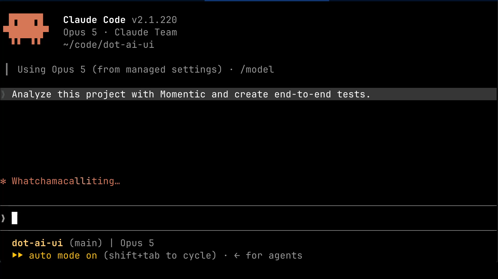

Not in a hedged, well-it's-a-start way, either. One sentence of instruction. Analyze this project with Momentic and create end-to-end tests. That was the whole thing. No explanation of what the app does, how to get into it, or which parts of it were worth covering. A few minutes later there was a suite that ran and passed. Deciding how much coverage is enough is still mine. The writing isn't.

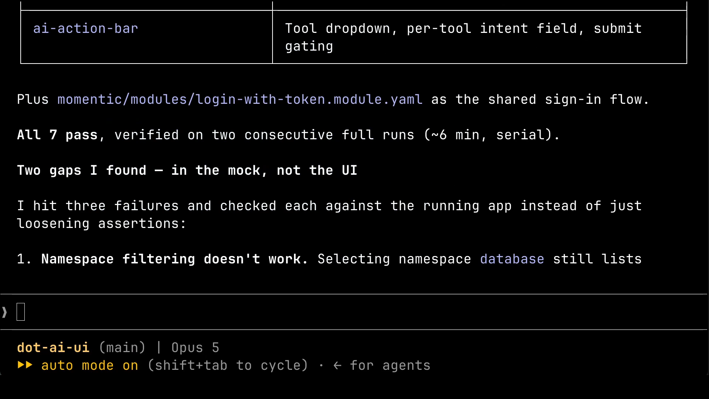

[Momentic](https://app.momentic.ai/signup) installs with one command, and the link is in the description if you want to point it at your own code.

Now, you might be about to tell me that agents write bad tests. Maybe they do. But think about what you are measuring them against. A hand-written suite isn't better testing, it's the same activity done slower. I'll put mine next to the generated ones later and mine comes out worse. So the quality argument is a distraction, because none of it is testing. Which is the thing I keep promising to explain.

Maintenance is the one that kills suites. Some tests get deleted for being wrong. Most of them die because everybody got tired of the false alarms, and one day somebody skipped one and nobody ever put it back.

Writing was a decision I made. Maintenance wasn't. By the time I ran anything at all, Momentic could already recover a failing test and carry on. I never switched that on. The setup wizard did.

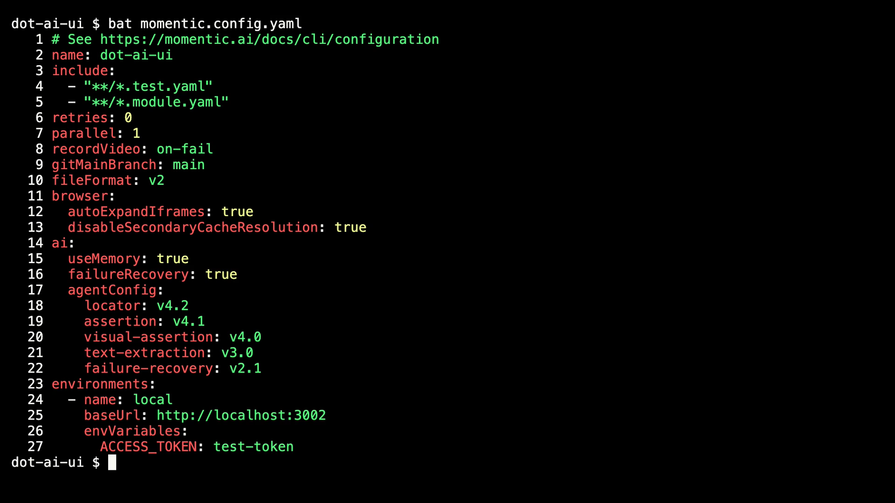

And underneath all of it sits the part I will not miss. Selectors. Twenty years of writing down how to find a thing, because the machine could not simply be told what the thing was. CSS paths, XPath, test id attributes bolted onto elements for no reason except that a script needed a handle. Labels on manifests so a config file could locate another config file. All of that machinery existed for one purpose. So that software could point at something a person could already point at just by looking.

So I tried to break it. I went into the code and renamed the login button. Sign In became Log In. Nothing else changed.

Six of the seven tests passed. Not recovered. Passed. The failure recovery never fired at all, because nothing had failed.

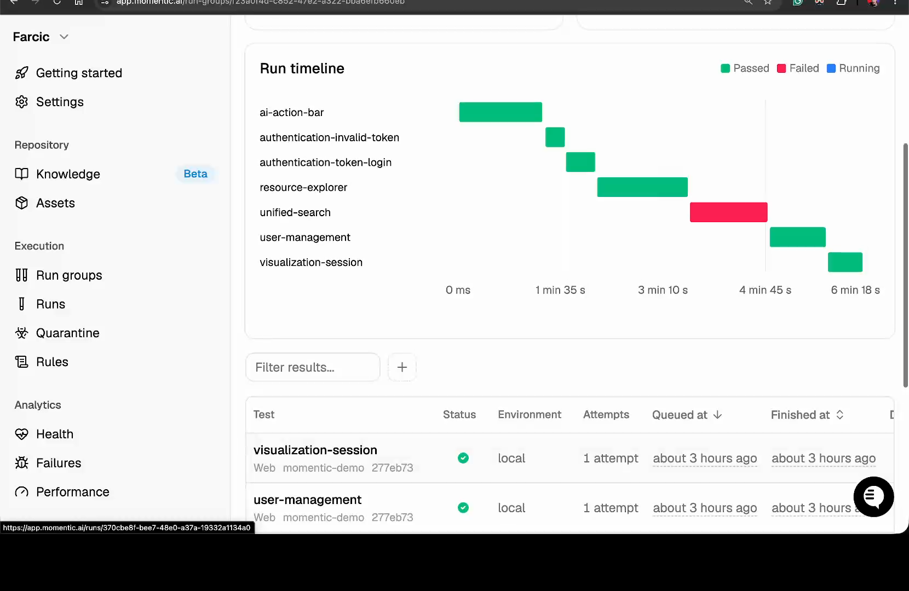

Which is correct. The test says click the Sign In button, and here is the picture the test itself took, a fraction of a second before it clicked, of a page with no Sign In button on it anywhere. That line was never a claim about the words printed on the button. It is how you point at a thing. Any tester you hired would read it, find the button that signs you in, click it, and never think about it again.

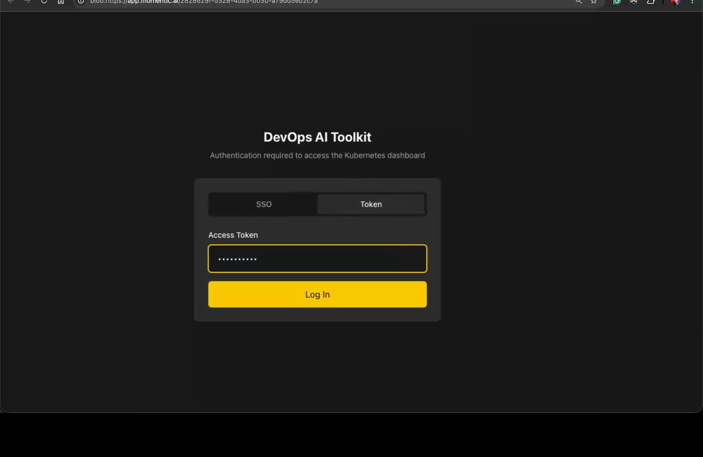

That is what twenty years of selectors were buying, and it is gone.

The seventh test did fail. I had also picked a second button and quietly cut the wire behind it. Same label, same position, looks completely fine, does absolutely nothing when you press it. There is nothing to show you there, which is the point. That one went red and stayed red, and it was called a legitimate failure, which is exactly what it was.

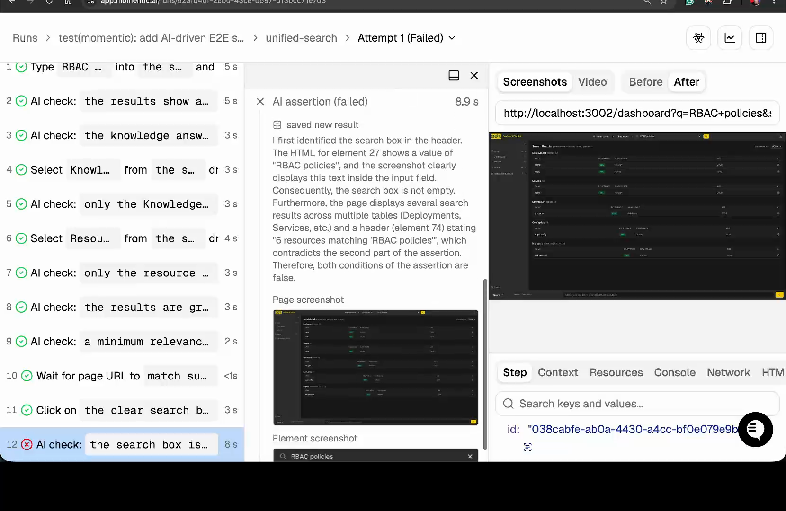

So maintenance is handled, and handled the way I would want a person to handle it. Relaxed about what does not matter. Strict about what does.

## Why Failing Tests Go Green

Diagnosing is the third one, and it's what you do when the suite goes red. Here is what usually happens. If one test fails and it passed yesterday, you look at it. If twenty fail, or it's the same three every week, you stop looking. Everybody stops looking.

And that is wrong. Not complicated, not a trade-off. Wrong. Nothing should merge until everything is green. Then every red you ever see came from the thing you just did, and there is nothing to sort in the first place. Plenty of teams do not work that way. They should.

But hold that rule as tightly as you like. A red still goes away in one of four ways. You **fix the code**. You **change the test** until it passes. You **stop running the test**. Or you **decide the failure was expected** and leave it there. Only the first one changes the software. The other three work exactly the same whether or not anything was actually wrong.

That last one has an entire industry behind it. Tools whose whole business is helping you administer the findings you've already decided not to fix. Run from those like the plague.

And there is a newer problem stacked on top of that one. When an agent runs the loop, you do not pick from those four. It picks. Tell it to make the tests pass and it will, and it decides on its own whether to fix the code, rewrite the test, skip the test, or call the failure expected. By the time you look, the pull request is green and that decision is already behind you.

Which is not a complaint about the decision. In my case it chose well. It is that the moment where somebody weighs a failure against what the software is meant to do has quietly moved somewhere I am not standing. And on the rare occasion one does reach me, a red test is the only thing between me and shipping, which makes me the worst possible person to be holding it.

All of that assumes the tests were right to begin with.

## Testing Versus Checking

This is where I expected to come out ahead. I already had hand-written tests for that same thing, written months earlier, by me.

So I put the two sets next to each other. Mine were worse. Not in coverage. In kind. There is a filter in that app that hides weak search results, and my test checked that it started at exactly fifty percent. The Momentic test checked that the filter was offered at all. Mine breaks the day somebody decides forty is a better default. The Momentic one doesn't.

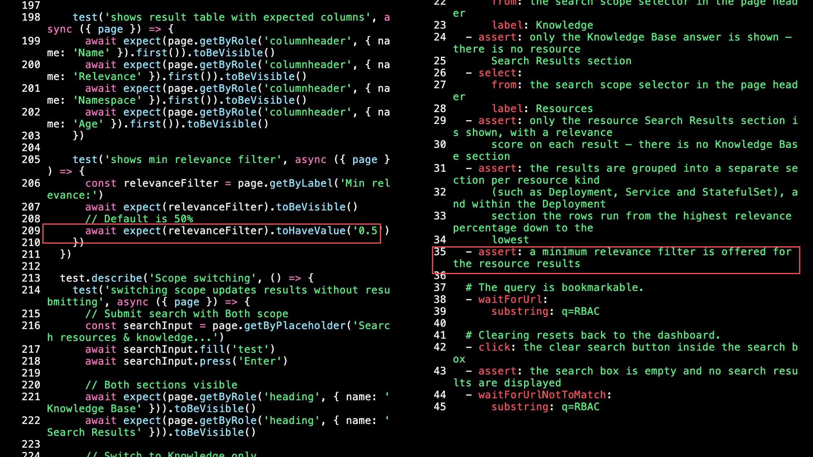

The pattern held everywhere I looked. Another of mine searched the page for a number that exists nowhere except in my own test data. One compared pixel positions to prove two things sat in the right order. None of that says what the software should do. It is a photograph of how the software happened to be built the week I wrote it.

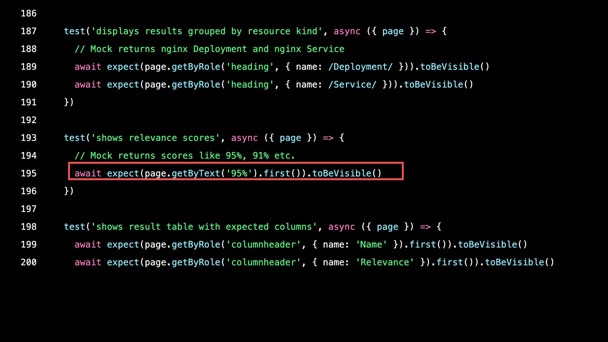

So the machine wrote the better spec, and I expected the opposite. But that isn't the interesting part, because the difference there was never human against machine. I could have written either one.

Here is the interesting part. Every one of those, mine and Momentic's, is the same activity. You decide in advance what ought to be true, you write it down, and something confirms whether it still holds. That is a genuinely useful thing to do. It's just **not testing**. It's **checking**.

Testing is the other thing. Testing is going and finding out. Nobody handed you a list, so you poke at it. You try the stupid thing on purpose. You notice the error message is technically accurate and completely useless. You get halfway through and realise the feature doesn't make sense for anybody who would actually use it. Checking confirms what you already believed. Testing is how you discover you were wrong about what you believed.

And that is why checking has a ceiling. Whatever wrote the check had to get its idea of correct from somewhere, and if that somewhere is the running software, the check can only ever agree with it. A check that came from what the app does and a check that came from what the app should do look exactly the same on the page. You cannot tell them apart by reading them.

I know that because I went back through the recording to see what the agent did first. Before writing a single test, it went and read a set of requirements I had left sitting in that repo. Written by me, from the documentation, not from the app. So I cannot tell you how much of the intent in those tests is mine handed back to me, and how much of it the agent worked out alone.

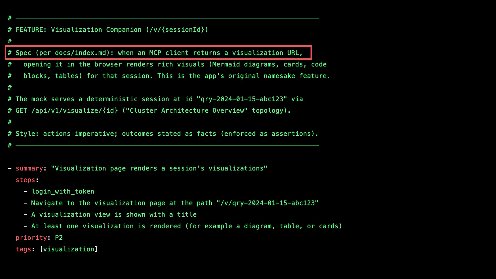

There is one kind of checking that escapes this, and it isn't a new idea. Write the check before the code exists. Whatever you think of test-driven development, or whichever variant you prefer, the ordering has a property that matters here. A check written before the implementation cannot have come from the implementation. It's still checking. But it isn't the software grading its own homework.

## Why QA Engineers Disappeared

Here is the trouble with testing. It doesn't scale, it never automated, and you cannot tell in advance whether an afternoon of it will find anything at all. Which makes it nearly impossible to justify on a plan, and very easy to cut when the date slips.

So it became somebody's job instead. That is what dedicated testers were for. Not writing the checks, because anybody can write checks. They were the people whose entire week was going and finding out.

And when test automation arrived, they complained about it, and they were right. Strip the resentment out of those complaints and every one of them says the same thing. Those scripts don't test anything. They confirm what somebody already assumed. They go green while the product is unusable. That was true then. It is still true now.

But their position was impossible anyway, and it had nothing to do with skill. To test something, you have to wait until there is something to test. Which means a handoff. Which means somebody waits.

That is the part that broke. 

When an organization shipped twice a year, a week of somebody's investigation was cheap. When it ships several times a day, a handoff that costs a week isn't a step in the process. It's a wall. So the role went, and most of the time nothing replaced it, and the checking carried on because checking was the part that fit inside a pipeline.

Which brings me to the part I didn't expect. Testing is going the same way.

Not checking this time. Testing. The going-and-finding-out part. There are agents now that aren't trying to hand you a check at all. You point one at a product, it works out what the journeys through it are, it goes and does them, and it comes back with a list of things that look wrong. Nothing specified in advance. Nobody handed it a list.

Which is the thing that was supposed to be safe. The judgment. The part that needed a person with an afternoon and a suspicious mind.

So I pointed one at the same application, with no specification and no description of what the software is for. Momentic's explorer mapped the product on its own, came back with twenty journeys through it, and then compared those journeys against the checks already sitting in the repository to say which ones nothing covered. That last part is worth stopping on. Nothing inside a test suite can tell you what the test suite is missing.

Then Momentic sent agents out to walk those journeys in a real browser, and they came back with six things that look wrong. A namespace filter that changes the heading and changes the address bar and then lists the very resources it was supposed to be filtering out. A search result that opens a page saying the thing does not exist. And the one I keep coming back to: a form that takes a new user, clears itself, reports success, and creates nobody.

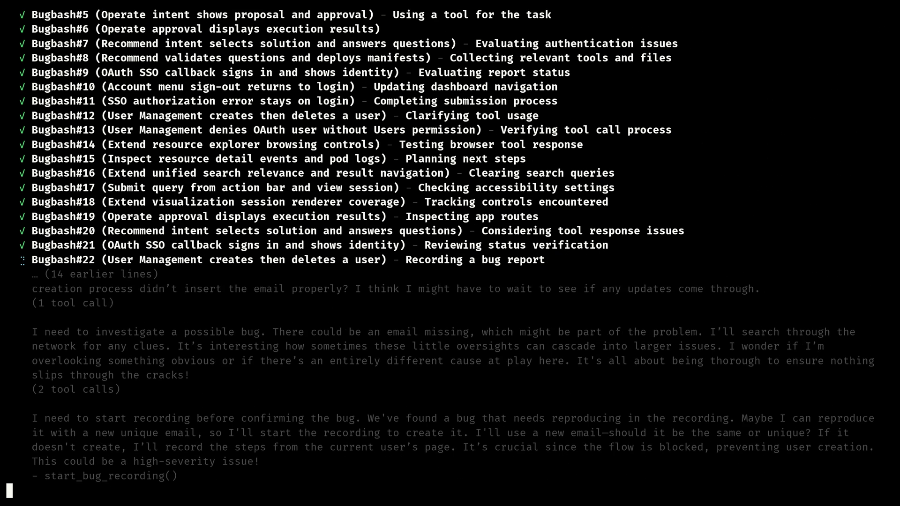

I went and checked. Every one I could verify was real, and the application does behave that way. What the agent had no way of knowing is that the backend underneath is a mock, and the mock is full of holes, so most of what came back is a gap in my own fixtures rather than a fault in the product. It watched the software misbehave and described it exactly. It could not tell what any of it was supposed to do.

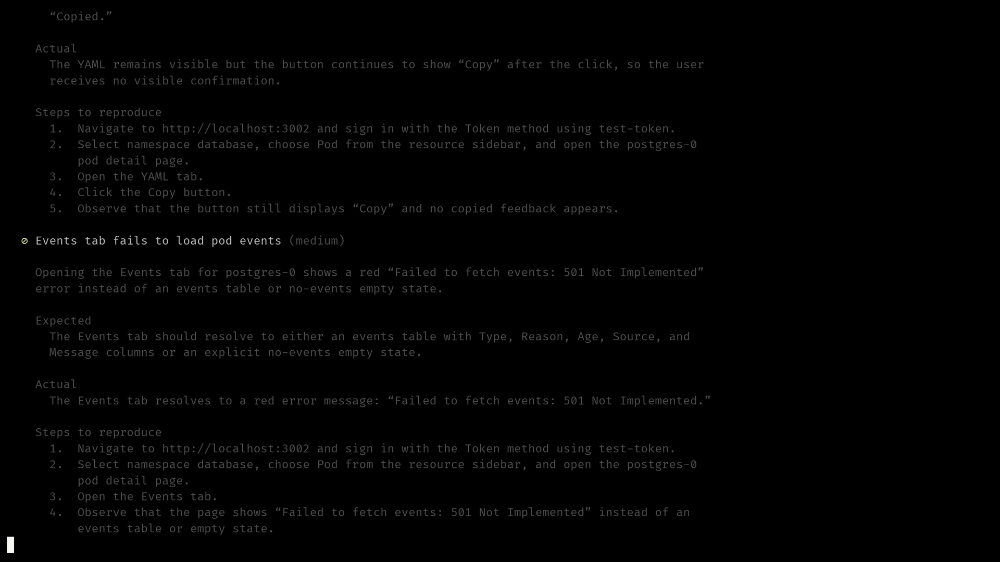

So if you were holding on to testing as the part that stays human, that ground is moving too.

## What's Left For Humans

So what is actually left?

  top-left  momentic-broll-car-design      | top-middle    momentic-broll-car-build   | top-right    momentic-broll-car-track
  bot-left  momentic-broll-team-standup    | bot-middle    momentic-broll-pipeline     | bot-right    momentic-broll-person-laptop
  Column 1 = deciding what the thing should be. Column 2 = building and checking it. Column 3 = going and finding out whether it is any good.

Think about how a car gets made. People design it. Robots build it. And at the end somebody drives it around a track to find out whether the thing is any good. Software has looked like that for a while. You decide what to build, the pipeline assembles it and checks it, and then a person goes and finds out whether it is actually usable. What changed is that the middle kept growing, and now it has started eating the road test too.

Which leaves the design end. Somebody has to decide what the software is supposed to do. Not what it does. What it is for.

So the practical version of all this is very boring advice. Don't point your agents at your code and ask them for tests. Code can only ever tell them what the code already does. Point them at the requirements. The spec, the ticket, the design doc, the product brief, whatever you have that a person wrote because they wanted something.

And if you have none of that, there is a way in. 

Have the agent read the code and write down the specification it implies. Then read that yourself, properly, and correct every place where it describes something you never actually wanted. That correction is the entire point. It is the only moment in the whole process where intent gets into the system. Skip the reading, rubber-stamp what came back, and you have simply laundered the code twice.

Deciding what the software is for isn't a job. Nobody's title says it. It's a duty, and the awkward thing about a duty with no owner is that it never announces itself when nobody does it. Everything just stays green.
