+++
title = 'API Gateways Explained: Why Your Services Are a Mess (Zuplo Review)'
date = 2026-01-15T15:00:00+00:00
draft = false
+++

Every API you expose to the world needs the same things. Authentication. Rate limiting. Documentation. Analytics. And if you're building AI-powered applications, add cost tracking and provider failover to that list.

You could implement all of this in every single service you build. Or you could centralize it in an API gateway.

Today we're exploring what API gateways actually are, when you need them, and when you don't. We'll look at how they fit into different architectures, from traditional VMs to Kubernetes to serverless. And we'll take this opportunity to explore Zuplo as a possible solution for your API gateway needs.

<!--more-->



## Setup

```sh
git clone https://github.com/vfarcic/zuplo-demo

cd zuplo-demo
```

> Watch [Nix for Everyone: Unleash Devbox for Simplified Development](https://youtu.be/WiFLtcBvGMU) if you are not familiar with Devbox. Alternatively, you can skip Devbox and install all the tools listed in `devbox.json` yourself.

```sh
devbox shell

./dot.nu setup

source .env
```

> Register in https://portal.zuplo.com.

## API Gateway Explained

Let's say you're building services that need to expose APIs to the world. Browsers hitting your endpoints, mobile apps consuming your data, partner integrations calling your services. This is standard stuff.

But here's the thing. The problems you face are universal. Authentication, authorization, rate limiting, request transformation, API versioning, caching, observability, documentation. Every API needs all of this.

Without centralized control, you end up implementing these concerns in every single service. You get scattered auth logic across different codebases, inconsistent rate limits because each team does it differently, duplicated CORS configs everywhere, fragmented monitoring that gives you no coherent picture. It's a mess.

This is where **API gateways** come in. They give you (1) a single entry point for all external traffic, (2) centralized policies that apply consistently, and (3) a unified API surface for clients regardless of how complex your backend architecture is. The gateway sits between external clients and (4) your backend services, enforcing all those policies at the edge before requests even reach your services.

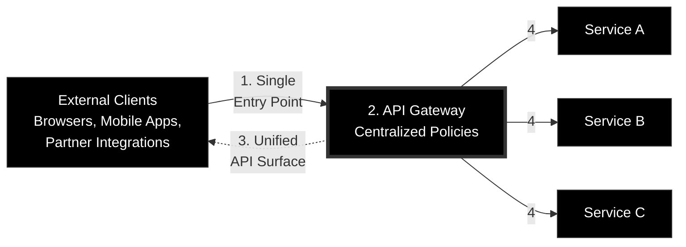
```mermaid
graph LR
    A[External Clients<br/>Browsers, Mobile Apps,<br/>Partner Integrations] -->|1. Single<br/>Entry Point| B[2. API Gateway<br/>Centralized Policies]
    B -->|4| C[Service A]
    B -->|4| D[Service B]
    B -->|4| E[Service C]
    B -.->|3. Unified<br/>API Surface| A

    style A fill:#000,stroke:#333,color:#fff
    style B fill:#000,stroke:#333,color:#fff,stroke-width:4px
    style C fill:#000,stroke:#333,color:#fff
    style D fill:#000,stroke:#333,color:#fff
    style E fill:#000,stroke:#333,color:#fff
```

Now, how you deploy and use an API gateway depends entirely on your infrastructure.

Let's start with the non-Kubernetes world. VMs, bare metal, serverless functions, managed cloud services.

In traditional setups, you typically have (1) a load balancer handling Layer 4 traffic, then (2) a reverse proxy like `nginx` or `HAProxy` doing basic routing, and then you bolt on (3) authentication, (4) rate limiting, and everything else. An API gateway consolidates all of this into one coherent layer.

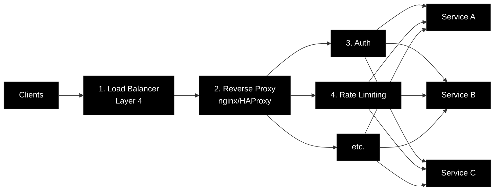
```mermaid
graph LR
    A[Clients] --> B[1. Load Balancer<br/>Layer 4]
    B --> C[2. Reverse Proxy<br/>nginx/HAProxy]
    C --> D[3. Auth]
    C --> E[4. Rate Limiting]
    C --> F[etc.]
    D --> G[Service A]
    D --> H[Service B]
    D --> I[Service C]
    E --> G
    E --> H
    E --> I
    F --> G
    F --> H
    F --> I

    style A fill:#000,stroke:#333,color:#fff
    style B fill:#000,stroke:#333,color:#fff
    style C fill:#000,stroke:#333,color:#fff
    style D fill:#000,stroke:#333,color:#fff
    style E fill:#000,stroke:#333,color:#fff
    style F fill:#000,stroke:#333,color:#fff
    style G fill:#000,stroke:#333,color:#fff
    style H fill:#000,stroke:#333,color:#fff
    style I fill:#000,stroke:#333,color:#fff
```

For serverless architectures, an API gateway is damn near essential. AWS API Gateway, Azure API Management, Google Cloud Endpoints. These are your (1) front door when you have dozens of (2) Lambda functions or Cloud Run services behind them. The value here is crystal clear. You don't want authentication, rate limiting, and API contracts scattered across 50 different serverless functions. That's insane.

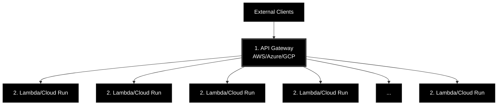
```mermaid
graph TB
    A[External Clients] --> B[1. API Gateway<br/>AWS/Azure/GCP]
    B --> C[2. Lambda/Cloud Run]
    B --> D[2. Lambda/Cloud Run]
    B --> E[2. Lambda/Cloud Run]
    B --> F[2. Lambda/Cloud Run]
    B --> G[...]
    B --> H[2. Lambda/Cloud Run]

    style A fill:#000,stroke:#333,color:#fff
    style B fill:#000,stroke:#333,color:#fff,stroke-width:4px
    style C fill:#000,stroke:#333,color:#fff
    style D fill:#000,stroke:#333,color:#fff
    style E fill:#000,stroke:#333,color:#fff
    style F fill:#000,stroke:#333,color:#fff
    style G fill:#000,stroke:#333,color:#fff
    style H fill:#000,stroke:#333,color:#fff
```

Kubernetes deployments are a slightly different story. (1) Ingress plus LoadBalancer already handles external traffic routing. You get a public IP, Layer 7 routing based on hostnames and paths, SSL termination. That's all there.

But here's the thing. Ingress is just routing. What's missing? (2) Advanced authentication, rate limiting, request transformation, API versioning, developer portals, monetization, detailed analytics. API gateways add this entire management layer on top of basic routing.

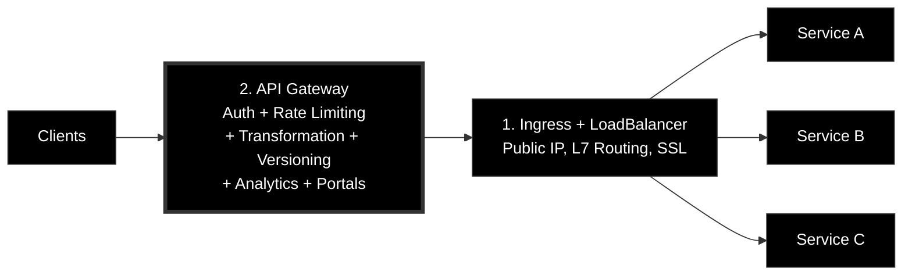
```mermaid
graph LR
    A[Clients] --> B[2. API Gateway<br/>Auth + Rate Limiting<br/>+ Transformation + Versioning<br/>+ Analytics + Portals]
    B --> C[1. Ingress + LoadBalancer<br/>Public IP, L7 Routing, SSL]
    C --> D[Service A]
    C --> E[Service B]
    C --> F[Service C]

    style A fill:#000,stroke:#333,color:#fff
    style B fill:#000,stroke:#333,color:#fff,stroke-width:4px
    style C fill:#000,stroke:#333,color:#fff
    style D fill:#000,stroke:#333,color:#fff
    style E fill:#000,stroke:#333,color:#fff
    style F fill:#000,stroke:#333,color:#fff
```

Now, you have options for how to deploy this. Some Ingress controllers actually are API gateways. Kong, Ambassador, Traefik Enterprise. These bundle routing and full API management capabilities in-cluster. Everything runs inside your Kubernetes cluster.

The other approach is external managed services. Cloud-hosted platforms that sit in front of your Ingress. These give you multi-cloud routing, enterprise-grade analytics, developer portals, monetization features. The gateway lives outside your cluster.

And then there are hybrid setups. Some services running in Kubernetes, some on VMs, some as serverless functions. An API gateway can unify access patterns across all of them, giving you one consistent interface regardless of where your backend services actually live.

Now here's where people screw up. Inside Kubernetes, for (2) service-to-service traffic, API gateways are useless. They don't belong there. Kubernetes Services already handle discovery and routing. If you need more than that, a service mesh gives you mTLS, observability, retries, circuit breaking. Routing internal traffic through a gateway just adds latency for absolutely no benefit.

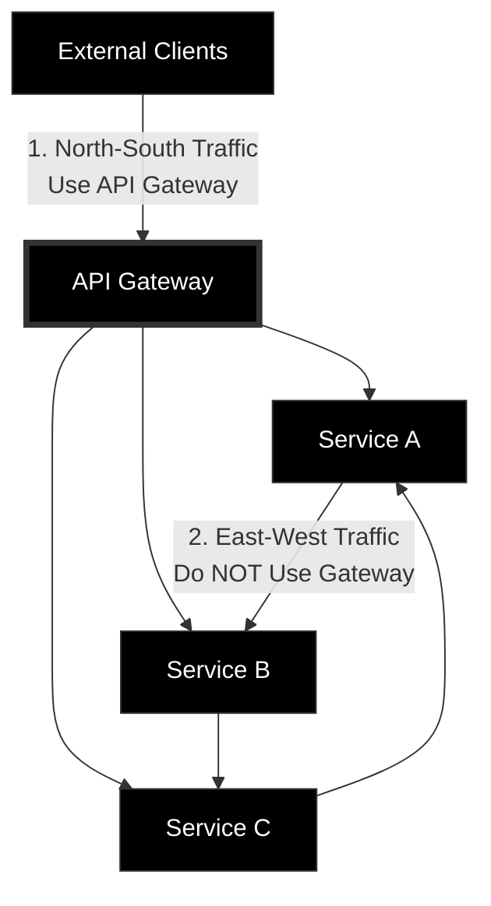
```mermaid
graph TB
    A[External Clients] -->|1. North-South Traffic<br/>Use API Gateway| B[API Gateway]
    B --> C[Service A]
    B --> D[Service B]
    B --> E[Service C]

    C -->|2. East-West Traffic<br/>Do NOT Use Gateway| D
    D --> E
    E --> C

    style A fill:#000,stroke:#333,color:#fff
    style B fill:#000,stroke:#333,color:#fff,stroke-width:4px
    style C fill:#000,stroke:#333,color:#fff
    style D fill:#000,stroke:#333,color:#fff
    style E fill:#000,stroke:#333,color:#fff
```

There are different types of API gateways specialized for different use cases. API Management gateways focus on REST APIs. They handle OpenAPI schemas, API versioning, developer portals, documentation, monetization, partner integrations. This is about exposing and managing your business APIs.

Then there are (1) AI Gateways. Same concept, but for LLMs. They manage provider access, rate limit model calls, log prompts and responses, track costs, handle model failover. Instead of managing REST endpoints, you're managing (2) AI model access.

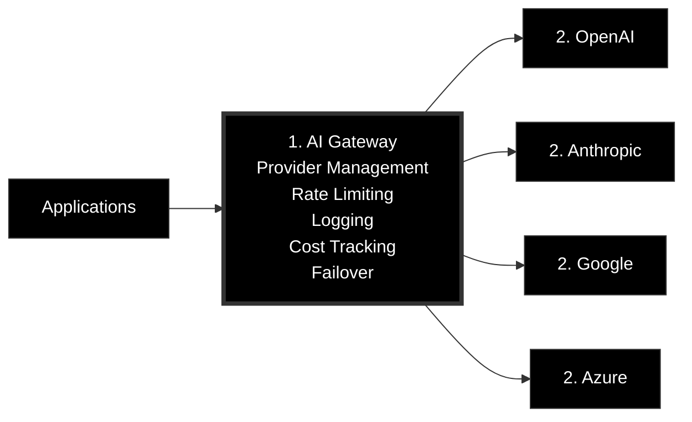
```mermaid
graph LR
    A[Applications] --> B[1. AI Gateway<br/>Provider Management<br/>Rate Limiting<br/>Logging<br/>Cost Tracking<br/>Failover]
    B --> C[2. OpenAI]
    B --> D[2. Anthropic]
    B --> E[2. Google]
    B --> F[2. Azure]

    style A fill:#000,stroke:#333,color:#fff
    style B fill:#000,stroke:#333,color:#fff,stroke-width:4px
    style C fill:#000,stroke:#333,color:#fff
    style D fill:#000,stroke:#333,color:#fff
    style E fill:#000,stroke:#333,color:#fff
    style F fill:#000,stroke:#333,color:#fff
```

Bottom line: API gateways are for **north-south traffic**. External clients coming into your internal services. For **east-west traffic**, service-to-service communication inside your infrastructure, they're just noise. Use a service mesh or your platform's native tools instead.

Now that we understand what API gateways are and when to use them, let's actually build one. We'll use Zuplo as our API Management gateway and see how to set it up the right way.

## Zuplo API Management

So why bother with API Management specifically? We covered what API gateways do in general, but API Management is a particular flavor focused on the business side of your APIs. It's not just about routing traffic. It's about treating your APIs as products.

Think about it. You have an API. Great. But who's using it? How are they using it? Are they abusing it? Are they even supposed to have access? API Management gives you the tools to answer these questions. You get developer portals where consumers can discover your APIs, read documentation, and get API keys. You get analytics showing which endpoints are popular, which are failing, who's hitting rate limits. You get versioning so you can evolve your API without breaking existing consumers. You get monetization if you want to charge for access.

The alternative is building all of this yourself. And trust me, nobody wants to maintain a homegrown developer portal, a custom API key management system, and hand-rolled analytics dashboards. That's not where your business value lies.

Let's see how Zuplo handles API Management.

> Create `API Management` empty project in Zuplo.

Zuplo offers three project types: API Management for traditional REST APIs, AI Gateway for LLM access, and MCP Gateway for Model Context Protocol. We're starting with API Management. I'm choosing Empty Project because we'll import our own OpenAPI schema rather than using their starter template.

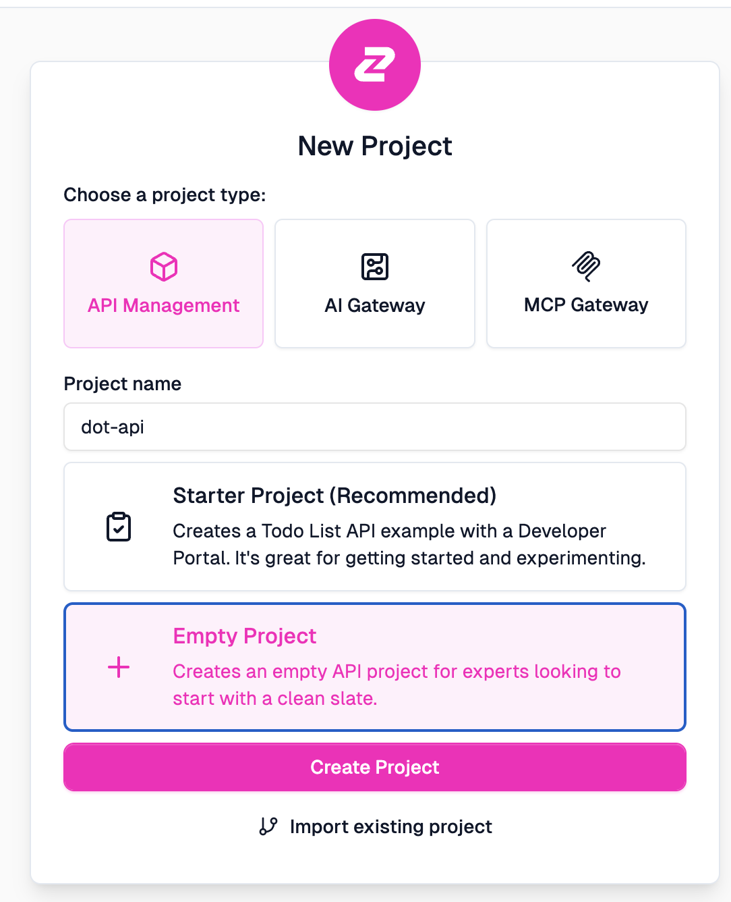

> Select `Code` from the top menu in the Web UI, followed with `routes.oas.json` in the left-hand menu.

> Select `Add Route`.

This is Zuplo's Route Designer. You can see it lets you manually define routes, set HTTP methods, paths, and attach policies for request and response handling.

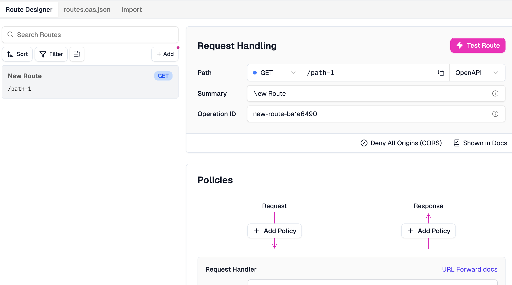

Now, we could define our entire API schema right here in this UI. Don't do it. You're a software engineer and I have to assume that you know how to develop an app that exposes an API. More importantly, I will assume that you know how to create OpenAPI schema. Generate the schema from an existing API, or start with the schema and use it to generate code. I'll leave that choice to you. The important point is that we've been generating schemas for a long time and there are plenty of tools that can do it. If you're not sure how, ask your coding agent to generate one for you.

I already have an OpenAPI schema for my API. Let's take a look at it.

```sh
cat routes.oas.json
```

```json
{
  "openapi": "3.0.0",
  "info": {
    "title": "DevOps AI Toolkit REST API",
    "description": "REST API gateway for DevOps AI Toolkit MCP tools - provides HTTP access to all AI-powered DevOps automation capabilities",
    "version": "1.0.0",
    "contact": {
      "name": "Viktor Farcic",
      "url": "https://devopstoolkit.live/",
      "email": "viktor@farcic.com"
    },
    "license": {
      "name": "MIT",
      "url": "https://github.com/vfarcic/dot-ai/blob/main/LICENSE"
    }
  },
  "servers": [
    {
      "url": "http://dot-ai.52.3.181.37.nip.io",
      "description": "DevOps AI Toolkit MCP Server"
    }
  ],
  "paths": {
    ...
    "/api/v1/tools": {
      "get": {
        "summary": "Discover available tools",
        "description": "Get a list of all available tools with their schemas and metadata",
        "tags": [
          "Tool Discovery"
        ],
        "parameters": [
          {
            "name": "category",
            "in": "query",
            "description": "Filter tools by category",
            "required": false,
            "schema": {
              "type": "string"
            }
          },
          {
            "name": "tag",
            "in": "query",
            "description": "Filter tools by tag",
            "required": false,
            "schema": {
              "type": "string"
            }
          },
          {
            "name": "search",
            "in": "query",
            "description": "Search tools by name or description",
            "required": false,
            "schema": {
              "type": "string"
            }
          }
        ],
        "responses": {
          "200": {
            "description": "List of available tools",
            "content": {
              "application/json": {
                "schema": {
                  "$ref": "#/components/schemas/ToolDiscoveryResponse"
                }
              }
            }
          }
        }
      }
    },
    ...
```

This is a standard OpenAPI 3.0 schema. It defines the API title, description, version, contact info, and the server URL where the backend lives. The paths section defines each endpoint with its parameters and response schemas. Nothing fancy here. This is what you should already have for any API you're exposing.

> Click `Import OpenAPI` followed by `Choose File` button, select `routes.oas.json` from the repo, and click the `Complete Import` button.

When we import this schema, Zuplo parses it and shows us all the routes it found. GET and POST endpoints, the full path structure, everything extracted automatically from our schema.

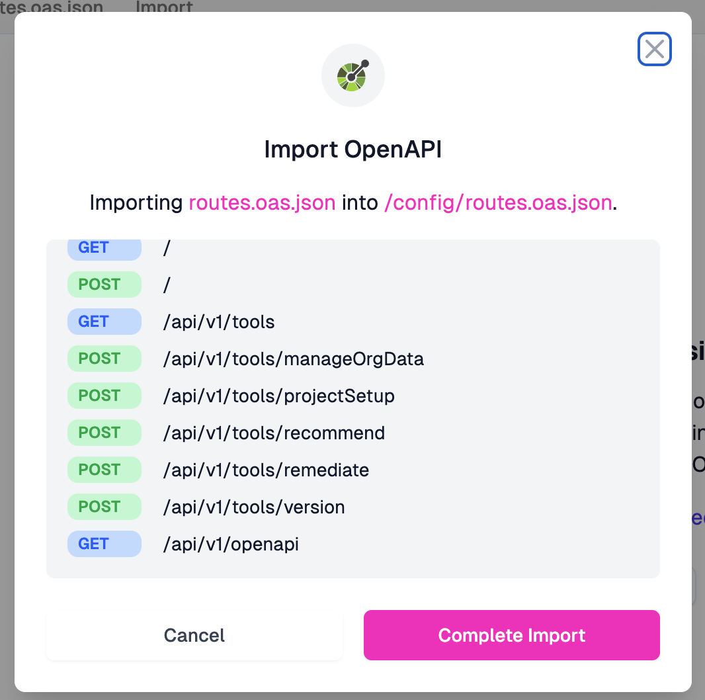

> Press the `Save` button in the bottom-left corner of the screen.

After saving, we can see our full project structure. On the left, there's the file tree with config files, modules, schemas, and docs. On the right, the Route Designer shows all our imported endpoints. Each route displays its summary from the OpenAPI schema along with the HTTP method and path. The bottom bar shows the gateway is deployed and ready.

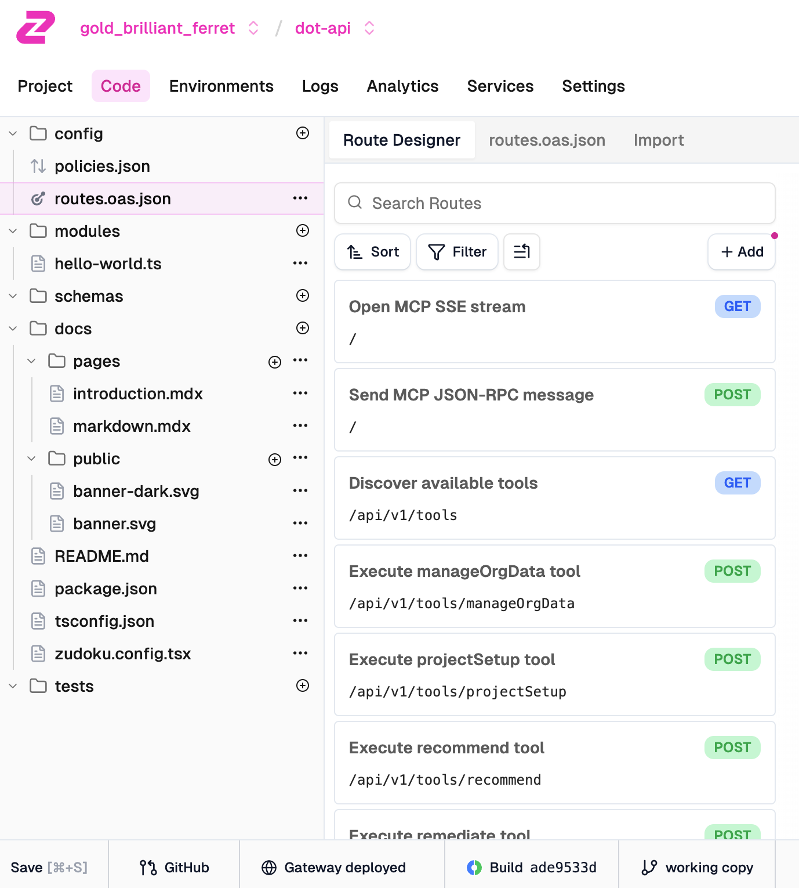

Let's test one of these routes to make sure everything is wired up correctly.

> Select `Discover available tools` route, click the `Test Route` button, followed by `Send Request`.

The test modal shows our request going through Zuplo's gateway. Notice the URL: it's hitting Zuplo's edge at zuplo.dev, which then proxies to our backend. We get a `200 OK` response with our API data. The gateway is working.


> Close the test modal.

Now let's add some actual API management capabilities. This is where Zuplo earns its keep.

> Click `+ Add Policy` below `Request`, select `Rate Limiting`, and click the `Continue` button.

Zuplo has a library of built-in policies you can attach to routes. Rate limiting, authentication, caching, request transformation, and plenty more. We're going to add rate limiting to protect our endpoint from abuse.

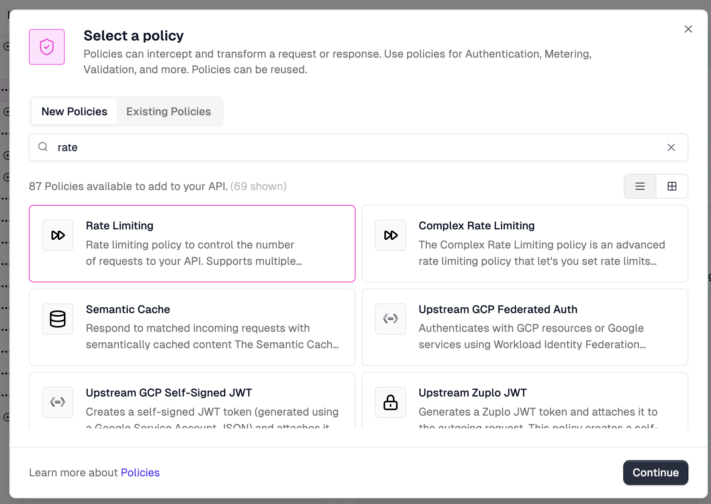

> Change `options.requestsAllowed` to `1` and click the `Create Policy` button.

The policy configuration is just JSON. We're setting `rateLimitBy` to `ip`, which means each IP address gets its own counter. `requestsAllowed` is set to 1 and `timeWindowMinutes` to 1. That's one request per minute per IP. Absurdly restrictive, but perfect for demonstrating that it works.

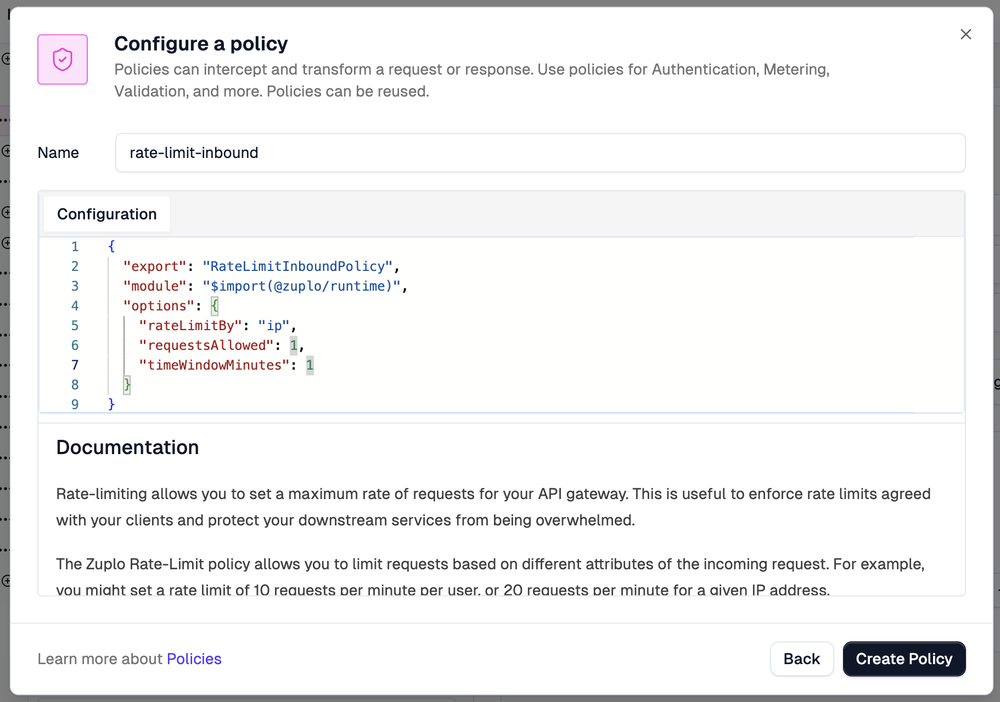

> Press the `Save` button in the bottom-left corner of the screen.

Now we can see the policy attached to our route. The `rate-limit-inbound` policy appears in the Request flow, meaning it runs before the request hits our backend. Any request that exceeds the limit gets rejected at the edge without ever touching our service.

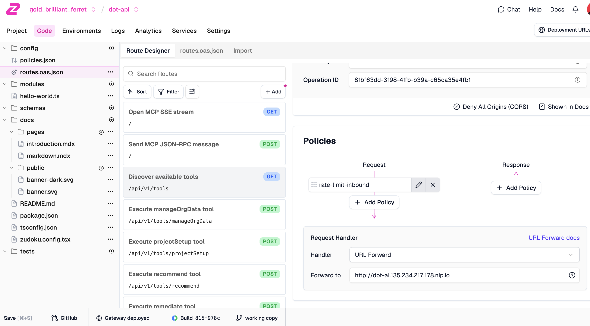

> Test the route again by sending requests a few times.

And there it is. `429 Too Many Requests`. The first request went through, but the second one got blocked. The response body follows the RFC 7807 problem details format with the status code, a human-readable title, and trace information for debugging. Our backend never even saw this request. Zuplo rejected it at the edge.

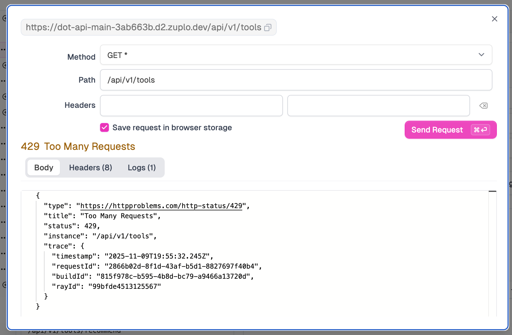

> Close the test modal.

Now let's connect this to version control. Zuplo integrates with GitHub, which means your gateway configuration lives in a repo like any other code.

> Click the `GutHub` button at the bottom and follow the on-screen instructions to connect to your GitHub Account.

> Click the `Create new repository` button and follow the on-screen instructions. The new repo should be named `zuplo-demo-project`.

> Click the `Adjust GitHub Permissions` and add the newly created repo unless you selected to use Zuplo for all repos.

> Click the `Connect` button to connect the newly created repo with the Zuplo project.

From here on, any changes we make to the project can be pushed to the repo. This means you can review gateway changes in pull requests, track history, and roll back if something goes wrong. GitOps for your API gateway.

Let's take a look at what Zuplo created.

```sh
gh repo view zuplo-demo-project --web
```

Everything we did through the UI could be done through code instead. Zuplo's configuration is just text files. The `config/routes.oas.json` file contains your OpenAPI schema with Zuplo-specific extensions for policies. The `config/policies.json` file defines reusable policy configurations. You can write custom request handlers in TypeScript if the built-in policies don't cover your use case. Push to Git, and Zuplo deploys automatically. Each branch becomes its own environment, so you can test changes before merging to production. It's proper GitOps.

Now, here's my one gripe with this approach. Zuplo requires a copy of your OpenAPI schema inside its project. I'd prefer if it could reference an external schema instead of duplicating it. In an ideal world, I'd have my OpenAPI schema in my API's repo as the single source of truth, and Zuplo would pull from there. Having to sync schemas between repos adds friction. You either need to manually keep them in sync or build automation to merge changes. It's not a dealbreaker, but it's not as clean as it could be.

That said, the overall experience is solid. The GitOps workflow, the built-in policies, the edge deployment. It works well for what it's designed to do.

Beyond what we've seen, Zuplo offers quite a bit more for API management. The **developer portal** is automatically generated from your OpenAPI schema. Your API consumers get documentation, a test console to try endpoints, API key management, and usage analytics all in one place. It's deployed on their edge CDN, so it loads fast.

For **authentication**, there are over 50 security policies available. API keys, JWT validation, OAuth, custom auth handlers. Whatever your authentication story is, they probably have a policy for it.

**Analytics** integrates with services like Moesif to give you deep insights into usage patterns. Who's calling what, how often, what's the latency, what's failing. This feeds into the monetization story.

Speaking of **monetization**, Zuplo integrates with Stripe and OpenMeter for usage-based billing. You can set up pricing tiers, track consumption, and automatically block requests when customers exceed their limits. If you're building an API-as-a-product business, this is the stuff you'd otherwise spend months building yourself.

The whole thing runs on their edge network across 200+ data centers. Serverless, scales automatically, zero cold start. Your gateway runs close to your users regardless of where they are.

That covers API Management for traditional REST APIs. But Zuplo also offers something specifically for AI workloads. Let's look at their AI Gateway.

## Zuplo AI Gateway

Whether you're building applications that call LLMs or your team is using coding agents like Claude Code, Cursor, or Copilot, you're making a lot of calls to AI providers. And that creates problems.

On the app development side, you might start with one provider, then realize another is better for certain tasks. Suddenly you're juggling multiple API keys, different SDKs, inconsistent error handling, and no unified view of costs.

On the tooling side, every developer on your team has their own API keys, their own spending, their own model choices. Finance has no idea what AI is actually costing the organization. Security has no visibility into what data might be flowing through these tools.

An AI Gateway sits between all of this and the LLM providers. You get a single API endpoint that handles automatic failover when providers go down, load balancing, caching to avoid redundant calls, cost tracking across all usage, and rate limiting so nothing spirals out of control. Developers get one API key instead of managing credentials for every provider. The organization gets a unified control plane.

It's the same pattern as API Management, just specialized for LLM traffic.

Let's see that in action through Zuplo's AI Gateway.

> Select the API Management project name in the top-left of the Zuplo UI, choose `Create Project`, followed with `AI Gatewy`.
> Type a name (e.g., `dot-ai`) and click the `Create Project` button.

We create a new project just like before, but this time selecting AI Gateway as the project type.

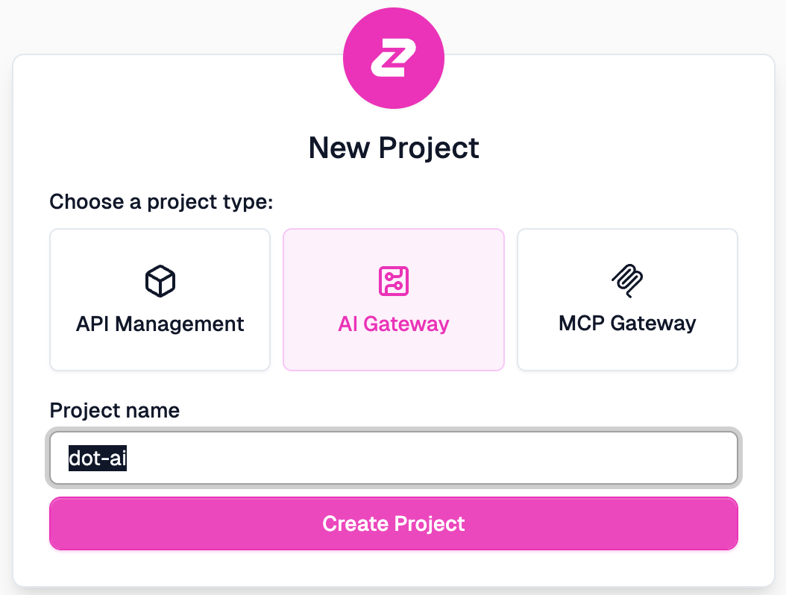

> Follow the on-screen instructions to add provider, create a team, and create an app. When asked, set Anthropic provider with the model `claude-sonnet-4-5-20250929`.

The setup wizard walks us through configuring a provider. We select Anthropic, enter our API key, and choose which models to expose through the gateway. This is the key your organization manages centrally. Developers using the gateway never see this key directly.

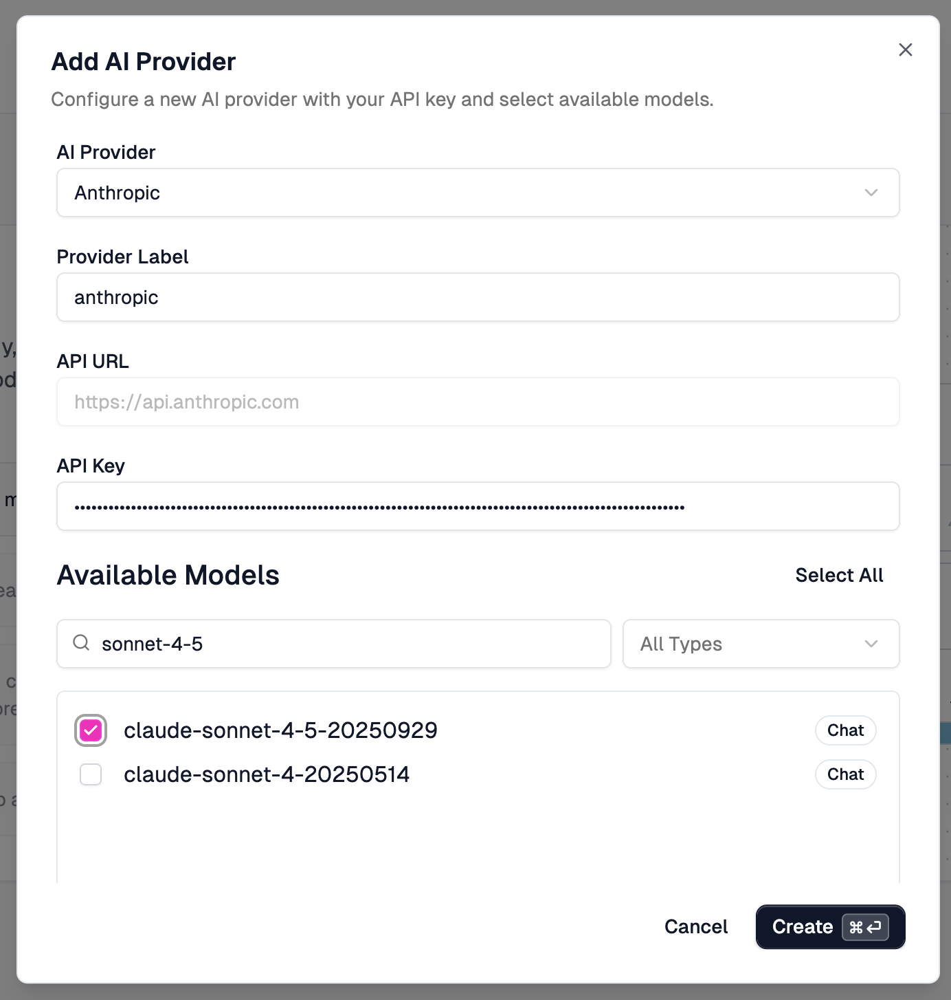

Now, here's something that frustrated me. Claude Haiku 4.5 wasn't in the list. Come on, Zuplo. If you're not going to let us specify any model name we want, then you need to stay on top of the list you're curating. It had been months since Haiku 4.5 was released when I recorded this. And we're not talking about some obscure model here. Haiku is almost as good as Sonnet, but faster and cheaper. It's one of the most important models Anthropic has released. Either let us type in any model name, or keep your curated list current. Pick one.

Anyway. Next, we create a team. Teams let you organize access and enforce usage limits across different groups in your organization.

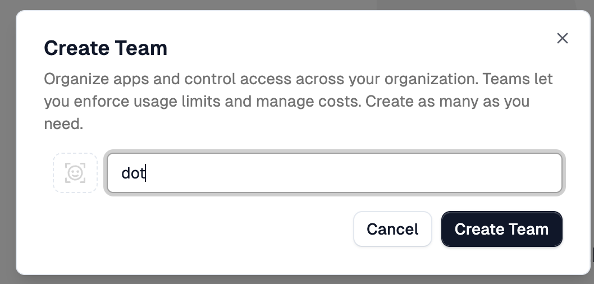

Finally, we create an app within that team. This is where it gets interesting. Each app gets its own API key that developers use. You can set budget limits, both daily and monthly, in dollars. You can set token limits. You can configure warnings before limits are hit. This is how you prevent a runaway script from burning through your entire AI budget overnight.

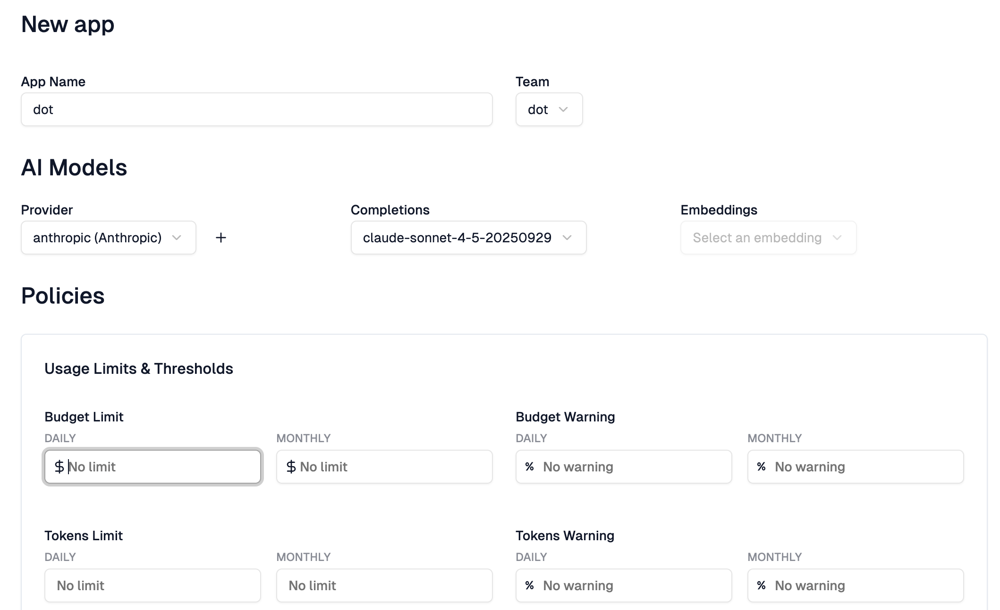

> Replace `[...]` with values provided by Zuplo.

Once the app is created, Zuplo gives you an endpoint URL and an API key. Now, Zuplo has instructions for integrating their SDK into your applications. Don't do it. Build your apps to support any OpenAI-compatible endpoint instead. That way you're not locked into Zuplo specifically. You can swap in any gateway, or go direct to providers, without changing your code. That's what I did with my app.

Here's how I configure my application to route through Zuplo's AI Gateway.

```sh
export CUSTOM_LLM_BASE_URL=[...]

export CUSTOM_LLM_API_KEY=[...]

export AI_MODEL=claude-sonnet-4-5-20250929

helm upgrade dot-ai-mcp oci://ghcr.io/vfarcic/dot-ai/charts/dot-ai \
    --namespace dot-ai \
    --version 0.139.0 \
    --reuse-values \
    --set image.tag=0.139.0 \
    --set ai.provider=openai \
    --set ai.customEndpoint.enabled=true \
    --set ai.customEndpoint.baseURL="${CUSTOM_LLM_BASE_URL}/v1" \
    --set secrets.customLlm.apiKey="${CUSTOM_LLM_API_KEY}" \
    --set ai.model="${AI_MODEL}"
```

We set the base URL to Zuplo's endpoint, provide the API key Zuplo generated for our app, and specify the model. The app itself doesn't know or care that it's talking to Zuplo. It just sees an OpenAI-compatible API.

> The demo uses Claude Code. The MCP should work with any coding agent, but some modifications to `.mcp.json` might be required.

Let's verify it works. I'll fire up Claude Code and ask it to check the system status.

```sh
claude
```

[user]
```text
Show dot-ai status
```

[agent]
```text
⏺ Here's the dot-ai system status:

  Overall Status: degraded

  Component Status:

  ✓ Kubernetes
  - Connected to cluster (v1.32.9)
  - Context: in-cluster
  - Endpoint: https://10.0.0.1:443

  ✓ AI Provider
  - Connected via Vercel
  - Model: claude-sonnet-4-5-20250929
  - Key configured: Yes

  ⚠ Vector Database
  - Connected: Yes (http://dot-ai-mcp-qdrant.dot-ai.svc.cluster.local:6333)
  - Collections: patterns, policies, and capabilities collections do not exist

  ✗ Embedding Service
  - Status: Not available
  - Provider: OpenAI
  - Issue: Unauthorized - authentication failure

  ✗ Kyverno
  - Not installed - policy generation unavailable

  ✗ Capabilities System
  - Not ready due to embedding service issues
  - Stored count: 0

  Available Features:

  - AI recommendations
  - Kubernetes integration

  Unavailable Features:

  - Pattern search (keyword-only mode)
  - Capability scanning (not ready)
  - Policy intent management (not ready)
  - Kyverno policy generation (not ready)

  The main issue is the OpenAI embedding service authentication failure, which impacts several features. However, core Kubernetes operations and AI recommendations
  are still functional.
```

The AI Provider shows as connected, using the model we configured. The request went through Zuplo's gateway, Zuplo forwarded it to Anthropic, and we got our response. All the cost tracking, rate limiting, and observability we configured in Zuplo is now capturing this traffic.

## Zuplo Review

Let me give you my honest assessment after working with Zuplo.

**Cons:**
* Schema duplication
* TypeScript only
* No self-hosting
* Smaller ecosystem

**Schema duplication** is annoying. Zuplo requires a copy of your OpenAPI schema in its project rather than referencing it from your source repo. That means schema drift is a real risk unless you build automation to keep things in sync.

Custom logic is **TypeScript only**. If your team lives in Go, Python, or Rust, you're writing gateway code in a language you might not prefer. Kong lets you write Lua plugins. Tyk supports multiple languages. Zuplo doesn't.

There's **no self-hosting** option. It's fully managed. If you need to run your gateway in your own infrastructure for compliance or control reasons, look at Kong, Tyk, or Gravitee instead.

It's a newer platform with a **smaller ecosystem** than established players like Kong or MuleSoft. Fewer community plugins, fewer battle-tested production stories.

**Pros:** 
* Developer experience
* Edge deployment
* Great UI
* MCP support
* Monetization built-in
* Transparent pricing

The **developer experience** is genuinely good. Code-first configuration, GitOps out of the box, TypeScript for custom logic. It feels like a tool built for developers.

**Edge deployment** across 300+ data centers with zero configuration. Your gateway runs close to your users globally without you managing infrastructure.

The **UI** is excellent if you prefer visual configuration. Clean and intuitive.

**MCP support** is built in. The MCP Gateway automatically transforms your APIs into Model Context Protocol servers so AI agents can discover and use them.

**Monetization** and developer portals are included, not bolted on.

**Transparent pricing** with no surprise bills.

Bottom line: Zuplo is a solid choice for teams that want a managed, developer-friendly API gateway. If you need self-hosting or multi-language plugins, stick with Kong or Tyk.

And remember the core principle: API gateways are for north-south traffic. Centralize your API concerns at the edge, keep your services focused on business logic, and don't route internal traffic through a gateway when Kubernetes Services or a service mesh will do.

## Destroy

* Press `ctrl+c` twice to exit Claude Code.

```sh
./dot.nu destroy $PROVIDER

exit
```

