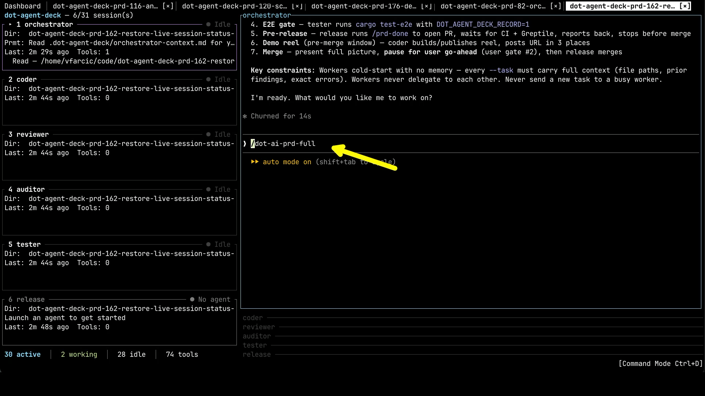
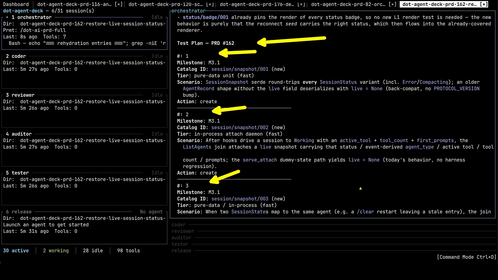
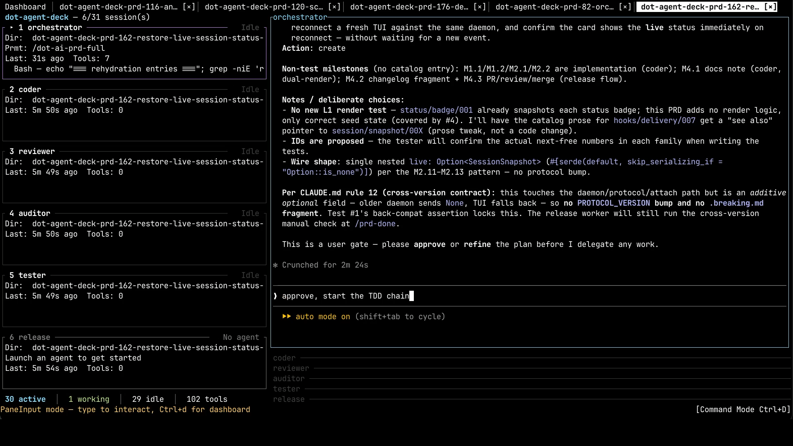
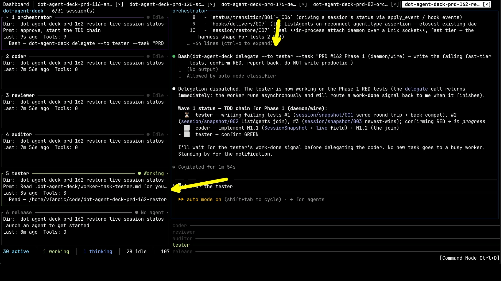
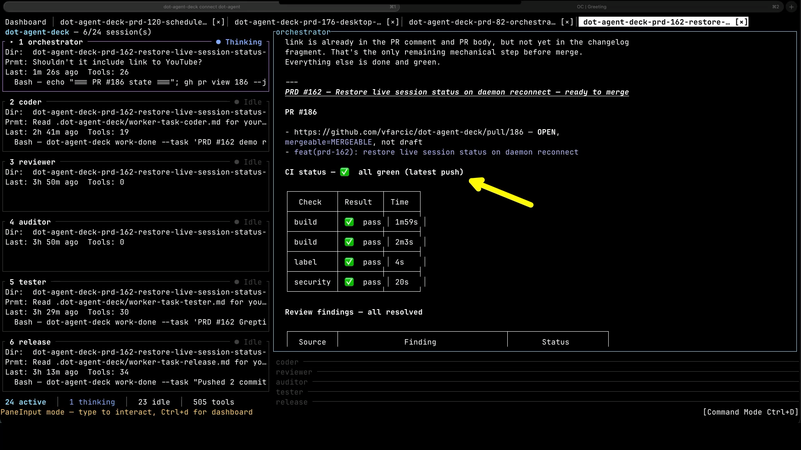
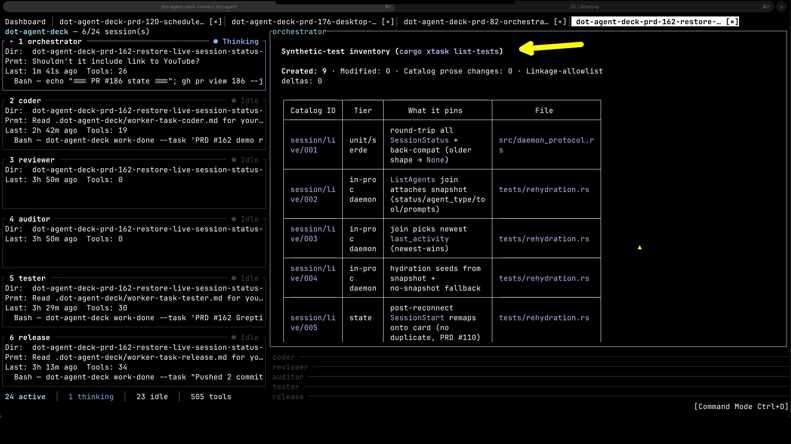
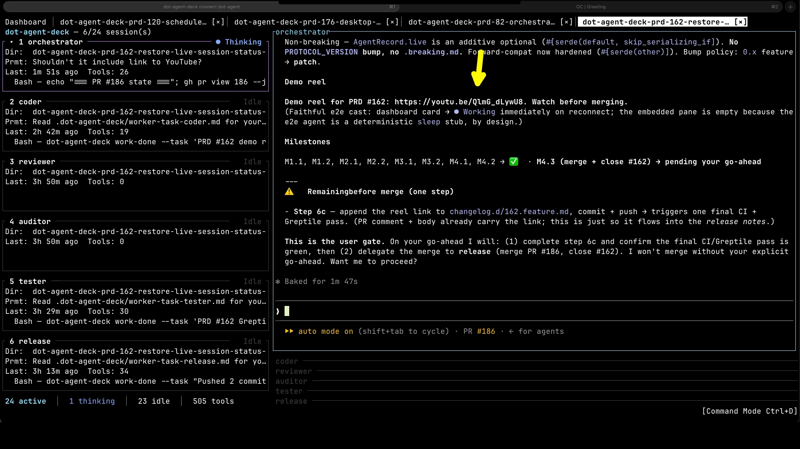
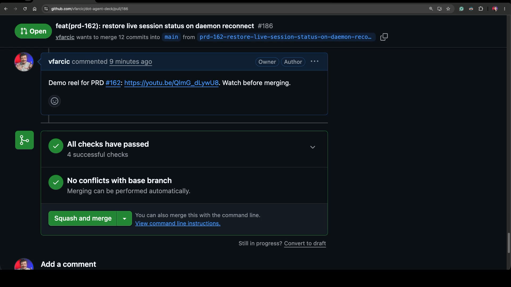
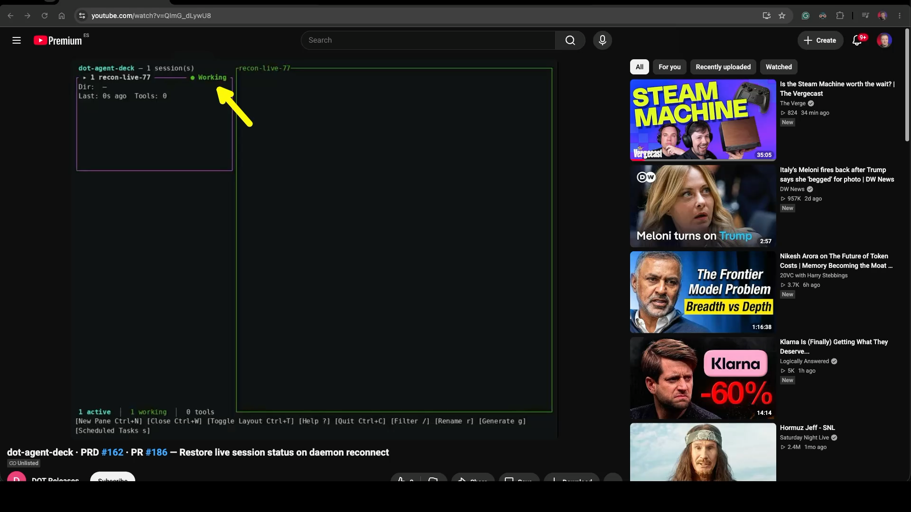
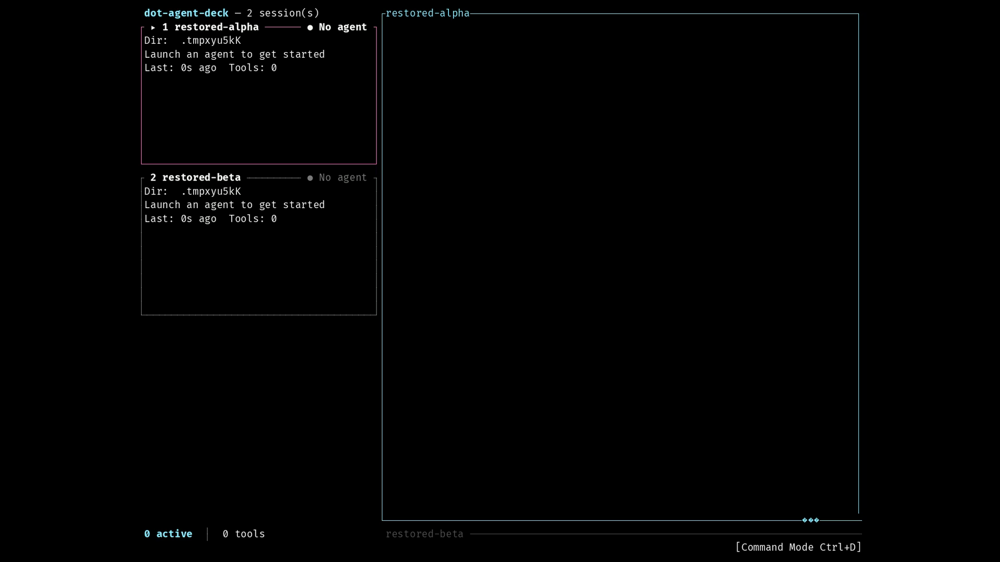

+++
title = "How I Review AI-Written Code Without Reading a Single Line"
date = 2026-07-13T15:00:00+00:00
draft = false
+++


The first thing I do in the morning is watch videos on YouTube. Still in bed. No time to lose. It might look like I'm being entertained, but I'm actually working. These aren't videos you'd ever want to watch. You'd get bored at best or, more likely, say "what the fuck is this?" if you ever saw one. Yet I find them genuinely engaging, real time-savers, and they've become my morning routine. They tell me more about my day than anything else.

I'll get to what those videos actually are. But first I need to show you how I build software now, because that's the reason they exist. This is about two things. How agentic AI can write genuinely good code. And how I can **review and confirm a whole feature the agents built on their own**, in seconds, without reading a single line of it.

<!--more-->



## TDD With Agentic AI

I've been writing tests first for most of my career. For me, Test-Driven Development was never really about the safety net. It was that writing the test first forced me to actually think about the problem before I touched the solution. I'd write a test for something that didn't exist yet, run it, and watch it fail. That red is me confirming the thing isn't there. Then I'd write just enough code to make it pass. That's green. Then do it again. Think, red, green, repeat.


And when I had the chance, I liked doing this with another person. Pair programming. One of us would write a test, the other would write the code to make it pass, then we'd switch and keep going, back and forth. Hold on to that picture of two people bouncing a problem between them, because it's going to matter in a minute.

And whatever I was building, the move was always the same: say what I want before I build it. That instinct never changed. What changed is the altitude I do it from. I started right down at the level of a single function, and from there I just kept climbing. High enough that, eventually, I couldn't see the individual lines of code at all. Which sounds reckless, until you see what keeps me from falling.

When agentic AI first showed up, I didn't do anything clever with it. I just did what I'd always done, except now my pair was the agent. I'd write a test, and the agent would write the code to make it pass. Same red-green loop, the same back-and-forth I used to have with a person, only the partner on the other side of it had changed.


And the test turned out to matter even more to the agent than it ever did to me. A test is an objective function. It's a fixed target a machine can check. Take that away, give an agent a vague goal and nothing concrete to hit, and it does what they all do: it declares victory early, it drifts off course, it tells you it's done when it isn't. But hand it a test that either passes or fails, and suddenly there's no room to argue. It knows exactly what it's aiming at, it knows the moment it gets there, and it knows when it's wrong.


For a while, that pairing worked great. But even with an agent, pairing one test at a time still kept me in the loop for every single step. So eventually I stopped. Instead of bouncing a single test back and forth, I started writing a detailed PRD, a real spec for the whole thing, and then letting a whole crew of agents rip through it. I describe what I want, they go build it, and I come back to review the result.

The test-first loop didn't disappear when I moved up to the PRD. It's still the engine running underneath all of this. The agents are still writing tests and making them pass, the same red-green rhythm as before, just without me holding the pen. But not all of those tests are equal, and I don't treat them the same. Most of them are low-level, and honestly I don't care about them. A small number are critical, the ones that actually capture what the feature is supposed to do, and those are the only ones I pay attention to.


Here's what that actually looks like. This is the setup I run, and every panel you see here is an agent with exactly one job. There's an orchestrator running the show, a coder, a dedicated tester, a couple of reviewers, and a release agent that opens the pull request at the very end. I start the whole thing by pointing them at the PRD.




And before any of them writes a single line of code, the orchestrator's first job is to read that PRD and turn it into a concrete plan.

And here's what it comes back with. Not code. A plan. A list of the tests it intends to write, each one tied back to a specific piece of the PRD. This is the agent telling me, in advance, exactly how it's going to prove the feature works.




And this is the one place I have to step in. Before it writes a single line of implementation, it stops and waits for me. I either approve the plan, or I disapprove and correct it. That approval does two jobs at once. First, it locks in the contract: the exact set of tests that have to pass for this to count as done. Second, it's my earliest read on whether the agent actually understood what I asked for. If the tests it's proposing are wrong, or testing the wrong thing, then it misread the PRD, and I've caught that right here, before it has wasted a minute writing code against a misunderstanding. In this case, I approve. And from this point on, the agents are on their own.



Now, while they're off working, let me say the thing you might already be thinking. 


If an agent is writing the tests, and an agent is writing the code, what stops this whole thing from being a sham? It could write a test that's trivially true. It could write the code first and then write a test that just blesses whatever the code already does. Or, when a test is failing and that red is in the way, it could simply delete the test and call everything green. If you've used these agents for more than a day, you've seen all three. So "let the agents test themselves" should make you nervous.


And the answer is right there on the screen. Look at what the orchestrator just handed out. The tester is told to write the critical failing tests, and explicitly not to write the production code. The coder comes along after and makes them pass. That's the first safeguard: the agent writing the implementation is not the agent that wrote the tests it has to satisfy. The one with a motive to cheat never holds the pen that defines passing. The second safeguard is the one we already watched: those tests trace straight back to the PRD, and I approved them myself before any of this started, so the agents can't move the goalposts, because the goalposts are mine. And the third is that the tests I care about are black-box. They check what the feature does from the outside, so you can't fake them by tailoring the code to the test. Could the coder still write itself a weak little unit test down in the weeds? Sure. And it doesn't matter, because that's not what decides whether the work is done. The thing that decides done was written by someone else and signed off by me. The objection mostly evaporates.




So why lean on these black-box, behavior-level tests in particular? Because a test like that is really just a spec by example. It says what should happen in plain terms. Start the app, press this, see that. It isn't asserting that some internal function returns some internal value. And that matters for two reasons. It's readable by me, the person who wrote the requirement in the first place. And it's readable by the agent, because plain-language scenarios are exactly what a language model is best at. The same description is the spec, the test, and the target, all at once. One thing, not three.


There's another payoff to testing behavior instead of structure, and it's what makes free refactoring possible. Because these tests only care about outcomes, the agent can rip the internals apart and rebuild them however it likes, and as long as the behavior still holds, the tests stay green. Now compare that to unit tests bolted to the shape of the code. The moment the agent reorganizes anything, half of them turn red. Not because something broke, but because the code moved. For an agent that restructures constantly, that's death by a thousand false alarms. You'd spend all your time chasing red that doesn't mean anything.

And these tests guard the thing that actually has value. 


A passing unit test proves a function behaves. A passing behavior test proves the feature works the way someone would actually use it. Those are not the same thing, and the gap between them is exactly where software quietly falls apart. That gap matters more than it ever did, because remember, nobody is reading the low-level code anymore. If I'm not looking at the internals, I want my guarantee sitting at the level I actually care about. Does the thing work, for real, from the outside.


This also **inverts the testing pyramid**. The classic advice is a big base of unit tests and just a few behavior tests on top, and the reasoning is sound: behavior tests are slower, they're coarser, and when one fails it tells you "something broke" instead of pointing at the exact function that returned the wrong number. That imprecision is genuinely expensive. And plenty of experienced people will tell you that AI is a reason to double down on unit tests, not back away from them. I get the argument. I just think it misses who's paying the bill now. That imprecision only costs you if a human has to sit there and hunt down where it broke. An agent doesn't care. It'll re-run, add logging, bisect, and dig through it at basically zero cost, with infinite patience. The exact thing that made coarse tests painful for us is the thing an agent shrugs off. So the math flips, and the pyramid flips with it. Top-heavy, behavior-first, because the one paying for the coarseness isn't a tired human anymore.


So that's the front of the process locked down. Now jump to the end. Some time later, the agents are finished.


And here's where they leave things. The work is done, the pull request is open, and every check is green. It's sitting there, ready to merge.




And it's green because every test it was supposed to satisfy actually passed.


I can pull up the whole list of them. These are the critical tests, the ones I cared about, each one created for this PRD and each one passing.



But green only tells me the tests pass. It doesn't tell me the feature actually works the way I pictured it. And before I merge anything, I want to see that for myself. For a long time, that was the slow part. Checking it by hand, run after run, cost me more time than I wanted to spend.


So I changed that last step. Instead of leaving me to check everything by hand, the agents now record the critical tests as they actually run, and turn that into a short demo reel. And right before the finish line, the orchestrator stops.


It hands me the link to that reel right there in its output, where I'm already working, and tells me in plain words to watch it before merging. It will not merge without my explicit go-ahead.




It also drops that same link as a comment on the pull request itself.


I don't usually need that, since the output is right in front of me. But nobody else can see what my agents are doing, so if someone wants to take a look, the link is waiting for them on the PR.




And this is the reel itself.


This one was a small PRD. The whole job was to fix a status that wasn't updating after a reconnect, so the clip is short and sweet. All I have to confirm is that the status now correctly reads "Working." And that's the point: only black-box tests become clips, because they're the ones that show real behavior, and only the critical few are worth watching at all. In this run, that's exactly one. I watch it, confirm the one thing that mattered, and I'm done. What used to be slow, hands-on checking is now a few seconds of video.



And that's the whole shape of it. 

Step back and look at where I actually sit in this process. There are only two moments that need me. At the start, I approve the plan. At the end, I watch a short reel and give the go-ahead to merge. Everything in between, all the writing, the testing, the implementing, the refactoring, runs without me. Two gates, total autonomy in between.


There's one last thing worth seeing, because it's where those reels come from. These critical tests don't just check assertions in memory. Each one launches the real app in a terminal and drives a real scenario end to end. Run it with recording on, and it captures the whole session, exactly what I'd see on screen.

```sh
DOT_AGENT_DECK_RECORD=1 cargo test-e2e restore_001_no_flag_startup_restores_panes_from_snapshot
```

The test leaves behind a recording of that run. In this project that's an asciinema cast, because it happens to be a terminal app.

```sh
ls .dot-agent-deck/recordings/restore_001_no_flag_startup_restores_panes_from_snapshot/
```



And that recording is the whole point. It's exactly what gets rendered into the clip I watched on the pull request a minute ago. If this were a web app, I'd be capturing a browser instead. A desktop app, a screen recorder. The mechanism doesn't matter. The principle does: record the tests that actually matter, assemble them into a single video, and put that video somewhere I can watch it. The spec and the demo become the same artifact, and validating my agents' work turns into watching a short video.

And that's what I watch in bed every morning. Not typical YouTube videos but reels of my own agents proving the work is actually done. Boring to anyone else. To me, they're the most useful few minutes of the day, because they tell me exactly where every project stands before I've even gotten up.
