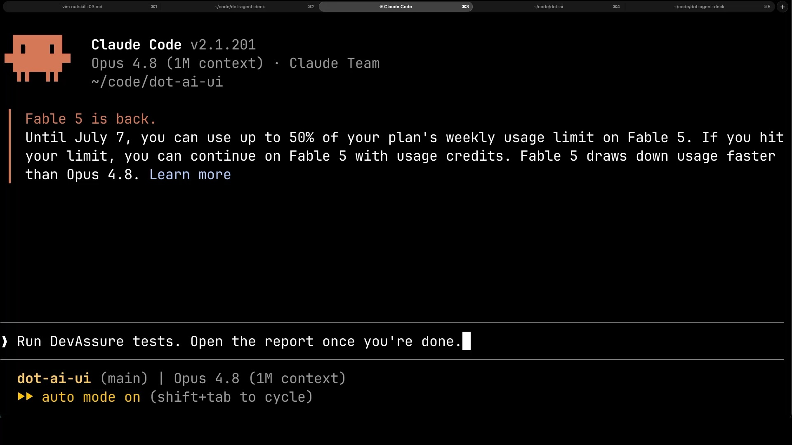
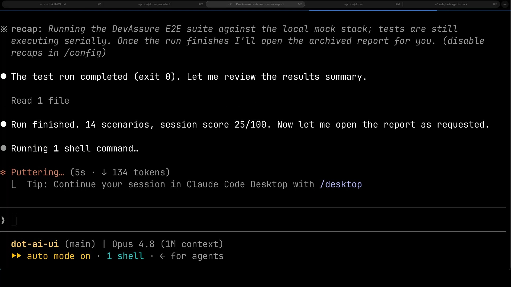
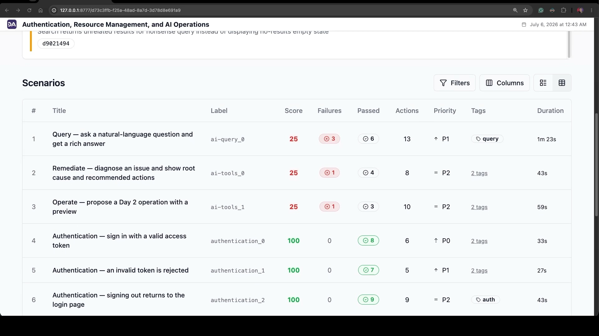
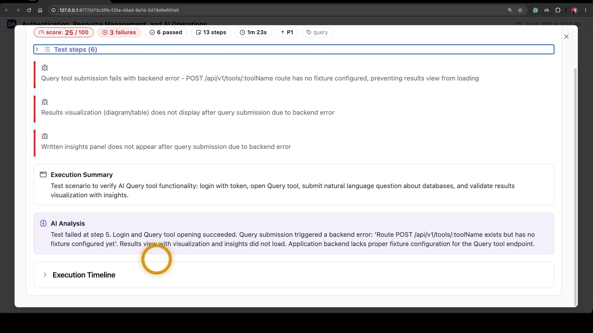
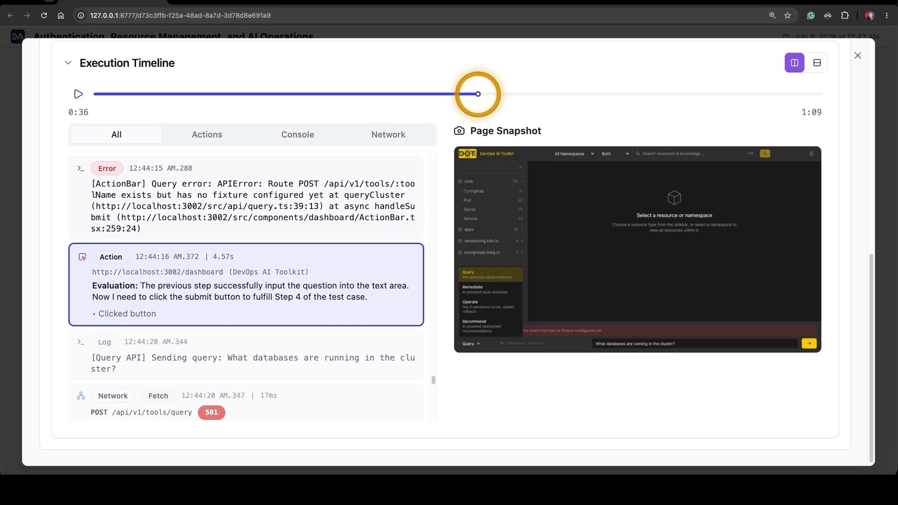

+++
title = "How I Use AI to Test My App Like a Real User with DevAssure"
date = 2026-07-24T16:00:00+00:00
draft = false
+++


<!--more-->



You write an end-to-end test, it passes, everyone's happy. Then someone moves a button or renames a label, and the test goes red. Nothing is actually broken. The test is just brittle. And you end up spending more time un-breaking your tests than you spent writing them. If you've done this for a living, you know exactly the feeling I'm talking about.


I've been using a tool called [DevAssure](https://www.devassure.io) that takes a very different swing at that problem, and I like it enough that I want to show you exactly how it fits into the way I work. So let me start with what it actually is.

DevAssure is an AI testing agent. The whole bet behind it is that you shouldn't be sitting there writing and babysitting test scripts at all. You describe what your application is supposed to do in plain English, and an AI agent figures out how to test it. It opens the app, clicks through it the way a real person would, and decides whether what you described actually happened. No selectors to hand-craft, no page objects to maintain. They call it scriptless, and that word turns out to be the whole point. The promise that rides along with it is **roughly zero flakiness and roughly zero maintenance**, and for anyone who's lived that brittle-test grind, that is a very loud promise.


Now, DevAssure does a lot more than I personally lean on, and it's worth seeing the surface before I narrow in. It plugs straight into the editors some might actually be working in, like VS Code, Cursor, and Windsurf. I don't use those, but you might. It hooks into CI systems like GitHub Actions, GitLab, and CircleCI. It ships as an agent skill you can drop into Claude, so a coding agent can drive it directly. That's the part I care about. It connects out to the tools teams already live in, like Jira, Figma, and TestRail. And beyond straightforward web journeys, it covers visual checks, accessibility, and even Flutter web apps. It's a broad product.

I don't use all of that. The way I use DevAssure is narrower, and honestly a little against the grain of how they pitch it, so let me show you my actual setup and then you can decide where it fits for you.

I let a whole crew of agents build features for me, with one agent whose only job is to prove a feature actually does what it's supposed to do, exercised from the outside the way a real person would use it, rather than checking the shape of the code underneath. DevAssure lives right next to that world. I don't drop it into the inner loop where my agents are writing and re-running tests every few seconds, because that work needs tests that are fixed, in my repo, and completely deterministic. DevAssure leans the other way. Its headline feature is self-healing: when the app shifts underneath a test, when a button moves or a label gets reworded, the test adapts itself in real time instead of breaking. That's a wonderful property for a maintenance-free acceptance suite, and exactly the wrong one for a red that has to stay red until the code is fixed. So I run it beside that loop, as **a separate, AI-driven acceptance net**. It's the thing that clicks through my app like an impatient user and tells me, in plain language, whether the product still does what the docs say it does.


Here's the part I genuinely like. A DevAssure project is just a folder of YAML, plain text you write by hand in plain English and commit to your repo, right next to the code. This is the whole tree for my setup.

```text
.devassure/
├── app.yaml                  # what the app is + guardrails for the agent
├── preferences.yaml          # browser + execution settings
├── test_data.yaml            # URL + access token for the local stack
├── agent_instructions.yaml   # how the AI agent should interpret steps
├── actions/
│   └── login.yaml            # reusable "sign in with token" action
└── tests/                    # one YAML file per feature (7 suites)
    ├── authentication.yaml
    ├── resource-explorer.yaml
    ├── ai-query.yaml
    ├── semantic-search.yaml
    ├── ai-tools.yaml
    ├── visualization.yaml
    └── user-management.yaml
```


```yaml
description: >
  DevOps AI Toolkit UI — a web companion for the dot-ai MCP server.
  It renders a Kubernetes dashboard (resource kinds grouped by API, namespace
  filtering, resource tables) and visualizations (Mermaid diagrams, cards, code
  blocks, tables) for MCP tool responses. During this trial it runs locally
  against a mock MCP server that returns fixed, deterministic data.
rules:
  - Authentication uses a single access token entered on the login page (no username/password).
  - This trial targets the local mock stack only; do not trigger any cluster-mutating actions.
```

The file at the top, app.yaml, is where I tell the agent what it's actually looking at and set the rules it has to play by. A description gives it context on what the app is and does, and a short list of hard rules keeps this freely-clicking agent scoped to what the tests are meant to do.

And here's the heart of it: the tests themselves. Each file under tests is one feature, and each scenario is just a numbered list of plain-English steps, with a priority from P-zero down to P-two, and some tags. 

I write them as the acceptance spec, derived from what the product is documented to do, not from poking around in the UI's source code. So the YAML ends up reading like the product's own user manual.

 Here's the happy path for signing in, alongside the case where a bad token gets rejected.

```yaml
# .devassure/tests/authentication.yaml (excerpt)
- summary: "Authentication — sign in with a valid access token"
  steps:
    - Open the application url
    - The login page shows the "DevOps AI Toolkit" heading
    - A "Token" sign-in option is offered (a "Login with SSO" button may also be present)
    - Choose the Token option and enter the access token from test data
    - Submit the sign-in form
    - The user lands on the dashboard, with the resource sidebar and the namespace selector both visible
  priority: P0
  tags: [docs, auth]

- summary: "Authentication — an invalid token is rejected"
  steps:
    - Open the application url
    - Choose the Token sign-in option
    - Enter the clearly-invalid access token "not-a-real-token"
    - Submit the sign-in form
    - Sign-in does not succeed — an invalid-token / error message is shown and the dashboard does not load
  priority: P1
  tags: [auth, negative]
```

What I really like about writing them this way is that I can be honest about the seams. 

Some of my mock's endpoints deliberately return a not-implemented error. Instead of softening the test to hide that, I leave the scenario asserting the real behavior and just label the expected red as a known mock gap, right there in a comment next to it. The failure stays visible and explained, not swept under the rug.

 Same with a couple of features that only make sense against a real backend, like a stateful, multi-step wizard. I drop those from the mock suite with a note to add them back later, rather than pretend they passed.


This is from around when I started using DevAssure, and it's why I kept using it. I don't run the suite myself. I hand it to an agent, in plain English.

```text
Run DevAssure tests. Open the report once you're done.
```

That's the whole instruction. Claude takes it and goes.




Then it works. And the one honest knock on the tool: it's slow. This run took the better part of fifteen minutes. But an agent is running it, not me, so slow barely costs me a thing.


When it's done, it reports back, fourteen scenarios and a session score, and opens the report like I asked.




And the report is what I care about. Every scenario scored, and it's not a wall of green: auth passed at a hundred, a batch of others came back at twenty-five.



This was day one. On its first run it went straight at features I'd never functionally tested, and found problems. I open a red: three failures, all because a Query endpoint has no fixture. That one's on me, it's my mock. But the agent traced it to the exact route and told me, plainly, what broke. It would catch a real bug the same way.



And I can replay the whole run: every action, console error, and network call, the 501 right there, each with a snapshot of my app at that moment.



So, do I like it? Yeah, I do. The scriptless, plain-English authoring genuinely makes **the tests read like a specification**, which means they double as documentation that doesn't quietly rot the way comments do. The agent is good at the messy, human parts of clicking through a real app. And it doesn't replace the other tests I run underneath it, it complements them, catching the one thing they miss: whether the product actually works end to end, the way someone really uses it. 

As a black-box acceptance net that thinks like a user and writes its tests in plain English, DevAssure has earned its place in how I work. And that's a sentence I don't get to say about most testing tools.


