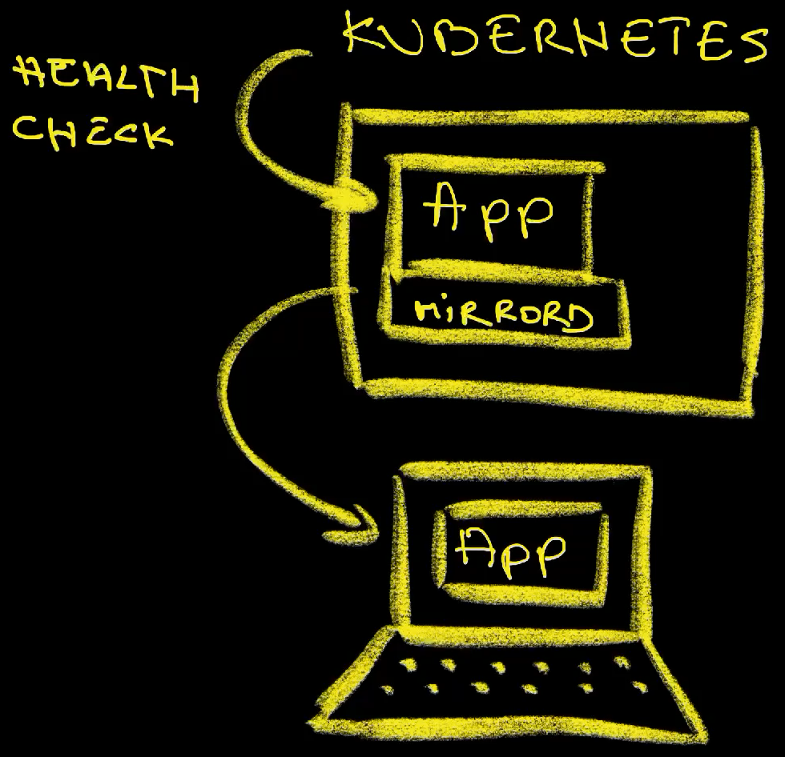
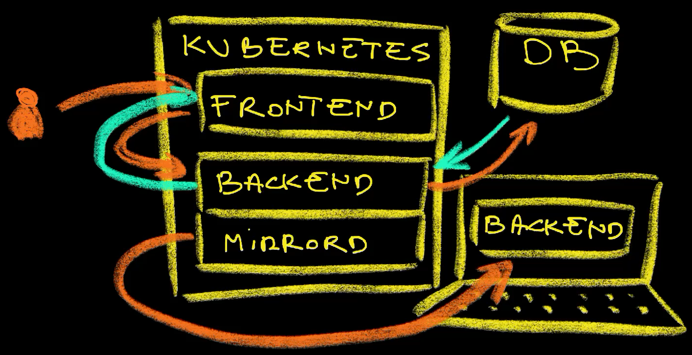
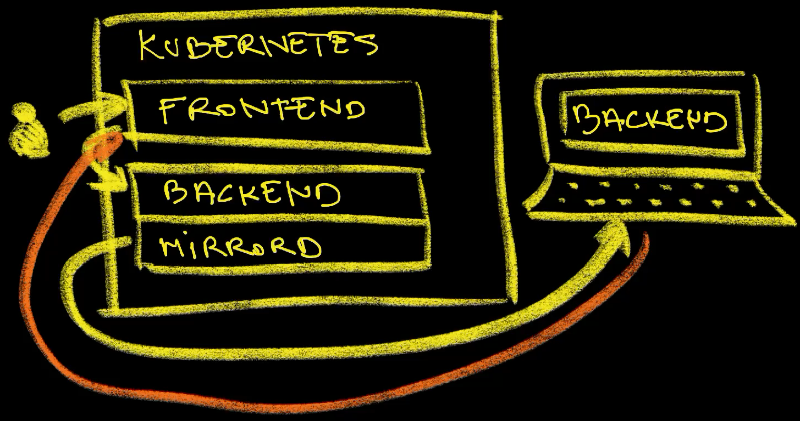

+++
title = 'Mirrord Magic: Write Code Locally, See It Remotely!'
date = 2025-04-21T16:00:00+00:00
draft = false
+++

Imagine this scenario.

There is a frontend application that talks to a backend which uses a database.

I am working on the code of that backend application.

I neither have nor care about the code of the frontend app and I do not have the database running locally. All I want is to write the code of that backend application and see the outcome of my work, either directly or through the frontend (the one that I am not running) and I want that local code to be connected to the database (which I am also not running).

<!--more-->



All those are set up in a staging environment, but the code I'm working on is in my laptop.

I can open the frontend application running in staging in a browser.

> Do not run the commands in this section. This is only a preview. We'll go through the setup and all the instructions later.

```sh
open "http://staging.silly-demo-frontend.$INGRESS_HOST"
```


The message saying that `This is a silly demo` is coming from the backend running in that same cluster. On my laptop, I changed the code so that that the response says something else and I want to see it in action.

Let me open that same frontend application again.

```sh
open "http://staging.silly-demo-frontend.$INGRESS_HOST/?user=vfarcic"
```


Boom!

That frontend running in a Kubernetes cluster automagically decided to ignore the backend running in the same cluster and send a request from the cluster into my laptop which responded with a message saying that `This is a silly demo with mirrord`.

Today I will show you potentially the **cheapest**, the **most effective**, and the **easiest** way to develop applications while being able to run them under very similar conditions as if they are running in a **production-like environment**. 

My hope is that, by the end of this video, you will likely change your opinion on **how to set up and run development environments**.

I'm eager to jump straight into it without much pep talk, but, before I do just that, I need to set the scene so that you understand the type of production-like environment I am running and that has no direct connection with the development environments we'll explore soon.

## Setup

```sh
git clone https://github.com/vfarcic/idp-full-demo

cd idp-full-demo

git pull

git fetch

git switch mirrord

devbox shell
```

> Watch [How to Create Custom CLIs for Internal Developer Platforms with Nushell](https://youtu.be/TgQZz2kGysk) if you are not familiar with Nushell. Alternatively, you can inspect the `platform` script and transform the instructions in it to Bash or ZShell if you prefer not to use that Nushell script.

```sh
platform setup mirrord

source .env

export DEBUG=true
```

## Setting The Scene (Staging Environment)

Before we dive into, in my opinion, one of the best and most effective ways to set up a development environment, we should take a quick look at the production-like environment I set up. That might be boring and you are likely already familiar with the setup you're about to see. Nevertheless, I feel that it is important to understand how my environment is set up before we dive into the main subject. So bear with me. I'll do my best to be brief.

Before we begin, bear in mind that the environment I am about to show has nothing to do with development. It's a staging environment that mimics production. Actually, that's not the case. It's a demo environment. I cannot show my "real" production so it is a simulation of such an environment that is not meant to be used for development.

With that out of the way, let's start by taking a quick look at what I have in my staging environment.

```sh
kubectl --namespace staging get all,ingresses,secrets
```

The output is as follows (truncated for brevity).

```
NAME                                    READY STATUS  RESTARTS AGE
pod/silly-demo-...                      1/1   Running 0        8m22s
pod/silly-demo-db-main-atlas-dev-db-... 1/1   Running 0        71s
pod/silly-demo-frontend-...             1/1   Running 0        8m21s

NAME                        TYPE      CLUSTER-IP   EXTERNAL-IP PORT(S)  AGE
service/silly-demo          ClusterIP 10.96.68.94  <none>      8080/TCP 8m23s
service/silly-demo-frontend ClusterIP 10.96.202.37 <none>      3000/TCP 8m21s

NAME                                            READY UP-TO-DATE AVAILABLE AGE
deployment.apps/silly-demo                      1/1   1          1         8m23s
deployment.apps/silly-demo-db-main-atlas-dev-db 1/1   1          1         72s
deployment.apps/silly-demo-frontend             1/1   1          1         8m22s

NAME                                                DESIRED CURRENT READY AGE
replicaset.apps/silly-demo-...                      1       1       1     8m23s
replicaset.apps/silly-demo-db-main-atlas-dev-db-... 1       1       1     72s
replicaset.apps/silly-demo-frontend-...             1       1       1     8m22s

NAME                           CLASS   HOSTS                           ADDRESS     PORTS AGE
ingress.../silly-demo          traefik staging.silly-demo....          lb-0a36a... 80    8m24s
ingress.../silly-demo-frontend traefik staging.silly-demo-frontend.... lb-0a36a... 80    8m23s

NAME                          TYPE                              DATA AGE
secret/silly-demo-db          Opaque                            4    98s
secret/silly-demo-db-password connection.crossplane.io/v1alpha1 3    7m48s
```

That's a relatively simple one. We have a frontend (`deployment.apps/silly-demo-frontend`) app that talks to a backend (`deployment.apps/silly-demo`).

There's also Ingress for external traffic to both the frontend (`ingress.../silly-demo-frontend`) and the backend (`ingress.../silly-demo`), and Services (`service/silly-demo` and `service/silly-demo-frontend`) for internal traffic.

The backend, in turn, is talking to a database running somewhere. Since that database is managed by [Crossplane](https://crossplane.io), we can see what it contains by tracing the claim that created it.

```sh
crossplane beta trace sqlclaim silly-demo-db --namespace staging
```

The output is as follows.

```
NAME                                          SYNCED READY STATUS
SQLClaim/silly-demo-db (staging)              True   True  Available
└─ SQL/silly-demo-db-bk574                    True   True  Available
   ├─ ManagedDatabasePostgresql/silly-demo-db True   True  Available
   ├─ ProviderConfig/silly-demo-db-sql        -      -     
   ├─ ProviderConfig/silly-demo-db-sql        -      -     
   ├─ Object/silly-demo-db-schema-main        True   True  Available
   ├─ Object/silly-demo-db-secret             True   True  Available
   ├─ Network/silly-demo-db                   True   True  Available
   ├─ Router/silly-demo-db                    True   True  Available
   ├─ Database/silly-demo-db-main             True   True  Available
   └─ ProviderConfig/silly-demo-db            -      -     
```

We can see that there is a `ManagedDatabasePostgresql` with its own `Network` and a `Router`.

In this specific case, that's PostgreSQL running in [UpCloud](https://upcloud.com) which you might want to try out if you haven't already. It's easy to use and it is cheap. It providers Kubernetes-as-a-Service, Database-as-a-Service, and others. You can manage whatever you need through their Web UI, CLI, Terraform, Ansible (if you're desperate), and Crossplane, my favorite. Try it out if you haven't already.

Nevertheless, today we're not talking about UpCloud. I'm mentioning mainly to stress that the app we're using today uses a PostgreSQL DB hosted in UpCloud and, if you're following along, you'll find instructions how to reproduce what I'm doing in other providers like AWS, Azure, and Google Cloud as well.

That claim created two objects, one being a resource that manages the schema in that database through the [Atlas Operator](https://atlasgo.io) (`silly-demo-db-schema-main`) and the other a Kubernetes Secret (`silly-demo-db-secret`).

We also created a database called *main* (`silly-demo-db-main`) in that PostgreSQL server running, in my case, in UpCloud.

As you can see, I have a typical three-tier application with a frotnend, a backend, and a database. There's nothing special about it except that you would have trouble setting it all up locally, especially since those are likely to be connected with other applications running in the system. As you will see soon, there will be no good reason to work locally. I could even say that working locally would be a silly complication without any tangible benefit and quite a few downsides.

We can see all that in action by opening the frontend.

```sh
echo "http://staging.silly-demo-frontend.$INGRESS_HOST"
```

The output is as follows.

```
http://staging.silly-demo-frontend.209.151.148.190.nip.io
```

> Open the URL from the output of the previous command in a browser.

There are two things in that frotend we should note.


First, we can see that the header says that `This is a silly demo`. The important part of that observation is that the text in front of you is not static. It comes from the backend. Frontend made a request to the backend which responded with that message and the frontend displayed it on the screen.

All that is, ofcourse, silly. I did it that way mainly to demonstrate the communication between the two. As you'll see later, that silly message will become very important very soon.

> Click the `Add Video` link
> Type `WAm3ypS0_wg` as the *ID* and `IDP History` as the *Title*, and click the `ADD VIDEO` button.

Second, if we click on the `Add Video` link, type something as the `ID` and the `Title`, and click the `ADD VIDEO` button, the frontend sends that information to the backend which, in turn, stores it in the database, thus showing that all three components are connected.

> Click the `List Videos` link.

We can confirm that by clisking on the `List Videos` link.

Similarly, we can send a request directly to the backend,...

```sh
curl "http://staging.silly-demo.$INGRESS_HOST"
```

...and we can see that the backend, when used directly, responds with the same `This is a silly demo` message we saw in the frotend.

Next, we can send another request directly to the backend but, this time, with the intention to retrieve data from the database.

```sh
curl "http://staging.silly-demo.$INGRESS_HOST/videos" | jq .
```

The output is as follows.

```json
[
  {
    "id": "WAm3ypS0_wg",
    "title": "IDP History"
  }
]
```

We can see that the output contains the data we previously introduced through the frontend.

Now that we have the scene set up, let's see how we can develop one of those components while leveraging the existing production-like environment we just saw.

## Development Environments with mirord

The main premise is that we want to have a development environment that is as close to production as possible. At the same time, there is one important requirement.

One person's work should not affect other people. Whatever I'm developing should not impact other developers. No action of mine should affect other. So, I cannot use the staging environment directly, nor I should be able to replace it with my code, nor I should be able to affect data in the shared database, nor do anything else that affects anyone else.

All that means that I, and everyone else, should be able to develop in isolation while still having the setup that resembles production.

I am already inside a directory where I cloned the repo of the backend application and let's say that I would like to change the message we saw earlier. I'll do that by modifying that message in the *root.go* file.

> Modify `This is a silly demo` message in `root.go`.

*Don't freak out when you see Go code. I'm using it only as an example that can be applied to any language.*

Next, let's say that I would like to see the outcome of that change in form of the application running in, more or less, the same way as if it's running in staging which acts as a production-like environment.

I can do that with mirrord. Here's an example config.

```sh
cat .mirrord/mirror.json
```

The output is as follows.

```json
{
  "target": {
    "path": "deployment/silly-demo",
    "namespace": "staging"
  },
  "feature": {
    "network": {
      "incoming": "mirror"
    }
  },
  "agent": {
    "namespace": "staging"
  }
}
```

The `target` points to the `deployment` of the backend application running the in the `staging` Namespace.

Further on, we are instructing it to `mirror` the traffic coming into the Pods created by that Deployment in the remote cluster.

Finally, since, as we'll see soon, mirrord needs to run an `agent`, we are instructing it to run in the `namespace` `staging` as well.

That's it, for now, so all that's left is to run `mirrord` that will `exec` using that `--config-file`. It will run `air` which monitors local file system and will execute `go run` every time we make any change to the source code.

```sh
mirrord exec --config-file .mirrord/mirror.json air go run .
```

The output is as follows (truncated for brevity).

```
...
  __    _   ___
 / /\  | | | |_)
/_/--\ |_| |_| \_ (devel), built with Go go1.23.5

watching .
...
building...
running...
2025/03/11 19:49:33 DEBUG DB Endpoint: %s !BADKEY=public-silly-demo-db-dpdpmycgipsb.db.upclouddatabases.com
2025/03/11 19:49:33 Starting server...
[GIN-debug] [WARNING] Running in "debug" mode. Switch to "release" mode in production.
 - using env:   export GIN_MODE=release
 - using code:  gin.SetMode(gin.ReleaseMode)

[GIN-debug] GET    /                         --> main.rootHandler (2 handlers)
[GIN-debug] POST   /video                    --> silly-demo/internal/handlers.VideoPostHandler (2 handlers)
[GIN-debug] GET    /videos                   --> silly-demo/internal/handlers.VideosGetHandler (2 handlers)
2025/03/11 19:49:39 DEBUG Handling request URI=/
2025/03/11 19:49:39 DEBUG Handling request URI=/
2025/03/11 19:49:41 DEBUG Handling request URI=/
...
```

We can see that the application we're working on is running locally. It is NOT running in that cluster but locally on a laptop. That part is important.

The curious thing is that we can see some requests (`Handling request URI=/`) coming into the application running locally. What is sending those requests? Why is my application running locally receiving requests? I am certainly not the one to blame. I am not doing anything, yet requests keep coming in. How is that possible? Can you guess who or what is sending those requests?



Those requests are coming from the remote application. The Pods have health checks that are periodically sending requests to the app. Since we are now running a variation of that application locally through mirrord, it is mirroring all requests coming into the remote application to the local version we're running on a laptop.

That being said, our goal is not to see health checks being mirrored to the local process, but to use it to simplify and improve development, so let's do just that.

We'll leave *mirrord* running and open a new terminal session in the same directory.

> Open a new terminal session in the same directory. Commands should be executed in the first terminal session unless specified explicitly (like in the case that follows).

This project uses *devbox* to bring in the tools we might need and stores a few environment variables in *.env*, so let's start a new `devbox shell`...

> Execute the commands that follow in the second terminal session.

```sh
devbox shell
```

...and `source` the `.env` file.

```sh
source .env
```

Let's start by sending a request to the local process first.

> Execute the command that follows in the second terminal session.

```sh
curl "localhost:8080"
```

The output is as follows.

```
This is a silly demo with mirrord
```

As expected, we got the output that matches the changes we made to the code earlier.

What will happen if we send the same request to the remote process?

To make things easier to track, we'll add `something=else` as query parameters.

> Execute the command that follows in the second terminal session.

```sh
curl "http://staging.silly-demo.$INGRESS_HOST?something=else"
```

The output in the first terminal session is as follows (truncated for brevity).

```
...
2025/03/11 19:50:59 DEBUG Handling request URI=/
2025/03/11 19:51:05 DEBUG Handling request URI="/?something=else"
```

If we take a look at the logs of the local process, we can see that the request sent to the remote process was mirrored to the local one. That means that we can observe what's happening in logs or place a break point to debug it, or anything else we might be doing while developing, except for one thing.

The output in the second terminal session is as follows.

```
This is a silly demo
```

The response from that request came from the remote process. That's essentially the same result as what we observed with the health checks. Incomming requests are mirrored to the local process but the responses are coming from the remote one. Both processes are receiving the same requests but only one of them is responding.

We'll change that soon, for now, let's see what's happening with the database.

We can, for example, send a request to the local backend process to add an entry to the database.

> Execute the command that follows in the second terminal session.

```sh
curl -XPOST \
    "http://localhost:8080/video?id=z7Nfl-u-hLI&title=Neon"
```

The output is as follows.

```
Video added successfully
```

How did that work? We are not running a database locally and, even if we would spin it up, we did not configure the local process with the database credentials.

When we started the local process with *mirrord* it, among other things, added the same environment variables it found in the remote counterpart. Given that the code itself uses environment variables to connect to the database, the local process itself is now talking to the same remote database as the remote backend.

We can confirm that's really the case by sending a request to the local process to retrieve all the records from the database.

> Execute the command that follows in the second terminal session.

```sh
curl "localhost:8080/videos" | jq .
```

The output is as follows.

```json
[
  {
    "id": "WAm3ypS0_wg",
    "title": "IDP History"
  },
  {
    "id": "z7Nfl-u-hLI",
    "title": "Neon"
  }
]
```

We can see that there are two records. The first one (`IDP History`) was the record we added to the database through the remote frontend that talked to the remote backend which, in turn, added it to the remote database. We added that record before we even started using *mirrord*. The second entry from that remote database was added through the local process, thus proving that both are connected to the same database.

Finally, we do not even have to interact with the remote process directly. Let's see that through the remote frontend.

> Execute the command that follows in the second terminal session.

```sh
echo "http://staging.silly-demo-frontend.$INGRESS_HOST"
```

> Open the URL from the output of the previous command in a browser.


The first thing we'll notice is that the header in the frontend is still stating that `This is a silly demo` (without *with mirrord*) meaning that responses are coming from the remote backend.

The output in the second terminal session is as follows (truncated for brevity).

```
...
2025/03/11 19:54:40 DEBUG Handling request URI=/videos
2025/03/11 19:54:42 DEBUG Handling request URI=/videos
2025/03/11 19:54:42 DEBUG Handling request URI="/?user=null"
2025/03/11 19:54:42 DEBUG Handling request URI=/videos
...
```

However, if we observe the logs in the local process, we can see that the frontend request that was sent to the remote backend was mirrored into the local backend process as well (`Handling request URI="/?user=null`).

Here's what happened.



We sent a request to the frontend, which sent another request to the backend. Mirrord detected that incoming request and mirrored it into the local processes on the laptop. Both the remote and local backend processes processed that request, but only the remote process made the outgoing request to the database to retrieve data and responded back to the frontend.

As a result of all that, we have a local processes that is fully integrated into the system and we can observe what is happening with our local code through logs or we can put breakpoints if we would like to debug it step by step. We did not have to run the frontend or the database locally nor to fiddle with local configuration. Our local process is configured in the same way as the remote one and requests are being morrorer.

All that is nice and dandy but, more often than not, observing logs and debugging the local process is not enough. We might want it to respond as well. We might want it to "steal" requests.

> Press `ctrl+c` to stop `mirrord`

## Stealing Requests with mirrord

Let's take a look at a slightly different mirrord configuration.

```sh
cat .mirrord/steal.json
```

The output is as follows.

```json
{
  "target": {
    "path": "deployment/silly-demo",
    "namespace": "staging"
  },
  "feature": {
    "network": {
      "incoming": "steal"
    }
  },
  "agent": {
    "namespace": "staging"
  }
}
```

The only difference, when compared with the previous config, is that, this time, we set `feature.network.incoming` to `steal`.

Let's run is, just as we did before, and see "stealing" in action.

```sh
mirrord exec --config-file .mirrord/steal.json air go run .
```

Next, we'll execute the same request against the remote process as before.

> Execute the commands that follow in the second terminal session.

```sh
curl "http://staging.silly-demo.$INGRESS_HOST?something=else"
```

The output is as follows.

```
This is a silly demo with mirrord
```

This time the response is different. This time, even though we sent a request to the remote process, the response came from the local one. The response message is based on the code changes we made earlier and that were not deployed to the cluster.

Let's see what we'll get if we open the remote frontend in a browser.

> Execute the commands that follow in the second terminal session.

```sh
echo "http://staging.silly-demo-frontend.$INGRESS_HOST"
```

> Open the URL from the output from the previous command in a browser

Look at that. The frontend header text now changed. It says that `This is a silly demo with mirrord`.

> You might see the old output. If that's the case, caching is the likely culprit and you might need to clear it.



We opened the remote frontend which, just as before, sent a request to the remote backend. This time, however, mirrord stole that request and sent it to the local backend process which responded back to the remote frontend.

This time, the header in the frontend says that `This is a silly demo with mirrord` confirming that requests are now responded by the local process no matter whether they are sent directly to the remote backend or through some other app like the frontend.

That, however, might not be enough either since such a setup might result in you being hated by your team mates. They might accuse you of messing up with the staging environment.

> Press `ctrl+c` to stop `mirrord`

## Filtering Requests with mirrord

The problem we have with the current setup is that all requests sent to the remote process are stolen by the one running in our laptop. Assuming that we are not the only person using that production-like environment, such a setup might affect others. We need to figure out a way to limit this setup only to the person who created it.

Fortunately, there is a solution for that as well.

Let's take a look at another variation of the mirrord config.

```sh
cat .mirrord/filter.json
```

The output is as follows.

```json
{
  "target": {
    "path": "deployment/silly-demo",
    "namespace": "staging"
  },
  "feature": {
    "network": {
      "incoming": {
        "mode": "steal",
        "http_filter": {
          "path_filter": ".+user=vfarcic.*"
        }
      }
    }
  },
  "agent": {
    "namespace": "staging"
  }
}
```

This time we added `http_filter` to the `network.incoming` feature. We can specify quite a few ways to filter requests that should be stolen. Today we're going with a simple one that uses `path_filter` with a regular expression (`+user=vfarcic.*`) which will include only those that have the query parameter `user` set to `vfarcic`.

Let's execute it.

```sh
mirrord exec --config-file .mirrord/filter.json air go run .
```

Now, let's say that someone else is using the staging environment and sends a request to the backend.

> Execute the commands that follow in the second terminal session.

```sh
curl "http://staging.silly-demo.$INGRESS_HOST?something=else"
```

The output is as follows.

```
This is a silly demo
```

We got the response from the remote backend that did not involve the local process. From the perspective of that user of the staging environment, there is nothing beyond the remote processes. That person would not even know that we are stealing requests.

On the other hand, I can send a request to the same backend application with the addition of the query parameter `user`.

> Execute the commands that follow in the second terminal session.

```sh
curl "http://staging.silly-demo.$INGRESS_HOST?user=vfarcic"
```

The output is as follows.

```
This is a silly demo with mirrord
```

This time, the request was indeed stolen by mirrord and sent to the local process. We can see that both in the response as well as the logs. If we placed a breakpoint in the code we could have started step-by-step debugging or do whatever else we might want to do to ensure that our local code is behaving as expected within the context of the whole system.

Similarly, someone might open the frontend.

> Execute the commands that follow in the second terminal session.

```sh
echo "http://staging.silly-demo-frontend.$INGRESS_HOST"
```

> Open the URL from the output of the previous command in a browser.

That person would not see anything "special" since the frontend would be sending requests to the remote backend. We can see that through the header text retrieved from the backend.

On the other hand, I can open the frontend with the query parameter `user` set to `vfarcic`.

> Execute the commands that follow in the second terminal session.

```sh
echo "http://staging.silly-demo-frontend.$INGRESS_HOST/?user=vfarcic"
```

> Open the URL from the output of the previous command in a browser.

This time, the frontend also sent a request to the remote backend but that request was stolen and forwarded to the local process which responded with `This is a silly demo with mirrord` that is shown as the header text.

Now, to be clear, in this setup mirrord is oblivious of the frontend. I had to modify the code to ensure that `user` parameter is sent to the backend. Otherwise, that parameter would not be included in the requests frontend sends to the backend and it would not be stolen by mirrord. 

## What Else?

There's much more to mirrord. For example, if the remote process is working with files, the local process would be accessing those same remote files just as it uses the same environment variables. Just as we are manipulating incoming requests, we could have configured it to manipulate outgoing requests as well. There are also VS Code and IntelliJ extensions in case one dislikes executing commands from a terminal.

Finally, everything we saw and talked about is open source with MIT License. On top of that there are additional commercial features you might want to explore. You might be covered with opensource, or not. It all depends on whether you need or do not those additional features.

For example, stealing works only with HTTP requests. If you're using HTTPS, as you should in production-like environments, you might need to look for Team or Enterprise editions. If you want to debug an application while others are debugging it, open source will not be enough. Similarly, if you are using messages and queues in your application and you want to decide which messages go where, you might need to use the queue splitting feature which is reserved for the commercial edition of mirrord.

And so on and so forth. Long story short, if you work in a team, as most of us do, there is a strong chance that you might need a commercial version.

That being said, I feel that mirrord strikes a healthy balance between open source and commercial offerings. You can accomplish the main goals with open source but you will be even more productive and will not have to make any sacrifices with one of the commercial versions.

Let's switch gears and talk about the pros and cons.

## mirrord Pros and Cons

Let's start with negative parts of mirrord.

**Cons:**
* Remote processes unresponsive
* Mirroring and stealing not working
* Documentation

To begin with, it does not always work. When an agent is starting the application that we're mirroring or stealing from might be **unresponsive** for a few moments. That short unresponsiveness should not be a problem for the person starting mirrord, but might effect other people working with the apps in the same cluster or, if we are executing automated tests, as we should, they might fail due to those networking glitches.

There are cases when mirrord might stop working altogether or, to be more precise, it might **not mirror or steal requests**. In those cases, remote processes are not affected since mirroring and stealing might not be happening. I had to restart those remote Pods to fix it. There might be a better way to deal with those situations. Still, no matter what the workaround is, it might happen that it just stops working.

Finally, **documentation** is often confusing or insufficient. I could not figure out why I might want it or how to start using mirrord right away. Later on, once I passed that initial hurdle, the rest of the learning process through the docs was relatively easy and straightforward. Everything we might need is there, but not necessarily organized well, especially the quickstart which does not really result in any start. After all, mirrord is an easy tool to use with relatively simple configuration so extensive documentation is not critical.

None of those cons are deal-breakers. The issues are likely to be fixed, the docs will hopefully get better, and none of them should prevent you from using it and getting value from it.

**Pros:**
* Production-like environments
* Filters
* Simple
* Low resource cost

To begin with, mirrord allows us to have a **production-like development environment**. That is huge since that allows us to catch issues we would normally not see if we would be using something like Docker that behaves completely differently from production, assuming that your production is in Kubernetes. Similarly, it saves us from trying to replicate a production-like environment in a local cluster like KinD or Minikube. Mirrord allows us to connect to any other service the remote process we are mirroring or stealing from is connected to. It, essentially, allows us to run a process locally with that process behaving as if it is the remote process.

**Filters** are probably the most important feature. One thing is to mirror requests completely and another to ensure that mirroring does not affect other people using the same remote environment.

Next, mirrord is very **simple**, yet, at the same time, very feature rich. By being able to mirror and steal both incomming and outgoing requests as well as to share environments and files, we probably have everything we might need to make local processes act as they are running inside a cluster.

Finally, there is **low resource cost**. The solutions that enable us to run development environments inside clusters tend to increase the cost through additional resources they are using in those clusters. Mirrord agent also runs in remote clusters but is likely using less resources than if we would be running copies of our own applications those clusters while developing.

All in all, I think it is awesome and a valuable addition to our toolbelt. To be honest, I was not positive towards it from the very start due to, in my opinion, silly quickstart. However, once I got my head around it, which did not take long, I can say that I love it. It's great and you should **give it a try**.

## Destroy

> Press `ctrl+c` to stop `mirrord`

```sh
platform destroy mirrord $PROVIDER

exit
```

