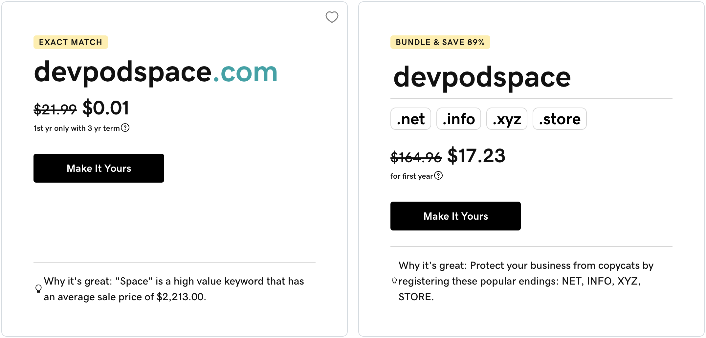
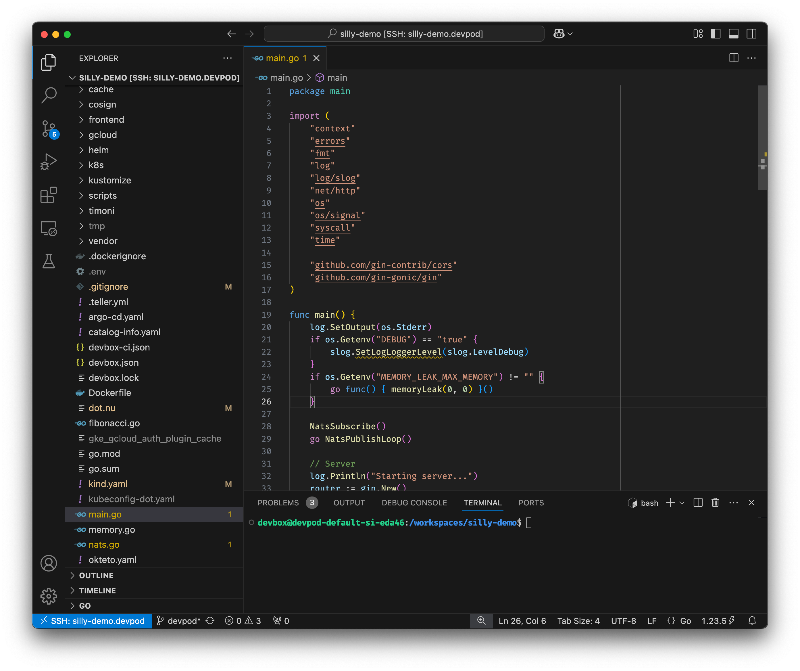

+++
title = 'Remote Environments with Dev Containers and Devpod: Are They Worth It?'
date = 2025-03-31T15:00:00+00:00
draft = false
+++

Today we are going to explore running remote ephemeral development environments. We are going to see (potentially) the best solution you should (probably) NOT use. If that sounds confusing, you're not alone. 

We'll explore the Development Containers spec as well as Devpod as an implementation of that spec. Together, they provide a way to run ephemeral development environments.

There is a hidden reason for going through those. I have serious doubts about the story behind remote environments, at least in a specific form, and I want to discuss what we really want them for. But, to do that, we need to go through a few practical examples to be on the same page before I go off the beaten path and start questioning it all.

Buckle up. You're in for a ride that starts with some important questions that turn into excitement and finish... Well... I do not yet know how it will finish.

<!--more-->



## Development Environments Questions

We all want to make it easier to develop, test, deploy, and do whatever else we need to do with our applications. The less time we spend doing mundane tasks or waiting for something to happen, the more time we have to focus on tasks that matter, primarily designing and coding. One way we can reduce the toil is through **development environments**.

Now, when we talk about development environments, there are a few questions we might need to answer before we start evaluating any possible solution.

To begin with, we should ask ourselves whether we want a **managed or self-managed** solution. Is it going to be a service managed by someone else or we'll set it up and maintain it ourselves.

Next, we might want to decide whether such a solution should be **remote or local**? Do we want to run that something on our laptops or remotely in a VM, a Kubernetes cluster, or anywhere else.

Next, we should decide **where** we'll run it. Is it something as simple as Docker? How about Kubernetes? Or, maybe, we work with legacy software that is stuck in the previous century and can be run only by SSH-ing into a server. How about running it in AWS, Google Cloud, Azure, Digital Ocean, or any other Cloud provider? There is a close to infinite number of answers to that one. It can be "sometimes as Docker, at other times inside Kubernetes and sprinkled with some of it in Digital Ocean." It all depends on how your current landscape looks like and what you're familiar with and used to.

Let's move onto the next question.

**Which problem** do we want to solve? Are we trying to make it easier for developers to do what they're doing today? If that's the case, should we give them everything they need like compilers, IDEs, linters, and everything else they are using today? A different answer to that question could be to solve specific problems like, for example, how to continuously deploy and test code we're writing? Just as destinations, there could be close to infinite number of answers to that question so I'll simplify it. Are we trying to make it easier to do what we're doing today or should we change the way we develop?

Finally, we might want to ask ourselves whether we are building something that covers today's needs, or a more lasting solution. Should we buy a solution or adopt a project that is owned by someone or should we try to find a **standard** that is independent of a vendor or a project?

If we choose to go for a standard, we have, essentially, two options which are not mutually exclusive. We can adopt a wide standard that is not necessarily fosued on development environments, or we can try to find some sort of a standard that was designed specifically to address the issues we're trying to solve.

So, the questions are:
* Should we adopt a **managed or self-managed** solution?
* Should our environments be **remote or local**?
* **Where** are we going to run it?
* **Which problem** are we trying to solve?
* Can we find a **standard** that is independent of a specific vendor or a project?

Those questions are important and the answers to them might not be easy to get to. In some cases, answer to one of those might dictate the other like, for example, if we want to run it locally we might not be able to choose a managed solution.

Here's another question for you. "Why am I talking in such abstract terms?" "Shouldn't we dig into whatever I'm planning to show us?"

Think of those questions as a framework through which I'll try to evaluate a solution we are about to see. Is it the answer to all of those and, if it is, should we adopt it right away.

That solution is Dev Containers. Let's see it in action and, while doing that, see whether it provides answers to all those questions and whether answers it gives us match our answers.

## What Are Development Containers and Devpod by Loft?

Development containers or Dev Containers for short allow us to use a container as a full-featured development environment. It can be used to run an application, to separate tools, libraries, or runtimes needed for working with a codebase, and to aid in continuous integration and testing. Dev containers can be run locally or remotely, in a private or public cloud, and with a variety of supporting tools and editors.

That was the official description of Dev Containers and, frankly, I think that it is missleading. A Dev Container does not allow us to do anything since it is not a tool, nor a service, nor anything other than a spec that hopes to become a standard. The idea behind it is to have multiple tools that all implement the same spec. As a result, we can define what we need without worrying that we will be locked into a specific solution. Manifests based on the same spec can be used by a variety of tools.

So, we can write Dev Container manifests in VSCode or in Intellij. We can auto-generate them with, let's say Devbox. More importantly, we can use one of many engines to convert those manifests into actual containers that act as development environments.

However, that is not really true. That is only the idea that, for a long time, was not fulfilled. Until not long ago, the only way we could create actual environments was through GitHub Codespaces. If you don't want a managed service. Tough lack. If you are not using GitHub, again, tough lack. It's GitHub Codespaces or nothing.

That's not much of a standard that is widely adopted, but that changed not long ago. Sometime in mid 2023, Loft Labs released Devpod as the second tool in the landscape that acts as an implementation of Dev Containers. That's still not much of a widely adopted standard, at least when vendors and projects are concerned, but it is better than it was.

Now, the important note is that even though Dev Containers do not have as big of an ecosystem that we might have hoped for, it is still the only contender towards some kind of a standardization. Two implementations of the same spec is still more than any other non-existing attempt. So, I will reward it the point for being a **standard**.

Devpod enabled us to run Dev Containers almost anywhere. If we want a managed solution, there is GitHub Codespaces. If we want to self-manage it, we have Devpod. Soon there will be, I believe, a managed version of it.

So, it does not matter whether we are looking for a **managed or a self-managed solution**, Dev Containers should work. That's another check.

Now, Devpod making Dev Containers running as a self-managed solution is not what makes it great. The amazing move was to make it work almost anywhere. While GitHub Codespaces are limited to virtual machines managed and hosted by Microsoft, Devpods can run with Docker, or in Kubernetes, or in one of the hyperscalers like AWS, Azure, and Google Cloud, or in a smaller Cloud provider like DigitalOcean, and a few others. Moreover, it is open source and it is in the Cloud-Native Computing Foundation, or CNCF, making it relatively safe from wims of a single company, including Loft itself.

That makes it two additional strikes. It can run anywhere so whatever is your answer to "where?", it gets you covered, unless you live in stone age and are planning to run it in something exotic like a mainframe. At the same time, that solves our dilemma whether to run it **locally or remotely**. It can be a local Kubernetes cluster, or a remote one. It can be Docker running anywhere. It can be many other things.

The only question we have left is whether it solves the problem you might have. To answer that one, we'll first take a look at it in action and then talk about types of problems it solves and whether any of them fits your needs.

## Setup

> [Install DevPod](https://devpod.sh/docs/getting-started/install)

```sh
git clone https://github.com/vfarcic/silly-demo

cd silly-demo

git pull

git fetch

git switch devpod
```

> Make sure that Docker is up-and-running. We'll use it to create a KinD cluster.

> Watch [Nix for Everyone: Unleash Devbox for Simplified Development](https://youtu.be/WiFLtcBvGMU) if you are not familiar with Devbox. Alternatively, you can skip Devbox and install all the tools listed in `devbox.json` yourself.

```sh
devbox shell
```

> Watch [The Future of Shells with Nushell! Shell + Data + Programming Language](https://youtu.be/zoX_S6d-XU4) if you are not familiar with Nushell. Alternatively, you can inspect the `dot.nu` script and transform the instructions in it to Bash or ZShell if you prefer not to use that Nushell script.

```sh
chmod +x dot.nu

./dot.nu setup devcontainers

source .env
```

## How to Define Dev Containers?

The only thing we need to worry about when working with Dev Containers are manifests that describe how to construct the environment we need. One option is to write it ourselves. That's a reasonable solution since, more often than not, those manifests are short and straightforward. The other option is to generate the manifest through the tools we might already be using.

I'm lazy so I prefer the latter option. Luckily for me, one of the tools I use all the time supports Dev Containers. That tool is Devbox which I use to bring in all the tools I need to work on a project locally.

I am using Devbox right now even for this demo. Here's a proof.

```sh
which go
```

The output is as follows.

```
/Users/viktorfarcic/code/silly-demo/.devbox/nix/profile/default/bin/go
```

We can see that *go* I'm using is a Nix package and that it is specific to this project (*silly-demo*).

Nix packages in general, and Devbox specifically, are awesome, but they are not the subject of this video. Today I am not trying to evangelize you to use Nix packages but, rather, to explain Dev Containers.

So, why am I mentioning Devbox?

To use Dev Containers, we need, as a minimum, a container image from which a container will be created. We can use an already available public image, but the chances are that it will not have all the tools we need and, even if it does, that the versions will not be those that we are using. It makes much more sense to define our own Dockerfile with everything we need, with exact versions, and without any clutter.

That's where Devbox comes in. It is a very convenient way to specify all the tools we need and bring them into any operating system as Nix packages.

Here's an example.

```sh
cat devbox.json
```

The output is as follows.

```json
{
  "packages": [
    "kind@0.22.0",
    "gh@2.44.1",
    "kubectl@1.29.2",
    "bat@0.24.0",
    "kubernetes-helm@3.14.3",
    "yq-go@4.43.1",
    "jq@1.7.1",
    "earthly@0.8.11",
    "go@1.22.3",
    "cosign@2.2.4",
    "path:gcloud#google-cloud-sdk",
    "zellij@0.40.1",
    "nodejs@22.6.0",
    "timoni@0.22.0",
    "viddy@1.1.5",
    "nushell@0.100.0",
    "teller@2.0.7"
  ],
  "shell": {
    "init_hook": [],
    "scripts":   {}
  }
}
```

Those are all the tools I used when working on that project.

We can use that Devbox definition to `generate devcontainer`.

```sh
devbox generate devcontainer --force
```

Here's how it looks like.

```sh
cat .devcontainer/devcontainer.json
```

The output is as follows.

```json
{
  "name": "Devbox Remote Container",
  "build": {
    "dockerfile": "./Dockerfile",
    "context": ".."
  },
  "customizations": {
    "vscode": {
      "settings": {},
      "extensions": [
        "jetpack-io.devbox"
      ]
    }
  },
  "remoteUser": "devbox"
}
```

Essentially, the only part that truly matters is the `build` section that specifies the `dockerfile` from which it will build a container image and the context, the directory with all the files are.

There are quite a few other options we can specify in dev containers, but the gist is that. Define Dockerfile if you want it to build an image or specify an existing image if you already have it.

The second part of the setup is Dockerfile itself.

```sh
cat .devcontainer/Dockerfile
```

The output is as follows.

```Dockerfile
FROM jetpackio/devbox:latest

# Installing your devbox project
WORKDIR /code
USER root:root
RUN mkdir -p /code && chown ${DEVBOX_USER}:${DEVBOX_USER} /code
USER ${DEVBOX_USER}:${DEVBOX_USER}
COPY --chown=${DEVBOX_USER}:${DEVBOX_USER} devbox.json devbox.json
COPY --chown=${DEVBOX_USER}:${DEVBOX_USER} devbox.lock devbox.lock


# Copying local flakes directories
COPY gcloud gcloud

RUN devbox run -- echo "Installed Packages."

RUN devbox shellenv --init-hook >> ~/.profile
```

It could be any Dockerfile we want and you are free to experiment yourself or use one you already defined for other purposes. In this specific case, it's Dockerfile created by Devbox which, essentially, copies `devbox.json` and executes `devbox run` so that all the packages are downloaded and, ultimately, baked into the image.

That's it. That's all it takes to define a Dev container. The only thing missing is to figure out how to run it.

## How to Run Dev Containers with Devpod

Now that we have *devcontainer.json*, we need to figure out how to convert it into an actual development environment. There are, as far as I know, two ways to do it. We could use GitHub Codespaces which would create, somewhere in Azure, a VM with everything we need. That's great, but very inflexible. If that works for you, and the price is right, go for it.

The alternative is to use Devpod which, essentially, allows us to run dev containers anywhere (except Mainframe).



*I'm getting annoyed how uncreative projects are with names. We have Devbox, Devpod, Dev Containers, Podman, Devspace, Codespace and many others that all chose to have a word dev, or pod, or space, or a combination of those in their names. The only one missing is DevPodSpace. Dot com and other domains are available. I encourage you to realize business potential and buy all those domains.*

The first thing we need to do is to choose where we want to run Dev Contrains. There are quite a few destinations but, in my opinion, one makes more sense than any other. That's, as you can guess, Kubernetes. Spinning up new VMs is costly both in time and money. SSH is not something I'm interested in, and using Docker might make sense locally, but not remotely. There might be other choices, and you are free to choose any of those available officially or unofficially. Today it's going to be Kubernetes.

Let's add the `provider` for `kubernetes`.

```sh
devpod provider add kubernetes
```

That's about it. We have *Dockerfile* and *devcontainer.json* manifests. Neither of those are specific to Devpod. The only thing we did with Devpod, so far, was to set up a provider which will work with whichever Kubernetes is set as the current context.

All that's left is to run it by executing `devpod up`.

```sh
devpod up .
```

It might take a while the first time we create a Dev Container, especially since a new image needs to be built. Subsequent runs should be much faster.



After a while, Devpod assembled all the resources needed in Kubernetes since that's the provider we chose and we got a development environment which consists of a container with everything we might need as well as Visual Studio Code connected to it. Assuming that the spec we gave it is complete, there should be everything we might need to develop whatever we're developing.

Is it? Is what you typically do locally everything you might need to develop? Should a development environment be what you're used to? If the answer is yes, this is great. If the answer is no and you feel that a development environment should go beyond what you are already doing, then we might have a problem with Dev Containers. We'll get back to those questions later. For now, let's say that everything is peachy and that we are filled with happy thoughts.

From now on, everything should look and feel the same as if you assembled everything locally.

There is VS Code and if that's not your cup of tee, we could have selected a different IDE.

We can open files from the project, write some code, open a terminal execute some commands, and do whatever we might need to do.

All the tools we might need are there. For example, since this is a Go project, we can check `go version`.

> Execute the command that follows from the VS Code terminal

```sh
go version
```

The output is as follows.

```
go version go1.23.5 linux/arm64
```

That is a confirmation that everything is indeed remote since I am using Mac and we can see that I got a Linux version of Go.

I won't bother you demonstrating that everything else is there. It is or, to be more precise, it is there if it was inside the container image used to spin it all up.

> Return to the "original" terminal (not the terminal in the VS Code spin up by Devpod).

As I mentioned earlier, we got VS Code since that is the default IDE, but there are others. As a matter of fact, there are many others. Here's the list.

```sh
devpod ide list
```

The output is as follows.

```
  
         NAME       | DEFAULT  
  ------------------+----------
    clion           | false
    codium          | false
    cursor          | false
    dataspell       | false
    fleet           | false
    goland          | false
    intellij        | false
    jupyterdesktop  | false
    jupyternotebook | false
    marimo          | false
    none            | false
    openvscode      | false
    phpstorm        | false
    positron        | false
    pycharm         | false
    rider           | false
    rubymine        | false
    rustrover       | false
    vscode          | false
    vscode-insiders | false
    webstorm        | false
    zed             | false
```

As you can see, you will most likely find the one you prefer using. If you don't, you are probably one of those using something very exotic and need to live with consequences of such a choice.

Finally, once we're done working, we can simply `delete` the Dev Container.

```sh
devpod delete silly-demo
```

If you think that building an image that will be used to run Dev Containers is silly, and that you should use prebuilt images, you would be right. We can, and most likely should, build images outselves. If we do that, we should change *devcontainer.json* to use that image instead of building a new one. It's easy and will save us a bit of time.

For those who are afraid of executing a single command *devpod up* because typing in a terminal is scary, there is a desktop app we can use as well. It is working in the same way as if we'd run commands from a terminal except that it is more colorful. I'll leave it to you to explore it because we still did not answer one of the questions we started with.

**Which problem** does it solve?

## Why Use Remote Development Environments?

So, what is the problem that Dev Containers solves?

Let me start by saying that what we saw so far was not a remote development environment. Everything was running inside a local Kubernetes cluster created with KinD. That was fine for the demo but not necessarily something you might want to do in real life. Dev Containers are designed primarily as a way to run development environments remotely, so I will assume that's what you want to do or, at least, you are wondering whether you should be doing.

The question is whether Dev Containers are a good solution for remote development environments and I cannot answer that question without first discussing why we might want development environments to be remote no matter which tooling we use to accomplish that.

There are many answers why remote dev environments might be a good idea, but I'll limit this discussion to only a few.

We might want to **do remotely what we normally do locally** to streamline the setup. That would mean that we would be doing remotely the same things as what we do locally but someone else, or something else, would take care of managing dependencies and tools we might need. As a result, instead of every developer installing the same set of tools on their laptop, we all use the same tools remotely.

I don't buy that argument. As you saw earlier, we generated Dev Containers manifest using Devbox. If, instead of doing that, we executed *devbox shell* we would get the same result locally. It would also be an ephemeral environment specific to the project we're working on. The end result would be the same, except that it would be running on our laptop instead a Kubernetes cluster or a VM provisioned somewhere else. I was a huge fan of remote environments for that purpose in the past, but abandoned them since then. If the only reason for working remotely is the same as what I'm doing locally, I can see only negative limitations in such a setup.

Another reason for remote environments could be **memory and CPU limitations** on your laptop. I don't buy that argument either. Your company laptop most likely has 16 GB of RAM or more, and that should be plenty for the application you're working on. If that's not the case, if your employeer does not want to give you a laptop with more memory and CPU than what you have on your phone, then I can safely guess that you won't get a Dev Container with terrabytes of RAM either. When a company is cheap, that cheapness is often applied to everything. All in all, resource limitations on laptop are not, in my opinion, valid arguments for remote environments.

Here comes the argument that I do think works in favor of remote development environments.

**It's too complex to run dependent applications locally**. When you work on an application, you might need a database with relevant data. You might be working on a frontend application that needs one or several backend applications up and running. You might need a queue like Kafka or NATS. There are many other things you might need and running all those locally might be complicated and time consuming. Even if you do manage to set it all up, you might run out of memory and CPU.

What I'm trying to say is that working on an application you're working on every day is not a problem. Everything else is a problem. Dev Containers does not solve that issue. It helps you do what you're already doing but remotely. If, one day, you get a call to fix an issue while you're at an airpor and the only thing you have is a tablet, sure. Dev Containers will help you. If you have your laptop with you, not so much.

If the problem is everything else, we need to figure out how to connect your work with everything else and, in that case, we are likely talking about some kind of a networking solution that will be redirecting requests from your app to apps running elsewhere, probably in a shared environment, and vice versa. In such cases, you should look into solutions like, for example, [mirrod](https://github.com/metalbear-co/mirrord) or [Telepresence](https://telepresence.io/) or something similar.

Here's another, in my opinion valid reason to use remote environments. You might want to **run your application in a similar way it is running in production**. If, for example, your application is, ultimately, supposed to be running in Kubernetes, you might want to run it in Kubernetes while developing. That might, or might not pose challenges when working locally. You application might be based on Knative, it might need Ingress, it might need service mesh, or anything else among thousands of permutations we see in Kubernetes. Heck, you might be using Crossplane. Setting it all up locally can be painful or, sometimes, not even possible. That's where remote environments come in handy. You might have a remote cluster with everything set up and all you have to do is run your application there. There are tools that help with that, but that's not the real problem. The real issue are rapid iterations. How do you have your application running in some cluster always reflect the latest changes in the code? Building a new image, changing manifests, and re-applying them every few seconds is painful and slow. You'd spend more time on those tasks than writing code. That's a problem that tools like [Okteto](https://www.okteto.com/) and others solve for us. The alternative is to spend too much time writing code only to discover that it's wrong at the end when you deploy it to staging. That would be silly.

More often than not you'll face both of those issues I labeled as "real". You'll need to do some traffic mirroring from and to the application you're working on and you'll want to see it running in a similar way as it would be running in production.

Now, to be honest, I might have been harsh. You might have memory and CPU limitations on your laptop. You might be working on some monster of an application that eats resources for breakfast. You might have trouble installing tools locally and tools like Devbox might not be a good option for you. You might have issues that I haven't thought of and that can be solved with remote development environments that, more or less, do the same as what you'd do locally. If any of those is true, Dev Containers is one of the best if not the best solution out there. It is based on a standard supported by multiple vendors and projects. It's a good choice and it is a safe choice and if you do choose it, Devpod, as the implementation of the spec is the way to go. It's a great project. I strongly recommend it as long as the problem it tries to solve is the problem you have.

Let's get back to the last unanswered question.

Which problem is solved by Dev Containers?

The way I see it, it aims to reproduce what you're doing locally in remote ephemeral environments. It makes the setup of the tools you might need easier. It does a similar job as Nix Packages but remotely.

Is that a "real" problem? I want to say that it isn't, but I'm also aware that many are using it so there must be something I don't see. How about you telling me in the comments? Has it solved a problem you have in a better way than similar local solutions? Until then, I'll leave that question unchecked.

To finish it all, I won't even go through the typical pros and cons rant since there is nothing wrong, as far as I know, with Dev Containers and Devpod. There are only pros, as long as the problem they are trying to solve is real.

From my side, I must say that I tried... No! Forced myself to use it quite a few times. I wanted to want it, but I did not stick with me. I prefer Nix packages wrapped with Devbox while using other types of tools like mirrord and Okteto to solve other types of problems related to development. That is not to say that you shouldn't use it but, rather, that you might be having issues I don't.

Before you leave, I'd appreciate if you let me know if you'd like me to explore mirrord, Okteto, or any other similar tools. I have videos on them in this channel, but they were done quite a while ago and now might be the time to revisit them and explore how they changed in the meantime. Similarly, feel free to suggest any alternative you'd like me to dissect or compare.

## Destroy

```sh
./dot.nu destroy devcontainers

exit
```

