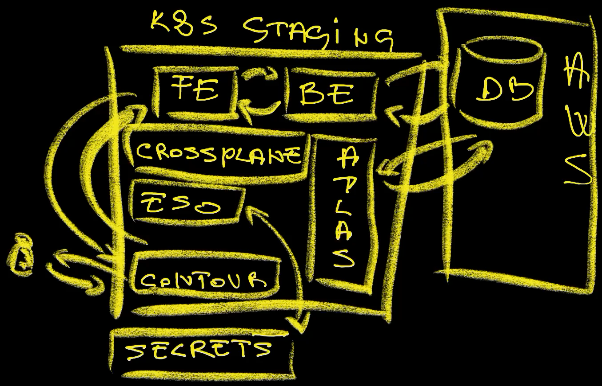
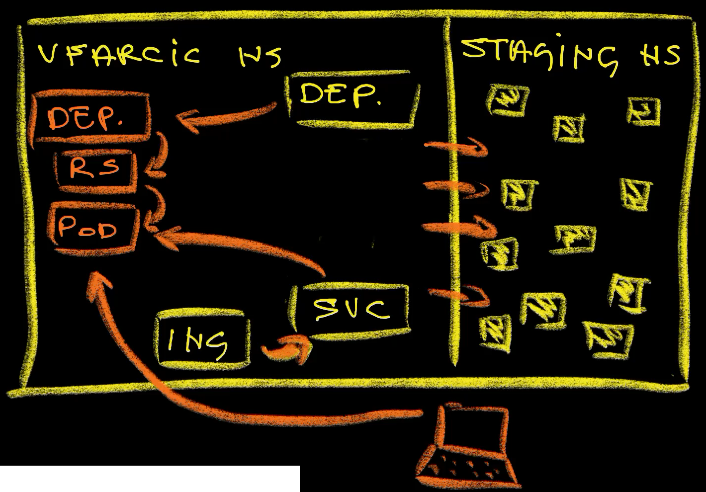

+++
title = 'Stop Using Docker and Local Kubernetes for Dev Environments! (feat. Okteto)'
date = 2024-04-07T16:00:00+00:00
draft = false
+++

You are developing something. Everybody is, no matter whether that something is a user-facing application, infrastructure, or anything else.

While developing, you are trying to set up a development environment, probably locally since that's where your code is. You are likely trying to do all that using Docker or a local Kubernetes cluster like KinD.

If that's what you're doing, I'm here to tell you that you're doing it wrong.

<!--more-->



**Docker is great**, but not for setting up a development environment. That's not what you're supposed to use it for. On the other hand, KinD, and other **local Kubernetes clusters are also great**, but they are too complicated and too time demanding for you to reproduce production locally. As a result, you are left without the option to reproduce production locally and you resort to workarounds that result in your development environment being very different from production, in case of Docker, or your local environment being a stripped-down version of production in case of local Kubernetes clusters. Both are bad options, especially since there are just as easy or even easier ways to get production-like development environments than what you might be doing.

I'm here to show you how you can write code locally while still running that code in a production-like environment so that you can see your application behave in almost the same way as it will behave in production.

By the end of this post, I will convince you to change the way you develop whatever you're developing, assuming that you are the right type of a developer. So, first we need to establish which type of a dev you are.

There are two types of developers.

Some base their carrer on hope. They have faith that what they develop works. They spend time writing code and pushing it to Git. That's all they do.

What's the worst thing that can happen? It might not work? It might crash production? Users might go somewhere else? If there is something wrong with your code you can always blame testers for not finding out how shitty the code you just wrote is. It is certainly not your fault. Your job is to write code, not to ensure that it works.

The second group of developers does more than just write code. That's the good group. Those are the people that are writing and running tests. Those are the people that are doing their best to ensure that the code they're writing meets certain standards. They are ensuring that the changes they are making are meeting the quality expectations. They don't wait for others to find out how bad their code is.

Which type of a developer are you? If you're in the first group, go away. There's nothing for you here. All you need is an IDE and a browser so that you can copy and paste the code from Stack Overflow.

Go away!

*You might be on the ops side of the equation thinking that all this is not your concern. If that's the case, bear with me because, as you'll see later, you might be just the person that can fix all this. You might be the person that converts bad developers into good ones.*

Are you still here? If you're still reading this post I can only assume that you belong or, at least want to belong to the second group. You are a developer that wants to ensure that your code will work in production and meet the expectations, and I have a question for you.

**How do we ensure that the code we are writing will work correctly when it reaches production?** One answer to that question can be testing in production-like environments. We write code, we push it to a Git repo, and we execute workflows that deploy that code to a production-like environment and run all sorts of tests, automated or manual, that validate it. That's a wrong answer. It's too late to wait until everything is finished to discover whether it works. If it doesn't, we need to go back and fix issues. That will happen sometimes and we certainly need to test releases before they reach production. Still, we should strive towards **detecting issues the moment they are created**. They are created on our laptops. The moment we write a line of code that does not work as we expect is the moment we created a problem and it's only logical that we detect it right away and fix it the moment later.

This whole pep talk might lead you to think that I am trying to convince you to adopt Test-Driven Development, or Extreme Programming, or Behavior-Driven Development, or something similar. That's not the case, at least not today. Right now, the only point I'm trying to make is that we should be running our application while we're developing it, and that we should test it continuously. Write a bit of code, deploy the app, test it, and, if there are no issues, repeat.

But that's a problem. How do we run the application while developing it? Do we simply execute *go run* or whatever is the command to run the application locally? Do we build it into a container image and run it with Docker?

Neither of those are good enough, because neither of those methods are how we run it in production. As a result, the way the application behaves locally might be very different from the way it will run in production. What works locally might not work in production or, if it works, it might behave very differently.

You see, applications today are **much more than just code** alone. There are servers with operating systems other than what we have on our laptops, there is networking, there is storage, there are databases and other applications we connect to, and so on and so forth. Production systems are complex and that complexity can greatly influence the behavior of applications.

What we need, while developing, is to run our application in the same or a similar way as it is running in production. There's a balance though. It does not have to be exactly the same as production. That might be too complicated, inefficient, and costly. Still, not being able or not wanting our development environment to be exactly the same as production does not mean that it should be completely different. So, let's say that we want it to be production-like.

**How do we make development environments similar to production?**

Let's take a look at a simple example. Let's say that we have a backend application used by a frontend app and connected to a database. We might need all three of those running. Further on, let's say that those two apps are running in Kubernetes while we're using a PostgreSQL database running as a service in a hyperscaler like AWS, Google, or Azure. The credentials for the database are in a secrets store and retrieved with External Secrets Operator. Database schema might be managed by the Atlas Operator. Both the applications and the database might be defined and managed through Crossplane Compositions. They might be accessible through Contour Ingress and internal communication might be going through a service mesh like Istio. There might be many other components that result in the "magical" experience our users are getting.

Now, you might be a developer who does not care about any of those things. That's fair. You want to write code and you want to see that code running and test it. I understand that, but I also assume that you want it running in a similar way it is running in production so that you can confirm that it behaves correctly. You want to develop something and to test it under similar conditions as if it's running in production. That's a reasonable request.

Here's the question.

**Can you set up all that locally?** You probably can't and even if you can, reproducting production locally might be too much effort. It takes days, weeks, or even months to set it all up in production so it would be silly to expect we do all that every morning before we start working on whatever we are supposed to be working. It would be unrealistic to expect everyone to start their work day by spinning a KinD cluster, installing Istio, Crossplane, Contour, External Secrets, and everything else, deploying all the dependent applications and database, and whatever else is needed just to run the application under development.

That's why developers love Docker. It's easy. There's almost nothing to do and almost nothing to learn. Still, if applications are not managed by Docker in production, our local environments will be very different than what is in production. That might not be such a bad thing if there is no other option, but there is.

We can develop remotely. Actually, it's not that we can, but that we probably should. Remote development solves many of the problems we might have during development, so that's what we'll explore today. We'll see how we can **write code locally** but **run our applications based on that code remotely** and have it connected to the rest of the system in the same way it is connected in production. We'll see how we can have a development environment that is very similar to production and, at the same time, very easy to setup. By the end of this post you'll be running your application in a development environment in almost the same way as if it's running **in production** while still being able to develop it as if you're working locally.

## Setup

```sh
git clone https://github.com/vfarcic/idp-full-demo

cd idp-full-demo

git pull

git fetch

git switch okteto

devbox shell
```

> Watch [How to Create Custom CLIs for Internal Developer Platforms with Nushell](https://youtu.be/TgQZz2kGysk) if you are not familiar with Nushell. Alternatively, you can inspect the `platform` script and transform the instructions in it to Bash or ZShell if you prefer not to use that Nushell script.

```sh
platform setup okteto

source .env
```

## Remote Development Environments

I have a repo with the code of an application on my laptop. It's a Go application, but that does not matter. Whatever I am going to show works with any type of application.

The application is simple. It is a backend application connected to a database. There is also a frontend that uses that backend. I'm not working on that one. Someone else is. Still, both need to work together. That frontend depeneds on my backend just as my backend depends on a PostgreSQL database.

In the real-world situation, the system would be much more complex. There would be many other applications, there might be a pub/sub queue for events, there might be dozens of other backend applications my app talks to, there might be many other things. Real systems are complex.

Nevertheless, three-tier application like the one I'm using today should be more than enough to demonstrate whatever I'm about to demonstrate. You just need to use a bit of imagination and multiply the issues I might be facing to see how you are in much deeper trouble than I am.

Here's the frontend app.

```sh
echo "http://staging.silly-demo-frontend.$INGRESS_HOST"
```

> Open the URL from the output of the previous command in a browser.

It's a simple one.



It is a frontend running in the staging environment. It sends requests to the backend which, in turn, reads and writes data to the database and responds back to the frontend. So far, that might be the simplest app you ever saw.

Let's see what I have in that cluster.

```sh
kubectl get namespaces
```

The output is as follows.

```
NAME                STATUS   AGE
atlas-operator      Active   18m
contour             Active   22m
crossplane-system   Active   20m
default             Active   29m
egulliksen          Active   17m
external-secrets    Active   18m
kube-node-lease     Active   29m
kube-public         Active   29m
kube-system         Active   29m
sfarcic             Active   17m
staging             Active   17m
vfarcic             Active   17m
```

TODO: Diagram: diag-01 (part 2) (put the output of the previous command on one side and the diagram to the other).

There is `atlas-operator` used to manage the schema of the database, `contour` Ingress which handles incomming external traffic, Crossplane Compositions (`crossplane-system`) which provides abstractions for the applications and the databases, and `external-secrets` that push and pull secrets to and from a secret store. The database itself is running in AWS and managed through Crossplane Compositions.

As I said before, this is a simple demo.

Your production will be more complex. Also, it does not matter whether you use the same tools as I do. You might be using CNPG to manage databases inside the cluster. You might prefer Vault operator for secrets. You might prefer NGINX Ingress and you might prefer something other than Atlas to manage database schemas. You might dislike Crossplane and prefer Terraform for managing infrastructure and Helm to define applications. That's okay. Today it does not matter whether you prefer the same tools as I do. What matters is that your production is complex and that your staging or pre-production environment is just as complex as well, as long as you want to have the parity between those.

Let's take a quick look at how I defined the backend application.

```sh
cat crossplane/app-staging-db.yaml
```

The output is as follows.

```yaml
apiVersion: devopstoolkit.live/v1alpha1
kind: AppClaim
metadata:
  name: silly-demo
spec:
  id: silly-demo
  compositionSelector:
    matchLabels:
      type: backend
      location: local
  parameters:
    image: ghcr.io/vfarcic/idp-full-demo
    tag: 0.0.7
    port: 8080
    host: staging.silly-demo.44.208.175.85.nip.io
    ingressClassName: contour
    db:
      secret: silly-demo-db
      storeName: aws
      name: main
```

It is a Custom Resource (`AppClaim`) based on a CRD that acts as an abstraction that removes all the complexity and focuses only on what matters to developers.

The `parameters` section should be mostly self-explanatory. We are defining the `image`, the `tag`, and the `port` of the application. There is also the `host` that will be managed by `contour` Ingress.

Since that application is connected to a database, we are specifying the name of the `secret` that contains the credentials to the DB. Since that database is defined elsewhere and the resource that made it might be in a different Namespace or even a different cluster, we are instructing the application to pull the secret with the credentials from the `aws` secrets store. The assumption is that whichever process is managing the database it also pushed a secret with the creds to that secrets store.

That's the application running in the staging environment which contains quite a few other things, dependencies, that are needed for that application to run. That's the application we'll be developing today.

Here's the question. Can you set it all up locally? I don't think you can and even if you dissagree with that statement, you should ask yourself whether doing everything that needs to be done is worth the time and effort. Even if the answer to that one is also "yes", you should ask yourself whether you can and should maintain all that locally and ensure that whatever changes are made to that staging environment are replicated locally. Can you really ensure the parity between what you have on your laptop and what is in the staging environment?

If I convinced you to answer with "no" to at least one of those questions, the next thing you should ask yourself is whether there is an alternative. The short answer is that there is. As a matter of fact, there are many, and most of them will lead you to the inevitable conclusion that you should develop remotely or that parts of what you're doing should be remote. Simply put, we should use what we already have in that cluster, so let's do just that.

## Remote Development (The Wrong Way)

The easiest way to solve the problem is to deploy the application we're developing to a Namespace inside the staging or the development or whatever you call the cluster that already has everything set up.

Here's the modified version of the manifest we saw earlier.

```sh
cat crossplane/app-dev-db.yaml
```

The output is as follows.

```yaml
apiVersion: devopstoolkit.live/v1alpha1
kind: AppClaim
metadata:
  name: silly-demo
spec:
  id: vfarcic-silly-demo
  compositionSelector:
    matchLabels:
      type: backend
      location: local
  parameters:
    image: ghcr.io/vfarcic/idp-full-demo
    tag: 0.0.5
    port: 8080
    host: vfarcic.silly-demo.35.231.186.105.nip.io
    ingressClassName: contour
    db:
      secret: silly-demo-db
      storeName: aws
      name: main
```

Since that manifest might be used by others, I might need to make a few changes to ensure that application does not clushes with those deployed by my teammates. Specifically, I might need to change the `id` to ensure that the cluster-scoped resources are unique and it has a unique `host` so that it is accessible through the URL that is different from the one used by others. Everything else can stay the same.

Another important note is that today I will be connecting the application I'm developing to the shared database so I'll pull the `silly-demo-db` credentials from the secrets store. Those credentials point to the staging database.

If my interaction with the database would be, in any form, destructive or interrupt others working with that shared database, I would need to spin up my own database. Since all the tools are already running in that cluster, such an operation should be trivial since all I'd have to do is take the database manifest, make a few modifications, and apply it to my Namespace.

Let's make the changes I mentioned earlier by changing the `spec.id`...

```sh
yq --inplace ".spec.id = \"vfarcic-silly-demo\"" \
    crossplane/app-dev-db.yaml
```

...and the `spec.parameters.host` values.

```sh
yq --inplace \
    ".spec.parameters.host = \"vfarcic.silly-demo.$INGRESS_HOST\"" \
    crossplane/app-dev-db.yaml
```

I might need to change the *image* and the *tag* as well to ensure that my version of the code is running, but I'll skip that for now.

All that's left is to apply that manifest,...

```sh
kubectl --namespace vfarcic apply \
    --filename crossplane/app-dev-db.yaml
```

...and the application is now running in my own Namespace.

*As a side note, you can do the same through Helm, Kustomize, or whichever way you prefer to define and deploy applications. You don't have to use Crossplane Claims as I do. I'm not trying to convince you to use Crossplane today. I'm using it only because that's the way I prefer to define applications, infrastructure, and everything else. If you're interested in Crossplane, but not yet using it, feel free to check out the [Crossplane Tutorial](https://www.youtube.com/playlist?list=PLyicRj904Z99i8U5JaNW5X3AyBvfQz-16). If you do, wait until you're finished reading this post since it does not require any experience with Crossplane.*

Let's see what we got.

```sh
kubectl --namespace vfarcic \
    get all,ingresses,externalsecrets,secrets
```

The output is as follows (truncated for brevity).

```
NAME                            READY STATUS  RESTARTS AGE
pod/silly-demo-85f4655886-p9qvs  1/1  Running 0        6s

NAME               TYPE      CLUSTER-IP    EXTERNAL-IP PORT(S)  AGE
service/silly-demo ClusterIP 10.100.110.85 <none>      8080/TCP 6s

NAME                       READY UP-TO-DATE AVAILABLE AGE
deployment.apps/silly-demo 1/1   1          1         6s

NAME                                  DESIRED CURRENT READY AGE
replicaset.apps/silly-demo-85f4655886 1       1       0     6s

NAME                  CLASS   HOSTS      ADDRESS     PORTS AGE
ingress.../silly-demo contour vfarcic...  a45280f... 80    6s

NAME                            STORETYPE          STORE REFRESH INTERVAL STATUS       READY
externalsecret.../silly-demo-db ClusterSecretStore aws   1h               SecretSynced True

NAME                   TYPE     DATA   AGE
secret/silly-demo-db   Opaque   5      6s
```

That's the result. That Custom Resource created a bunch of Kubernetes resources needed to run an application. The interesting part is the `externalsecret` which was configured to pull database credentials from the secrets manager and store it as a Kubernetes `secret`.

My application is now running in my Namespace. Instead of using an app deployed with the intention to be used by anyone, this one is mine.

I can now send a request to my app.

```sh
curl "http://vfarcic.silly-demo.$INGRESS_HOST"
```

```
This is a silly demo
```

Since it is connected to the shared database, I can, for example, send a few `POST` requests that will insert some data to the database.

```sh
curl -XPOST \
    "http://vfarcic.silly-demo.$INGRESS_HOST/video?id=z7Nfl-u-hLI&title=Neon"

curl -XPOST \
    "http://vfarcic.silly-demo.$INGRESS_HOST/video?id=WAm3ypS0_wg&title=IDP%20History"
```

There are a couple of problems.

My application is using a shared database. That is not always a bad thing though. However, I need to be careful not to mess up the data in it since others might be using the same database. More importantly, I need to be extra careful when making changes to the schema. A better solution would be for me to create my own database, apply a schema, and copy the data I might need. That, however, might be costly both from the time investment and resource utilization perspectives.

The alternative could be to use ephemeral databases like, for example, [Neon](https://youtu.be/z7Nfl-u-hLI). We won't go into it in this post. I already made one and I don't want to repeat myself. Check it out.

We have a much bigger problem though.

How do we keep the app running in my personal Namespace **up-to-date with the code** I'm writing on my laptop?

I certainly do not want to build an image, push it to the registry, and update and apply the manifest every time I make a change to the code. That process is tedious and, more importantly, can take minutes.

I want something much more agile. I want **every single change to my code to be reflected in that application**. Even if I make a change to a single line of code, I want that change to be deployed. It should not matter whether I spent a few seconds or minutes on writing code, the moment I save changes, I want them to be included in the application running in that cluster.

However, I cannot always get what I want. There are days when my desires are unrealistic. Today is not one of those days.

## Remote Development (The Right Way with Okteto)

Let's do a personality change. I am not Viktor any more. Now I am Eva. Unlike Viktor, she knows what she's doing, so let's see how would she approach the problem.

She clones the repo Viktor was working on and takes a look at the application manifest.

```sh
cat crossplane/app-dev-db.yaml
```

The output is as follows.

```yaml
apiVersion: devopstoolkit.live/v1alpha1
kind: AppClaim
metadata:
  name: silly-demo
spec:
  id: vfarcic-silly-demo
  compositionSelector:
    matchLabels:
      type: backend
      location: local
  parameters:
    image: ghcr.io/vfarcic/idp-full-demo
    tag: 0.0.5
    port: 8080
    host: vfarcic.silly-demo.44.208.175.85.nip.io
    ingressClassName: contour
    db:
      secret: silly-demo-db
      storeName: aws
      name: main
```

She makes similar changes to those Viktor made, by changing the `id`...

```sh
yq --inplace ".spec.id = \"egulliksen-silly-demo\"" \
    crossplane/app-dev-db.yaml
```

...and the `host`.

```sh
yq --inplace \
    ".spec.parameters.host = \"egulliksen.silly-demo.$INGRESS_HOST\"" \
    crossplane/app-dev-db.yaml
```

Finally, she applies the manifest into her own personal Namespace.

```sh
kubectl --namespace egulliksen apply \
    --filename crossplane/app-dev-db.yaml
```

So far, Eva hasn't done anything differently from Viktor.

This is the part where she faces the problem. If she sends a request to her app running in her Namespace in the shared cluster,...

```sh
curl "http://egulliksen.silly-demo.$INGRESS_HOST"
```

...she gets the old output `This is a silly demo`.

She needs that application to reflect the changes she made to the code and, unlike Viktor, she knows what to do. She knows that there is `okteto.yaml` file in the repo.

```sh
cat okteto.yaml
```

The output is as follows.

```yaml
dev:
  silly-demo:
    image: okteto/golang:1
    command: air go run .
    sync:
      - .:/usr/src/app
    volumes:
      - /go
      - /root/.cache
    securityContext:
      capabilities:
        add:
          - SYS_PTRACE
    forward:
      - 8080:8080
```

That is Okteto manifest that specifies that the project needs Go `image` and that `air go run .` should be executed. That is the same command one would execute to run that application locally with the addition of `air` that is a handy utility that will re-run the `go run .` command every time the source code changes. As a result, every time we save changes to the code, the application will be reloaded.

The important note is that the command is not special to Okteto. We would run it the same way if we'd like to run the app locally.

Further on there is the `sync` instruction that will ensure that any file in the current local directory (`.`) is synchronized into the `/usr/src/app` directory inside a container.

I'll skip the explanation of the rest of that manifest since it's probably self-explanatory and, if it's not, you can check the Okteto documentation.

Now, to be clear, we could have used Okteto to get rid of the previous instructions but we'd need to get the commercial version to do that. Today we are sticking with Okteto open source so you can think of the previous steps as a workaround to avoid opening wallets. That is not to say that you should not purchase Okteto license but, rather, that today we are focusing only on open source.

Let's see it in action.

First, we'll tell `okteto` which `context` to use so that it knows which cluster to talk to.

```sh
okteto context
```

Next, we'll execute `okteto up` and ensure that whatever it's doing is done in Eva's Namespace (`egulliksen`).

```sh
okteto up --namespace egulliksen
```

The output is as follows.

```
 i  Using egulliksen @ iam-root-account@dot.us-east-1.eksctl.io as context
 ✓  Persistent volume successfully attached
 ✓  Images successfully pulled
 ✓  Files synchronized
    Context:   iam-root-account@dot.us-east-1.eksctl.io
    Namespace: egulliksen
    Name:      silly-demo
    Forward:   8080 -> 8080


  __    _   ___
 / /\  | | | |_)
/_/--\ |_| |_| \_ 1.61.5, built with Go 1.23.4

watching .
watching argocd
!exclude backstage
watching charts
watching charts/backstage
watching charts/backstage/templates
watching crossplane
watching frontend
watching gcloud
watching idp-full-app
watching idp-full-app/apps
watching internal
watching internal/handlers
watching kubernetes
watching scripts
!exclude tmp
!exclude vendor
building...
running...
2025/03/08 01:24:12 Starting server...
[GIN-debug] [WARNING] Running in "debug" mode. Switch to "release" mode in production.
 - using env:   export GIN_MODE=release
 - using code:  gin.SetMode(gin.ReleaseMode)

[GIN-debug] GET  /       --> main.rootHandler (2 handlers)
[GIN-debug] POST /video  --> silly-demo/internal/handlers.VideoPostHandler (2 handlers)
[GIN-debug] GET  /videos --> silly-demo/internal/handlers.VideosGetHandler (2 handlers)
```

The first time we run Okteto, it might take a while until the dev environment is set up. The main culprit is Go image which is on the large size of the spectrum.

We'll let it run and open a second terminal session.

> Open a new terminal session in the same directory.

This project uses Devbox to deploy all the tools we might need for the project when running locally, so let's start a `shell`.

*If you are not familiar with Devbox, please watch [Nix for Everyone: Unleash Devbox for Simplified Development](https://youtu.be/WiFLtcBvGMU).*

> Execute the commands that follow in the second (the new) terminal session.

```sh
devbox shell
```

We'll also `source` environment variables used in the project.

```sh
source .env
```

Next, Eva would start working on the code. She is eager to change the output `This is a silly demo` in the `root.go` file, so that's what she does.

> Edit the message `This is a silly demo` in `root.go`.

Now comes the moment of truth.

Let's send the same request to the app again.

```sh
curl "http://egulliksen.silly-demo.$INGRESS_HOST"
```

The output is as follows.

```
This is a silly demo by Eva
```

This time, the response of the request sent to the application running inside the cluster reflects the changes done locally. That's the magic behind Okteto and other similar tools.

We'll take a closer look at how it works and what it does. But, before we do that, let's make one more change to the source code.

> Edit the message in `root.go` again.

> Execute the command that follows in the second terminal session.

...and send another request to the app.

```sh
curl "http://egulliksen.silly-demo.$INGRESS_HOST"
```

The ouput is as follows.

```
This is a silly demo by Eva!!!
```

Boom! We got the response that reflects the current version of the code located on a laptop even though the application is running in a remote cluster.

Let's stop Okteto before we take a look at what happened.

> From here on, execute the commands in the first terminal session unless specified otherwise.

> Press `ctrl+c` to stop the watcher.

Here are all the resources in the `egulliksen` Namespace.

```sh
kubectl --namespace egulliksen get all,ingresses
```

The output is as follows (truncated for brevity).

```
NAME                                    READY STATUS  RESTARTS AGE
pod/silly-demo-okteto-7d56dfc856-mdzmv  1/1   Running 0        5m12s

NAME               TYPE      CLUSTER-IP     EXTERNAL-IP PORT(S)  AGE
service/silly-demo ClusterIP 10.100.237.232 <none>      8080/TCP 9m4s

NAME                              READY UP-TO-DATE AVAILABLE AGE
deployment.apps/silly-demo        0/0   0          0         9m3s
deployment.apps/silly-demo-okteto 1/1   1          1         5m12s
...
```

We can see that there is a new `deployment` `silly-demo-okteto`.

When we executed *okteto up*, a few things happen, among all those three being very important.



First, Okteto made a copy of the Deployment of the application (`deployment.apps/silly-demo-okteto`), modified it, and scaled down the original one (`deployment.apps/silly-demo`) to zero replicas (`0/0`). So, from that moment on, the original app was replaced with a variation that has two important modifications. The Service is now sending requests to the pods of the new Deployment and ingress, through that Service enables external access. Whatever else we might have had is still there. Functionally, everything is the same except that a new Deployment replaced the old one and that there a few surgical changes are made to the copy of the original Deployment.

First, in our case, it changed the image to the one based on Go. The original image is a slim one that could only run the app of the binary. It does not have Go, or Air, or any of the tools we might need, and that's a good thing. We want to have slim images instead of fat ones full of "stuff" that is not needed in production. We want production to be lean and secure.

However, when developing we need more. We need to be able to build binaries, to do hot-reloading, and whatever else is needed, at least when running code that is not even compiled. The original image does not even have Shell.

All in all, Okteto replaced our slim production-ready image with the one that has what is needed to build and run source code.

Second, it changed the command itself. While, in this case, all we need in production is to execute the precompiled binary, in development it executed *air* command that builds and runs the app from the source code whenever that source code changes.

Finally, it added synchronization from the local disk into the containers in the Pods. That way, whatever is on our laptop is synced into that cluster so the source code is the same in both places. Whichever change is done locally gets into that container.

Besides those and a few other changes, everything else is the same. The Service that enables in-cluster communication is still there. Ingress is still redirecting external traffic to the app. The secret with database credentials is still mounted. Whatever else we might be using is the same. As a result, that app is part of the system just as it would a part of the system in the staging environment. The resources of the app itself are all the same, except that the binary of the app is now always compiled and running using the source code we're working on.

So, it is not exactly the same as production. It is production-like. It contains only the changes needed to develop the app, while everything else is the same and the new app still talks to the rest of the system in the staging environment as if nothing happened.

Once we're finished developing, all we have to do is to instruct `okteto` to bring it `down`.

```sh
okteto down --namespace egulliksen
```

Let's take another look at the resources in the `egulliksen` Namespace.

```sh
kubectl --namespace egulliksen get all
```

The output is as follows.

```
NAME                            READY STATUS  RESTARTS AGE
pod/silly-demo-85f4655886-lkldb 1/1   Running 0        23s

NAME               TYPE      CLUSTER-IP     EXTERNAL-IP PORT(S)  AGE
service/silly-demo ClusterIP 10.100.237.232 <none>      8080/TCP 10m

NAME                       READY UP-TO-DATE AVAILABLE AGE
deployment.apps/silly-demo 1/1   1          1         10m

NAME                                  DESIRED CURRENT READY AGE
replicaset.apps/silly-demo-676b9f885b 0       0       0     6m46s
replicaset.apps/silly-demo-85f4655886 1       1       1     10m
```

As we can see, the Okteto variation of the Deployment is now gone and the original Deployment (`deployment.apps/silly-demo`) is scaled back up (`1/1`). We're back to where we were as if nothing happened.

Once we are done done, we should probably `delete` the application itself so that we do not waste resources for no good reason.

```sh
kubectl --namespace egulliksen delete \
    --filename crossplane/app-dev.yaml
```

It would be even better if we defined the application to scale to zero replicas when not in use. If we did that, there would even be the need to delete the app once we're finished working on whatever we were working on. Nevertheless, that would be the subject for another post. Let me know in the comments if you're interested in seeing something like that.

Wasn't that easy and efficient?

We had to make a few modifications to the app manifest, apply it, and then run Okteto. I think that was easy, but I think we can make it even easier. We can wrap all that into a script.

## Wrapping It All Up

Let's go back from Eva to Viktor. He just saw what Eva was doing and decided to improve it even more. He wrapped all of the commands Eva executed into a Nushell script.

*If you are not familiar with Nushell, please watch [How to Create Custom CLIs for Internal Developer Platforms with Nushell](https://youtu.be/TgQZz2kGysk).*

I won't go into the details why Nushell is a good choice nor what's inside the script we're about to execute, mainly because I already explored Nushell and do not want to repeat myself. Instead, we'll just run it to see the effect.

We'll `apply` a `dev` environment for the user `vfarcic` and, in this case, tell it that we want it to be connected to the database `silly-demo-db`.

```sh
platform apply dev vfarcic --db silly-demo-db
```

The output is as follows.

```
appclaim.devopstoolkit.live/silly-demo unchanged
deployment.apps/silly-demo condition met
 ✓  Option 'iam-root-account@dot.us-east-1.eksctl.io' selected
 ✓  Using default @ iam-root-account@dot.us-east-1.eksctl.io

The application will be accessible through http://vfarcic.silly-demo.44.208.175.85.nip.io.

 i  Using vfarcic @ iam-root-account@dot.us-east-1.eksctl.io as context
 ✓  Persistent volume successfully attached
 ✓  Images successfully pulled
 ✓  Files synchronized
    Context:   iam-root-account@dot.us-east-1.eksctl.io
    Namespace: vfarcic
    Name:      silly-demo
    Forward:   8080 -> 8080


  __    _   ___
 / /\  | | | |_)
/_/--\ |_| |_| \_ 1.61.5, built with Go 1.23.4

watching .
watching argocd
!exclude backstage
watching charts
watching charts/backstage
watching charts/backstage/templates
watching crossplane
watching frontend
watching gcloud
watching idp-full-app
watching idp-full-app/apps
watching internal
watching internal/handlers
watching kubernetes
watching scripts
!exclude tmp
!exclude vendor
building...
running...
2025/03/08 01:32:34 Starting server...
[GIN-debug] [WARNING] Running in "debug" mode. Switch to "release" mode in production.
 - using env:   export GIN_MODE=release
 - using code:  gin.SetMode(gin.ReleaseMode)

[GIN-debug] GET  /       --> main.rootHandler (2 handlers)
[GIN-debug] POST /video  --> silly-demo/internal/handlers.VideoPostHandler (2 handlers)
[GIN-debug] GET  /videos --> silly-demo/internal/handlers.VideosGetHandler (2 handlers)
```

That's it. That's all that needed to be done to have a fully operational remote production-like development environment that runs the app that is always based on the latest code on Viktor's laptop.

Let's say that Eva pushed her changes to the repo and that Viktor pulled them into his clone of the repo. What happens when he sends a request to the app?

> Execute the command that follows in the second terminal session.

```sh
curl "http://vfarcic.silly-demo.$INGRESS_HOST"
```

The output is as follows.

```
This is a silly demo by Eva!!!
```

Judging by the response, we can see that his version of the application contains the changes Eva made.

Now, let's say that he is not happy with Eva leaving her mark in the application and removes her changes.

> Undo the previously made changes to `root.go`.

What happens when he sends a request to his version of the app?

> Execute the command that follows in the second terminal session.

```sh
curl "http://vfarcic.silly-demo.$INGRESS_HOST"
```

The output is as follows.

```
This is a silly demo
```

There we go. The message is `this is a silly demo` again. Both of them can work independently from each other, both have an easy setup, and both are seeing the results of the work in a production-like development environment.

The last part is important, and we can prove it by, for example, sending a request to the app to retrieve data from the database.

> Execute the command that follows in the second terminal session.

```sh
curl "http://vfarcic.silly-demo.$INGRESS_HOST/videos" | jq .
```

The output is as follows.

```json
[
  {
    "id": "z7Nfl-u-hLI",
    "title": "Neon"
  },
  {
    "id": "WAm3ypS0_wg",
    "title": "IDP History"
  }
]
```

We can see, from the output, that this particular instance of the app not only contains the current version of the code on Viktor's laptop, but also that is connected to everything else in the cluster, including the database.

> Press `ctrl+c` to stop the watcher.

Finally, we can improve removal of the dev environment just as we improved the creation by wrapping it all up into a script so that one can execute `platform uninstall dev` environment for the user `vfarcic`.

```sh
platform uninstall dev vfarcic
```

That's it for the demo. Let's jump into pros and cons.

## Remote Development Environments Pros and Cons

Okteto was not the focus of this post. It was something else.

First of all, I wanted to demonstrate the benefits of remote development environments and what I believe is needed to make them useful. We already saw in the [Remote Environments with Dev Containers and Devpod: Are They Worth It?](https://youtu.be/T_y3NTDrMHU) video a different way to create environments with Development Containers and Devpod. Those are not something I recommend because they fail to deliver environments that mimic production. Those are focused on giving us, more or less, the same experience when working remotely as when working locally. I need more than that. I do not want to spend time wondering why the application that worked perfectly in my development environment failed when it was deployed to production. I want my development environments to be as close to production as possible while, at the same time, giving me all the benefits of working locally.

I feel that the solution we just explored gives us both. It is production-like while, at the same time, it ensures that we can write code locally and any changes we make on a laptop are reflected in the remote environment. It's brilliant. I love it, but I do have one complaint.

**Cons:**
* More expensive

This solution is more expensive than local development. It results in the increase of CPU and memory consumption in remote clusters. That application Viktor and Eva run was using CPU, memory, and other resources while it was running.

Now, to be fair, that did not cost much. One could even claim that the price was negligible since we did not have to create a development environment with the full system but only with the app we're working on. The database was shared, the frontend was shared, and everything else was shared. So, there is an increase in costs, but not a big one.

Everything else is positive.

**Pros:**
* Simple
* Fast
* Production-like
* Always in sync

It was **simple**, it was **fast**, it is **production-like**, and it always contains the code we're working on locally (**always in sync**).

That being said, there are a few issues we did not solve. That is not to say that they are cons. The only negative thing I can think of is the cost. I see the issues I am about to discuss as issues that would equally affect local as remote development so they are not cons. They are only issues we did not resolve in this video.

Using a shared database is sometimes a good thing, but in others is a very bad practice. If we performed some destructive operation or altered the schema or did anything else that would prevent others working with the database, we would be in big trouble. That can be solved by spinning up separate database instances, but that would only increase the cost and, at the same time, increase setup complexity related to data replication since, more often than not, an empty database is not what we need. We could also use ephemeral databases and data branching solution like [Neon](https://youtu.be/z7Nfl-u-hLI) but that one is a SaaS-only solution and some organizations might have issues trusting third-parties with their data.

The same can be said for pub/sub or any other similar third-party solution that we might be running in our clusters and that deal with data.

Another, potentially bigger issue are dependencies that lead into our app. It's fairly easy to configure our app to talk to other apps. We just need to change the addresses it point to, typically by adding Namespace suffix. But, if some other app needs to talk to us, that is a problem. Here's an example.

Imagine that we are working on a backend application and that there is a frontend that talks to that backend. We cannot reconfigure that frontend to talk only our backend since that would mean that anyone else working with that frotend will start getting responses from our backend. We might not want to run that same frontend in our dedicated Namespace since that would increase the cost and complexity.

The solution to that problem is very different than what Okteto does, at least the open source version, and is related to networking. Now, I know that when I say networking most of the people watching this channel get bored, annoyed, and move somewhere else. Still, I feel that would be a very interesting subject to explore. What do you think? Should I dive into it in one of the upcoming videos? Let me know in the comments.

## Destroy

```sh
platform destroy okteto --provider $PROVIDER

git stash

git switch main

exit
```

