+++
title = 'Top 10 GitHub Project Setup Tricks You MUST Use in 2025!'
date = 2025-11-24T15:00:00+00:00
draft = false
+++

Have you ever seen a GitHub issue that just said "it's broken" with zero context? Or reviewed a pull request where you had no idea what changed or why? How many hours have you wasted chasing down information that should have been provided upfront?

Here's the reality: whether you're maintaining an open source project, building internal tools, or managing commercial software, you face the same problem. People file vague bug reports. Contributors submit PRs without explaining their changes. Dependencies fall months behind. Security issues pile up. And you're stuck playing detective instead of building features.

But here's what most people don't realize: all of this chaos is preventable. GitHub has built-in tools for issue templates, pull request templates, automated workflows, and community governance. The problem is that setting all of this up manually takes hours, and most people either don't know these tools exist or don't bother configuring them properly.

<!--more-->



Today, I'm going to show you how to transform a chaotic repository into a well-organized project with clear processes, automated workflows, and proper documentation. We'll cover issue templates that force people to provide useful information, PR templates that make code review actually possible, automated dependency updates, security scanning, and all the governance files that make collaboration smooth.

By the end of this post, you'll know exactly how to set up a professional repository that saves you hours of frustration. And I'll show you how to automate the entire setup process in minutes using the DevOps AI Toolkit instead of spending hours doing it manually.

Let's start with the most frustrating problem: terrible bug reports and feature requests.

## Setup

> This demo is using Claude Code as the coding agent. With a few modification, it should work with any other coding agent like Cursor, GitHub Copilot, etc.

> Install [NodeJS](https://nodejs.org/en/download) if you don't have it already.

```sh
npm install -g @anthropic-ai/claude-code

git clone https://github.com/vfarcic/dot-ai

cd dot-ai

git pull
```

> Make sure that Docker is up-and-running. We'll use it to run DevOps AI Toolkit MCP.

> Watch [Nix for Everyone: Unleash Devbox for Simplified Development](https://youtu.be/WiFLtcBvGMU) if you are not familiar with Devbox. Alternatively, you can skip Devbox and install all the tools listed in `devbox.json` yourself.

```sh
devbox shell

export DOT_AI_IMAGE=ghcr.io/vfarcic/dot-ai:0.120.0
```

## GitHub Issue Templates

How often did you get mad because someone reported a bug or requested a feature without explaining what the hell it is all about? How often do people open issues thinking that you can read tea leaves? Whether it's open source, internal company projects, or commercial products, we all face the same frustration: vague "it doesn't work" reports that waste everyone's time. GitHub issue templates solve this by guiding people through structured forms, ensuring you get the information you actually need. Let's see how this works in practice.

Here's the problem: I cannot yell at people for not providing information, filing invalid issues, and doing other things that make me go insane if I do not provide means for them to get informed. So, the first thing they need is an easy way to find information. They need to be able to quickly check whether we already discussed the feature they'd like to propose and engage in a conversation. I need them to be able to check the docs in case something is already documented, to see the process for requesting support, and to see what to do in case they believe there is a security issue.

Let me show you what this looks like in my DevOps AI Toolkit repository. I'm opening the issues page and clicking the `New issue` button.

> Open https://github.com/vfarcic/dot-ai/issues and click the `New issue` button.

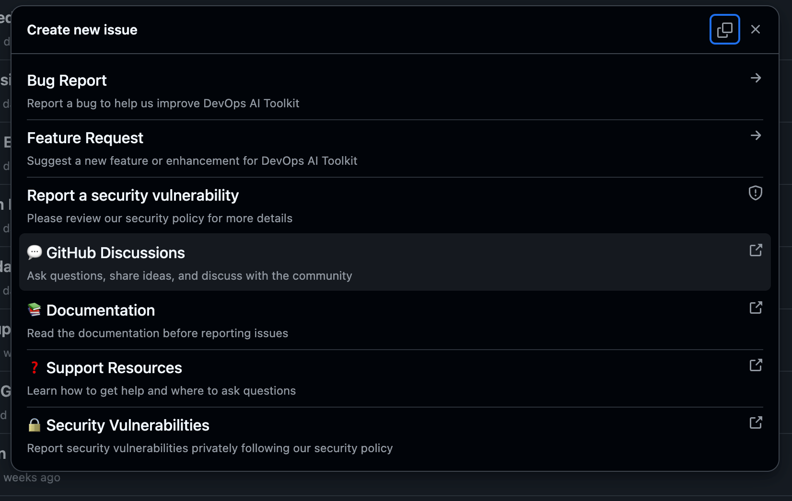

Notice what appears: instead of just a blank issue form, I get a menu with multiple options. There are links to GitHub Discussions for questions, Documentation, Support Resources, and Security Vulnerabilities reporting. This is exactly what I was talking about: guiding people to the right place before they even start typing.

All we have to do is add a `config.yml` to `.github/ISSUE_TEMPLATE` with the links.

```sh
cat .github/ISSUE_TEMPLATE/config.yml
```

```yaml
blank_issues_enabled: no
contact_links:
  - name: 💬 GitHub Discussions
    url: https://github.com/vfarcic/dot-ai/discussions
    about: Ask questions, share ideas, and discuss with the community
  - name: 📚 Documentation
    url: https://github.com/vfarcic/dot-ai#readme
    about: Read the documentation before reporting issues
  - name: ❓ Support Resources
    url: https://github.com/vfarcic/dot-ai/blob/main/SUPPORT.md
    about: Learn how to get help and where to ask questions
  - name: 🔒 Security Vulnerabilities
    url: https://github.com/vfarcic/dot-ai/blob/main/SECURITY.md
    about: Report security vulnerabilities privately following our security policy
```

The key part here is `blank_issues_enabled: no`, which disables the default blank issue form. Then we define `contact_links` that point people to the right resources: Discussions for questions, Documentation for existing info, Support Resources for help, and a private channel for Security Vulnerabilities. This reduces noise in the issues and guides people to appropriate channels before they even consider filing an issue.

Now, let's say someone actually needs to report a bug. Instead of one big description field that would leave someone wondering what the hell to report, we can guide them through specific fields: a description, steps to reproduce, expected versus actual behavior, environment details, and so on. We create a form with all those fields, mark which ones are mandatory, provide short explanations for each, and include helpful guidance before they start filling it out.

Back in the menu, I'm clicking on `Bug Report`.

> Open https://github.com/vfarcic/dot-ai/issues, click the `New issue` button, and select `Bug Report`.

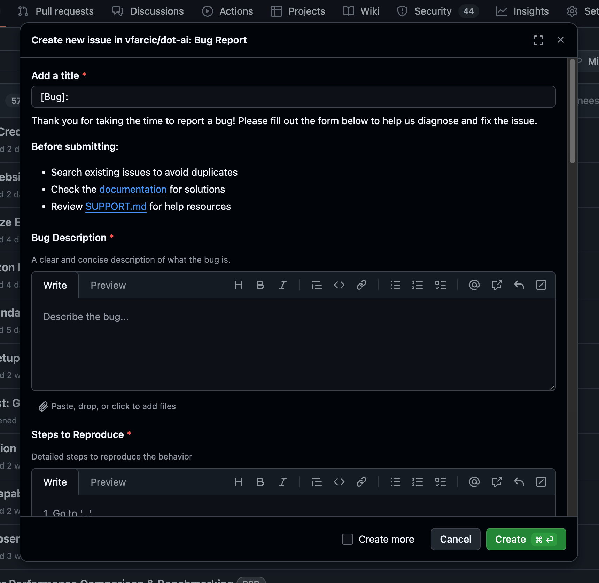

This is what a structured bug report form looks like. Notice the "Before submitting" checklist at the top guiding people to search existing issues and check documentation first. Then there are specific fields with clear labels and placeholders.

Here's how it's configured:

```sh
cat .github/ISSUE_TEMPLATE/bug_report.yml
```

```yaml
name: Bug Report
description: Report a bug to help us improve DevOps AI Toolkit
title: "[Bug]: "
labels: ["bug", "needs-triage"]
body:
  - type: markdown
    attributes:
      value: |
        Thank you for taking the time to report a bug! Please fill out the form below to help us diagnose and fix the issue.

        **Before submitting:**
        - Search existing issues to avoid duplicates
        - Check the [documentation](https://github.com/vfarcic/dot-ai#readme) for solutions
        - Review [SUPPORT.md](https://github.com/vfarcic/dot-ai/blob/main/SUPPORT.md) for help resources

  - type: textarea
    id: description
    attributes:
      label: Bug Description
      description: A clear and concise description of what the bug is.
      placeholder: Describe the bug...
    validations:
      required: true

  - type: textarea
    id: steps-to-reproduce
    attributes:
      label: Steps to Reproduce
      description: Detailed steps to reproduce the behavior
      placeholder: |
        1. Go to '...'
        2. Run command '...'
        3. See error
    validations:
      required: true

  - type: textarea
    id: expected-behavior
    attributes:
      label: Expected Behavior
      description: What you expected to happen
      placeholder: Describe what you expected...
    validations:
      required: true

  - type: textarea
    id: actual-behavior
    attributes:
      label: Actual Behavior
      description: What actually happened
      placeholder: Describe what actually happened...
    validations:
      required: true

  - type: markdown
    attributes:
      value: "## Environment"

  - type: input
    id: version
    attributes:
      label: "DevOps AI Toolkit Version"
      description: "What version are you running?"
      placeholder: "e.g., v1.2.3 or commit SHA"
    validations:
      required: true

  - type: input
    id: os
    attributes:
      label: Operating System
      description: "What OS are you using?"
      placeholder: "e.g., Ubuntu 22.04, macOS 13.5, Windows 11"
    validations:
      required: true

  - type: input
    id: node-version
    attributes:
      label: Node.js Version
      description: "Output of `node --version`"
      placeholder: "e.g., v18.17.0"
    validations:
      required: true

  - type: input
    id: npm-version
    attributes:
      label: npm/yarn Version
      description: "Output of `npm --version` or `yarn --version`"
      placeholder: "e.g., 9.6.7"

  - type: input
    id: kubernetes-version
    attributes:
      label: Kubernetes Version
      description: "Output of `kubectl version --short`"
      placeholder: "e.g., v1.27.3"
    validations:
      required: true

  - type: input
    id: cloud-provider
    attributes:
      label: Cloud Provider / Platform
      description: "Where is Kubernetes running?"
      placeholder: "e.g., AWS EKS, Google GKE, Azure AKS, self-hosted, minikube, kind"

  - type: textarea
    id: logs
    attributes:
      label: Relevant Logs
      description: "Paste any relevant log output here"
      placeholder: |
        Paste logs here...
      render: shell
    validations:
      required: false

  - type: textarea
    id: additional-context
    attributes:
      label: Additional Context
      description: "Add any other context about the problem here (screenshots, configuration files, etc.)"
      placeholder: |
        Any additional information...
    validations:
      required: false

  - type: checkboxes
    id: checklist
    attributes:
      label: Checklist
      options:
        - label: I have searched existing issues to ensure this bug hasn't been reported before
          required: true
        - label: I have included all relevant information above
          required: true
```

The template defines the form structure with `textarea` fields for descriptions, `input` fields for version numbers and environment details, and `validations` marking which are `required: true`. Each field has a clear label, description, and placeholder showing exactly what we need.

Feature requests follow the same pattern, but need different information. So when someone clicks on `Feature Request`...

> Open https://github.com/vfarcic/dot-ai/issues, click the `New issue` button, and select `Feature Request`.


...they get a form focused on understanding the problem, not just collecting a wish list. Notice the prominent note: "Nice to have is not a strong use case. Please explain the specific problem this feature would solve." That's intentional. We want people to think about the problem they're trying to solve, not just ask for random features.

Here's how it's configured:

```sh
cat .github/ISSUE_TEMPLATE/feature_request.yml
```

```yaml
name: Feature Request
description: Suggest a new feature or enhancement for DevOps AI Toolkit
title: "[Feature]: "
labels: ["enhancement", "needs-triage"]
body:
  - type: markdown
    attributes:
      value: |
        Thank you for suggesting a new feature! Please describe the problem you're trying to solve and your proposed solution.

        **Before submitting:**
        - Search existing issues and feature requests to avoid duplicates
        - Review the [project roadmap](https://github.com/vfarcic/dot-ai/blob/main/docs/ROADMAP.md) to see if this is already planned
        - Consider starting a [discussion](https://github.com/vfarcic/dot-ai/discussions) first to gather feedback

        **Note:** "Nice to have" is not a strong use case. Please explain the specific problem this feature would solve.

  - type: textarea
    id: problem-statement
    attributes:
      label: Problem Statement
      description: What problem are you trying to solve? Why is it important?
      placeholder: |
        Describe the problem you're experiencing or the gap you've identified.
        Focus on the problem, not the solution.
    validations:
      required: true

  - type: checkboxes
    id: who-is-affected
    attributes:
      label: Who is affected by this problem?
      description: Help us understand the impact and audience
      options:
        - label: End users
        - label: Developers/contributors
        - label: Platform engineers/operators
        - label: Documentation users
        - label: Other (please describe below)

  - type: textarea
    id: proposed-solution
    attributes:
      label: Proposed Solution
      description: Describe the solution you'd like to see
      placeholder: |
        How would this feature work? What would the user experience be?
        Be as specific as possible.
    validations:
      required: true

  - type: textarea
    id: alternatives
    attributes:
      label: Alternatives Considered
      description: What other approaches have you considered or tried?
      placeholder: |
        - Current workarounds you're using
        - Other tools or features that solve similar problems
        - Why those alternatives don't fully address the need
    validations:
      required: false

  - type: textarea
    id: use-cases
    attributes:
      label: Use Cases
      description: Describe 1-3 specific scenarios where this feature would be valuable
      placeholder: |
        **Use Case 1:** [Describe a specific scenario]
        **Use Case 2:** [Describe another scenario]
      value: |
        **Use Case 1:**

        **Use Case 2:**
    validations:
      required: true

  - type: textarea
    id: additional-context
    attributes:
      label: Additional Context
      description: Add any other context, screenshots, mockups, or examples
      placeholder: |
        - Links to relevant documentation
        - Screenshots or mockups
        - Examples from other projects
        - Performance or scalability considerations
    validations:
      required: false

  - type: dropdown
    id: priority
    attributes:
      label: Priority
      description: How important is this feature to you?
      options:
        - "Nice to have"
        - "Important (workarounds exist but are painful)"
        - "Critical (blocking my use of DevOps AI Toolkit)"
    validations:
      required: true

  - type: dropdown
    id: contribution
    attributes:
      label: Are you willing to contribute this feature?
      description: Would you be interested in implementing this feature with guidance from maintainers?
      options:
        - "Yes, I'd like to implement this"
        - "Yes, with help from maintainers"
        - "Maybe, depending on complexity"
        - "No, but I can help test it"
        - "No, I'm just suggesting it"
    validations:
      required: false

  - type: checkboxes
    id: checklist
    attributes:
      label: Checklist
      options:
        - label: I have searched existing issues and feature requests
          required: true
        - label: I have described the problem, not just the solution
          required: true
        - label: I have reviewed the project roadmap (docs/ROADMAP.md)
          required: false
```

This template focuses on problem statements, use cases, and even asks about priority with a `dropdown` field. There's also a question about whether the person is willing to contribute the feature themselves. The goal is to filter out casual "wouldn't it be cool if" requests and focus on actual problems that need solving.

Now, let's be clear: issue templates aren't bulletproof. Someone can still ignore the structure, delete all the fields, and write "it's broken" anyway. But here's the thing: if someone does that, you'll know it's not an honest mistake. They deliberately circumvented the guidance you provided. At that point, you know you're dealing with an asshole, and you can treat the issue accordingly. Templates don't just structure information; they also reveal intent.

## Pull Request Templates

How often did it happen that you review a pull request only to find out that you have no idea what the hell it is all about? How often you had no clue what the author wanted to do, how to test it, whether it is backwards compatible, and so on and so forth. How often you started a review only to start daydreaming how much nicer your life would be if you could fire that person for making your job miserable?

The solution is the same as with issues: we need to guide people through providing the information we need. For PRs, that means explaining what changed and why, how to test it, whether there are breaking changes, security implications, and all the other context that makes code review actually possible instead of an exercise in frustration.

All we have to do is add a `PULL_REQUEST_TEMPLATE.md` to `.github` with the structure we need.

```sh
cat .github/PULL_REQUEST_TEMPLATE.md
```

```md
<!--
Thank you for contributing to DevOps AI Toolkit! Please fill out this template to help us review your changes.
-->

## Description
<!-- Provide a clear and concise description of your changes -->

**What does this PR do?**

**Why is this change needed?**

## Related Issues
<!-- Link to related issues using keywords for automatic closure -->
<!-- Examples: "Closes #123", "Fixes #456", "Resolves #789" -->

- Related to: #

## Type of Change
<!-- Check all that apply -->

- [ ] 🐛 Bug fix (non-breaking change that fixes an issue)
- [ ] ✨ New feature (non-breaking change that adds functionality)
- [ ] 💥 Breaking change (fix or feature that would cause existing functionality to change)
- [ ] 📚 Documentation update
- [ ] ♻️ Refactoring (no functional changes)
- [ ] ✅ Test updates (adding or updating tests)
- [ ] 🔧 Configuration changes
- [ ] 🚀 Performance improvements
- [ ] 🎨 Style changes (formatting, naming, etc.)
- [ ] 📦 Dependency updates
- [ ] 🔨 CI/CD changes

## Conventional Commit Format
<!-- This project uses Conventional Commits for automated changelog generation -->

**Your PR title should follow this format:**
    ```
    <type>(<scope>): <description>
    
    Examples:
      feat(auth): add OAuth2 authentication support
      fix(api): resolve null pointer exception in user service
      docs(readme): update installation instructions
      chore(deps): bump typescript from 5.0.0 to 5.1.0
    ```

**Common types:**
- `feat:` - New feature (minor version bump)
- `fix:` - Bug fix (patch version bump)
- `docs:` - Documentation changes
- `refactor:` - Code refactoring (no functional changes)
- `test:` - Adding/updating tests
- `chore:` - Maintenance tasks (dependencies, build, CI/CD)
- `perf:` - Performance improvements

**Breaking changes:**
    ```
    feat(api)!: remove deprecated v1 endpoints
    
    BREAKING CHANGE: v1 API endpoints have been removed.
    See MIGRATION.md for upgrade guide.
    ```

## Testing Checklist
<!-- Ensure all relevant tests have been completed -->

- [ ] Tests added or updated
- [ ] All existing tests pass locally
- [ ] Manual testing performed
- [ ] Test coverage maintained or improved

**Test commands run:**
    ```bash
    # Commands you ran locally to verify your changes
    # (Automated CI tests will run automatically on PR submission)
    ```

**Test results:**
<!-- Describe test results, including any relevant output or screenshots -->

## Documentation Checklist
<!-- Ensure documentation is updated to reflect your changes -->

- [ ] README.md updated (if user-facing changes)
- [ ] Documentation updated (if applicable)
- [ ] Code comments added for complex logic
- [ ] API documentation updated (if API changes)
- [ ] [CONTRIBUTING.md](CONTRIBUTING.md) guidelines followed

## Security Checklist
<!-- Complete if your changes affect security -->

- [ ] No secrets or credentials committed
- [ ] Input validation implemented where needed
- [ ] Security implications considered and documented
- [ ] Dependencies scanned for vulnerabilities
- [ ] Authentication/authorization logic reviewed
- [ ] Error messages don't leak sensitive information

## Breaking Changes
<!-- If this is a breaking change, describe the impact and provide migration guidance -->

**Does this PR introduce breaking changes?**
- [ ] Yes
- [ ] No

**If yes, describe the breaking changes and migration path:**

## Developer Certificate of Origin
<!-- This project requires DCO sign-off for all commits -->

By submitting this pull request, I certify that:

- The contribution was created in whole or in part by me and I have the right to submit it under the project's open source license.
- I understand and agree that this project and my contribution are public and that a record of the contribution (including all personal information I submit with it) is maintained indefinitely.

**DCO Sign-off:**
All commits must include a `Signed-off-by` line:
    ```bash
    git commit -s -m "Your commit message"
    ```

If you forgot to sign off your commits, you can amend them:
    ```bash
    git commit --amend --signoff
    git push --force-with-lease
    ```

## Checklist
<!-- Final pre-submission checklist -->

- [ ] My code follows the project's code style guidelines
- [ ] I have performed a self-review of my code
- [ ] I have commented my code, particularly in hard-to-understand areas
- [ ] My changes generate no new warnings or errors
- [ ] I have added tests that prove my fix is effective or my feature works
- [ ] New and existing tests pass locally with my changes
- [ ] Any dependent changes have been merged and published
- [ ] All commits are signed off (DCO)
- [ ] PR title follows Conventional Commits format

## Additional Context
<!-- Add any other context, considerations, or notes for reviewers -->

**Reviewer Notes:**
<!-- Anything specific you want reviewers to focus on? -->

**Follow-up Work:**
<!-- Any planned follow-up PRs or related work? -->
```

This template covers everything you'd want to know when reviewing code: what changed and why, which type of change it is, testing that was done, documentation updates, security considerations, and whether there are breaking changes. There's even a Developer Certificate of Origin section for projects that require it, and guidance on conventional commit formatting for automated changelog generation.

Now, you could fork this repo, make some changes, and create a PR to see the template in action. But I'm not creating PRs manually anymore. Coding agents do that for me as part of the development process, and that's what I want to show you.

I'm going to start a coding agent session and use a workflow command that tells it I'm done with a task and ready to create a PR. The agent will analyze the changes, automatically fill out the PR template, and create the pull request. Let me fire up Claude Code.

> The demo is using Claude Code, but you are free to use any other coding agent you configured during the setup.

```sh
claude --mcp-config .mcp-docker.json
```

> Claude Code uses `/` to execute prompts/commands. If you choose a different coding agent, you might need to change `/` to whatever is the correct syntax in the agent of choice.

I'm running the `/prd-done` command, which is a workflow command that handles everything needed when development is done: running tests, validating quality, creating commits, and creating pull requests. The key thing here is that it uses the PR template to discover which information is needed, how to format the PR, and which additional tasks to execute. The template works for both humans filling out forms manually and AI agents analyzing changes automatically.

[user]
```text
/prd-done
```

I won't go into the details of this command here. If you want to learn more about it, check out my [How I Tamed Chaotic AI Coding with Simple Workflow Commands](https://youtu.be/LUFJuj1yIik) video where I explain my whole development workflow. What matters for this demo is showing how PR templates guide both people and AI, and how having detailed, structured information makes reviews possible whether they're done by humans or, in my case, by CodeRabbit, a review AI.

The agent analyzes the changes I made, looks at the PR template to understand what information is needed, and proposes the complete PR content. Let's see what it came up with.

[agent]
```text
...

  📋 Proposed PR Information (based on analysis)

  PR Title:
  fix(security): improve OpenSSF Scorecard score from 6.1 to 9.1

  Type of Change:
  - 🔧 Configuration changes
  - 📦 Dependency updates
  - 🔨 CI/CD changes

  Description:

  What does this PR do?
  Implements comprehensive OpenSSF Scorecard security improvements across GitHub
  Actions workflows, dependency management, and branch protection policies. Fixes 6
   critical and warning-level security checks to improve the project's security
  posture from 6.1/10 to an estimated 9.1/10.

  Why is this change needed?
  The project's OpenSSF Scorecard score of 6.1/10 indicated moderate security
  concerns that could reduce user trust, increase security risks, and limit
  adoption by security-conscious organizations. This PR addresses all high-priority
   security gaps identified in the scorecard analysis.

  Changes Made:
  - Token Permissions (0→10): Set minimal read-only permissions in all GitHub
  Actions workflows
  - Pinned Dependencies (3→10): Pinned all 13 GitHub Actions to commit SHA, Docker
  images to digest
  - SAST Analysis (7→10): Extended CodeQL security scanning to run on both PRs and
  main branch
  - Branch Protection (0→10): Enabled branch protection rules requiring PR reviews
  and status checks
  - Code Review (0→10): Enforced required reviews via branch protection
  - CI Tests (2→10): Branch protection ensures CI passes before merge
  - Repository Settings: Enforced squash merge for clean commit history

  Related Issues: Closes #184

  Manual Testing:
  - Verified GitHub Actions workflows execute with restricted permissions
  - Confirmed pinned Actions and Docker images resolve correctly
  - Validated CodeQL SAST analysis runs on both PR and main branch pushes
  - Tested branch protection prevents direct pushes and requires reviews
  - Confirmed renovate.json configuration enables automated dependency updates

  Breaking Changes: No

  Performance Impact: No performance impact - configuration and security
  improvements only

  Security Considerations:
  - Significantly improves project security posture
  - Reduces attack surface through minimal permissions
  - Prevents dependency confusion attacks via pinned versions
  - Enables continuous security monitoring via SAST

  Reviewer Focus:
  - Verify GitHub Actions workflows maintain functionality with restricted
  permissions
  - Confirm pinned dependency versions are correct and up-to-date
  - Validate branch protection rules don't overly restrict workflow
  - Check that SAST analysis configuration is appropriate

  Follow-up Work:
  - Monitor OpenSSF Scorecard for actual score validation (requires ~24 hours after
   merge)
  - Consider additional improvements documented in PRD Milestones 5-6 (deferred)
  - Maintain security posture through renovate-automated dependency updates

  Additional Context:
  This PR implements PRD #184 recommendations based on detailed OpenSSF Scorecard
  analysis. The estimated score improvement from 6.1 to 9.1 exceeds the original
  7.5 target. All changes are non-breaking and focus on hardening security without
  impacting development velocity.

  Appropriate Labels (from release.yml):
  Based on the changes, I recommend the label: fix (Bug Fixes category, since this
  fixes security issues)

  ---
  Please review and respond:
  - Type "yes" or "confirm" to accept all proposed information
  - Specify corrections for any items that need changes
```

Look at what the agent produced: a complete PR with title following conventional commit format, detailed description explaining what changed and why, type of change, manual testing performed, breaking changes analysis, security considerations, and everything else the template asked for. The agent didn't just fill out a form; it analyzed the actual changes and provided meaningful, accurate information that makes the PR reviewable.

I can simply say "yes" to accept it, which is what I'll do today, or I could correct it if something needs to be changed.

[user]
```text
Yes
```

The agent creates the PR and pushes it to GitHub. Let me open it in the browser to see the result.

> Open the PR in a browser

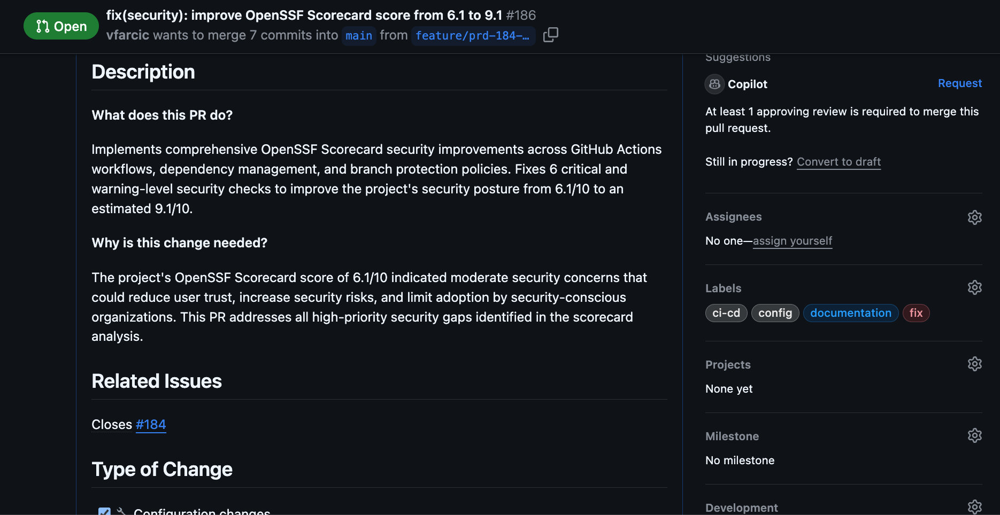

There it is: a fully structured pull request with all the information anyone reviewing it would need. Whether that reviewer is a human or an AI like CodeRabbit doesn't matter. The template ensures the information is there, complete, and properly formatted. This is what happens when you guide people, or agents, through providing the information you need instead of hoping they'll figure it out themselves.

> Press `ctrl+c` twice to exit Claude Code.

## Code Owners and Auto-Assignment

Don't you get frustrated when a PR is not reviewed by anyone simply because it was not assigned to anyone? You did all the work, and then the PR is sitting there waiting for something to happen. What do you do? Start pinging people to see whether anyone should review it? Do you even know who that someone is?

The solution is `CODEOWNERS`. It automatically assigns reviewers based on which files are changed. If someone modifies code in the frontend directory, the frontend team gets assigned. If it's infrastructure changes, the platform team gets notified. No more guessing, no more forgotten PRs.

Now, I'm the only one working on this project, so I can't show you automatic assignment in action since there's no one else my PRs can be assigned to. So we're skipping the usual demo and jumping straight to the configuration.

```sh
cat .github/CODEOWNERS
```

```yaml
# CODEOWNERS
#
# Code owners are automatically requested for review when someone opens a pull request
# that modifies code that they own. Code owners are not automatically requested to review
# draft pull requests.
#
# See: https://docs.github.com/en/repositories/managing-your-repositorys-settings-and-features/customizing-your-repository/about-code-owners

# Global owners (default for everything in the repository)
# Using individual maintainers for code ownership
* @vfarcic

# Notes:
# - Code owners are automatically requested for review when PRs modify their files
# - You can define path-specific owners by adding lines like:
#   /docs/ @docs-team
#   /.github/ @devops-team
#   /src/core/ @architecture-team
# - Order matters: later matches take precedence over earlier ones
# - Use teams (@org/team) for easier maintenance in larger projects
```

The file is simple: define paths and their owners. The `*` means everything in the repo, so I'm the default owner for all files. You can get more specific with paths like `/docs/` for the docs team or `/src/core/` for the architecture team. When someone opens a PR touching those files, the corresponding owners get automatically requested for review. No manual assignment needed.

Now, let's talk about what happens after those PRs are reviewed, merged, and released.

Wouldn't it be nice, when you take a look at release notes, to quickly discover what it's all about? Is it a new feature or a bug fix? Is it an update of dependencies? Is it only a clarification in the docs? Labels can solve that, but no one remembers to label PRs correctly. If they would, we could use labels to easily distinguish work that was released.

Here's where automation comes in. We can automatically label PRs based on the files changed, and then use those labels to organize release notes into categories. Let me show you what that looks like in my releases.

> Open https://github.com/vfarcic/dot-ai/releases in a browser

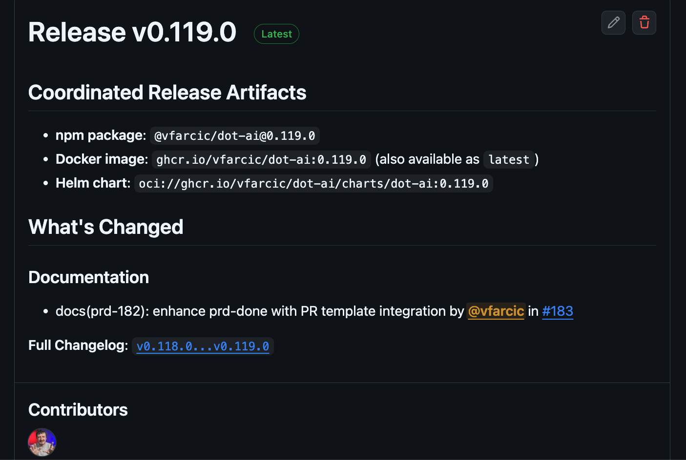

Notice the "What's Changed" section with categories like "Documentation" organizing the changes. In a release with more PRs, you'd see sections for New Features, Bug Fixes, Dependencies, and so on. All automatic, based on PR labels. Here's how the categorization is configured.

```sh
cat .github/release.yml
```

```yaml
# Release notes configuration
#
# Configures automatic release notes generation when creating GitHub Releases.
# GitHub will categorize merged PRs based on labels and generate formatted changelog.
#
# See: https://docs.github.com/en/repositories/releasing-projects-on-github/automatically-generated-release-notes

changelog:
  exclude:
    labels:
      - skip-changelog
      - duplicate
      - invalid
      - wontfix
    authors:
      - renovate
      - renovate[bot]
      - github-actions[bot]

  categories:
    - title: Breaking Changes
      labels:
        - breaking-change
        - breaking

    - title: New Features
      labels:
        - feature
        - enhancement
        - feat

    - title: Bug Fixes
      labels:
        - bug
        - fix
        - bugfix

    - title: Documentation
      labels:
        - documentation
        - docs

    - title: Dependencies
      labels:
        - dependencies
        - deps
        - dependency

    - title: Other Changes
      labels:
        - "*"
```

The configuration defines categories with their corresponding labels. PRs labeled with `feature`, `enhancement`, or `feat` go into "New Features". Bug fixes go into "Bug Fixes". Documentation changes get their own section. There's even an `exclude` section to filter out noise like dependency bot PRs or duplicate issues. When you create a GitHub release, it automatically generates organized notes based on these categories.

## Security Scanning and Badges

Security matters, whether you're building open source projects or internal tools. You need to know whether your project follows security best practices, and so do the people using it. One way to demonstrate and track that is through security badges and automated security scanning.

> Open https://github.com/vfarcic/dot-ai in a browser.

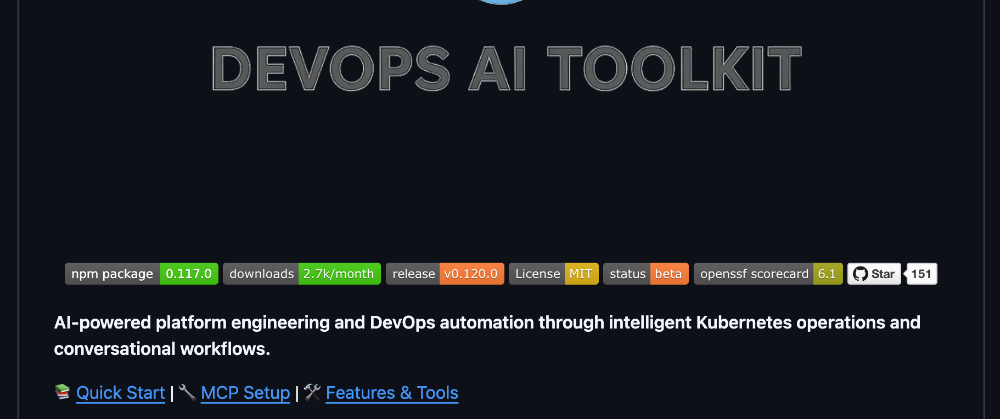

Look at the badges at the top of the README. There's an "openssf scorecard" badge showing a score of 6.1. The OpenSSF Scorecard evaluates projects against security best practices: whether you pin dependencies, use code review, have security policies, and so on. The higher the score, the more confidence both you and your users have in the project's security posture. This isn't just for show; it's automated scanning that actually checks your repository and workflows.

Here's how it's configured.

```sh
cat .github/workflows/scorecard.yml
```

```yaml
# This workflow uses actions that are not certified by GitHub. They are provided by a
# third-party and are governed by separate terms of service, privacy policy, and support
# documentation.
#
# OpenSSF Scorecard is a tool that assesses open source projects for security risks.
# Projects are given a score out of 10 based on security best practices.
# See: https://github.com/ossf/scorecard

name: OpenSSF Scorecard

on:
  # Only the default branch is supported for accurate security analysis
  push:
    branches:
      - main

  # Run security analysis on a schedule
  schedule:
    # 30 1 * * 6 - Weekly on Saturdays at 1:30 AM UTC
    - cron: '30 1 * * 6'

  # Allow manual triggering for on-demand security analysis
  workflow_dispatch:

# Restrict permissions to read-only by default for security
permissions: read-all

jobs:
  analysis:
    name: Scorecard analysis
    runs-on: ubuntu-latest
    permissions:
      # Required to upload results to GitHub's code scanning dashboard
      security-events: write
      # Required to publish results and get a Scorecard badge
      id-token: write
      # Required for private repos to detect SAST tools and query commits
      contents: read

    steps:
      - name: "Checkout code"
        uses: actions/checkout@08c6903cd8c0fde910a37f88322edcfb5dd907a8 # v5.0.0
        with:
          persist-credentials: false

      - name: "Run analysis"
        uses: ossf/scorecard-action@4eaacf0543bb3f2c246792bd56e8cdeffafb205a # v2.4.3
        with:
          results_file: results.sarif
          results_format: sarif
          # Publish results to enable Scorecard badges and REST API access
          # See: https://github.com/ossf/scorecard-action#publishing-results
          publish_results: true

      - name: "Upload artifact"
        uses: actions/upload-artifact@ea165f8d65b6e75b540449e92b4886f43607fa02 # v4.6.2
        with:
          name: SARIF file
          path: results.sarif
          retention-days: 5

      - name: "Upload to code-scanning"
        uses: github/codeql-action/upload-sarif@64d10c13136e1c5bce3e5fbde8d4906eeaafc885 # v3.30.6
        with:
          sarif_file: results.sarif
```

This GitHub Actions workflow runs the OpenSSF Scorecard analysis on every push to the main branch and on a weekly schedule. It checks your repository against security best practices, generates results in SARIF format, and uploads them to GitHub's code scanning dashboard. The workflow also publishes results so you can display that badge. Notice the pinned action versions with full commit SHAs; that's one of the things the scorecard checks for.

## Automated Dependency Updates

What is the most boring and, at the same time, very time-consuming task you might or might not be doing? Yep. Updating dependencies. You're either sick of updating them all the time, or you just keep the versions you had initially. The former must be a toil that makes you hate yourself and the company you work in, while the latter typically results in someone discovering there is a security breach in one of the dependencies that triggers a depression to those knowing that updating years-old dependencies to fix it is a nightmare.

Renovate solves this by automatically creating PRs when new versions are available. Let me show you what that looks like.

> Open https://github.com/vfarcic/dot-ai/pull/172 in a browser.

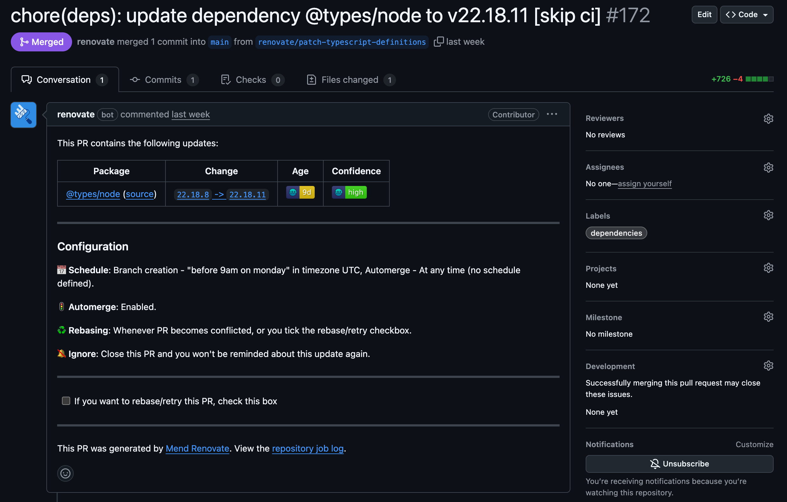

This is a Renovate PR updating a TypeScript dependency. Notice it shows the change, the age of the dependency, confidence level, and it's already labeled with "dependencies". The PR even tells you it's configured for automerge. Here's the configuration that enabled Renovate in my repo.

```sh
cat renovate.json
```

```json
{
  "$schema": "https://docs.renovatebot.com/renovate-schema.json",
  "extends": [
    "config:base",
    ":dependencyDashboard",
    ":semanticCommits",
    ":separatePatchReleases"
  ],
  "schedule": ["before 9am on monday"],
  "timezone": "UTC",
  "labels": ["dependencies"],
  "assignees": ["@vfarcic"],
  "packageRules": [
    {
      "matchDepTypes": ["devDependencies"],
      "matchUpdateTypes": ["patch", "minor"],
      "automerge": true,
      "automergeType": "pr"
    },
    {
      "matchPackageNames": ["@types/*"],
      "matchUpdateTypes": ["patch", "minor"],
      "automerge": true,
      "groupName": "TypeScript definitions"
    },
    {
      "matchPackageNames": ["jest", "@types/jest", "ts-jest"],
      "groupName": "Jest packages"
    },
    {
      "matchPackageNames": ["eslint*", "prettier", "@typescript-eslint/*"],
      "groupName": "Linting tools"
    },
    {
      "matchPackageNames": ["@kubernetes/client-node"],
      "reviewersFromCodeOwners": true,
      "labels": ["kubernetes", "major-update"]
    },
    {
      "matchFiles": ["devbox.json"],
      "groupName": "Devbox packages",
      "labels": ["devbox"]
    }
  ],
  "vulnerabilityAlerts": {
    "enabled": true,
    "schedule": ["at any time"]
  },
  "lockFileMaintenance": {
    "enabled": true,
    "schedule": ["before 9am on monday"]
  },
  "prHourlyLimit": 3,
  "prConcurrentLimit": 5,
  "rebaseWhen": "conflicted",
  "commitMessageSuffix": " [skip ci]"
}
```

The configuration controls how Renovate behaves: when it runs, how it groups updates, what gets automerged. For example, dev dependencies with patch or minor updates get automerged automatically. TypeScript definitions get grouped together. Major Kubernetes client updates require review from code owners. You control the noise level and let automation handle the tedious work.

Now you don't need to worry about dependency upgrades. You get pull requests created automatically, and all you have to do is either merge them yourself or, if you're doing things right, let them merge automatically because you have truly reliable tests that will detect if something's wrong.

Now, remember earlier when we talked about organizing release notes by category? That requires PR labels. But who remembers to label PRs correctly? Nobody. So we automate that too.

> Open https://github.com/vfarcic/dot-ai/pull/186 in a browser

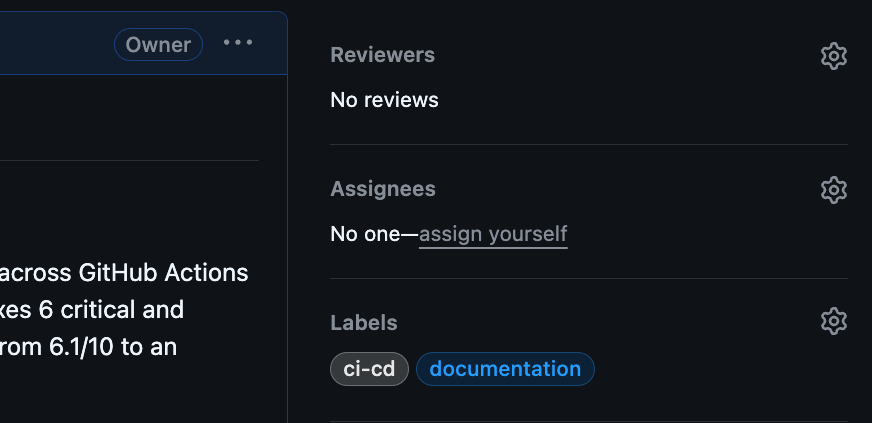

Notice the labels on this PR: "ci-cd" and "documentation". Those were added automatically based on which files were changed. Here's how that's configured.

```sh
cat .github/labeler.yml
```

```yaml
# This configuration automatically labels pull requests based on file paths.
# Learn more: https://github.com/actions/labeler

# Documentation changes
documentation:
- changed-files:
  - any-glob-to-any-file:
    - 'docs/**/*'
    - '*.md'
    - 'README*'

# Source code changes
source:
- changed-files:
  - any-glob-to-any-file:
    - 'src/**/*'

# Test changes
tests:
- changed-files:
  - any-glob-to-any-file:
    - 'tests/**/*'
    - '**/*.test.*'
    - '**/*.spec.*'

# CI/CD changes
ci-cd:
- changed-files:
  - any-glob-to-any-file:
    - '.github/workflows/**/*'
    - '.github/actions/**/*'
    - 'Dockerfile*'
    - 'docker-compose*.yml'

# Infrastructure changes
infrastructure:
- changed-files:
  - any-glob-to-any-file:
    - 'k8s/**/*'
    - 'kubernetes/**/*'
    - 'manifests/**/*'
    - 'helm/**/*'
    - 'charts/**/*'
    - 'Chart.yaml'
    - 'values.yaml'
    - 'kind.yaml'

# Dependencies
dependencies:
- changed-files:
  - any-glob-to-any-file:
    - 'package.json'
    - 'package-lock.json'
    - 'yarn.lock'
    - 'pnpm-lock.yaml'

# Configuration changes
config:
- changed-files:
  - any-glob-to-any-file:
    - '*.config.*'
    - '*.json'
    - '*.yaml'
    - '*.yml'
    - '*.toml'
    - '.env*'
    - 'tsconfig.json'
    - '.eslintrc*'
    - '.prettierrc*'
```

```sh
cat .github/workflows/labeler.yml
```

```yaml
# This workflow automatically labels pull requests based on file paths.
# Configuration: .github/labeler.yml
# Learn more: https://github.com/actions/labeler

name: "Pull Request Labeler"

on:
- pull_request_target

permissions:
  contents: read
  pull-requests: write

jobs:
  labeler:
    runs-on: ubuntu-latest
    steps:
      - uses: actions/labeler@v5
        with:
          configuration-path: .github/labeler.yml
          sync-labels: true
```

The labeler configuration maps file paths to labels. Changes to docs get labeled "documentation", changes to workflows get "ci-cd", changes to tests get "tests", and so on. The GitHub Actions workflow runs on every PR and applies the labels automatically. Now your release notes are organized without anyone having to remember to add labels manually.

Finally, don't you love having hundreds or thousands of issues? Only masochists do. There are two ways you can fix that. Ideally, you should close all open issues by developing whatever they require you to develop. That's an unlikely option. There are always issues that make no sense doing because priorities changed, because they are something you thought should be done but you changed your opinion, because they just don't make sense to do, and so on and so forth. If that's the case, as it probably is, all you have to do is have a process that periodically detects and marks issues no one touched in a while as stale. Think of it as a reminder that those you don't care about might not be worth having and, if you keep ignoring them, they should be deleted.

> Open https://github.com/vfarcic/dot-ai/issues/5 in a browser.

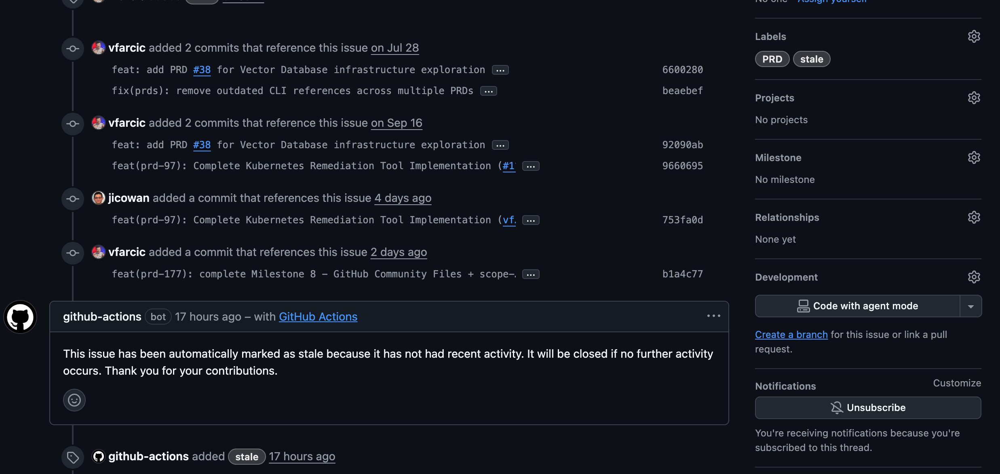

See the bot comment: "This issue has been automatically marked as stale because it has not had recent activity. It will be closed if no further activity occurs." Notice the "stale" label was added automatically. If no one comments or updates the issue within the configured time, it gets closed. Here's how that's configured.

```sh
cat .github/workflows/stale.yml
```

```yaml
# This workflow warns and then closes issues and PRs that have had no activity for a specified amount of time.
#
# Best practice: Only mark items stale when responsibility is on the contributor/user, not on maintainers.
# Items with labels indicating maintainer action needed should be exempt from stale automation.
#
# Learn more: https://github.com/actions/stale

name: Close Stale Issues and PRs

on:
  schedule:
    - cron: '0 0 * * *'
  workflow_dispatch:

permissions:
  issues: write
  pull-requests: write

jobs:
  stale:
    runs-on: ubuntu-latest
    steps:
      - uses: actions/stale@5bef64f19d7facfb25b37b414482c7164d639639 # v9
        with:
          # Issues configuration
          days-before-issue-stale: 60
          days-before-issue-close: 7
          stale-issue-message: >
            This issue has been automatically marked as stale because it has not had
            recent activity. It will be closed if no further activity occurs. Thank you
            for your contributions.
          close-issue-message: >
            This issue was automatically closed due to inactivity.
            If you believe this is still relevant, please reopen it.
          stale-issue-label: 'stale'

          # Pull requests configuration
          days-before-pr-stale: 30
          days-before-pr-close: 7
          stale-pr-message: >
            This pull request has been automatically marked as stale because it has not had
            recent activity. It will be closed if no further activity occurs. Thank you
            for your contributions.
          close-pr-message: >
            This pull request was automatically closed due to inactivity.
            If you believe this is still relevant, please reopen it.
          stale-pr-label: 'stale'

          # Exemptions - Never mark these as stale (maintainer responsibility)
          exempt-issue-labels: 'pinned,security'
          exempt-pr-labels: 'pinned,security'
          exempt-milestones: true
          exempt-assignees: true

          # Behavior
          remove-stale-when-updated: true
          operations-per-run: 100
```

The workflow runs daily, checking for issues with no activity for 60 days and PRs with no activity for 30 days. It marks them stale, gives people 7 days to respond, and then closes them. Important: the configuration exempts issues with certain labels like "security" or those assigned to milestones. You don't want to close things that actually need attention just because they're waiting on maintainers.

## Essential Documentation Files

All the templates, workflows, and automation we've covered are great, but they mean nothing if people don't understand what your project does or how to use it. Projects need documentation, and I'm not just talking about open source. Internal projects, company tools, anything people need to work with requires clear documentation. Let's walk through what that looks like.

What is the one place you or anyone else goes to to find information? Where do developers, users, contributors, or anyone else go? I'm sure you know the answer to that one. The README. It's not just for people discovering your project for the first time. It's also for you, the person working on it. That's where everyone starts.

> Open https://github.com/vfarcic/dot-ai in a browser.

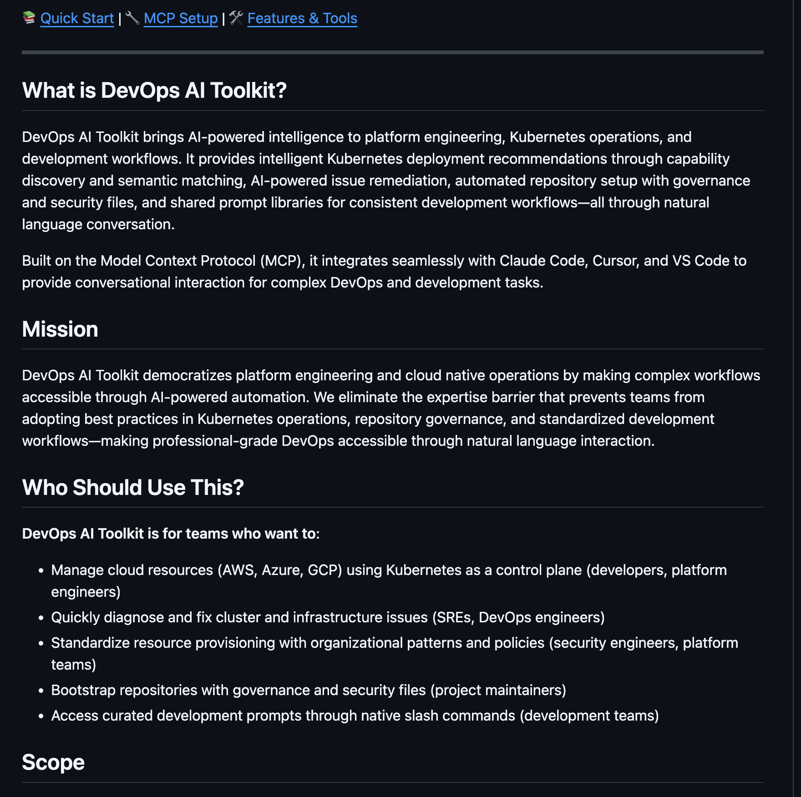

A comprehensive README explains what the project is, what problems it solves, who should use it, and how to get started. New team members, potential users, or anyone evaluating whether to adopt your project need this information.

Now, here's something you probably don't think about until it's too late: what happens if there's no license? In many jurisdictions, code without a license means nobody can legally use it, modify it, or distribute it. You publish your code thinking you're sharing it with the world, and technically, you just created a legal minefield. Even worse, if you're at a company, someone might argue the company owns it, or contributors might claim rights you didn't intend to give them. It's a mess. Don't be that person.

> Open https://github.com/vfarcic/dot-ai in a browser and click the `MIT license` link above the README.

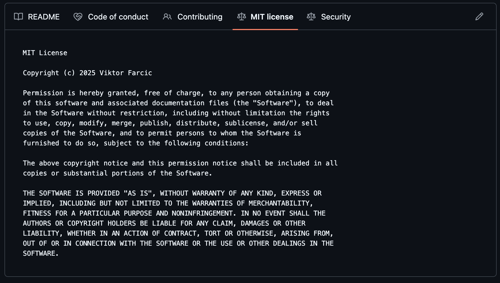

This project uses the MIT license, which is permissive and allows people to use, modify, and distribute the code. For internal projects, you might have different licensing requirements, but having it clearly stated removes ambiguity and protects everyone involved.

Beyond the README and license, projects need governance files that explain how things work: how to contribute, what the code of conduct is, how to report security issues. Now, you might think that's only for open source projects, but I would argue otherwise. It should not matter whether people are contributing for free to an open source project or working on it within a company. Everyone should know how to "contribute".

> Open https://github.com/vfarcic/dot-ai in a browser and explore `Code of conduct`, `Contributing`, and `Security` links above the README.

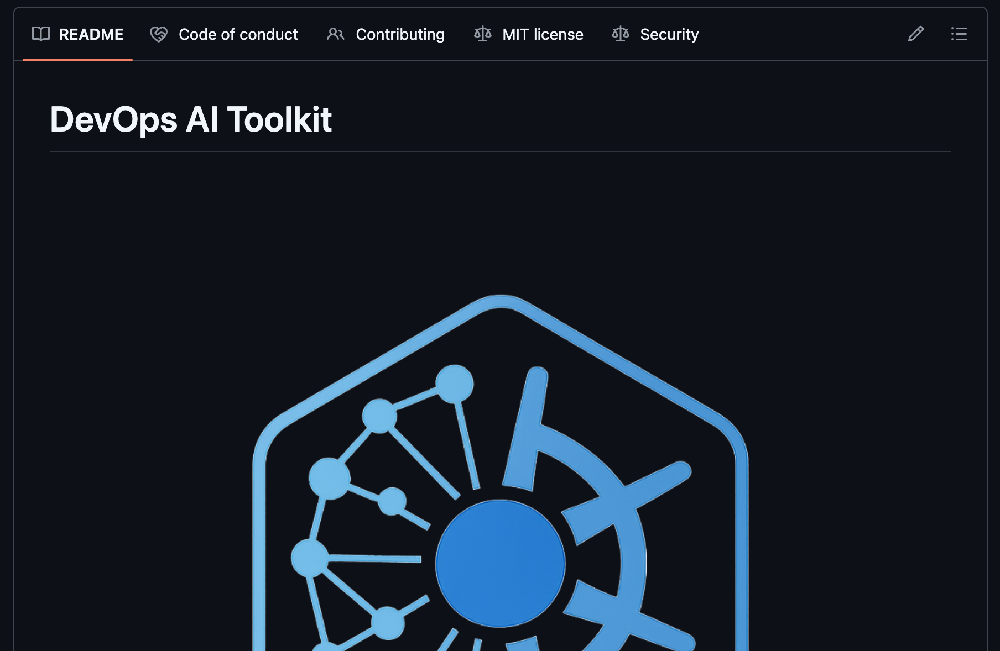

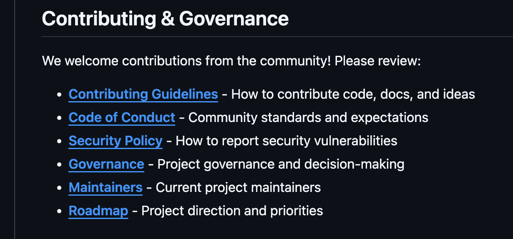

These files set expectations. The Code of Conduct establishes how people should interact. Contributing guidelines explain how to submit changes. The Security policy tells people how to report vulnerabilities responsibly. Having these documented prevents confusion and establishes clear processes, whether you're an open source maintainer or leading a team at a company.

Finally, people need to know how to get help.

> Open https://github.com/vfarcic/dot-ai?tab=readme-ov-file#support in a browser.

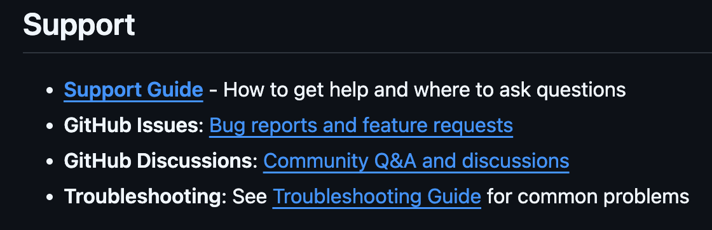

A Support section in the README points people to the right resources: where to ask questions, how to report bugs, where to discuss ideas. This keeps everything organized and prevents people from opening issues when they should be asking in discussions or reading the docs.

## DevOps AI Toolkit

Now, everything I showed you today can be created manually. You could spend hours setting up issue templates, PR templates, workflows, governance files, and all the rest. Or you could automate it. That's what the **DevOps AI Toolkit's Project Setup MCP tool** does.

Let me fire up Claude Code again and run the setup command.

```sh
claude --mcp-config .mcp-docker.json
```

[user]
```text
Setup project
```

The MCP analyzes which files are already created and suggests which ones we might want to add.

[agent]
```md
⏺ Great! The repository analysis shows that most project files are already in place. Here's what I found:

  Repository Status

  Complete Scopes (✓):
  - ✓ readme: README.md exists
  - ✓ legal: LICENSE exists
  - ✓ governance: All 6 governance files exist (MAINTAINERS.md, GOVERNANCE.md, ROADMAP.md, SUPPORT.md, CODE_OF_CONDUCT.md, CONTRIBUTING.md)
  - ✓ github-issues: All 3 issue template files exist
  - ✓ pr-template: Pull request template exists
  - ✓ github-community: Community files exist
  - ✓ github-security: Security workflow exists
  - ✓ github-automation: All 4 automation workflows exist

  Incomplete Scopes (○):
  - ○ community: Missing ADOPTERS.md file

  Would you like me to generate the missing ADOPTERS.md file to complete the project setup?
```

I already ran it in this repo, so I can't show you the full setup process, but I can explain how it works. Once you select which scopes you'd like to add, MCP returns questions needed to populate the files and instructs the agent to do its best to figure out the answers based on your source code and other information. From there on, all you have to do is either accept suggested answers or provide additional instructions. In either case, the files will be created and you can push them to your repo.

In this case, the only file I'm missing is `ADOPTERS.md`. That's a file listing people or organizations using the project. Speaking of which, are you using DevOps AI Toolkit? If you are and you would like to be listed as an adopter, please open an issue and I'll add you. I would appreciate it a lot.

Try the Project Setup MCP tool, or any other tool in the DevOps AI Toolkit project. Let me know what you think, star it, fork it, open issues, contribute. All those templates and governance files I just showed you? They're already set up in that project, ready for you to engage with.

## Destroy

> Press `ctrl+c` twice to exit Claude Code.

```sh
git switch main

exit
```
