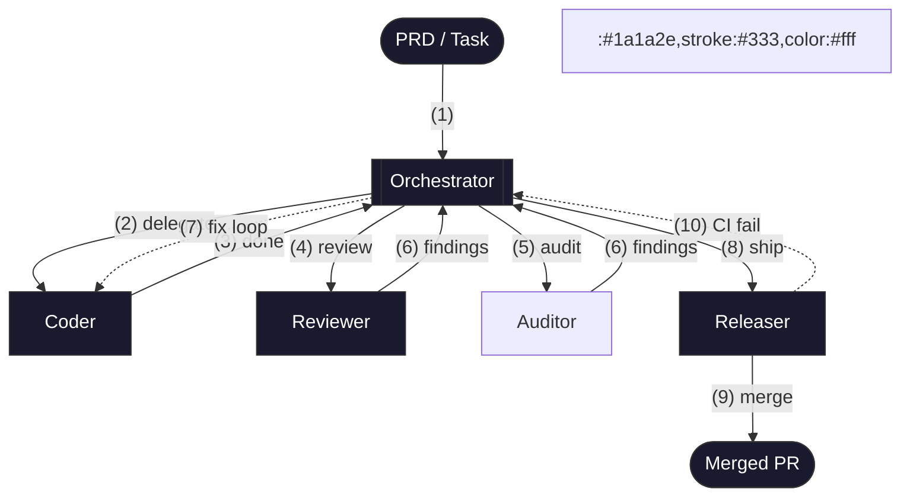
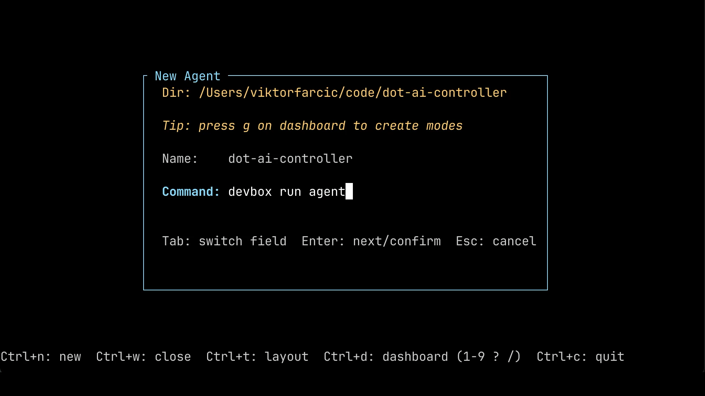
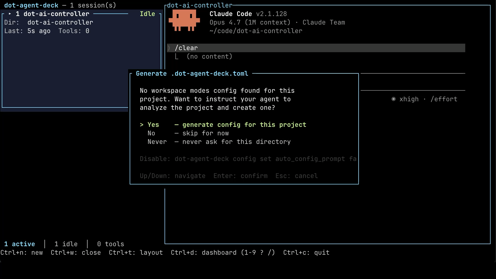
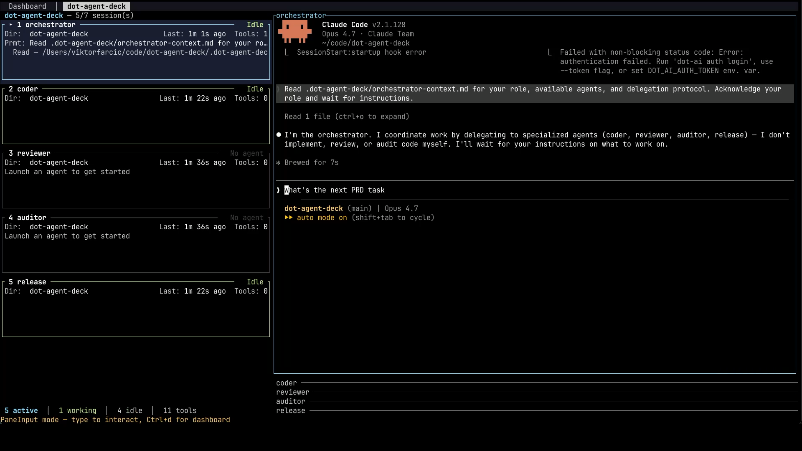
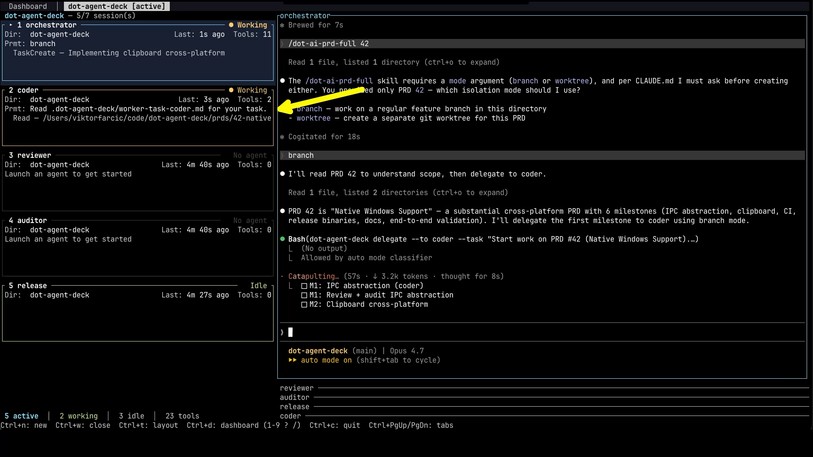
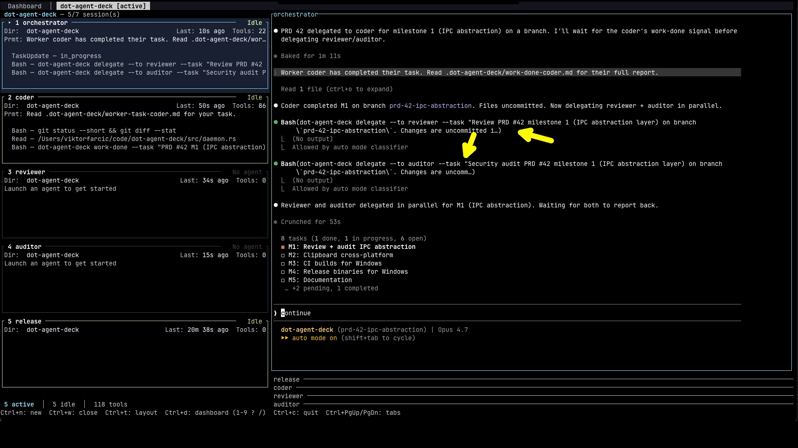

+++
title = "Why One AI Agent Is Never Enough"
date = 2026-06-15T15:00:00+00:00
draft = false
+++


When I used to give an AI agent a task, it would finish in one go. Write the code, declare victory, done. Now, with th

e setup I'm about to show you, the same task can take tens of iterations before the work is considered finished. The output is **dramatically better**, and I'm spending **less time** on it, not more.

The reason is that there's no longer a single agent doing the work. There's a team. One agent writes the code. Another reviews it. A third audits it for security. A fourth ships it. They run on different models, with fresh context each time, and they push back on each other until the work actually holds up. I just play games until something genuinely needs me.

In this video, I'll walk through what that pipeline looks like, 

why each role exists, and how I run all of it end-to-end. By the end, you'll have a complete picture of how to set this up yourself, and a slightly uncomfortable realization about what your job becomes when the agents do the coding.

<!--more-->



## Setup

> The demo showcases a multi-agent orchestration for a specific feature I was working on. If you follow along, your results might differ.

> Install [DOT Agent Deck](https://agent-deck.devopstoolkit.ai/docs/installation).

```sh
dot-agent-deck
```

## Why Single AI Agents Fail

Process is the foundation of any good engineering work. It doesn't matter if it's a single developer hacking on a side project, a five-person team, one AI agent, or a fleet of agents. The principle is the same. You need a defined workflow that says who does what, when, and in what order.

Some parts of that workflow should be rigid. If a change touches production, there's a pull request. Tests must pass. CI must be green. Those aren't suggestions. Other parts can be flexible. A typo fix in a README doesn't need three reviewers and a steering committee. Use your judgment.


Without process, you have chaos. People stepping on each other, code shipping without review, releases breaking because nobody validated them. That's true for human teams, and it's even more true for AI agents, which are very enthusiastic and will happily ship broken code straight to main if you let them.

Orchestration is just that same process, applied to AI agents. Same principle. Different workers.

The same logic applies to tracking. You need a file. Some kind of document that describes what should be done, what's already been done, what's blocked, and what's coming next. Call it a PRD, a task list, a roadmap, whatever you want. The format matters less than the existence of the thing.

You'd want that file regardless of how the work gets done. A single developer needs it because memory is finite and a week later they've forgotten what they decided. A team needs it because not everyone is in every conversation. A single agent needs it because its context is finite and conversations get compacted away. A fleet of agents needs it the most, because none of them share memory with each other.

That file is the source of truth that survives everything. It survives you going on vacation. It survives a teammate joining mid-project. It survives an agent hitting its context limit. As long as the file exists and is kept current, the work can continue.

So why agent orchestration specifically? Start with the goal. What we actually want is for agents to do the whole thing. You hand off a task, a feature spec, a PRD, a bug to fix, and agents take it all the way to a merged PR. They write the code, they review it, they audit it, they ship it. You step in only when there's something that genuinely needs a human. A design decision. A final approval before merge. Otherwise, you walk away and do something else.


Now, you can't get there with a single agent doing everything. A single agent has the same problems a single human would have. No separation of concerns. No independent review. No specialization. The agent that wrote the code is the same one telling you the code is good. That's not a review. That's a self-assessment. Self-assessments are biased by default, whether the assessor is a human or a model. On top of that, as the agent keeps working, its context fills up with implementation details, debugging sessions, error traces, and conversation history. Quality drops as focus spreads thin.

Orchestration is how you get there. One agent codes. Another reviews. A third audits for security. A fourth handles the release. Each one starts fresh on its task with a clean context, focused on a single concern. The review happens with fresh eyes, not the same eyes that wrote the code. You hand off a task at the top of the pipeline, and a merged PR comes out the bottom.

There's a practical constraint that comes with this. To get end-to-end autonomy with optional human intervention, you can't run agents in headless mode. You need to see what they're doing, sure, but you also need to be able to answer their questions, grant them permissions, course-correct when they go off track. `claude -p` and other non-interactive modes give you visibility but not interaction. That means full-blown interactive agents, the same ones you'd run in your terminal day-to-day. The whole point of orchestration is that you're occasionally in the loop, and being in the loop means the agents have to be reachable when they need you.


With that motivation in mind, let's walk through what the pipeline actually looks like. The shape is always the same. An **orchestrator** on top, and a set of specialist agents underneath. The orchestrator is always there. The specialists depend on what you're doing. For development work, which is the example we'll walk through, you'd typically have a **coder**, a **reviewer**, an **auditor**, and a **releaser**. For a different kind of work, the lineup would look different. But the orchestrator is always present, because someone has to coordinate.

So let's start at the top, with the orchestrator. Its job is to delegate tasks to the specialists and keep track of what's happening overall. It doesn't write code. It doesn't review code. It doesn't ship code. It coordinates.

That distinction matters because it shapes how much context the orchestrator carries. It doesn't need every implementation detail from the coder, every comment from the reviewer, every CVE the auditor flagged. It only needs enough context to know what to delegate next and to whom. That keeps its context lean. Ideally, the orchestrator never hits its context limit. It just keeps coordinating, task after task.

But even if it does hit the limit, you're not lost. The tracking file we talked about earlier is still there. The orchestrator can be compacted, or even restarted from scratch, read the file, and pick up where it left off. That file is the safety net.

Let's walk through each of the specialists, starting with the coder.

The coder is the agent that actually writes the code. When the orchestrator hands off a task, the coder opens files, modifies them, writes the tests, runs the tests, and reports back when it's done. It's the most labor-intensive role in the pipeline, which is why you'd typically point your most capable model at it. Implementation is the hardest work in the chain, and shortcuts here show up downstream as broken builds or bad reviews.

Next comes the reviewer. Once the coder reports done, the reviewer takes a look at the change. Its job is to find problems. Bugs, missed edge cases, sloppy patterns, anything that should not ship.

The reviewer runs independently of the coder, with its own fresh context and its own instructions. That alone removes most of the bias, because the reviewer doesn't carry around the implementation conversation or the coder's reasoning. On top of that, you'd ideally point the reviewer at a different model than the coder. Same model reviewing itself tends to share the same blind spots and the same convictions about what good code looks like. A different model brings genuinely different judgment. It's not mandatory, but it's a meaningful upgrade when you can swing it.

Alongside the reviewer is the auditor. Same idea in terms of independence and ideally a different model, but with a different focus. The reviewer is looking at code quality and correctness. The auditor is looking at security. Unsafe patterns, injection risks, RBAC scope creep, sloppy handling of secrets, anything that could turn into an incident later.

The two roles are split because the questions are genuinely different. A reviewer asking "is this code clean?" is not the same as an auditor asking "can this code be exploited?". Different lens, different findings. You could mash them into one agent, but the quality of both passes drops because the agent is context-switching between two unrelated mental models on a single pass.

Last in the lineup is the releaser. Its job is the easiest of the four because it doesn't require any creativity. It just runs a recipe. Create a branch. Push. Open a PR. Wait for CI. Merge. Close the issue. Mechanical, repeatable work.

That's why the releaser is the role where you can comfortably use your weakest model. There's no judgment to exercise, no edge cases to spot, no clever code to write. Just steps to execute in order and results to report back. A small, cheap, fast model handles this perfectly well, and you save your premium budget for the coder, reviewer, and auditor, where it actually matters.

With all four roles defined, let's look at how they actually work together. Everything flows through the orchestrator. A task arrives (1), the orchestrator delegates the implementation to the coder (2), and when the coder is done (3), it reports back. The orchestrator then delegates to the reviewer (4) and the auditor (5) in parallel. If either flags something (6), the orchestrator sends it back to the coder with the finding. The orchestrator is the only one that sees the full picture and the only one making delegation decisions.



There's an important distinction in how the specialists handle context. The coder, reviewer, and auditor always start fresh. New invocation, clean context, focused on whatever task the orchestrator handed them. This is deliberate. If the coder kept context across tasks, it would start carrying around irrelevant baggage from previous work, and the focus would degrade exactly the way a single agent's focus degrades. Fresh context is the whole reason this works.

The releaser is the exception. It keeps its context across the release flow. That's because the release is a stateful process. You create a branch, you push, you open a PR, you wait for CI, you handle failures, you merge. All of that has to thread together. If the releaser cleared its context every step, it would lose the PR URL, the branch name, the CI status. Stateful work needs persistent memory.

And finally, the loop. The orchestrator does not assume success. If the reviewer or auditor flags something, the orchestrator sends it back to the coder with the specific feedback (7). The coder fixes it. The reviewer and auditor look at the fix. If they're happy, the orchestrator hands off to the releaser (8). The releaser executes the release flow and the change ships as a merged PR (9). The same pattern applies if the release itself runs into trouble. If CI fails (10), the releaser reports the failure, the orchestrator hands the fix to the coder, the coder addresses it, and then the orchestrator tells the releaser to pick up the release from where it stopped. The releaser doesn't restart. It continues.

One more thing before we move on. Everything we just walked through, the four roles, the parallel review and audit, the failure loop, the stateful releaser, is one shape of orchestration. It's the one I use for development work, and it's the one we'll see in action shortly. But it is an example, not a template. A research workflow might have a planner, a fact-checker, a writer, and an editor. A data pipeline might have an extractor, a transformer, a validator, and a loader. The pattern stays the same. The roles change with the work.

Before we get our hands dirty, a caveat. The tool we're about to look at handles the orchestration. The delegation, the parallel reviews, the loops, the context handoffs, all of it. What it doesn't handle is the tracking file we talked about earlier. You bring your own. PRD, task list, whatever you use. The tool doesn't care which, but you do need one.

It also doesn't manage Git worktrees. If you want to use them, and there are good reasons to, you set them up yourself. I assume you're not a kid playing with toys. You're a software engineer who knows at least the basics. Otherwise, this is not for you. Thank you for watching. Go away.

Everything else, the multi-agent coordination, the model selection per role, the failure loop, all of it, is what we're about to look at.

## Multi-Agent Orchestration in Action


The tool we're going to use is [DOT Agent Deck](https://agent-deck.devopstoolkit.ai). I covered the non-orchestration features in a separate video called [I Built a Tool to Manage Multiple AI Agents at Once](https://youtu.be/dNmaFkOVIa8). If you've never seen Agent Deck before, that one's worth a watch for the basics. Today, we're focused on orchestration specifically.


Before we can orchestrate anything, we need an orchestration config. The deck doesn't generate that out of thin air. It generates it by asking an agent to analyze your project. So our very first step is to spin up a regular deck, not because we're going to use it for real work, but because that's the path to getting a `.dot-agent-deck.toml` written for this project. Once the config exists, we'll throw this initial deck away and start a fresh orchestration tab that actually uses it.

With that in mind, press `Ctrl+n` to open the new deck dialog. Navigate into the project directory you want to set up. Use `Enter` to step into a directory, and `Space` to select it. Then type whatever command you want to use to launch your agent in the `Command` field. That could be `claude`, `opencode`, or anything else, depending on which agent you prefer. In my case, I'm using `devbox run agent`, which launches Claude Code inside a devbox shell.

What you should see at this point is the new agent dialog with the project directory filled in, a default name derived from that directory, and the `Command` field ready for your input.



With the deck created, we can move on to generating the orchestration config itself.


To trigger the generation, press `Ctrl+d` to enter command mode, then press `g` to generate a config for this project. The deck pops up a confirmation asking whether you want to instruct your agent to analyze the project and create one. Select `Yes` and hit `Enter`.




What happens next is that the deck sends a long, structured prompt to the agent we just launched. It tells the agent to look at the codebase, understand what kind of project it is, figure out which roles make sense, and produce a `.dot-agent-deck.toml` file with sensible defaults. The agent does the work. We wait.


> Do not copy & paste `!` from the intent that follows. `!` must be typed.

Once the agent reports that it's done, let's take a look at what it produced. We can do that without leaving the deck. The `!` prefix in the prompt tells the agent to run a shell command on our behalf. So we ask it to print out the generated config file.

[user]
```text
!cat .dot-agent-deck.toml
```

Here's what came back.

[agent]
```text
...
[[orchestrations]]
name = "prd-flow"

[[orchestrations.roles]]
name = "orchestrator"
command = "devbox run agent-orchestrator"
start = true
prompt_template = """
You coordinate the team for this Kubernetes controller project (Kubebuilder v4.7.1, Go 1.24, five CRDs under api/v1alpha1). You NEVER do implementation, review, or audit work yourself — only delegate to the available agents.

Workflow:
- Most work is driven by PRDs in prds/. When starting a task, check prds/ for the relevant spec and reference its path in delegations.
- Delegate implementation to coder. After coder finishes, delegate to reviewer and auditor IN PARALLEL.
- Resolve any blocking findings (re-delegate to coder with the specific feedback) before moving on.
- Before delegating to release, summarize what to test end-to-end and STOP until the user confirms.
- Then delegate the release flow to release.

Coordination commands you MAY run yourself (do NOT delegate these — they are lightweight project skills):
- /prd-next — identify the next highest-priority PRD task
- /prd-update-progress — update PRD progress after a chunk of work
- /prd-update-decisions — record design decisions made in conversation
- /prd-done — drive the full PR-create / merge / close flow (delegate to release instead if it involves long-running CI waits)
- /changelog-fragment — REQUIRED before any commit with user-facing changes
- /prds-get — fetch open PRD-labeled issues

Project-specific gotchas to enforce when delegating:
- Use `make test` (NOT `go test ./...`) — unit + integration via envtest.
- Use `make test-e2e` for e2e (spins up Kind cluster controller-init-test-e2e). Always remind workers to run `make cleanup-test-e2e` afterward.
- After changing api/v1alpha1/*_types.go, run `make generate manifests`.
- All tests must pass before marking work complete.

Context handoff (CRITICAL): every worker cold-starts with NO memory of prior conversation or other workers' outputs (except release, which has clear=false). Whatever you write in --task is the entire context the worker has. Therefore:
- Always include the relevant PRD path (e.g. prds/<name>.md), file paths to read, and exact error messages when retrying after a failure.
- When chaining workers (coder → reviewer), summarize the prior worker's relevant findings or list the files they changed.
- Do NOT assume workers can see prior conversation or other workers' outputs — paste references explicitly.
- If the context is long, write it to .dot-agent-deck/<task-slug>.md and reference that path in --task rather than pasting inline.
"""

[[orchestrations.roles]]
name = "coder"
command = "devbox run agent-coder"
description = "Implements features, fixes bugs, refactors code"
prompt_template = """
Implement the requested change in this Kubernetes controller (Kubebuilder, Go 1.24, controller-runtime v0.21.0).

- Read the referenced PRD or task file first if mentioned (typically under prds/).
- After modifying api/v1alpha1/*_types.go, run `make generate manifests`.
- Run `make test` (unit + integration via envtest) before reporting completion. Do NOT use `go test ./...`.
- If you change e2e behavior, also run `make test-e2e` and then `make cleanup-test-e2e`.
- Use `r.Status().Update()` for status changes, not `r.Update()`.
- Update RBAC via `+kubebuilder:rbac` comments — never edit generated manifests manually.
- If critical context is missing from the task (PRD path, target files, reproduction steps), surface it in your work-done summary rather than guessing — the orchestrator will re-delegate with the missing context.
"""

[[orchestrations.roles]]
name = "reviewer"
command = "devbox run agent-reviewer"
description = "Reviews code changes for correctness, style, and edge cases"
prompt_template = """
Review the change. Report findings only — do NOT modify code.

Focus on:
- Correctness of reconciliation logic (idempotency, requeue behavior, error handling).
- Consistency with the other controllers in internal/controller/.
- Edge cases: deletion handling (finalizers), status update races, informer cache staleness.
- Missed requirements vs. the referenced PRD if any.
- Test coverage: are new code paths covered by `make test`?

If a spec/PRD path is referenced, verify the implementation matches it. If critical context is missing (e.g. the diff to review, the PRD path), surface it in your work-done summary rather than guessing — the orchestrator will re-delegate.
"""

[[orchestrations.roles]]
name = "auditor"
command = "devbox run agent-auditor"
description = "Audits code for security vulnerabilities and unsafe patterns"
prompt_template = """
Audit the change for security vulnerabilities and unsafe patterns. Report findings only — do NOT modify code.

For this controller, pay special attention to:
- RBAC scope creep (`+kubebuilder:rbac` markers granting more than needed).
- External MCP HTTP calls (RemediationPolicy / ResourceSync / CapabilityScan / GitKnowledgeSource) — TLS verification, secret handling, injection risk in request payloads.
- Git operations (GitKnowledgeSource) — URL validation, credential handling, path traversal in glob patterns.
- Event/watch handlers that could be exploited via malicious resource payloads.
- OWASP top-10 class issues (injection, SSRF, unsafe deserialization).

If the task references a diff or file, read it before starting. If critical context is missing, surface it in your work-done summary rather than guessing — the orchestrator will re-delegate.
"""

[[orchestrations.roles]]
name = "release"
command = "devbox run agent-release"
clear = false
description = "Runs the project's release/PR/merge workflow; never modifies code"
prompt_template = """
Your job is to run the project's release flow: branch → push → PR → CI → merge → close issue. Do NOT modify source code.

Reference flow:
- Use the /prd-done skill where applicable for end-to-end PRD completion.
- Run /changelog-fragment BEFORE the first push if there are user-facing changes (a UserPromptSubmit hook will remind on every prompt).
- CI runs `make test` and `make test-e2e` via .github/workflows/ci.yaml — wait for both.
- Use `gh pr create`, `gh pr checks`, `gh pr merge` for PR operations.

If any step fails, report the exact error and stop — do NOT attempt to diagnose or fix source-level failures yourself (that's coder's job). If you are missing context (PR title, target branch, release notes path), report that via work-done rather than improvising — the orchestrator will re-delegate.
"""
```


This is the entire orchestration config. Let's unpack what's in it. At the top, there's an `orchestrator` role. That one is the master of ceremonies, the agent that delegates and coordinates everything else. Underneath, we have `coder`, `reviewer`, `auditor`, and `release`. Exactly the four specialists we walked through earlier.

Each role has a small set of fields that define how it behaves. The `command` field is the shell command that actually launches the agent for that role. That's where you choose which CLI, which model, and which configuration the role runs with. The `clear` field controls whether the agent starts with a clean context on each delegation. Notice that `release` is the only one with `clear = false`, because, as we discussed, the release flow is stateful and the agent needs to remember the PR URL, the branch name, and the CI status across steps. The `description` field is what the orchestrator reads to decide when to use a given specialist. And the `prompt_template` is the role-specific brief that gets injected into the agent's context on top of whatever instructions the deck adds automatically.

A word of warning. The AI is not going to nail this on the first try. It produces a reasonable starting point, but you should expect to spend some time fine-tuning the `.dot-agent-deck.toml` file after using the orchestration for a while. Maybe the reviewer's prompt is too vague. Maybe the coder is missing a project-specific rule. Maybe you want to switch one role to a different model. Treat this file the same way you'd treat any other piece of project configuration. It evolves with the project.


You might be wondering how the AI knew which models to assign to which role. The answer is that it inspected the project and figured out the launch mechanism from what was already there. In my case, that turned out to be devbox. In your case, it could be a shell script, a Makefile target, plain `claude` or `opencode` commands, or anything else you happen to use to start an agent. The agent looks at the project, sees what's available, and adapts the config to match. Let me show you what that looked like for me.


> Your project likely do not have `devbox.json` so skip executing the command that follows.

[user]
```text
!cat devbox.json
```

Here's what's in it.

[agent]
```text
{
  "$schema": "https://raw.githubusercontent.com/jetify-com/devbox/0.14.2/.schema/devbox.schema.json",
  "packages": [
    "kind@0.30.0",
    "teller@2.0.7",
    "kubernetes-helm@3.19.0",
    "nushell@0.106.1",
    "kubectl@1.33.4",
    "awscli2@2.31.11",
    "kubectl-tree@0.4.6",
    "vals@0.42.5",
    "gh@2.83.1",
    "git@2.51.2",
    "yq-go@4.50.1"
  ],
  "shell": {
    "init_hook": [
      "export PATH=\"$HOME/.local/bin:$PATH\"",
      "export CGO_ENABLED=0",
      "[ -n \"$USE_VALS\" ] && eval \"$(vals env -export -f .env.vals.yaml)\" || true",
      "[ -f .env ] && source .env || true"
    ],
    "scripts": {
      "agent":              ["claude --continue"],
      "agent-new":          ["claude"],
      "agent-plan":         ["claude --model opus --permission-mode plan"],
      "agent-small":        ["claude --model haiku"],
      "agent-big":          ["claude --model opus"],
      "agent-orchestrator": ["claude --model opus"],
      "agent-coder":        ["claude --model opus"],
      "agent-reviewer":     ["opencode --model openai/gpt-5.5"],
      "agent-auditor":      ["opencode --model openai/gpt-5.5"],
      "agent-release":      ["claude --model haiku"]
    }
  }
}
```

The part that matters here is the `scripts` section near the bottom. That's where I've defined different agent profiles, one per role. There's `agent-orchestrator` running Claude with the Opus model. There's `agent-coder`, also on Opus, because implementation is the hard work. There's `agent-reviewer` and `agent-auditor`, both running OpenCode with a GPT model, deliberately on a different family to bring in independent judgment. And there's `agent-release`, which uses Claude with the Haiku model, because mechanical release work doesn't need a premium budget.

With the config in place, let's switch over to a project where I've already done all of this. The config is set up the way I like it, there are open PRDs ready to be worked on, and we can see the orchestration run end-to-end.


Same shortcut as before. Press `Ctrl+n` to open the new deck dialog, and navigate to the project directory using `Enter` and `Space`. This time, though, there's a `Mode` field available, because the project has a `.dot-agent-deck.toml` config sitting at its root. Pick the orchestration mode, hit `Enter` a few times to confirm the rest of the fields, and the deck spins up a new tab with all five agents already running.

What you see on the left-hand side is the deck panel listing the five sessions. The orchestrator on top, then the coder, reviewer, auditor, and release, each in its own pane. On the right, the orchestrator's console is already up, waiting for instructions.




Now I give the orchestrator something to do. I'm using a skill called `prd-full`, which tells the agent to read a PRD file, figure out which tasks still need work, and keep that PRD up to date as it goes. It also instructs the orchestrator to keep working without stopping until a PR is created. You can drive the orchestrator any way you like. The point of using a PRD file is the safety net we talked about earlier. If the orchestrator's context fills up and needs to be compacted, the PRD file is what lets it pick up where it left off. The `prd-full` skill, along with the rest of the workflow skills I use, is part of **[The DevOps AI Toolkit](https://devopstoolkit.ai)**, which you're welcome to grab if you want the same setup. But the mechanism matters more than the specific tool. Give the orchestrator a task or a set of tasks. Let it run.

And off we go. The team is working.


The deck panel on the left isn't just a list of agent names. It's a live activity overview. Each pane shows what its specialist is currently doing. You can see at a glance who's busy, who's idle, and roughly what they're working on, without having to switch into each agent and read the whole conversation.

In this run, the orchestrator has delegated the first task to the coder. You can see the coder pane on the left lit up with implementation activity. On the right, the orchestrator's console shows the delegation message and is now waiting for the coder to report back.




You can absolutely switch over to the coder pane and watch it work in real time, and I do that sometimes out of curiosity. But that's not the point. The point of all this is that you leave the orchestration running, switch to watching YouTube, go to sleep, work on something else entirely, and come back later to validate the end result, usually when a PR has shown up. When you do come back, the orchestrator is the agent worth checking first. It has the bird's-eye view of what happened across the whole pipeline, who did what, what got fixed, what's still pending. So most of your time, when you're actually paying attention, lands on the orchestrator pane.


Eventually, the coder reports back that the first task is done. The orchestrator reads the summary, decides the work is in good enough shape to move on, and delegates the next stage. As you can see on the right, it kicks off the reviewer and the auditor in parallel. Both of them get the diff, both start a fresh context, both look at the same change but through a different lens. The orchestrator then waits for both to report back.



And that's the loop in action. The orchestrator receives findings from the reviewer and the auditor, and if either of them flags something that needs to change, it sends the work back to the coder with the specific feedback. The coder fixes it. The reviewer and auditor look at the fix. Round and round it goes until everyone is happy. Then the orchestrator moves on to the second task, the third, the fourth, until the entire PRD is complete. When the implementation is done, the orchestrator hands off to the release agent. If something breaks during the release, like CI failing, it routes that back to the coder for one more pass. Eventually, the whole thing wraps up, and the orchestrator either waits for me to approve the polished PR, or merges it directly if that's what I told it to do at the start.

That's the mechanics of it. But the more interesting question is what this actually changes about your day-to-day. Because if you've been paying attention, you'll notice that the thing I just described doesn't sound like a developer's workflow any more. It sounds like something else. Let's talk about what that something else is.

## Developers Become AI Team Leads

The whole point of all this is to have agents working on one or more features, across one or more projects, by themselves. You stay out of the way until something genuinely needs you. A design decision. A judgment call. A final review of the PR before it gets merged. Outside of those moments, the orchestration runs without you, and you spend your time doing something else.

With a single agent, sometimes the code was good. Sometimes it wasn't, and I'd find out the hard way later. With this setup, the failures get caught before they ship. The reviewer pushes back. The coder fixes. The auditor catches something. The coder fixes again. They go back and forth until all three are satisfied. The whole thing takes much longer in wall-clock time than a single-agent run, but since I'm not the one sitting there watching, the duration barely matters. My time is going into the work that actually requires me. Planning the next feature. Writing PRD files. Deciding what to build, not how to build it.


Which brings us to the part where the job title quietly changes. 


You're not a coder any more. Not really. You're a tech lead, an architect, a manager who has decided not to micro-manage. You have a team of agents working for you, ten of them, maybe a hundred eventually, and your job is to set direction, write clear specs, and step in only when something interesting comes up. You're effectively the CTO of a very small company where everyone else is a model. The skills that matter shift. Writing tight loops becomes less important. Writing tight PRDs becomes more important. Reviewing diffs becomes less important. Reviewing the *shape* of the work, the architecture, the trade-offs, becomes much more important.


That's the pitch. If any of this sounds useful, head over to [Agent Deck](https://agent-deck.devopstoolkit.ai). Try the app. Star it if you find it valuable. Fork it if you want to bend it to your own workflow. And please, please, please send me feedback. I built this for myself because I wanted to orchestrate my own agents, and now I'm sharing it with you. Tell me what works, what doesn't, and what's missing.

## Destroy

> Press `Ctrl+d` to enter the command mode, followed by `Ctrl+c` to quit the app.
