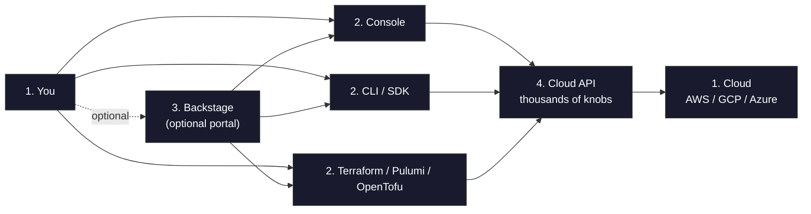
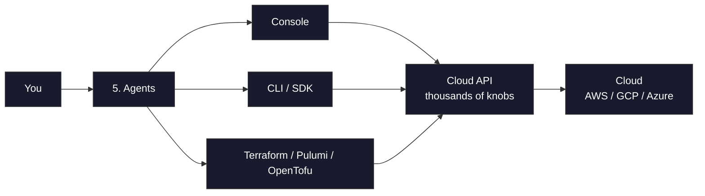
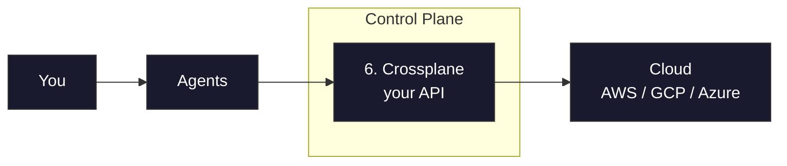
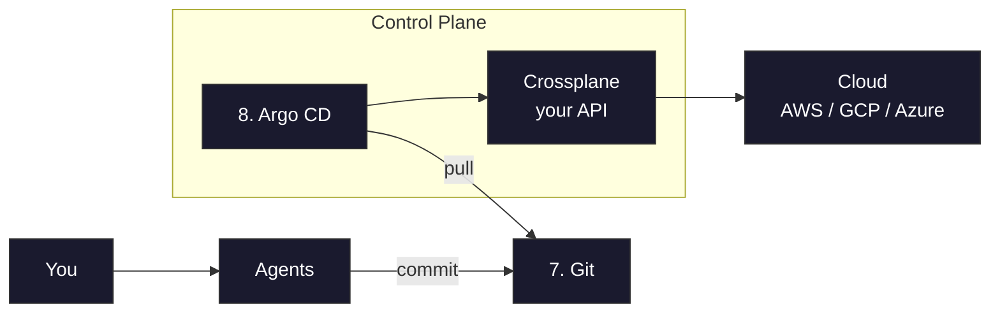
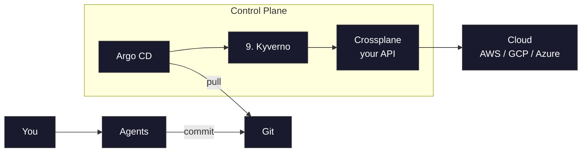
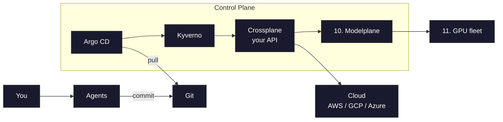

+++
title = "AI Agents Are Non-Deterministic. So Are You. Deal with It."
date = 2026-08-03T15:00:00+00:00
draft = false
+++

Let me start with a question. Do you like games? Video games, board games, whatever it is. And would you play them all day if you actually could? I know I would.

Here's my problem. I can't. I like games. But I also like money. Money for rent, for food, for more games. And to get that money, I have to get some shit done for the company that pays my bills. That's the deal.

So my real dream was never "more games." It's getting the work done without me having to do it, so I can get back to the controller. There's all kinds of work I'd happily hand off, but I want to zoom in on one slice of it: the ops work. Provisioning the infrastructure, wiring the databases together, deploying apps, keeping the whole thing running. That's what I'm trying to get AI agents to do for me. Today.

And that dream is not crazy. It's not just hype. An agent really can do that work. It provisions the clusters, wires up the databases, fixes the broken pipeline, and you get to lean back and pick up the controller.

But there's a catch. And right about now, you're probably yelling at the screen. In your head, you're yelling at me. AI is not deterministic! Well, first of all, I can't hear you, so please stop yelling at your monitor. And second, you're right. That agent working for you is non-deterministic. Give it the same task twice and you can get two completely different answers. And it'll do risky things with total confidence, whether it's right or whether it's dead wrong.

But sound familiar? Because that's you too. Give the same task to two engineers, or the same engineer on two different days, and you get two different answers, each delivered with the exact same confidence.

The only real difference is that you are so annoyingly slow. You make the occasional mistake. An agent makes a thousand an hour. And it never gets tired.

<!--more-->



## Controlling Non-Deterministic AI Agents

So if non-determinism is the problem, here's the good news. We already solved it. Not recently, and not for AI. We solved it for ourselves, years ago, back when the unpredictable, overconfident actors in the room were human beings.

Think about it. We don't let an engineer SSH straight into production at three in the morning and run whatever they feel like. You open a pull request. Someone reviews it. A policy checks it. A pipeline applies it. We built an entire discipline around one simple fact: people are fallible, and people are non-deterministic.

And here's the part that matters. AI agents are just more of those actors. They're not some brand new kind of threat that needs a brand new kind of defense. The same guardrails we built for fallible humans work on agents too. They're just knocking on a door we locked years ago.

Now, will we eventually come up with better ways to handle agents specifically? Almost certainly. We usually do. But that's tomorrow's problem. Today, the solution already exists. It's battle-tested, it's sitting right there, and it's the one we're going to use until something better comes along.

## AI Agents and Cloud APIs

So let's build that leash, one piece at a time. And to build it, we have to start where all of this began, long before any agent showed up. Just you and the cloud (1). You want a cluster, so maybe you click through the console, maybe you write some Terraform (2). Or maybe, if your platform team got fancy, you click a button in a self-service portal like Backstage (3), which just runs those same tools for you under the hood. Either way, it all funnels into the same place: an API (4). The giant, sprawling one that AWS, or Google, or Azure puts in front of everything. And whichever path you took, it was you, in that seat, driving it yourself. For years, that was the job.

Now we hand that seat over to a swarm of agents (5). And they do exactly what you did, through the exact same means. A bit of `curl` here, the provider CLI there, some Terraform. They talk straight to the cloud. Except they never sleep, and they do it a thousand times an hour.

Now I want to be precise about what the problem actually is, because it matters in a minute. It is not that the agents are calling an API. Agents are fantastic at calling APIs. The problem is which API. They're holding your cloud credentials, pointed straight at the cloud's own API, the giant, unconstrained one that follows nobody's rules. Nothing narrows what they can ask for. Nothing reviews what they send. And there is no undo.

That's the loaded gun. A non-deterministic swarm, firing straight at production, full credentials, zero constraints.

This is the part that should scare you. So let's fix it. One problem at a time.

## Crossplane: Your Own Cloud API

So the first fix is not to take the API away from the agents. It's to give them a better one. Yours. We put a control plane in the middle, and this is Crossplane (6).

Here's what that buys you. Your platform team gets to define what a "cluster" even means at your company. And a cluster is just my example here. It could be a database, a message queue, an entire application environment, whatever your teams keep asking for. Whatever it is, you define it. Not the cloud's two hundred knobs, but the ten you actually care about. And, just as important, how that thing complies with your rules. Only the approved regions. Private networking. Sane node sizes. The right tags so finance doesn't come knocking. All of it baked into one blessed abstraction.

And in a cloud like AWS, one thing is rarely just one API. A cluster isn't only a cluster. It's the cluster, plus the node groups, plus the VPC, plus the IAM roles, each its own API with its own pile of knobs. So the agent no longer has to pick the right two hundred settings out of thousands, spread across all of them, and pray it landed on a compliant combination. And as far as I know, models aren't religious, so praying wouldn't help them anyway.

It just asks for a cluster. And what it gets back is compliant by construction. The agent can only ever ask for what your API exposes, which means the blast radius just shrank to exactly what you decided to allow. And because that API is yours, you decide what sits behind it. This particular composition, for example, can turn that one request into an EKS, GKE, or AKS cluster. That's a choice the platform team baked in, not something the agent picks.

And there's a bonus, and it takes us right back to where we started, with non-determinism. What the agent hands the control plane isn't a fire-and-forget command. It's a declaration of the state it wants. And once that desired state exists, getting the world to match it is a deterministic, mechanical job. The control plane reconciles reality to the declaration, again and again, and corrects any drift. That machinery doesn't improvise, and it has nothing to do with agents, or with humans. So no, we haven't made the agent deterministic. We can't. But we've taken all of that non-determinism and squeezed it down to a single point: what gets declared. Everything downstream of that declaration is now boringly, reliably deterministic. Hold onto that, because in a minute we're going to put guardrails around the one unpredictable thing that's left. The declaration itself.

But notice what hasn't changed yet. The agents are still applying straight to the control plane. Whatever they declare goes live the instant they say so. Still no review. Still no history. Still no undo.

## GitOps for AI Agents

So we take that access away. From everyone, and everything. Nobody applies to the control plane directly anymore. Not the agents. Not you.

The only way in is to commit to Git (7). And then Argo CD (8), or Flux, pulls from Git and reconciles the cluster to match.

Look at what that does to the swarm. It can't touch production even if it wanted to. There's no door left except Git.

And now you get a choice. You can require a review on every single change. And this is the fun part: the reviewer doesn't even have to be human. One agent can review another agent's pull request. Or, if you trust the swarm more, you let it merge to main and apply automatically.

Either way, you get the thing that actually matters. Remember that declaration, the one point we squeezed all the non-determinism into? It's now version-controlled. You get a full audit trail. The complete history of every desired state you've ever had.

And git revert as your undo button.

## Kyverno Policies as Guardrails

Now, whether you reviewed every change or let the swarm merge on its own, there is one more layer you want. One that doesn't depend on anyone catching anything. Policies. And the tool enforcing them here is Kyverno (9).

These aren't "should we do this?" They're "this is never allowed," full stop. And remember those guardrails I promised, the ones around the declaration itself? These are them. Your policies run automatically on every single change, whether it came from an agent, from a pull request, or from you at three in the morning. They don't get tired. They can't be argued with. They can't be talked into an exception.

So whether a bad change got reviewed and slipped through, or was never reviewed at all, your policies stop it. Deterministically. Accidents and bad actors, both, hit the same wall.

This is the leash. And look at what we actually built it out of. GitOps. Policies. A control plane. None of it is new, and none of it is some AI vendor's shiny new product. Every piece already exists, it's open source, it's sitting in the CNCF, and it's there for the taking. Whether you're already using it, well, that's a different conversation.

## Self-Hosted AI Models with Modelplane

One last piece. Everything we've built so far governs your infrastructure. But your agents depend on something else. Models. And if you're shipping your prompts and your data off to somebody else's API, then that, right there, is the one part of this whole loop you don't control.

Sound familiar? It's the exact same problem we started with. An API that isn't yours. So we do the exact same thing we did before. We make it ours. We put inference on the same control plane. This is Modelplane (10), and under the hood, it's essentially Crossplane compositions.

Now, is this worth doing for everyone? No, and I won't pretend it is. If you're a small shop, sending your prompts to a hosted API is perfectly fine, and almost certainly cheaper. Running your own inference only starts to pay off when you're big enough that the math works out, or when your data simply isn't allowed to leave the building. If that's you, this is how you keep it yours.

So "serve this model on my GPU fleet" (11) becomes just another declarative resource. It sits right next to your cluster. It flows through the same Git, the same policies, the same reconciliation. The same leash.

And now the whole loop, what the agents do, and the models they run on, lives on infrastructure you own.

## Putting AI Agents on a Leash

So look where we ended up. That swarm of agents is still doing all the work. Still non-deterministic. Still tireless. Still a thousand actions an hour. Nothing about that changed, and nothing needed to.

What changed is everything around them. Every single thing they do now runs through a leash you built. Desired state instead of blind commands. Git, so nothing reaches production without a trace. Policies, so the rules hold whether anyone is watching or not. And the same control plane running your models, too.

And here's the kicker. You didn't buy a new AI platform to get any of this. It's Crossplane. It's Argo CD. It's Kyverno. All CNCF. Not one of them was built for AI, and every one of them is either already running in your cluster or one install away. Agents don't need a new platform. They need yours.
