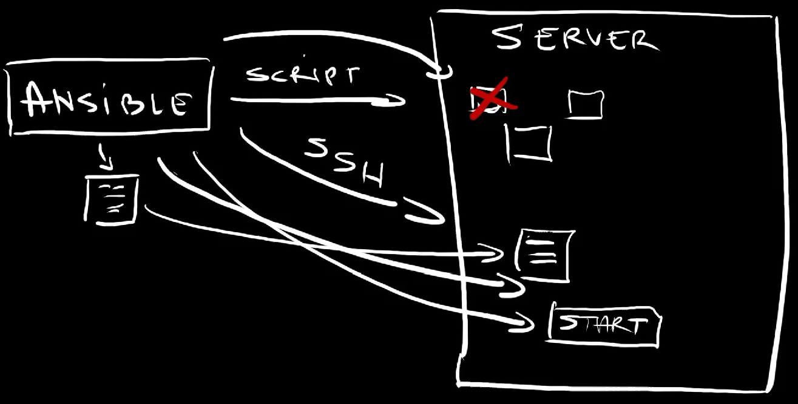
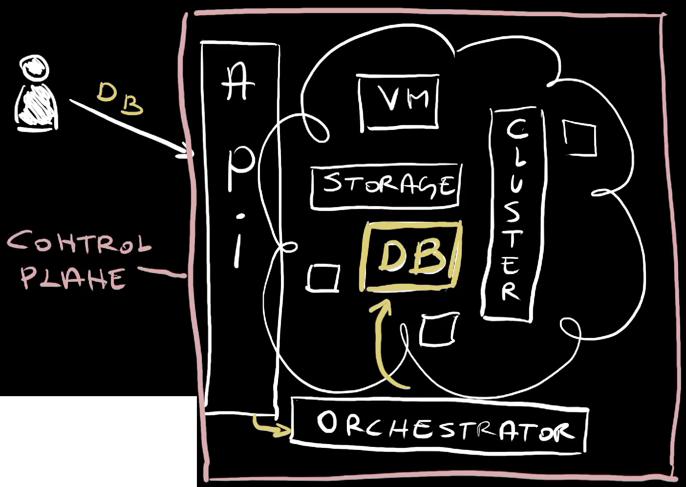
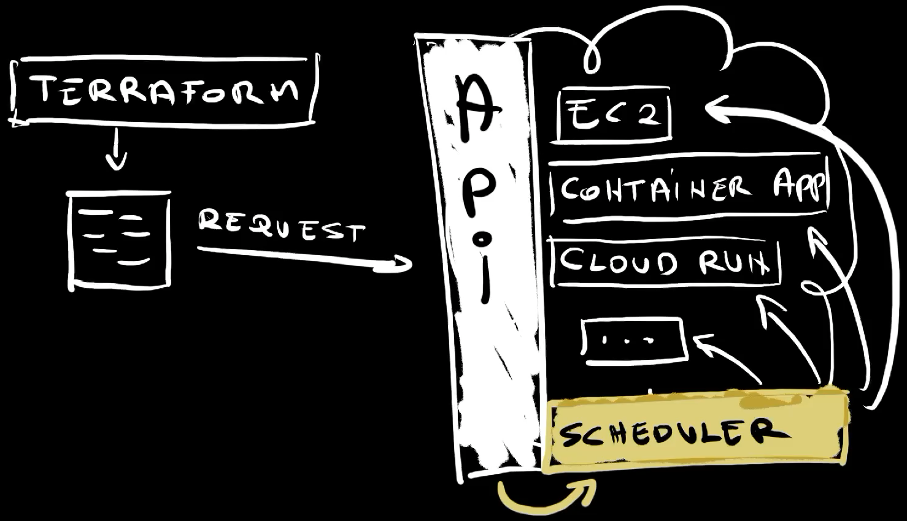
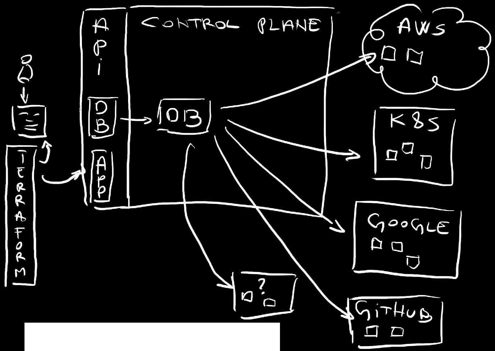

+++
title = 'Terraform vs. Crossplane vs. Ansible - Rivals or Allies?'
date = 2024-05-27T16:00:00+00:00
draft = false
+++

I am often asked to compare Crossplane with Terraform, or Pulumi, or Ansible, or any other tool that primarily manages resources, be it those in hyperscalers like AWS, Google Cloud, and Azure, or in Kubernetes, or anywhere else. Well... Today I'm here to tell you that none of those tools are going away any time soon. We need all of those. We need configuration management tools like Ansible, we need Infrastructure-as-Code (IaC) tools like Terraform and Pulumi, and we need control planes, be it opinionated ones like AWS, Google Cloud, and Azure, or those that allow us to build our own control planes like Crossplane.
<!--more-->



Not only that I will argue that those tools fullfil different purposes and complement each other, but I will even make outraged claims like that Terraform and Helm serve the **same purpose**.

This will be one of those videos where you are likely going to get mad at me and yell at your screen hoping that I can somehow hear you. If that happens, my advice is to calm down since my goal today will be to show you how all those can, no, should work together. They should be treated as a group of friends singing Kumbaya (my Lord, Kumbaya). Now, just to be sure that your adrenalin keeps pumping, I will also claim that many of the tools I will mention missunderstood their strengts and ended up trying to perform tasks they are not good at.

Each good story starts at the begining, and this one will not be an exception.

Long long long time ago, we realized that managing resources through Shell scripts alone is just silly and we got tools like CFEngine, Chef, Puppet, and Ansible. They all essentially did the same thing. They all helped us manage resources. What made them very different from the tools that came later, is their focus on... Well... How to put it... I got it. Their focus was on anything but APIs. If you need a server, Ansible can execute scripts that will install whatever is needed on that server. It will SSH into it, it will copy files we need, it will start some processes and it will stop others, it will change values in a configuration file, and so on and so forth.

Back then, we called those **Configuration Management** tools.

Then something amazing happened. We got AWS and other hyperscallers followed shortly afterwards. Now, for this story, the importance of hyperscalers is not that they enabled us to get VMs, storage, databases, clusters, and what-so-not, but something completely different. Hyperscalers thought us the importance of APIs. Instead of dealing with random scripts, commands, and what so not, we could send requests to APIs to request resources we need. Just as importantly, hyperscalers introduced orchestration. We could request what we need by passing the desired state to the APIs and orchestrators behind those APIs would make it happen. Those APIs and orchestrators combined produced control planes.

That's when we got a new type of tools we call Infrastructure as Code (IaC). It all started with Terraform. Those tools enabled us to define a state of what we want. Nevertheless, that name is wrong and missleading since both the tools before it and the tools after it provided ways to define something as code. Also, it was never only about infrastructure but any type of resources meaning both hardware and software. 

What made Terraform and the tools that came afterwards different is that they were focused on sending requests to APIs. They were born when hyperscalers like AWS, Google Cloud, and Azure became a thing. What made hyperscalers very different than what we had before are the APIs. Everything available in hyperscalers is behind APIs. If we need a new VM, all we have to do is send a request to an API. If we need to find out the state of that VM, we send yet another request to the API. If we need to remove that VM, we send yet another request.

At that time, most of what we could do on-prem was accessible through scripts, commands, manual instructions, witchcraft and sorcery. Hyperscalers changed that. Hyperscalers are different. They can be instructed only through APIs. Period. Terraform was one of the first to realize that the we needed help in sending requests to those APIs.

Hence, I can describe Terraform and other similar projects as tools that help us translate code into API requests. We can write HCL and Terraform will transform it into Google Cloud API requests. We can write Go code and Pulumi will help us transform it into API requests to Azure. We can write JSON templates with Cloud Formation, and it will help us translate it into AWS API requests.

The main purpose of **Infrastructure as Code** tools is to **transform code into the format understood by an API**.

Behind those APIs are schedulers that take those requests and convert them into actual resources. That can be EC2 instance in AWS, Container App in Azure (8), Cloud Run in Google (9), or anything else (10). A request is sent to an API, it is picked up by a scheduler or a controller which creates a resource (11), or updates it, or deletes it. That's how all hyperscalers work.

Hence, we have a 4 step processes. 

1. We **write code** in a specific format, be it HCL, XML, YAML, Go, or anything else.
2. We use tools that **transform code into API requests**.
3. Those requests are picked up by a **control plane** which does whatever needs to be done to create, update, or delete actual resources like VMs, databases, or anything else.
4. Finally, **requests are answered** right away with acknowledgements or once actual resources are provisioned.

*As a side note, Ansible and other tools that were created before Terraform eventually adopted the "API model" but they were not designed with that as the primary focus.*

The important note is that Terraform does not act as a control plane but as one-shot executor that sends API requests. Terraform assumes that there is a different process that ensures that specific resources are in a specific state by looking for drifts, by doing reconciliation, and whatever else they're doing. In other words, Terraform's job is finished once it gets the answer from the API while control planes work non-stop and are accessible only through APIs.

The API-only approach championed initially by hyperscalers provided tremenduous advantages. We all know how to talk to them, what the schemas are, and so on and so forth. As a result, we got an explosion of the tools. AWS CLI is doing the same thing as Terraform. It transforms arguments of a command into API calls. A VS Code plugin is also doing the same thing. It transforms user input obtained from a form into API requests. The number of tools that can request something from AWS is close to infinite and they all do the same thing. Transform a user-friendly or, to be more precise, a developer-friendly input into API requests. As a matter of fact, even if we go to AWS console in a browser and do something over there, that something will also be transformed into API requests.

From that perspective, Helm is essentially serving the same purpose as Terraform. We use it to transform Go templates into Kubernetes API requests which happen to accept YAML and JSON as request formats. If we ignore the fact that Helm works only with Kubernetes API while Terraform supports almost any API known to men, they are essentially doing the same thing.

Crossplane is also transforming code into API requests. We can define a Managed Resource like, for example, AWS EC2 instance as YAML and Crossplane will transform that into whatever AWS API expects. From that perspective, Terraform, Helm, and Crossplane serve the same purpose. However, that is not the point since Managed Resources are not why we use Crossplane. That's a necessity, but not the main reason why people are using it.

Crossplane's main mission is to enable people to create control planes that act in a similar way as those in AWS, Azure, and Google Cloud. It allows teams to define APIs and controllers that manage resources by making API requests to AWS, Google Cloud, Azure, and other destinations. Those controllers are not one-shot but continuously calculating drifts and reconciling them.

Now, it might sound strange that we need control planes to manage resources in control planes, but there is a very good reason for that. These days that reason is often explained through platform engineering. APIs in AWS, Google Cloud, Azure, and other cloud providers are low-level. They are designed to cater needs of everyone. As a result, we need to combine VPCs, with subnets, with internet gateways, with VMs, with... We need to combine all those low-level resources to get something meaningful like, for example, a database, or a cluster, or almost anything else. That creates friction since only a limited number of people in a company is comfortable with such low-level abstration.

On top of that, **everyone is multi-cloud** these days.

Now, you might say that's not your case. You might say that you use only AWS, or only Google Cloud, or only Azure. If that's the case, you are confusing hyperscalers with cloud services. GitHub is cloud. Datadog is a cloud service. Grafana, Elastic, and many others are all either cloud-only services or have that as an option. Cloud is SaaS. Cloud is when we delegate management of resources to a third-party company and when services are accessible through APIs. At the same time, all cloud services are based on control planes.

So, we need to create custom APIs tailor-made for our specific needs and backed by controllers or schedulers that manage resources behind those APIs. That results in the need for custom control planes.

We can create an API for a database that contains only the needed fields, and abstract the complexity. By creating our own APIs we can say "this is what is needed to get a database" or "this is what is required to run a backend application". That something can be expanded into a number of resources in AWS, or in a Kubernetes cluster, or in Google Cloud, or in GitHub, or anywhere else. It can also be execution of other tools like Atlas Operator for database schemas, dashboards in Grafana, and so on and so forth. The point is that we create APIs that define something meaningful and let a control plane convert that into low-level resources, and continuously manage those resources.

Here comes an important note. Just as AWS does not care how we send requests to its API, Crossplane or any other control plane does not care how we do that either. Both AWS and Crossplane care only what's happening after they receive something through their APIs.

Hence, from the user perspective, from the perspective of a person that needs to request a desired state or initiate an operation through an API, there is still the need to define that state somehow and to convert it into API calls.

That's where Terraform, Pulumi, Helm, or any other tool comes in. We need those tools to manage API requests. That's why I don't believe that Terraform and Pulumi are competing with Crossplane. They are the tools that transform code (8) into API requests (9). Crossplane creates those APIs and acts as a scheduler with control loops. It is a control plane.

Hence, Terraform and Pulumi compete with Helm and other similar tools that are designed to convert code into API requests. They complement Crossplane since Crossplane does not have a mechanism to convert code into client-side requests. Crossplane enables us to create APIs and relies on other tools to convert code into client-side requests. Those tools can be Helm, Terraform, Pulumi, or any other similar tool.

The problems arrise when we misinterpret the primary function of a tool. Each tool can do more than its core function, yet that does not mean that is is good at doing "side hussle".

**Configuration Management** tools like, for example, Ansible are designed to **execute commands**, **modify files** residing in a remote location, **execute scripts**, and similar operations. They can convert code into API requests, but that's not what they're designed to do and they tend to do that poorly.

**Infrastructure-as-Code** (IaC) tools are good are converting **code into API requests**, be it to AWS, Google Cloud, Azure, Kubernetes, or any other APIs, including custom ones. They are not orchestrators, even though many are trying to use them as such. They do not expose APIs to end-users, but operate on the level of files. They are not control planes.

We should not call those tools Infrastructure-as-Code since they perform the same core function as Helm or even `kubectl`. The problem is that I do not have a better name for such tools. Nevertheless, what matters is that they convert code into API requests, mostly for the purpose of propagating the desired state to an API.

**Control planes** are designed to **expose APIs** to end users and perform **scheduling**. They watch for **drifts** continuously. They do **reconciliation**, and all the other things we're already used to. Control planes are, at the same time, acting as Infrastrucutre-as-Code tools since they can invoke other APIs as well, but that's not their primary purpose. They are meant to expose APIs and do orchestration, drift-detection, and reconciliation.

With all that in mind, I can safely say that we need all three types of tools. Unless everything is accessible through APIs, we need configuration management tools. That is especially true for those running their own datacenters. We should strive to go towards API-only systems, but that might not be the reality for all.

We also need a way to convert code into API requests. Using `curl` to instruct a control plane what to do is too tedios. That's where Terraform, Pulumi, Helm, and other similar tools come in.

Finally, given that hyperscalers provide APIs for low level resources, we often need to define our own. For example, we might need to define what it means to have a database both on the API level, but also on the orchestration level. That's where control planes come in and we often have to have our own custom made on top of generic ones like AWS.
