+++
title = "Infrastructure with AI Agents for Dummies"
date = 2026-06-22T16:00:00+00:00
draft = false
+++


AI agents are amplifiers. If you're good at your job, agents make you better. You do more great things, faster. But if you're bad at your job, agents amplify that too. Where you used to cause a slow trickle of shit, now you have the means to unleash a full-blown **shitstorm**, at scale, in minutes.

Now, AI is all the rage these days, and for good reason. So of course people are using agents to manage real resources: infrastructure, databases, applications, all of it. The question is what happens when they do. That's what we're looking at today: an agent managing actual cloud resources, what goes wrong, why it goes wrong, and what it takes to make it work properly.

<!--more-->



## Setup

```sh
git clone https://github.com/vfarcic/infra-with-ai

cd infra-with-ai
```

> Make sure that Docker is up-and-running. We'll use it to create a KinD cluster.

> Watch [Nix for Everyone: Unleash Devbox for Simplified Development](https://youtu.be/WiFLtcBvGMU) if you are not familiar with Devbox. Alternatively, you can skip Devbox and install all the tools listed in `devbox.json` yourself.

```sh
devbox shell

chmod +x dot.nu

./dot.nu setup

source .env

git switch agents
```

> This demo is using [OpenCode agent](https://opencode.ai). Howerever, if you're following along, all the instructions should work with any coding agent with a few minor changes. If you do choose OpenCode, [install it](https://opencode.ai/download), type `/connect` to connect it to your favorite AI provider, and `/model` to select which model to use. Otherwise, replace the command that follows with whichever command starts your agent.

```sh
opencode
```

## AI Agents with Cloud CLIs


Someone needs a database. Maybe it's for an app they're working on, maybe someone just told them to set one up. They have an AI agent at their fingertips, so they do the obvious thing. They ask for one.


Let's see what happens. I'm using OpenCode as the agent, but it could just as well be [Claude Code](https://claude.com/claude-code), [Gemini CLI](https://github.com/google-gemini/gemini-cli), or whichever agent you prefer. The agent is in Plan mode, so instead of immediately executing whatever comes to its mind, it will propose a plan first. The prompt is as simple as it gets.


> Press `Shift+Tab` to switch to the `Plan` mode.

```text
Create a database in GCP
```


> Answer questions to the best of your abilities.


The agent did not run off and create something random. It stopped and asked which GCP database we actually want. Cloud SQL PostgreSQL? Cloud SQL MySQL? AlloyDB? Firestore? Spanner? Each option comes with a one-line description, which is helpful, but a one-liner is hardly the basis for a decision like that.

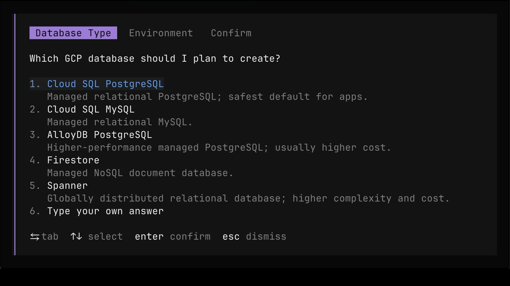

Then it asked about environment sizing.

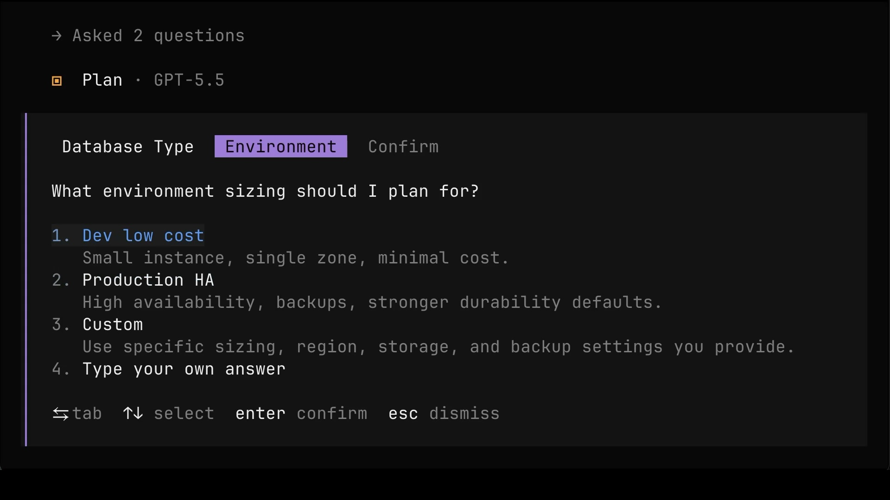

Once it got the answers, it laid out the steps it plans to perform and listed the values it still needs from us before execution.

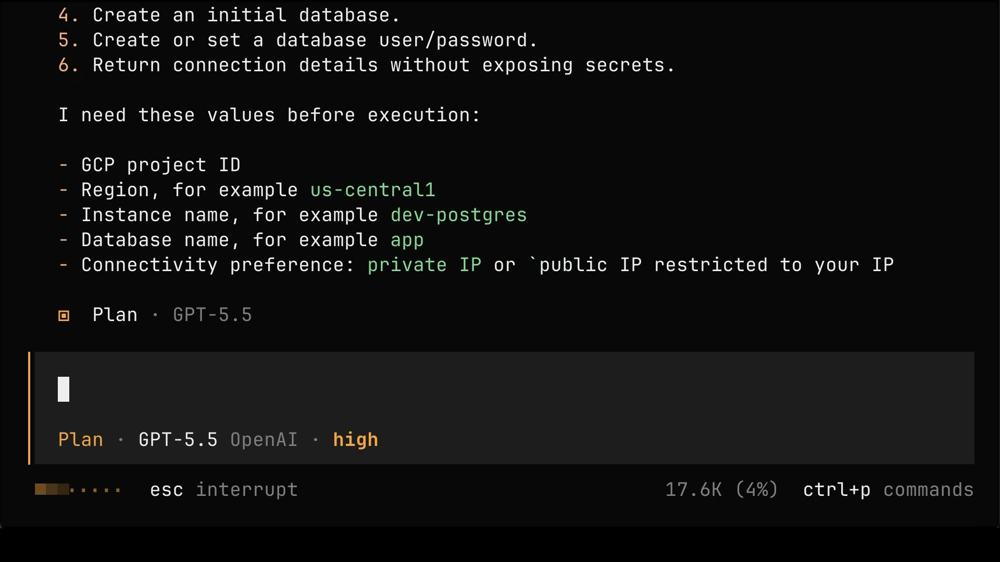

Now, pause for a moment, because those questions reveal the real problem. You need to understand GCP, or whichever platform you're using. The agent will ask questions, and you need to answer them. If you don't know whether you need Cloud SQL or Spanner, or whether exposing a database through a public IP is a good idea, you're stuck. You cannot answer what you don't understand.


It gets worse. AI will NOT ask you everything that should be asked. It often dumbs things down to a handful of multiple-choice questions. That's okay if you're a dummy but, if that's the case, you should not be managing anything.

On top of that, you need to understand how agents themselves work so you don

't get fooled by them. It's the same as with technical managers. If you don't know what to ask your team, you might just as well not ask them anything. You'll nod at whatever they say, and they'll do whatever they want.


```text
Create a new project with a unique value. Make it public. The rest is okay as you suggested.
```

We answered the way an inexperienced person would. Put it in a new project, make it public because that's convenient, and accept whatever the agent suggested for everything else.

TO

DO: screen-01: 03:07-06:17 (fast-forward)

The agent came back with the final plan. Dev sizing, lowest cost tier, high availability disabled, and public access open to all networks. To its credit, it even flagged the risk: `0.0.0.0/0` makes the database reachable from the public internet, and that is not recommended for production. But a warning is only useful if the person reading it understands the consequences. I don't. I'm a dummy, or, at least, I'm pretending to be one.

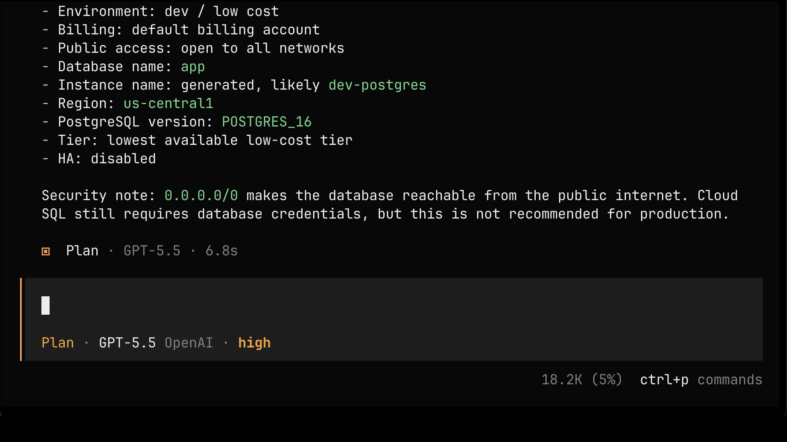


> Press `Shift+Tab` to switch to the `Build` mode.

```text
Do it
```

The plan looked fine to someone who doesn't know better, so we switched to Build mode, the mode where the agent stops proposing and starts executing, and gave it the prompt that does all the damage in this story.


Fifteen minutes later, it's done. The agent ran a bunch of `gcloud` commands, hit a few issues along the way, fixed them itself, and ended up with a working database. There's the user, the password, the public IP, and a ready-made `psql` command to connect to it. From anywhere. By anyone who gets hold of that string.

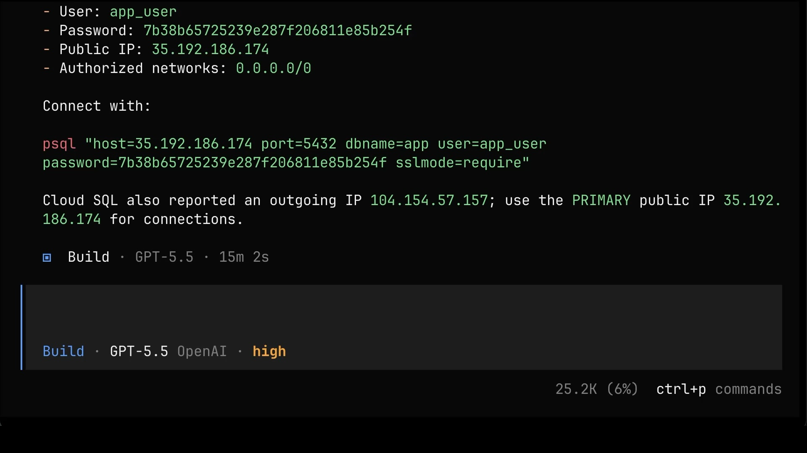

Notice what the agent used to do all of that. It used `gcloud`. Why? Because it happened to be on my machine. That's it. That's the whole reason. You need to know which tools you need, and you cannot let AI make that decision for you based on whatever it finds laying around.


Let me be blunt. You should get fired for even contemplating the option to manage infrastructure with `gcloud`. It's Everything-as-Code now. If you do that and you do not get fired, you should quit, because that's not the company you want to be in. The only thing worse than using CLIs to manage resources is clicking buttons in a web console. For that one, getting fired is not enough. That calls for ritual suicide.

Besides, what we got is only a fraction of what's needed for running a database. Is there an actual database inside that server? Are there schemas? Is it highly available? We don't know, and we didn't ask.

That's a shame, because asking is the one thing AI is genuinely great at enabling. Ask "why" and "how" all the time and an agent becomes a phenomenal teacher. That's not what happened today. Today we just said "do it".


And here's what makes that dangerous. 


Nothing visibly failed. The database works, apps can connect to it, and an inexperienced person looks at that and sees success. That's exactly the problem. "It works" hides everything that's wrong underneath it. AI is not an excuse for not knowing things.

Here's the only reasonable thing left to do.

> Press `Shift+Tab` to switch to the `Plan` mode.

```text
You fucked it up, and it's my fault for not knowing what I'm doing. Destroy everything you created.
```


The plan to clean up is simple. Delete the whole GCP project, and remove the local temp files where the agent stashed the generated password. Yes, the database password lived in temp files on my laptop this whole time. One more thing we didn't know about.

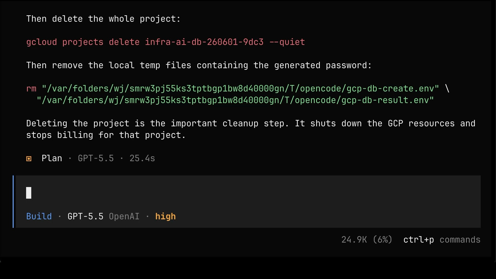


> Press `Shift+Tab` to switch to the `Build` mode.

```text
Do it
```

One more switch to Build mode, one more "do it", and everything is gone.

So, if letting an agent loose with whatever CLIs it finds on the machine is a firing offense, what should it use instead? The answer is clear. Infrastructure-as-Code. But which tool? That's next.


```text
/clear
```

> Press `Shift+Tab` to switch to the `Plan` mode.

## Ansible vs Terraform vs Crossplane

So which tool should it use instead? Let's walk through the options.


Ansible and the like? Don't even think about it. Tools like that were built for a different era, back when we managed our own servers, by hand, in our own datacenters, on technology that's now two decades old. The rest of the world switched to API-based management a long time ago. If you somehow didn't get that memo, fine, you've got plausible deniability, and you can keep telling yourself that Ansible is still a good idea. Everyone else should erase it from memory.


Terraform and the like? Now those are genuinely amazing tools. They paved the way and pretty much buried Ansible-style configuration management. Think of them as the second generation, focused on APIs and immutability instead of mutating servers in place. The trouble is that we're now in the third generation, where resource management is API-based, and the only APIs that really matter are the ones coming from Kubernetes, with Kubernetes acting as the control plane.

And that's where Kubernetes-native resource management comes in. Any tool that treats **Kubernetes as the control plane** for your infrastructure is a better choice today.

So why Kubernetes-native in the first place? Because Kubernetes doesn't just create a resource and walk away the way a one-off apply does. It continuously reconciles, watching the actual state, comparing it to what you asked for, and correcting any drift on its own, over and over, forever. You also get a single consistent API surface for everything, real role-based access control, and a huge ecosystem that already speaks that language.


So which one do we use? There are several good options: [Crossplane](https://www.crossplane.io), [Kro](https://kro.run), [Cluster API](https://cluster-api.sigs.k8s.io), [KubeVela](https://kubevela.io), and a few others. Why Crossplane, and not Kro, KubeVela, or Cluster API? Honestly, they're all reasonable. Crossplane just happens to be the most mature of the bunch, with the widest adoption and the broadest coverage of cloud resources. That's it. That's why we'll use it.


Here's roughly how it works. (1) You hand Kubernetes the desired state, a handful of manifests describing the resources you want. (2) Those land in the control plane cluster, where Crossplane runs right alongside the Kubernetes API. (3) Each manifest becomes a Managed Resource, or MR, a Kubernetes object that maps one-to-one to a real resource out at whatever cloud provider you're using, things like a database instance, a database, and a user. (4) Crossplane reconciles each of those MRs against the provider's API and creates the actual resources. (5) And then it keeps reconciling, forever, so that if anything drifts away from what you declared, it gets pulled right back.

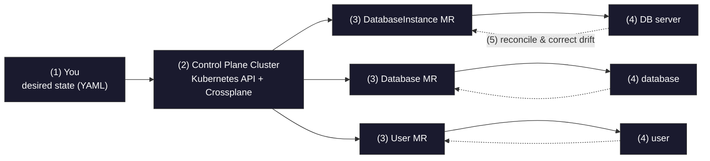
```mermaid
flowchart LR
    A["(1) You<br/>desired state (YAML)"] --> B["(2) Control Plane Cluster<br/>Kubernetes API + Crossplane"]
    B --> C1["(3) DatabaseInstance MR"]
    B --> C2["(3) Database MR"]
    B --> C3["(3) User MR"]
    C1 --> D1["(4) DB server"]
    C2 --> D2["(4) database"]
    C3 --> D3["(4) user"]
    D1 -.->|"(5) reconcile & correct drift"| C1
    D2 -.-> C2
    D3 -.-> C3
    style A fill:#1a1a2e,stroke:#333,color:#fff
    style B fill:#1a1a2e,stroke:#333,color:#fff
    style C1 fill:#1a1a2e,stroke:#333,color:#fff
    style C2 fill:#1a1a2e,stroke:#333,color:#fff
    style C3 fill:#1a1a2e,stroke:#333,color:#fff
    style D1 fill:#1a1a2e,stroke:#333,color:#fff
    style D2 fill:#1a1a2e,stroke:#333,color:#fff
    style D3 fill:#1a1a2e,stroke:#333,color:#fff
```

So let's give the agent the exact same task as before, create a database in GCP, but with one crucial addition. We tell it to use Crossplane MRs. Same goal, completely different tool underneath.


```text
Create a database in GCP. Use Crossplane MRs.
```


Just like before, since we're in Plan mode, the agent comes back with a round of questions before it touches anything.

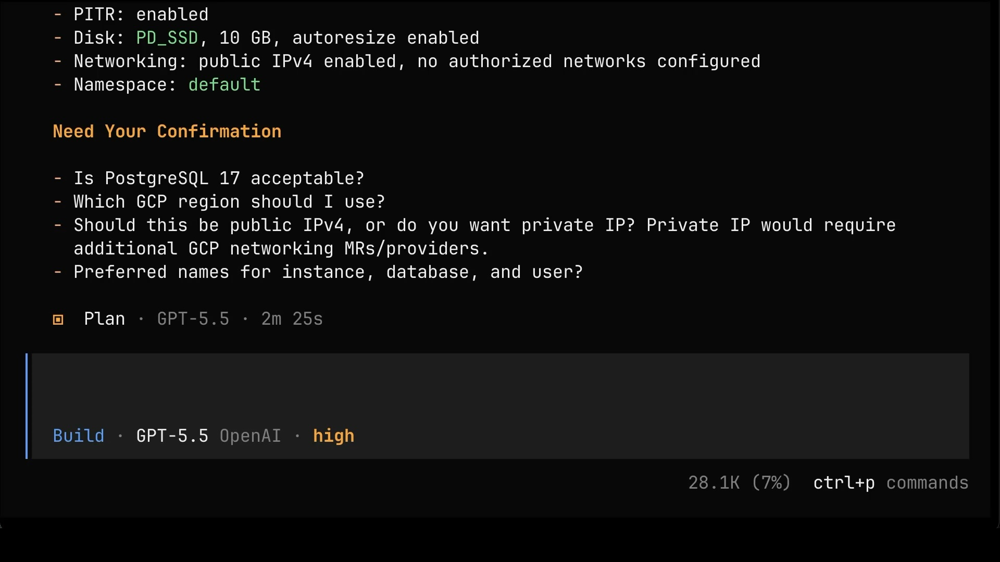

> Answer questions to the best of your abilities, or just "do it".


We answer its questions, switch over to Build mode, and let it run.

> Press `Shift+Tab` to switch to the `Build` mode.

```text
Do it
```


Some time later, it's done. We get the connection details: the project, the region, the instance, the database, the user, and the public IP.

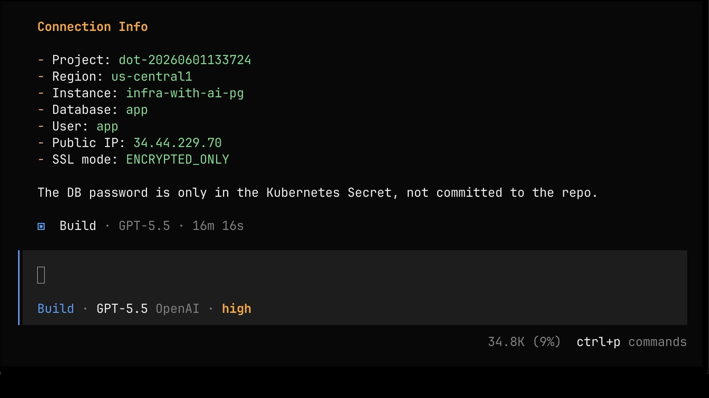


Now, before we get too excited, notice what didn't change. We still had to answer questions about GCP, and the agent still didn't ask everything that should have been asked. Switching from gcloud to Crossplane fixed the tool, but at this level, working directly with raw Managed Resources, it did not remove the need for you to actually understand the cloud underneath. Hold that thought, because that's precisely the problem Internal Developer Platforms are built to solve, by narrowing the surface down to what people actually need and are comfortable with. We'll get there.


Let's see what it actually built. Back in Plan mode, I ask it to output the resources it created.

> Press `Shift+Tab` to switch to the `Plan` mode.

```text
Output the resources that were created.
```


And there it is. Instead of a pile of imperative gcloud commands, everything is now a set of Crossplane Managed Resources, real Kubernetes objects describing the database instance, the database, and the user, plus a Kubernetes Secret holding the auto-generated password. This is the difference that matters. It's all declarative, it all lives in the cluster, and it can all be reconciled.

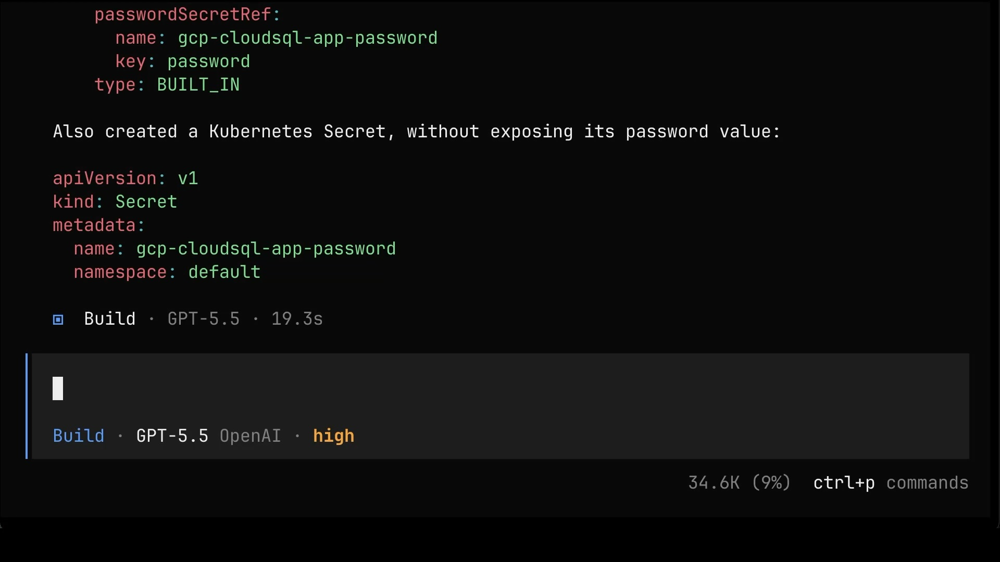

Here's the thing, though. There's so much more to running a database than a handful of Managed Resources. If you don't know what all of that involves, chances are plenty of other people don't either. And even if you do know, the next person might not. And even if everyone knows, it's still mind-numbingly tedious to assemble the same pile of resources into a working solution, over and over, every single time. That's the cue. That's where an Internal Developer Platform comes in.


```text
You fucked it up, and it's my fault for not knowing what I'm doing. Destroy everything you created.
```


And notice how much cleaner the cleanup is now. Because everything is a Kubernetes resource, the plan is just a handful of kubectl deletes for the instance, the database, the user, and the secret, plus removing the local manifest file. The agent even has the sense to leave the Crossplane provider and credentials alone, since it didn't create those. Compare that to chasing down whatever gcloud scattered around last time.

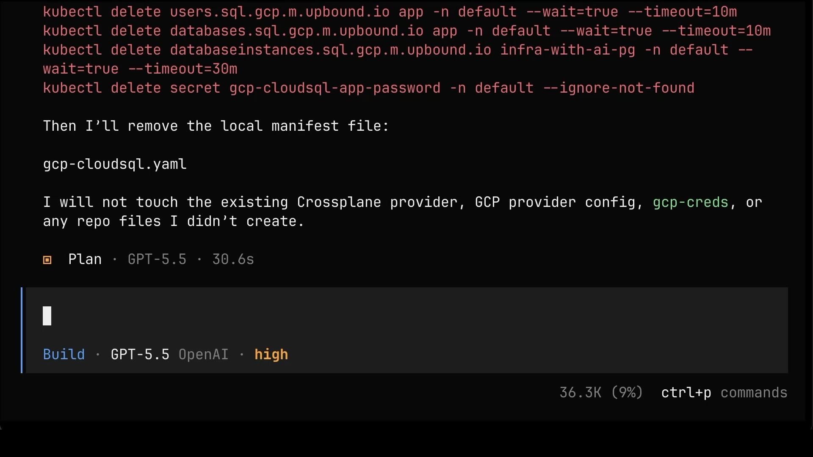


One more switch to Build mode, one more "do it", and it's all gone.

> Press `Shift+Tab` to switch to the `Build` mode.

```text
Do it
```


So Crossplane gets us off CLIs and onto a proper declarative, reconciled foundation. But we're still wiring up raw Managed Resources by hand, one at a time. The real payoff comes when we package all of that into something other people can use without knowing any of it. That's what we'll build next.

```text
/clear
```

> Press `Shift+Tab` to switch to the `Plan` mode.

## Internal Developer Platforms with AI Agents

So what is an Internal Developer Platform? Think of it this way. Somewhere in your organization there are people who actually know what running a database, a cluster, an application, or any other type of resource really means: the users, the schemas, the backups, the networking, all of it. An Internal Developer Platform is how those people package that knowledge into ready-made services that everyone else can consume without knowing, or caring, what's underneath. Instead of every person assembling piles of low-level resources and answering questions they're not equipped to answer, they get **one simple interface** that exposes only what they actually need.

And that brings us to Crossplane Compositions. A Composition is, in essence, a recipe. Someone who knows what they're doing defines, once, what "a database" means in your organization, which resources it expands into, and with which defaults, and exposes all of that as a new, simple Kubernetes API. And since it's all Kubernetes-native, you keep every benefit we talked about earlier: real APIs, drift detection, continuous reconciliation, access control, the whole package. That's exactly the mechanism an Internal Developer Platform needs.


(1) You create one small resource that says "I want a PostgreSQL database". (2) That resource, called a Composite Resource, or XR, lands in the control plane cluster, where the Composition picks it up and (3) expands it into all the underlying Managed Resources: the database instance, the user, the database, the schema, and whatever else your platform team decided a proper database setup should include. (4) From there, it's the same story as before. Everything reconciles against the cloud provider, continuously, forever.

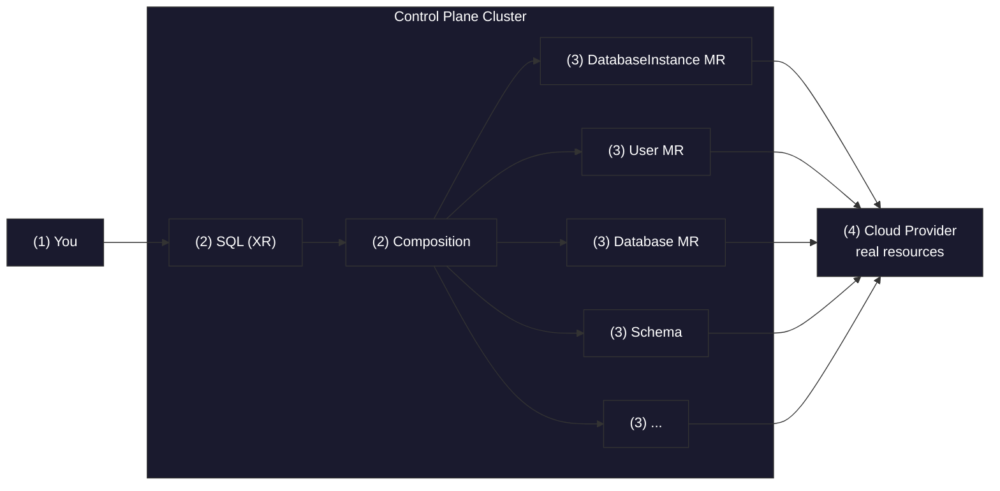
```mermaid
flowchart LR
    A["(1) You"] --> X
    subgraph CP["Control Plane Cluster"]
        X["(2) SQL (XR)"] --> COMP["(2) Composition"]
        COMP --> C1["(3) DatabaseInstance MR"]
        COMP --> C2["(3) User MR"]
        COMP --> C3["(3) Database MR"]
        COMP --> C4["(3) Schema"]
        COMP --> C5["(3) ..."]
    end
    C1 --> D["(4) Cloud Provider<br/>real resources"]
    C2 --> D
    C3 --> D
    C4 --> D
    C5 --> D
    style A fill:#1a1a2e,stroke:#333,color:#fff
    style CP fill:#1a1a2e,stroke:#333,color:#fff
    style X fill:#1a1a2e,stroke:#333,color:#fff
    style COMP fill:#1a1a2e,stroke:#333,color:#fff
    style C1 fill:#1a1a2e,stroke:#333,color:#fff
    style C2 fill:#1a1a2e,stroke:#333,color:#fff
    style C3 fill:#1a1a2e,stroke:#333,color:#fff
    style C4 fill:#1a1a2e,stroke:#333,color:#fff
    style C5 fill:#1a1a2e,stroke:#333,color:#fff
    style D fill:#1a1a2e,stroke:#333,color:#fff
```

Let's see it in action. Same ask as before, but this time we point the agent at the composition that's already in the control plane cluster.


```text
Create a database in GCP. Use Crossplane composition that is already in the control plane cluster.
```


Watching it work reveals one of the big advantages of doing this through Kubernetes. The APIs are discoverable. The agent poked around the cluster and figured out, by itself, which compositions exist, what their schemas look like, what can be done, and how. We didn't have to feed it files, docs, or anything else. That said, this would be even better with a custom agent or Skills. Those would already know that resources are managed through Crossplane compositions and which Kubernetes APIs match the intent, so we wouldn't need to spell any of that out in the prompt.

Once it figured it out, look at the plan. It boils down to a handful of simple values: a name, a region, a version, a size. Compare that to the interrogation we went through with raw Managed Resources. That's the whole point of the simplified interface. Users see only the things that actually matter to them, while everything else, the company policies, the security decisions, the best practices, is already implemented inside the composition by the people who know what they're doing.

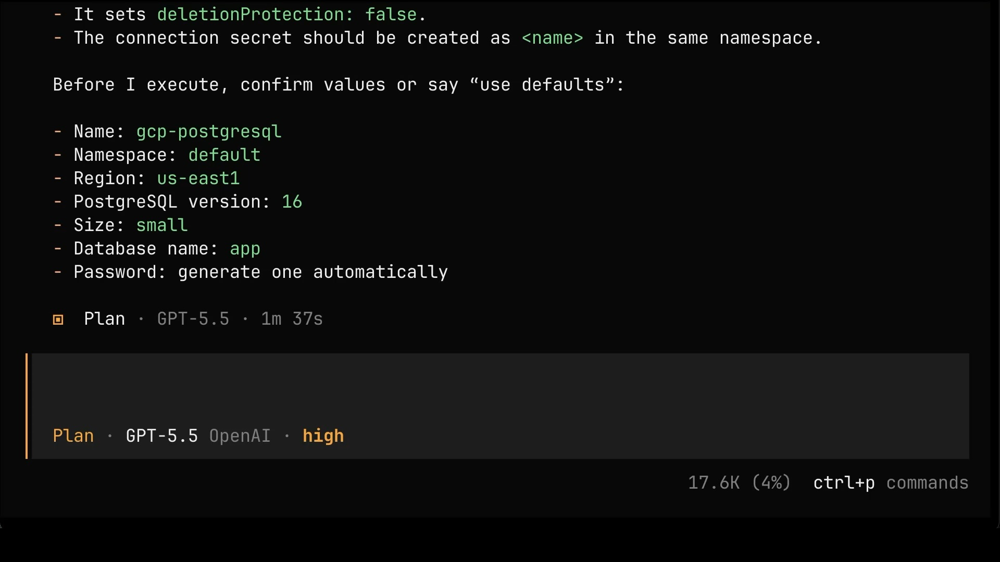

Remember, asking questions is the thing AI is genuinely great at enabling, so let's use it. What else could we have tweaked?


```text
What are all the options I can use as well as default values?
```


Among other things, the answer reveals that the database we're creating is not even tied to a single provider. There are compositions for GCP, AWS, Azure, and even a local one. The same simple interface, multiple implementations, all sitting in the same control plane, ready to be used.

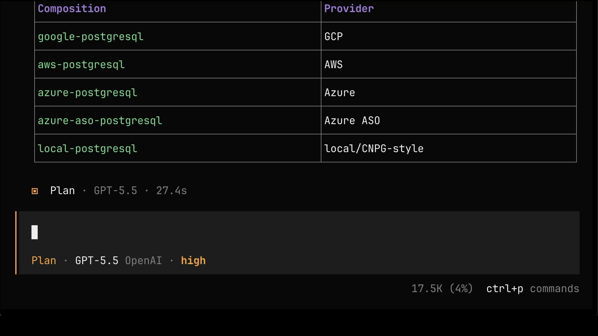

Now that we know what the composition offers, we can be more specific about what we want.


```text
Use the latest version, make it public, auto-generate a secret as a Kubernetes secret, create DBs db-01 and db-02, and create a sample schema for db-01. Keep the rest of default values.
```


The agent translates all of that into the resource, including a sample schema, and asks for a couple of confirmations before it executes anything.

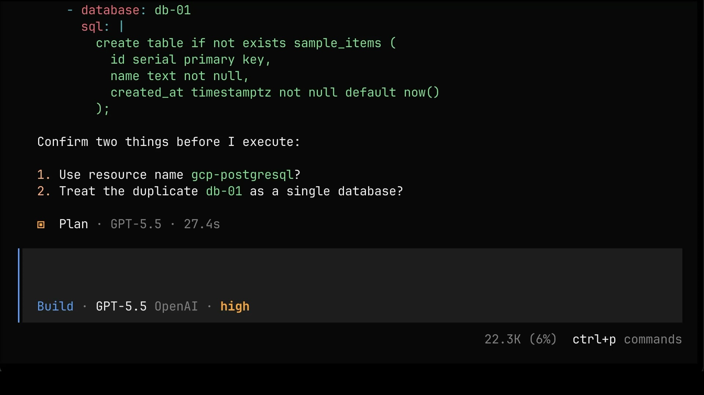

Here's an important note before we let it loose. Ideally, most people should have write access to only those composite resources, the simple, high-level ones like this database, and nothing else in the control plane cluster. No raw Managed Resources, no cluster internals, and certainly no direct access to the destinations themselves, be it AWS, GCP, Azure, or your own datacenter. Just the curated interface the platform team built for them.

Time to execute. We switch to Build mode and give it the green light.

> Press `Shift+Tab` to switch to the `Build` mode.


```text
Do it
```


A while later, everything is up. The composite resource and everything it spawned is Synced and Ready: the instance, the user, the databases, and even the schema. The agent also explains the choices it made along the way, like patching the instance tier when GCP rejected the composition's default for the PostgreSQL version we picked.

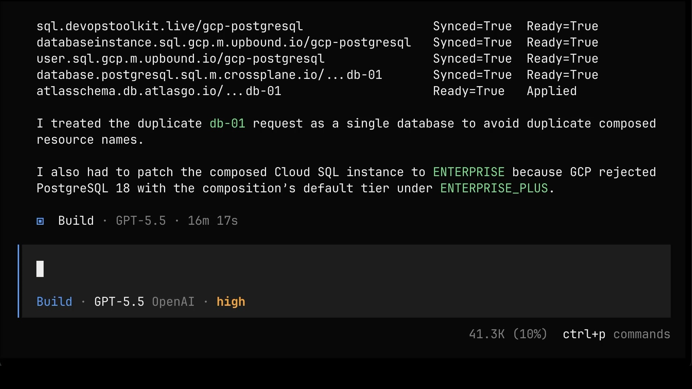


Let's get the full picture of what we ended up with.

```text
List all the resources that we created (including resources managed by those we created), depict their dependencies, and explain what each of them does.
```


By now I got tired of the whole plan-and-build dance, so this time I'll just fire away without switching to Plan mode first. Yes, that's stupid of me. But dummy is what dummy does.


```text
You fucked it up, and it's my fault for not knowing what I'm doing. Destroy everything you created.
```


Now, confession time. I was lying earlier when I said that, ideally, most people should have write access to only composite resources and nothing else in the control plane cluster. Most people should not have write access at all. Direct access to the control plane should be reserved for break-glass scenarios, those moments when everything else has failed and someone has to step in manually.

So how do changes get in, then? Through Git. You should still get fired for thinking you can be a software engineer without knowing that everything we do MUST be stored in Git. Enter GitOps. That's next.

## GitOps with AI Agents


So what is GitOps? It boils down to four principles. First, you have a **declarative desired state**. You describe what you want, not the steps to get there. Second, that desired state is stored in a way that is **versioned and immutable**, and that's exactly what Git gives us. Third, the desired state is **pulled automatically** by software agents. Nobody pushes changes into the system. And fourth, the actual state is **continuously reconciled** with the desired one, exactly like we saw Crossplane do, except now the desired state lives in Git.


Here's what that looks like in our case. (1) You, or your AI agent, push manifests to (2) a Git repository. That's the desired state, and that's the only entry point. (3) Argo CD, running in the control plane cluster, pulls that desired state from the repo and applies it. (4) From there, the chain we already know kicks in: the composite resource, the Composition, and the Managed Resources it expands into. (5) And the cloud provider ends up with the real resources, continuously reconciled at every step along the way. Nobody touches the cluster directly anymore. Git is the interface.

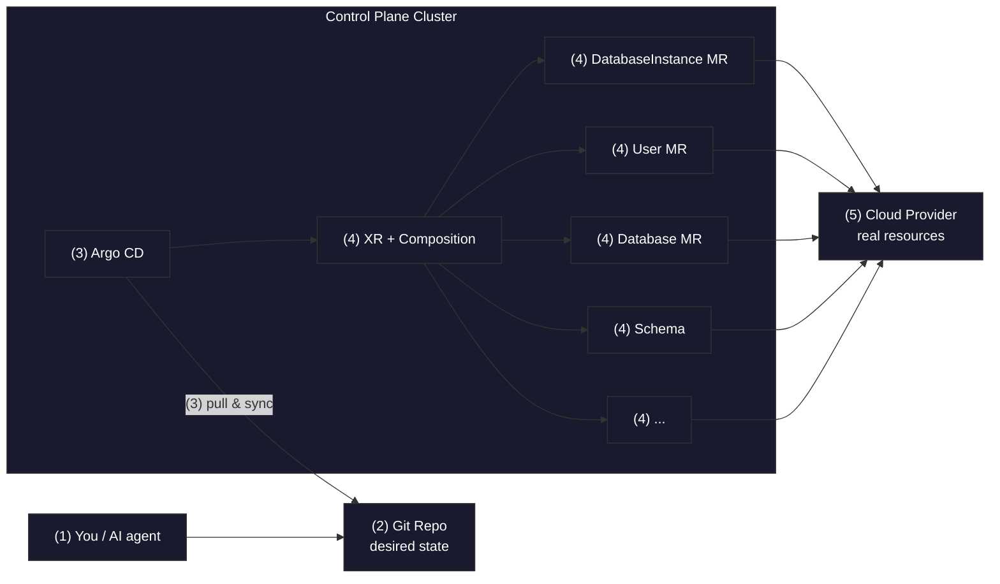
```mermaid
flowchart LR
    A["(1) You / AI agent"] --> G["(2) Git Repo<br/>desired state"]
    ARGO -->|"(3) pull & sync"| G
    subgraph CP["Control Plane Cluster"]
        ARGO["(3) Argo CD"] --> X["(4) XR + Composition"]
        X --> C1["(4) DatabaseInstance MR"]
        X --> C2["(4) User MR"]
        X --> C3["(4) Database MR"]
        X --> C4["(4) Schema"]
        X --> C5["(4) ..."]
    end
    C1 --> D["(5) Cloud Provider<br/>real resources"]
    C2 --> D
    C3 --> D
    C4 --> D
    C5 --> D
    style A fill:#1a1a2e,stroke:#333,color:#fff
    style G fill:#1a1a2e,stroke:#333,color:#fff
    style CP fill:#1a1a2e,stroke:#333,color:#fff
    style ARGO fill:#1a1a2e,stroke:#333,color:#fff
    style X fill:#1a1a2e,stroke:#333,color:#fff
    style C1 fill:#1a1a2e,stroke:#333,color:#fff
    style C2 fill:#1a1a2e,stroke:#333,color:#fff
    style C3 fill:#1a1a2e,stroke:#333,color:#fff
    style C4 fill:#1a1a2e,stroke:#333,color:#fff
    style C5 fill:#1a1a2e,stroke:#333,color:#fff
    style D fill:#1a1a2e,stroke:#333,color:#fff
```


Let's make it happen. I'm asking the agent to create a public repo, generate manifests for the resources we created earlier, push them there, and configure Argo CD to sync it all. I happen to use Argo CD, but [Flux](https://fluxcd.io) or any other GitOps tool would do just as well. What matters is that you do GitOps, not which tool pulls the changes.


```text
Create a public repo infra-with-ai-gitops, create manifests for resources we created earlier and push it to that repo, and configure Argo CD to sync it. If you need a secret, auto-generate it without Argo CD.
```


Some time later, it's done. The repo exists, the manifests are in it, Argo CD is syncing, and the database is up. And here's the beauty of it. From now on, this is the whole workflow: push an updated manifest to the repo, and that's it. Argo CD picks it up, syncs it, and everything downstream reconciles on its own. No kubectl, no cloud consoles, no direct access to anything.

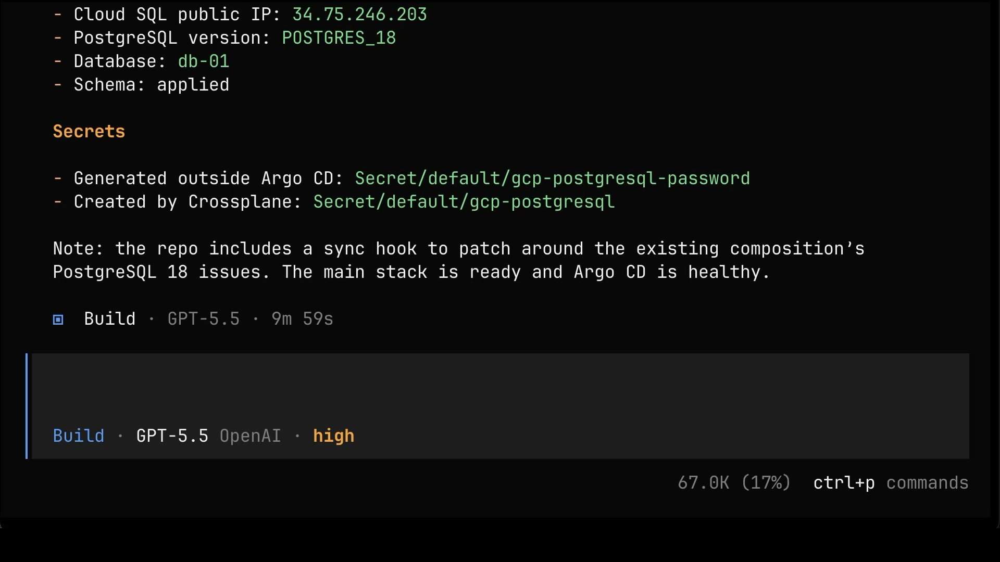


One last time, let's ask for the complete picture.

```text
List all the resources that we created (including resources managed by those we created), depict their dependencies, and explain what each of them does.
```


The list goes all the way down: the Argo CD application, the composite resource, the Managed Resources, and even the temporary helper database that [Atlas](https://atlasgo.io) spins up just to plan schema changes. Every single piece is accounted for, explained, and, from now on, managed from Git.

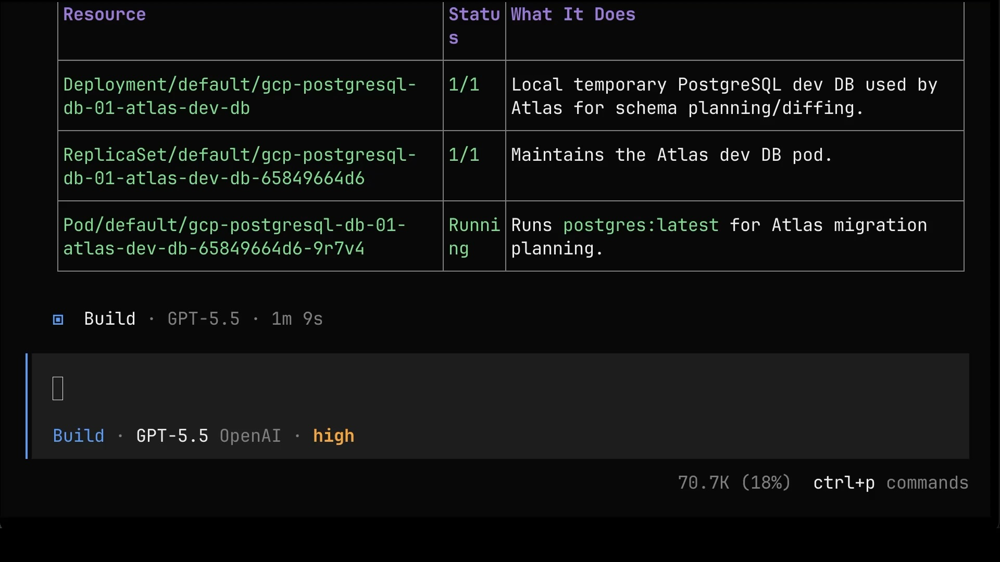


## AI Amplifies You

And that's the full journey. 


We started with an agent blindly running gcloud commands it found on my laptop, and we ended with a setup where the only thing anyone, human or AI, can do is push declarative manifests to Git, while Argo CD, Crossplane, and the composition take care of everything else. AI didn't remove the need to know what you're doing. It amplified it. The difference between a shitstorm and a great setup is still you.

So don't use agents to hide what you don't know. Use them to learn it. Ask "why" at every step, and the same agent that would happily build you a disaster becomes the best teacher you've ever had.

## Destroy

> Type the prompt that follows in your coding agent.

```text
Destroy everything we created.

exit
```

```sh
git switch main

./dot.nu destroy
```
