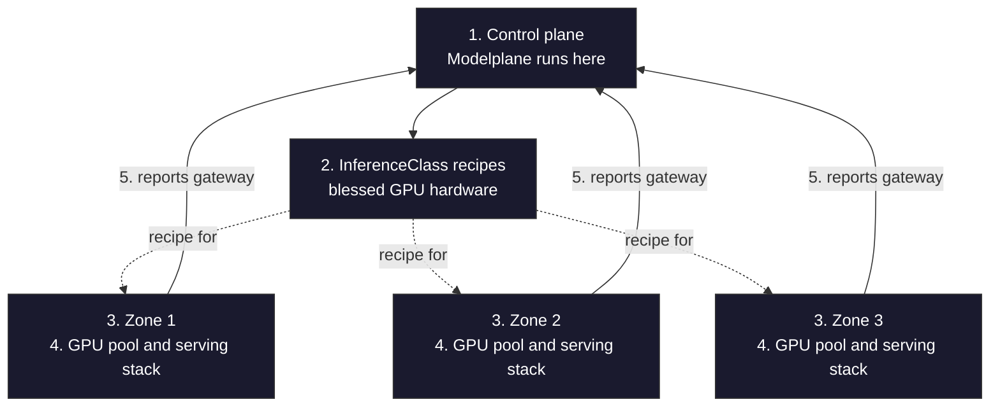
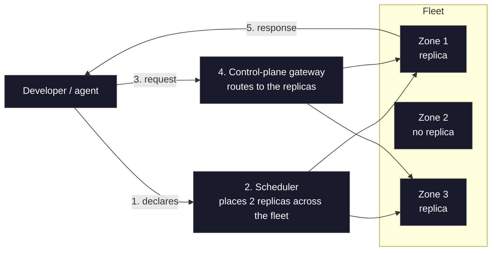

+++
title = "One Control Plane for Every GPU Cluster (Modeplane)"
date = 2026-07-20T15:00:00+00:00
draft = false
+++


We've been working on something new. A project called Modelplane. It's early, it's rough... but I think it's ready to fly.

But before I show you what it does, let me back up and explain the problem it solves. Because that's really where this whole thing starts.


Serving a single model on a single cluster is more or less a solved problem. Pick a serving engine, hand it a GPU, point some traffic at it, and you're done. The hard version is serving models at scale. GPUs are scarce and expensive, and they're scattered all over the place, across regions, across clouds, and across your own on-prem hardware, wherever you could actually get your hands on them. And the models people really care about, the big ones, won't even fit on a single machine. So you don't end up with a cluster. You end up with a whole fleet of GPU clusters.

<!--more-->



And managing that fleet by hand is miserable. Every cloud provisions clusters differently. Every one of those clusters needs the exact same serving stack installed on it. And on top of all that, you're constantly playing matchmaker, figuring out which model should run on which hardware, across every cluster you've got. Do that for one cluster and it's a chore. Do it for a fleet and it's a full-time job nobody wants.


And if you look closely, there are really two very different jobs tangled up in here. On one side, somebody owns the hardware and the fleet. They decide which GPU types are blessed, which clusters exist, and where those clusters run. That's the platform side. On the other side is everyone who actually needs to serve a model. An app developer bolting inference onto a product, a data scientist, a product team, whoever it is. They don't want to think about any of the fleet stuff. They just want to say "give me a GPU with this much memory" and ship. They shouldn't need to know, or care, which clusters or instance types exist underneath. I'll call that side the developers, and I mean software engineers of any kind, not just the machine learning crowd.


Blurring those two roles together is exactly where most platforms go wrong. You end up forcing developers to understand infrastructure, or forcing the platform team to babysit every model.


This is where Modelplane comes in, and its whole shape is built around keeping those two roles apart. The platform side defines hardware classes and registers clusters. Developers declare what they need. And a scheduler sits in the middle, bridging the two.


That split, platform side on one end, developers on the other, is the spine of everything we're about to do. So keep it in the back of your mind as we go, because you'll watch it play out in the manifests, in the way the pieces reference each other, and in who's responsible for what.

## Setup

> The demo is designed for AWS accounts. Some modifications to the manifests might be required to adapt them to other providers.

```sh
git clone https://github.com/vfarcic/modelplane-demo

cd modelplane-demo
```

> Make sure that Docker is up-and-running. We'll use it to create a KinD cluster.

> Watch [Nix for Everyone: Unleash Devbox for Simplified Development](https://youtu.be/WiFLtcBvGMU) if you are not familiar with Devbox. Alternatively, you can skip Devbox and install all the tools listed in `devbox.json` yourself.

```sh
devbox shell
```

Create the local control plane cluster.

```sh
export KUBECONFIG=$PWD/kubeconfig.yaml
```

```sh
kind create cluster --name modelplane \
    --image kindest/node:v1.34.0@sha256:7416a61b42b1662ca6ca89f02028ac133a309a2a30ba309614e8ec94d976dc5a

helm repo add crossplane-stable https://charts.crossplane.io/stable

helm repo update crossplane-stable

helm upgrade --install crossplane crossplane-stable/crossplane \
    --set "args={--enable-dependency-version-upgrades}" \
    --namespace crossplane-system --create-namespace --wait

kubectl apply --filename modelplane.yaml

kubectl wait configuration modelplane --for=condition=Healthy --timeout=5m

kubectl apply --filename inference-gateway.yaml

kubectl wait --for condition=Ready InferenceGateway default --timeout=5m
```

> Replace `[...]` with your AWS credentials.

```sh
export AWS_ACCESS_KEY_ID=[...]

export AWS_SECRET_ACCESS_KEY=[...]

echo "[default]
aws_access_key_id = $AWS_ACCESS_KEY_ID
aws_secret_access_key = $AWS_SECRET_ACCESS_KEY
" >aws-creds.conf

kubectl --namespace crossplane-system create secret generic aws-creds \
    --from-file credentials=./aws-creds.conf

kubectl apply --filename config-aws.yaml

kubectl create namespace a-team
```

## Building a Kubernetes GPU Fleet

At this point the control plane is up. That's the cluster where Modelplane itself runs, and from here it manages everything else. In this demo it happens to be a local KinD cluster, but it doesn't have to be. The control plane can run anywhere. Everything we do in this section is the platform side of that split I mentioned. We're not deploying models yet. We're describing the fleet those models will eventually land on. And we start at the bottom, with the hardware, by defining the classes of GPU machines Modelplane is allowed to work with.

Here's the file that defines them.

```sh
cat cluster-classes.yaml
```

```yaml
apiVersion: modelplane.ai/v1alpha1
kind: InferenceClass
metadata:
  name: l4-1x-g6
spec:
  description: "EKS g6.xlarge, 1x NVIDIA L4"
  provisioning:
    provider: EKS
    eks:
      instanceType: g6.xlarge
      diskSizeGb: 50
      accelerator:
        type: nvidia-l4
        count: 1
  devices:
  - name: gpu
    claim: DRA
    driver: gpu.nvidia.com
    deviceClassName: gpu.nvidia.com
    count: 1
    attributes:
      architecture: { string: Ada Lovelace }
    capacity:
      memory: { value: "23034Mi" }
---
apiVersion: modelplane.ai/v1alpha1
kind: InferenceClass
metadata:
  name: l40s-1x-g6e
spec:
  description: "EKS g6e.xlarge, 1x NVIDIA L40S"
  provisioning:
    provider: EKS
    eks:
      instanceType: g6e.xlarge
      diskSizeGb: 100
      accelerator:
        type: nvidia-l40s
        count: 1
  devices:
  - name: gpu
    claim: DRA
    driver: gpu.nvidia.com
    deviceClassName: gpu.nvidia.com
    count: 1
    attributes:
      architecture: { string: Ada Lovelace }
    capacity:
      memory: { value: "46068Mi" }
```

There are two building blocks to get straight here, and the pattern is one Kubernetes already uses. Think of a StorageClass. You define a kind of storage once, then reference it by name from a claim. An InferenceClass is the same move, but for GPU hardware. You define the recipe once, and then reference it by name. The only real twist is scope. The class lives up on the control plane, so a single recipe is shared by clusters across the whole fleet.

 The second block is the InferenceCluster, which we'll get to in a moment. That's an actual cluster out in the fleet, and its node pools are what reference these classes by name.

Look at a single class and it splits cleanly into two parts. The `provisioning` part says how to build this kind of node pool on a cloud. The `devices` part describes the hardware itself. There are two classes defined here. One is a smaller machine with a single NVIDIA L4, and the other is a beefier box carrying an L40S. Both of them run on EKS.

That `devices` section is the one that matters, and it's written in the style of Kubernetes Dynamic Resource Allocation, or DRA. It's a contract. It describes the GPU in the same terms a driver would actually report on a real node, and it's exactly what a developer's model will select against later when it asks for hardware. This is the spot where the platform side's world and the developer's world are designed to meet.

Let's apply those classes so the control plane knows about them, and then take a look at the clusters that put them to use.

```sh
kubectl apply --filename cluster-classes.yaml

cat clusters.yaml
```

```yaml
apiVersion: modelplane.ai/v1alpha1
kind: InferenceCluster
metadata:
  name: eks-us-east
  labels:
    modelplane.ai/region: us-east
spec:
  cluster:
    source: EKS
    eks:
      region: us-east-1
  nodePools:
  - name: gpu-l4
    className: l4-1x-g6
    nodeCount: 1
    minNodeCount: 1
    maxNodeCount: 1
    zones:
    - us-east-1b
---
apiVersion: modelplane.ai/v1alpha1
kind: InferenceCluster
metadata:
  name: eks-us-west
  labels:
    modelplane.ai/region: us-west
spec:
  cluster:
    source: EKS
    eks:
      region: us-west-2
  nodePools:
  - name: gpu-l40s
    className: l4-1x-g6
    nodeCount: 1
    minNodeCount: 1
    maxNodeCount: 1
    zones:
    - us-west-2a
---
apiVersion: modelplane.ai/v1alpha1
kind: InferenceCluster
metadata:
  name: eks-eu-central
  labels:
    modelplane.ai/region: eu-central
spec:
  cluster:
    source: EKS
    eks:
      region: eu-central-1
  nodePools:
  - name: gpu-l40s
    className: l40s-1x-g6e
    nodeCount: 1
    minNodeCount: 1
    maxNodeCount: 1
    zones:
    - eu-central-1a
```

An InferenceCluster represents a single cluster in the fleet. The field that matters most is `source`, which is either `EKS`, `GKE`, or `Existing` for bring-your-own. There are three clusters defined here, all of them EKS, sitting in three different regions: us-east, us-west, and eu-central. Now, this demo keeps the whole fleet on AWS just to keep things simple and cheap, but nothing forces that. A real fleet can be a mix. Some clusters on EKS, some on GKE, some running on your own hardware through bring-your-own, all managed under the one control plane. And the labels you see here, like the region, aren't just decoration. They feed the scheduler later on. A model can ask to run in us-east, and the scheduler matches it to the cluster carrying that label.

Each cluster then lists its node pools, and every pool simply points back at one of those classes by name, along with how many nodes it wants and which zones to run them in. And notice that you only ever declare the GPU pools. Modelplane quietly injects a separate system pool of its own to run the serving stack, so you never have to think about where all the supporting plumbing lives.

And it's worth pausing on just how much that short spec is hiding. When Modelplane provisions an EKS cluster, it's quietly standing up an entire environment from those few lines: the network, the IAM, the node groups, the autoscaler, the full serving stack, the works. It even reaches into the genuinely hard parts of GPU infrastructure. It can wire up EFA for high-speed GPU-to-GPU networking, and it can request AWS capacity-block reservations, which, these days, is often the only way you actually get your hands on scarce GPUs at all.

Now, provisioning entire clusters like this is impressive, but it's probably not the path most fleet operators will actually take. The one they'll reach for is *source: Existing*. You point Modelplane at a cluster you already run, hand it a kubeconfig through a *secretRef*, and it installs the serving stack on top without provisioning a single piece of new infrastructure. For those bring-your-own clusters, there is one thing you have to do yourself. You label each pool's nodes with *modelplane.ai/pool* set to the pool's name, so replicas land on the right hardware. And that division of labor fits reality. Teams running a fleet at this scale already have their clusters, their networking, their IAM, and plenty of strong opinions about all of it. Bring-your-own lets Modelplane add fleet inference on top of what they've already built, without trying to take over how their clusters get created.

So let's apply the clusters and then wait for them. Keep in mind these are real EKS clusters being provisioned from scratch, and that is not fast, so each of these waits gives it up to twenty minutes to come together.


```sh
kubectl apply --filename clusters.yaml

kubectl wait --for condition=Ready inferencecluster eks-us-east --timeout=20m

kubectl wait --for condition=Ready inferencecluster eks-us-west --timeout=20m

kubectl wait --for condition=Ready inferencecluster eks-eu-central --timeout=20m

kubectl get inferenceclusters
```

Once the waits return, listing the clusters gives us the state of the whole fleet.

```
NAME           SOURCE GATEWAY                           SYNCED READY COMPOSITION                     AGE
eks-eu-central EKS    ...eu-central-1.elb.amazonaws.com True   True  inferenceclusters.modelplane.ai 106m
eks-us-east    EKS    ...us-east-1.elb.amazonaws.com    True   True  inferenceclusters.modelplane.ai 106m
eks-us-west    EKS    ...us-west-2.elb.amazonaws.com    True   True  inferenceclusters.modelplane.ai 106m
```

All three clusters come back `SYNCED` and `READY`, and each one has its own `GATEWAY` address. That address is the load balancer sitting in front of inference on that particular cluster, and it's how the fleet routes model traffic to it. So in one shot, we've gone from a few lines of YAML to three fully provisioned GPU clusters spread across three regions.

One thing is worth calling out before we move on. Those clusters didn't come up bare. On every cluster it manages, Modelplane also installs a complete serving stack. That means an OpenAI-compatible gateway sitting in front of the models, the GPU drivers that expose the hardware and bind it to your pods, monitoring, and support for models too big to fit on a single node. And the point is that you don't assemble any of that yourself. Modelplane takes a plain Kubernetes cluster and turns it into one that is genuinely ready to serve models.


So let's step back and look at what we've actually built. At the center sits the control plane (1), the cluster where Modelplane runs. We defined our hardware as reusable classes (2), the blessed GPU recipes. Then we registered three clusters (3) that reference those classes, spread across three regions. Modelplane provisioned each one with its GPU pool and the full serving stack (4). And every cluster reports its gateway address back to the control plane (5), so the entire fleet is reachable from one place. That's the platform side done. The fleet is up.



Now for the genuinely interesting part, and this is where the developer's half of the story begins. We deploy a model onto this fleet, and we watch Modelplane place it across those clusters for us.

## Deploying an LLM

Now let's switch to the developers. This is their half of the story, and there's surprisingly little to it. Here's exactly what a developer hands to Modelplane to get a model running on the fleet.

```sh
cat inference.yaml
```

```yaml
apiVersion: modelplane.ai/v1alpha1
kind: ModelDeployment
metadata:
  name: qwen-demo
spec:
  replicas: 2
  engines:
  - name: qwen
    members:
    - role: Standalone
      nodeSelector:
        devices:
        - name: gpu
          count: 1
          selectors:
          - cel: |
              device.capacity["gpu.nvidia.com"].memory.compareTo(quantity("20Gi")) >= 0
      template:
        spec:
          containers:
          - name: engine
            image: vllm/vllm-openai:v0.23.0
            args:
            - --model=Qwen/Qwen2.5-0.5B-Instruct
            - --dtype=half
---
apiVersion: modelplane.ai/v1alpha1
kind: ModelService
metadata:
  name: qwen
spec:
  endpoints:
  - selector:
      matchLabels:
        modelplane.ai/deployment: qwen-demo
```

The first object here is the ModelDeployment, and this is the developer's side of things. In it, you say which model you want to run, the engine that's going to serve it, and how many replicas you'd like. That's the shape of it.


And notice that the `template` in there is just an ordinary Kubernetes pod template. You bring your own engine. In this case, that's the [vLLM](https://docs.vllm.ai) image, along with the arguments that tell it to load the `Qwen/Qwen2.5-0.5B-Instruct` model. Modelplane takes that container and passes it straight through, wrapping its routing around it. It never reaches in and rewrites what you gave it.

Now, I picked Qwen here, a tiny half-billion-parameter model, purely because it's cheap to serve. And I'll be upfront that this is backwards from the real use case. The whole reason you reach for fleet-scale inference is the opposite of tiny: big models that need serious GPUs and won't fit on a single box. Qwen is just an affordable stand-in so this demo doesn't cost a fortune to run.

The one part worth slowing down on is the `nodeSelector`. It's a CEL expression that states, in code, the hardware this model needs, here, a GPU with at least twenty gigs of memory. And this is the important bit. That expression gets matched against the `devices` that each InferenceClass published back when we described the fleet. This, right here, is where the two halves finally meet. The developer says what the model needs, the platform side already said what the hardware offers, and the scheduler lines the two up.

The second object, the ModelService, does something simple but important. It takes all of that deployment's replicas, wherever they end up running out on the fleet, and turns them into a single OpenAI-compatible endpoint.

And this is that split from the very beginning finally showing up in the manifests. The platform side owns the classes and the clusters. The developer, over here in their own namespace, just declares a model and the GPU it needs, with no idea which clusters or instance types exist underneath. One person can wear both hats, sure, but the whole API is built to keep those two concerns apart.

So let's apply that manifest into the developer's namespace, and then see what Modelplane actually did with it.

```sh
kubectl --namespace a-team apply --filename inference.yaml

kubectl --namespace a-team get modeldeployments,modelservices
```

And this is what comes back.

```
NAME                                    REPLICAS SYNCED READY COMPOSITION                    AGE
modeldeployment.modelplane.ai/qwen-demo 1        True   False modeldeployments.modelplane.ai 59m

NAME                            ADDRESS                           SYNCED READY COMPOSITION                 AGE
modelservice.modelplane.ai/qwen http://172.18.255.200/a-team/qwen True   True  modelservices.modelplane.ai 59m
```


Look at the `REPLICAS` column. It says one. That one replica is up and happily serving. But the deployment as a whole is still reporting `READY` as `False`, and here's why. We asked for two replicas, and the second one never came up. The cluster it was supposed to land on simply couldn't get the GPU it needed, that instance type wasn't available in its zone. And that's real life. GPUs are genuinely hard to get hold of right now, and that scarcity is half the reason you'd want a system that can spread a model across regions and providers in the first place.

The ModelService, on the other hand, is `READY`, and it's got an address sitting right there on the control plane. That's the thing to focus on. A single entry point, on the control plane, for a model whose replicas are living out on the fleet.

So let's put the whole thing to the test. First, we grab that address that Modelplane assigned and stash it in a variable so we can point at it easily.

```sh
export ADDRESS=$(kubectl --namespace a-team get modelservices qwen \
    --output jsonpath='{.status.address}')
```

And now the actual test. Normally you'd connect an agent, or an application, or really anything else to this endpoint and let it talk to the model. But for simplicity here, we'll just use `curl` to send a completely ordinary OpenAI chat-completions request, the exact same call you'd make against OpenAI itself, and see what comes back.

```sh
kubectl run -i --rm curl-test \
    --image=curlimages/curl \
    --restart=Never \
    --env="ADDRESS=$ADDRESS" \
    -- sh -c 'curl -s "$ADDRESS/v1/chat/completions" \
    -H "Content-Type: application/json" \
    -d "{\"model\":\"Qwen/Qwen2.5-0.5B-Instruct\",\"messages\":[{\"role\":\"user\",\"content\":\"What is Crossplane in one sentence?\"}],\"max_tokens\":100}"'
```

And sure enough, back comes a response.

```json
{
  "id": "chatcmpl-66d8d023-4d41-4f09-9576-45c24d1355c2",
  "object": "chat.completion",
  "created": 1783434457,
  "model": "Qwen/Qwen2.5-0.5B-Instruct",
  "choices": [
    {
      "index": 0,
      "message": {
        "role": "assistant",
        "content": "Crossplane is a modern, open-source infrastructure-as-code platform that simplifies the deployment and management of Kubernetes clusters, enabling developers to build, manage, and scale applications quickly and efficiently across multiple environments and data centers.",
        "refusal": null,
        "annotations": null,
        "audio": null,
        "function_call": null,
        "tool_calls": [],
        "reasoning": null
      },
      "logprobs": null,
      "finish_reason": "stop",
      "stop_reason": null,
      "token_ids": null,
      "routed_experts": null
    }
  ],
  "service_tier": null,
  "system_fingerprint": "vllm-0.23.0-7f04f88c",
  "usage": {
    "prompt_tokens": 37,
    "total_tokens": 81,
    "completion_tokens": 44,
    "prompt_tokens_details": null
  },
  "prompt_logprobs": null,
  "prompt_token_ids": null,
  "prompt_text": null,
  "kv_transfer_params": null
}
```

And there it is. A completely standard OpenAI chat completion, served by Qwen running out on a remote cluster, and reached through that single control-plane endpoint. The whole path works, end to end.

Our request found a model somewhere out on the fleet and came back to us through one single door.


So let's pull back and look at the whole loop we just ran. A developer declared a model and the GPU it needs (1). The scheduler took that, matched it against the hardware classes the platform side had published, and placed the two replicas out across the fleet, onto the clusters that actually fit (2). Notice it didn't drop one on every cluster. It placed them only where the hardware matched. That's the placement half of the story. Then, at request time, a call came in to the single control-plane endpoint (3). The control-plane gateway routed it, through two tiers, out to the clusters actually holding a replica (4), and the model served its response straight back through that same one door (5). Describe the fleet, deploy a model, reach it through a single endpoint, with Modelplane placing the replicas out wherever the GPUs actually are.



That's the whole thing. Which leaves the real question: what is Modelplane, actually, and is it worth it?

## Is Modelplane Worth It?

So, stepping all the way back, what did we actually build here? Modelplane takes a whole spread of Kubernetes clusters, running on the big hyperscalers, on neoclouds, or on your own hardware, and treats all of them as one single inference fleet. You describe your hardware as classes. You register the clusters that use them, whether Modelplane provisions those clusters for you or you bring your own. You deploy a model. And then you reach it through one endpoint that routes across the entire fleet. That's the whole idea, from start to finish.


For me, the most compelling idea in all of this is that fleet scheduler paired with the single front door. One model, its replicas placed out across different clusters, different clouds, and different regions, and yet reached as one simple service. That part is genuinely hard to pull off, and it's what really sets Modelplane apart from just serving a model on a single cluster.


And look, it's early. This is a v1alpha1 project, and it shows. But for something this young, the question was never whether it's production-ready, because it obviously isn't. The only question that matters is whether the potential is there.


And full disclosure, I'm involved with this project myself. So take my enthusiasm here with a healthy grain of salt.

But I do think the potential is real. And if the idea of one control plane for a whole fleet of inference clusters resonates with you, then this is where you come in. Go try it. Open issues. Send feature requests. Contribute if you can. And, of course, star the project. You know what to do.

## Destroy

```sh
kubectl --namespace a-team delete --filename inference.yaml

kubectl delete --filename clusters.yaml --all

kubectl --namespace modelplane-system get managed | grep -v release
```

> Wait until all the managed resources are gone before deleting the control plane, or they'll be orphaned in your cloud account.

```sh
kind delete cluster --name modelplane
```
