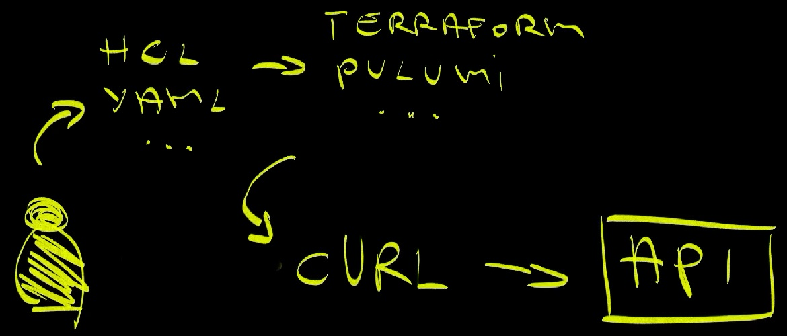
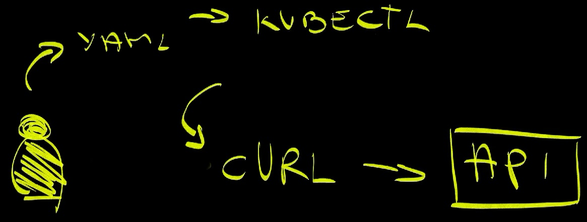
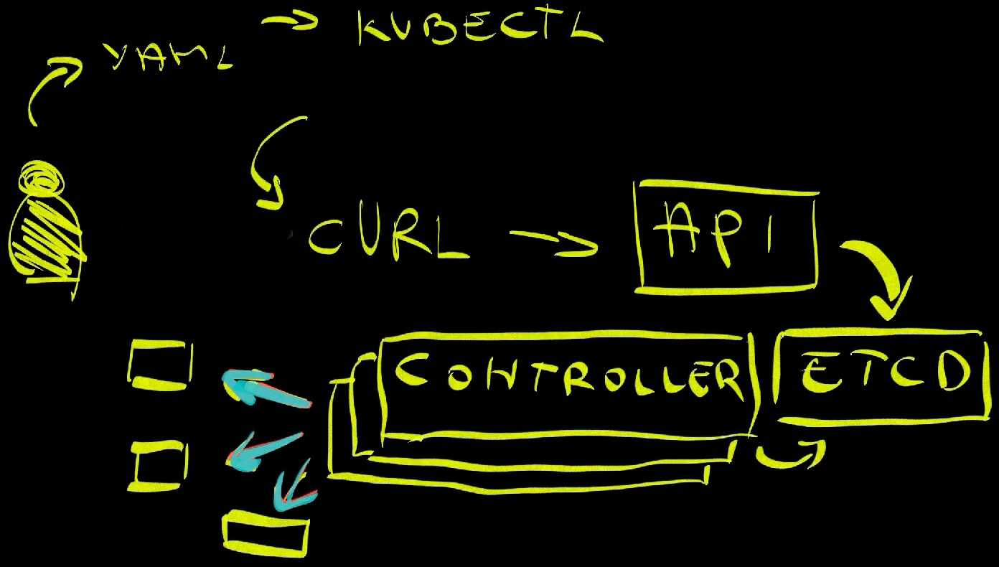
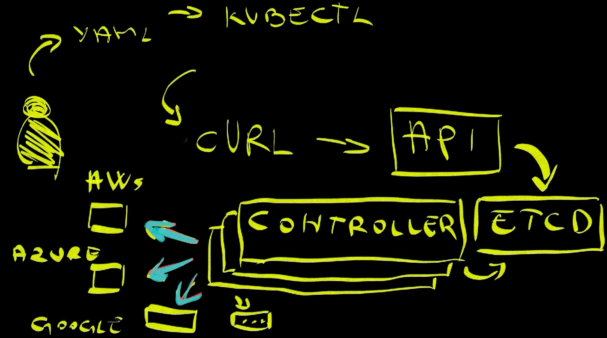
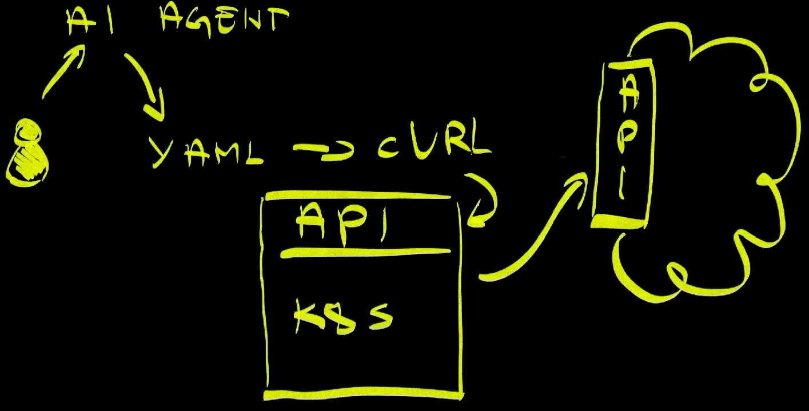
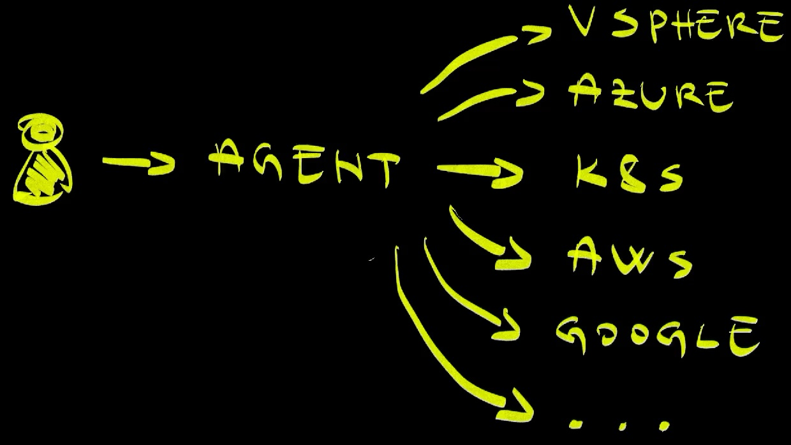

+++
title = 'The End of Infrastructure-as-Code: AI Changes Everything'
date = 2025-07-21T15:00:00+00:00
draft = false
+++

Here's something that might shock you: every Infrastructure-as-Code tool you're using today will be **dead** in upcoming years. Terraform, Pulumi; all of them. And the killer? AI agents that don't need the abstractions we've built our entire industry around.

I know this sounds crazy. You're probably thinking, "But we just invested years learning these tools!" Here's the thing though - AI agents **don't operate** like humans. They don't get overwhelmed by complexity in the same way we do. They don't need user-friendly abstractions. And that changes everything.

By the end of this video, you'll see exactly why the tools we consider essential today are actually **obstacles** for AI agents, and what's coming to replace them. But first, let me show you how we got here...

<!--more-->



## The API Foundation

Long long time ago, providers of services realized that the only reasonable way for us to interact with what they offer is through **HTTP APIs**. Since then, everyone, and I repeat, everyone offers services through APIs. That can be AWS, Azure, Google Cloud, UpCloud, Linode, or anyone else. We can get anything we need through API of the provider.

Even if we do not use public platforms but do everything ourselves in our own on-prem datacenters, everything is available through an API. How do we get a new VM managed by VSphere? **API!** How do we deploy our application to a Kubernetes cluster? **API!**

If you happen to work in a company where there are no APIs to manage whatever you're managing, I have an important advice for you. **Run!** Turn around, get out of the office you're in, and never look back. Go somewhere else.

But here's where it gets interesting - and this is key to understanding why everything is about to change...

It does not matter whether we interact with them directly, or through a graphical user interface, or through a terminal CLI, or through GitOps. It's **always API** and the question is only whether we interact with it directly or indirectly.


So, the flow is human, that's you, requests something directly by interacting with the provider's API or, to be more precise, with something as simple as `curl`.

Almost no one is doing that. Nobody interacts with AWS, or Kubernetes, or anything else with `curl`. As a matter of fact, `curl` might be the **most efficient** way to interact with API, yet we do not want to use it. Why?

This is where the story gets really interesting. Why don't we do something like this?

> Do not execute any of the commands in this article. They are only illustrations.

```sh
curl -L "https://iam.amazonaws.com/?Action=ListUsers&Version=2010-05-08" \
    --aws-sigv4 "aws:amz:us-east-1:iam" \
    --user "${AWS_ACCESS_KEY_ID}:${AWS_ACCESS_KEY}"
```

...or something like this?

```sh
curl -k -H "Authorization: Bearer ${KUBERNETES_TOKEN}" \
    https://1.2.3.4/api/v1/namespaces
```

First of all, those are very simple examples. If we would like to create or update something, we would need to add JSON payload to those requests and that would be a **nightmare**. Still, even in such simple examples, one can see how something like...

```sh
kubectl get namespaces
```

...is much easier.

So, to get back to the question why we don't do that... The answer is simple, and it reveals something crucial about the coming AI revolution. There are formats and tools that make it much easier to define what we want and to communicate with the API of the provider we're using.

That's where Terraform, Pulumi, and others jump in - but here's what nobody talks about: these tools were designed for **human limitations**.

## Human-Centric Tools

Terraform and other tools, often called Infrastructure as Code, have a very simple primary function. They help us define what we want in a **user-friendly** way. Their primary function is to transform HCL, YAML, or some other format into API requests very similar to what we would do with `curl`. That's what they do.



So, we changed the flow by adding something like HCL in between us and sending requests to APIs. We write HCL or YAML or whatever we feel comfortable with. Tools like Terraform and Pulumi translate that into API requests similar to what we would do with `curl`, and send them to the API.

I know that those tools do more than what I described, but that's still their main purpose. They provide a **user-friendly** way for us to define what we want and translate that into API requests.

But here's the key insight: **user-friendly** means designed for human cognitive limitations. We get overwhelmed by complex JSON payloads. We make mistakes with intricate API calls. We need abstractions that reduce mental load. We require readable formats that we can understand, debug, and maintain.

These tools exist because humans are **bad at complexity**. We need simplification. We need cognitive shortcuts. We need tools that make the complex simple.

Then we evolved further by coming up with state management. But wait; this is where things get really interesting...

## The Kubernetes Revolution



Kubernetes still does the same basic operations as what we were doing before adopting it. We define what we need, this time in YAML, and we use `kubectl` as intermediatry that will communicate that to the API.



What makes Kubernetes different is **continuous** drift detection and reconciliation - and this is where we start to see AI-like behavior. Instead of performing operations right away, Kubernetes stores the desired state in etcd and lets controllers figure out what to do and when to do it. On top of that, it does all that **continuously**. Those controllers are running in a loop and ensuring that the actual state is the same as the desired state forever and ever. If we specified that we want three Pods, and one of them fail, it will create a new one. If we specified that we want to scale nodes of the cluster whenever the usage reaches 80%, it will create new nodes. And so on and so forth.

The major difference between the era before Kubernetes and where we are now is that operators inside the cluster, the controllers, **took over** a big part of the work we, humans, were doing.



We went further than that though - and this is where it gets crazy. Now our Kubernetes clusters are interacting with APIs outside the cluster. Once something reaches Kubernetes API, controllers might be transforming our requests into requests sent to provider APIs, be it AWS, Azure, Google Cloud, or anything else.

That's awesome since we can leverage Kubernetes controllers to do a **much wider** range of operations we had to do ourselves in the past. They can monitor the state of a database in Azure and fix issues caused by drifts between the desired and the actual state. They can manage Lambda functions in AWS. They can be in charge of a fleet of clusters in Google.

Kubernetes controllers or operators are doing the work we had to do in the past, and here's the **breakthrough** insight - that's where we can see similarities between Kubernetes controllers and AI agents.

## The Pattern of Tool Death

But here's what nobody talks about, and this is **crucial** to understanding what's coming next. Every single generation of infrastructure tools has **died** when the industry shifted. And the pattern is always the same.

**Generation 1: Configuration Management Era**

Remember Chef, Puppet, and Ansible? These tools were **kings** of the on-premises world. They managed server configurations, deployed applications, and automated infrastructure tasks. Everyone used them. They were the "right" way to manage infrastructure.

Then the **cloud** happened.

Suddenly, we weren't managing static servers anymore. We were spinning up and tearing down infrastructure **dynamically**. We needed to create databases, load balancers, and networks **on-demand**. 

Did Chef adapt? Did Puppet pivot? Did Ansible transform into cloud-native tools?

**No.** They tried. They added cloud modules and plugins. But they were fundamentally designed for a different world. They were built for persistent servers, not ephemeral infrastructure. They **failed** to make the transition.

**Generation 2: Cloud Infrastructure Era**

Enter Terraform, Pulumi, and CloudFormation. These tools were born for the cloud. They understood **immutable infrastructure**. They could create and destroy resources. They were the **new kings**.

But then **Kubernetes** happened.

Suddenly, we weren't just managing cloud resources. We were managing resources **through Kubernetes**. We wanted everything to be a **CRD**. We wanted **controllers** to manage state. We wanted **GitOps** workflows.

Are Terraform and Pulumi adapting? Are they becoming Kubernetes-native?

**They're trying**, but they're struggling. Terraform has Kubernetes providers, but they're clunky. Pulumi has Kubernetes support, but it feels forced. These tools were designed for direct API calls, not for **controller-driven** reconciliation.

**Generation 3: Kubernetes-Native Era**

Now we have Crossplane, ArgoCD, Flux, and custom controllers. These tools understand Kubernetes. They work through **CRDs** and **controllers**. They embrace **continuous reconciliation**.

But guess what's coming next? **AI agents**.

And here's the pattern: **every generation fails** to adapt to the next paradigm. Why? Because they're fundamentally designed for the previous paradigm. They can't just add features. They need to be **completely reimagined**.

The tools that dominated one era become **obstacles** in the next. And the vendors? They can't let go. They keep trying to force their existing tools into new paradigms instead of accepting that their tools have become **obsolete**.

This isn't speculation. This is **history repeating** itself. And it's about to happen again.

**But maybe it doesn't have to.**

Here's what I hope will be different this time. I hope that Kubernetes-native tool vendors will **learn** from history. I hope they'll look at what happened to Chef, Puppet, and Ansible when the cloud arrived. I hope they'll see how Terraform and Pulumi are **struggling** to adapt to Kubernetes.

And I hope they'll make a **different choice**.

Instead of trying to **force** AI agents to use YAML manifests and CRDs, maybe they'll ask: "What do AI agents **actually need**?" Instead of building AI assistants that help humans write Kubernetes configs, maybe they'll build **agent-native** interfaces.

Maybe Crossplane will **evolve** beyond Compositions. Maybe ArgoCD will **transform** beyond GitOps. Maybe the Kubernetes ecosystem will **embrace** AI agents instead of fighting them.

But this requires something that's **historically rare**: the willingness to **abandon** what made you successful. The courage to **kill** your own products before someone else does. The vision to see that **adaptation** sometimes means **complete transformation**.

Will they do it? **History says no.** But I hope this time will be different. I hope that Kubernetes generation will be the first to successfully **evolve** instead of **dying**.

Time will tell.

## AI Today



Now we are at the beginning of the AI era. Instead of writing that YAML ourselves, we can tell AI agents to do it for us. We are using AI to help us write "stuff" that we were writing ourselves in the past. That "stuff" can be YAML, or HCL, or backend code in Go, or frontend application in TypeScript, or anything else. From there on, the process is still the same. In case of resource management that could be Kubernetes,

That is, on the first look, very similar to what we do with Kubernetes controllers. If we define AI agents as processes that perform operations on our behalf, we can easily come to the conclusion that Kubernetes controllers fit that same description. In both cases, we define what we want, and they do it. An AI agent might write code based on our input. It might analyze a problem inside one of our clusters and suggest a fix or fix it directly. Similarly, Kubernetes controllers also take our input, the desired state, and make it happen. They ensure that whatever we specified is what is running.

But here's where **everything changes**.

Kubernetes is **declarative** and explicit. It will create and manage exactly what we tell it we want. We need to be precise or, to be more specific, the desired state we define needs to be precise. We cannot instruct Kubernetes to run an application. We need to define a Deployment and inside that definition we need to specify which specific container image it should use how many replicas it should manage. We can specify ranges though. We can say "run between 3 and 7 replicas depending on the memory consumption", but that's still, more or less, very specific.

AI is **not like that**, at least not today. It is not specific. It is **non-deterministic**. If we say "generate application manifests and make sure that image is used and that number of replicas it will have", it will do that for us. However, multiple executions of the same prompt will produce different results. It is non-deterministic. Do you know of other examples of non-deterministic behavior? It's us, **humans**. We are also non-deterministic. Two people tasked to perform the same operation will end up producing different results. Heck, the same person is unlikely to produce the same outcomes when tasked to do the same thing twice.

That **non-deterministic** nature of both AI and humans is important, and we'll get back to it later - because it's about to become AI's greatest strength.

For now, the important note is that the usage of AI, through agents, today is **mostly limited** on us instructing them to give us some information or to generate something. We use them to generate code, or to write YAML manifests, or something similar. Even when we do let them perform operations, we do that only in **supervised mode**. Agents suggest what they will do, we review those suggestions, and we allow or deny them to do whatever they wanted to do.

All in all, today we use AI to generate "stuff" we would normally generate ourselves. We trust Kubernetes to perform **unsupervised** operations because those operations are deterministic. We do not trust AI agents to do the same.

That will change, **very soon**. And when it does, everything we've built becomes **obsolete**.

## The AI Revolution

The problem is that we see AI agents as **complimentary** to humans - and that's about to be our biggest mistake. A developer will use an agent to write code. Most of the time, at least when "serious" development is concerned, that developer will supervise the agent. It will tell it when it did something wrong. It will lead it when it goes astray. Similarly, someone called DevOps engineer, which is a silly name, or simply ops, or a platform engineer, or something similar, will instruct the agent to generate some other code, including YAML and HCL. Today, we might go as far as to use agents to tell us what's wrong with a live system, and, maybe, even to suggest a fix, but not to fix it. Today, agents are **supervised** by people in specific roles. In our industry, those people are software engineers.

Soon, the **supervision** part will be mostly gone. We will instruct agents to do something, and they will do it. We'll ask an agent to fix an issue in code, and it will fix it, and it will create a pull request, and it will review it, and it will merge it to the main branch, and it will deploy it to production. Similarly, we might ask an agent to create and manage a database, or a cluster, or some other types of resources. That day is not today, but it will come, **very soon**.



Hence, the future flow will be from a human asking the agent to do something, and that agent doing whatever needs to be done. How will it do what needs to be done? The answer to that question is **the same** as how we were doing it so far. It will use APIs of the providers, be it Kubernetes, or AWS, or Azure, or Google Cloud, or VSphere, or anything else.

What is missing for that to happen? What is missing that will make agents autonomous? There are a lot of things missing, but I'll focus on **two** which, I believe, are the most important.

First, agents need to develop capability to **learn**, just as we, humans, are learning. Bad things will happen. There will be suboptimal or even disastrous outcomes with agents, just as there are similar outcomes with humans. Making a mistake is normal. Repeating the same mistake is **stupid**. We are on a brink of having learning agents or learning models that will learn from mistakes and, by doing so, stop repeating them.

The second important piece of the puzzle is that is missing **memory**. We already have solutions for agents to memorize rules, and processes, and whatever else needs to be memorized, but those are far from being reliable. We need to get better at that. A new hire will spend considerable time learning how the company operates, whether to work in separate branches or push directly to mainline, which languages and frameworks are used in applications, which tools are used to manage resources, and so on and so forth. Similarly, all that **internal knowledge** needs to be passed to agents or models so that they can operate under the same rules.

Actually, that's wrong. They should not operate under the same rules. We'll get to that later. What matters is that there must be **rules** followed by everyone, no matter whether we are talking about humans or AI agents.

I have no doubt that we'll get those and other improvements we need. That's not my concern, at least not in this post.

My big doubt is around tooling and formats and languages - and this is where **everything breaks**.

## Tools Are Dead

Let's say that we want to instruct an agent to create a database. How would we do that? Natural reaction would be to instruct the agent to use the tools we are using. If, for example, we use Terraform, we would probably instruct the agent to create HCL files and then to run `terraform apply`. Right?

I think that's **wrong**. I think we'll have a major shift in that area, mainly because we are trying to force AI to use tools designed to help us, humans.

Let's go back to that database example and think of the simplest way an AI agent could create it and manage it. Here's the **breakthrough** insight: We know that there is an API on the other end and we know that Terraform, Pulumi, Crossplane Compositions, and other tools and formats are converting user-friendly formats to API requests. Does the AI need those same formats? Can't it go **directly** to the API and make requests? What makes direct HTTP requests with JSON or some other payload any worse for agents than Terraform and other intermediary formats?

Remember what we established earlier: our tools exist because **humans are bad at complexity**. We need **cognitive shortcuts**. We need **readable formats**. We need **mental models** that we can understand.

AI agents **don't have those limitations**. They don't get **overwhelmed** by complex JSON. They don't make **syntax errors** in API calls. They don't need **user-friendly** abstractions. They can handle **raw complexity** without breaking down; or, at least, we think that they will be able to do it in not so distant future.

We are used to abstractions because abstractions make our lives easier. AI probably does **not need** abstractions. As a matter of fact, abstractions will likely constraint it, just as they constraint us. The major difference is that we get overwhelmed without abstractions, AI **probably doesn't** or, to be more precise, will not in the future.

That being said, I'm sure that agents will need tools and specific formats, but those will be **very different**. Instead of trying to force them to use tools that help us, we should think of the tools that help those agents.

What I'm trying to say is that agents will **not need** Terraform or Pulumi or Crossplane Compositions. They can talk directly to APIs and do what needs to be done. They can observe the state of what was done and react when that state changes. They are, or will be, acting in the same way humans are acting, but they are **not humans**, so they do not need the same tools, nor the same languages, nor the same formats.

Now, you might say that's **bullshit**. Those APIs are too complex. They might not be well documented. They might not be the right interface for models and agents. You might be right but, if you are, the answer is still not Terraform or other tools, but, as I already mentioned, tools **designed specifically** for agents. A good example is **MCP** or Model Context Protocol. If we need something from AWS and, for whatever reason, direct communication to its API is not a good option, agents can hook into AWS MCP to do whatever they needs to do. Terraform is not the answer. It is a tool designed for us, not for agents and we should not try to fit it where it does not belong. Even if MCPs are not the answer, as I'm not sure they are, there will be something else.

And here's where the **historical pattern** becomes unavoidable. Just like Chef couldn't adapt to the cloud, just like Terraform is struggling to adapt to Kubernetes, **Kubernetes tools won't adapt to AI agents**.

Why? Because Kubernetes controllers are designed for **human-defined** desired state. They expect **explicit YAML** manifests. They work with **static configurations**. But AI agents will work **dynamically**. They'll make **real-time decisions**. They'll **adapt** and **learn** and **change** their approach based on context.

Will Crossplane adapt? Will ArgoCD evolve? Will custom controllers transform?

**History says no.** The pattern is clear. The tools that dominate one era become **obstacles** in the next. And we're about to see it happen again.

All that means that many of the tools we are using will eventually **stop being useful**. There is no logical need for Terraform or similar tools for operations performed by agents. Those will disappear, or be transformed into something very different. They will die a **slow** and **agonizing death** and make everyone using them suffer.

Instead of thinking how can AI do what we do using the same tools we find useful, we should focus on making tools that are **useful to agents**. Why would they write HCL that is transformed to HTTP requests with JSON payload instead of making those same requests directly? Why would they use Crossplane Compositions designed to make cognitive load smaller for humans?

We need to start thinking how we can enable those agents to do the right thing. We've been doing that with people for centuries, and now is the time to **rethink everything**.

I do not yet know what will be that final form. I do not have a clear idea how will those tools look like nor which formats will be most optimal for agents to do what they need to do. What I do know is that it will be **very different** than what we use today. That means that tools like Terraform, Pulumi, and other will disappear or transform themselves into something very different.

The problem is that vendors behind those tools will likely **not be able** to let go. Most of them will not admit to themselves that what worked in the past will not work in the future. They will not recognize that agents do not need them. Instead, most of them will keep pushing the ideas they have today. Those ideas can be summarized with "we create agents that help us write 'stuff' that **humans are writing**." If I'm HashiCorp, I'm probably creating agents and models that help people write HCL and execute `terraform apply` instead of trying to figure out how to enable agents to do what they need to do in the most efficient and reliable way.

As such, most of the tools from the established vendors will **eventually disappear** and be replaced by those built from scratch to meet the new demands. Just as **Chef couldn't transition** from on-prem to cloud, just as **Terraform is struggling** to transition from cloud to Kubernetes, those available today will likely not be able to transition into the world operated by agents. Most of them won't. Most of them will not be needed and will slowly die. Five or ten years from now, we'll look at them with sentimental feelings similar to those we have for **mainframe** today. It's still in use, somewhere, but most of us do not care for it.

AI will **kill** most of Infrastructure-as-Code tools. It's only a **matter of time**.

**Unless they choose to evolve.**

The tools that survive the AI revolution won't be the ones that try to make AI fit their existing paradigms. They'll be the ones that **completely reimagine** themselves for the AI-first world.

They'll ask the hard questions: "What if we abandoned YAML entirely?" "What if we built agent-native APIs from scratch?" "What if we killed our current products to build something **radically different**?"

The companies that make this transition won't just survive - they'll **dominate** the next era. But it requires something most vendors struggle with: the courage to destroy what made them successful to build what will make them **essential**.

History shows us the pattern. But history doesn't have to **repeat**; if we choose to **learn** from it.

The choice is **theirs**. And the clock is **ticking**.

