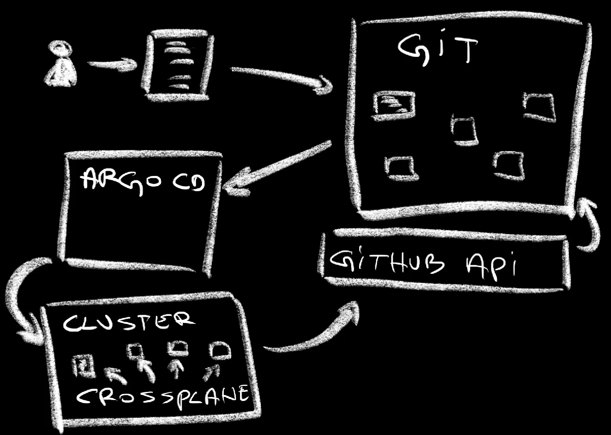
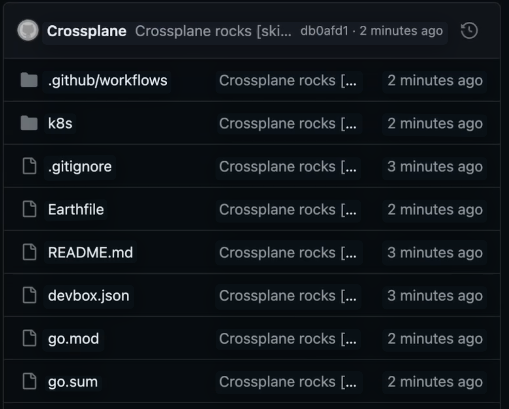
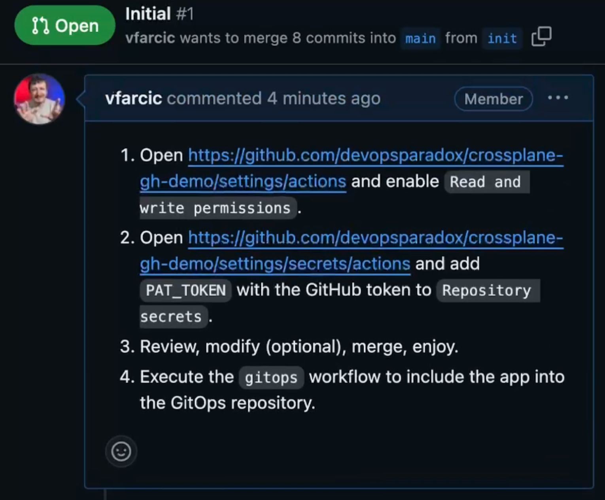
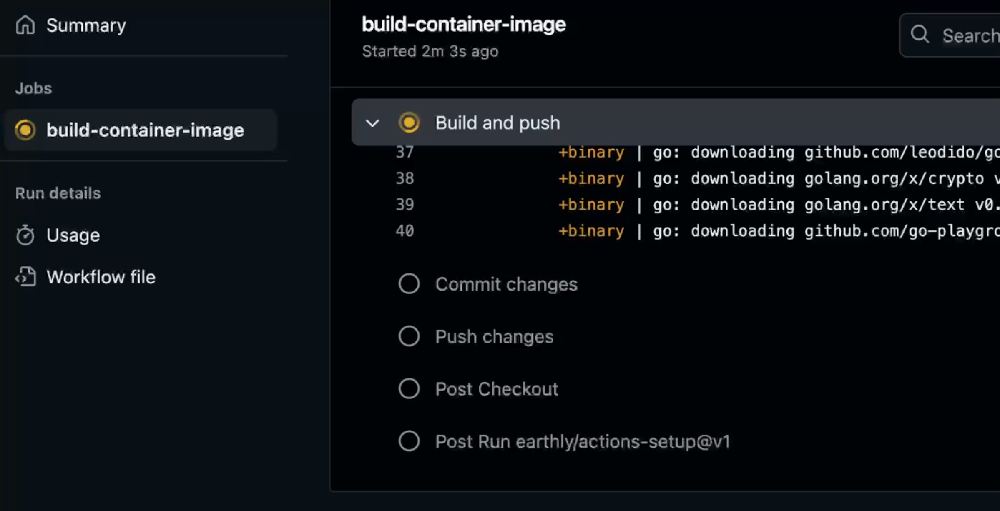
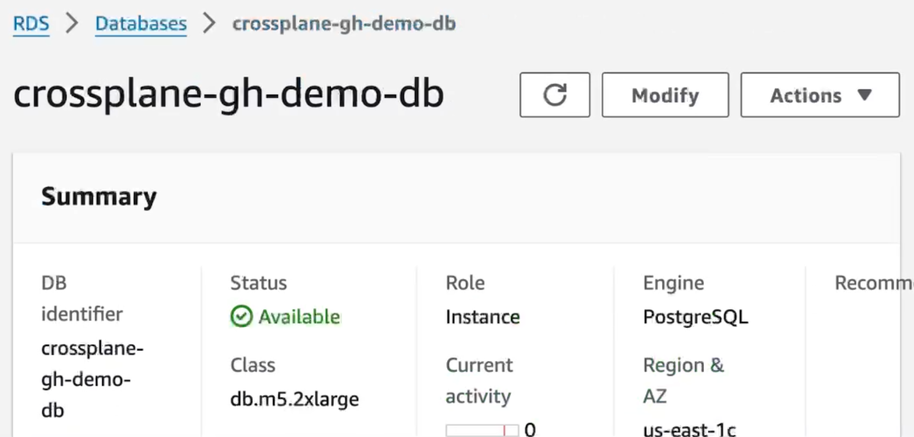
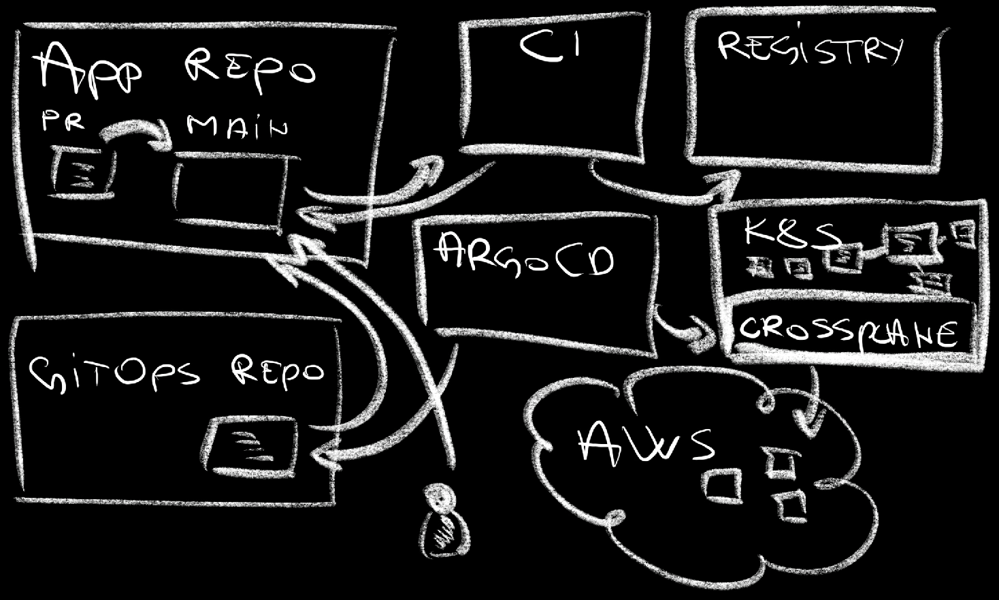

+++
title = 'Automate Everything: How One Manifest Powers Your Entire DevOps Pipeline'
date = 2024-08-26T16:00:00+00:00
draft = false
+++

Today I want to get back to the first steps when developer platforms are concerned. I want to enable developers to start a new project.

<!--more-->



> Do NOT run the commands from this section. They are only the preview of what's coming later, after we set up everything.

```sh
cat examples/repo-$HYPERSCALER.yaml
```

The output is as follows.

```yaml
---
apiVersion: devopstoolkitseries.com/v1alpha1
kind: GitHubClaim
metadata:
  name: crossplane-gh-demo
spec:
  id: crossplane-gh-demo
  parameters:
    public: true
    registry: ttl.sh
    app:
      language: go
      host: my-repo.acme.com
      namespace: a-team
    db:
      enabled: true
      provider: aws
      version: "16.2"
    repo:
      user: vfarcic
    gitops:
      enabled: true
      user: vfarcic
      repo: crossplane-gh
```

From developers perspective, that manifest represents an **easy interface** to specify a programming language (`app.language`), whether to use a database (`db.enabled`), whether to use GitOps (`gitops.enabled`), and a few other things. Such a manifest should be easy to write and push to Git.

However, much more needs to happen behind the scenes. I expect such a manifest to be **synced into the control plane** cluster from where I expect a process that creates and manages a Git repository, files like the initial source code of the application, CI pipelines like GitHub Actions, build scripts like Earthly, GitOps references like those for Argo CD, Kubernetes manifests, and much much more.

In other words, I expect an easy interface for everything and complexity hidden inside a control plane and behind an API.

As a result of all that, if I push that manifest to a Git repo...

```sh
cp examples/repo-aws.yaml git-repos/crossplane-gh-demo.yaml

git add .

git commit -m "Repo"

git push
```

...a repository was created, a new branch was generated, files were created in that branch, a pull request was created as well, a pipeline is running and building binaries and images, running tests, and modifying manifests the GitOps repo, Argo CD is synchronizing resources into the cluster, database is being created in a hyperscaler of choice, and so on and so forth.

That single manifest created** everything required to start working on a new application**, from developer tasks all the way until it is running in production. It's easy, yet it **does not sacrifice anything**. It's fully transparent with everything stored in Git, it's secure since no one has access to the cluster, it's fully automated with CI pipelines and Argo CD synchronization, and whatever else is being done and I forgot to mention.

Here's how it all works and how I did it.

## Setup

> Watch the [GitHub CLI (gh) - How to manage repositories more efficiently](https://youtu.be/BII6ZY2Rnlc) video if you are not familiar with GitHub CLI.

```sh
gh repo fork vfarcic/crossplane-gh --clone --remote

cd crossplane-gh

gh repo set-default
```

> Select the fork as the default repository

> Make sure that Docker is up-and-running. We'll use it to create a KinD cluster.

> Watch [Nix for Everyone: Unleash Devbox for Simplified Development](https://youtu.be/WiFLtcBvGMU) if you are not familiar with Devbox. Alternatively, you can skip Devbox and install all the tools listed in `devbox.json` yourself.

```sh
devbox shell
```

> The setup assumes that you are using AWS. Please open an issue if you would like me to add the support for Azure or Google Cloud. Alternatively, you can select `none` during the setup resulting in no database being created (but everything else working).

```sh
chmod +x setup.sh

CLUSTER_TYPE=kind ./setup.sh

source .env
```

## One Manifest For Everything

There are quite a few things we need to figure out to make the system as the one we're exploring today. We need to create an interface, an abstraction, that will make it **easy for people to define what they need** while, at the same time, they are **not overwhelmed with unnecessary complexity**. Then there is a mechanism that will create and manage a Git repository and the initial branch and a PR. We also need to generate some files like the sample source code, CI pipelines, build scripts, README, and quite a few others. We also need to configure Argo CD or Flux to synchornize manifests from that new repo, a way to create and manage databases, and quite a few other things.

As you can probably guess, we need multiple types of definitions and tools to accomplish all that, so let's start from the begining.

The first thing we need to do is to create a control plane that will do the work and, at the same time, generate API people will use to interact with it.

You probably already know which tool I picked for that part. It'll be Crossplane.

*Now, to be clear, this video is about the process rather than specific tools. I made some choices since I wanted to make this practical, yet you should be able to switch any of the tools I use for something else. I'm advocating for a process and it's up to you to say "I don't want to do it using that tool, I'll do the same using a different one."

One way we could approach the problem is with Crossplane. Among others, we could use the [GitHub Provider](https://marketplace.upbound.io/providers/coopnorge/provider-github) to manage the state of different types of resources.

Here's an example of a manifest with a few managed resources.

```sh
cat examples/mrs.yaml
```

The output is as follows.

```yaml
apiVersion: repo.github.upbound.io/v1alpha1
kind: Repository
metadata:
  name: crossplane-github-demo
spec:
  forProvider:
    name: crossplane-github-demo
    visibility: public
    hasIssues: true
---
apiVersion: repo.github.upbound.io/v1alpha1
kind: RepositoryFile
metadata:
  name: crossplane-github-demo-gitignore
spec:
  forProvider:
    commitAuthor: Crossplane
    commitEmail: github-provider@crossplane.io
    commitMessage: "Crossplane rocks"
    content: |
      /tmp
    file: .gitignore
    repositoryRef:
      name: crossplane-github-demo
---
apiVersion: repo.github.upbound.io/v1alpha1
kind: Branch
metadata:
  name: crossplane-github-demo-init
spec:
  forProvider:
    branch: init
    repositoryRef:
      name: crossplane-github-demo
```

If we would apply that to the cluster where Crossplane is running, we would get a GitHub `Repository` with `.gitignore` `RepositoryFile`, and a `Branch`.

That, however, is not the direction we'll take. Remember, one of the requirements is to make it easy for developers by exposing things that matter, and hiding those that don't. We'll accomplish that by creating a Composition or, to be more precise, using a Composition I already created.

*If you are not familiar with Crossplane Compositions, you might want to watch [this video](https://youtu.be/X7E6YfXWgvE) first. It's part of a [Crossplane tutorial](https://youtube.com/playlist?list=PLyicRj904Z99i8U5JaNW5X3AyBvfQz-16) I published a while ago.*

Here's an example of what developers would need to define to get (almost) everything they need to start working on a project.

```sh
cat examples/repo-$HYPERSCALER.yaml
```

> Some outputs in this post are specific to AWS. If you follow along, you'll see outputs based on the hyperscaler you chose.

The output is as follows.

```yaml
---
apiVersion: devopstoolkitseries.com/v1alpha1
kind: GitHubClaim
metadata:
  name: crossplane-gh-demo
spec:
  id: crossplane-gh-demo
  parameters:
    public: true
    registry: ttl.sh
    app:
      language: go
      host: my-repo.acme.com
      namespace: a-team
    db:
      enabled: true
      provider: aws
      version: "16.2"
    repo:
      user: vfarcic
    gitops:
      enabled: true
      user: vfarcic
      repo: crossplane-gh
```

In that example, a hypothetical developer wrote a manifest with the `kind` set to `GitHubClaim`. That is a Crossplane claim based on a Composition we'll explore later. For now, the only thing that matters is that the Composition created a new API endpoint, a CRD, in the Kubernetes cluster and anyone with sufficient permissions can create resources based on it.

The developer chose to make the repo `public` and to use `ttl.sh` as the registry for container images.

The application should be written in `go`, should be accessible through `my-repo.acme.com`, and should run in the `a-team` Namespace.

The developer chose to enable (`enabled`) the PostgreSQL database in `aws` and that it should be version `16.2`.

The `user` or organization where the repository should be located is `devopsparadox`.

Finally, the developer chose to enable `gitops` using the repository `crossplane-gh` in the organization `vfarcic`.

A lot needs to happen for all those requirements to be fulfilled yet, from developer's perspective, it is as easy as it can get.

Now, since it would be silly to enable direct access to the cluster so that people can execute commands like *kubectl apply*, we already have Argo CD up-and-running and configured to monitor the repository we're in right now. More specifically, it is set to monitor the *git-repos* directory in this repo. So, the only action we should perform is to copy that file to that directory,...

```sh
cp examples/repo-$HYPERSCALER.yaml git-repos/crossplane-gh-demo.yaml
```

...and push the changes.

```sh
git add .

git commit -m "Repo [skip ci]"

git push
```

Now, I am fully aware that some people do not like writing YAML, even when it's as simple as that one. For them, we might want to add a developer portal through which they could fill in some fields in a form and click the execute button. That could be Backstage, or Port, or any other similar solution. We won't do that part today but, if you're interested, I can, for example, show how to integrate everything we'll do today into a portal. Would that be interesting? Please let me know in the comments and, apart from saying "yes, do it", let me know which portal you'd like me to use.

Let's get back to the task at hand.

We can, for example, trace all the resources created by applying that claim by executing `crossplane beta trace` command.

```sh
crossplane beta trace githubclaim crossplane-gh-demo \
    --namespace git-repos
```

The output is as follows.

```
NAME                                              SYNCED READY STATUS
GitHubClaim/crossplane-gh-demo (git-repos)        True   True  Available
└─ GitHub/crossplane-gh-demo-6ddtc                True   True  Available
   ├─ Branch/crossplane-gh-demo-init              True   True  Available
   ├─ PullRequest/crossplane-gh-demo-init         True   True  Available
   ├─ RepositoryFile/crossplane-gh-demo-app       True   True  Available
   ├─ RepositoryFile/crossplane-gh-demo-ci        True   True  Available
   ├─ RepositoryFile/crossplane-gh-demo-db        True   True  Available
   ├─ RepositoryFile/crossplane-gh-demo-devbox    True   True  Available
   ├─ RepositoryFile/crossplane-gh-demo-earthfile True   True  Available
   ├─ RepositoryFile/crossplane-gh-demo-gitignore True   True  Available
   ├─ RepositoryFile/crossplane-gh-demo-gitops    True   True  Available
   ├─ RepositoryFile/crossplane-gh-demo-go-mod    True   True  Available
   ├─ RepositoryFile/crossplane-gh-demo-go-sum    True   True  Available
   ├─ RepositoryFile/crossplane-gh-demo-main-go   True   True  Available
   └─ Repository/crossplane-gh-demo               True   True  Available
```

> If the output throws an `error`, Argo CD probably did not yet synchronize it. Wait for a few moments and try again.

We can see that a `Repository` was or will be created, that there is a `Branch` and a `PullRequest`, and that a bunch of files (`RepositoryFile`) are there as well.

It might take a few moments for those resources to become available. While waiting, we can quickly go through the process that happened so far.



We pushed a Crossplane claim to the Git repo. Argo CD is monitoring that same repo and, once it detected a new manifest, it synchronized it into the cluster where Crossplane is running. Crossplane, on the other hand, took that claim and expaned it into managed resources which, in turn, started talking to GitHub API and creating the repository, branch, pull request, and some files.

Let's confirm that's what really happened by opening the repo in a browser.

```sh
gh repo view $GITHUB_OWNER/crossplane-gh-demo --web
```



We can see the the `init` branch was created and that it contains all the files one might need to start working on a project. The CI pipeline is there (`ci.yaml`) and Kubernetes manifests are in the `k8s` directory. Specifically, there is `AppClaim` that is an instance of the abstraction required to run backend applications and `SQLClaim` that manages PostgreSQL in the choosen hyperscaler. `.gitignore` is there as well. `Earthfile` can be used to execute any type of tasks, including building and pushing images. Then there is `README.md` with a creative text, `devbox.json` that can be used to install any tools we might need, and, finally, `main.go` contains the sample source code.

All those files in the *init* branch are groupped into a pull request that contains instructions with steps that I did not yet automate.



Those instructions are fairly simple.
1. Enable `Read and write permissions` to GitHub Actions.
2. Add `PAT_TOKEN` (GitHub token) as a repository secret.
3. Merge the PR.
4. Execute the `gitops` workflow that will add a reference to the newly created repository to the GitOps repo monitored by Argo CD.

I should automate those as well. For now, those manual steps, while not ideal, should do.

Once we **merge the PR**, a build of a **pipeline is executed** (`build-container-image`). It's a simple one which works well for a demo but might need to be expanded when used seriously.



The workflow, among other things, builds the binary and the image and pushes it to a container image registry. Once done, it updates Kubernetes manifests in that repo. Since Argo CD is watching a separate Git repo which, by now, has Application referencing this repository, those changes will eventually be synced into the cluster.

We can confirm that's what really happened by tracing Crossplane resources managed by the `appclaim`.

```sh
crossplane beta trace appclaim crossplane-gh-demo \
    --namespace a-team
```

The output is as follows.

```
NAME                                       SYNCED READY STATUS
AppClaim/crossplane-gh-demo (a-team)       True   False Waiting: Claim is waiting for composite resource to become Ready
└─ App/crossplane-gh-demo-jshr7            True   False Creating: Unready resources: crossplane-gh-demo
   ├─ Object/crossplane-gh-demo-deployment True   True  Available
   ├─ Object/crossplane-gh-demo-ingress    True   True  Available
   ├─ Object/crossplane-gh-demo-service    True   True  Available
   └─ ProviderConfig/crossplane-gh-demo    -      -
```

> If the output throws an `error`, Argo CD probably did not yet synchronize it. Wait for a few moments and try again.

We can see that the `AppClaim` `crossplane-gh-demo` was created and that, in turn, created three Objects. We got a `deployment`, and `ingress`, and a `service`.

```sh
kubectl tree --namespace a-team deployment crossplane-gh-demo
```

```
NAMESPACE  NAME                                        READY REASON AGE  
a-team     Deployment/crossplane-gh-demo               -            19m  
a-team     ├─ReplicaSet/crossplane-gh-demo-66b87674fb  -            3m53s
a-team     │ └─Pod/crossplane-gh-demo-66b87674fb-cww8z True         3m53s
```

Those **Crossplane managed resources created Kubernetes resources** and we can confirm that as well by retrieving `all` core resources as well as `ingresses`.

```sh
kubectl --namespace a-team get all,ingresses
```

The output is as follows.

```
NAME                                   READY STATUS  RESTARTS AGE
pod/crossplane-gh-demo-dd69595c5-psq5d 1/1   Running 0        119s

NAME                       TYPE      CLUSTER-IP   EXTERNAL-IP PORT(S)  AGE
service/crossplane-gh-demo ClusterIP 10.96.72.189 <none>      8080/TCP 119s

NAME                               READY UP-TO-DATE AVAILABLE AGE
deployment.apps/crossplane-gh-demo 1/1   1          1         119s

NAME                                         DESIRED CURRENT READY AGE
replicaset.apps/crossplane-gh-demo-dd69595c5 1       1       1     119s

NAME                                         CLASS  HOSTS            ADDRESS PORTS AGE
ingress.networking.k8s.io/crossplane-gh-demo <none> my-repo.acme.com         80    119s
```

There we go. The `Deployment` was created and, as a result, it created a `replicaset` which created a single `pod`. On top of those, there is a `service` and an `ingress`.

When we created the initial manifest that resulted in creation of the repo, the branch and the PR, and all the files, we specified that there should be a database as well. Let's see whether that happened by executing yet another `trace`.

```sh
crossplane beta trace sqlclaim crossplane-gh-demo-db \
    --namespace a-team
```

The output is as follows.

```
NAME                                                  SYNCED READY STATUS
SQLClaim/crossplane-gh-demo-db (a-team)               True   False Waiting: Claim is waiting for composite resource to become Ready
└─ SQL/crossplane-gh-demo-db-7w7s5                    True   False Creating: Unready resources: rdsinstance, sql-secret
   ├─ InternetGateway/crossplane-gh-demo-db           True   True  Available
   ├─ MainRouteTableAssociation/crossplane-gh-demo-db True   True  Available
   ├─ RouteTableAssociation/crossplane-gh-demo-db-1a  True   True  Available
   ├─ RouteTableAssociation/crossplane-gh-demo-db-1b  True   True  Available
   ├─ RouteTableAssociation/crossplane-gh-demo-db-1c  True   True  Available
   ├─ RouteTable/crossplane-gh-demo-db                True   True  Available
   ├─ Route/crossplane-gh-demo-db                     True   True  Available
   ├─ SecurityGroupRule/crossplane-gh-demo-db         True   True  Available
   ├─ SecurityGroup/crossplane-gh-demo-db             True   True  Available
   ├─ Subnet/crossplane-gh-demo-db-a                  True   True  Available
   ├─ Subnet/crossplane-gh-demo-db-b                  True   True  Available
   ├─ Subnet/crossplane-gh-demo-db-c                  True   True  Available
   ├─ VPC/crossplane-gh-demo-db                       True   True  Available
   ├─ ProviderConfig/crossplane-gh-demo-db-sql        -      -       
   ├─ ProviderConfig/crossplane-gh-demo-db-sql        -      -       
   ├─ Object/crossplane-gh-demo-db-secret             False  -     ReconcileError: ...om referenced resource: status.atProvider.address: no such field
   ├─ ProviderConfig/crossplane-gh-demo-db            -      -       
   ├─ SubnetGroup/crossplane-gh-demo-db               True   True  Available
   └─ Instance/crossplane-gh-demo-db                  True   False Creating
```

We can see that a bunch of AWS resources were created or are in the process of being created. It takes a few minutes until all AWS resources are available so let's fast-forward for a few minutes and try again.

```sh
crossplane beta trace sqlclaim crossplane-gh-demo-db \
    --namespace a-team
```

The output is as follows.

```
NAME                                                  SYNCED READY STATUS
SQLClaim/crossplane-gh-demo-db (a-team)               True   True  Available
└─ SQL/crossplane-gh-demo-db-kqt9c                    True   True  Available
   ├─ InternetGateway/crossplane-gh-demo-db           True   True  Available
   ├─ MainRouteTableAssociation/crossplane-gh-demo-db True   True  Available
   ├─ RouteTableAssociation/crossplane-gh-demo-db-1a  True   True  Available
   ├─ RouteTableAssociation/crossplane-gh-demo-db-1b  True   True  Available
   ├─ RouteTableAssociation/crossplane-gh-demo-db-1c  True   True  Available
   ├─ RouteTable/crossplane-gh-demo-db                True   True  Available
   ├─ Route/crossplane-gh-demo-db                     True   True  Available
   ├─ SecurityGroupRule/crossplane-gh-demo-db         True   True  Available
   ├─ SecurityGroup/crossplane-gh-demo-db             True   True  Available
   ├─ Subnet/crossplane-gh-demo-db-a                  True   True  Available
   ├─ Subnet/crossplane-gh-demo-db-b                  True   True  Available
   ├─ Subnet/crossplane-gh-demo-db-c                  True   True  Available
   ├─ VPC/crossplane-gh-demo-db                       True   True  Available
   ├─ ProviderConfig/crossplane-gh-demo-db-sql        -      -       
   ├─ ProviderConfig/crossplane-gh-demo-db-sql        -      -       
   ├─ Object/crossplane-gh-demo-db-secret             True   True  Available
   ├─ ProviderConfig/crossplane-gh-demo-db            -      -       
   ├─ SubnetGroup/crossplane-gh-demo-db               True   True  Available
   └─ Instance/crossplane-gh-demo-db                  True   True  Available
```

All database components are up-and-running and we can confirm that it's real and not a result of some witchcraft and wizardy by opening console of whichever hyperscaler we chose (in my case it's AWS), and confirm that the database is indeed there.



The applications is now **fully operational**. It was built, it was validated, and it was deployed. From now on, all that developers need to do is clone the repo, work on the application code, and push changes back to the repo. That's it. That's all that needs to be done. It's **easy, by design**.

## What Happened and How Did it Happen?



After the application repository, and the branch, and the pull request, and the files were created, we merged the PR. That triggered a CI workflow that, among other things, built the binary and the image, pushed the image to the container registry, and updated manifests and pushed them back to the repo.

Argo CD is watching the GitOps repo that contains a reference to the application repo. Once it detected changes, it synced them into the cluster where Crossplane is running. Crossplane, in turn, takes the claims synced by Argo CD and expands them into managed resources. In this specific case, the application claim turned into Kubernetes resources while the database claim ended up as hyperscaler resources (in my case AWS).

From here on, all that the developers need to do is to push changes to the repo and the process is repeated.

That's the process. **Everything is always in Git**, **one-shot actions are executed by CI workflows**, and **states are managed by Argo CD (or Flux)**. Developer-friendly API **interfaces are created by Crossplane** which, at the same time, **manages all kinds of resources**, from those in Kubernetes, through those in GitHub, until those in hyperscalers like AWS, Azure, or Google Cloud.

That leaves us with only one unanswered, yet very important, questio. How did I do all that? Well... Most of the work is done by Crossplane Compositions. Here's the one I created to manage GitHub resources.

```sh
cat package/compositions.yaml
```

The output is as follows (truncated for brevity).

```yaml
apiVersion: apiextensions.crossplane.io/v1
kind: Composition
metadata:
  name: github
spec:
  compositeTypeRef:
    apiVersion: devopstoolkitseries.com/v1alpha1
    kind: GitHub
  mode: Pipeline
  pipeline:
  - step: github
    functionRef:
      name: crossplane-contrib-function-kcl
    input:
      apiVersion: krm.kcl.dev/v1alpha1
      kind: KCLRun
      spec:
        source: |
          oxr = option("params").oxr

          _metadata = lambda suffix: str, kind: str -> any {
              {
                  if suffix == "":
                      name = oxr.spec.id
                  else:
                      name = oxr.spec.id + "-" + suffix
                  annotations = {
                      "krm.kcl.dev/composition-resource-name" = oxr.spec.id + "-" + kind + "-" + suffix
                  }
              }
          }

          schema repositoryFile:
              _name: str
              _file: str
              _content: str
              _branch: bool = True
              apiVersion = "repo.github.upbound.io/v1alpha1"
              kind = "RepositoryFile"
              metadata = _metadata(_name, "file")
              spec = {
                  forProvider = {
                      commitAuthor = "Crossplane"
                      commitEmail = "github-provider@crossplane.io"
                      commitMessage = "Crossplane rocks [skip ci]"
                      content = _content
                      file = _file
                      repositorySelector.matchControllerRef = True
                      if _branch:
                          branch = "init"
                  }
              }

          items = [
              {
                  apiVersion = "repo.github.upbound.io/v1alpha1"
                  kind = "Repository"
                  metadata = _metadata("", "repo")
                  spec = {
                      forProvider = {
                          name = oxr.spec.id
                          if oxr.spec.parameters.public:
                              visibility = "public"
                          else:
                              visibility = "private"
                          hasIssues = True
                      }
                      managementPolicies: [
                          "Create",
                          "Observe",
                          "Update",
                          "LateInitialize",
                      ]
                  }
              }
              ...
  - step: automatically-detect-ready-composed-resources
    functionRef:
      name: crossplane-contrib-function-auto-ready
  writeConnectionSecretsToNamespace: crossplane-system
```

The problem is that it would take quite some time to explain everything going on in that Composition. Since I already have a video that explains Compositions, I'll refer you to [Crossplane Compositions | Tutorial (Part 3)](https://youtu.be/X7E6YfXWgvE).

You'll notice that there are only a few lines in YAML with the bulk of that Composition written in KCL. It happens to be my language of choice when defining state of resources and since Crossplane supports it through Functions, I combined the two.

If you're not familiar with KCL, you might want to watch [Exploring KCL: Configuration and Data Structure Language; CUE and Pkl Replacement?](https://youtu.be/Gn6btuH3ULw) and [Crossplane Composition Functions | Tutorial (Part 5)](https://youtu.be/XSzKs97Ls4g) if you'd like to dive into Crossplane Functions.

There's a lot more that we should add to a solution like the one we just explored. We probably want to have some policies. Database server should include database schemas. Workflows should execute tests and other types of tasks we missed. There are plenty of others that I did not mention. That should not matter, especially since it will differ greatly from one organization to another. What does matter are principles and, if those I presented today fit you, you should be able to modify the solution to be closer to your needs.

Thank you for watching.
See you in the next one.
Cheers.

## Destroy

```sh
chmod +x destroy.sh

./destroy.sh
```

