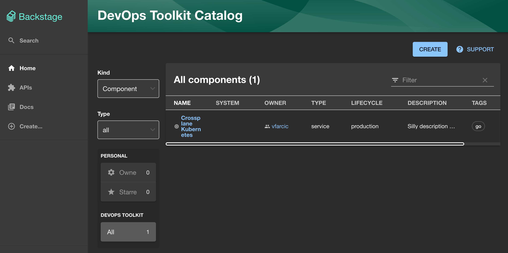
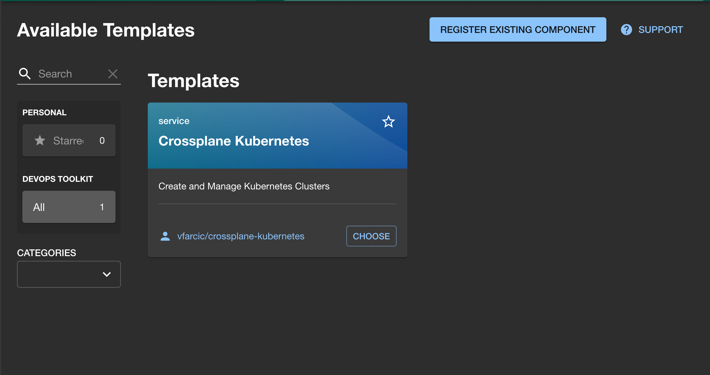
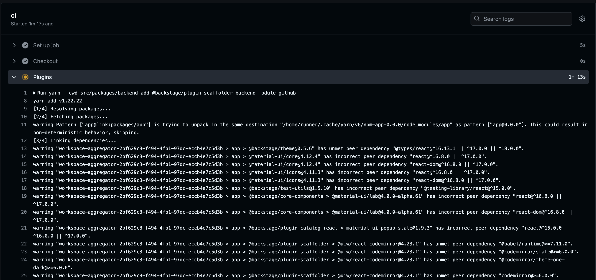

+++
title = 'From Docker to Kubernetes: Running Backstage in Production!'
date = 2024-11-03T16:00:00+00:00
draft = false
+++

Backstage is great, or not, depending how you look at it. In any case, the important thing to note is that the only thing we're getting is source code. Since it's written in TypeScript, we can run it by executing `yarn` this and that or `node` this and something else. While that's probably okay while developing it, it is silly when running it in production or anywhere else other than our laptops. It's **not 1999** any more. Today we package almost everything into container images and, from there on, you might be runnning it in Docker while I scream at you trying to explain why Docker is not a good idea for anything that should run in production. More likely, you are running your applications in Kubernetes, or as Azure Container Apps, or through Google Cloud Run, or anywhere else. What matters is that **OCI images are the standard**, no matter whether we run something as containers or anything else.

<!--more-->



Unfortunately, Backstage does not provide neither final nor even base container images. Similarly, there are no Helm charts or any other official way of running it. There is not even a base we can customize. There is only source code and a Dockefile which is, in my opinion, not the one we should be using. Or, to be more precise, none of those things are provided by the project itself.

So, if we want to run Backstage, we might need to create ourselves a **Dockerfile** and **Kubernetes manifests** and whatever else we might need.

That's what we'll explore today.

We'll see how to package Backstage into **OCI images** and how to run it with **Docker**. From there on, we'll explore how to run it in Kubernetes by defining everything we need as a Helm chart. Finally, we'll see how to package and publish images and charts through CI workflows so that everything is automated and we can focus on writing Backstage code or configuring it while knowing that all the operations are executed every time we push changes to Git.

Now, before we continue, let me stress that I will assume you have basic knowledge how Backstage works. If that's not the case, please watch [Getting Started with Backstage: From Zero to Operational Dev Portal](https://youtu.be/A-3Ai--Z-Gs).

With that out of the way, let's get started with OCI images defined though Dockerfile.

## Setup

> Watch the [GitHub CLI (gh) - How to manage repositories more efficiently](https://youtu.be/BII6ZY2Rnlc) video if you are not familiar with GitHub CLI.

```sh
gh repo fork vfarcic/backstage-demo --clone --remote

cd backstage-demo

gh repo set-default
```

> Select the fork as the default repository.

```sh
git pull upstream main
```

> Make sure that Docker is up-and-running. We'll use it to run Backstage as a Docker container and, later on, to create a Kubernetes KinD cluster.

> Watch [Nix for Everyone: Unleash Devbox for Simplified Development](https://youtu.be/WiFLtcBvGMU) if you are not familiar with Devbox. Alternatively, you can skip Devbox and install all the tools listed in `devbox.json` yourself.

```sh
devbox shell
```

> Please watch [The Future of Shells with Nushell! Shell + Data + Programming Language](https://youtu.be/zoX_S6d-XU4) if you are not familiar with Nushell. Alternatively, you can inspect the `setup/kubernetes.nu` script and transform the instructions in it to Bash or ZShell if you prefer not to use that Nushell script.

```sh
chmod +x setup/kubernetes.nu

./setup/kubernetes.nu

source .env
```

## Build, Push, and Run Backstage with Docker

Here's a Dockerfile I'm using to define all the stages required to build a container image with Backstage.

```sh
cat Dockerfile
```

The output is as follows.

```Dockerfile
FROM node:20-bookworm-slim AS packages

WORKDIR /app
ARG SRC=backstage
COPY $SRC/package.json $SRC/yarn.lock ./
COPY $SRC/.yarn ./.yarn
COPY $SRC/.yarnrc.yml ./
COPY $SRC/packages packages
RUN find packages \! -name "package.json" -mindepth 2 -maxdepth 2 -exec rm -rf {} \+


FROM node:20-bookworm-slim AS build

RUN --mount=type=cache,target=/var/cache/apt,sharing=locked \
    --mount=type=cache,target=/var/lib/apt,sharing=locked \
    apt-get update && \
    apt-get install -y --no-install-recommends python3 g++ build-essential && \
    rm -rf /var/lib/apt/lists/*
RUN --mount=type=cache,target=/var/cache/apt,sharing=locked \
    --mount=type=cache,target=/var/lib/apt,sharing=locked \
    apt-get update && \
    apt-get install -y --no-install-recommends libsqlite3-dev
USER node
WORKDIR /app
COPY --from=packages --chown=node:node /app .
COPY --from=packages --chown=node:node /app/.yarn ./.yarn
COPY --from=packages --chown=node:node /app/.yarnrc.yml  ./
RUN --mount=type=cache,target=/home/node/.cache/yarn,sharing=locked,uid=1000,gid=1000 \
    yarn install --immutable
ARG SRC=backstage
COPY --chown=node:node $SRC/. .
RUN yarn tsc
RUN yarn --cwd packages/backend build
RUN mkdir packages/backend/dist/skeleton packages/backend/dist/bundle \
    && tar xzf packages/backend/dist/skeleton.tar.gz -C packages/backend/dist/skeleton \
    && tar xzf packages/backend/dist/bundle.tar.gz -C packages/backend/dist/bundle


FROM node:20-bookworm-slim

RUN --mount=type=cache,target=/var/cache/apt,sharing=locked \
    --mount=type=cache,target=/var/lib/apt,sharing=locked \
    apt-get update && \
    apt-get install -y --no-install-recommends python3 g++ build-essential && \
    yarn config set python /usr/bin/python3
RUN --mount=type=cache,target=/var/cache/apt,sharing=locked \
    --mount=type=cache,target=/var/lib/apt,sharing=locked \
    apt-get update && \
    apt-get install -y --no-install-recommends libsqlite3-dev
USER node
WORKDIR /app
COPY --from=build --chown=node:node /app/.yarn ./.yarn
COPY --from=build --chown=node:node /app/.yarnrc.yml  ./
COPY --from=build --chown=node:node /app/yarn.lock /app/package.json /app/packages/backend/dist/skeleton/ ./
RUN --mount=type=cache,target=/home/node/.cache/yarn,sharing=locked,uid=1000,gid=1000 \
    yarn workspaces focus --all --production && rm -rf "$(yarn cache clean)"
COPY --from=build --chown=node:node /app/packages/backend/dist/bundle/ ./
COPY --chown=node:node app-config*.yaml ./
ARG SRC=backstage
COPY --chown=node:node $SRC/examples ./examples
ENV NODE_ENV=production
ENV NODE_OPTIONS="--no-node-snapshot"
CMD ["node", "packages/backend", "--config", "app-config.yaml", "--config", "app-config.ingress.yaml", "--config", "app-config.production.yaml"]
```

That Dockerfile is very similar to what is presented in the Backstage documentation which, by the way, is not available in the project repo or, if it is, there is no link to it in the documentation. I cannot explain why is that so without being vulgar. I might not resist that urge later but, for now, I will contain myself. We just started. There's still time.

Anyways... That Dockerfile uses multi-stage builds where each stage starts with a `FROM` statement and only the last one is kept as the final image. That way we can do whatever needs to be donem without carrying over leftovers from ativities that should not be available in the final image.

The first stage copies all the files we'll need for the second stage that, essentially installs the dependencies and builds packages. The last stage is where the actual resources we'll need are built and the final image is created.

The only thing that matters here are the first few lines in the first stage.

Over there, we are setting the work directory (`WORKDIR`) to `/app` and defining the `SRC` variable that points to the local source code. That's where the cloned Backstage repo is. I prefer never changing it in any form or way so that I can always pull the latest version without running into conflicts between my files and Backstage repo. That's yet another Backstage sillyness that "forced" me to have a repo with my configs and plugins separate from the original Backstage repo. I explained in more detail that strategy in [Getting Started with Backstage: From Zero to Operational Dev Portal](https://youtu.be/A-3Ai--Z-Gs). If you haven't watched it already, you might want to pause this video and watch that one first.

Anyways, the two `COPY` instructions are copying packages from local file system to the container image and the rest of that Dockerfile are mostly *apt-get* and *yarn* commands.

I won't go into more details since I'm assuming that you are familiar with building container image with Dockerfile. I'll also skip explaining Backstage specific steps in that Dockerfile since it is... madness that reflects the complexities of Backstage itself.

What matters is that Backstage will run with three config files. There is `app-config.yaml` which is, essentially, the same configuration file we're using while developing and running Backstage locally. The other two (`app-config.ingress.yaml`, `app-config.production.yaml`) are custom and are used to provide additional values or overwrite those that already exist but should be different in production.

Let's take a look at them, starting with `app-config.ingress.yaml`.

```sh
cat app-config.ingress.yaml
```

The output is as follows.

```yaml
app:
  baseUrl: ${BACKSTAGE_HOST}
backend:
  baseUrl: ${BACKSTAGE_HOST}
```

That's a simple one. It overwrites `baseUrl` for the front-end (`app`) and the `backend` with the environment variable. That way we don't have to worry what the host will be while building the image since we can define it in manifests that will use that image.

The `app-config.production.yaml` is simple as well.

```sh
cat app-config.production.yaml
```

The output is as follows.

```yaml
backend:
  database:
    client: pg
    connection:
      host: ${DB_HOST}
      port: 5432
      user: ${user}
      password: ${password}
catalog:
  providers:
    github:
      catalogInfo:
        filters:
          branch: main
          repository: ".*"
      templates:
        filters:
          branch: main
          repository: ".*"
```

Over there we are telling Backstage that we'd like to use a "real" instead of the in-memory `database` used by default. While in-memory is useful when running it locally, especially while developing, "real" Backstage usage needs a "real" PostgreSQL database.

Just as Ingress, database settings are using environment variables (`DB_HOST`, `user`, `password`) which we'll set up later.

Besides the database, we are adding `github` as one of the `catalog` `providers`. It will get catalogs from the `main` branch from any of the repositories in the organization (`*`). Similarly, it will olso retrieve `templates` from any of the repositories (`.*`).

Now, before we continue, let me be clear that this is not necessarily the full production setup. That would depend on your needs so you might want to modify those configuration files by, for example, adding authentication or whatever else you might need. If there's enough interest, I can create another video with everything I believe we should do to run Backstage in production. Right now, we'd mostly focused on all the steps we might perform to get to production in one form or another.

Let's get back to the task at hand and build the image.

```sh
docker image build \
    --tag ghcr.io/$GITHUB_USER/backstage-demo:v0.0.1 .
```

The output is as follows (truncated for brevity).

```
[+] Building 247.0s (26/26) FINISHED                        docker:desktop-linux
 => [internal] load build definition from Dockerfile                        0.0s
 => => transferring dockerfile: 2.53kB                                      0.0s
 => [internal] load metadata for docker.io/library/node:20-bookworm-slim    1.7s
 => [auth] library/node:pull token for registry-1.docker.io                 0.0s
 => [internal] load .dockerignore                                           0.0s
...
What's next:
    View a summary of image vulnerabilities and recommendations → docker scout quickview
```

Building Backstage image might take anything from a a **few seconds to infinity**. There's a lot going on there. Backstage is based on NodeJS meaning that half the Internet worth of libraries need to be downloaded, it's based on Node image but needs to install Python and a few other dependencies with *apt-get*, and so on and and so forth. We could speed it up by performing some actions without Docker so that some commands are executed faster, since that would give us more effective caching and a few other boosts. Still, even though multi-stage builds might be slower, I prefer that since they are self-contained. Hence, we can accomplish the whole process with a single *docker image build*  command instead of having to execute *yarn* this prior to building images.

Actually, that is not completely true. We'll still need to execute a few commands, but we'll get to that part later.

Let's fast forward to the end of the process that will, ultimately, build the image over 1GB big. If it would be a human, we would need to come up with a new term to explain it being beyond obese (uber obese?). If that's not how you like it, blame Backstage, not me.

That was enough mocking poor Backstage. Let's push the image.

```sh
docker image push ghcr.io/$GITHUB_USER/backstage-demo:v0.0.1
```

Since we're pushing it to GitHub Container Registry, it is private by default, and, to make it easier to run it, we'll change it to public by opening the package settings page,...

```sh
echo "https://github.com/users/$GITHUB_USER/packages/container/backstage-demo/settings"
```

...and changing the visibility to `Public`.

> Open the URL from the output of the previous command in a browser, click the `Change Visibility` button, select `Public`, type `backstage-demo` to confirm, and click the `I understand the consequences, change package visibility` button.

While we're there, we should add that image to the repository as well.

> Click the `Add Repository` button, select `backstage-demo`, and click the `Add repositories` button. Make sure that the `Role` is set to `Write` or `Admin`.

That's it. Now we have the image and we can run it as a container wherever we normally run applications. That could be Docker, Kubernetes, Azure Container Apps, Google Cloud Run, or almost any other service that supports containers.

Let's have an easy start with Docker just to confirm that it's working and, if it is, progress towards Kubernetes.

If I wrote the instructions I'm about to execute five years ago, I'd define Docker Compose file. However, since I don't think that Docker Compose makes sense today, we'll execute quick and dirty `docker container run`. We'll publish the default Backstage port `7007` and use environment variables to run it in the `development` mode and to set GitHub `USER` and `TOKEN` since this version of Backstage needs it to discover catalogs and other entities from our GitHub repositories. Next is the image we just built and, finally, we'll overwrite the default command to be `node package/backend` with the `app-config.yaml`. That last step is important since, as we already discussed, there are three config files in production, one for ingress and another for the database. Right now, there is probably no need to bother setting those up so we're limiting ourselves to `app-config.yaml` that is available in Backstage by default.

```sh
docker container run --interactive --tty --publish 7007:7007 \
    --env NODE_ENV=development --env GITHUB_USER=$GITHUB_USER \
    --env GITHUB_TOKEN=$GITHUB_TOKEN \
    ghcr.io/$GITHUB_USER/backstage-demo:v0.0.1 \
    node packages/backend --config app-config.yaml
```

I'm not proud of that *docker container run* command, but I did not want to spend a second more than necessary with it since we will not run Backstage like that. The goal of that command is to execute it once, validate that the image works as expected, and never see or use that command again.

We can see that it looks okay by opening [http://localhost:7007](http://localhost:7007) in a browser.

> Open http://localhost:7007 in a browser

We should see `Crossplane Kubernetes` catalog on the home screen, thus confirming that GitHub discovery works.



Similarly, if we click the `CREATE` button, we should see the `Crossplane Kubernetes` template as well.



It seems that the image with everything we explored in the [Getting Started with Backstage: From Zero to Operational Dev Portal](https://youtu.be/A-3Ai--Z-Gs) video work. Since, as I already mentioned, we will run it in Kubernetes, we can stop the container running through Docker, and move on.

> Press `ctrl+c` to stop running the container with Docker.

## Run Backstage in Kubernetes

Next, we need to define quite a few Kubernetes resources, probably in some form of templates. Now, this is the moment I would start a rant how any choice for that is better than Helm which is the silliest and the worst option we have in Kubernetes. However, I know that many of you love Helm more than your children so I won't say that Helm is the worst choice. I'll keep that opinion to myself and pretend that I'm also in love with it

Let's take a look at Helm templates I defined.

```sh
cat chart/templates/*.yaml
```

The output is as follows.

```yaml
{{- if eq .Values.mode "production" -}}
---
apiVersion: postgresql.cnpg.io/v1
kind: Cluster
metadata:
  name: {{ include "backstage-demo.fullname" . }}-db
  labels:
    {{- include "backstage-demo.labels" . | nindent 4 }}
spec:
  instances: {{ .Values.db.instances }}
  storage:
    size: 1Gi
  enableSuperuserAccess: true
{{- end -}}
---
apiVersion: apps/v1
kind: Deployment
metadata:
  name: {{ include "backstage-demo.fullname" . }}
  labels:
    {{- include "backstage-demo.labels" . | nindent 4 }}
spec:
  replicas: {{ .Values.replicaCount }}
  selector:
    matchLabels:
      {{- include "backstage-demo.selectorLabels" . | nindent 6 }}
  template:
    metadata:
      {{- with .Values.podAnnotations }}
      annotations:
        {{- toYaml . | nindent 8 }}
      {{- end }}
      labels:
        {{- include "backstage-demo.labels" . | nindent 8 }}
        {{- with .Values.podLabels }}
        {{- toYaml . | nindent 8 }}
        {{- end }}
    spec:
      containers:
        - name: {{ .Chart.Name }}
          image: "{{ .Values.image.repository }}:{{ .Values.image.tag | default .Chart.AppVersion }}"
          imagePullPolicy: IfNotPresent
          ports:
            - name: http
              containerPort: 7007
          env:
            - name: NODE_ENV
              value: development
            - name: BACKSTAGE_HOST
              value: http://{{ .Values.ingress.host }}
            - name: DB_HOST
              value: {{ include "backstage-demo.fullname" . }}-db-rw
          envFrom:
            {{- if eq .Values.mode "production" }}
            - secretRef:
                name: {{ include "backstage-demo.fullname" . }}-db-superuser
            {{- end }}
            - secretRef:
                name: {{ include "backstage-demo.fullname" . }}
          {{- if eq .Values.mode "development" }}
          command: ["node", "packages/backend", "--config", "app-config.yaml", "--config", "app-config.ingress.yaml"]
          {{- end }}
---
apiVersion: networking.k8s.io/v1
kind: Ingress
metadata:
  name: {{ include "backstage-demo.fullname" . }}
  labels:
    {{- include "backstage-demo.labels" . | nindent 4 }}
spec:
  ingressClassName: {{ .Values.ingress.className }}
  rules:
    - host: {{ .Values.ingress.host }}
      http:
        paths:
          - backend:
              service:
                name: {{ include "backstage-demo.fullname" . }}
                port:
                  number: 80
            path: /
            pathType: ImplementationSpecific
---
apiVersion: v1
kind: Service
metadata:
  name: {{ include "backstage-demo.fullname" . }}
  labels:
    {{- include "backstage-demo.labels" . | nindent 4 }}
spec:
  type: ClusterIP
  ports:
    - port: 80
      targetPort: http
      name: http
  selector:
    {{- include "backstage-demo.selectorLabels" . | nindent 4 }}
```

That's a relatively simple template. It starts with a conditional that checks whether the `mode` value is set to `production`. If it is, we are deploying CNPG `Cluster`. The alternative could be to run PostgreSQL in AWS, Azure, or Google Cloud but, today, we are opting for self-managed setup and, in my opinion, Cloud-Native PostgreSQL is the best option we have today. If you're not familiar with it, you might want to check [Should We Run Databases In Kubernetes? CloudNativePG (CNPG) PostgreSQL](https://youtu.be/Ny9RxM6H6Hg).

Further on, we are creating a `Deployment` that will result in a ReplicaSet which will create a Pod with a container that uses the image we just built. We are also setting up the environment variables that can be used to decide whether to run it in development or production mode (`NODE_ENV`), what the Backstage host will be (`BACKSTAGE_HOST`), and what the database host is (`DB_HOST`). Database and GitHub credentials are also provided as environment variables (`envFrom`) but loaded from secrets (`secretRef`).

Then we have `Ingress` that enables us to open Backstage in a browser (from outside the cluster) and the `Service` through which both Ingress and internal communication will be handled.

All that is pretty basic, at least for those already familiar with Kubernetes. Still, I am very dissapointed that Backstage did not provide some kind of an official chart. While it's not a big deal to create such a chart ourselves, it is reasonable to expect a project we're planning to use to have official charts and official images, even if the latter might need to be used as a base image on top of which we add additional plagins, configurations, and other things specific to our setup.

Before we apply that chart, we should create the Namespace where Backstage will be running,...

```sh
kubectl create namespace backstage
```

...and the secret with the GitHub credentials.

```sh
echo "
apiVersion: v1
kind: Secret
metadata:
  name: backstage-backstage-demo
  namespace: backstage
type: Opaque
data:
  GITHUB_TOKEN: $(echo $GITHUB_TOKEN | base64)
  GITHUB_USER: $(echo $GITHUB_USER | base64)
" | kubectl --namespace backstage apply --filename -
```

To be honest, I am ashamed of creating the secret like that. We should have used [External Secrets Operator](https://youtu.be/SyRZe5YVCVk). The only reason we are not is that I felt this post is growing to be longer than I planned so I did not want to extend the scope beyond the absolute minimum that should get you going fast.

Finally, let's take a quick look at the values file.

```sh
cat chart/values.yaml
```

The output is as follows.

```yaml
mode: production
image:
  repository: ghcr.io/vfarcic/backstage-demo
  tag: v0.0.1
db:
  instances: 1
ingress:
  className: nginx
  host: backstage.127.0.0.1.nip.io
appVersion: 0.0.1
```

Those are the values that we are likely to change over time. That's where we can define the `mode`, change the `image` `tag`, scale the database `instances`, and set the `ingress` `host`.

That's it. Now we are ready to deploy Backstage to our Kubernetes cluster by executing `helm upgrade` that points to the local `./chart` directory. Initially, we'll run it in the `development` mode to test it out. That's probably the mode we'd use locally when trying it on our laptops.

```sh
helm upgrade --install backstage ./chart \
    --namespace backstage --set mode=development --wait
```

It might take a few moments until all the resources are operational and we can check whether we succeeded by opening `http://backstage.127.0.0.1.nip.io` in a browser.

> Open `http://backstage.127.0.0.1.nip.io` in a browser

We can see that the outcome is the same as when we run it with Docker except that it is now running in Kubernetes, with all the advantages that gives us.

Now, let's say that we switched our Kube config to point to the production cluster. Over there, we would first need to deploy Cloud-Native PostgreSQL chart which installs the operator our templates use to create PostgreSQL Cluster.

```sh
helm upgrade --install cnpg cloudnative-pg \
    --repo https://cloudnative-pg.github.io/charts \
    --namespace cnpg-system --create-namespace --wait
```

That's it. Now we can execute almosst identical `helm upgrade` command. The only difference is that we are setting the `mode` to `production` which, among other things, deploy CNPG Cluster and instruct Backstage to use it instead of the in-memory database.

```sh
helm upgrade --install backstage ./chart \
    --namespace backstage --set mode=production --wait
```

This will take even more time since, this time, we need not only to wait for Backstage to decide to wake up but also for CNPG Cluster to be created and set up. 

After a while, we should be able to open it in a browser.

> Open `http://backstage.127.0.0.1.nip.io` in a browser.

The end result is, at least visually, still the same. The difference is in what's happening behind the scenes. This time, Backstage is storing its data permanently in the database while the previous versions would loose everything the moment we restart or upgrade Backstage Pods.

The chart is now ready, but we still have work to do. Among other things, we should package and publish our Backstage chart so that we can run it without having to clone the repo. But, before we do that, let's `uninstall` it first.

```sh
helm --namespace backstage uninstall backstage
```

## Build, Package, and Push Backstage Automatically

Packaging the chart we created is easy. We can simply execute `helm package chart`,...

```sh
helm package chart
```

...and we get Tar file we could push to a registy. We won't do that. Instead, we'll try to automate everything so that the whole process of building image and packaging and publishing the chart is executed automatically every time we make any changes to our repository. We'll use GitHub Actions for that. If you prefer a different type of workflows, you should be able to translate what we are about to do to whichever format your pipelines expect you to use.

Here's the workflow definition I prepared.

```sh
cat .github/workflows/ci.yaml
```

The output is as follows.

```yaml
name: ci
run-name: ci
on:
  push:
    branches:
      - main
jobs:
  ci:
    runs-on: ubuntu-latest
    env:
      TAG: 0.0.${{ github.run_number }}
    steps:
      - name: Checkout
        uses: actions/checkout@v4
      - name: Plugins
        run: |
          yarn --cwd src/packages/backend add @backstage/plugin-scaffolder-backend-module-github
          yarn --cwd src/packages/backend add @backstage/plugin-catalog-backend-module-github
          cp packages/backend/src/index.ts src/packages/backend/src/index.ts
      - name: Set up QEMU
        uses: docker/setup-qemu-action@v3
      - name: Set up Docker Buildx
        uses: docker/setup-buildx-action@v3
      - name: Login to ghcr
        uses: docker/login-action@v3
        with:
          registry: ghcr.io
          username: ${{ github.actor }}
          password: ${{ secrets.GITHUB_TOKEN }}
      - name: Build and push container image
        uses: docker/build-push-action@v6
        with:
          push: true
          tags: ghcr.io/${{ github.repository }}:${{ env.TAG }},ghcr.io/${{ github.repository }}:latest
          build-args: |
            SRC=src
          cache-from: type=registry,ref=user/app:latest
          cache-to: type=inline
          platforms: linux/amd64,linux/arm64
      - name: Package Helm
        run: |
          env
          yq --inplace ".version = \"${{ env.TAG }}\"" chart/Chart.yaml
          yq --inplace ".appVersion = \"${{ env.TAG }}\"" chart/Chart.yaml
          helm package chart
          helm push backstage-demo-${{ env.TAG }}.tgz oci://ghcr.io/${{ github.repository }}
      - name: Publish Helm
        uses: actions/upload-artifact@v4
        with:
          name: backstage-demo-helm
          path: backstage-demo-${{ env.TAG }}.tgz
      - name: Commit changes
        run: |
          git config --local user.email "41898282+github-actions[bot]@users.noreply.github.com"
          git config --local user.name "github-actions[bot]"
          git add .
          git commit -m "Release ${{ env.TAG }} [skip ci]"
      - name: Push changes
        uses: ad-m/github-push-action@master
        with:
          github_token: ${{ secrets.GITHUB_TOKEN }}
          branch: ${{ github.ref }}
```

The workflow starts by checking out the repo (`Checkout`).

After that comes my personal dedication to keep the original Backstage repo intact. It's cloned inside the src directory. Now, since I need some plugins, the pipeline executes `yarn` that adds them to the `src` directory. Since that is not enough for Backstage, some modifications must be done to the `index.ts` file so I'm copying that one as well.

That was probably the only unusual or confusing part of the workflow. The rest should be pretty uneventful and, hopefully, something you already did before.

We're setting up a Docker container for running virtual machines using `QEMU`. That's where the image will be built. Inside it we are setting up `Buildx` which will do the actual build and, further on, we are logging into the container image registry which, in this case, is GitHub Container Registry or `ghcr`.

With everything set up, we are building and pushing the image (`Build and push container image`).

To `Package Helm`, we are first changing the `.version` and `appVersion` in `Chart.yaml`, then executing `helm package` and `helm push` commands. With the Helm package created, we are publishing the chart itself (`Publish Helm`).

Finally, we are committing (`Commit changes`) and pushing (`Push changes`) whichever changes we made back to the repo.

That's all there is to it. Add plugins and whichever other changes we want to make to Backstage, build and push the container image, package and publish the Helm chart, and push changes back to the repo. Easy!

The only thing left is to push the changes we made locally. That will not only put whichever changes we made during the setup but also initiate the first GitHub Actions workflow.

So, here it goes.

Add,...

```sh
git add .
```

...commit,...

```sh
git commit -m "Is it working?"
```

...and push.

```sh
git push
```

All that's left is a bit of patience. It can take a long time for underpowered GitHub Actions to build an image of the obese Backstage. The good news is that the second run should be much much faster.

I won't make you stare at the screen during that hour of torture. Instead, if you are following along, you should go get a coffee and see an episode of whichever Netflix show you're currently watching. Otherwise, if you do like straring at the screen, execute `gh repo view --web` and navigate to `Actions` where you'll see the workflow run. 



Once the run is finished, we should be able to pull the changes tfromo the repo,...

```sh
git pull
```

...before we put it all together.

## All Together

As we already saw, the workflow is, among other things, modifying the version in Chart.yaml and we can use that to get the tag we just published.

```sh
export TAG=$(cat chart/Chart.yaml | yq .version)
```

With the tag at hand, we can apply the chart from the repository by executing `helm upgrade` that references the `oci` image with the chart we just packaged, pass the `version` and we set the `mode` to `production`.

```sh
helm upgrade --install backstage \
    oci://ghcr.io/$GITHUB_USER/backstage-demo/backstage-demo \
    --version $TAG --namespace backstage --set mode=production \
    --wait
```

The end result should be Backstage running in your cluster. We can confirm that by opening it in a browser.

> Open `http://backstage.127.0.0.1.nip.io` in a browser

Before we part ways, please note that there's much more we should do to make it really "production-ready". Besides adding authentication and whichever other plugins you might be using, we should probably sync changes using Argo CD or Flux, add some policies with Kyverno, switch to a managed database using Crossplane, and whatever else you are using today.

I already explored those in other videos so I won't repeat myself here. If there is something specific I should expand on, please let me know in the comments and I'll do my best to cover it. For now, all I will say is...

Thank you for watching.
See you in the next one.
Cheers.

## Destroy

```sh
kind delete cluster

exit
```

