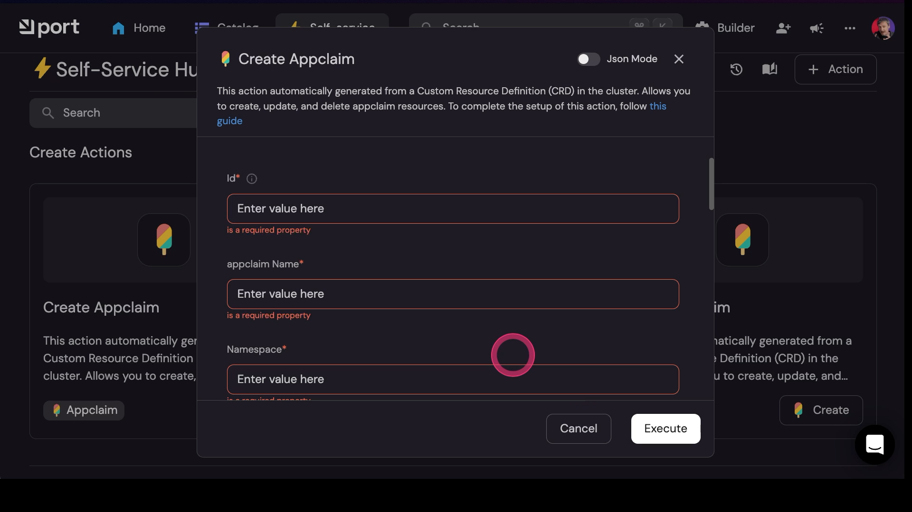
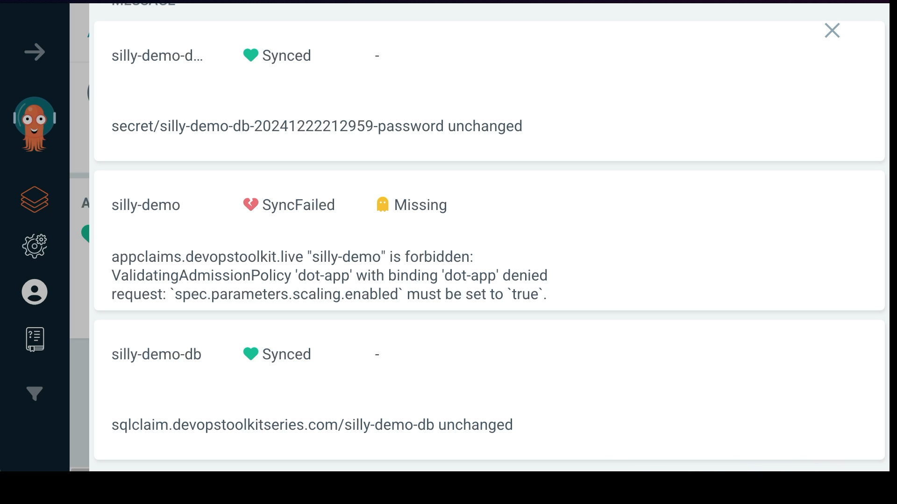

+++
title = 'From UX to API: Mastering Platform Validations with Kubernetes Validating Admission Policies'
date = 2025-01-27T14:00:00+00:00
draft = false
+++

**Validations** are extremely important when building Internal Developer Platforms, or any platforms for that matter. They serve two primary purposes. They help us ensure that user's requests are valid before they are processed by the platform and they make user experience better. The problem, however, is that people mix those two all the time. One is ensuring that something is **valid** and the other is improving **user experience** without guaranteering validity of the requests. The first group are "real" policies while the other is just UX.

<!--more-->



Let me give you a few examples, and you tell me which is which.



This is a Web UI which has some fields set as required forcing users to fill in those that must have some values. It also has other type of validations like those on `Scaling Max` and `Scaling Min` fields that force users to put a value greater than or equal to `2`. If any of the values in that form is not correct or is missing, users cannot proceed. Does that qualify as policies that ensure that only valid requests are sent to the platform?

Here's a different example, this time with a custom-made CLI-like script.

> Do NOT try to execute the commands from this section. This is only a preview. We'll set up everything later.

If I try to build an image without specifying the tag,...

```sh
platform build image
```

The output is as follows.

```
Error: nu::parser::missing_positional

  × Missing required positional argument.
   ╭─[<commandline>:1:17]
 1 │ main build image
   ╰────
  help: Usage: platform build image {flags} <tag> . Use `--help` for
        more information.
```

...I get the message that it is a required argument. Arguably, I could have made that a bit better output message. Still, the point is that images, in this scenario, cannot be built without tags, so the CLI prevented users from doing that. Does that qualify as policies that ensure that only valid operations are performed?

How about *kubectl*? If we, for example, try to apply a manifest to the Namespace (`b-team`) that does not exist,...

```sh
kubectl --namespace b-team apply --filename crossplane/repo.yaml
```

...we get the message `Error from server (NotFound)... namespaces "b-team" not found`. Assuming that, in this scenario, Kubernetes is the platform, does that qualify as a policy that ensures that only valid requests are passed through?

There are cases where we cannot validate input like, for example, in the case of Git.

Let's say that I would like to push a manifest to Git so that Argo CD or Flux picks it up and synchronizes modified resource manifests into the cluster. So, if we `add`,...

```sh
git add .
```

...commit,...

```sh
git commit -m "This time with Argo CD"
```

...and push changes,...

```sh
git push
```

...we get no message except that the push was successful. We could, at least in theory, validate that what was pushed is correct, but I doubt that we could do that in practice given that anything could be inside that commit.

Here's the last example I prepared.



This is Argo CD UI that is trying to synchronize the previous commit to the cluster. If we take a look at the `silly-demo` `appclaim` we can see the message that it `is forbidden` because some `ValidatingAdmissionPolicy` says that resource is not allowed to be synchronized into the cluster. Is that a policy that ensures that only valid requests are synchronized into the cluster that acts as a platform?

Among all those examples, only two are actual policies that prevent incorrect inputs into the platform, and neither of them are enforced by the tool we used. When we executed *kubectl apply*, the message that the Namespace does not exist did not come from *kubectl* but from the cluster itself. *kubectl* has no idea which Namespaces exist and which don't. It sent a request to Kubernetes API which responded with "though shall not pass".

Similarly, the message we saw in Argo CD does not come from Argo CD. It has no idea what are valid and what are invalid resources. Instead, just as *kubectl*, it sent a request to Kubernetes API which, again, responded with "You cannot do that. Go away." The only thing Argo CD did was to show us the message it received as the response from Kubernetes API.

The examples from the Port Web UI and the custom CLI are **client-side validations**. They improve user experience since they help them see the issues sooner rather than latter, but they do not prevent users from doing what they should not do. Now, that sentence might sound confusing. After all, if we did do not fill in the required fields or we do not put the correct values, the Web UI will not let us submit data. While that is technically correct, that sentence is based on a wrong assumption.

It assumes that there is only one interface that can be used with the platform. More often than not, that is not true. The fact that we allow users to use that Web UI to interact with the platform API does not mean that there are no other paths available. Having a Web UI does not mean that people cannot synchronize the desired state into the cluster, the platform, using GitOps. That Web UI could be sending requests directly to Kubernetes API or it might be pushing manifests to Git so that Argo CD or Flux synchronize them in the true GitOps fashion. If the Web UI can push changes to Git, something else or someone else could do that as well, just as I did earlier. Someone else might be interacting with the cluster using a CLI like *kubectl*. Heck, someone could be using *curl* to talk to it.

The point I'm trying to make is that there can be an infinite number of ways one can interact with an API so we cannot rely on a single one of those ensuring that requests are valid.

We could, at least in theory, put validation in all the possible tools that might interact with an API, but that would be silly. That would never end since we would need to implement the same set of validations over and over again only to discover that it is impossible to fight against infinity.

All in all, the only way to run reliable and safe validations is to have processes that do that on the right side of the API. Instead of trying to add them to every single tool that interacts with an API, we can instruct the API itself to validate incomming requests, no matter where they are coming from, and, depending on those validations, let them pass or reject them.

Does that mean that we should not validate anything inside Web UIs, CLIs, or whichever other mechanism we might have to interact with an API? The answer to that question depends on the user experience we want to create.

Here's an example. Inside my cluster I might have a policy that validates that the specific field of a specific kind of a resource is a number and that it is greater to or equal to 2. That would be functionally the same validation as the one we saw in the Web UI earlier. If the data from that form was submitted to the API, API would reject it if the value of that field does not match the rules. Still, from the UX perspective, it is nicer to get that feedback while we're typing the value than to wait to click the button and get the response from the server. That's user experience, not reliable validation of the input.

So, there is user experience and there are policies or, to be more precise, ultimate validations that inputs are correct. Implementatioon of UX validations depend on the tool we're working with and might need to be implemented in multiple places. The "real" **validations** are those **performed by APIs** when they are deciding whether to prosecess or reject requests. If you can do only one of those, do the latter, the validations by the API. That does not mean that UX is not important, it is, and you should certainly make user experience good. Still, if we cannot do both, API is where we should focus.

Luckily, in case of Kubernetes, there is a mechanism to do just that baked into it. It's called **Admission Controller Webhooks** which can validate any individual request sent to the API. In the past, we had to use third-party solutions like Kyverno and OPA to implement those Webhooks. Now, however, we don't necessarily need those any more since Kubernetes now comes with its own implementation of **baked-in policies** based on Admission Controllers.

That's what we'll explore today. We'll see how we can use Validating Admission Policy to validate requests coming into the API with the goal to enable users of our Kubernetes-based platform to do the right thing.

## Setup

```sh
git clone https://github.com/vfarcic/idp-full-demo

cd idp-full-demo

git fetch

git checkout policies
```

> Make sure that Docker is up-and-running. We'll use it to create a Kubernetes KinD cluster.

> Watch [Nix for Everyone: Unleash Devbox for Simplified Development](https://youtu.be/WiFLtcBvGMU) if you are not familiar with Devbox. Alternatively, you can skip Devbox and install all the tools listed in `devbox.json` yourself.

```sh
devbox shell
```

> Watch [The Future of Shells with Nushell! Shell + Data + Programming Language](https://youtu.be/zoX_S6d-XU4) if you are not familiar with Nushell. Alternatively, you can inspect the `setup/kubernetes.nu` script and transform the instructions in it to Bash or ZShell if you prefer not to use that Nushell script.

```sh
chmod +x platform

platform setup policies

source .env
```

## The Problem with Admission Controllers

Here's an example of a typical set of resources we might have to run an application in Kubernetes.

```sh
cat kubernetes/app.yaml
```

The output is as follows.

```yaml
---
apiVersion: apps/v1
kind: Deployment
metadata:
  labels:
    app.kubernetes.io/name: silly-demo
  name: silly-demo
spec:
  replicas: 2
  selector:
    matchLabels:
      app.kubernetes.io/name: silly-demo
  template:
    metadata:
      labels:
        app.kubernetes.io/name: silly-demo
    spec:
      shareProcessNamespace: true
      containers:
      - image: ghcr.io/vfarcic/silly-demo:1.4.327
        livenessProbe:
          httpGet:
            path: /
            port: 8080
        name: silly-demo
        ports:
        - containerPort: 8080
        readinessProbe:
          httpGet:
            path: /
            port: 8080
        resources:
          limits:
            cpu: 500m
            memory: 512Mi
          requests:
            cpu: 250m
            memory: 256Mi
---
apiVersion: networking.k8s.io/v1
kind: Ingress
metadata:
  labels:
    app.kubernetes.io/name: silly-demo
  name: silly-demo
spec:
  ingressClassName: nginx
  rules:
  - host: silly-demo.127.0.0.1.nip.io
    http:
      paths:
      - backend:
          service:
            name: silly-demo
            port:
              number: 8080
        path: /
        pathType: ImplementationSpecific
---
apiVersion: v1
kind: Service
metadata:
  labels:
    app.kubernetes.io/name: silly-demo
  name: silly-demo
spec:
  ports:
  - name: http
    port: 8080
    protocol: TCP
    targetPort: 8080
  selector:
    app.kubernetes.io/name: silly-demo
  type: ClusterIP
```

That's a `Deployment`, an `Ingress`, and a `Service`. Normally, our applications would be more complicated than that but, for the sake of the demo, that should be enough.

Now, if we execute `kubect ... apply`,...

```sh
kubectl --namespace a-team apply --filename kubernetes/app.yaml
```

...we can see the the `deployment`, the `ingress`, and the `service` was created, even though we might not want to allow them to be created.

Let's say that we would like to have a rule that says that each application needs to have at least two replicas for availability and performance reasons. How could we ensure such a rule is enforced? Should we create a rule that allows only Deployments that have the *spec.replicas* value set and that the value must be greater than *1*? Well... We cannot do that since there are many ways how we could get multiple replicas of an application in Kubernetes. Aside from defining the number of replicas in the Deployment resource, we could use HorizontalPodAutoscaler (HPA) instead. If we do, it would do the scaling depending on metrics. However, we might choose KEDA instead which also does automated scaling, but provides many more options to define the conditions that result in scaling.

So, we do not necessarily know how one might fullfil the requirement that an application must have multiple replicas and, therefore, cannot enforce a policy.

Now, we could say that everyone MUST use HorizontalPodAutoscaler. If we do that, we still could not create a policy based on admission controller webhooks since they are fired for each resource individually. When a request to create or update a Deployment is sent to Kubernetes API, there is no guarantee that HPA was not already created or will be created afterwards. Kubernetes is all about eventual consistency so we cannot be sure that HPA is created before the Deployment so we cannot define a policy that prevents creation of Deployments that do not have matching HPA.

The solution to that problem, and quite a few others, is to create our own abstractions. We can, for example, create our own *Application* CRD that will expand into Deployment, Service, Ingress, HPA, or anything else we might need to run an application. If we do that, we will accomplish at least two objectives. First, we'll make a user-friendly interface developers can use. That, however, is not the subject of this post. The second objective is that we can define policies that allow or dissalow certain capabilities without worrying whether those capabilities are implemented by one, two, or any other number of resources. After all, a big part of the work on developer platforms is creating the abstractions that enable users to accomplish certain goals without going crazy. It's about creating the right level of abstractions and in Kubernetes we do that through CRDs and controllers.

Fortunately, there are many tools that help us to that with relative ease. There is KubeVela, Crossplane, Kro, and many others. I will use Crossplane today, mostly because that's the project I'm working on.

*The important note is that today's post is not about Crossplane and that you should be able to create CRDs and controllers with many other tools. We just need it to demonstrate the point I'm trying to make.*

Let's remove the resources we created earlier and start over.

```sh
kubectl --namespace a-team delete --filename kubernetes/app.yaml
```

Here's an example of an application definition we'll use.

```sh
cat tmp/appclaim.yaml
```

The output is as follows.

```yaml
apiVersion: devopstoolkit.live/v1alpha1
kind: AppClaim
metadata:
  name: silly-demo
  labels:
    app-owner: vfarcic
spec:
  id: silly-demo
  compositionSelector:
    matchLabels:
      type: backend
      location: local
  parameters:
    namespace: a-team
    image: ghcr.io/vfarcic/idp-full-demo
    tag: "0.0.5"
    port: 8080
    host: silly-demo.127.0.0.1.nip.io
    ingressClassName: nginx
```

Over there we're defining only the things that matter like the `id` and the type of the application (`backend`) and a few `parameters` like the `namespace`, the `image`, the `tag`, and a few others.

That is functionally the same as what we saw before. If we apply it, it will create a Deployment, an Ingress, and a Service. The major difference is that creating a policy that, for example, prevents deployment of an application that does not have multiple replicas will be much easier. As I already mentioned, the fact that single resource is much more user-friendly than having to define multiple low-level Kubernetes resources is not important since that's outside today's scope.

Let's confirm that we can indeed `apply` that resource,...

```sh
kubectl --namespace a-team apply --filename tmp/appclaim.yaml
```

...and that it composed the same resources as before.

```sh
kubectl --namespace a-team get all,ingresses
```

The output is as follows.

```
NAME                              READY   STATUS    RESTARTS   AGE
pod/silly-demo-67556fd8fc-9hff6   1/1     Running   0          6s

NAME                 TYPE        CLUSTER-IP      EXTERNAL-IP   PORT(S)    AGE
service/silly-demo   ClusterIP   10.96.168.188   <none>        8080/TCP   6s

NAME                         READY   UP-TO-DATE   AVAILABLE   AGE
deployment.apps/silly-demo   1/1     1            1           6s

NAME                                    DESIRED   CURRENT   READY   AGE
replicaset.apps/silly-demo-67556fd8fc   1         1         1       6s

NAME                                   CLASS   HOSTS                         ADDRESS   PORTS   AGE
ingress.networking.k8s.io/silly-demo   nginx   silly-demo.127.0.0.1.nip.io             80      6s
```

That's it. Now that we have the abstraction we can work with, we can, finally, create the policy we talked about. But, before we do, let's remove that Claim first.

```sh
kubectl --namespace a-team delete --filename tmp/appclaim.yaml
```

## Kubernetes Validating Admission Policy

Let's take a look at a policy I prepared.

```sh
cat kubernetes/policies.yaml
```

The output is as follows.

```yaml
---
apiVersion: admissionregistration.k8s.io/v1
kind: ValidatingAdmissionPolicy
metadata:
  name: dot-app
spec:
  failurePolicy: Fail
  matchConstraints:
    resourceRules:
    - apiGroups:   ["devopstoolkit.live"]
      apiVersions: ["*"]
      operations:  ["CREATE", "UPDATE"]
      resources:   ["appclaims"]
  validations:
    - expression: |
        has(object.spec.parameters.scaling) &&
        has(object.spec.parameters.scaling.enabled) &&
        object.spec.parameters.scaling.enabled
      message: "`spec.parameters.scaling.enabled` must be set to `true`."
    - expression: |
        has(object.spec.parameters.scaling) &&
        object.spec.parameters.scaling.min > 1
      message: "`spec.parameters.scaling.min` must be greater than `1`."
---
apiVersion: admissionregistration.k8s.io/v1
kind: ValidatingAdmissionPolicyBinding
metadata:
  name: dot-app
spec:
  policyName: dot-app
  validationActions: [Deny]
  matchResources:
    namespaceSelector:
      matchLabels:
        kubernetes.io/metadata.name: a-team
```

The first resource is the `ValidatingAdmissionPolicy` with two `validations`.

The first one checks whether `scaling` and `scaling.enabled` fields have values and, if they do, whether `scaling.enabled` is set to *true*. That's the policy, as the name of the field suggests, that ensures whether scaling is enabled.

The second validation checks whether `scaling.min` field has the value that is greater than `1`, meaning that the minimum number of replicas is 2.

Both of those validations are applied only to `CREATE` and `UPDATE` operations of `appclaims` resource.

The second resource in that manifest is `ValidatingAdmissionPolicyBinding` that will `Deny` creation of *appclaims* if they do not match the policy and if they are applied to the `a-team` Namespace.

I won't go deeper into policies since I already did that in the [Kubernetes Validating Admission Policy Changes The Game](https://youtu.be/EsZcDUaSUss) video. What I will say is that now it is GA meaning that it is **available out-of-the-box** in all Kubernetes clusters starting with version v1.30. So, there is no need to install any third-party applications like Kyverno, OPA Gatekeeper, or others. That does not mean that I think that *Validating Admission Policy*  baked into Kubernetes is better than, let's say, Kyverno, but only that it is already in your cluster and that you might want to check whether it meets your needs before reaching for other solutions.

Another note is that since we're using an abstraction *AppClaim* instead of working with all the individual resources, we don't need to worry how will scaling be done but only that the values in instances of that abstraction are correct.

Okay... Let's apply that policy,...

```sh
kubectl apply --filename kubernetes/policies.yaml
```

...and see whether we can still apply the Claim we used before.

```sh
kubectl --namespace a-team apply --filename tmp/appclaim.yaml
```

The output is as follows.

```
The appclaims "silly-demo" is invalid: : ValidatingAdmissionPolicy 'dot-app' with binding 'dot-app' denied request: `spec.parameters.scaling.enabled` must be set to `true`.
```

This time we can see that the API did not let us pass. When we sent the request to apply that resource, it came back to us saying that `spec.parameters.scaling.enabled` must be set to `true`.

That's awesome since that means that we don't have to care any more whether someone applies resources through `kubectl`, or Argo CD, or Port, or Backstage, or any other tool. That's not our concern any more since that validation happens independenty of what or who sends requests to the API. The only thing missing is to create RBAC that dissalows creation of anything but *AppClaim* resource, otherwise people would still be able to circumvent that policy by creating something else. I'll leave RBAC for some other time and, for now, assume that you know how to set it up.

Let's fix the problem by adding `scaling.enabled` set to `true` to the manifest,...

```sh
yq --inplace ".spec.parameters.scaling.enabled = true" \
    tmp/appclaim.yaml
```

...and try to apply it again.

```sh
kubectl --namespace a-team apply --filename tmp/appclaim.yaml
```

The output is as follows.

```
The appclaims "silly-demo" is invalid: : ValidatingAdmissionPolicy 'dot-app' with binding 'dot-app' denied request: `spec.parameters.scaling.min` must be greater than `1`.
```

It is still failing. Kubernetes API still does not allow us to pass through but, this time, for a different reason. We need to set `scaling.min` to a value `greater than 1`, so let's do just that.

We'll change the `scaling.min` to `2`,...

```sh
yq --inplace ".spec.parameters.scaling.min = 2" \
    tmp/appclaim.yaml
```

...and `apply` the manifest again.

```sh
kubectl --namespace a-team apply --filename tmp/appclaim.yaml
```

This time it worked. It passed all Admission Controller validations and is now applied to the cluster.

Behind the scenes, Crossplane expanded that claim into a Deployment, an Ingress, a Service, and, since we enabled scaling, a HorizontalPodAutoscaler.

We can confirm that by listing `all` resources and `ingresses` in the `a-team` Namespace.

```sh
kubectl --namespace a-team get all,ingresses
```

The output is as follows.

```
NAME                              READY   STATUS    RESTARTS   AGE
pod/silly-demo-67556fd8fc-jp5hn   1/1     Running   0          5s

NAME                 TYPE        CLUSTER-IP    EXTERNAL-IP   PORT(S)    AGE
service/silly-demo   ClusterIP   10.96.24.68   <none>        8080/TCP   5s

NAME                         READY   UP-TO-DATE   AVAILABLE   AGE
deployment.apps/silly-demo   1/1     1            1           5s

NAME                                    DESIRED   CURRENT   READY   AGE
replicaset.apps/silly-demo-67556fd8fc   1         1         1       5s

NAME                                             REFERENCE               TARGETS                                     MINPODS   MAXPODS   REPLICAS   AGE
horizontalpodautoscaler.autoscaling/silly-demo   Deployment/silly-demo   cpu: <unknown>/80%, memory: <unknown>/80%   2         10        0          5s

NAME                                   CLASS   HOSTS                         ADDRESS   PORTS   AGE
ingress.networking.k8s.io/silly-demo   nginx   silly-demo.127.0.0.1.nip.io             80      5s
```

Now you know what to do with validations in your Developer Platform. Move them into the API. That way validations will be enforced no matter who or what sends requests to the API. Once you're done with policies, feel free to work on UX of the Web UI, CLI, or whatever else you're building on top of that API. Just remember that validations over there are not reliable but only ways to improve user-experience.

## Destroy

```sh
platform destroy policies

git checkout main

exit
```

