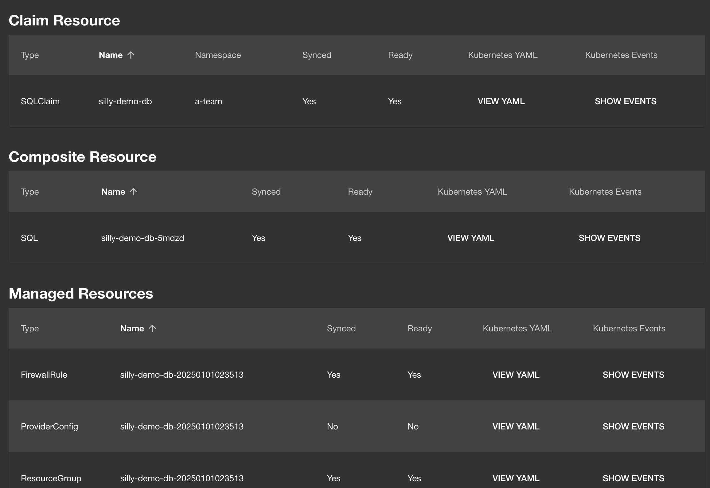

+++
title = 'From Zero to Fully Operational Developer Platform in 5 Steps!'
date = 2025-02-10T15:00:00+00:00
draft = false
+++

Internal Developer Platforms or IDPs are **not hard to create**. Anyone can do it, as long as that someone knows **everything about everything**.

Today I'll show you **everything** you should know **about developer platforms**. We'll go through all the principles behind them, through all the components they should have, and I'll even show you how to build one. This will be a tutorial on how to build a platform in **4 mandatory and 1 optional step**.

At the end of today's journey, we'll have a **fully operational IDP** with everything you might need. Most likely...

<!--more-->



Today's post is special. It is a result of months of work. Quite a few topics I explored in previous posts had a hidden agenda. They were pieces of the puzzle I was trying to assemble, and that puzzle is now complete. That puzzle is a full Internal Developer Platform (IDP). Hence, today we'll explore everything you need to know to assemble a fully operational IDP.

Now, before we proceed, let me tell you the only requirement I had when I embarked on the journey. Everything needs to be open source. When possible, projects we'll use should be in a foundation like CNCF or CDF or any other. If that is not possible or not practical, we might resort to a non Open Source solution but, if that happens, it needs to be at least free.

So, the only rule is that it should be **open source**, preferably in a **foundation**, or **free**.

During the post, we'll see a tool used for each of the categories but I will give you the alternative solutions that should produce a similar result. So, you should be able to switch those I used if, for some reason or another, my choice does not fit your needs.

There are, ofcouse, objectives as well. Actually, there is only one objective. We'll create a platform that will do everything that needs to be done related to applications. Now, when I say applications, I mean everything required to deploy and observe applications. That means **Git repositories**, **manifests**, **scripts**, **workflows**, **databases**, **policies**, and anything else that we might need.

Finally, even though this post might be longer than posts I typically release, I might not go into details of everything I'll explore today. If I would, the post would never end. I will, however, provide links to videos with more datail about a specific tool, the reasons behind certain choices, and anything else we'll go through today. As I already mentioned, this post is the end result of quite a few other posts. They were my way of exploring various combinations that led me to what you'll see today.

Finally, everything we'll do today will be, more or less, easy. The challenge is not necessarily in learning specific tools but, rather, in making the right choices and knowing how to combine them.

Let do it. Let's build a fully operational Internal Developer Platform that will have everything a platform needs to have. Actually... No! Let's start with a brief explanation of the principles I believe should be followed when building a platform.

## Components of a Platform


A platform is a set of **services**. AWS is a platform, and it is a set of services. The same can be said for Azure, Google Cloud, or anything else. Those services can be anything. It can be applications, databases, clusters, or anything else. It's Something-as-a-Service that is consumed by engineers in your company.

The reason we might build our own platform is to make it fit our needs. Cloud providers are generic. They tend to provide solutions that fit everyone's needs and, as a result of that objective, they tend to have components designed to be lower level than that we might need. If we build our own platform, we have the opportunity to make it be very specific to our bunesiness and the way we operate.

Services that compose a platform are created and maintained by some and consumed by others. We'll call those who create and maintain services **owners**, and those who consume them **consumers**. The latter of typically other developers.

Now, the question is how do people consume services we're making. To find the answer to that question, we can take a look at how platforms from cloud providers are accessed. All of them, and I repeat, all of them allow us to access their platform through the API.

Now, you might say that's not the case. You might be using a Web UI to access AWS. You might be using *gcloud* CLI to interact with Google Cloud. You might be writing Terraform modules to manage Azure.

Here's the thing. All those are tools that intect with the platform through the API. Some of them might be created and maintained by providers themselves, while others, like Terraform, might be done by other companies or communities. APIs are what enabled those tools to exist.

So, when building an Internal Developer Platform, we expose our services through an **API** and others consume it through that same API, directly or through some other interfaces like Web UIs, CLIs, and so on and so forth.

Next, we should talk about operations. There are two major types. There is state management and there are one-shot actions.

**State management** is all about defining the state of something and having a process that maintains that state. We define what it is, its desired state, and a service in the platform ensures that state is what it should be. That can be an application, a database, a cluster, or anything else. Those services should, essentially, ensure that the desired state is maintained forever and ever or until we change it. If an application stops working, it should be stated again. If a node in a cluster fails, a new one should be created and added to that cluster. You get the point. Right? A great example of state management is Kubernetes. When we define, through a Deployment, that there should be five Pods, Kubernetes will ensure that there are five. If there are four, fifth one will be created. If there are six, one will be shut down. There are controllers that are ensuring that the actual state is the same as the desired state. It's ensuring that the contract between us and machines is enforced.

Then we have **one-shot actions**. Those are operations that we perform once and only once. In the past, that would be everything. Before we started managing the state of resources, we were performing one-shot actions. We would SSH into a server and start a process of our application. If that application goes down... Tough luck. It will be brough back up only after our users start complaining and Joe, the person who deployed it, comes back from his vacation.

We don't use one-shot actions for that any more. Instead, they are now reserved for operations that should indeed be performed once and only once. Running tests when we push changes to a repo is one-shot action. There's no point running them many times for that commit, unless we wrote flaky tests that sometimes work and sometimes throw false positives. Similarly, we build container images only once for a release. And so on and so forth.

Both state management and one-shot actions are managed through the API. We tell the API what we want, and it makes it happen. It creates and manages the state of a database, or it runs a workflow that performs one-shot actions that represent our CI process.

Now, for such an API to work correctly, there must be some rules or, to be more precise, **accesss control and policies**. For example, only allowed types of resources can be accepted. If we want a database but databases are not offered as a service, the API should reject it. If that is not the case, if there is indeed such a service, it should validate that the information provided is correct. If we specify that we would like to to be in the Iceland region, and there is no such region, a policy should reject it. If the type is not the correct one, should be be rejected as well.

All those we discussed so far are **mandatory**, at least if we are building a platform in this century. If you happened to have a time machine and you are living in the past, that might not be the case. Back in twentieth century, you might rightfully dissagree with one if not more of those premises. For those of us living in the present, in twenty-first century, those are non-negotiable components of a platform. There must be an **API** through which people will interact with services, there must be both **state management** and **one-shot actions**, and there must be some **policies** that prevent us from trying to do what cannot or shouldn't be done.

Then there are **optional** components, mostly related to more user-friendly ways to consume services. There can be a custom **Web UI**, a **CLI**, a **VS Code extension**, or anything else. Now, you might say that's not the case. You might proclaim any of those mandatory, but I disagree. They are not. Services in the platform can be consumed through the API. One could send a request to it through *curl* or *wget* or *kubectl* if its built on top of Kubernetes, or through someone's code, or a script, or anything else. If we do choose to build a Web UI, or a CLI, or an IDE extension, or anything else, we are making the platform more user friendly. We make what was already possible easier and nicer.

Today, we'll do **all of it**. We'll do implement both the mandatory and optional components. At the end of this post, you'll have a fully operational platform that can be extended to meet your specific needs.

We'll do all that by adopting certain tools, but you won't be limited to those I selected. I'll give you the alternatives. So, if you dissagree with one or more of my choices, you will know what can be used instead to accomplish a similar, if not exactly the same objective.

*Here's an important note. What comes next is a condensed story. I already published videos that go into more details about each of the components. If you watched them, you might notice a bit of repetition or, to be more precise, you might feel like you're watching a summary of what you already saw. Today's goal is to combine it all together. I'll try to be as fast as possible. Feel free to skip a chapter or two if you saw those and end up being bored. Timecodes are in the description. If, on the other hand, you haven't seen those videos, this is a good starting point and I'll provide links you can use to explore more details.*

That's enough chit chat. This will be a long one. The sooner we dive into it, the better.

## Setup

```sh
git clone https://github.com/vfarcic/idp-full-demo

cd idp-full-demo

git pull

git fetch

git switch full
```

> Watch [Nix for Everyone: Unleash Devbox for Simplified Development](https://youtu.be/WiFLtcBvGMU) if you are not familiar with Devbox. Alternatively, you can skip Devbox and install all the tools listed in `devbox.json` yourself.

```sh
devbox shell
```

> Watch [The Future of Shells with Nushell! Shell + Data + Programming Language](https://youtu.be/zoX_S6d-XU4) if you are not familiar with Nushell. Alternatively, you can inspect the `setup/kubernetes.nu` script and transform the instructions in it to Bash or ZShell if you prefer not to use that Nushell script.

```sh
chmod +x platform

platform setup all

source .env
```

## Step 1: APIs

We'll use Kubernetes to build the API. No other choice makes sense today given that Kubernetes is widely used and, at the same time, provides everything we need to build an API through it's Custom Resource Definitions.

There are many ways we can create CRDs. We can simply write a YAML representation of the CRD definition. That's easy but, given that we might need also to tell it what to do when a Custom Resource based on that definition is created, we might need to also create controllers. We could do that by writing Go or code in any other language but that might be too cumbersome. Instead, we can use one of the tools that enable us to create CRDs and controllers.

We'll use [Crossplane](https://youtube.com/playlist?list=PLyicRj904Z99i8U5JaNW5X3AyBvfQz-16) today, mainly because that's the tool I'm using the most. You don't have to choose it. There are many alternatives and if you are looking for one, I strongly suggest checking out [KubeVela](https://youtu.be/2CBu6sOTtwk) and [kro](https://youtu.be/8zQtpcxmdhs). This video is not about comparing those tools, nor any other, but, rather, showing what we might have to do and how to do it. Every phase of what we're building can be done with multiple tools and I encourage you to try at least two before making a decision which one to use.

Here's an example of a Crossplane Composite Resource Definition that extends Kubernetes API by creating a CRD.

```sh
gh repo view vfarcic/crossplane-app --web
```

> Open `package/definition.yaml`

The output is as follows.

```yaml
apiVersion: apiextensions.crossplane.io/v1
kind: CompositeResourceDefinition
metadata:
  name: apps.devopstoolkit.live
spec:
  defaultCompositionRef:
    name: app-backend
  group: devopstoolkit.live
  names:
    kind: App
    plural: apps
  claimNames:
    kind: AppClaim
    plural: appclaims
  versions:
  - name: v1alpha1
    served: true
    referenceable: true
    schema:
      openAPIV3Schema:
        type: object
        properties:
          spec:
            type: object
            properties:
              id:
                type: string
                description: ID of this application that other objects will use to refer to it.
              parameters:
                type: object
                properties:
                  namespace:
                    description: The namespace
                    type: string
                    default: production
                  image:
                    description: The container image (e.g., `ghcr.io/vfarcic/silly-demo`)
                    type: string
                  tag:
                    description: The tag of the image (e.g., `1.2.3`)
                    type: string
                  port:
                    description: The application port
                    type: integer
                    default: 80
                  host:
                    description: The host address of the application
                    type: string
                    default: devopstoolkit.live
                  ingressClassName:
                    description: The Ingress class name
                    type: string
                  db:
                    type: object
                    properties:
                      secret:
                        description: The name of the Secret with DB authentication.
                        type: string
                  scaling:
                    type: object
                    properties:
                      enabled:
                        description: Whether to enable scaling
                        type: boolean
                        default: false
                      min:
                        description: Minimum number of replicas
                        type: integer
                        default: 1
                      max:
                        description: Maximum number of replicas
                        type: integer
                        default: 10
                  repository:
                    type: object
                    properties:
                      enabled:
                        description: Whether to enable a repository
                        type: boolean
                        default: false
                      name:
                        description: The name of the repository
                        type: string
                  ci:
                    type: object
                    properties:
                      enabled:
                        description: Whether to enable CI. If enabled, the repository must be enabled as well.
                        type: boolean
                        default: false
                      runTests:
                        description: Whether to run tests
                        type: boolean
                        default: true
                      buildImages:
                        description: Whether to build container images
                        type: boolean
                        default: true
                  kubernetesProviderConfigName:
                    description: The name of the Kubernetes provider config (used only with compositions with the label location=remote).
                    type: string
                    default: default
                required:
                - namespace
                - image
                - tag
            required:
            - id
            - parameters
          status:
            type: object
            properties:
              host:
                description: The host address of the application
                type: string
    additionalPrinterColumns:
    - name: host
      type: string
      jsonPath: ".status.host"
```

That's a CRD that defines an interface people can use to manage applications. It defines fields like `image`, `tag`, `port`, and others, with types of data that can be used like `string`, `integer`, `boolean`, and others. There is also a specification of which fields are `required`, additional `status` information, what will be printed on a screen (`additionalPrinterColumns`) and so on and so forth.

I already applied that and a few other Crossplane Composite Resource Definition and we can confirm that they extended Kubernetes by listing all `crds` and filtering the output with `grep` so that only those I created are shown.

```sh
kubectl get crds | grep devopstoolkit.live
```

The output is as follows.

```
appclaims.devopstoolkit.live    2025-01-01T01:33:39Z
apps.devopstoolkit.live         2025-01-01T01:33:38Z
githubclaims.devopstoolkit.live 2025-01-01T01:33:35Z
githubs.devopstoolkit.live      2025-01-01T01:33:35Z
sqlclaims.devopstoolkit.live    2025-01-01T01:34:23Z
sqls.devopstoolkit.live         2025-01-01T01:34:17Z
```

As a result, people will be able to consume services like `app`, `github`, and `sql` by telling the API that's what they want.

Actually, that's not really true. Creating a CRD extends Kubernetes API by creating a new custom endpoint. By itself, a CRD is almost useless. If we send a request to the cluster to create a resource, all that the API will do is publish an event saying: "Someone just created a resource of this kind." If there is no controller listening to those types of events, nothing will happen. The API has no idea what should be done. It only knows how to accept requests for known endpoints and, if they are valid, publish an event announcing that a new resource was stored in its internal database.

We'll get to the part of doing something with those requests later. For now, what matters, is that we extended Kubernetes API.

Here comes the question though. Why do we want APIs in the first place?

We already talked about one of the reasons. That's how people and tools interact with our services. There is a second reason though. APIs can be discoverable. That's certainly the case with those built on top of Kubernetes.

Discoverability is important since that means that we can define something once and only once and let any tools we might be using discover schemas. Backstage, for example, can be externded with a plugin so that it "discovers" Kube API schemas and converts them into Backstage Components. That saves us time since we would, essentially, need to write the same definitions in different formats, one for a UI, one for a CLI, and so on and so forth. Instead, with APIs like those we just saw, we can simply say "there's the API, figure it out."

Here's an example.

```sh
kubectl explain appclaims --recursive
```

The output is as follows (truncated for brevity).

```
GROUP:      devopstoolkit.live
KIND:       AppClaim
VERSION:    v1alpha1

DESCRIPTION:
    <empty>
FIELDS:
  apiVersion	<string>
  kind	<string>
  ...
  spec	<Object> -required-
    ...
    parameters	<Object> -required-
      ci	<Object>
        buildImages	<boolean>
        enabled	<boolean>
        runTests	<boolean>
      db	<Object>
        secret	<string>
      host	<string>
      image	<string> -required-
      ...
```

*kubectl* has no idea what is *AppClaim*. However, as we just saw, it can go to the API and ask for its schema and do whatever it needs to do with it.

We'll see API discoverability in action later. Right now we'll jump into the next component of the platform we're building.

## Step 2: State management

State management can be defined as contract enforcement. We can say something like: "I want this. Don't ask me how it should be done. Just do it, and make sure that it'll run forever and ever." From there on, it's up to controllers to figure out how to ensure that the state we want is the state that actually is and that it stays that way, forever and ever.

Any Kubernetes controller, unless done badly, is managing state. The one in charge of Deployments is managing the state of Deployment resources. The same goes for controllers in charge of ReplicaSets, Pods, StatefulSets, or any other.

However, since we are building our own APIs, we need our own controllers or, as some call them operators. The question is what those controllers should do. Now, to answer that question, I will assume that you already have means to set up and run low-level resources like containers, networking, VMs, and so on and so forth. If that's the case, the job of the controllers we're building is relatively easy to define. They should compose resources based on users inputs. They should convert user-friendly abstractions we are creating into low-level resources.

The same tools we can use to create CRDs can be used to create controllers. That could be [Crossplane](https://youtube.com/playlist?list=PLyicRj904Z99i8U5JaNW5X3AyBvfQz-16), [KubeVela](https://youtu.be/2CBu6sOTtwk), [kro](https://youtu.be/8zQtpcxmdhs), or any other. There are plenty of choices. Today, however, we'll continue using Crossplane for that since it's what we started with.

*I won't go into details of how I created Crossplane Compositions nor the details of what service consumers, developers, should do to use them. I already explored it in the [Full Application Setup in Internal Developer Platform (IDP) with Crossplane](https://youtu.be/WpgiVlODt4I) video, so I'll go through it fast. Today's objective is to see all the components combined and, if you think it all makes sense, you can watch that and other videos I'll mention for more details.*

Let's say that they would like to start working on a new application. What would they need first? Obviously, it's a Git repository with some initial bootstrap code.

Here's how that first step would look like in the form of a custom resource based on CRDs and controllers we provided.

```sh
cat crossplane/repo.yaml
```

The output is as follows.

```yaml
apiVersion: devopstoolkit.live/v1alpha1
kind: GitHubClaim
metadata:
  name: idp-full-app
spec:
  id: idp-full-app
  parameters:
    public: true
    app:
      language: go
```

Over there, a user defined a `GitHubClaim` resource that should create and manage a repository `idp-full-app`. That repo should be `public` and should have whatever is needed to start working on `go` applications.

Easy! Right?

Leter on, we might discover better ways to apply that resource. For now, a simple `kubectl ... apply ...` should do.

```sh
kubectl --namespace a-team apply --filename crossplane/repo.yaml
```

Through those few lines of YAML, we got the `Repository`, a `Branch`, few files (`RepositoryFile`), and a `PullRequest`. It should be everything one might need to start working on an application.

> Execute `crossplane beta trace --namespace a-team githubclaim idp-full-app` to confirm that all the resources are `Available`.

To continue, let's clone that repo,...

```sh
git clone "https://github.com/$GITHUB_USER/idp-full-app"
```

...enter inside the local copy,...

```sh
cd idp-full-app
```

...merge the PR,...

```sh
gh pr merge init --rebase
```

...and pull it into the local copy.

```sh
git pull
```

From here on, the developer would write code until it's ready, whatever that means, to be released.

Now, code alone is not enough. We need to define quite a few other things before that application reaches production.

To begin with, that application might need a database, so let's focus on that.

Since we are building a platform, consumers should be able to get database servers without going through the suffering of assembling all the pieces required to run it. Since we already have a Composition for that, a user can start by creating a new directory where the manifests will be stored.

```sh
mkdir apps
```

Next, they would write a few lines of YAML but, to make it easier, I already prepared them, so let's just copy them into the newly created directory.

```sh
cp ../crossplane/$HYPERSCALER-sql-password.yaml \
    apps/silly-demo-db-password.yaml

cp ../crossplane/$HYPERSCALER-sql.yaml apps/silly-demo-db.yaml
```

As I already mentioned, you can see more details in the [Full Application Setup in Internal Developer Platform (IDP) with Crossplane](https://youtu.be/WpgiVlODt4I) video, so we'll skip the chit-chat, and apply the password.

```sh
kubectl --namespace a-team apply \
    --filename apps/silly-demo-db-password.yaml
```

The second manifest is more interesting.

```sh
cat apps/silly-demo-db.yaml
```

The output is as follows.

```yaml
apiVersion: devopstoolkit.live/v1alpha1
kind: SQLClaim
metadata:
  name: silly-demo-db
spec:
  id: silly-demo-db-20250101023513
  compositionSelector:
    matchLabels:
      provider: azure
      db: postgresql
  parameters:
    version: '11'
    size: small
    region: eastus
    databases:
    - db-01
    - db-02
```

> If you are following along and depending on the hyperscaler you chose during the setup, outputs in your terminal might differ from those in this post.

That's a much more interesting one. Over there, we specified that we would like to create an instance of `SQLClaim` which will create and manage everything required to run a `postgresql` database server in `azure`.

That should be version `11`, it should be `small`, whatever that means, and it should be running in the `eastus` region. Inside that server, there should be two databases, `db-01` and `db-02`.

Still very easy! Right?

Let's `apply` it...

```sh
kubectl --namespace a-team apply \
    --filename apps/silly-demo-db.yaml
```

The controller in change of the resources of that kind is now working on creating and managing all Azure, AWS, or Google Cloud resources, depending on which hyperscaler was choosen, as well as two the databases inside the server.

The only thing missing, for now, is the application itself, so let's copy the definition I prepared,...

```sh
cp ../crossplane/app.yaml apps/silly-demo.yaml
```

...and take a quick look at it.

```sh
cat apps/silly-demo.yaml
```

The output is as follows.

```yaml
apiVersion: devopstoolkit.live/v1alpha1
kind: AppClaim
metadata:
  name: silly-demo
  labels:
    app-owner: vfarcic
spec:
  id: silly-demo
  compositionSelector:
    matchLabels:
      type: backend
      location: local
  parameters:
    namespace: a-team
    image: ghcr.io/vfarcic/idp-full-app
    tag: FIXME
    port: 8080
    host: silly-demo.135.237.72.117.nip.io
    ingressClassName: contour
    db:
      secret: silly-demo-db-20250101023513
    repository:
      enabled: true
      name: idp-full-app
    ci:
      enabled: true
```

You can proably guess what we'll get by looking at the `parameters`. It will be a set of Kubernetes resources that will form an application connected to the `db` we created earlier. It will also push some additional files to the `repository`, and it will enable `ci` process for that application.

Let's just apply it.

```sh
kubectl --namespace a-team apply --filename apps/silly-demo.yaml
```

That should have created everything one might need to work on an application connected to the database. In this specific case, that means not only the resources in Kubernetes, but also quite a few other things that are not related with state management. We'll explore those later.

For now, let's take a look at some, not all, of the resources that were composed for us.

```sh
kubectl --namespace a-team get all,ingresses
```

The output is as follows.

```
NAME                             READY   STATUS         RESTARTS   AGE
pod/silly-demo-d9d6b449d-2qgd2   0/1     ErrImagePull   0          4s

NAME                 TYPE        CLUSTER-IP     EXTERNAL-IP   PORT(S)    AGE
service/silly-demo   ClusterIP   10.0.101.126   <none>        8080/TCP   6s

NAME                         READY   UP-TO-DATE   AVAILABLE   AGE
deployment.apps/silly-demo   0/1     1            0           5s

NAME                                   DESIRED   CURRENT   READY   AGE
replicaset.apps/silly-demo-d9d6b449d   1         1         0       5s

NAME                                   CLASS     HOSTS                              ADDRESS          PORTS   AGE
ingress.networking.k8s.io/silly-demo   contour   silly-demo.135.237.72.117.nip.io   135.237.72.117   80      6s
```

The important thing to note is that the `pod` is not `READY`. It is failing with the message `ErrImagePull`. That was to be expected since we did not yet build the image with the first release of our app. To do that, we need to switch from state management to one-shot actions or workflows.

## Step 3: One-Shot Actions (Workflows)

> Before we proceed, please execute `crossplane beta trace --namespace a-team appclaim silly-demo` and confirm that all the resources are `Available`. Otherwise, please wait until they are.

One-shot actions, or workflows, can be explained as steps that need to be executed once and only once every time we change something somewhere. That something is typically code and that somewhere is usually a Git repository. Unlike state management that is a contract, of sorts, where machines promise to manage the actual state of resources, one-shot actions typically validate changes we made and produce some artifacts like container images or new manifests. We already saw an example of an action that we're missing. We deployed an application without building a container image first. Fortunately, we already have everything we need to remedy that.

There are probably more workflow, or CI, or whatever we might call tools that execute tasks, than any other type of tools. We can use Jenkins, or GitHub Actions, or Tekton, or Argo Workflows, or Codefresh, or CircleCI, or GitLab CI, or any other out of dozens if not hundreds of tools. At their core, they all do the same thing. They can execute tasks sequentially or in parallel and those executions can be triggered by some events, mainly Git webhooks. If we exlude some bangs and whistles, the tools in that category haven't fundamentally changed since Hudson which later bacame Jankins.

We'll use GitHub Actions today, mostly because open source options are too cumbersome to setup and maintain. It's free, at least for public repos. Since the repo we're using today is public, it is the most convenient choice.

When we applied the *AppClaim* resource, Crossplane composed not only Kubernetes resources required to run the application, but it also created a new PR in the repo with all the files needed to run a CI workflow.

Here's the proof.

```sh
gh pr view silly-demo-ci --json files
```

The output is as follows.

```json
{
  "files": [
    {
      "path": ".github/workflows/ci.yaml",
      "additions": 43,
      "deletions": 0
    },
    {
      "path": ".github/workflows/sync-control-plane-direct.yml",
      "additions": 64,
      "deletions": 0
    },
    {
      "path": "Dockerfile",
      "additions": 15,
      "deletions": 0
    },
    {
      "path": "devbox-ci.json",
      "additions": 12,
      "deletions": 0
    },
    {
      "path": "dot.nu",
      "additions": 44,
      "deletions": 0
    }
  ]
}
```

We got `ci.yaml` and `sync-control-plane-direct.yml` definition that represent GitHub Actions workflows. The second one is irrelevant since it's a leftover from a different scenario that I forgot to remove. The *ci.yaml* file is what matters since it contains the workflow which will, among other things, build a container image we're missing.

There's also `Dockerfile` which everyone should know what its used for, `devbox-ci.json` with Nix packages with all the tools we'll need for the actions we'll execute, and, finally, Nushell script `dot.nu` which contains the actual tasks we'll run.

*If you're not familiar with Nushell, especially not in the context of it being used as a CLI, please watch [How to Create Custom CLIs for Internal Developer Platforms with Nushell](https://youtu.be/TgQZz2kGysk).*

Let's just merge that PR,...

```sh
gh pr merge silly-demo-ci --rebase
```

...and pull the latest revision of the repo.

```sh
git pull
```

There are a few things additional things we need to do.

First, we should add the `REGISTRY_PASSWORD` secret so that GitHub Action can push images to the registry.

```sh
gh secret set REGISTRY_PASSWORD --body $GITHUB_TOKEN \
    --repo $GITHUB_USER/idp-full-app
```

Second, we'll change the registry to public so that we don't have to deal with authentication when using images.

```sh
echo "https://github.com/$GITHUB_USER/idp-full-app/settings/actions"
```

> Open the URL from the output of the previous command in a browser.
> Select `Read and write permissions` in the `Workflow permissions` section.
> Click the `Save` button.

Now we can see the workflow in action. All we have to do is push some changes to the repo to trigger it.

Since we already made a few, we can add,...

```sh
git add .
```

...commit,...

```sh
git commit -m "Apps"
```

...and push them.

```sh
git push
```

That should have triggered a GitHub Actions run so let's see how it's going.

```sh
gh run watch
```

> Select the `ci, ci (main)` workflow run.

The output is as follows.

```
? Select a workflow run * ci, ci (main) 4s ago
✓ main ci · 12566086045
Triggered via push about 2 minutes ago

JOBS
✓ all in 1m49s (ID 35031086097)
  ✓ Set up job
  ✓ Checkout
  ✓ Set up QEMU
  ✓ Login to ghcr
  ✓ Install devbox
  ✓ All
  ✓ Commit changes
  ✓ Push changes
  ✓ Post Install devbox
  ✓ Post Login to ghcr
  ✓ Post Checkout
  ✓ Complete job

✓ Run ci (12566086045) completed with 'success'
```

CI workflow run was executed successfully. It run tests, built a container image and pushed it to the registry and, finally, it updated AppClaim definition and pushed it to Git.

We can confirm that by pulling the latest version of the repo...

```sh
git pull
```

...and taking another look at `silly-demo.yaml`.

```sh
cat apps/silly-demo.yaml
```

The output is as follows.

```yaml
apiVersion: devopstoolkit.live/v1alpha1
kind: AppClaim
metadata:
  name: silly-demo
  labels:
    app-owner: vfarcic
spec:
  id: silly-demo
  compositionSelector:
    matchLabels:
      type: backend
      location: local
  parameters:
    namespace: a-team
    image: ghcr.io/vfarcic/idp-full-app
    tag: 0.0.1
    port: 8080
    host: silly-demo.135.237.72.117.nip.io
    ingressClassName: contour
    db:
      secret: silly-demo-db-20250101023513
    repository:
      enabled: true
      name: idp-full-app
    ci:
      enabled: true
```

We can see that the `tag` was updated, and now we can re-apply that manifest to the cluster...

```sh
kubectl --namespace a-team apply --filename apps/silly-demo.yaml
```

...and take another look at what's inside the `a-team` Namespace.

```sh
kubectl --namespace a-team get all,ingresses
```

The output is as follows.

```
NAME                             READY   STATUS    RESTARTS   AGE
pod/silly-demo-6997966b8-l82ws   1/1     Running   0          12s

NAME                 TYPE        CLUSTER-IP     EXTERNAL-IP   PORT(S)    AGE
service/silly-demo   ClusterIP   10.0.101.126   <none>        8080/TCP   9m29s

NAME                         READY   UP-TO-DATE   AVAILABLE   AGE
deployment.apps/silly-demo   1/1     1            1           9m29s

NAME                                   DESIRED   CURRENT   READY   AGE
replicaset.apps/silly-demo-6997966b8   1         1         1       13s
replicaset.apps/silly-demo-d9d6b449d   0         0         0       9m29s

NAME                                   CLASS     HOSTS                              ADDRESS          PORTS   AGE
ingress.networking.k8s.io/silly-demo   contour   silly-demo.135.237.72.117.nip.io   135.237.72.117   80      9m30s
```

We can see that the `pod` is now `Running`.

We just saw not only that one-shot actions or workflows are necessary, but also that all the files needed for it can be done without any additional effort by users, by portal consumers. It was all a part of defining the application.

Now, that was arguably the worst way we could define and apply services. We'll see better ways later. For now, let's delete the app since we applied it without any validation.

```sh
kubectl --namespace a-team delete --filename apps/silly-demo.yaml
```

## Step 4: RBAC & Policies

The last mandatory piece of the puzzle is RBAC and policies. We need to ensure that only those who are allowed to use the cluster are able to use it and we need to ensure that only valid requests to the API are processed.

We solve access through RBAC (Role-Based Access Control), which I'm not going to go through today since it differs from one setup to another and since I assume that you already figured it out. More importantly, some latter components might remove the need for anyone or anything to have write access to the cluster. We might come to the conclusion that only read access is required.

So, let's switch to policies.

The first thing we need to decide is where to enforce policies. We can have them in a Web UI, in a CLI, in a VS Code externsion, or in any other place from where users interact with our platform. All those should have some form of a validation, but not as an insurance that only correct definitions are processed by the platform, but for user experience reasons. All those are optional. The mandatory place to implement policies is the platform itself, so that's what we'll focus on today.

*Please watch [From UX to API: Mastering Platform Validations with Kubernetes Validating Admission Policies](https://youtu.be/8jtYN-qvSqA) if you'd like to know more about the intersection of policies and user experience.*

Since our platform is built on top of Kubernetes, we should leverage Admission Controllers which, in a nutshell, are webhooks fired every time we submit a request to the Kube API.

*Please watch [How Kubernetes API Works? RBAC, Admission Controllers, Schema Validation, etc.](https://youtube.com/shorts/sBLDxyOe400).*

We can implement admission controllers with quite a few tools. We can use [Kyverno](https://youtu.be/DREjzfTzNpA), my favorite, or [OPA with Gatekeeper](https://youtu.be/14lGc7xMAe4), or [Kubewarden](https://youtu.be/KbKQu3AqhBY), or one of quite a few other solutions that provide policies. More over, since recently, we have **Kubernetes Validating Admission Policy** baked into all clusters. It's not as feature rich as other solutions, but it is a good starting point, especially since it's already inside our clusters.

That's the one we'll use today.

Here's an example.

```sh
cat ../kubernetes/policies.yaml
```

The output is as follows.

```yaml
---
apiVersion: admissionregistration.k8s.io/v1
kind: ValidatingAdmissionPolicy
metadata:
  name: dot-app
spec:
  failurePolicy: Fail
  matchConstraints:
    resourceRules:
    - apiGroups:   ["devopstoolkit.live"]
      apiVersions: ["*"]
      operations:  ["CREATE", "UPDATE"]
      resources:   ["appclaims"]
  validations:
    - expression: |
        has(object.spec.parameters.scaling) &&
        has(object.spec.parameters.scaling.enabled) &&
        object.spec.parameters.scaling.enabled
      message: "`spec.parameters.scaling.enabled` must be set to `true`."
    - expression: |
        has(object.spec.parameters.scaling) &&
        object.spec.parameters.scaling.min > 1
      message: "`spec.parameters.scaling.min` must be greater than `1`."
---
apiVersion: admissionregistration.k8s.io/v1
kind: ValidatingAdmissionPolicyBinding
metadata:
  name: dot-app
spec:
  policyName: dot-app
  validationActions: [Deny]
  matchResources:
    namespaceSelector:
      matchLabels:
        kubernetes.io/metadata.name: a-team
```

That `ValidatingAdmissionPolicy` will reject `appclaims` resources unless `scaling.enabled` is set to *true* and `scaling.min` is greater than `1`. Further on, we are binding (`ValidatingAdmissionPolicyBinding`) that policy to the `a-team` Namespace.

Let's apply it,...

```sh
kubectl apply --filename ../kubernetes/policies.yaml
```

...and try to apply our application again.

```sh
kubectl --namespace a-team apply --filename apps/silly-demo.yaml
```

The output is as follows.

```
The appclaims "silly-demo" is invalid: : ValidatingAdmissionPolicy 'dot-app' with binding 'dot-app' deni
ed request: `spec.parameters.scaling.enabled` must be set to `true`
```

This time, the request was rejected since it failed the first policy that forces us to enable scaling.

Let's fix that,...

```sh
yq --inplace ".spec.parameters.scaling.enabled = true" \
    apps/silly-demo.yaml
```

...and try to apply it again.

```sh
kubectl --namespace a-team apply --filename apps/silly-demo.yaml
```

The output is as follows.

```
The appclaims "silly-demo" is invalid: : ValidatingAdmissionPolicy 'dot-app' with binding 'dot-app' deni
ed request: `spec.parameters.scaling.min` must be greater than `1`
```

It failed again, but for a different reason. This time it rejected it because the `scaling.min` parameter is not greater than `1`.

Let's fix that one as well,...

```sh
yq --inplace ".spec.parameters.scaling.min = 2" \
    apps/silly-demo.yaml
```

...and try to apply it again.

```sh
kubectl --namespace a-team apply --filename apps/silly-demo.yaml
```

The output is as follows.

```
appclaim.devopstoolkit.live/silly-demo created
```

It worked! We have policies that prevent people from applying our services with values that are not allowed.

Let's go back to the main repo before we move onto the next section.

```sh
cd ..
```

## Step 5: Custom User Interface for Operations (Optional)

With developer platforms, we are enabling people to get where they need to be, not taking them there ourselves. We are making roads that can be used by anything that passes certain standards (cards, motorcycles, busses, etc.). Our services are those roads and user interfaces are vehicles. We might create a vehicle or two, but that's not our main business (roads are).

As a matter of fact, we managed to go through the whole platform without using a single custom user interface. We did everything we need to do without a custom Web UI, without a custom CLI, without a single VS Code extension, or anything else. It all works because there are many tools that can interact with our platform API. That can be something as rudimentary as *curl*, or *kubectl*, or anything else. People using our platform already have plenty of choices how they can interact with it through its API.

That being said, if we do want to go an extra mile, we might create an interface or two. That can be, for example, a custom CLI.

### Step 5-1: CLI UI

For those who want a platform-specific experience from a terminal, we can create a CLI. We can do that by writing it in Bash, or going down the "proper" programming route by using Go, Pythong, NodeJS, or whatever we're comformatble with, or we can pick something more obscure like Nushell, which I'm using today.

Here's a list of available commands in `platform`, which is a custom CLI I made with Nushell.

```sh
platform --help
```

The output is as follows.

```
Usage:
  > platform 

Subcommands:
  platform apply argocd (custom) - 
  platform apply backstage (custom) - 
  platform apply crossplane (custom) - 
  platform apply ingress (custom) - 
  platform apply providerconfig (custom) - 
  platform build backstage (custom) - 
  platform build image (custom) - Builds a container image
  platform configure backstage (custom) - 
  platform create kubernetes (custom) - 
  platform delete crossplane (custom) - 
  platform describe resource (custom) - 
  platform destroy all (custom) - Destroys the complete demo
  platform destroy apps (custom) - Destroys the apps demo
  platform destroy backstage (custom) - Sets up the Backstage demo
  platform destroy clis (custom) - Destroys the CLIs demo
  platform destroy kubernetes (custom) - 
  platform destroy policies (custom) - Destroys the policies demo
  platform get github (custom) - 
  platform get hyperscaler (custom) - 
  platform get ingress (custom) - 
  platform get resource types (custom) - 
  platform get resources (custom) - 
  platform run ci (custom) - Runs all CI tasks
  platform run unit-tests (custom) - Executes tests
  platform setup all (custom) - Sets up the complete demo
  platform setup apps (custom) - Sets up the apps demo
  platform setup backstage (custom) - Sets up the Backstage demo
  platform setup clis (custom) - Sets up the CLIs demo
  platform setup policies (custom) - Sets up the policies demo
  platform update gitops (custom) - Executes tests

Flags:
  -h, --help: Display the help message for this command

Input/output types:
  ╭───┬───────┬────────╮
  │ # │ input │ output │
  ├───┼───────┼────────┤
  │ 0 │ any   │ any    │
  ╰───┴───────┴────────╯
```

From here on, people can choose any of the available commands and execute it.

For example, if they would like to get all the information about the *appclaim* we applied earlier, they can just execute `platform describe resource` *appclaim silly-demo* in the Namespace *a-team*.

Before we move onto a second user interface option, let's use the `platform` CLI to delete the `sqlclaim`...

```sh
platform delete crossplane \
    --kind sqlclaim --name silly-demo-db --namespace a-team
```

...and the `appclaim`.

```sh
platform delete crossplane \
    --kind appclaim --name silly-demo --namespace a-team
```

### Step 5-2: GitOps UI

Another option for a bonus user-interface could be [GitOps](https://youtube.com/shorts/z9nUgMOwaDg). It is a user interface that does not even interact with the platform directly, at least not when operations are concerned. It does have a graphical user interface, but only for observing the outcomes.

Today we'll use [Argo CD](https://youtu.be/vpWQeoaiRM4) which is probably the most commonly used GitOps tool, but certainly not the only one. We could also use [Flux](https://youtu.be/R6OeIgb7lUI), [Rancher Fleet](https://youtu.be/rIH_2CUXmwM), and a few others.

Here it goes.

First we'll go back to he `idp-full-app` repo.

```sh
cd idp-full-app
```

Since we already made a few changes to the application repo, we can simply `add`,...

```sh
git add .
```

...commit,...

```sh
git commit -m "This time with Argo CD [skip ci]"
```

...and push to make sure that the repo has the latest code.

```sh
git push
```

Next, we need an Argo CD Application definition.

```sh
cat ../argocd/app.yaml
```

The output is as follows.

```yaml
apiVersion: argoproj.io/v1alpha1
kind: Application
metadata:
  name: apps
  namespace: argocd
spec:
  project: default
  source:
    repoURL: https://github.com/vfarcic/idp-full-app
    targetRevision: HEAD
    path: apps
  destination:
    server: https://kubernetes.default.svc
    namespace: a-team
  syncPolicy:
    automated:
      selfHeal: true
      prune: true
      allowEmpty: true
```

In a nutshel, that `Application` will ensure that whatever is in the `apps` directory inside the `idp-full-app` repo will be synchronized into the cluster. That repo contains the desired state and it's up to Argo CD to convert it into resources running inside our cluster. Those are the actual state.

Let's apply it,...

```sh
kubectl apply --filename ../argocd/app.yaml
```

...and open Argo CD Web UI to see what's going on.

```sh
echo "http://argocd.$INGRESS_HOST"
```

> Open the URL from the output of the previous command in a browser.
> Login using `admin` as the user and `admin123` as the password to `SIGN IN`.
> Open the `apps` Application.


We can see that Argo CD detected manifests containing `appclaim` and `sqlclaim` manifests and synchronized them into the cluster. From there on, Crossplane composed managed resources that constitute low-level details required to run applications and database servers.

With Argo CD, we got two new user interfaces. First there is Git where people store the desired state of the services they want to consume. Then there is the Web UI where they can observe the actual state of those resources.

However, we might want to have a Web UI from where people can both define and observe services.

```sh
cd ..
```

### Step 5-3: Web UI

While CLIs, and IDE extensions, and other means of interaction with APIs are great, many people prefer Web UIs over any other interface. There's something attractive to having lots of colors and buttons to push while, at the same time, we are presented with experience tailor made to our needs.

Fortunately, there are many tools that can help us create a platform portal. If we are looking at Portal-as-a-Service solutions, there is [Port](https://youtu.be/PV1sBiC85Yc) and quite a few others. However, if we look at open source options, there is one above all others. That one is [Backstage](https://youtu.be/A-3Ai--Z-Gs). It is in the CNCF Foundation, it is extensible through plugins, and it has a massive number of contributors and adopters. That's the one we'll use today.

Let's run it using the CLI we explored earlier.

```sh
platform apply backstage "0.0.1" \
    --ingress_host "backstage.$INGRESS_HOST" \
    --github_token $GITHUB_TOKEN \
    --create_service_account true
```


We can see right away, on the home screen, that it ingested the Crossplane claims we applied through *kubectl* and Argo CD. That's made possible through a few plugins that I explored in [Why I Changed My Mind About Backstage? A Brutally Honest Opinion](https://youtu.be/qi7eH6dZJOk), so we won't go into details here.

If, for example, we enter inside the `silly-demo-db` claim, we can notice two Crossplane-specific tabs. Let's select the Crossplane Resources.



We can see the Claim, and Composite, and Managed, and other resources composed by Crossplane. We can see YAML definitions and events for each.

Similarly, we can also select the graph view.


Over there, we can see pretty much the same information but, this time, organized as a graph.

Finally, and probably most importantly, we can create new resources based on the CRDs in the cluster. Backstage already retrieved the schemas and converted them into its own templates.


If we would proceed by filling in all the fields on all the template screens, Backstage would ultimately generate a YAML manifest and push it to Git. Argo CD, in turn, would detect changes and synchronize them with the cluster. If those resources are managed by Crossplane, it would compose all the low level resources no matter whether they should be running in a Kubernetes cluster, a hyperscaler, or anything else. Finally, Backstage would close the loop by ingesting data from the platform and show it to users.

Try it out. You'll see that's what will happen, or, altenatively, watch the [Why I Changed My Mind About Backstage? A Brutally Honest Opinion](https://youtu.be/qi7eH6dZJOk) video I mentioned earlier.

## The Question

What's missing from this setup?

I think I covered all the most important components, but there's always something missing. I'd like to keep it alive by adding other components. Alternatively, I could make a similar setup with different tools. Ultimately, this might become a project on its own where people can select types of components they would like to include into the platform and select tools with which to implement each of them.

I'd love to hear back from you.

## Destroy

```sh
platform destroy all $HYPERSCALER $GITHUB_USER

git checkout main

exit
```

