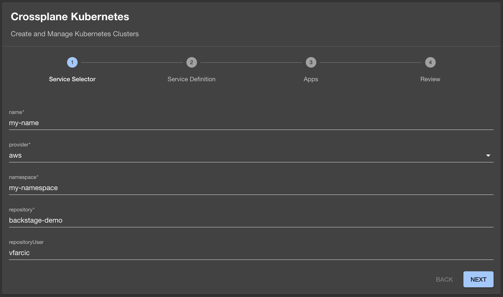

+++
title = 'Getting Started with Backstage: From Zero to Operational Dev Portal'
date = 2024-10-13T16:00:00+00:00
draft = false
+++

Today we're going to explore Backstage from newbee perspective. We'll see what it is, what it's main components are, and how to set it up. We'll go from nothing to an operational portal in development mode. Unlike other similar tools that often require us to simply configure and run them, with Backstage we have to get the source code, develop or configure what we need, and run it on our laptop to see the result. Later on, once we're happy with what we did we might explore how to package it all up, run it in production, and do whatever else needs to be done.

Let's start from the beginning.

<!--more-->



Backstage is open source framework for building developer portals. It's what we put on top of our system to enable people to control it and observe it using graphical user interface. It's a front-end for your back-end which can be anything. It's a UI on top of whatever we use to manage our applications and our infrastructure. It's a bridge to Git and pull requests. It's a window into CI/CD workflows. It's... You get the point. Its a user interface that, potentially, integrates everything we need to manage our systems.

I won't go into more details of what it is but simply say that it is an internal portal into everything else. It's the entry point for those who like clicking with their mouse instead of writing commands in terminals. It's for those who do not know how to use the tools required to manage the system. It's for those who don't like writing code. It's a glorified catalog with links that lead elsewhere. It's for those who dispise monochromatic terminals and crave for a more colorful world.

Or, at least, those are some of the things it's trying to be, and we are yet to discover whether that's really the case.

Anyways... What matters is that there are four imporant things one should know about Backstage.

1. It's not a typical product we configure and run. It's **source code** that we put on our laptop and develop whatever we need.
2. It can be extended by **plugins** and we can choose to use those developed by others or write our own.
3. It has **components** that represent some logical entities like applications and infrastructure.
4. It has **templates** that can be used to create dynamic forms with fields, drop-down list, and other elements that can be filled up by people who do not like writing YAML or Json. The data from those forms can be used to perform some actions.

So, it's source code that can be extended by plugins and that uses components to represent something and templates to create something else. Ofcouse, there's more to it than that but mastering those four concepts should give you the necessary base for everything else.

Those are the things we'll explore today so backle up. We're about to get Backstage source code and figure out how to run it on our laptops.

## Setup

> Watch the [GitHub CLI (gh) - How to manage repositories more efficiently](https://youtu.be/BII6ZY2Rnlc) video if you are not familiar with GitHub CLI.

```sh
gh repo fork vfarcic/backstage-demo --clone --remote

cd backstage-demo

gh repo set-default
```

> Select the fork as the default repository

```sh
git pull upstream main
```

> Watch [Nix for Everyone: Unleash Devbox for Simplified Development](https://youtu.be/WiFLtcBvGMU) if you are not familiar with Devbox. Alternatively, you can skip Devbox and install all the tools listed in `devbox.json` yourself.

```sh
devbox shell
```

> Replace `[...]` with your GitHub token.

```sh
export GITHUB_TOKEN=[...]
```

> Replace `[...]` with your GitHub user or organization where you forked the repo.

```sh
export GITHUB_USER=[...]
```

## Backstage Development Setup

Unlike many other projects, we cannot simply run backstage. There are no official container images we could use to run it with Docker. There is no official Helm chart we could use to install it in Kubernetes. There are none of the things we normally get when we want to use a third-party application, at least not provided by the Backstage project. We are not supposed to simply run it. We're supposed to get the source code and use it as the base on top of which we'll build what we need. Whether that's a good or a bad thing is something I'll avoid discussing in this post, partly because I already did that at the beginning of [Surviving Backstage with Roadie: A Developer's Nightmare or Dream?](https://youtu.be/LIhnicLyzsk) but also because I don't want to discourage you from using Backstage.

We can get Backstage source code by cloning project's repository or through *npx*. Today we'll use the latter, so let's execute `npx`to create a new Backstage app.

```sh
npx @backstage/create-app@latest
```

At the very start, you'll be asked for the name of the application. If you're following along, keep the default name `backstage` since the rest of the instructions will assume that's what you did.

> Respond with the enter key to keep the default value `backstage` when asked to name the app.

From here on, all we need is patience. It might take a while until Backstage downloads half of the Internet required to run it. Let's fast-forward.

Now we can enter the newly created directory that contains the source code,...

```sh
cd backstage
```

...take a look at `app-config.yaml`.

```sh
cat app-config.yaml
```

The output is as follows (comments are truncated for brevity).

```yaml
app:
  title: Scaffolded Backstage App
  baseUrl: http://localhost:3000
organization:
  name: My Company
backend:
  baseUrl: http://localhost:7007
  listen:
    port: 7007
  csp:
    connect-src: ["'self'", 'http:', 'https:']
  cors:
    origin: http://localhost:3000
    methods: [GET, HEAD, PATCH, POST, PUT, DELETE]
    credentials: true
  database:
    client: better-sqlite3
    connection: ':memory:'
integrations:
  github:
    - host: github.com
      token: ${GITHUB_TOKEN}
proxy:
techdocs:
  builder: 'local' # Alternatives - 'external'
  generator:
    runIn: 'docker' # Alternatives - 'local'
  publisher:
    type: 'local' # Alternatives - 'googleGcs' or 'awsS3'. Read documentation for using alternatives.
auth:
  providers:
    guest: {}
scaffolder:
catalog:
  import:
    entityFilename: catalog-info.yaml
    pullRequestBranchName: backstage-integration
  rules:
    - allow: [Component, System, API, Resource, Location]
  locations:
    - type: file
      target: ../../examples/entities.yaml
    - type: file
      target: ../../examples/template/template.yaml
      rules:
        - allow: [Template]
    - type: file
      target: ../../examples/org.yaml
      rules:
        - allow: [User, Group]
kubernetes:
permission:
  enabled: true
```

That is the main configuration file from where we can control the main aspects of Backstage. To be clear, that's not the only configuration we might need to use and not all configurations are YAML. More often than not, we might need to edit TypeScript files as well.

Nevertheless, *app-config.yaml* is arguably the most important one making it the first one you should get familiar with. That's where we define the `baseUrl` of the application, which `database` we'd like to use, what the `integrations` are, what the `locations` for the `catalog` components are, and so on and so forth. Most of those should be self-explanatory and we'll explore it in a bit more depth later when we replace it with our own. For now, the only observation I'll make is that parts of it are not even valid YAML entries. For example, the `kubernetes` key does not have a value. That's not allowed in YAML, yet Backstage tends to be happy with it so I'll avoid a rant that puts Backstage authors to shame.

So, for now, we'll keep that configuration as-is since the first objective is to simply run Backstage without any modifications (that'll come later).

To have a bit greater visibility into what's going on, we'll set the environment variable `LOG_LEVEL` to `debug`,...

```sh
export LOG_LEVEL=debug
```

...and `NODE_OPTIONS` to avoid an issue of using templates when running with NodeJS 20 or later.

```sh
export NODE_OPTIONS="--no-node-snapshot"
```

Backstage is full of "do this if you're not using an ancient version of something", so the best strategy is to simply do workarounds without questioning them.

Now we can run Backstage in the development mode by executing `yarn dev`.

```sh
yarn dev
```

*Before we proceed, let me say that if you are not familiar with NodeJS and TypeScript, you have to be preperated for a lot of pain. Backstage is a project that assumes that those using it are Node ninjas and, if they are, they are supposed to experience only a moderate level of pain. So, you are either not skilled in NodeJS and TypeScript and you will be in a lot of pain, or you are and you will still be in pain, but in more modest quantity. Pain in unavoidable with Backstage. You've been warned!*

Anyways... The *yarn dev* command run Backstage in development mode and opened the home screen in the default browser. Over there, we can see an `example` component that represents a fictional website.


If we click on it, we can see all the information about that website. There's the `OVERWIEW` with the `About` section with mostly static infomation, the `Relations` with other components, potentially useful `Links`, and a few other widgets.

There's also the `CI/CD` section where we could have information from workflows, `DEPENDENCIES`, and `DOCS`.


We'll explore components later. For now, let's take a quick look at what else we got out of the box.

If we go back to the home screen, we can click the `CREATE` button which leads us to the `Create a new component` screen. That's where templates are located. They are, essentially, a list of forms that can be filled with data that can be transformed into some actions.


There is only one template, for now, so let's click on the `CHOOSE` button.

That's the pretty form where we can put some data like the `Name` of the component we would probably like to create, and follow the on-screen instructions.


We'll explore templates in more depth later. For now, what matters is that we saw most of what Backstage has to offer by default. If we need more, and we almost certainly do, we need to add some plugins, write some components, and define some templates ourselves. We'll do all that soon. For now, let's close the browser and stop the process by pressing `ctrl+c`.

> Stop the process by pressing `ctrl+c` in the terminal.

## Backstage Plugins

Backstage alone does not do much. Most of what we can do or see in it is done through plugins. From that perspective, it is very similar to Jenkins.

Some of the plugins are baked into Backstage and we already had a glimpse of them. For example, the example template we saw is powered with the Scaffolder plugin. The documentation widget we saw in the example component is using the TechDocs plugin. However, more often than not, those baked-in plugins are often not enough. Depending on what we want to accomplish, we might need to add additional plugins developed by others and, if that's not enough, we might even need to develop our own.

Let's say that we would like templates to be able to perform some actions in GitHub. To be more precise, let's say that we'd like to have a template that pushes manifests to a repository. We could develop something like that ourselves but, since that is such a common task, there is already a plugin that does just that. All we have to do is install it and configure it. Let's do just that by executing `yarn` to install a plugin inside the `packages/backend` directory. The plugin itself was developed by the Backstage community so the address of the plugin is `@backstage` and the name is `plugin-scaffolder-backend-module-github`.

```sh
yarn --cwd packages/backend add \
    @backstage/plugin-scaffolder-backend-module-github
```

It might take a while until the plugin is installed. It won't take long since, unlike Backstage itself that downloads half the Internet, plugins tend to be much smaller, yet not small enough.

Now, you might think that installing a plugin is all it takes, but that's not the case. We also need to tell Backstage to use it by opening `packages/backend/src/index.ts` and adding `import` of `plugin-scaffolder-backend-module-github`.

> Add `backend.add(import('@backstage/plugin-scaffolder-backend-module-github'));` line to the `packages/backend/src/index.ts` file.

Let's add one more plugin for good taste. For example, we might want to include the GitHub plugin that will extend the capabilities of the catalog so that we can see some information from a repo associated with data that represent an application or something similar.

The process is the same. We should execute `yarn` in the `packages/backend` directory to `add` the `plugin-catalog-backend-module-github` plugin.

```sh
yarn --cwd packages/backend add \
    @backstage/plugin-catalog-backend-module-github
```

Just as before, adding the plugin is not enough so we must edit the `packages/backend/src/index.ts` file to add that plugin as well.

> Add `backend.add(import('@backstage/plugin-catalog-backend-module-github/alpha'));` line to the `packages/backend/src/index.ts` file.

Now that we added two plugins, we can run Backstage in development mode again.

```sh
yarn dev
```

So far, we haven't done anything that changes the behavior of Backstage. We still need to figure out how to use those plugins. Right now, they are lazy bastards that are just sitting there doing nothing. We'll make them productive soon. For now, let's open `/create/actions` page that contains the list of all the actions we could perform through plugins in that Backstage instance.

> Open http://localhost:3000/create/actions in a browser.

That is a not easy to find yet very felpful page that list all the actions we can perform. For example, we can see that `publish:github:pull-request` is there and we can see which fields can be used as `Input` and which will be `Output`. That action is not available in Backstage out-of-the-box but was added when we installed the plugin. We'll use it when we define our first template.


Let's stop the Backstage process by pressing `ctrl+c` and explore Components and Templates.

## Backstage Components and Templates

In Backstage, Component is something. It's hard to define what that something is since it can be anything. It could be a frontend or a backend application. It could be a part of an application. It could be a piece of infrastructure, or a database, or a cluster, or a serverless application, or... anything else. It's up to define what we want to present as a Backstage component. In order to spice things up by moving out of the typical "this is a website" type of a component, I defined one that represents a Kubernetes cluster managed by Crossplane.

Let's take a look at it.

```sh
cat ../catalog-info.yaml
```

The output is as follows.

```yaml
apiVersion: backstage.io/v1alpha1
kind: Component
metadata:
  name: crossplane-kubernetes
  title: Crossplane Kubernetes
  description: Silly description of Crossplane Kubernetes
  annotations:
    github.com/project-slug: vfarcic/backstage-demo
    backstage.io/techdocs-ref: dir:. 
    backstage.io/kubernetes-id: dot
    backstage.io/kubernetes-namespace: a-team
    backstage.io/kubernetes-label-selector: app.kubernetes.io/name=crossplane-kubernetes
  tags:
    - go
  links:
    - url: https://youtube.com/@devopstoolkit
      title: DevOps Toolkit YouTube
      icon: dashboard
      type: Website
    - url: https://devopstoolkit.live/
      title: DevOps Toolkit Posts
      icon: dashboard
      type: Website
spec:
  type: service
  lifecycle: production
  owner: vfarcic
```

You'll notice that definitions of Backstage components are similar to Kubernetes definitions, yet sufficiently different to confuse everyone.

Just as in Kubernetes, there are the `apiVersion`, `kind`, and `metadata` fields with, probably, self-explanatory entries like the `name`, `title`, and `description`. The `annotations` can be anything we want but some plugins will require specific entries like, for example, `github.com/project-slug` that tells the GitHub plugin how to find the associated repository.

Then there are `tags` and `links` that, as we'll see later, is static information that will be shown in Backstage.

Finally, the `spec` entries are, for now, largely informative and not worth our attention.

So far, the *Component* resource contains mostly static information and does not serve any special purpose, at least not if we do not start feeding it runtime information.

A more interesting type of Backstage resource is the *Template*, so let's take a look at one I prepared.

```sh
cat ../backstage-template.yaml
```

The output is as follows (truncated for brevity).

```yaml
apiVersion: scaffolder.backstage.io/v1beta3
kind: Template
...
spec:
  ...
  parameters:
  - title: Service Selector
    properties:
      name:
        type: string
        ui:autofocus: true
      provider:
        type: string
        enum:
        - aws
        - azure
        - google
        default: aws
      ...
    required:
    - name
    - provider
    - namespace
    - repository
  - title: Service Definition
    ...
  steps:
  - id: log-message
    name: Log Message
    action: debug:log
    input:
      message: Created the manifest for the ${{ parameters.name }} Kubernetes cluster.
  - id: fetch-template
    action: fetch:template
    name: Generate manifest
    input:
      url: manifest-templates
      targetPath: manifests
      values:
        name: ${{ parameters.name }}
        namespace: ${{ parameters.namespace }}
        ...
  - id: rename-manifest
    action: fs:rename
    name: Rename files
    input:
      files:
      - from: manifests/cluster-claim.yaml
        to: manifests/cluster-claim-${{ parameters.name }}.yaml
  - id: create-pull-request
    action: publish:github:pull-request
    name: Create a pull request
    input:
      repoUrl: github.com?repo=${{ parameters.repository }}&owner=${{ parameters.repositoryUser }}
      branchName: cluster-${{ parameters.name }}
      gitCommitMessage: Kubernetes cluster
      title: Kubernetes cluster manifest ${{ parameters.name }}
      description: This pull request creates the cluster-claim-${{ parameters.name }}.yaml Kubernetes cluster manifest
  output:
    links:
    - title: Pull Request
      url: ${{ steps['create-pull-request'].output.remoteUrl }}
```

That's a big one, isn't it.

It contains two main sections inside the `spec`. There are `parameters` which, essentially, instruct Backstage how to construct a form users can use to fill in some data. Further on, there are `steps` which define actions that should be performed when someone submits data from that form.

The `parameters` are, more or less, based on the same format as Kubernetes Custom Resource Definitions (CRDs) and I would be very grateful if Backstage would be able to read them. As it is now, those of us creating CRDs need to do the same work twice and, essentially define the same data in two similar, yet sufficiently different formats. I hate spending my time doing redundant tasks, yet that's what we have.

Anyways... The `title` defines a screen. So, once we add that template to Backstage, there will be a screen called `Service Selector`, another one called `Service Definition`, and so on and so forth.

Each of those pages can have any number of `properties` or, to be more precise, fields. So, in this case, there will be a field called `name`. That field will accept any `string`, and, once that page is opened, it will be in focus (`ui:autofocus`).

Then there is `provider` which has three `enum` values. Unlike the *name* which will become a field, the *provider* will be a dropdown list with `aws`, `azure`, and `google` as values with `aws` being the `default` one.

I won't go through the rest of the *properties* since they all follow, more or less, the same pattern.

Further down, there is a list of `required` fields and then it is all repeated for the next page (`Service Definition`).

Once we have all the pages, and forms, and fields defined, we have the `steps`. Think of them as actions that are performed every time someone submits data based on those forms.

In this particular case, the first step will output a log message (`log-message`) if `debug` is enabled. That massage, like almost any other value in the *steps*, is parametrized. So, the message will contain the `name` taken from the `parameters`.

I put that first step mostly to warm us up for the "real deal" that comes next.

The `fetch:template` action will take templates from the `manifest-templates` directory and convert them into a manifest. To be more precise, it will pass to templates in that directory `values` with keys `name`, `namespace`, and others, and add values from `parameters` which, essentially, is data from the form we defined earlier.

This part is yet another thing I really dislike about Backstage since it feels like redundant work. I have a parameter *name* that happens to be the same as a parameter *name* in the CRD, which should become a value also called *name* so that *name* in a template can finally become something meaningful. I do admit that there are cases when all that might be necessary but, more often than not, it's all about defining the same thing in an infinite number of places. Whomever said that Kubernetes is too verbose never experienced Backstage.

The third step will rename (`fs:rename`) the output of the manifest generated through the template as a semi unique name based on the `name` parameter. From there on, the fourth step will create a `pull-request`.

As a result of all those steps, when someone submits data through a form, the end result should be a pull request to a repo with a new manifest based on a template. From there on, someone could approve that pull request by merging it to a mainline and, assuming that Argo CD or Flux is set up, the resource defined in that manifest should be synchronized into the cluster. From there on, Crossplane running in that cluster, we call it control plane, would create a new Kubernetes cluster based on user's input.

The last part of the steps is the `output` which will provide a link to the `url` of the newly created pull request.

Now, you might think that we're done, but we're not. We still need the template that one of those steps will use to generate the manifest. As I already mentioned, Backstage is very verbose and we often need to define the same thing over and over again.

Anyways... Here's the template that will result in the manifest that will be pushed to a repo.

```sh
cat ../manifest-templates/cluster-claim.yaml
```

The output is as follows (truncated for brevity).

```yaml
---
apiVersion: devopstoolkitseries.com/v1alpha1
kind: ClusterClaim
metadata:
  name: ${{ values.name }}
  namespace: ${{ values.namespace }}
spec:
  id: ${{ values.name }}
  compositionSelector:
    matchLabels:
      provider: ${{ values.provider }}
  parameters:
    version: ${{ values.version }}
    nodeSize: ${{ values.nodeSize }}
    ...
```

That's very similar to a template in a Helm chart, main difference being that there are dollar signs (`$`) in front of opening double curly braces (`{{`).

Also, did I mention that it's confusing that there is a Backstage template that needs other templates to generate manifests? It's silly, but that's what it is.

You might think that now we are finally done, but I will dissapoint you again. We still need to make a few changes to the `app-config.yaml`. To simplify things, I already created one we can take a look at and copy to the backstage root directory.

```sh
cat ../app-config.yaml
```

The output is as follows (truncated for brevity).

```yaml
...
catalog:
  ...
  rules:
    - allow: [Component, System, API, Resource, Location, Template]
  ...
  locations:
    - type: file
      target: ../../examples/entities.yaml
    - type: file
      target: ../../examples/template/template.yaml
      rules:
        - allow: [Template]
    - type: file
      target: ../../examples/org.yaml
      rules:
        - allow: [User, Group]
  providers:
    github:
      catalogInfo:
        organization: ${GITHUB_USER}
        catalogPath: /catalog-info.yaml
        filters:
          branch: main
          repository: backstage-demo
        schedule:
          frequency: {minutes: 30}
          timeout: {minutes: 3}
      templates:
        organization: ${GITHUB_USER}
        catalogPath: /backstage-template.yaml
        filters:
          branch: main
          repository: backstage-demo
        schedule:
          frequency: {minutes: 30}
          timeout: {minutes: 3}
kubernetes:
  serviceLocatorMethod:
    type: 'multiTenant'
  clusterLocatorMethods:
    - type: 'config'
      clusters: []
permission:
  enabled: true
```

There are only a few important differences when compared with the original config file, apart from removing comments.

I added `Template` in the `allow` entry in the `rules` section. That will allow us to import the template we explored instead of going to the Web UI and clicking buttons to accomplish the same.

Now, we could import components and templates from the local file system like the in the examples inside the `locations` section, but that's just silly except, maybe, during development. A much better way to import those is to let Backstage "discover" them from one or more Git repositories. That's why I added the `providers` section.

Over there, we're specifying that we'd like to use `github` to discover components and templates. That's one of the things enabled through the GitHub plugin we installed earlier.

Over there we're specifying that the organization is whatever the value of the `GITHUB_USER` variable is, that it should look for a file `catalog-info.yaml` in the root of the repo, that it should look only in the `main` branch, and that the repository is `backstage-demo`. A better approach would be to set `repository` value as asterisk (`*`) to that all repos are scanned but I did not want to create chaos this early while we're still learning how it all works.

The same is repeated in the second entry that will fetch files named `/backstage-template.yaml`.

In this specific case, I have a naming convention that components are in files called `catalog-info.yaml` and templates in `backstage-template.yaml`. Yet, Backstage does not care what is what. For Backstage, they are all variations of a catalog and it will import any type specified in the `allow` entry of the catalog `rules`.

Now we are, finally, almost done. All that's left is to copy the `app-config.yaml` file we explored into the current directory where Backstage resides and...

```sh
cp ../app-config.yaml .
```

...run it.

```sh
yarn dev
```

## Backstage In Action

When Backstage with our modifications opens, it shows the same information as if we did not do anything. That's to be expected since it might take a few moments for it to visit the Git repo and discover the component and template we have in there.


So, let's wait for a while... and refresh the screen.

There we go. A new component *Crossplane Kubernetes* automagically appeared. Backstage pulled it from the repo. If we specified all repositories within the organization and we had *catalog-info.yaml* in others, we would see them all in Backstage.


If we select the *Crossplane Kubernetes* component, we are redirected to the details page with all the information currently available. There's not much at the moment and we might explore ways to feed it runtime information in some other post. What matters, for now, is that whichever information is specified in the discovered *catalog-info.yaml* file is available here. On top of that, we could, but not in this video, add additional plugins or configure those that are already in Backstage to fetch more information. We could, for example, connect it to GitHub Actions so that all the workflow runs from that repository are visible here as well. Similarly, if that component represents some Kubernetes resources, we could use one of the Kubernetes plugins to show it here as well. All those are outside of the scope of this post. Please let me know in the comments (of the video) if you'd like to see more.


Now, if we go back to the home screen and click the *Create* button, we can see that a new template, the one we explored earlier, was added.


If we choose *Crossplane Kubernetes*, we are presented with the screens and the forms we defined in the template.

Let's imagine that we are a developer who would like to create a new Kubernetes cluster. All we'd have to do is fill in the fields in the first screen.

> If you are following along, type or select any values. The only exception is the `repository` field that must be set to `backstage-demo` since that's the repo we're using and where Backstage will create the pull request.



Once done, that person would click the `NEXT` button, and fill in more fields.


Pressing the `NEXT` button again, would redirect that person to the third screen where they would be able to select which applications should be preinstalled in that cluster.


Clicking the `NEXT` button one more time would present them with the review screen.


Finally, once they confirm that everything looks okay, the steps we specified in the template would be executed. A few moments later, they would see the `PULL REQUEST` link that would lead them to the pull request with the new manifest that defines the cluster based on their input.


The rest is not directly related to Backstage but a typical workflow any developer is familiar with. Review the files that were changed and, if everything seems to be okay,...


...and merge the PR into the mainline.


That's it. We transformed developer experience. Instead of having to write YAML which, in my humble opinion, is not that difficult, people can choose to fill in custom-made forms in Backstage, let it generate the desired manifest based on data from those forms, and create a pull request.

Now, to be on the safe side, let's confirm that's what really happened.

> Stop the Backstage process by pressing `ctrl+c`.

We'll go back to the root of the demo repository,..

```sh
cd ..
```

...and pull the latest changes.

```sh
git pull
```

We can see that a new manifest was added to the repository and we can take a look at it.

```sh
cat manifests/cluster-claim-*.yaml
```

The output is as follows.

```yaml
---
apiVersion: devopstoolkitseries.com/v1alpha1
kind: ClusterClaim
metadata:
  name: my-name
  namespace: my-namespace
spec:
  id: my-name
  compositionSelector:
    matchLabels:
      provider: aws
  parameters:
    version: 16.5
    nodeSize: small
    minNodeCount: 1
    namespaces: [dev,production]
    apps:
      crossplane:
        enabled: false
      argocd:
        enabled: false
        host: acme.com
        repoURL: https://github.com/vfarcic/SOMETHING
        destinationNamespace: argo-cd
        sourcePath: .
      openfunction:
        enabled: false
      dapr:
        enabled: false
      traefik:
        enabled: false
```

We can see that the manifest is based on the input we made in Backstage.

Mission accomplished, for now. We saw how to setup Backstage, what its main features are, how to extend its capabilities through plugins, how to create our own components and templates, how to instruct it to fetch them from Git repositories, and a few other things.

Congratulations. You are one step closer towards becoming a Backstage ninja. There's still much more to figure out. For example, we should see how to package Backstage and how to run it in production. We should probably see how we can connect it with Argo CD or Flux so that manifests it creates are synchronized into the control plane cluster. We should try to figure out how to feed it with runtime information like logs, events, and statuses.

This video was only the beginning and the rest depends on your interest. Was this useful? Would you like me to go further with Backstage? What would you like to see next? Please let me know in the comments.

## Destroy

```sh
rm manifests/cluster-claim-*.yaml

git add .

git commit -m "Revert"

git push

rm -rf backstage
```

