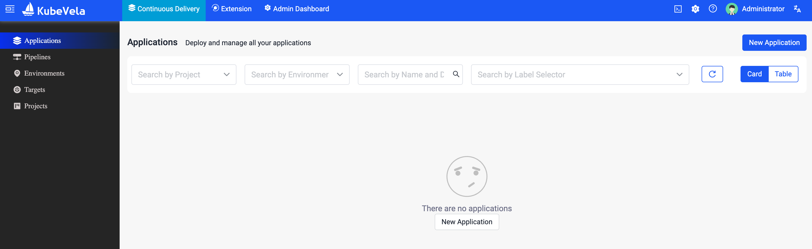
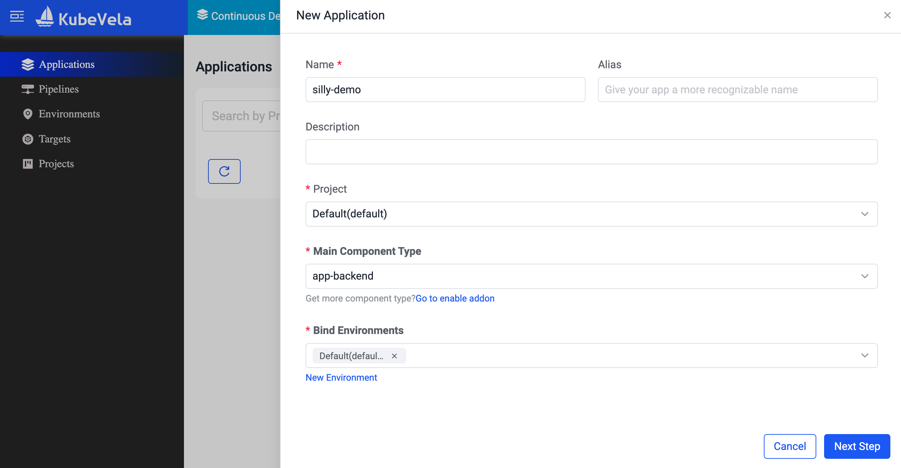
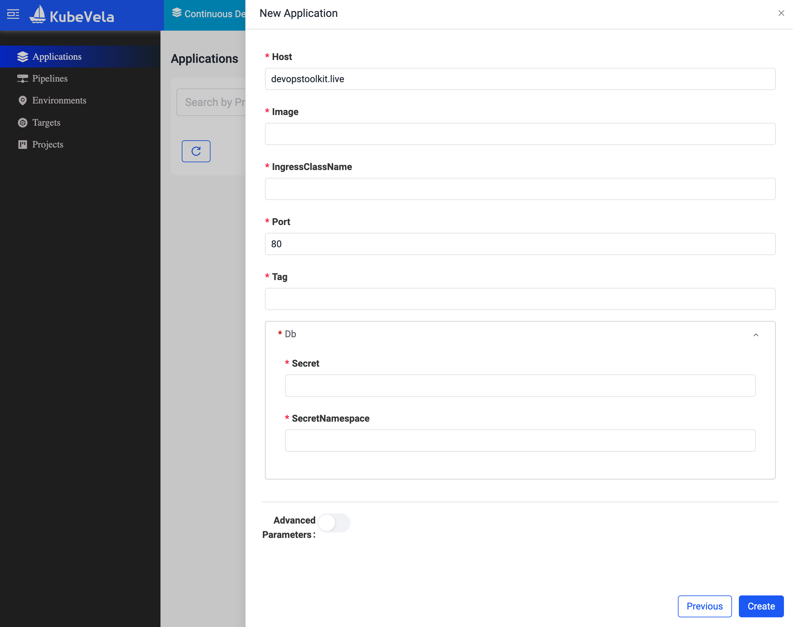

+++
title = 'KubeVela & OAM: The Resurrection of Simplified App Management?'
date = 2025-03-24T15:00:00+00:00
draft = false
+++

Imagine that you are building an Internal Developer Platform.

What would be a good user experience if, for example, one would like to deploy and manage a backend application without spending five years trying to understand all the details about Kubernetes?

<!--more-->



> If you are following along the instructions in this post, skip the commands in this section. This is only a preview of what's coming. We'll set up everything later.

How about saying `vela up` and passing only a few lines of YAML containing only the information that actually matters without dealing with low-level details?

```sh
vela up --file app.yaml
```

That's it. That's all there is to do.

Let's see what happened behind the scenes.

```sh
kubectl --namespace dev get all,ingresses
```

The output is as follows.

```
NAME                              READY   STATUS    RESTARTS   AGE
pod/silly-demo-864f6c8f8c-hxkwv   1/1     Running   0          3m6s

NAME                 TYPE        CLUSTER-IP     EXTERNAL-IP   PORT(S)    AGE
service/silly-demo   ClusterIP   10.96.77.159   <none>        8080/TCP   3m6s

NAME                         READY   UP-TO-DATE   AVAILABLE   AGE
deployment.apps/silly-demo   1/1     1            1           3m6s

NAME                                    DESIRED   CURRENT   READY   AGE
replicaset.apps/silly-demo-864f6c8f8c   1         1         1       3m6s

NAME                                             REFERENCE               TARGETS                                     MINPODS   MAXPODS   REPLICAS   AGE
horizontalpodautoscaler.autoscaling/silly-demo   Deployment/silly-demo   cpu: <unknown>/80%, memory: <unknown>/80%   1         5         1          3m6s

NAME                                   CLASS   HOSTS                             ADDRESS     PORTS   AGE
ingress.networking.k8s.io/silly-demo   nginx   dev.silly-demo.127.0.0.1.nip.io   localhost   80      3m6s
```

We got a `deployment`, which created a `replicaset` which created a `pod` that runs the actuall application. We also got a `service` in change of internal networking, a `horizontalpodautoscaler` that scales replicas of the app, and an `ingress` that is in charge of redirecting external traffic into the app.

That application was deployed into the dev environment. Now, let's say that we would like to promote it to production. All we'd have to do is to `resume` the `workflow`.

```sh
vela workflow resume silly-demo
```

Let's see what happened by listing all the resources, this time in the `prod` Namespace.

```sh
kubectl --namespace prod get all,ingresses
```

The output is as follows.

```
NAME                              READY   STATUS                       RESTARTS   AGE
pod/silly-demo-7bc9d88df7-4gzkd   0/1     CreateContainerConfigError   0          3m31s
pod/silly-demo-7bc9d88df7-vhxgm   0/1     CreateContainerConfigError   0          3m46s

NAME                 TYPE        CLUSTER-IP     EXTERNAL-IP   PORT(S)    AGE
service/silly-demo   ClusterIP   10.96.99.182   <none>        8080/TCP   3m46s

NAME                         READY   UP-TO-DATE   AVAILABLE   AGE
deployment.apps/silly-demo   0/2     2            0           3m46s

NAME                                    DESIRED   CURRENT   READY   AGE
replicaset.apps/silly-demo-7bc9d88df7   2         2         0       3m46s

NAME                                             REFERENCE               TARGETS                                     MINPODS   MAXPODS   REPLICAS   AGE
horizontalpodautoscaler.autoscaling/silly-demo   Deployment/silly-demo   cpu: <unknown>/80%, memory: <unknown>/80%   2         5         2          3m46s

NAME                                   CLASS   HOSTS                         ADDRESS     PORTS   AGE
ingress.networking.k8s.io/silly-demo   nginx   silly-demo.127.0.0.1.nip.io   localhost   80      3m46s
```

There are almost always some differences between dev and prod so we got a similar, yet not the same set of resources. For example, this time there are two Pods (`pod`) since we need high availability. the `ingress` host is different as well. More importantly, the app in production needs a database which we did not yet create. As a result, the Pods are failing since they are trying to mount a secret with database authentication and that secret does not yet exist.

Let's fix that by deploying a database server and everything it might need by executing `vela up`, passing it the manifest that is only a few lines of YAML, and making sure that we're doing it in the `prod` environment.

```sh
vela up --file db-google.yaml --env prod
```

That's it. That's all it took to deploy a backend application to both dev and prod as well as to get a database running in a hyperscaler of choice.

Here's a question though. How did I do all that and why did I do it the way I did?

## Open Application Model (OAM) and KubeVela (Revisited)

Let me start with a question. What do zombies, Jesus, and Open Application Model (OAM) have in common?

They were all resurrected from dead.

[OAM](https://oam.dev/), short for Open Application Model is an attempt to standardize application definitions. It's a spec that was born in Microsoft only to be abandoned shortly afterward. Microsoft made it, thought that it is a dead-end, and then it killed it. However, OAM did not stay dead for long. Then came Alibaba and resurected it from the dead, mainly through the [KubeVela](https://kubevela.io/) project. OAM is a spec and KubeVela is the implementation of that spec.

Back in the day, I thought that KubeVela was one of the most interesting and useful projects, especially for those building Internal Developer Platforms (IDPs). Since then I switched to other projects that perform similar functions and eventually settled down on Crossplane.

Nevertheless, KubeVela kept evolving and added a lot of very interesting features and capabilities. So, I went back to it in an attempt to figure out whether I made a wrong call. I wanted to see whether it ovecame the issues that compelled me to abandon it, whether I should come back to it, and whether its new ideas might be worth adding to other similar projects.

So, today's video is a walkthrough through KubeVela. We'll see what it does, what's old and what's new, whether you should adopt it or, if you are already using it, whether you should continue investing into it.

By the end of this video you will be equipped with knowledge that will help you make a decision whether to use KubeVela as one of the building blocks of your internal developer platform.

## Setup

```sh
git clone https://github.com/vfarcic/kubevela-demo-2

cd kubevela-demo-2
```

> Make sure that Docker is up-and-running. We'll use it to create a KinD cluster.

> Watch [Nix for Everyone: Unleash Devbox for Simplified Development](https://youtu.be/WiFLtcBvGMU) if you are not familiar with Devbox. Alternatively, you can skip Devbox and install all the tools listed in `devbox.json` yourself.

```sh
devbox shell
```

> Watch [The Future of Shells with Nushell! Shell + Data + Programming Language](https://youtu.be/zoX_S6d-XU4) if you are not familiar with Nushell. Alternatively, you can inspect the `dot.nu` script and transform the instructions in it to Bash or ZShell if you prefer not to use that Nushell script.

```sh
chmod +x dot.nu

./dot.nu setup

source .env
```

## Define KubeVela Components and Traits

To start working with KubeVela, we need to initialize an environment, so let's to just that with `dev`,...

```sh
vela env init dev --namespace dev
```

...and `prod`.

```sh
vela env init prod --namespace prod
```

Those environments are, essentially, Namespaces in Kubernetes.

Let's confirm that by listing all those in the cluster.

```sh
kubectl get namespaces
```

The output is as follows.

```
NAME                 STATUS   AGE
crossplane-system    Active   9m41s
default              Active   10m
dev                  Active   82s
ingress-nginx        Active   10m
kube-node-lease      Active   10m
kube-public          Active   10m
kube-system          Active   10m
kubevela             Active   3m44s
local-path-storage   Active   10m
prod                 Active   67s
vela-system          Active   5m3s
```

We can see the `dev` and `prod` are there. There is nothing really special about them, apart from a label *vela* put into them. We could have created them without the CLI.

The core of KubeVela are components that define all the base resources it will compose for us.

Here's an example.

```sh
cat component-app-backend.cue
```

The output is as follows.

```cue
"app-backend": {
    attributes: {
        workload: definition: {
            apiVersion: "apps/v1"
            kind:       "Deployment"
        }
        status: healthPolicy: "isHealth: (context.output.status.readyReplicas > 0) && (context.output.status.readyReplicas == context.output.status.replicas)"
    }
    type: "component"
}

template: {
    parameter: {
        image:               string
        tag:                 string
        port:                *80 | int
        host:                *"devopstoolkit.live" | string
        ingressClassName:    string
        db: secret:          string
        db: secretNamespace: string
    }
    output: {
        apiVersion: "apps/v1"
        kind:       "Deployment"
        metadata: labels: "app.kubernetes.io/name": context.name
        spec: {
            selector: matchLabels: "app.kubernetes.io/name": context.name
            template: {
                metadata: labels: "app.kubernetes.io/name": context.name
                spec: containers: [{
                    image: parameter.image + ":" + parameter.tag
                    livenessProbe: httpGet: {
                        path: "/"
                        port: parameter.port
                    }
                    name: "backend"
                    ports: [{ containerPort: 80 }]
                    readinessProbe: httpGet: {
                        path: "/"
                        port: parameter.port
                    }
                    resources: {
                        limits: {
                            cpu:    "250m"
                            memory: "256Mi"
                        }
                        requests: {
                            cpu:    "125m"
                            memory: "128Mi"
                        }
                    }
                    if parameter.db.secret != _|_ {
                        env: [{
                            name: "DB_ENDPOINT"
                            valueFrom: secretKeyRef: {
                                key:  "endpoint"
                                name: parameter.db.secret
                            }
                        }, {
                            name: "DB_PASSWORD"
                            valueFrom: secretKeyRef: {
                                key:  "password"
                                name: parameter.db.secret
                            }
                        }, {
                            name: "DB_PORT"
                            valueFrom: secretKeyRef: {
                                key:      "port"
                                name:     parameter.db.secret
                                optional: true
                            }
                        }, {
                            name: "DB_USERNAME"
                            valueFrom: secretKeyRef: {
                                key:  "username"
                                name: parameter.db.secret
                            }
                        }, {
                            name:  "DB_NAME"
                            value: context.name
                        }]
                    }
                }]
            }
        }
    }
    outputs: {
        service: {
            apiVersion: "v1"
            kind:       "Service"
            metadata: {
                name:   context.name
                labels: "app.kubernetes.io/name": context.name
            }
            spec: {
                selector: "app.kubernetes.io/name": context.name
                type: "ClusterIP"
                ports: [{
                    port:       parameter.port
                    targetPort: parameter.port
                    protocol:   "TCP"
                    name:       "http"
                }]
            }
        }
        ingress: {
            apiVersion: "networking.k8s.io/v1"
            kind:       "Ingress"
            metadata: {
                name:        context.name
                labels:      "app.kubernetes.io/name": context.name
                annotations: "ingress.kubernetes.io/ssl-redirect": "false"
            }
            spec: {
                if parameter.ingressClassName != _|_ {
                    ingressClassName: parameter.ingressClassName
                }
                rules: [{
                    host: parameter.host
                    http: paths: [{
                        path:     "/"
                        pathType: "ImplementationSpecific"
                        backend: service: {
                            name:         context.name
                            port: number: parameter.port
                        }
                    }]
                }]
            }
        }
    }
}
```

The first thing you'll notice is, for some, a strange syntax. Everything we define with KubeVela is written in CUE, which is a language built on top of Go aiming to make it easier to write complex configurations. It's a data-driven language that is both a superset of JSON and Go.

Over there we have `app-backend` which acts as a name of a `component`. The main resource it will manage is a `Deployment`.

Further down we have a `template` that defines all the parameters (`parameter`) and the resources (`output`) it will manage for us.

Think of it as Helm template that will be running in Kubernetes instead you laptop and that will create new API endpoints in Kubernetes API (sort of).

Over there, we have `image`, `tag`, `port`, `host`, `ingressClassName`, and `db` parameters, with `db` having two sub-parameters: `secret` and `secretNamespace`. Those will be parameters others will be defining when they use that component. Think of those as Helm values file, except that it will be available in Kubernetes API (kind of).

The `output` section contains the list of resources it will assemble for us. There is a `Deployment`, a `Service`, and an `Ingress`.

If you ignore the fact that it is written in CUE, those would be the same definitions you would normally write as YAML files. The major difference is that some of the values are templates. Some of those are using built-in values like `context.name`, while others are using parameters defined earlier. That would be, for example, `parameter.image` and `parameter.tag` which we're using to construct the `image` value for the Deployment.

All in all, if someone requests the `app-backend` component, KubeVela will create a `Deployment`, a `Service`, and an `Ingress` with the parameters we defined.

So far so good. Easy!

Now, let's apply that component and, by doing that, make it available to everyone else with everyone else being users of the platform we're building.

```sh
vela def apply component-app-backend.cue
```

That's it. From now on, our users can create and manage backend applications without having to deal with Deployments, Services, and Ingresses. We'll make it more complicated later but, for now, that's it.

Okay. Now that we created Backend-App-as-a-Service, let's see how can users know what to do with it.

One option is to go to the KubeVela UI, which we'll explore later. Another option is to use the CLI to `show` the information about the component.

```sh
vela show app-backend
```

The output is as follows.

```
# Specification
+------------------+-------------+-----------+----------+--------------------+
|       NAME       | DESCRIPTION |   TYPE    | REQUIRED |      DEFAULT       |
+------------------+-------------+-----------+----------+--------------------+
| image            |             | string    | true     |                    |
| tag              |             | string    | true     |                    |
| port             |             | int       | false    |                 80 |
| host             |             | string    | false    | devopstoolkit.live |
| ingressClassName |             | string    | true     |                    |
| db               |             | [db](#db) | true     |                    |
+------------------+-------------+-----------+----------+--------------------+


## db
+-----------------+-------------+--------+----------+---------+
|      NAME       | DESCRIPTION |  TYPE  | REQUIRED | DEFAULT |
+-----------------+-------------+--------+----------+---------+
| secret          |             | string | true     |         |
| secretNamespace |             | string | true     |         |
+-----------------+-------------+--------+----------+---------+
```

We can see the `Specification` with the same fields we defined in the component. Since `db` has some sub-fields, they are listed separately (`## db`).

We can also list all the `componentdefinitions` in the cluster.

```sh
kubectl --namespace vela-system get componentdefinitions
```

The output is as follows.

```
NAME          WORKLOAD-KIND   DESCRIPTION
app-backend   Deployment      
cron-task                     Describes cron jobs that run code or a script to completion.
daemon        DaemonSet       Describes daemonset services in Kubernetes.
k8s-objects                   K8s-objects allow users to specify raw K8s objects in properties
raw                           Raw allow users to specify raw K8s object in properties. This definition is DEPRECATED, please use 'k8s-objects' instead.
ref-objects                   Ref-objects allow users to specify ref objects to use. Notice that this component type have special handle logic.
task          Job             Describes jobs that run code or a script to completion.
webservice    Deployment      Describes long-running, scalable, containerized services that have a stable network endpoint to receive external network traffic from customers.
worker        Deployment      Describes long-running, scalable, containerized services that running at backend. They do NOT have network endpoint to receive external network traffic.
```

We can see that there are some pre-defined components available, as well as the `app-backend` we just created.

Finally, let's list Kubernetes `crds` related to `oam`.

```sh
kubectl get crds | grep oam
```

The output is as follows.

```
applicationrevisions.core.oam.dev    2025-02-14T01:17:06Z
applications.core.oam.dev            2025-02-14T01:17:06Z
componentdefinitions.core.oam.dev    2025-02-14T01:17:06Z
definitionrevisions.core.oam.dev     2025-02-14T01:17:06Z
policies.core.oam.dev                2025-02-14T01:17:06Z
policydefinitions.core.oam.dev       2025-02-14T01:17:06Z
resourcetrackers.core.oam.dev        2025-02-14T01:17:06Z
traitdefinitions.core.oam.dev        2025-02-14T01:17:06Z
workflows.core.oam.dev               2025-02-14T01:17:06Z
workflowstepdefinitions.core.oam.dev 2025-02-14T01:17:06Z
workloaddefinitions.core.oam.dev     2025-02-14T01:17:06Z
```

As a side note, KubeVela is an implementation of the Open Application Model (OAM) specification. That's why we filtered the CRDs with *oam*.

Here's the first, in my opinion, issue we are facing with KubeVela. It does not create new CRDs. Whatever we do is always implemented as `applications.core.oam.dev`. That makes discovery harder than it should be. I would have expected a new CRD called, let's say, *AppBackend* or something like that. If we would get that, we could "discover" the schema for that specific resource, we could tell Backstage, or whichever UI you're using as a platform portal, to fetch that schema and generate fields for that resource. We could do many other things, but we can't since it is always *Application* CRD no matter what we do. That's a pity.

Nevertheless, from now on, users would be able to manage their backend applications using the component we created, but there's more. We might want to add additional traits to the component.

Let's say that we would like to enable users to decide whether their applications should scale horizontally. Since that would be an optional feature, we cannot add it to our component directly. If we would, scaling would be enabled all the time, making it mandatory.

KubeVela has the concept of Traits which are a way to add optional features to a component. Here's an example.

```sh
cat trait-scaler.cue
```

The output is as follows.

```cue
scaler: {
    attributes: {
        podDisruptive: false
    }
    type: "trait"
}

template: {
    parameter: {
        min: *1 | int
        max: *10 | int
    }
    outputs: {
        hpa: {
            apiVersion: "autoscaling/v2"
            kind: "HorizontalPodAutoscaler"
            metadata: {
                name:   context.name
                labels: "app.kubernetes.io/name": context.name
            }
            spec: {
                scaleTargetRef: {
                    apiVersion: "apps/v1"
                    kind:       "Deployment"
                    name:       context.name
                }
                minReplicas: parameter.min
                maxReplicas: parameter.max
                metrics: [{
                    type: "Resource"
                    resource: {
                        name: "cpu"
                        target: {
                            type: "Utilization"
                            averageUtilization: 80
                        }
                    }
                }, {
                    type: "Resource"
                    resource: {
                        name: "memory"
                        target: {
                            type: "Utilization"
                            averageUtilization: 80
                        }
                    }
                }]
            }
        }
    }
}
```

This time we are defining a `scaler`. Unlike the previous definition, this one is a `trait`. Traits are a way to optionally attach additional resources to a component.

In this case, it defines parameters `min` and `max`, both with default values. Those who attach that trait will be able to specify the minimum and the maximum number of replicas which will scale automatically between those two numbers.

Further on, the we have a `HorizontalPodAutoscaler` resource which will be created when someone attaches that trait to a component.

Let's apply it.

```sh
vela def apply trait-scaler.cue
```

That's about it, for now. We have a backend application that will compose a *Deployment*, a *Service*, and an *Ingress*, and, optionally, have a *HorizontalPodAutoscaler*.

Let's see how it all works.

## Use KubeVela Components and Traits

Now we'll see how developers can use KubeVela to create and manage their applications.

To begin with, we'll set `dev` to be the current environment.

```sh
vela env set dev
```

From now on, we, as developers, will be using `dev` environment and can manage backend applications either from the Web UI or using the CLI.



If we open the KubeVela UI, we'll see the home page where nothing is happening just yet. From there on, we can select to create `New Application` that opens a new modal split into two sections. First, there are common atributes like the `Name` and the `Description` that apply to all Kubevela Applications. The important part, in this scenario, is to select the `app-backend` component we applied earlier.



If we proceed to the next step, we can fill in the fields that are specific to the component we selected. Those are exactly the same parameters as those we defined in the component earlier.



You can probably guess what happens next. If you can't... Well... Tough luck since we'll switch to the terminal. Looking at graphical user interfaces for too long hurts my eyes. A second reason for moving away from the UI is that it does not allow us to specify everything we can define ourselves, so off we go into the darkness of my terminal.

Here's an example of a YAML.

```sh
cat app.yaml
```

The output is as follows (truncated for brevity).

```yaml
apiVersion: core.oam.dev/v1beta1
kind: Application
metadata:
  name: silly-demo
spec:
  components:
  - name: silly-demo
    type: app-backend
    properties:
      image: ghcr.io/vfarcic/silly-demo
      tag: 1.4.343
      port: 8080
      host: silly-demo.127.0.0.1.nip.io
      ingressClassName: nginx
    traits:
    - type: scaler
      properties:
        min: 2
        max: 5
  policies:
  ...
  workflow:
    ...
```

There's a lot to digest here, so let's break it down.

To begin with, we are defining an `Application` resource. As I already mentioned, we cannot create our own CRDs with KubeVela, and that's a pity. Instead, it's always an *Application* resource.

The `spec` is split into multiple sections. There are `components`, `policies`, and `workflow`.

The last time I used KubeVela, probably a few years ago, there were only `components`, so this is very exciting for me.

Using Components is straightforward. We specify the `name`, the `type`, `properties`, and `traits`.

The name is probably self-explanatory while the type is whatever we defined it to be when we created the component.

Properties are essentially the parameters we defined in the component which will be used to compose the resources.

Traits are optional. In this case, we are specifying that we would like to add the `scaler` to the mix.

None of the things we explored so far are new. What comes next are capabilities that did not exist the last time I used KubeVela. Now comes the existing part.

## KubeVela Policies and Workflows

Let's continue exploring the definition of the application.

```sh
cat app.yaml
```

The output is as follows (truncated for brevity).

```yaml
apiVersion: core.oam.dev/v1beta1
kind: Application
metadata:
  name: silly-demo
spec:
  ...
  policies:
  - name: target-dev
    type: topology
    properties:
      namespace: dev
  - name: host-dev
    type: override
    properties:
      components:
      - type: app-backend
        properties:
          host: dev.silly-demo.127.0.0.1.nip.io
  - name: target-prod
    type: topology
    properties:
      namespace: prod
  - name: scaler-dev
    type: override
    properties:
      components:
      - type: app-backend
        traits:
        - type: scaler
          properties:
            min: 1
  - name: db-prod
    type: override
    properties:
      components:
      - type: app-backend
        properties:
          db:
            secret: silly-demo-db
  workflow:
    steps:
    - name: deploy-to-dev
      type: deploy
      properties:
        policies:
        - target-dev
        - host-dev
        - scaler-dev
    - name: promotion
      type: suspend
    - name: deploy-to-prod
      type: deploy
      properties:
        policies:
        - target-prod
        - db-prod
```

KubeVela policies are not what you might expect. They are not policies that define what can and what cannot be done like, for example, Kyverno policies. Instead, they are a way to modify the application before it is deployed.

The first policy is of type `topology`. It is used to specify the destination of the application which, in this case, is `namespace` dev.

The second policy is of type `override` which can be used to modify properties of a component or a trait. In this case, we're saying that the `host` parameter should be `dev.silly-demo.127.0.0.1.nip.io`.

Then we have yet another `topology` that will deploy the application to `prod` namespace.

The fourth one will reduce the `min` number of replicas of the `scaler` *trait* to *1*.

Finally, the last policy will `override` the `db.secret` property.

In this particular case, those policies allow us to have variations between the resources that will be composed in different environments given that dev and prod are similar, yet not identical.

Now, the important thing to note is that none of those policies do anything by themselves. Policies are applied through the `workflow`, which we'll explore next.

Let's see the `workflow` part of the definition of that application.

```sh
cat app.yaml
```

The output is as follows (truncated for brevity).

```yaml
apiVersion: core.oam.dev/v1beta1
kind: Application
metadata:
  name: silly-demo
spec:
  ...
  workflow:
    steps:
    - name: deploy-to-dev
      type: deploy
      properties:
        policies:
        - target-dev
        - host-dev
        - scaler-dev
    - name: promotion
      type: suspend
    - name: deploy-to-prod
      type: deploy
      properties:
        policies:
        - target-prod
        - db-prod
```

That `workflow` has three steps. The first one will deploy the application to `dev` environment but, before it does that, it will modify the application by applying `target-dev`, `host-dev`, and `scaler-dev` policies.

Once it's done with the deployment to dev, it will `suspend` the workflow and wait for someone to resume it.

Once the workflow is resumed, it will `deploy-to-prod` environment but, just as with dev, it will modify the application by applying `target-prod` and `db-prod` policies.

As a result of that workflow, dev and prod will be different and a manual approval will be required to promote the application from dev to prod.

On the first look, the idea of having policies and workflows feels like a very useful addition to KubeVela. Yet, I think it is silly. I think that the implementation is just wrong. Something that was supposed to be easy for people to consume all of a sudden turned itself into something complicated.

We'll talk about that later. For now, imagine that I did not say anything. Fill yourself with happy thoughts, and let's move on.

## KubeVela in Action

Let's apply that Application definition and see what we'll get.

```sh
vela up --file app.yaml
```

To be clear, we could have created that Application from the Web UI. Similarly, we can observe it in the UI as well, but we won't. We'll stick with the terminal.

We can get all the `applications` in the `dev` Namespace. 

```sh
kubectl --namespace dev get applications
```

The output is as follows.

```
NAME         COMPONENT    TYPE          PHASE                HEALTHY   STATUS   AGE
silly-demo   silly-demo   app-backend   workflowSuspending   true               2m41s
```

The only thing I want you to draw your attention to is the `PHASE` column currently set to `workflowSuspending`. If you remember the definition we explored ealier, it was to be expected for it to go into some kind of a hibernatition after composing the resources in the dev Namespace. That's what we defined in the workflow.

The interesting part is what that application composed.

```sh
kubectl --namespace dev get all,ingresses
```

The output is as follows (truncated for brevity).

```
NAME                            READY STATUS  RESTARTS AGE
pod/silly-demo-864f6c8f8c-hxkwv 1/1   Running 0        3m6s

NAME               TYPE      CLUSTER-IP   EXTERNAL-IP PORT(S)  AGE
service/silly-demo ClusterIP 10.96.77.159 <none>      8080/TCP 3m6s

NAME                       READY UP-TO-DATE AVAILABLE AGE
deployment.apps/silly-demo 1/1   1          1         3m6s

NAME                                  DESIRED CURRENT READY AGE
replicaset.apps/silly-demo-864f6c8f8c 1       1       1     3m6s

NAME                 REFERENCE     TARGETS               MINPODS MAXPODS REPLICAS AGE
horizontalpodauto... Deployment... cpu: ..., memory: ... 1       5       1        3m6s

NAME                                 CLASS HOSTS             ADDRESS   PORTS AGE
ingress.networking.k8s.io/silly-demo nginx dev.silly-demo... localhost 80    3m6s
```

There's a `deployment` which created the `replicaset` which created the `pod`. We also got a `service`, and an `ingress`. Those are all pieces of the Component we're using. On top of that, since we chose to add the *scaler* trait we got a `hirozontalpodautoscaler` as well.

We might also want to pay attention to the Ingress `HOST`. It is set to `dev.silly-demo` because the workflow step that deployed the app to the dev environment applied one of the policies that changed the host.

Now, to be 100% clear, so far, we deployed some resources to the dev Namespace and we suspended the execution of the workflow. Nothing was deployed to production so far. Capiche?

If we ever get confused what's going on and what happened so far, we can always ask for the current status.

```sh
vela status silly-demo
```

The output is as follows.

```
About:

  Name:         silly-demo
  Namespace:    dev
  Created at:   2025-02-14 02:48:25 +0100 CET
  Status:       workflowSuspending

Workflow:

  mode: StepByStep-DAG
  finished: false
  Suspend: true
  Terminated: false
  Steps
  - id: 78w3ucqvxk
    name: deploy-to-dev
    type: deploy
    phase: succeeded
  - id: 6yg9ukgvav
    name: promotion
    type: suspend
    phase: suspending
    message: Suspended by field suspend

Services:

  - Name: silly-demo
    Cluster: local  Namespace: dev
    Type: app-backend
    Healthy
    Traits:
      ✅ scaler
```

The workflow deployed to dev (`deploy-to-dev`) and, after that, it suspended the `promotion`. As for `Services`, we're running `app-backend` only in the `dev` `Namespace` (for now).

If we would like to see which resources were composed, we can output the `status` in the `tree` format.

```sh
vela status silly-demo --tree
```

The output is as follows.

```
CLUSTER       NAMESPACE     RESOURCE                           STATUS
local     ─── dev       ─┬─ Service/silly-demo                 updated
                         ├─ Deployment/silly-demo              updated
                         ├─ HorizontalPodAutoscaler/silly-demo updated
                         └─ Ingress/silly-demo                 updated
```

That KubeVela Application composed a `Service`, a `Deployment`, a `HorizontalPodAutoscaler`, and an `Ingress`. We knew all that already. Nevertheless, it is nice to know that we can list all the resources managed by a KubeVela Application.

Now that dev is up and running, we would normally run some tests, do some manual reviews, or anything else we might need to be doing. It is unclear how would KubeVela trigger those processes. We might want to use *HTTPDo* workflow step to trigger some other processes that would do whatever we need to be done. We might also execute *Apply* workflow step to apply some other resources that would run tests or whatever we need to be done.

It is certainly doable to connect KubeVela workflows with other workflows, but that does not seem to be thought through. I feel that the assumption is that KubeVela workflows themselves are sufficient, which is certainly not the case.

I'll leave that as an exercise for you and assume that we validated the release in the dev environment and that we are ready to promote it to prod.

```sh
vela workflow resume silly-demo
```

Let's check the status again.

```sh
vela status silly-demo --tree
```

The output is as follows.

```
CLUSTER       NAMESPACE     RESOURCE                           STATUS
local     ─┬─ dev       ─┬─ Service/silly-demo                 updated
           │             ├─ Deployment/silly-demo              updated
           │             ├─ HorizontalPodAutoscaler/silly-demo updated
           │             └─ Ingress/silly-demo                 updated
           └─ prod      ─┬─ Service/silly-demo                 updated
                         ├─ Deployment/silly-demo              updated
                         ├─ HorizontalPodAutoscaler/silly-demo updated
                         └─ Ingress/silly-demo                 updated
```

We can see that, this time, we got the release not only in the `dev` Namespace but also in `prod`.

We can confirm that further by listing all the resources in the `prod` Namespace.

```sh
kubectl --namespace prod get all,ingresses
```

The output is as follows (truncated for brevity).

```
NAME                            READY STATUS                     RESTARTS AGE
pod/silly-demo-7bc9d88df7-4gzkd 0/1   CreateContainerConfigError 0        3m31s
pod/silly-demo-7bc9d88df7-vhxgm 0/1   CreateContainerConfigError 0        3m46s

NAME               TYPE      CLUSTER-IP   EXTERNAL-IP PORT(S)  AGE
service/silly-demo ClusterIP 10.96.99.182 <none>      8080/TCP 3m46s

NAME                       READY UP-TO-DATE AVAILABLE AGE
deployment.apps/silly-demo 0/2   2          0         3m46s

NAME                                  DESIRED CURRENT READY AGE
replicaset.apps/silly-demo-7bc9d88df7 2       2       0     3m46s

NAME                 REFERENCE     TARGETS               MINPODS MAXPODS REPLICAS AGE
horizontalpodauto... Deployment... cpu: ..., memory: ... 2       5       2        3m46s

NAME                                 CLASS HOSTS             ADDRESS   PORTS AGE
ingress.networking.k8s.io/silly-demo nginx dev.silly-demo... localhost 80    3m6s
```

There we go. We promoted the application from dev to prod and, while doing that, we made slight changes to the resources through policies.

That being said, the Pods are not running. Kubernetes complains that their status is `CreateContainerConfigError`. Those Pods are trying to mount a Secret that provides credentials to the database and, since we did not yet deploy the database, the Secret does not exist.

Let's fix that with a new Component definition.

> The outputs you'll see in the rest of this post are based on databases in Google Cloud. If you followed alone with the instructions, you might see the different outputs if you chose AWS or Azure.

Here's the definition of the database Component.

```sh
cat component-db-$HYPERSCALER.cue
```

The output is as follows.

```cue
import "encoding/base64"

"db-google": {
    attributes: {
        workload: definition: {
            apiVersion: "sql.gcp.upbound.io/v1beta1"
            kind:       "DatabaseInstance"
        }
    }
    type: "component"
}

template: {
    parameter: {
        region:  *"us-east1" | string
        size:    *"small" | string
        version: string
    }
    output: {
        apiVersion: "sql.gcp.upbound.io/v1beta1"
        kind: "DatabaseInstance"
        metadata: {
            name:   context.name + "-" + context.namespace
            labels: "app.kubernetes.io/name": context.name
        }
        spec: {
            forProvider: {
                region:          parameter.region
                databaseVersion: "POSTGRES_" + parameter.version
                rootPasswordSecretRef: {
                    name:      context.name + "-password"
                    namespace: context.namespace
                    key:       "password"
                }
                settings: [{
                    if parameter.size == "small" {
                        tier: "db-custom-1-3840"
                    }
                    if parameter.size == "medium" {
                        tier: "db-custom-16-61440"
                    }
                    if parameter.size == "large" {
                        tier: "db-custom-64-245760"
                    }
                    availabilityType: "REGIONAL"
                    backupConfiguration: [{
                        enabled:          true
                        binaryLogEnabled: false
                    }]
                    ipConfiguration: [{
                        ipv4Enabled: true
                        authorizedNetworks: [{
                            name:  "all"
                            value: "0.0.0.0/0"
                        }]
                    }]
                }]
                deletionProtection: false
            }
        }
    }
    outputs: {
        #Metadata: {
            name:   context.name + "-" + context.namespace
            labels: "app.kubernetes.io/name": context.name
        }
        user: {
            apiVersion: "sql.gcp.upbound.io/v1beta1"
            kind:       "User"
            metadata:   #Metadata
            spec: {
                deletionPolicy: "Orphan"
                forProvider: {
                passwordSecretRef: {
                    name:      context.name + "-password"
                    namespace: context.namespace
                    key:       "password"
                }
                instanceRef: name: context.name + "-" + context.namespace
                }
            }
        }
        secret: {
            apiVersion: "kubernetes.crossplane.io/v1alpha2"
            kind:       "Object"
            metadata:   #Metadata
            spec: {
                references: [{
                    patchesFrom: {
                        apiVersion: "sql.gcp.upbound.io/v1beta1"
                        kind:       "User"
                        name:       context.name + "-" + context.namespace
                        namespace:  "crossplane-system"
                        fieldPath:  "metadata.name"
                    }
                    toFieldPath: "stringData.username"
                }, {
                    patchesFrom: {
                        apiVersion: "v1"
                        kind:       "Secret"
                        name:       context.name + "-password"
                        namespace:  context.namespace
                        fieldPath:  "data.password"
                    }
                    toFieldPath: "data.password"
                }, {
                    patchesFrom: {
                        apiVersion: "sql.gcp.upbound.io/v1beta1"
                        kind:       "DatabaseInstance"
                        name:       context.name + "-" + context.namespace
                        namespace:  "crossplane-system"
                        fieldPath:  "status.atProvider.publicIpAddress"
                    }
                    toFieldPath: "stringData.endpoint"
                }]
                forProvider: manifest: {
                    apiVersion: "v1"
                    kind:       "Secret"
                    metadata: {
                        name:      context.name
                        namespace: context.namespace
                    }
                    data: port: "NTQzMg=="
                }
            }
        }
    }
}
```

That Component follows the same pattern as the previous one. The major difference is that, this time, we are not composing core Kubernetes resources but, instead, are combining custom resources that will, ultimately, create a `DatabaseInstance` in Google Cloud as the main resource, and a `User` and a `Secret` as the other resources. We're using Crossplane Managed Resources for that, for two reasons. First of all, we are trying to manage a database in a hyperscaler like Google Cloud. We could have accomplished the same with other operators like Google Config Connector or AWS Controllers for Kubernetes (ACK), or Azure something something, or anything else. That brings me to the second reason. I wanted to prove that competing tools can be combined. We are using KubeVela in the similar capacity as Crossplane Compositions, but, since KubeVela does not have something simliar to Crossplane Managed Resources, we are combining the two.

Now, to be clear, KubeVela does support the usage of Terraform, but that is just silly. I have nothing against Terraform in general. I think it's great and that it changed the industry in many ways. However, Terraform does not work well inside Kubernetes. I won't go into details why I think so since that would result in a complete derailement from the main subject.

The resources we are composing are customizable through parameters `region`, `size`, and `version`. Those should, hopefully, be self-explanatory.

Let's apply that Component.

```sh
vela def apply component-db-$HYPERSCALER.cue
```

From now on, whenever a developer, or anyone else, needs a database, they can create a KubeVela Application that uses that Component.

We'll see that in action in a moment. But, before we do that, since the Component we just saw assumes that there is a Secret with the root password to the database, we'll create that Secret first.

```sh
kubectl --namespace prod apply --filename db-$HYPERSCALER-password.yaml
```

To be honest, that is not something anyone should do. Instead, we should have stored that password in a Secrets Store and pulled it with something like External Secret Operator (ESO). However, that would also derail us from the main subject and, at the same time, I was too lazy to add it to this demo, so we did what should never be done and created the Secret directly.

Now a developer, or anyone else, can define the Application that uses the Component. Here's an example.

```sh
cat db-$HYPERSCALER.yaml
```

The output is as follows.

```yaml
apiVersion: core.oam.dev/v1beta1
kind: Application
metadata:
  name: silly-demo-db
spec:
  components:
  - name: silly-demo-db
    type: db-google
    properties:
      region: us-east1
      size: small
      version: "13"
```

That's easy, isn't it? We define an `Application` that uses the `db-google` Component with the `region` set to `us-east1`, the `size` set to `small`, and the `version` set to `13`. That manifest contains all the information needed to create the resources and is the right level of abstraction for a person that does not want to know everything required to run a database in a hyperscaler.

Now that a user of the platform defined the Application, all they have to do to make it real is to apply it,...

```sh
vela up --file db-$HYPERSCALER.yaml --env prod
```

...and check the status.

```sh
vela status silly-demo-db --env prod
```

The output is as follows.

```
About:

  Name:         silly-demo-db
  Namespace:    prod
  Created at:   2025-02-14 03:02:07 +0100 CET
  Status:       running

Workflow:

  mode: DAG-DAG
  finished: true
  Suspend: false
  Terminated: false
  Steps
  - id: 2mfchdel4w
    name: silly-demo-db
    type: apply-component
    phase: succeeded

Services:

  - Name: silly-demo-db
    Cluster: local  Namespace: prod
    Type: db-google
    Healthy
    No trait applied
```

That status is not actually useful since it does not show the status of all the composed resources nor the overall status of the Application. That can be fixed with *healthPolicy*, but would require a lot of work, especially on more complex setups. So, it's possible, but not necessarily something many will do due to the increased complexity.

Next, we should wait for a while until all the resources are operational in whichever hyperscaler we chose.

After a while we can list them with the following command.

```sh
kubectl get managed
```

The output is as follows (truncated for brevity).

```
NAME                                KIND   PROVIDERCONFIG SYNCED READY AGE
object.kubernetes.crossplane.io/... Secret default        False        5m34s

NAME                                    SYNCED READY EXTERNAL-NAME      AGE
databaseinstance.sql.gcp.upbound.io/... True   True  silly-demo-db-prod 5m34s

NAME                                       SYNCED READY EXTERNAL-NAME      AGE
user.sql.gcp.upbound.io/silly-demo-db-prod True   True  silly-demo-db-prod 5m34s
```

We can see that all the resources are `READY`, so we can proceed.

> If, in your case, some of the resources are not `READY`, and you are following along, you should wait for a while longer before proceeding.

Let's get back to the first resource we applied, the one that composes backend application, and check whether the Pods are now running.

```sh
kubectl --namespace prod get all
```

The output is as follows (truncated for brevity).

```
NAME                              READY   STATUS    RESTARTS   AGE
pod/silly-demo-7bc9d88df7-4gzkd   1/1     Running   0          14m
pod/silly-demo-7bc9d88df7-vhxgm   1/1     Running   0          14m
...
```

We can see that the Pods are now `Running`. They were failing before because they were trying to mount a secret with database credentials which did not exist. Now that we applied the database as well which, in turn, created that secret, the Pods are running. Hurray!

That's it. We got two KubeVela Components that compose resources in different ways. One is managing databases in hyperscalers while the other is managing backend applications in Kuberentes clusters with those apps being connected to those databases. Platform users can easily define what they want without the clutter of the underlying low-level resources.

Does everything we saw so far make sense? Let's talk about it.

## KubeVela Pros and Cons

It's very hard for me to put my finger on KubeVela. It's as if the direction of every important feature is the correct one, yet we somehow end up in a wrong place. I think that's just as valid for *Application* spec as for policies, workflows, and integrations. I'll get back to that in a moment. For now, let's talk about pros and cons, starting with those I don't like.

**Cons**
* No Discoverable Schemas
* Policies and Workflows
* Poor Integrations
* Only CUE

I don't understand why KubeVela insists on having a single CRD *Application*. As it is now, there is no reliable schema. An Application can have any number of components which, in turn, can have any number of traits, and none of that is enforced at the Kubernetes API level but, rather, through the KubeVela CLI and engine. As a result, other tools cannot easily deduce what is what, how to use it, what the schema is, and so on and so forth. KubeVela would improve greatly if it would adopt a model where we would be able to create new CRDs like *backend-app*, *db*, or anything else. Whether that would mean removal of the Application model, the OAM, in favor or working directly with Components or something else is beyond me. What matters is that it does not make sense to insist on pre-defined Application CRD when it's so easy to create new ones. As it is now, KubeVela **does not provide discoverable schemas**, and that's a pity.

**Policies and workflows** are conceptually great. Other tools in that area would benefit greatly from having something similar to what KubeVela has. I do believe that Crossplane and kro, to name a few, should add capabilities that serve the same objectives. That being said, both fail at the fundamental levels. The primary value of tools like KubeVela is the ability to create our own abstractions and simplify lives of those who will use such abstractions. KubeVela does that pretty well with Application, Components, and Traits, yet, when it comes to policies and workflows, it chose to completely change the direction. All of a sudden, low level details are not abstracted any more but moved to the forefront. Now, that's not something necessarily bad. Some users like dealing with low-level details, while some don't. The problem is that KubeVela end-users don't. If they do, they picked a wrong tool. It's all about one team, call it platform engineers, building Components and Traits while everyone else uses them. Then, all of a sudden, it all falls apart with Policies and Workflows. All of a sudden, roles are inverted so those building services are, mostly, doing nothing, while those consuming them are dealing with low-level details. KubeVela should have done with Policies and Workflows the same as what they did with Components and Traits. Move them to the server-side and expose parts that matter to end-users.

There is very **poor integration** between KubeVela and other tools from the ecosystem, which is probably why KubeVela is building its own, often as poor replacements for what we already have. Here's an example. With a single CRD *Application* serving potentially infinite number of permutations it is close to impossible to define server-side policies like those we typically do with Kyverno. There isn't much we can do on the Admission Controller level if everything is the same resource and there is no schema. Kyverno will not work, unless in very simple scenarios, but that's only one out of many. You'll have trouble using KubeVela with Argo CD, you'll face challenges trying to observe Applications through metrics from, let's say, Prometheus, and so on and so forth. Simply put, KubeVela ignores quite a few Kubernetes "rules" making it very hard to combine it with the rest of the ecosystem that follows those same rules. That could be the biggest downside given that the ability for everything to work with anything else is one of the main advantages of Kubernetes. KubeVela tries to solve that not by trying to make itself closer to what is expected from Kubernetes-native apps, but by building it's own ecosystem. That feels like a waste of time.

KubeVela supports **only CUE**. Now, to be clear, I think that CUE is great. It is one of my favorite languages when it comes to defining the state of something. Still, the fact is that CUE is nowhere near as widely adopted as it should be. If CUE is what you like and everyone else in your organization agrees with that, great. But, if that's not the case, KubeVela is a non-starter. There was a period when quite a few projects were formed around the idea that CUE is going to dominate the world. Most of them failed and, as a result, either stopped existings or, more often than not, recorgnized the need to support other languages. CUE is great, but is also a niche language and, as long as that keeps being the case, it is not a good idea to make it the only choice.

There are other issues which we won't dive into today. Those that I mentioned are, in my opinion, fundamental and not something that can be fixed with a bit of polish. Others are less important.

Let's see what's good about it.

**Pros**
* CLI
* Web UI
* Policies and Workflows

To begin with, *vela* **CLI** is fantastic. It is truly great. It, in a way, shows how necessity often produces something great. Given that KubeVela itself does not work well with the rest of the ecosystem, we cannot rely on other tools, those we typically use, to help us with it. Typically, I would expect to be able to do everything with *kubectl* with any additional tool making it more convenient. With KubeVela CLI, it is not about it being more convenient but, rather, often being the only option. That's the necessity I mentioned earlier. As a result of that necessity, the team was forced to pay extra attention to the CLI. It's really great. Big thumbs up.

**Web UI** is, more or less, great. It is certainly better than what we get in competing projects like Crossplane and kro. That could be it's biggest selling point, given that graphical user interfaces are the most common ways end-users interact with services.

Finally, there are **policies and workflows**. That might sound confusing since I put those into cons. I was very negative towards KubeVela implementation of policies and workflows, but I do give them a credit for having them. If there is anything other tools in that space should learn from KubeVela are two things. We need something like policies and workflows integrated into Compositions in case of Crossplane and Resource Groups in case of kro. Second, we should not implement them in the same way as in KubeVela. That being said, for now, KubeVela gets thumbs-up for having policies and workflows baked in.

All in all, I do think that Open Application Model (OAM) is broken on a very fundamental level. KubeVela as a project is great and, in many ways is leading in certain area. Yet, the project itself is being dragged down by the issues in the OAM model. I feel that KubeVela is trying to break away from it, but is unsure how to do it.

All that being said, KubeVela is a great way to create services for developer platforms and I encourage you to try it out if you haven't already.

## Destroy

```sh
vela delete silly-demo-db --yes --wait --env prod

vela delete silly-demo --yes --wait

./dot.nu destroy $HYPERSCALER

exit
```

